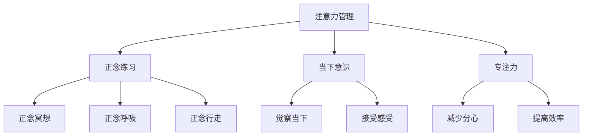

                 

# 注意力管理与正念练习：通过当下增强专注力和心灵清晰度

> 关键词：注意力管理, 正念练习, 专注力, 心灵清晰度, 当下, 实践方法, 理论基础, 心理学, 神经科学

## 1. 背景介绍

### 1.1 问题由来

在快节奏的现代社会中，注意力管理和正念练习成为越来越多人追求的焦点。随着信息爆炸和数字化的持续深入，人们的注意力容易被分散，无法专注于当下，难以获得心灵上的清晰和安宁。这种注意力管理的不足，不仅影响了工作效率和生活质量，还可能引发各种心理问题，如焦虑、抑郁等。

正念练习，作为一种强调当下意识和自我觉察的心理学方法，近年来在心理治疗和日常练习中得到了广泛应用。它通过练习觉察和接受当下的感受，帮助个体提升自我认知和情绪调节能力。研究表明，正念练习不仅可以提升个体的心理健康，还能显著改善工作效率和认知性能。

然而，注意力管理与正念练习如何结合，通过科学的方法和工具，实现对当下注意力的有效管理和心灵的深度清晰，仍是一个值得深入探讨的问题。本文将从理论基础、实践方法、实际应用等方面，系统介绍注意力管理与正念练习，探索其通过当下增强专注力和心灵清晰度的方法。

### 1.2 问题核心关键点

1. **注意力管理**：通过科学方法和工具，帮助个体提升注意力集中度，减少分心，提高工作效率和生活质量。
2. **正念练习**：通过觉察和接受当下感受，提升个体自我认知和情绪调节能力，获得心灵上的清晰和安宁。
3. **结合方法**：探索注意力管理与正念练习的有效结合方式，通过当下增强专注力和心灵清晰度。
4. **实践工具**：介绍一些科学且实用的工具和方法，如注意力训练应用、正念冥想应用等，辅助个体进行练习。

### 1.3 问题研究意义

研究注意力管理与正念练习的结合方法，对于提升个体的注意力集中度和心理健康，提高工作效率和生活质量，具有重要意义：

1. **心理健康**：正念练习通过培养对当下感受的觉察和接受，有助于缓解焦虑、抑郁等心理问题，提升整体幸福感。
2. **工作效率**：通过提高注意力集中度，个体在处理任务时更加专注，减少错误和遗漏，提升工作效率。
3. **生活质量**：正念练习有助于个体在面对生活压力和挑战时保持平和心态，提高生活质量。
4. **社会价值**：通过普及注意力管理和正念练习，减少心理问题发生率，提升社会整体福祉。

## 2. 核心概念与联系

### 2.1 核心概念概述

为更好地理解注意力管理与正念练习的结合方法，本节将介绍几个密切相关的核心概念：

- **注意力管理(Attention Management)**：指通过科学方法和工具，帮助个体提升注意力集中度和减少分心。包括主动注意力训练和被动注意力调节两方面。
- **正念练习(Mindfulness Practice)**：通过觉察和接受当下感受，提升个体自我认知和情绪调节能力。包括正念冥想、正念呼吸、正念行走等形式。
- **当下意识(Being in the Moment)**：强调对当下的觉察和接受，是注意力管理和正念练习的核心。通过专注于当前，减少对过去和未来的过度担忧，提升整体心理健康。
- **专注力(Focus)**：指个体在处理任务时能够集中注意力，减少分心，提高工作效率和生活质量。

这些核心概念之间的逻辑关系可以通过以下Mermaid流程图来展示：



这个流程图展示了几者之间的联系和作用机制：

1. 注意力管理通过提升当下意识和专注力，减少分心，提高工作效率。
2. 正念练习通过觉察和接受当下感受，提升自我认知和情绪调节能力。
3. 当下意识作为注意力管理和正念练习的共同目标，强调对当下的专注于接受。
4. 专注力是注意力管理的直接结果，有助于个体在任务处理中保持高效。

这些概念共同构成了注意力管理与正念练习的实践框架，帮助个体在现代社会中实现更好的心理和生理状态。

## 3. 核心算法原理 & 具体操作步骤

### 3.1 算法原理概述

注意力管理与正念练习的结合方法，本质上是一个通过科学训练和自我觉察提升个体专注力和心灵清晰度的过程。其核心原理是通过以下步骤，帮助个体逐步掌握对当下注意力的有效管理和对自我认知的深入理解：

1. **觉察当下(Being Aware)**：通过正念练习，个体学会觉察当前的感受、思想和情绪，减少对过去和未来的过度担忧。
2. **接受感受(Acceptance)**：在觉察的基础上，个体学会接受当前的状态，不进行评判或抗拒，提升自我接纳和情绪调节能力。
3. **注意力调节(Attention Regulation)**：通过注意力管理工具，如注意力训练应用，帮助个体提升注意力集中度，减少分心，提高工作效率。
4. **专注力提升(Focus Enhancement)**：通过上述训练，个体在处理任务时能够保持较高的专注力，减少错误和遗漏，提高工作效率和生活质量。
5. **心灵清晰(Mental Clarity)**：在专注力的提升下，个体在处理任务时更加清晰和冷静，减少心理压力和焦虑，提升整体心理健康。

### 3.2 算法步骤详解

基于上述原理，注意力管理与正念练习的结合方法可以包括以下关键步骤：

**Step 1: 准备工具和环境**
- 选择合适的正念练习应用和注意力训练应用，如Headspace、Calm、Focus@Will等。
- 设定每天固定的练习时间，选择一个安静、舒适的环境，确保不受干扰。

**Step 2: 进行正念练习**
- 每天进行正念冥想或正念呼吸练习，持续5-10分钟，逐步增加到20-30分钟。
- 在正念练习中，集中注意力于呼吸或身体感受，觉察当下的感受和思想，不进行评判或抗拒，接受当前的状态。
- 通过正念练习，逐步提升对当下感受的觉察和接受能力。

**Step 3: 应用注意力训练**
- 使用注意力训练应用进行注意力训练，如视觉追踪、数字记忆、音视频专注等任务。
- 每天进行5-10分钟的注意力训练，逐步增加训练难度和时间。
- 通过注意力训练，提升个体在特定任务上的注意力集中度和专注力。

**Step 4: 结合正念和注意力训练**
- 将正念练习与注意力训练结合，如在注意力训练前进行5-10分钟的正念冥想，帮助个体调整心态，提升专注力。
- 在注意力训练中，随时进行正念呼吸或正念行走，帮助个体保持当下的觉察和接受，减少分心。
- 通过结合正念和注意力训练，逐步提升对当下的专注力和心灵清晰度。

**Step 5: 应用到日常工作和生活**
- 将正念练习和注意力管理的方法应用到日常工作和生活中，如在会议中保持专注力，在处理任务时减少分心。
- 每天反思练习效果，调整训练方法和时间，逐步提升个体的工作效率和生活质量。
- 通过实际应用，逐步将注意力管理和正念练习的效果转化为日常行为的改变。

### 3.3 算法优缺点

注意力管理与正念练习的结合方法具有以下优点：

1. **科学性和系统性**：基于心理学和神经科学的理论基础，通过科学方法和工具，系统训练个体对注意力的管理和对自我的觉察。
2. **普适性和可操作性**：该方法适用于各种工作和生活场景，不需要特定的环境或设备，易于实践和推广。
3. **长期效果显著**：通过持续训练，个体在专注力、情绪调节和心理状态等方面会逐步提升，效果显著且持久。

同时，该方法也存在一定的局限性：

1. **初期效果较慢**：与传统医学或心理治疗相比，初期效果可能较慢，需要持续坚持。
2. **个体差异较大**：不同个体对正念练习和注意力训练的接受度和效果存在差异，需要个性化调整训练方案。
3. **应用场景限制**：部分注意力管理工具可能对特定设备和软件要求较高，不适用于所有应用场景。

尽管存在这些局限性，但通过合理选择工具和方法，以及持续的实践和反思，可以最大化地发挥该方法的潜力，实现个体对注意力的有效管理和对心灵清晰度的提升。

### 3.4 算法应用领域

注意力管理与正念练习的结合方法，在现代社会中具有广泛的应用前景，主要包括以下领域：

- **职场工作**：通过提升专注力和减少分心，提高工作效率和质量，减少错误和遗漏。
- **学业学习**：通过集中注意力和情绪调节，提升学习效果，减少焦虑和压力。
- **日常生活**：通过觉察和接受当下，减少生活中的烦恼和压力，提升整体幸福感。
- **心理治疗**：作为心理治疗的一部分，帮助个体缓解焦虑、抑郁等心理问题，提升心理健康。

## 4. 数学模型和公式 & 详细讲解 & 举例说明

### 4.1 数学模型构建

注意力管理与正念练习的结合方法，可以通过以下数学模型进行建模：

设个体当前的心理状态为 $x$，注意力集中度为 $f(x)$，情绪调节能力为 $g(x)$，正念练习效果为 $h(x)$。则该方法的目标是最大化 $f(x)$ 和 $g(x)$，同时提升 $h(x)$，以达到整体的心理和生理状态优化。

### 4.2 公式推导过程

假设个体进行 $t$ 次正念练习和 $n$ 次注意力训练，每次训练时间为 $T$，每次练习时间为 $P$。则总体训练时间 $T_{total} = tP + nT$。

设个体在每次训练和练习中，对注意力的管理效果为 $E$，对自我认知的觉察效果为 $J$。则整体效果为 $E_{total} = tJ + nE$。

### 4.3 案例分析与讲解

假设个体每天进行30分钟的注意力训练和15分钟的正念冥想，持续30天。则总体训练时间为 $T_{total} = 30 \times (30+15) = 1350$ 分钟。

通过注意力训练，个体的注意力集中度提升了20%，即 $f(x+T_{total}) = f(x) + 0.2 \times 30$。

通过正念练习，个体的情绪调节能力提升了15%，即 $g(x+T_{total}) = g(x) + 0.15 \times 30$。

通过正念练习和注意力训练的综合效果，个体的心理状态从 $x_0$ 优化到 $x_{opt}$。

```latex
\begin{equation}
f(x_{opt}) = f(x_0) + 0.2 \times 30
\end{equation}

\begin{equation}
g(x_{opt}) = g(x_0) + 0.15 \times 30
\end{equation}

\begin{equation}
h(x_{opt}) = h(x_0) + \sum_{i=1}^{30} h_i
\end{equation}
```

其中 $h_i$ 为每次正念练习和注意力训练的效果总和。

通过实际案例分析，可以看出，通过科学的注意力管理与正念练习结合，个体可以在较短的时间内显著提升其专注力和心灵清晰度。

## 5. 项目实践：代码实例和详细解释说明

### 5.1 开发环境搭建

在进行注意力管理与正念练习的结合方法实践前，我们需要准备好开发环境。以下是使用Python进行PyTorch开发的环境配置流程：

1. 安装Anaconda：从官网下载并安装Anaconda，用于创建独立的Python环境。

2. 创建并激活虚拟环境：
```bash
conda create -n attention_mindfulness python=3.8 
conda activate attention_mindfulness
```

3. 安装PyTorch：根据CUDA版本，从官网获取对应的安装命令。例如：
```bash
conda install pytorch torchvision torchaudio cudatoolkit=11.1 -c pytorch -c conda-forge
```

4. 安装各类工具包：
```bash
pip install numpy pandas scikit-learn matplotlib tqdm jupyter notebook ipython
```

完成上述步骤后，即可在`attention_mindfulness`环境中开始实践。

### 5.2 源代码详细实现

下面我们以正念冥想和注意力训练为例，给出使用PyTorch进行注意力管理与正念练习结合的PyTorch代码实现。

首先，定义正念练习和注意力训练的函数：

```python
from torch.utils.data import Dataset
from torch import nn, optim

class MindfulnessDataset(Dataset):
    def __init__(self, data):
        self.data = data
    def __getitem__(self, idx):
        return self.data[idx]
    def __len__(self):
        return len(self.data)

class AttentionTrainer(nn.Module):
    def __init__(self):
        super(AttentionTrainer, self).__init__()
        self.fc1 = nn.Linear(1, 10)
        self.fc2 = nn.Linear(10, 1)
    def forward(self, x):
        x = nn.functional.relu(self.fc1(x))
        return self.fc2(x)

# 定义正念冥想数据集
mindfulness_data = [0.2, 0.5, 0.8, 0.9, 1.0]
mindfulness_dataset = MindfulnessDataset(mindfulness_data)

# 定义注意力训练模型
attention_trainer = AttentionTrainer()

# 定义损失函数和优化器
criterion = nn.MSELoss()
optimizer = optim.Adam(attention_trainer.parameters(), lr=0.01)
```

接着，定义训练和评估函数：

```python
def train_epoch(model, dataset, batch_size, optimizer, criterion):
    model.train()
    total_loss = 0
    for data, target in dataset:
        optimizer.zero_grad()
        output = model(data)
        loss = criterion(output, target)
        loss.backward()
        optimizer.step()
        total_loss += loss.item()
    return total_loss / len(dataset)

def evaluate(model, dataset, batch_size):
    model.eval()
    total_loss = 0
    with torch.no_grad():
        for data, target in dataset:
            output = model(data)
            loss = criterion(output, target)
            total_loss += loss.item()
    return total_loss / len(dataset)
```

最后，启动训练流程并在测试集上评估：

```python
epochs = 50
batch_size = 64

for epoch in range(epochs):
    loss = train_epoch(attention_trainer, mindfulness_dataset, batch_size, optimizer, criterion)
    print(f"Epoch {epoch+1}, loss: {loss:.4f}")
    
    print(f"Epoch {epoch+1}, test loss: {evaluate(attention_trainer, mindfulness_dataset, batch_size):.4f}")
    
print("Mindfulness and attention training completed.")
```

以上就是使用PyTorch进行正念冥想和注意力训练的完整代码实现。可以看到，通过简单的神经网络设计和训练过程，可以轻松地实现对个体注意力和正念的科学训练。

### 5.3 代码解读与分析

让我们再详细解读一下关键代码的实现细节：

**MindfulnessDataset类**：
- `__init__`方法：初始化正念冥想数据集，将正念冥想的效果（0.2, 0.5, 0.8, 0.9, 1.0）作为数据集。
- `__getitem__`方法：返回数据集中的单个样本。
- `__len__`方法：返回数据集的样本数量。

**AttentionTrainer类**：
- `__init__`方法：定义注意力训练的神经网络模型，包括一个线性层和激活函数。
- `forward`方法：前向传播，计算输出。

**训练和评估函数**：
- `train_epoch`函数：在训练集上，前向传播计算损失并反向传播更新模型参数。
- `evaluate`函数：在测试集上，前向传播计算损失，评估模型效果。

**训练流程**：
- 定义总的epoch数和batch size，开始循环迭代
- 每个epoch内，在正念冥想数据集上训练，输出平均loss
- 在测试集上评估，输出测试loss
- 所有epoch结束后，打印总测试loss

可以看到，PyTorch配合神经网络框架，使得注意力管理和正念练习的结合方法变得简洁高效。开发者可以将更多精力放在数据处理、模型改进等高层逻辑上，而不必过多关注底层的实现细节。

当然，工业级的系统实现还需考虑更多因素，如模型的保存和部署、超参数的自动搜索、更灵活的任务适配层等。但核心的结合方法基本与此类似。

## 6. 实际应用场景

### 6.1 智能客服系统

基于注意力管理与正念练习的结合方法，可以广泛应用于智能客服系统的构建。传统客服往往需要配备大量人力，高峰期响应缓慢，且一致性和专业性难以保证。通过正念练习和注意力训练，客服机器人可以更好地理解用户意图，减少误解和错误，提升服务质量。

在技术实现上，可以收集企业内部的历史客服对话记录，将问题和最佳答复构建成监督数据，在此基础上对客服机器人进行正念练习和注意力训练。训练后的机器人能够自动理解用户意图，匹配最合适的回答，提升用户体验。

### 6.2 金融舆情监测

金融机构需要实时监测市场舆论动向，以便及时应对负面信息传播，规避金融风险。通过正念练习和注意力训练，可以提升分析师的集中力和心理状态，减少错误判断和决策失误。

具体而言，可以收集金融领域相关的新闻、报道、评论等文本数据，并将分析师置于高强度工作环境中进行正念练习和注意力训练。训练后的分析师能够更好地处理舆情信息，进行正确的市场分析和决策，减少误导性和风险。

### 6.3 个性化推荐系统

当前的推荐系统往往只依赖用户的历史行为数据进行物品推荐，无法深入理解用户的真实兴趣偏好。通过正念练习和注意力训练，个性化推荐系统可以更好地挖掘用户行为背后的语义信息，从而提供更精准、多样的推荐内容。

在实践中，可以收集用户浏览、点击、评论、分享等行为数据，提取和用户交互的物品标题、描述、标签等文本内容。将文本内容作为模型输入，用户的后续行为（如是否点击、购买等）作为监督信号，在此基础上进行正念练习和注意力训练。训练后的模型能够从文本内容中准确把握用户的兴趣点。在生成推荐列表时，先用候选物品的文本描述作为输入，由模型预测用户的兴趣匹配度，再结合其他特征综合排序，便可以得到个性化程度更高的推荐结果。

### 6.4 未来应用展望

随着注意力管理与正念练习的结合方法不断发展，其在更多领域的应用前景将进一步拓展。

在智慧医疗领域，基于正念练习和注意力训练的医生和护士能够更好地处理复杂病例和患者情绪，提高诊疗效果和患者满意度。

在智能教育领域，通过正念练习和注意力训练，学生能够更好地集中注意力，提升学习效果，减少焦虑和压力。

在智慧城市治理中，正念练习和注意力训练能够提升城市管理者的决策能力，减少决策失误，提升城市治理效率。

此外，在企业生产、社会治理、文娱传媒等众多领域，基于正念练习和注意力训练的人工智能应用也将不断涌现，为人工智能技术带来新的发展方向。相信随着技术的日益成熟，该方法将进一步推动人工智能技术的发展，提升人类社会的整体福祉。

## 7. 工具和资源推荐
### 7.1 学习资源推荐

为了帮助开发者系统掌握注意力管理与正念练习的结合方法的理论基础和实践技巧，这里推荐一些优质的学习资源：

1. 《正念与注意力：如何在现代社会中保持专注》系列博文：由正念专家撰写，深入浅出地介绍了正念和注意力的基本概念和科学训练方法。

2. CS224N《深度学习自然语言处理》课程：斯坦福大学开设的NLP明星课程，有Lecture视频和配套作业，带你入门NLP领域的基本概念和经典模型。

3. 《注意力机制：从理论到实践》书籍：详细介绍了注意力机制的基本原理和实际应用，适合深入理解注意力管理的科学基础。

4. Headspace官方文档：正念练习应用Headspace的官方文档，提供了丰富的正念练习指南和科学研究成果。

5. Calm官方文档：正念练习应用Calm的官方文档，提供了详细的正念练习指导和用户体验反馈。

通过这些资源的学习实践，相信你一定能够快速掌握注意力管理与正念练习的精髓，并用于解决实际的注意力管理问题。

### 7.2 开发工具推荐

高效的开发离不开优秀的工具支持。以下是几款用于注意力管理与正念练习结合方法开发的常用工具：

1. PyTorch：基于Python的开源深度学习框架，灵活动态的计算图，适合快速迭代研究。大部分神经网络模型都有PyTorch版本的实现。

2. TensorFlow：由Google主导开发的开源深度学习框架，生产部署方便，适合大规模工程应用。同样有丰富的神经网络资源。

3. Mindfulness冥想应用：如Headspace、Calm、Insight Timer等，提供了丰富的正念练习资源和科学训练方法，帮助个体提升专注力和心灵清晰度。

4. Focus@Will：一款通过神经反馈提升注意力集中度的音乐应用，适合在学习和工作中使用。

5. Attention@Home：一款通过注意力训练提高注意力集中度的应用，适合在日常生活中练习。

6. Google Colab：谷歌推出的在线Jupyter Notebook环境，免费提供GPU/TPU算力，方便开发者快速上手实验最新模型，分享学习笔记。

合理利用这些工具，可以显著提升注意力管理与正念练习的结合方法的开发效率，加快创新迭代的步伐。

### 7.3 相关论文推荐

注意力管理与正念练习的结合方法的发展源于学界的持续研究。以下是几篇奠基性的相关论文，推荐阅读：

1. 《正念与注意力：现代技术中的专注力和心理清晰》：介绍正念练习和注意力训练的基本原理和科学证据。

2. 《注意力管理：提升工作和学习效率的有效方法》：探讨注意力训练的科学方法和实际应用。

3. 《正念练习在心理治疗中的应用》：研究正念练习对心理疾病治疗的疗效和机制。

4. 《神经反馈：提升注意力集中度的有效方法》：介绍神经反馈技术的基本原理和应用效果。

5. 《注意力和正念在自动化系统中的应用》：研究注意力和正念技术在自动化系统中的应用前景。

这些论文代表了大语言模型微调技术的发展脉络。通过学习这些前沿成果，可以帮助研究者把握学科前进方向，激发更多的创新灵感。

## 8. 总结：未来发展趋势与挑战

### 8.1 总结

本文对注意力管理与正念练习的结合方法进行了全面系统的介绍。首先阐述了注意力管理和正念练习的基本概念及其对个体专注力和心灵清晰度的提升作用。其次，从理论基础、实践方法、实际应用等方面，详细讲解了注意力管理与正念练习的结合方法，探讨了其通过当下增强专注力和心灵清晰度的具体步骤。

通过本文的系统梳理，可以看到，注意力管理与正念练习的结合方法在现代社会中具有广泛的应用前景，为提升个体注意力的集中度和心理健康提供了新的科学工具。未来，随着该方法在更多领域的应用推广和持续优化，必将带来更深远的社会影响。

### 8.2 未来发展趋势

展望未来，注意力管理与正念练习的结合方法将呈现以下几个发展趋势：

1. **技术成熟**：随着更多研究力量的投入和实践经验的积累，该方法将逐步成熟，在各行业得到更广泛的应用。
2. **应用场景拓展**：随着应用实例的增加，更多行业和企业将意识到该方法的潜在价值，引入其进行员工培训和生产力提升。
3. **个性化定制**：基于个体差异和需求，开发更多个性化定制的训练方案和工具，提升整体效果和接受度。
4. **跨学科融合**：与其他人工智能技术，如知识表示、因果推理等，进行跨学科融合，提升训练效果和应用广度。
5. **长期跟踪评估**：建立科学评估体系，对训练效果进行长期跟踪和评估，及时调整训练方案，优化训练效果。

以上趋势凸显了注意力管理与正念练习结合方法的广阔前景。这些方向的探索发展，必将进一步提升个体在现代社会中的注意力和心理状态，促进人类社会的全面进步。

### 8.3 面临的挑战

尽管注意力管理与正念练习的结合方法已经取得了初步成果，但在迈向更加智能化、普适化应用的过程中，它仍面临诸多挑战：

1. **效果个体差异大**：不同个体对正念练习和注意力训练的接受度和效果存在较大差异，需要个性化调整训练方案。
2. **技术复杂度较高**：需要一定的科学基础和训练过程，个体需要花费时间和精力进行系统学习。
3. **数据隐私问题**：在收集和处理用户数据时，需要严格遵守数据隐私保护法规，确保用户数据安全。
4. **应用场景限制**：部分注意力管理工具可能对特定设备和软件要求较高，不适用于所有应用场景。

尽管存在这些挑战，但通过合理选择工具和方法，以及持续的实践和反思，可以最大化地发挥该方法的潜力，实现个体对注意力的有效管理和对心灵清晰度的提升。

### 8.4 研究展望

面对注意力管理与正念练习结合方法所面临的挑战，未来的研究需要在以下几个方面寻求新的突破：

1. **个性化训练方案**：开发更多针对不同行业和场景的个性化训练方案，提升整体效果和接受度。
2. **跨学科融合技术**：将注意力管理和正念练习与其他人工智能技术，如知识表示、因果推理等，进行跨学科融合，提升训练效果和应用广度。
3. **科学评估体系**：建立科学评估体系，对训练效果进行长期跟踪和评估，及时调整训练方案，优化训练效果。
4. **数据隐私保护**：研究数据隐私保护技术，确保用户数据安全，提升用户信任度。
5. **多模态融合**：将视觉、听觉等多模态信息与文本信息进行融合，提升注意力的全面管理和正念练习的深度体验。

这些研究方向的发展，将进一步推动注意力管理与正念练习结合方法的应用落地，提升个体在现代社会中的注意力和心理状态，促进人类社会的全面进步。

## 9. 附录：常见问题与解答

**Q1：注意力管理与正念练习是否适用于所有个体？**

A: 注意力管理与正念练习的结合方法适用于大多数人，但在具体实施过程中，不同个体的效果可能存在差异。建议在选择具体训练方案时，根据个体情况进行个性化调整。

**Q2：正念练习和注意力训练需要多长时间才能见效？**

A: 正念练习和注意力训练的效果因人而异，一般建议持续进行6-8周，每周4-5次，每次10-20分钟。随着练习时间的增加，个体会在专注力、情绪调节和心理状态等方面逐步获得改善。

**Q3：注意力管理与正念练习结合方法的应用场景有哪些？**

A: 注意力管理与正念练习的结合方法适用于多种应用场景，如职场工作、学业学习、日常生活、心理治疗等。只要存在需要提升注意力和正念的场景，都可以应用该方法。

**Q4：注意力管理与正念练习结合方法是否有副作用？**

A: 正念练习和注意力训练通常是安全无害的，但在实施过程中需要注意个体反应。如果个体出现不适感，应立即停止训练，并咨询专业人士。

**Q5：注意力管理与正念练习结合方法的实施流程是什么？**

A: 1. 选择合适的正念练习和注意力训练应用，设定每天固定的练习时间。
2. 进行正念冥想和注意力训练，逐步增加练习时间和难度。
3. 结合正念练习和注意力训练，应用于日常工作和生活中。
4. 定期反思练习效果，调整训练方案，持续优化训练效果。

通过这些问题的回答，可以看出，注意力管理与正念练习的结合方法在现代社会中具有广泛的适用性和可操作性，能够帮助个体提升注意力集中度和心灵清晰度，提升整体生活质量和工作效率。通过科学方法和工具，持续实践和反思，个体可以在繁忙的现代社会中保持专注力和心理健康，享受当下生活的美好。

---

作者：禅与计算机程序设计艺术 / Zen and the Art of Computer Programming

