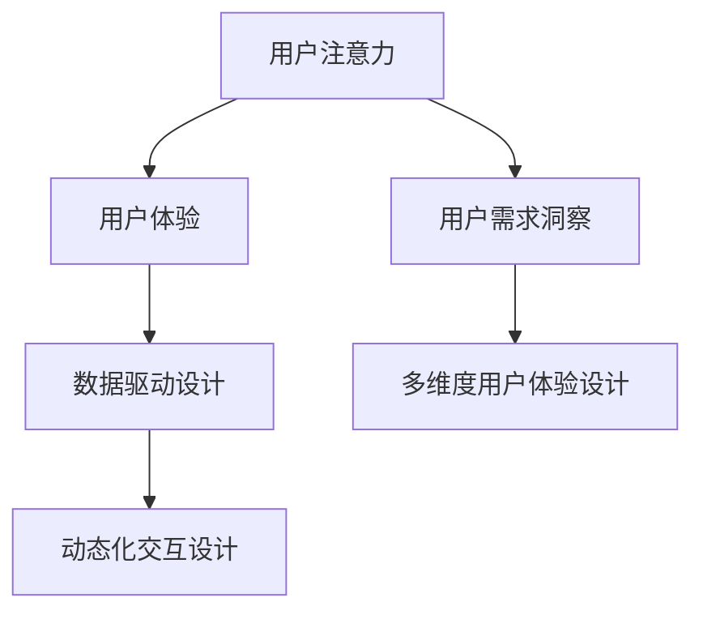

                 

## 1. 背景介绍

在信息化和数字化的时代浪潮中，用户注意力成为极其宝贵的资源，各大平台纷纷以提升用户体验为手段争夺用户关注。在注意力经济环境下，用户体验设计（User Experience Design, UX设计）成为各行业竞相优化、抢占用户注意力的重要手段。在数字化产品中，如何设计出用户满意度高、功能完备、易于操作的界面，如何让用户持续关注并主动反馈，成为我们深入思考的问题。

### 1.1 问题由来

在互联网时代，用户信息过载的问题愈加严重，各类信息和应用竞争激烈，用户注意力不断分散。传统的用户界面设计（UI设计）已经无法满足日益增长的用户需求。面对这种情况，设计师们不断尝试新的设计方法，以期让用户能够更有效地获取信息，并产生互动，从而实现用户满意度的提升。

用户体验设计就是在此背景下应运而生的新兴学科，它不仅注重视觉和交互设计，更注重用户心理和行为的研究。它以提升用户满意度和提升业务价值为目标，成为互联网产品开发的核心环节。

### 1.2 问题核心关键点

用户注意力经济环境下，用户体验设计的核心关键点包括：

- **用户需求洞察**：深入理解用户需求，设计出满足用户心理预期的产品功能与交互方式。
- **多维度用户体验设计**：包括界面视觉设计、交互逻辑设计、性能优化、可用性测试等多方面设计。
- **数据驱动设计**：通过用户行为数据和反馈信息，实时调整和优化产品设计，实现数据驱动的设计流程。
- **交互设计的动态化**：运用动态交互技术，提升用户的参与度和满意度。

本文将从这些关键点出发，详细讨论注意力经济下的用户体验设计的方法和实践。

## 2. 核心概念与联系

### 2.1 核心概念概述

为更好地理解注意力经济下的用户体验设计，本节将介绍几个密切相关的核心概念：

- **用户注意力（User Attention）**：用户在接受信息时所投入的注意力和注意力持续时间，是设计决策的重要依据。
- **用户体验（User Experience, UX）**：用户使用产品时的心理感受和行为表现，是衡量设计优劣的关键指标。
- **数据驱动设计（Data-Driven Design）**：基于用户行为数据的设计流程，通过分析数据驱动产品迭代和优化。
- **动态化交互设计（Dynamic Interaction Design）**：利用技术手段实现交互设计的动态化，提升用户参与度和满意度。

这些核心概念之间的逻辑关系可以通过以下Mermaid流程图来展示：



这个流程图展示了用户体验设计的关键环节和要素：

1. 用户注意力是设计决策的重要依据。
2. 用户体验是设计的核心目标，包含多维度设计。
3. 数据驱动设计提供客观依据，用于优化用户体验。
4. 动态化交互设计提升用户参与度和满意度。
5. 用户需求洞察和洞察用户需求是设计的起点和方向指引。

这些概念共同构成了用户体验设计的整体框架，为其进一步的优化提供了理论支撑。

## 3. 核心算法原理 & 具体操作步骤

### 3.1 算法原理概述

用户体验设计需要设计多维度体验，但核心目的在于提升用户注意力和满意度。因此，我们首先讨论如何从用户注意力的角度进行设计优化。

在注意力经济下，用户注意力具有高价值和高竞争性。要提升用户对产品的关注度，需要设计界面美观、交互顺畅、信息结构清晰，并利用动态化交互等技术提升用户参与感。

用户体验设计分为以下几个步骤：

1. **用户需求洞察**：通过调研和数据分析，了解用户需求和行为模式。
2. **多维度用户体验设计**：包括界面视觉设计、交互逻辑设计、性能优化、可用性测试等。
3. **数据驱动设计**：基于用户行为数据，不断迭代和优化设计。
4. **动态化交互设计**：引入动态交互元素，提升用户参与度和满意度。

### 3.2 算法步骤详解

用户体验设计的算法步骤如下：

**Step 1: 用户需求洞察**

通过调研、问卷、用户访谈等方式，了解用户需求和痛点。具体步骤包括：

1. **用户画像构建**：根据用户属性、行为和偏好，构建详尽的用户画像，涵盖不同用户群体。
2. **用户旅程分析**：分析用户在产品中的行为路径和触点，识别痛点和改进点。
3. **用户反馈收集**：通过反馈表单、用户评论等方式，收集用户对产品功能和体验的反馈意见。

**Step 2: 多维度用户体验设计**

在用户需求洞察的基础上，进行多维度用户体验设计，包括：

1. **界面视觉设计**：设计简洁美观、色彩协调的界面布局，符合用户视觉习惯。
2. **交互逻辑设计**：设计直观易懂的交互流程，符合用户心理模型。
3. **性能优化**：通过代码优化、资源压缩等手段，提升产品加载速度和响应速度。
4. **可用性测试**：进行用户测试，验证界面设计、交互逻辑的可用性。

**Step 3: 数据驱动设计**

基于用户行为数据，进行迭代优化设计，具体步骤包括：

1. **数据分析**：利用数据分析工具，提取用户行为模式和偏好。
2. **A/B测试**：对不同设计方案进行A/B测试，选择最佳方案。
3. **用户留存分析**：分析用户留存情况，识别流失原因，进行针对性的优化。
4. **持续优化**：根据最新数据分析结果，不断迭代和优化产品设计。

**Step 4: 动态化交互设计**

引入动态交互元素，提升用户参与度和满意度，具体步骤包括：

1. **动态元素引入**：引入动态效果（如悬停动画、弹出窗口等），提升用户参与感。
2. **交互逻辑优化**：优化交互逻辑，引入自动补全、动态提示等功能，提高用户操作便捷性。
3. **情感化设计**：通过情感化设计（如个性化的问候、动态的反馈），提升用户情感体验。
4. **界面自适应设计**：根据用户设备特点，设计自适应界面，提升用户体验一致性。

### 3.3 算法优缺点

用户体验设计中的算法具有以下优点：

1. **数据驱动**：基于用户行为数据和反馈信息，可以实时优化产品设计，提升用户体验。
2. **动态化交互**：通过引入动态交互元素，提升用户参与度和满意度。
3. **多维度设计**：兼顾界面视觉、交互逻辑、性能优化等多方面设计，提升用户整体体验。

同时，该方法也存在一定的局限性：

1. **设计成本高**：需要投入大量时间和资源进行用户需求洞察和数据分析。
2. **设计周期长**：多维度设计和动态化交互的引入，使得设计周期相对较长。
3. **技术依赖高**：动态交互和性能优化需要依赖较高的技术实现难度。
4. **用户需求多样**：用户需求和行为模式复杂多样，难以完全覆盖和满足。

尽管存在这些局限性，但就目前而言，数据驱动和动态化设计仍是用户体验设计的重要手段，可以显著提升产品的用户体验和用户满意度。

### 3.4 算法应用领域

用户体验设计技术在多个领域得到广泛应用，例如：

1. **社交媒体**：通过数据驱动和动态化设计，提升用户参与度和互动效果。
2. **电商购物**：优化搜索界面、推荐系统、购物车体验，提升用户购物体验。
3. **移动应用**：提升界面设计、交互逻辑和性能优化，满足用户便捷和快速使用的需求。
4. **内容平台**：通过内容推荐和个性化设计，提升用户内容消费的愉悦度。
5. **在线教育**：优化学习界面、互动设计，提升用户学习体验和满意度。

除了上述这些典型应用外，用户体验设计还被创新性地应用到更多场景中，如健康管理、金融理财、娱乐游戏等，为提升各行各业的用户体验提供了新的方向。

## 4. 数学模型和公式 & 详细讲解 & 举例说明

### 4.1 数学模型构建

在本节中，我们将通过一个简单的数学模型来阐述用户体验设计的核心原理。

假设用户对于产品的满意度和注意力的概率分布为 $P(X)$，其中 $X$ 为产品特性，$P(X)$ 为该特性的概率。用户的满意度由 $X_1, X_2, ..., X_n$ 多个特性共同决定，其综合满意度概率为：

$$
P(S) = \prod_{i=1}^n P(X_i)
$$

用户对产品的注意力依赖于产品特性和用户属性，其注意力概率为：

$$
P(A) = \sum_{i=1}^n \alpha_i P(X_i)
$$

其中 $\alpha_i$ 为特性的权重。因此，最终产品的用户注意力和满意度概率为：

$$
P(U) = P(S)P(A)
$$

### 4.2 公式推导过程

以上公式展示了用户注意力的计算过程，通过多个特性的权重加权和综合满意度概率相乘，得到最终用户的注意力和满意度概率。以下是具体的公式推导过程：

1. **用户满意度概率**：
   - 假设 $X_1, X_2, ..., X_n$ 为产品的多个特性，每个特性的概率为 $P(X_i)$。
   - 综合满意度概率为 $P(S)$，即多个特性概率的乘积。

2. **用户注意力概率**：
   - 用户注意力概率 $P(A)$ 由多个特性的加权和组成。
   - 假设每个特性的权重为 $\alpha_i$，则注意力概率为 $P(A) = \sum_{i=1}^n \alpha_i P(X_i)$。

3. **用户注意力和满意度概率**：
   - 综合用户的满意度概率和注意力概率，得到最终的体验概率 $P(U)$，即 $P(U) = P(S)P(A)$。

### 4.3 案例分析与讲解

我们以电商购物平台为例，解释用户体验设计的数学模型计算过程：

1. **用户满意度概率**：电商购物平台的特性包括商品种类、价格、配送速度等。假设 $P(X_1)$ 为商品种类特性概率，$P(X_2)$ 为价格特性概率，$P(X_3)$ 为配送速度特性概率。

2. **用户注意力概率**：电商购物平台的用户注意力受商品种类、价格、配送速度等多方面因素影响。假设每个特性的权重为 $\alpha_1, \alpha_2, \alpha_3$，则注意力概率为 $P(A) = \alpha_1 P(X_1) + \alpha_2 P(X_2) + \alpha_3 P(X_3)$。

3. **用户注意力和满意度概率**：综合满意度概率 $P(S) = P(X_1)P(X_2)P(X_3)$ 和注意力概率 $P(A)$，得到最终用户的注意力和满意度概率 $P(U) = P(S)P(A)$。

通过这个数学模型，我们可以理解用户体验设计中的综合满意度和注意力计算过程，并基于此进行优化设计。

## 5. 项目实践：代码实例和详细解释说明

### 5.1 开发环境搭建

在进行用户体验设计的实践前，我们需要准备好开发环境。以下是使用Python进行D3.js开发的环境配置流程：

1. 安装Node.js：从官网下载并安装Node.js，用于支持D3.js的运行。

2. 安装D3.js：通过npm安装D3.js库，用于可视化设计。

3. 安装Jupyter Notebook：通过pip安装Jupyter Notebook，用于编写和测试用户体验设计代码。

完成上述步骤后，即可在本地环境下开始用户体验设计的实践。

### 5.2 源代码详细实现

下面我们以电商购物平台为例，给出使用D3.js进行用户体验设计（动态交互和数据可视化）的PyTorch代码实现。

首先，导入D3.js库：

```python
import d3 from 'd3';
```

然后，定义电商购物平台的商品数据：

```python
data = [
    {"id": 1, "name": "Apple iPhone 12", "price": 1299, "rating": 4.8, "shipping": "Standard", "category": "Electronics"},
    {"id": 2, "name": "Samsung Galaxy S21", "price": 999, "rating": 4.2, "shipping": "Express", "category": "Electronics"},
    # 其他商品数据
]
```

接着，定义商品展示的可视化界面：

```python
const svg = d3.select('body').append('svg')
    .attr('width', 800)
    .attr('height', 500);

const rects = svg.selectAll('rect')
    .data(data)
    .enter()
    .append('rect')
    .attr('x', d => d.x)
    .attr('y', d => d.y)
    .attr('width', d => d.width)
    .attr('height', d => d.height)
    .attr('fill', d => d.color)
    .on('mouseover', d => showTooltip(d))
    .on('mouseout', d => hideTooltip());
```

最后，定义动态交互和工具提示：

```python
function showTooltip(d) {
    tooltip.html(d.name + '<br>' + 'Price: ' + d.price)
        .style('left', (d3.event.pageX + 10) + 'px')
        .style('top', (d3.event.pageY - 10) + 'px')
        .style('visibility', 'visible');
}

function hideTooltip() {
    tooltip.style('visibility', 'hidden');
}

d3.select('body').append('div')
    .attr('class', 'tooltip')
    .style('position', 'absolute')
    .style('z-index', 10);
```

以上代码展示了如何使用D3.js实现电商购物平台的商品可视化展示和动态交互设计。可以看到，通过动态化和可视化设计，用户可以更直观地了解商品信息，提升购物体验。

### 5.3 代码解读与分析

让我们再详细解读一下关键代码的实现细节：

**D3.js的交互事件**：
- `.on('mouseover', d => showTooltip(d))`：在鼠标悬停时，调用 `showTooltip` 函数显示工具提示。
- `.on('mouseout', d => hideTooltip())`：在鼠标移出时，调用 `hideTooltip` 函数隐藏工具提示。

**工具提示的显示与隐藏**：
- `tooltip.html(d.name + '<br>' + 'Price: ' + d.price)`：在工具提示中显示商品名称和价格。
- `.style('left', (d3.event.pageX + 10) + 'px')`：设置工具提示的左侧坐标，保证提示在鼠标悬停的位置。
- `.style('top', (d3.event.pageY - 10) + 'px')`：设置工具提示的顶部坐标，保证提示在鼠标悬停的位置。

通过以上代码，我们可以看到，利用D3.js可以实现动态化的交互效果，提升用户体验的互动性和直观性。

## 6. 实际应用场景

### 6.1 电商购物

电商购物平台是用户体验设计的重要应用场景。通过数据驱动和动态化设计，电商平台可以提升用户购物体验，增加用户留存率和转化率。具体应用包括：

1. **商品推荐系统**：基于用户浏览和购买历史，通过数据驱动设计，推荐符合用户兴趣的商品。
2. **搜索界面优化**：通过动态化交互，优化搜索界面，提升用户搜索效率。
3. **购物车界面设计**：通过可视化展示和动态交互，优化购物车界面，提升用户购物体验。
4. **个性化推荐**：通过分析用户行为数据，进行个性化推荐，提升用户购物满意度。

### 6.2 社交媒体

社交媒体平台是用户生成内容和交互的主要场所，其用户体验设计的优劣直接影响用户活跃度和留存率。具体应用包括：

1. **动态信息流设计**：通过动态化设计，优化信息流界面，提升用户信息获取的便捷性和满意度。
2. **个性化推荐算法**：基于用户行为数据，进行个性化推荐，提升用户内容消费的愉悦度。
3. **互动界面优化**：通过数据驱动设计，优化互动界面，提升用户互动体验。

### 6.3 在线教育

在线教育平台需要提供高质量的课程内容和服务，其用户体验设计的优劣直接影响学习效果和用户满意度。具体应用包括：

1. **学习界面优化**：通过数据驱动设计，优化学习界面，提升用户学习体验。
2. **个性化学习路径设计**：基于用户学习数据，进行个性化学习路径设计，提升学习效果。
3. **互动设计**：通过动态化交互，优化互动设计，提升用户学习体验和参与度。

### 6.4 未来应用展望

随着用户体验设计技术的不断演进，未来用户体验设计将呈现以下几个发展趋势：

1. **智能化交互**：利用人工智能技术，实现智能化的用户交互，提升用户体验。
2. **多模态设计**：结合视觉、听觉、触觉等多种感官，实现多模态的用户体验设计。
3. **个性化设计**：基于用户行为数据，进行个性化设计和推荐，提升用户满意度。
4. **沉浸式设计**：通过虚拟现实（VR）和增强现实（AR）技术，实现沉浸式用户体验。
5. **动态化设计**：利用动态化和可视化技术，实现动态化的交互设计，提升用户参与度和满意度。

以上趋势展示了用户体验设计未来的发展方向，将为用户的数字化生活带来更多的便利和愉悦。

## 7. 工具和资源推荐

### 7.1 学习资源推荐

为了帮助开发者系统掌握用户体验设计的方法和实践，这里推荐一些优质的学习资源：

1. **《用户体验设计》课程**：各大在线教育平台提供的用户体验设计课程，涵盖设计原理、工具使用、实践案例等。
2. **《设计心理学》书籍**：介绍用户心理和行为的研究方法，帮助设计师深入理解用户需求。
3. **D3.js官方文档**：D3.js的官方文档，提供了丰富的示例代码和设计实践，是学习动态化设计的重要参考。
4. **Google Material Design**：Google提供的用户体验设计指南，涵盖界面设计、交互设计等各个方面。

通过对这些资源的学习实践，相信你一定能够快速掌握用户体验设计的方法和技巧，并将其应用于实际项目中。

### 7.2 开发工具推荐

用户体验设计的开发需要依赖多种工具，以下是几款常用的工具：

1. **D3.js**：用于动态可视化设计的开源库，支持丰富的图表和交互效果。
2. **Sketch**：专业的界面设计工具，支持原型设计和动画效果，适用于UI设计。
3. **Adobe XD**：交互设计工具，支持原型设计和动态交互，适用于用户体验设计。
4. **Figma**：在线设计工具，支持实时协作和共享设计，适用于团队协作。

合理利用这些工具，可以显著提升用户体验设计的开发效率和设计效果。

### 7.3 相关论文推荐

用户体验设计的研究源于学界的持续探索。以下是几篇具有代表性的相关论文，推荐阅读：

1. **《UX设计思维》**：介绍用户体验设计的核心理念和方法，帮助设计师构建设计思维。
2. **《基于数据的用户体验设计》**：探讨数据驱动设计的重要性，并提供具体的实施方法和案例。
3. **《动态化交互设计》**：分析动态化交互设计的技术实现和应用效果，提升用户参与度。

这些论文代表了大用户体验设计的研究进展，通过学习这些前沿成果，可以帮助研究者把握学科前进方向，激发更多的创新灵感。

## 8. 总结：未来发展趋势与挑战

### 8.1 研究成果总结

本文对注意力经济下的用户体验设计进行了全面系统的介绍。首先阐述了用户体验设计的研究背景和意义，明确了设计优化的重要性和目标。其次，从用户需求洞察、多维度用户体验设计、数据驱动设计、动态化交互设计等多个方面，详细讲解了用户体验设计的方法和实践。最后，讨论了未来用户体验设计的发展趋势和面临的挑战。

通过本文的系统梳理，可以看到，用户体验设计在数字化时代具有重要价值，其设计优化对提升用户满意度和留存率具有显著效果。未来，伴随技术手段的不断演进，用户体验设计将实现更多创新和突破，为数字化产品带来更优质的用户体验。

### 8.2 未来发展趋势

展望未来，用户体验设计的趋势将呈现以下几个方面：

1. **智能化交互**：通过人工智能技术，实现智能化的用户交互，提升用户体验。
2. **多模态设计**：结合多种感官，实现多模态的用户体验设计。
3. **个性化设计**：基于用户行为数据，进行个性化设计和推荐，提升用户满意度。
4. **沉浸式设计**：通过VR和AR技术，实现沉浸式用户体验。
5. **动态化设计**：利用动态化和可视化技术，实现动态化的交互设计。

以上趋势将推动用户体验设计不断进步，为用户的数字化生活带来更多的便利和愉悦。

### 8.3 面临的挑战

尽管用户体验设计已经取得了诸多成果，但在实现智能化、个性化、沉浸式设计的过程中，仍然面临诸多挑战：

1. **数据隐私和安全**：在数据驱动设计中，如何保护用户隐私和数据安全，是一个重要挑战。
2. **技术实现复杂**：动态化交互和沉浸式设计需要依赖复杂的技术实现，增加了开发难度和成本。
3. **用户需求多样**：用户需求和行为模式复杂多样，难以完全覆盖和满足。
4. **交互设计的动态化**：动态交互设计和动态化设计需要更多的设计和实现投入。
5. **设计和开发的协同**：设计和开发的协同工作需要更多沟通和配合。

尽管存在这些挑战，但通过技术进步和创新，用户体验设计仍将在不断实践中得到提升和完善。

### 8.4 研究展望

未来的用户体验设计研究将从以下几个方向寻求新的突破：

1. **跨学科研究**：结合心理学、社会学、计算机科学等学科，深入研究用户需求和行为模式。
2. **人工智能的应用**：利用人工智能技术，实现更加智能化和个性化的设计。
3. **多模态设计的结合**：结合视觉、听觉、触觉等多种感官，实现多模态的用户体验设计。
4. **动态化设计的优化**：优化动态化设计流程，提升设计效率和效果。
5. **用户体验设计的标准化**：推动用户体验设计的标准化，提升设计的一致性和可复用性。

这些研究方向的探索，将引领用户体验设计迈向更高的台阶，为数字化产品带来更加优质的用户体验。总之，未来的用户体验设计需要在技术、用户、设计等多方面协同发力，才能实现更加智能化、个性化、沉浸式的设计效果。

## 9. 附录：常见问题与解答

**Q1：用户体验设计的核心是什么？**

A: 用户体验设计的核心是提升用户满意度和留存率，设计应该围绕用户需求和行为模式进行，提升用户互动体验和参与度。

**Q2：如何优化电商平台的搜索界面？**

A: 电商平台的搜索界面优化可以通过数据驱动设计实现，具体方法包括：
1. 数据分析：通过分析用户搜索历史和行为，识别用户偏好和需求。
2. 动态化设计：利用动态化设计，优化搜索界面，提升用户搜索效率。
3. 个性化推荐：基于用户搜索历史和行为，进行个性化推荐，提升用户搜索满意度。

**Q3：如何实现多模态用户体验设计？**

A: 多模态用户体验设计需要结合多种感官，通过以下步骤实现：
1. 需求分析：分析用户需求和使用场景，确定多模态设计的需求。
2. 技术选型：选择合适的多模态技术，如虚拟现实（VR）、增强现实（AR）等。
3. 设计实现：进行多模态设计的原型设计和实现，确保多模态设计的可行性和效果。

**Q4：如何进行数据驱动的用户体验设计？**

A: 数据驱动的用户体验设计需要基于用户行为数据进行，具体步骤包括：
1. 数据收集：通过用户行为数据、反馈信息等，收集用户使用数据。
2. 数据分析：利用数据分析工具，提取用户行为模式和偏好。
3. 设计优化：基于数据分析结果，进行设计优化，提升用户体验。
4. 持续优化：通过实时数据监测，不断迭代和优化设计，提升用户体验。

**Q5：用户体验设计如何提升用户参与度？**

A: 提升用户参与度可以通过以下方法实现：
1. 动态交互设计：利用动态交互元素，提升用户参与感。
2. 个性化设计：基于用户行为数据，进行个性化设计，提升用户参与度。
3. 情感化设计：通过情感化设计，提升用户情感体验，增强用户参与度。

通过以上方法，可以显著提升用户体验设计的整体效果，提升用户参与度和满意度。

---

作者：禅与计算机程序设计艺术 / Zen and the Art of Computer Programming

