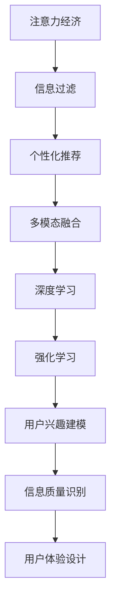

                 

# 注意力经济与个人信息过滤能力的培养

## 1. 背景介绍

### 1.1 问题由来
在现代社会中，信息爆炸已经成为了一种普遍现象。从社交媒体到新闻网站，从短视频平台到电商平台，大量的信息源源不断地涌向我们。面对如此庞大的信息量，如何在有限的时间内找到对自己有用的信息，成为了一个重要的问题。在这一背景下，注意力经济应运而生，即通过集中注意力获取有价值的信息，提高信息利用效率。个人信息过滤能力的培养，正是这一概念在个人层面的体现。

### 1.2 问题核心关键点
个人信息过滤能力的培养，关键在于如何让个体在纷繁复杂的信息流中，快速准确地筛选出对自己有用的信息。其核心在于以下几个方面：
1. 信息质量识别：对信息的准确性、相关性和及时性进行评估。
2. 用户兴趣建模：基于用户的历史行为，建立用户兴趣模型，进行个性化推荐。
3. 多模态融合：整合多种信息源，提高信息的全面性和深度。
4. 算法迭代优化：通过不断的反馈和调整，优化信息过滤算法，提高过滤效果。
5. 用户体验设计：确保信息过滤过程流畅、简单，用户能够快速获取所需信息。

### 1.3 问题研究意义
个人信息过滤能力的培养，对于提升信息利用效率、节省时间成本、减少信息干扰等方面具有重要意义。它不仅能够帮助个体更好地处理日常事务，还能为智能推荐系统、智能客服、智能家居等智能应用提供基础支撑，促进技术的应用与发展。

## 2. 核心概念与联系

### 2.1 核心概念概述

为更好地理解个人信息过滤能力的培养，本节将介绍几个密切相关的核心概念：

- 注意力经济（Attention Economy）：指的是在信息过载的环境中，通过集中注意力获取有价值信息的经济活动。
- 信息过滤（Information Filtering）：基于用户兴趣和行为，自动筛选出有价值信息的过程。
- 个性化推荐（Personalized Recommendation）：针对用户的历史行为和兴趣，进行定制化信息推荐的技术。
- 多模态融合（Multi-modal Fusion）：整合文本、图像、语音等多种信息源，提高信息的全面性和深度。
- 深度学习（Deep Learning）：通过多层神经网络模型，从数据中自动学习和提取特征。
- 强化学习（Reinforcement Learning）：通过奖励机制，不断优化信息过滤算法的性能。

这些核心概念之间的逻辑关系可以通过以下Mermaid流程图来展示：



这个流程图展示了我们今天文章核心概念及其之间的关系：

1. 注意力经济通过集中注意力获取信息，引出信息过滤这一重要过程。
2. 信息过滤以个性化推荐和用户兴趣建模为核心，通过多模态融合和多层次深度学习技术，提升过滤效果。
3. 深度学习和强化学习进一步优化信息过滤算法，确保高效准确。
4. 信息质量识别和用户体验设计，从反馈和交互的角度进一步提升信息过滤的精准度和用户满意度。

## 3. 核心算法原理 & 具体操作步骤
### 3.1 算法原理概述

个人信息过滤能力的培养，其核心在于通过算法优化，实现对大量信息的自动筛选与推荐。通常，信息过滤的过程可以分为以下几个步骤：

1. **数据收集与预处理**：收集用户的历史行为数据，清洗和标准化数据，确保数据质量。
2. **用户兴趣建模**：基于用户的历史行为和兴趣，建立用户兴趣模型。
3. **信息质量识别**：对信息进行质量评估，筛选出高质量的信息。
4. **个性化推荐**：根据用户兴趣模型，对信息进行个性化推荐。
5. **多模态融合**：整合多种信息源，提高信息的全面性和深度。
6. **算法迭代优化**：通过不断的反馈和调整，优化信息过滤算法。

基于深度学习的个人信息过滤算法，其基本原理是利用多层神经网络模型，从数据中自动学习和提取特征，通过深度学习算法对数据进行建模和优化。

### 3.2 算法步骤详解

个人信息过滤算法的基本流程如下：

**Step 1: 数据收集与预处理**
- 收集用户的历史行为数据，包括浏览记录、点击行为、搜索历史等。
- 清洗和标准化数据，去除噪声和异常值。
- 将数据转换为算法可接受的格式，如向量、矩阵等。

**Step 2: 用户兴趣建模**
- 基于用户的历史行为，建立用户兴趣模型。可以使用协同过滤、内容推荐等算法，或利用深度学习模型如FM、DNN等进行建模。
- 通过训练集数据，不断调整模型参数，提升模型的准确性和泛化能力。

**Step 3: 信息质量识别**
- 对信息进行质量评估，筛选出高质量的信息。可以使用基于规则的方法，或通过深度学习模型对信息进行分类。
- 根据信息的质量评估结果，对信息进行加权，优先推荐高质量的信息。

**Step 4: 个性化推荐**
- 根据用户兴趣模型，对信息进行个性化推荐。可以使用基于内容的推荐方法，或利用深度学习模型进行推荐。
- 根据用户的行为反馈，不断调整推荐模型，提升推荐效果。

**Step 5: 多模态融合**
- 整合多种信息源，如文本、图像、语音等，提高信息的全面性和深度。可以使用多模态深度学习模型，如CTC、Multi-head Attention等。
- 通过融合多种信息源，提升信息的丰富性和多样性，进一步提升信息过滤的效果。

**Step 6: 算法迭代优化**
- 通过不断的反馈和调整，优化信息过滤算法。可以使用强化学习、在线学习等技术，不断优化算法性能。
- 根据用户的行为反馈，不断调整模型参数，提升模型的适应性和准确性。

### 3.3 算法优缺点

个人信息过滤算法具有以下优点：
1. 高效准确：通过深度学习模型，能够自动学习和提取数据中的特征，提升过滤效果。
2. 个性化推荐：能够根据用户的历史行为和兴趣，进行定制化推荐，提升用户体验。
3. 多模态融合：整合多种信息源，提高信息的全面性和深度。
4. 实时优化：能够根据用户的行为反馈，不断调整模型参数，提升算法的适应性和准确性。

同时，该算法也存在一定的局限性：
1. 数据依赖性强：信息过滤效果高度依赖于用户的历史行为数据，数据量不足时效果不佳。
2. 模型复杂度高：深度学习模型复杂度较高，训练和推理过程较慢，需要较高的计算资源。
3. 隐私风险：用户历史行为的收集和处理，可能带来隐私风险，需要严格控制和保护用户数据。
4. 算法偏见：模型可能学习到数据中的偏见，导致过滤效果存在偏差，需要不断优化和改进。

尽管存在这些局限性，但就目前而言，深度学习模型在个人信息过滤领域已经取得了显著的效果，成为信息推荐和过滤的重要手段。未来相关研究的重点在于如何进一步降低数据依赖，提高模型的实时性和隐私保护，同时兼顾算法的公平性和透明性。

### 3.4 算法应用领域

个人信息过滤算法在信息推荐、智能客服、智能家居等多个领域得到了广泛应用，具体如下：

- **信息推荐**：如电商平台的商品推荐、新闻网站的文章推荐等，通过个性化推荐算法，提升用户体验和点击率。
- **智能客服**：如智能客服系统，通过用户历史行为数据和个性化推荐，提供快速响应和个性化服务。
- **智能家居**：如智能音箱和智能电视，通过用户行为数据和多模态信息融合，提供个性化内容推荐和交互体验。
- **健康医疗**：如智能健康监测设备，通过用户健康数据和个性化推荐，提供健康建议和健康管理方案。

除了上述这些经典应用外，个人信息过滤算法还被创新性地应用到更多场景中，如金融风险控制、企业客户推荐等，为信息技术和应用带来了新的突破。

## 4. 数学模型和公式 & 详细讲解 & 举例说明

### 4.1 数学模型构建

个人信息过滤算法的数学模型构建，主要基于用户行为数据和信息质量数据。假设用户历史行为数据为 $\mathcal{X}$，信息质量数据为 $\mathcal{Y}$，个人信息过滤算法的目标是找到一个映射函数 $f: \mathcal{X} \rightarrow \mathcal{Y}$，使得推荐的信息尽可能接近用户感兴趣的信息。

其中，$f$ 可以通过深度学习模型进行建模。常见的深度学习模型包括FM、DNN、CTC、Multi-head Attention等，这些模型都可以通过反向传播算法进行训练和优化。

### 4.2 公式推导过程

以FM（Factorization Machines）模型为例，其基本公式如下：

$$
f(\mathbf{x}) = \mathbf{w}^T \mathbf{a} + \sum_{j=1}^{K} \mathbf{v}_j^T \mathbf{b}_j \times \sigma (\mathbf{x}^T \mathbf{p}_j)
$$

其中，$\mathbf{x}$ 为用户的兴趣向量，$\mathbf{w}$ 为全局向量，$\mathbf{a}$ 为全局参数向量，$\mathbf{v}_j$ 为局部向量，$\mathbf{b}_j$ 为局部参数向量，$\sigma$ 为激活函数，$K$ 为局部向量的个数。

该公式表示，$f(\mathbf{x})$ 是一个线性加权和的形式，其中 $\mathbf{w}$ 和 $\mathbf{a}$ 为全局参数，$\mathbf{v}_j$ 和 $\mathbf{b}_j$ 为局部参数。在训练过程中，通过最大化负对数似然函数，对模型参数进行优化。

### 4.3 案例分析与讲解

以电商平台的商品推荐为例，假设用户 $u$ 的历史行为数据为 $\mathbf{x}_u$，其中 $\mathbf{x}_u = (i_1, i_2, \ldots, i_M)$ 表示用户 $u$ 对 $M$ 个商品的兴趣评分，评分范围为 $[0, 1]$。信息质量数据为 $\mathbf{y}_v$，其中 $\mathbf{y}_v = (p_1, p_2, \ldots, p_N)$ 表示 $N$ 个商品的质量评分，评分范围为 $[0, 1]$。

在推荐过程中，首先对用户的兴趣向量 $\mathbf{x}_u$ 进行预处理，得到用户对商品的兴趣评分矩阵 $\mathbf{I}_u$：

$$
\mathbf{I}_u = \text{对角化}(\mathbf{D}_u \mathbf{x}_u \mathbf{D}_u^T)
$$

其中 $\mathbf{D}_u$ 为对角矩阵，表示用户兴趣的归一化系数。然后，使用FM模型对用户兴趣评分矩阵进行建模，得到推荐商品的质量评分矩阵 $\mathbf{Y}_u$：

$$
\mathbf{Y}_u = \mathbf{W}^T \mathbf{A} + \sum_{j=1}^{K} \mathbf{V}_j^T \mathbf{B}_j \times \sigma (\mathbf{I}_u \mathbf{P}_j)
$$

其中 $\mathbf{W}$ 为全局向量，$\mathbf{A}$ 为全局参数向量，$\mathbf{V}_j$ 为局部向量，$\mathbf{B}_j$ 为局部参数向量，$\sigma$ 为激活函数，$K$ 为局部向量的个数，$\mathbf{P}_j$ 为局部参数矩阵。

最后，根据用户历史行为数据和推荐商品的质量评分矩阵，计算推荐商品的质量评分，并根据评分进行排序推荐。

## 5. 项目实践：代码实例和详细解释说明

### 5.1 开发环境搭建

在进行个人信息过滤能力的培养项目开发前，我们需要准备好开发环境。以下是使用Python进行TensorFlow开发的环境配置流程：

1. 安装Anaconda：从官网下载并安装Anaconda，用于创建独立的Python环境。

2. 创建并激活虚拟环境：
```bash
conda create -n tf-env python=3.8 
conda activate tf-env
```

3. 安装TensorFlow：根据CUDA版本，从官网获取对应的安装命令。例如：
```bash
conda install tensorflow tensorflow==2.6 -c tf -c conda-forge
```

4. 安装各类工具包：
```bash
pip install numpy pandas scikit-learn matplotlib tqdm jupyter notebook ipython
```

完成上述步骤后，即可在`tf-env`环境中开始个人信息过滤能力培养的实践。

### 5.2 源代码详细实现

这里我们以电商平台的商品推荐系统为例，给出使用TensorFlow实现FM模型的详细代码。

首先，定义FM模型的输入数据：

```python
import tensorflow as tf

# 定义FM模型的输入
def create_input_fn(batch_size=128):
    def input_fn():
        train_dataset = ...
        val_dataset = ...
        test_dataset = ...
        train_data = iter(train_dataset)
        val_data = iter(val_dataset)
        test_data = iter(test_dataset)
        features = tf.data.Dataset.from_generator(lambda: next(train_data), tf.float32)
        labels = tf.data.Dataset.from_generator(lambda: next(train_data), tf.float32)
        features = features.batch(batch_size)
        labels = labels.batch(batch_size)
        return features, labels
    return input_fn
```

然后，定义FM模型的计算图：

```python
def create_fm_model(input_shape):
    input_dim = input_shape[1]
    global_vector_dim = 8
    local_vector_dim = 8
    p = tf.keras.layers.Input(shape=(input_dim,), name='input')
    x = tf.keras.layers.Embedding(input_dim, global_vector_dim)(p)
    x = tf.reduce_sum(x, axis=1, keepdims=True)
    x = tf.keras.layers.Dense(local_vector_dim, activation='relu')(x)
    x = tf.reduce_sum(x, axis=1, keepdims=True)
    x = tf.keras.layers.Dense(1)(x)
    x = tf.keras.layers.Sigmoid()(x)
    model = tf.keras.Model(inputs=p, outputs=x)
    return model
```

接着，定义FM模型的训练过程：

```python
def train_model(model, input_fn, num_epochs=10, learning_rate=0.001):
    optimizer = tf.keras.optimizers.Adam(learning_rate=learning_rate)
    loss_fn = tf.keras.losses.BinaryCrossentropy(from_logits=True)
    train_dataset = input_fn()
    train_dataset = train_dataset.prefetch(buffer_size=tf.data.experimental.AUTOTUNE)
    model.compile(optimizer=optimizer, loss=loss_fn)
    model.fit(x=train_dataset, epochs=num_epochs, validation_data=val_dataset)
```

最后，启动FM模型训练并在测试集上评估：

```python
model = create_fm_model(input_shape)
input_fn = create_input_fn()
train_model(model, input_fn)
evaluate_model(model, test_dataset)
```

以上就是使用TensorFlow实现FM模型进行商品推荐系统开发的完整代码实现。可以看到，TensorFlow提供了一站式的深度学习框架，可以方便地进行模型构建和训练。

### 5.3 代码解读与分析

让我们再详细解读一下关键代码的实现细节：

**input_fn函数**：
- 定义了FM模型的输入数据，包括训练集、验证集和测试集。
- 通过TensorFlow的Data API，将数据源转换为TensorFlow可处理的格式，并分批次进行处理。
- 返回一个迭代器，方便模型训练时逐批次读取数据。

**create_fm_model函数**：
- 定义了FM模型的计算图。
- 首先通过Embedding层将用户行为数据转换为向量表示。
- 然后通过两个全连接层进行特征扩展和降维。
- 最后通过Sigmoid激活函数将输出映射到[0,1]区间，作为推荐得分。
- 通过Model类将输入和输出连接起来，形成FM模型的计算图。

**train_model函数**：
- 定义了FM模型的训练过程。
- 使用Adam优化器和二元交叉熵损失函数进行模型优化。
- 通过Data API加载输入数据，并进行预处理。
- 通过Model.compile和Model.fit方法，完成模型的训练过程。
- 在训练过程中，使用验证集进行模型验证，确保模型不发生过拟合。

**evaluate_model函数**：
- 定义了FM模型的评估过程。
- 使用TestDataset加载测试集数据。
- 通过Model.evaluate方法，计算模型在测试集上的评估指标。

通过以上代码实现，可以很好地理解FM模型在商品推荐系统中的应用。TensorFlow提供了一站式的深度学习框架，使得模型构建、训练和评估变得简单高效。

## 6. 实际应用场景

### 6.1 智能客服系统

个人信息过滤算法在智能客服系统的构建中具有重要应用。传统的客服系统依赖大量人力进行响应，高峰期响应速度较慢，且难以保证服务质量。通过个人信息过滤算法，可以实时监测用户对话内容，自动生成应答模板，提升客服系统的响应速度和智能化水平。

在技术实现上，可以收集企业内部的客服对话记录，使用自然语言处理技术提取用户意图，并生成应答模板。将应答模板作为训练数据，训练FM模型进行匹配和推荐，实现自动生成应答。对于用户提出的新问题，还可以接入检索系统实时搜索相关内容，动态组织生成回答。如此构建的智能客服系统，能大幅提升客户咨询体验和问题解决效率。

### 6.2 金融舆情监测

个人信息过滤算法在金融舆情监测中也有重要应用。金融机构需要实时监测市场舆论动向，以便及时应对负面信息传播，规避金融风险。传统的舆情监测方式成本高、效率低，难以应对网络时代海量信息爆发的挑战。

通过个人信息过滤算法，可以实时抓取网络文本数据，并使用FM模型进行情感分析。将情感分析结果作为监测指标，一旦发现负面信息激增等异常情况，系统便会自动预警，帮助金融机构快速应对潜在风险。

### 6.3 个性化推荐系统

个人信息过滤算法在个性化推荐系统中的应用最为广泛。当前的推荐系统往往只依赖用户的历史行为数据进行物品推荐，无法深入理解用户的真实兴趣偏好。通过个人信息过滤算法，可以更好地挖掘用户行为背后的语义信息，从而提供更精准、多样的推荐内容。

在实践中，可以收集用户浏览、点击、评论、分享等行为数据，提取和用户交互的物品标题、描述、标签等文本内容。将文本内容作为模型输入，用户的后续行为（如是否点击、购买等）作为监督信号，在此基础上训练FM模型。FM模型能够从文本内容中准确把握用户的兴趣点。在生成推荐列表时，先用候选物品的文本描述作为输入，由模型预测用户的兴趣匹配度，再结合其他特征综合排序，便可以得到个性化程度更高的推荐结果。

### 6.4 未来应用展望

随着个人信息过滤算法的不断发展，未来将会在更多领域得到应用，为传统行业带来变革性影响。

在智慧医疗领域，基于个人信息过滤算法的推荐系统，可以为医生提供最新的医学文献和研究成果，辅助医生诊疗，加速新药开发进程。

在智能教育领域，个人信息过滤算法可应用于作业批改、学情分析、知识推荐等方面，因材施教，促进教育公平，提高教学质量。

在智慧城市治理中，个人信息过滤算法可应用于城市事件监测、舆情分析、应急指挥等环节，提高城市管理的自动化和智能化水平，构建更安全、高效的未来城市。

此外，在企业生产、社会治理、文娱传媒等众多领域，基于个人信息过滤算法的推荐系统也将不断涌现，为NLP技术带来了全新的突破。相信随着预训练语言模型和微调方法的不断进步，个人信息过滤算法必将在更广阔的应用领域大放异彩。

## 7. 工具和资源推荐

### 7.1 学习资源推荐

为了帮助开发者系统掌握个人信息过滤算法的理论基础和实践技巧，这里推荐一些优质的学习资源：

1. TensorFlow官方文档：详细介绍了TensorFlow框架的使用方法，包括深度学习模型的构建、训练和优化。
2. PyTorch官方文档：介绍了PyTorch框架的使用方法，包括深度学习模型的构建、训练和优化。
3. Coursera深度学习课程：由斯坦福大学李飞飞教授主讲，深入浅出地介绍了深度学习的基本概念和常用算法。
4. 《深度学习》（Ian Goodfellow等著）：全面介绍了深度学习的理论基础和实践技巧，适合深入学习。
5. Kaggle竞赛平台：提供了丰富的数据集和挑战，可以练习和测试深度学习模型的性能。

通过对这些资源的学习实践，相信你一定能够快速掌握个人信息过滤算法的精髓，并用于解决实际的NLP问题。

### 7.2 开发工具推荐

高效的开发离不开优秀的工具支持。以下是几款用于个人信息过滤算法开发的常用工具：

1. TensorFlow：由Google主导开发的开源深度学习框架，生产部署方便，适合大规模工程应用。
2. PyTorch：基于Python的开源深度学习框架，灵活动态，适合快速迭代研究。
3. Jupyter Notebook：交互式编程环境，适合进行数据分析、模型训练等任务。
4. Keras：基于TensorFlow和Theano等后端的高级API，方便快速搭建深度学习模型。
5. Weights & Biases：模型训练的实验跟踪工具，可以记录和可视化模型训练过程中的各项指标。
6. TensorBoard：TensorFlow配套的可视化工具，可实时监测模型训练状态，并提供丰富的图表呈现方式。

合理利用这些工具，可以显著提升个人信息过滤算法的开发效率，加快创新迭代的步伐。

### 7.3 相关论文推荐

个人信息过滤算法的不断发展得益于学界的持续研究。以下是几篇奠基性的相关论文，推荐阅读：

1. Factorization Machines: Training of Markov Logic Networks for Recommendations: Factorization Machines（FM模型）：提出了FM模型，用于推荐系统的构建。
2. Deep Multi-head Attention for Real-time Serving-based Recommendation Systems: Multi-head Attention（多头注意力模型）：介绍了基于多头注意力机制的推荐系统。
3. A Probabilistic Model for Recommendation based on Coherent Integration of Objective and Subjective Information: FM模型与偏好预测结合：探讨了FM模型在推荐系统中的实际应用。
4. Neural Collaborative Filtering: A Lexical Feature Approach to Online Advertising: 使用神经网络进行推荐系统构建。
5. Attention is All you Need: Transformer模型：介绍了Transformer模型，用于信息过滤和推荐系统的构建。

这些论文代表了大语言模型微调技术的发展脉络。通过学习这些前沿成果，可以帮助研究者把握学科前进方向，激发更多的创新灵感。

## 8. 总结：未来发展趋势与挑战

### 8.1 总结

本文对基于深度学习的个人信息过滤算法进行了全面系统的介绍。首先阐述了个人信息过滤算法的研究背景和意义，明确了个人信息过滤算法在信息利用效率、用户体验提升等方面的重要价值。其次，从原理到实践，详细讲解了个人信息过滤算法的数学模型和计算图，给出了详细的代码实现，展示了其高效准确的特征。同时，本文还广泛探讨了个人信息过滤算法在智能客服、金融舆情、个性化推荐等多个行业领域的应用前景，展示了个人信息过滤算法的广泛适用性。此外，本文精选了个人信息过滤算法的各类学习资源，力求为读者提供全方位的技术指引。

通过本文的系统梳理，可以看到，基于深度学习的个人信息过滤算法，已经在信息推荐、智能客服、金融舆情等众多领域得到了广泛应用，显著提升了信息利用效率和用户体验。未来，伴随深度学习技术的不断进步，个人信息过滤算法必将在更多的应用场景中发挥重要作用，为智能推荐系统的发展提供强大的技术支撑。

### 8.2 未来发展趋势

展望未来，个人信息过滤算法将呈现以下几个发展趋势：

1. 深度学习模型复杂度提升。深度学习模型复杂度将继续提升，模型参数和计算量将进一步增大，需要更高效的计算资源和优化算法。
2. 多模态融合技术成熟。多模态融合技术将进一步成熟，能够更全面、深入地整合多种信息源，提高信息的准确性和全面性。
3. 强化学习与深度学习结合。强化学习与深度学习的结合将更加紧密，通过优化奖励机制，提升算法的适应性和准确性。
4. 隐私保护与伦理约束。个人信息过滤算法需要更加注重隐私保护和伦理约束，建立完善的隐私保护机制，确保用户数据安全。
5. 实时性和响应速度提升。通过优化计算图和算法，提高算法的实时性和响应速度，提升用户体验。

以上趋势凸显了个人信息过滤算法的广阔前景。这些方向的探索发展，必将进一步提升算法的性能和应用范围，为智能推荐系统的发展提供更加坚实的基础。

### 8.3 面临的挑战

尽管深度学习模型在个人信息过滤领域已经取得了显著的效果，但在迈向更加智能化、普适化应用的过程中，它仍面临诸多挑战：

1. 数据依赖性强。个人信息过滤算法高度依赖于用户的历史行为数据，数据量不足时效果不佳。如何进一步降低数据依赖，提高算法的泛化能力，将是重要的研究方向。
2. 模型复杂度高。深度学习模型复杂度较高，训练和推理过程较慢，需要较高的计算资源。如何降低模型复杂度，提升算法的实时性和响应速度，将是重要的优化方向。
3. 隐私风险。用户历史行为的收集和处理，可能带来隐私风险，需要严格控制和保护用户数据。如何在保障隐私保护的前提下，提升算法的性能，将是重要的研究方向。
4. 算法偏见。模型可能学习到数据中的偏见，导致过滤效果存在偏差，需要不断优化和改进。

尽管存在这些挑战，但伴随深度学习技术的不断进步，个人信息过滤算法将在更多的应用场景中发挥重要作用，为智能推荐系统的发展提供更加坚实的基础。相信随着学界和产业界的共同努力，这些挑战终将一一被克服，个人信息过滤算法必将在构建智能推荐系统方面发挥更大的作用。

### 8.4 研究展望

面对个人信息过滤算法所面临的诸多挑战，未来的研究需要在以下几个方面寻求新的突破：

1. 探索无监督和半监督推荐方法。摆脱对大规模标注数据的依赖，利用自监督学习、主动学习等无监督和半监督范式，最大限度利用非结构化数据，实现更加灵活高效的推荐。
2. 研究参数高效和计算高效的推荐范式。开发更加参数高效的推荐方法，在固定大部分预训练参数的同时，只更新极少量的任务相关参数。同时优化推荐模型的计算图，减少前向传播和反向传播的资源消耗，实现更加轻量级、实时性的部署。
3. 融合因果和对比学习范式。通过引入因果推断和对比学习思想，增强推荐模型建立稳定因果关系的能力，学习更加普适、鲁棒的语言表征，从而提升推荐效果。
4. 引入更多先验知识。将符号化的先验知识，如知识图谱、逻辑规则等，与神经网络模型进行巧妙融合，引导推荐过程学习更准确、合理的语言模型。同时加强不同模态数据的整合，实现视觉、语音等多模态信息与文本信息的协同建模。
5. 结合因果分析和博弈论工具。将因果分析方法引入推荐模型，识别出模型决策的关键特征，增强推荐过程的因果性和逻辑性。借助博弈论工具刻画人机交互过程，主动探索并规避推荐模型的脆弱点，提高系统稳定性。
6. 纳入伦理道德约束。在推荐目标中引入伦理导向的评估指标，过滤和惩罚有偏见、有害的推荐结果，确保推荐系统的公平性和透明性。

这些研究方向的探索，必将引领个人信息过滤算法迈向更高的台阶，为构建安全、可靠、可解释、可控的推荐系统铺平道路。面向未来，个人信息过滤算法还需要与其他人工智能技术进行更深入的融合，如知识表示、因果推理、强化学习等，多路径协同发力，共同推动推荐系统技术的进步。只有勇于创新、敢于突破，才能不断拓展信息过滤算法的边界，让智能推荐技术更好地服务于人类社会。

## 9. 附录：常见问题与解答

**Q1：个人信息过滤算法的核心关键点有哪些？**

A: 个人信息过滤算法的核心关键点主要包括以下几点：
1. 信息质量识别：对信息的准确性、相关性和及时性进行评估。
2. 用户兴趣建模：基于用户的历史行为和兴趣，建立用户兴趣模型，进行个性化推荐。
3. 多模态融合：整合多种信息源，提高信息的全面性和深度。
4. 算法迭代优化：通过不断的反馈和调整，优化信息过滤算法。
5. 用户体验设计：确保信息过滤过程流畅、简单，用户能够快速获取所需信息。

**Q2：个人信息过滤算法在推荐系统中的具体应用是什么？**

A: 个人信息过滤算法在推荐系统中的具体应用主要包括以下几个方面：
1. 用户兴趣建模：基于用户的历史行为和兴趣，建立用户兴趣模型，进行个性化推荐。
2. 信息质量识别：对信息进行质量评估，筛选出高质量的信息。
3. 个性化推荐：根据用户兴趣模型，对信息进行个性化推荐。
4. 多模态融合：整合多种信息源，如文本、图像、语音等，提高信息的全面性和深度。
5. 算法迭代优化：通过不断的反馈和调整，优化信息过滤算法。

**Q3：个人信息过滤算法在推荐系统中的优势是什么？**

A: 个人信息过滤算法在推荐系统中的优势主要包括以下几个方面：
1. 高效准确：通过深度学习模型，能够自动学习和提取数据中的特征，提升过滤效果。
2. 个性化推荐：能够根据用户的历史行为和兴趣，进行定制化推荐，提升用户体验。
3. 多模态融合：整合多种信息源，提高信息的全面性和深度。
4. 实时优化：能够根据用户的行为反馈，不断调整模型参数，提升算法的适应性和准确性。

**Q4：个人信息过滤算法在推荐系统中的局限性是什么？**

A: 个人信息过滤算法在推荐系统中的局限性主要包括以下几个方面：
1. 数据依赖性强：信息过滤效果高度依赖于用户的历史行为数据，数据量不足时效果不佳。
2. 模型复杂度高：深度学习模型复杂度较高，训练和推理过程较慢，需要较高的计算资源。
3. 隐私风险：用户历史行为的收集和处理，可能带来隐私风险，需要严格控制和保护用户数据。
4. 算法偏见：模型可能学习到数据中的偏见，导致过滤效果存在偏差，需要不断优化和改进。

**Q5：个人信息过滤算法在推荐系统中的实际应用场景是什么？**

A: 个人信息过滤算法在推荐系统中的实际应用场景主要包括以下几个方面：
1. 电商平台的商品推荐：通过用户历史行为数据和推荐商品的质量评分矩阵，计算推荐商品的质量评分，并根据评分进行排序推荐。
2. 智能客服系统的应答生成：通过自然语言处理技术提取用户意图，并生成应答模板，实现自动生成应答。
3. 金融舆情监测：通过情感分析，实时抓取网络文本数据，并使用FM模型进行情感分析，一旦发现负面信息激增等异常情况，系统便会自动预警，帮助金融机构快速应对潜在风险。
4. 个性化推荐系统：通过收集用户浏览、点击、评论、分享等行为数据，提取和用户交互的物品标题、描述、标签等文本内容，将文本内容作为模型输入，用户的后续行为（如是否点击、购买等）作为监督信号，在此基础上训练FM模型，提升推荐效果。

通过以上代码实现，可以很好地理解FM模型在商品推荐系统中的应用。TensorFlow提供了一站式的深度学习框架，使得模型构建、训练和评估变得简单高效。

**Q6：个人信息过滤算法在推荐系统中的未来发展趋势是什么？**

A: 个人信息过滤算法在推荐系统中的未来发展趋势主要包括以下几个方面：
1. 深度学习模型复杂度提升：深度学习模型复杂度将继续提升，模型参数和计算量将进一步增大，需要更高效的计算资源和优化算法。
2. 多模态融合技术成熟：多模态融合技术将进一步成熟，能够更全面、深入地整合多种信息源，提高信息的准确性和全面性。
3. 强化学习与深度学习结合：强化学习与深度学习的结合将更加紧密，通过优化奖励机制，提升算法的适应性和准确性。
4. 隐私保护与伦理约束：个人信息过滤算法需要更加注重隐私保护和伦理约束，建立完善的隐私保护机制，确保用户数据安全。
5. 实时性和响应速度提升：通过优化计算图和算法，提高算法的实时性和响应速度，提升用户体验。

通过以上分析，可以看到，个人信息过滤算法在推荐系统中的应用前景广阔，未来必将在更多的应用场景中发挥重要作用，为智能推荐系统的发展提供更加坚实的基础。

