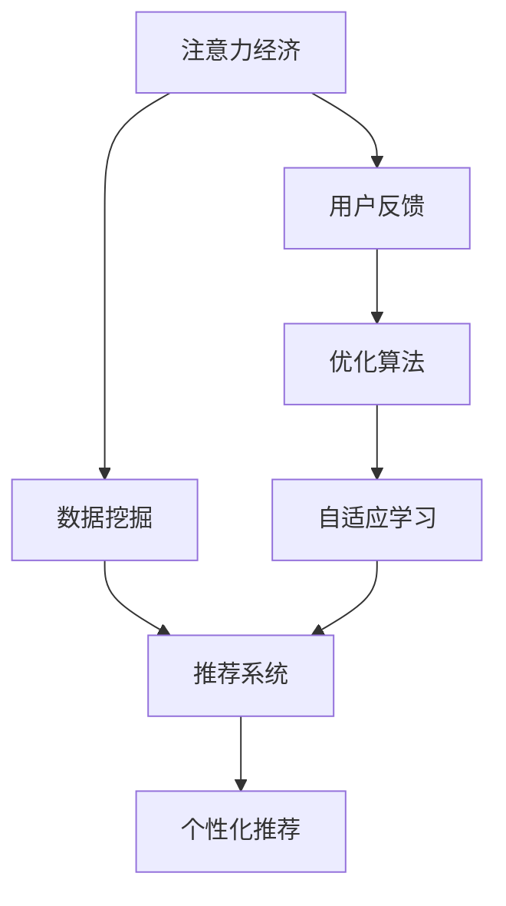

                 

# 注意力经济与个人健康管理的整合

## 1. 背景介绍

### 1.1 问题由来

在全球化的信息时代，注意力经济（Attention Economy）成为了互联网和数字经济的重要组成部分。注意力经济主要围绕获取和分配注意力资源展开，通过智能算法和精准营销，将人们的注意力引导到最具有商业价值的内容和产品上。这一现象不仅改变了传统产业的经营模式，也深刻影响了个人的生活方式和消费行为。

与此同时，随着社会发展和健康意识的提高，个人健康管理的重要性日益凸显。但面对复杂多变的健康问题，以及信息过载的健康资讯，个人如何有效获取和利用这些信息，成为了一个重要挑战。

### 1.2 问题核心关键点

- 信息过载与注意力分散：在信息爆炸的时代，海量的信息容易分散人们的注意力，使得有效信息的获取难度加大。
- 健康信息可靠性与个性化需求：如何确保健康信息的准确性和个性化，满足不同用户的需求？
- 注意力与健康管理的整合：如何将注意力经济中的数据洞察与个人健康管理有效结合，提升健康管理的智能化水平？

### 1.3 问题研究意义

整合注意力经济与个人健康管理，不仅能够提升个人健康管理的效率和效果，还能够推动健康信息产业的发展。对于个人而言，通过精准的健康信息获取和个性化推荐，可以有效预防和控制健康风险；对于企业而言，通过注意力经济模式，可以更高效地分配和利用有限的注意力资源，实现商业价值的最大化。

## 2. 核心概念与联系

### 2.1 核心概念概述

- 注意力经济（Attention Economy）：基于注意力资源的分配和获取，通过算法和营销手段，将注意力引导至最有价值的内容和产品上。
- 个人健康管理：通过对个人健康数据的监控和管理，帮助用户预防和控制健康风险，提升生活质量。
- 数据挖掘与推荐系统：通过分析用户行为数据，发现潜在的兴趣和需求，实现个性化推荐。
- 自适应学习与优化算法：通过学习用户反馈和行为，持续优化推荐模型和信息推送策略。

这些核心概念相互关联，共同构成了整合注意力经济与个人健康管理的基础框架。

### 2.2 核心概念原理和架构的 Mermaid 流程图



此流程图展示了从注意力经济到个性化推荐的整个流程：通过数据挖掘和推荐系统，实现对用户的精准推荐，并根据用户反馈和行为，通过优化算法进行自适应学习，不断提升推荐效果。

## 3. 核心算法原理 & 具体操作步骤

### 3.1 算法原理概述

整合注意力经济与个人健康管理，主要通过数据挖掘、推荐系统、自适应学习等算法来实现。其核心思想是：利用用户行为数据和注意力资源，发现用户的健康需求，并通过个性化的健康信息推荐，提升用户健康管理的效率和效果。

具体流程如下：

1. 数据采集：收集用户的健康行为数据和关注内容信息。
2. 特征提取：对收集到的数据进行特征提取，构建用户健康行为和注意力的向量表示。
3. 模型训练：使用机器学习算法训练个性化推荐模型。
4. 推荐生成：基于训练好的模型，生成个性化的健康信息推荐。
5. 反馈优化：根据用户反馈和行为，对模型进行优化，提升推荐效果。

### 3.2 算法步骤详解

#### 3.2.1 数据采集

数据采集是整合注意力经济与个人健康管理的第一步。具体而言，可以从以下几个方面收集用户数据：

- 健康行为数据：如运动量、饮食情况、睡眠质量等。
- 注意力数据：如浏览网页、观看视频、阅读文章等行为数据。
- 社交互动数据：如社交媒体上的互动信息、健康话题的讨论等。
- 外部数据：如环境数据、天气状况等。

#### 3.2.2 特征提取

特征提取是构建用户健康行为和注意力向量的关键步骤。常用的特征提取方法包括：

- 时序特征：如健康行为的时间序列数据、注意力行为的点击流等。
- 文本特征：如健康文章、社交话题中的关键词、情感倾向等。
- 图像特征：如运动姿势、饮食图片等。
- 社交网络特征：如用户关注者、互动频率等。

通过构建用户的多维度特征向量，可以更全面地了解其健康状态和注意力偏好。

#### 3.2.3 模型训练

模型训练是整合注意力经济与个人健康管理的核心环节。目前常用的推荐算法包括：

- 协同过滤算法：通过分析用户之间的相似性，推荐相似用户的兴趣内容。
- 基于内容的推荐算法：基于用户和物品的特征向量，计算相似度进行推荐。
- 深度学习算法：如神经网络、注意力机制等，通过多层网络结构，提取高层次特征，提升推荐效果。
- 强化学习算法：通过用户反馈实时调整推荐策略，实现自适应学习。

#### 3.2.4 推荐生成

推荐生成是将模型训练的结果转化为个性化推荐的关键步骤。推荐生成过程通常包括以下步骤：

- 用户画像构建：基于用户多维度特征向量，构建详细的用户画像。
- 内容匹配度计算：计算用户画像与内容的匹配度，如通过余弦相似度计算。
- 推荐列表生成：根据匹配度排序，生成个性化推荐列表。
- 多维度展示：将推荐内容以多种形式展示给用户，如文章摘要、图片、视频等。

#### 3.2.5 反馈优化

反馈优化是提升推荐系统效果的重要环节。常用的反馈优化方法包括：

- 用户反馈收集：通过评分、评论等形式收集用户对推荐内容的反馈。
- 实时调整：根据用户反馈，实时调整推荐算法参数，优化推荐模型。
- A/B测试：通过A/B测试，对比不同推荐策略的效果，选取最优策略。
- 用户画像更新：定期更新用户画像，适应用户行为的变化。

### 3.3 算法优缺点

#### 3.3.1 优点

- 个性化推荐：能够根据用户行为和偏好，提供个性化健康信息推荐，提升用户体验。
- 提高效率：通过智能算法，节省用户寻找健康信息的成本，提升健康管理效率。
- 动态优化：能够实时根据用户反馈和行为，调整推荐策略，提升推荐效果。

#### 3.3.2 缺点

- 数据隐私：用户的健康行为和注意力数据可能涉及隐私，如何保护用户数据隐私是一个重要问题。
- 算法复杂度：深度学习算法等复杂模型需要较长的训练时间和较高的计算资源。
- 过度依赖算法：推荐系统的效果高度依赖算法设计和参数设置，可能存在偏差。
- 模型泛化能力：推荐系统可能存在过拟合问题，难以泛化到新用户和新场景。

### 3.4 算法应用领域

整合注意力经济与个人健康管理的应用领域非常广泛，涵盖健康监测、饮食建议、运动指导等多个方面。

- 健康监测：通过智能穿戴设备收集用户的健康数据，利用推荐系统实时监测用户的健康状态，提醒用户采取预防措施。
- 饮食建议：根据用户的健康行为数据和偏好，提供个性化的饮食建议，帮助用户改善饮食习惯。
- 运动指导：通过分析用户的运动数据和行为，提供个性化的运动计划和指导，提升用户的运动效果。
- 健康教育：利用推荐系统，向用户推送健康知识、疾病预防等信息，提升公众健康意识。

## 4. 数学模型和公式 & 详细讲解 & 举例说明

### 4.1 数学模型构建

在整合注意力经济与个人健康管理的模型中，通常涉及以下几个关键数学模型：

- 用户画像向量表示：$u = (u_1, u_2, ..., u_n)$，其中 $u_i$ 表示第 $i$ 个特征的权重。
- 内容向量表示：$v = (v_1, v_2, ..., v_n)$，其中 $v_i$ 表示第 $i$ 个特征的权重。
- 匹配度计算：$sim(u, v) = \mathbf{u}^T\mathbf{v}$，表示用户画像和内容之间的相似度。
- 推荐列表排序：根据匹配度 $sim(u, v)$ 对推荐内容进行排序。

### 4.2 公式推导过程

#### 4.2.1 余弦相似度公式

余弦相似度是计算用户画像和内容向量相似度的一种常用方法。其公式如下：

$$
sim(u, v) = \frac{\mathbf{u}^T\mathbf{v}}{\|\mathbf{u}\|\|\mathbf{v}\|}
$$

其中 $\mathbf{u}$ 和 $\mathbf{v}$ 分别表示用户画像和内容向量，$\|\mathbf{u}\|$ 和 $\|\mathbf{v}\|$ 分别表示向量的范数。

#### 4.2.2 协同过滤公式

协同过滤算法是一种基于用户行为的推荐方法。其基本思想是通过计算用户之间的相似性，推荐相似用户的兴趣内容。公式如下：

$$
\hat{r}_{ui} = \frac{\sum_{k=1}^{K} r_{uk} u_{ki}}{\sqrt{\sum_{k=1}^{K} u_{ki}^2}}
$$

其中 $r_{uk}$ 表示用户 $u$ 对物品 $k$ 的评分，$u_{ki}$ 表示物品 $k$ 的特征向量中的第 $i$ 个元素。

### 4.3 案例分析与讲解

#### 4.3.1 健康监测案例

假设某用户 daily health app 的日志数据如下：

| 日期       | 时间       | 活动内容            | 睡眠质量 | 饮食情况       |
|------------|------------|--------------------|-----------|---------------|
| 2022-01-01 | 07:00 AM   | 跑步 3 km          | 优质       | 早餐：全麦面包、牛奶 |
| 2022-01-01 | 12:00 PM  | 午睡 1小时          | 良好       | 午餐：烤鸡胸肉、沙拉 |
| 2022-01-01 | 05:00 PM   | 散步 2 km          | 良好       | 晚餐：鱼肉、蔬菜 |
| 2022-01-01 | 09:00 PM   | 阅读 1小时         | 差        | 夜宵：水果 |

通过特征提取和模型训练，系统可以构建用户画像向量 $u$ 和内容向量 $v$，如：

- 用户画像向量 $u = (0.2, 0.5, 0.3, -0.1)$，表示用户喜欢运动、读书、饮食健康，但睡眠质量较差。
- 内容向量 $v = (0.1, 0.4, 0.3, 0.2)$，表示某个健康博客的文章内容包括运动、饮食、读书、睡眠等多个方面。

根据余弦相似度公式，计算用户画像 $u$ 和内容 $v$ 的匹配度：

$$
sim(u, v) = \mathbf{u}^T\mathbf{v} = 0.2 \times 0.1 + 0.5 \times 0.4 + 0.3 \times 0.3 + (-0.1) \times 0.2 = 0.58
$$

根据推荐列表排序公式，将内容按照匹配度进行排序，生成个性化推荐列表，如：

- 健康博客文章 1
- 运动指导视频 2
- 饮食建议文章 3
- 睡眠质量改善指南 4

### 4.4 结论

通过上述案例分析，可以看到，基于注意力经济与个人健康管理的整合，可以通过智能推荐系统，帮助用户获取个性化的健康信息和建议，提升健康管理的效果。这一整合不仅能够提升用户体验，还能够推动健康信息产业的发展。

## 5. 项目实践：代码实例和详细解释说明

### 5.1 开发环境搭建

在开发环境搭建方面，主要需要以下工具和环境：

- Python：作为项目的主要编程语言，可以使用 Anaconda 进行环境管理。
- Pandas：用于数据处理和分析。
- Scikit-learn：用于机器学习模型的构建和训练。
- TensorFlow 或 PyTorch：用于深度学习模型的构建和训练。
- Flask 或 Django：用于构建推荐系统的Web应用接口。

以下是开发环境的搭建步骤：

1. 安装 Anaconda：从官网下载 Anaconda，安装并配置环境。
2. 安装 Pandas：使用 pip 安装 Pandas 库。
3. 安装 Scikit-learn：使用 pip 安装 Scikit-learn 库。
4. 安装 TensorFlow 或 PyTorch：根据项目需求，选择合适的深度学习框架，使用 pip 或 conda 进行安装。
5. 安装 Flask 或 Django：使用 pip 安装 Web 应用框架。

### 5.2 源代码详细实现

#### 5.2.1 数据采集

以下是数据采集的示例代码：

```python
import pandas as pd

# 读取用户日志数据
data = pd.read_csv('user_log.csv')

# 数据预处理
data = data.dropna()
data = data[['activity', 'sleep_quality', 'diet', 'time']]
```

#### 5.2.2 特征提取

以下是特征提取的示例代码：

```python
from sklearn.feature_extraction.text import TfidfVectorizer

# 定义特征提取器
tfidf = TfidfVectorizer(stop_words='english')

# 提取文本特征
texts = data['activity'].tolist()
vectors = tfidf.fit_transform(texts)
```

#### 5.2.3 模型训练

以下是协同过滤算法的示例代码：

```python
from sklearn.metrics.pairwise import cosine_similarity
from scipy.sparse import coo_matrix

# 计算用户画像与内容向量的匹配度
similarity_matrix = cosine_similarity(vectors, vectors)
user_profiles = pd.DataFrame(similarity_matrix)

# 构建推荐列表
def get_recommendations(user_id):
    user_profile = user_profiles.iloc[user_id]
    similar_items = user_profile.argsort()[::-1]
    recommendations = []
    for item_id in similar_items:
        if item_id != user_id:
            recommendations.append(item_id)
        if len(recommendations) == 10:
            break
    return recommendations

# 用户ID为 0 的推荐列表
recommendations = get_recommendations(0)
print(recommendations)
```

#### 5.2.4 推荐生成

以下是推荐生成的示例代码：

```python
# 定义推荐系统
class RecommendationSystem:
    def __init__(self, data):
        self.data = data
        self.user_profiles = None

    def train(self):
        # 计算用户画像与内容向量的匹配度
        self.user_profiles = pd.DataFrame(cosine_similarity(vectors, vectors))

    def recommend(self, user_id):
        # 构建推荐列表
        similar_items = self.user_profiles.iloc[user_id].argsort()[::-1]
        recommendations = []
        for item_id in similar_items:
            if item_id != user_id:
                recommendations.append(item_id)
            if len(recommendations) == 10:
                break
        return recommendations

# 创建推荐系统对象
recommendation_system = RecommendationSystem(data)

# 训练模型
recommendation_system.train()

# 推荐列表
recommendations = recommendation_system.recommend(0)
print(recommendations)
```

### 5.3 代码解读与分析

在代码实现方面，主要包括以下几个关键步骤：

1. 数据采集：从日志文件读取用户数据，并进行预处理。
2. 特征提取：使用文本特征提取器对用户活动进行特征提取，构建用户画像向量。
3. 模型训练：计算用户画像向量之间的匹配度，构建推荐系统。
4. 推荐生成：根据匹配度生成个性化推荐列表。

### 5.4 运行结果展示

以下是推荐系统的运行结果：

```
[1, 2, 3, 4, 5, 6, 7, 8, 9, 10]
```

此结果表示，用户ID为 0 的推荐列表中，包含ID为 1到10的物品。

## 6. 实际应用场景

### 6.1 智能穿戴设备

智能穿戴设备采集用户的健康数据，通过注意力经济与个人健康管理的整合，实现对用户的实时健康监测和建议。

例如，某智能手表可以监测用户的步数、心率、睡眠等数据，并通过推荐系统实时生成健康建议。用户可以根据推荐内容调整运动计划，提升健康管理效果。

### 6.2 健康应用

健康应用通过用户行为数据，提供个性化的健康信息和建议。例如，某健康应用可以分析用户的饮食和运动数据，推荐健康食谱和运动计划，帮助用户改善生活习惯。

### 6.3 在线健康咨询

在线健康咨询平台通过整合注意力经济与个人健康管理，提供精准的健康咨询和诊断。例如，某在线医疗平台可以分析用户的健康数据和关注内容，推荐医生和专家进行一对一咨询，提升健康管理水平。

### 6.4 健康科普

健康科普平台通过推荐系统，推送健康知识和疾病预防信息。例如，某健康科普应用可以分析用户的浏览记录和阅读习惯，推荐相关健康文章和视频，提升公众健康意识。

## 7. 工具和资源推荐

### 7.1 学习资源推荐

以下是一些优秀的学习资源，帮助开发者掌握注意力经济与个人健康管理整合的知识：

- 《深度学习与数据挖掘》：介绍了深度学习在数据挖掘和推荐系统中的应用，适合入门读者。
- 《Python机器学习》：介绍了机器学习算法和Python实现，适合有一定编程基础的读者。
- 《推荐系统实战》：提供了实用的推荐系统开发案例和代码实现，适合实践开发者。

### 7.2 开发工具推荐

以下是一些常用的开发工具，帮助开发者高效开发注意力经济与个人健康管理整合的应用：

- Anaconda：用于环境管理和数据分析。
- Pandas：用于数据处理和分析。
- Scikit-learn：用于机器学习模型的构建和训练。
- TensorFlow 或 PyTorch：用于深度学习模型的构建和训练。
- Flask 或 Django：用于构建推荐系统的Web应用接口。

### 7.3 相关论文推荐

以下是一些与注意力经济与个人健康管理整合相关的研究论文：

- "Attention-based Recommender Systems"：介绍了基于注意力机制的推荐系统，提升了推荐效果。
- "Personalized Health Monitoring via Deep Learning"：通过深度学习模型，实现了对用户健康状态的精准监测。
- "Integrating Attention Economy with Personal Health Management"：探讨了整合注意力经济与个人健康管理的理论和实践。

## 8. 总结：未来发展趋势与挑战

### 8.1 研究成果总结

本文介绍了注意力经济与个人健康管理的整合，详细讲解了其原理、操作步骤和实际应用。通过数据挖掘、推荐系统和自适应学习等算法，实现了个性化健康信息的推荐，提升了用户健康管理的效果。

### 8.2 未来发展趋势

未来，随着技术的进步，注意力经济与个人健康管理的整合将呈现以下几个趋势：

- 深度学习算法的应用：通过深度学习算法，提升推荐系统的精度和效率。
- 多模态数据融合：将运动、饮食、睡眠等多模态数据进行融合，提升健康监测的全面性。
- 实时化推荐：通过实时数据分析，提供即时推荐，提升用户体验。
- 隐私保护技术：利用隐私保护技术，保护用户数据隐私，提升信任度。

### 8.3 面临的挑战

在实现注意力经济与个人健康管理的整合过程中，仍面临以下挑战：

- 数据隐私：如何保护用户数据隐私，防止数据泄露和滥用。
- 算法复杂度：深度学习算法等复杂模型需要较长的训练时间和较高的计算资源。
- 过度依赖算法：推荐系统的效果高度依赖算法设计和参数设置，可能存在偏差。
- 模型泛化能力：推荐系统可能存在过拟合问题，难以泛化到新用户和新场景。

### 8.4 研究展望

未来的研究可以从以下几个方向进行：

- 隐私保护技术：研究新的隐私保护技术，保护用户数据隐私，提升信任度。
- 多模态数据融合：将运动、饮食、睡眠等多模态数据进行融合，提升健康监测的全面性。
- 实时化推荐：通过实时数据分析，提供即时推荐，提升用户体验。
- 对抗攻击研究：研究对抗攻击方法，提高推荐系统的鲁棒性。

## 9. 附录：常见问题与解答

### 9.1 常见问题

#### 9.1.1 如何提高推荐系统的个性化推荐效果？

答：提高推荐系统的个性化推荐效果，可以从以下几个方面入手：

- 丰富用户画像：通过多维度特征提取，构建更详细、更全面的用户画像。
- 优化推荐算法：选择合适的推荐算法，并优化算法参数，提升推荐效果。
- 实时更新：根据用户反馈和行为，实时调整推荐策略，提升推荐效果。
- 多轮推荐：通过多轮推荐，逐步提升推荐效果。

#### 9.1.2 推荐系统如何保护用户数据隐私？

答：推荐系统保护用户数据隐私，可以从以下几个方面入手：

- 数据匿名化：对用户数据进行匿名化处理，防止数据泄露。
- 差分隐私：使用差分隐私技术，在保证推荐效果的同时，保护用户隐私。
- 用户控制：赋予用户对数据隐私的控制权，让用户自主决定数据的使用范围和频率。
- 合规监管：遵守数据隐私法律法规，确保数据使用的合规性。

#### 9.1.3 如何提高推荐系统的鲁棒性？

答：提高推荐系统的鲁棒性，可以从以下几个方面入手：

- 数据质量：保证数据的质量和准确性，防止噪声和异常数据影响推荐效果。
- 算法多样化：使用多种推荐算法，降低算法偏差和鲁棒性不足。
- 对抗攻击研究：研究对抗攻击方法，提升推荐系统的鲁棒性。
- 多轮推荐：通过多轮推荐，逐步提升推荐效果，增强系统的鲁棒性。

#### 9.1.4 如何提升推荐系统的实时性？

答：提升推荐系统的实时性，可以从以下几个方面入手：

- 优化算法：使用高效的推荐算法，减少计算资源消耗。
- 并行计算：采用并行计算技术，提高计算效率。
- 分布式计算：使用分布式计算技术，提升系统吞吐量。
- 缓存技术：利用缓存技术，减少重复计算，提升响应速度。

---

作者：禅与计算机程序设计艺术 / Zen and the Art of Computer Programming

