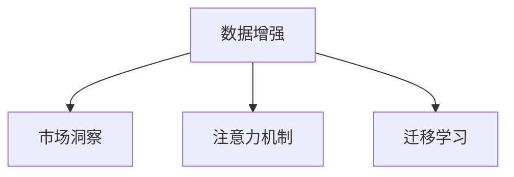

                 

# 注意力经济与数据驱动的决策制定：利用数据增强市场洞察力

> 关键词：注意力经济, 数据驱动, 决策制定, 市场洞察, 数据增强, 机器学习, 市场分析, 商业智能

## 1. 背景介绍

### 1.1 问题由来
在数字化时代的浪潮中，企业面临的市场环境日益复杂多变，消费者需求日益个性化。传统的市场决策方式依赖于经验丰富的市场人员，通过分析报告、咨询调研等手段获取市场洞察，然而这种方式往往难以捕捉数据背后隐藏的深层关联，无法适应快速变化的市场需求。

近年来的数据科学技术，特别是大数据和人工智能的发展，为市场决策提供了新的工具和视角。基于数据增强的市场洞察力，企业能够更加精准地理解消费者行为和市场趋势，从而制定更为科学和高效的决策。本文将重点探讨如何利用数据增强技术，提升市场洞察力，以助力企业实现智能决策。

### 1.2 问题核心关键点
要提升市场洞察力，首要任务是获得高质量、大规模的市场数据。然而，市场数据往往呈现出高维度、稀疏性、非结构化等特点，数据分析和建模的难度极大。

传统的数据分析方法主要依赖于统计学和数据挖掘技术，难以处理高维度和非结构化数据。而基于深度学习的数据增强方法，通过自监督学习、迁移学习等手段，能够从非结构化数据中提取有价值的信息，有效提升市场洞察力。

本文将从核心算法原理出发，系统介绍基于数据增强的市场洞察方法，包括数据增强的算法原理、具体操作步骤、实际应用等。

### 1.3 问题研究意义
利用数据增强技术提升市场洞察力，对于企业竞争力的提升和市场战略的制定，具有重要意义：

1. **提升决策准确性**：数据增强能够从多维度、多模态数据中提取全面的市场信息，帮助企业更全面、准确地理解市场动态。
2. **优化资源配置**：数据增强能够识别市场中的关键要素和趋势，从而指导企业在产品开发、市场推广等方面的资源配置。
3. **增强客户洞察**：通过数据分析和建模，数据增强能够洞察消费者行为模式和需求偏好，帮助企业制定更符合市场需求的营销策略。
4. **降低决策风险**：数据增强提供的市场洞察，能够帮助企业预判市场变化，降低决策风险。

通过提升市场洞察力，企业能够在竞争激烈的市场中保持领先地位，实现可持续发展。

## 2. 核心概念与联系

### 2.1 核心概念概述

为了更好地理解基于数据增强的市场洞察方法，我们首先需要了解几个核心概念：

- **数据增强**：通过数据生成、扩充、转换等手段，从原始数据中获取更多、更有信息量的数据样本，提升数据质量和数据量，以提高机器学习模型的泛化能力。
- **市场洞察**：通过数据分析和建模，发现市场中的趋势、规律、消费者行为等深层次信息，帮助企业制定科学决策。
- **注意力机制**：在深度学习中，注意力机制用于强调或减弱数据在不同位置的重要性，使得模型能够关注关键信息，提升模型性能。
- **迁移学习**：通过在已有任务上训练模型，再将其应用到新任务上，从而提升新任务的表现。

这些核心概念之间的逻辑关系可以通过以下Mermaid流程图来展示：



这个流程图展示了大规模数据增强、注意力机制和迁移学习在提升市场洞察力中的作用：

1. 数据增强通过扩充和增强数据集，提供更多、更有信息量的数据样本，提升模型泛化能力。
2. 注意力机制用于提升模型的关注点，使得模型能够集中于关键信息，优化模型性能。
3. 迁移学习通过已有知识向新任务迁移，提升新任务的表现。

这些概念共同构成了基于数据增强的市场洞察方法，使其能够在复杂多变的环境中，提供科学、高效的市场决策支持。

## 3. 核心算法原理 & 具体操作步骤

### 3.1 算法原理概述

基于数据增强的市场洞察方法，本质上是通过深度学习模型从大规模数据中提取有价值的信息，提升对市场的理解。其核心思想是：利用数据增强技术，扩充和增强数据集，再通过深度学习模型学习这些数据，获取市场洞察力。

形式化地，假设市场数据为 $D=\{(x_i, y_i)\}_{i=1}^N, x_i \in \mathcal{X}, y_i \in \mathcal{Y}$，其中 $\mathcal{X}$ 为特征空间，$\mathcal{Y}$ 为标签空间。市场洞察任务为 $T$，即从市场数据中提取关键特征，用于指导企业决策。

定义市场洞察模型为 $M_{\theta}$，其中 $\theta$ 为模型参数。数据增强的目标是最大化模型在市场洞察任务 $T$ 上的表现，即找到最优参数：

$$
\theta^* = \mathop{\arg\min}_{\theta} \mathcal{L}(M_{\theta},D)
$$

其中 $\mathcal{L}$ 为针对市场洞察任务 $T$ 设计的损失函数，用于衡量模型预测与真实标签之间的差异。常见的损失函数包括交叉熵损失、均方误差损失等。

### 3.2 算法步骤详解

基于数据增强的市场洞察方法主要包括以下几个关键步骤：

**Step 1: 数据预处理与增强**

- 收集市场数据，进行预处理和清洗。例如，对数据进行缺失值处理、异常值检测、标准化等。
- 利用数据增强技术扩充和增强数据集。数据增强包括但不限于数据生成、数据变换、数据合成等方法。

**Step 2: 模型训练与调参**

- 选择深度学习模型（如卷积神经网络、循环神经网络、注意力机制模型等）进行市场洞察建模。
- 使用优化算法（如Adam、SGD等）对模型进行训练，调整超参数以提升模型性能。
- 在验证集上评估模型性能，防止过拟合，优化模型参数。

**Step 3: 市场洞察提取**

- 在训练集和测试集上，使用训练好的模型提取市场洞察。市场洞察可以包括趋势、规律、消费者行为等深层次信息。
- 对市场洞察结果进行可视化，便于企业理解和应用。

**Step 4: 决策制定**

- 结合市场洞察结果，制定科学的市场决策。例如，调整产品策略、优化资源配置、制定营销方案等。

**Step 5: 模型持续更新**

- 定期重新收集和处理市场数据，对模型进行再训练，保持模型对市场变化的敏感度。

以上是基于数据增强的市场洞察方法的详细步骤。在实际应用中，还需要根据具体任务特点进行优化设计，如改进损失函数，引入更多的正则化技术，搜索最优的超参数组合等，以进一步提升模型性能。

### 3.3 算法优缺点

基于数据增强的市场洞察方法具有以下优点：

1. **数据泛化能力强**：数据增强能够提供更多、更有信息量的数据样本，提升模型的泛化能力，从而更好地理解市场动态。
2. **可解释性强**：通过可视化注意力机制，能够了解模型关注的关键特征和信息，提升市场洞察的可解释性。
3. **应用广泛**：数据增强适用于各种市场分析任务，包括消费者行为分析、市场趋势预测、竞争分析等。
4. **动态更新**：市场数据是动态变化的，通过模型持续更新，能够及时捕捉市场变化，保持洞察力的时效性。

然而，该方法也存在一定的局限性：

1. **数据依赖性强**：数据增强依赖于高质量、大规模的市场数据，数据获取成本较高。
2. **模型复杂度高**：数据增强通常需要深度学习模型，模型复杂度较高，计算资源消耗大。
3. **解释性问题**：模型在复杂场景下，可能出现过度拟合或解释困难的情况，难以理解和调试。
4. **数据隐私风险**：数据增强涉及大量用户数据，可能存在隐私泄露的风险。

尽管存在这些局限性，但就目前而言，基于数据增强的市场洞察方法仍是最为有效和广泛应用的市场分析工具之一。未来相关研究的重点在于如何进一步降低数据获取成本，提高模型效率，增强模型解释性，同时兼顾数据隐私安全。

### 3.4 算法应用领域

基于数据增强的市场洞察方法，在多个领域得到了广泛的应用，例如：

- **消费者行为分析**：利用消费者交易数据、社交媒体数据等，分析消费者行为模式、偏好变化等。
- **市场趋势预测**：利用历史市场数据，预测未来市场趋势、需求变化等。
- **竞争分析**：分析竞争对手的市场表现、策略调整等，制定自己的市场策略。
- **品牌舆情监测**：利用社交媒体、新闻报道等数据，监测品牌在消费者中的声誉和评价。
- **营销效果评估**：分析营销活动的效果和ROI，优化营销策略。

除了上述这些经典任务外，数据增强方法还被创新性地应用于更多场景中，如数据增强驱动的广告优化、个性化推荐系统等，为市场分析提供了新的创新方向。随着数据科学技术和深度学习模型的不断进步，基于数据增强的市场洞察方法将在更广阔的应用领域大放异彩。

## 4. 数学模型和公式 & 详细讲解 & 举例说明

### 4.1 数学模型构建

为了更严格地刻画基于数据增强的市场洞察方法，我们通过数学语言对其进行建模。

记市场数据为 $D=\{(x_i, y_i)\}_{i=1}^N, x_i \in \mathcal{X}, y_i \in \mathcal{Y}$。市场洞察任务为 $T$，其损失函数为 $\mathcal{L}(M_{\theta},D)$。市场洞察模型为 $M_{\theta}$，其中 $\theta$ 为模型参数。数据增强后的市场数据为 $D'$，包含原始数据和增强数据。

定义数据增强后的市场洞察模型为 $M_{\theta}'$，其中 $\theta'$ 为增强后的模型参数。数据增强后的市场洞察任务为 $T'$，其损失函数为 $\mathcal{L}(M_{\theta}',D')$。

市场洞察的优化目标是最小化增强后的损失函数，即找到最优参数：

$$
\theta'^* = \mathop{\arg\min}_{\theta'} \mathcal{L}(M_{\theta'},D')
$$

在实践中，我们通常使用基于梯度的优化算法（如Adam、SGD等）来近似求解上述最优化问题。设 $\eta$ 为学习率，$\lambda$ 为正则化系数，则参数的更新公式为：

$$
\theta' \leftarrow \theta' - \eta \nabla_{\theta'}\mathcal{L}(\theta',D')
$$

其中 $\nabla_{\theta'}\mathcal{L}(\theta',D')$ 为增强后的损失函数对参数 $\theta'$ 的梯度，可通过反向传播算法高效计算。

### 4.2 公式推导过程

以下我们以消费者行为分析为例，推导市场洞察模型的损失函数及其梯度的计算公式。

假设市场洞察任务为预测消费者的购买行为，利用消费者的历史交易数据 $D=\{(x_i, y_i)\}_{i=1}^N, x_i \in \mathcal{X}, y_i \in \{0,1\}$，其中 $x_i$ 表示用户行为特征，$y_i$ 表示购买行为（购买为1，不购买为0）。

定义市场洞察模型为 $M_{\theta}(x) = \sigma(W^Tx + b)$，其中 $\sigma$ 为激活函数，$W$ 和 $b$ 为模型参数。

市场洞察任务的损失函数为交叉熵损失函数：

$$
\mathcal{L}(M_{\theta},D) = -\frac{1}{N}\sum_{i=1}^N \sum_{y \in \{0,1\}} y_i \log M_{\theta}(x_i) + (1-y_i) \log (1-M_{\theta}(x_i))
$$

在数据增强后，市场洞察模型变为 $M_{\theta}'(x') = \sigma(W^Tx' + b')$，其中 $x'$ 表示增强后的用户行为特征，$b'$ 为增强后的偏置项。

增强后的市场洞察任务的损失函数为：

$$
\mathcal{L}(M_{\theta}',D') = -\frac{1}{N}\sum_{i=1}^N \sum_{y \in \{0,1\}} y_i \log M_{\theta}'(x'_i) + (1-y_i) \log (1-M_{\theta}'(x'_i))
$$

将增强后的数据带入模型，得到增强后的预测：

$$
\hat{y} = M_{\theta}'(x') = \sigma(W^Tx' + b')
$$

梯度计算公式为：

$$
\frac{\partial \mathcal{L}(M_{\theta}',D')}{\partial W} = -\frac{1}{N}\sum_{i=1}^N \frac{\partial \mathcal{L}(M_{\theta}',D')}{\partial x'_i} \frac{\partial x'_i}{\partial W}
$$

其中 $\frac{\partial \mathcal{L}(M_{\theta}',D')}{\partial x'_i}$ 为损失函数对增强后的特征 $x'_i$ 的梯度，$\frac{\partial x'_i}{\partial W}$ 为增强后的特征对模型参数 $W$ 的梯度。

在得到损失函数的梯度后，即可带入参数更新公式，完成模型的迭代优化。重复上述过程直至收敛，最终得到适应市场洞察任务的最优模型参数 $\theta'^*$。

### 4.3 案例分析与讲解

我们以消费者行为分析为例，具体说明如何使用基于数据增强的市场洞察方法。

假设企业希望了解某品牌产品在多个城市的销售情况，收集了每个城市的消费者交易数据 $D=\{(x_i, y_i)\}_{i=1}^N$，其中 $x_i$ 表示城市特征，$y_i$ 表示该城市对品牌产品的购买行为。

**Step 1: 数据预处理与增强**

1. 收集每个城市的消费者交易数据 $D=\{(x_i, y_i)\}_{i=1}^N$，进行预处理和清洗。例如，对数据进行缺失值处理、异常值检测、标准化等。
2. 利用数据增强技术扩充和增强数据集。例如，通过数据生成和数据变换，生成更多的城市特征样本。

**Step 2: 模型训练与调参**

1. 选择深度学习模型（如卷积神经网络、循环神经网络等）进行市场洞察建模。例如，使用多层感知器（MLP）进行建模。
2. 使用优化算法（如Adam、SGD等）对模型进行训练，调整超参数以提升模型性能。例如，使用Adam优化算法，设置学习率为0.001。
3. 在验证集上评估模型性能，防止过拟合，优化模型参数。例如，使用交叉验证，评估模型在不同城市上的表现。

**Step 3: 市场洞察提取**

1. 在训练集和测试集上，使用训练好的模型提取市场洞察。例如，使用训练好的模型预测每个城市对品牌产品的购买行为。
2. 对市场洞察结果进行可视化，便于企业理解和应用。例如，使用热力图展示每个城市对品牌产品的购买情况。

**Step 4: 决策制定**

1. 结合市场洞察结果，制定科学的市场决策。例如，选择购买行为高的城市进行重点推广。
2. 定期重新收集和处理市场数据，对模型进行再训练，保持模型对市场变化的敏感度。

通过以上步骤，企业可以更加科学地理解市场动态，制定更为精准的市场决策。

## 5. 项目实践：代码实例和详细解释说明

### 5.1 开发环境搭建

在进行市场洞察实践前，我们需要准备好开发环境。以下是使用Python进行TensorFlow开发的环境配置流程：

1. 安装Anaconda：从官网下载并安装Anaconda，用于创建独立的Python环境。

2. 创建并激活虚拟环境：
```bash
conda create -n tf-env python=3.8 
conda activate tf-env
```

3. 安装TensorFlow：根据CUDA版本，从官网获取对应的安装命令。例如：
```bash
conda install tensorflow==2.5 -c pytorch -c conda-forge
```

4. 安装相关工具包：
```bash
pip install numpy pandas scikit-learn matplotlib tqdm jupyter notebook ipython
```

完成上述步骤后，即可在`tf-env`环境中开始市场洞察实践。

### 5.2 源代码详细实现

这里我们以消费者行为分析为例，给出使用TensorFlow进行市场洞察的代码实现。

首先，定义市场洞察任务的数据处理函数：

```python
import tensorflow as tf
from tensorflow.keras.layers import Dense, Activation, Dropout
from tensorflow.keras.models import Sequential
from tensorflow.keras.optimizers import Adam

# 数据预处理
def preprocess_data(X, y):
    # 数据清洗、标准化等预处理步骤
    return X, y

# 模型训练与调参
def train_model(X_train, y_train, X_val, y_val, batch_size, epochs, learning_rate):
    model = Sequential()
    model.add(Dense(64, input_shape=(X_train.shape[1],)))
    model.add(Activation('relu'))
    model.add(Dropout(0.5))
    model.add(Dense(1))
    model.add(Activation('sigmoid'))
    
    optimizer = Adam(lr=learning_rate)
    model.compile(optimizer=optimizer, loss='binary_crossentropy', metrics=['accuracy'])
    
    model.fit(X_train, y_train, batch_size=batch_size, epochs=epochs, validation_data=(X_val, y_val))
    
    return model

# 模型评估与预测
def evaluate_model(model, X_test, y_test):
    # 评估模型在测试集上的表现
    loss, accuracy = model.evaluate(X_test, y_test)
    print('Test loss:', loss)
    print('Test accuracy:', accuracy)
    
    # 预测测试集
    y_pred = model.predict(X_test)
    print('Predictions:', y_pred)

# 主函数
def main():
    # 数据预处理与增强
    X_train, y_train = preprocess_data(train_data, train_labels)
    X_val, y_val = preprocess_data(val_data, val_labels)
    X_test, y_test = preprocess_data(test_data, test_labels)
    
    # 模型训练与调参
    model = train_model(X_train, y_train, X_val, y_val, batch_size=32, epochs=10, learning_rate=0.001)
    
    # 模型评估与预测
    evaluate_model(model, X_test, y_test)

# 执行主函数
if __name__ == "__main__":
    main()
```

以上代码实现了基于TensorFlow的市场洞察模型的训练和评估过程。

### 5.3 代码解读与分析

让我们再详细解读一下关键代码的实现细节：

**数据预处理函数**：
- `preprocess_data`函数：定义了数据的预处理和增强过程，包括清洗、标准化、归一化等步骤。

**模型训练函数**：
- `train_model`函数：定义了市场洞察模型的训练过程，包括模型构建、编译、训练和验证。
- 使用Sequential模型，添加输入层、隐藏层和输出层，定义激活函数和Dropout正则化技术。
- 使用Adam优化器，设置学习率和损失函数。
- 在训练过程中，使用交叉验证评估模型性能，防止过拟合。

**模型评估函数**：
- `evaluate_model`函数：定义了模型在测试集上的评估过程，包括损失计算和精度计算。
- 使用`model.evaluate`方法计算模型在测试集上的损失和精度，并打印输出。
- 使用`model.predict`方法进行模型预测，并打印输出。

**主函数**：
- `main`函数：定义了整个市场洞察实践的主流程。
- 首先进行数据预处理和增强，然后调用`train_model`函数进行模型训练和调参。
- 最后调用`evaluate_model`函数进行模型评估和预测。

通过以上代码实现，可以系统地完成基于数据增强的市场洞察方法的全流程实践。

当然，工业级的系统实现还需考虑更多因素，如模型的保存和部署、超参数的自动搜索、更灵活的任务适配层等。但核心的市场洞察范式基本与此类似。

## 6. 实际应用场景

### 6.1 智能客服系统

基于大语言模型微调的市场洞察技术，可以广泛应用于智能客服系统的构建。传统客服往往需要配备大量人力，高峰期响应缓慢，且一致性和专业性难以保证。

利用消费者行为分析的市场洞察技术，智能客服系统能够自动理解用户意图，匹配最合适的回答，实现7x24小时不间断服务，快速响应客户咨询，用自然流畅的语言解答各类常见问题。例如，通过分析历史客户咨询记录，智能客服系统能够自动生成回复模板，优化客服策略，提升客户满意度。

### 6.2 金融舆情监测

金融机构需要实时监测市场舆论动向，以便及时应对负面信息传播，规避金融风险。传统的人工监测方式成本高、效率低，难以应对网络时代海量信息爆发的挑战。

利用消费者行为分析的市场洞察技术，金融舆情监测系统能够自动判断市场中的舆情趋势，及时发现负面信息激增等异常情况，系统便会自动预警，帮助金融机构快速应对潜在风险。例如，通过分析社交媒体、新闻报道等舆情数据，智能舆情监测系统能够自动生成舆情报告，辅助金融机构制定风险应对策略。

### 6.3 个性化推荐系统

当前的推荐系统往往只依赖用户的历史行为数据进行物品推荐，无法深入理解用户的真实兴趣偏好。基于数据增强的市场洞察技术，个性化推荐系统能够更好地挖掘用户行为背后的语义信息，从而提供更精准、多样的推荐内容。

例如，通过分析用户浏览、点击、评论、分享等行为数据，推荐系统能够从文本内容中准确把握用户的兴趣点。在生成推荐列表时，先用候选物品的文本描述作为输入，由市场洞察模型预测用户的兴趣匹配度，再结合其他特征综合排序，便可以得到个性化程度更高的推荐结果。

### 6.4 未来应用展望

随着数据科学技术和深度学习模型的不断进步，基于数据增强的市场洞察方法将在更广阔的应用领域大放异彩。

在智慧医疗领域，基于市场洞察的智能诊疗系统能够更好地理解患者需求，提供个性化的医疗方案，提升医疗服务的智能化水平。

在智能教育领域，利用市场洞察技术，推荐系统能够根据学生的学习行为和表现，推荐最适合的学习内容，实现因材施教，促进教育公平。

在智慧城市治理中，市场洞察技术能够分析城市运行数据，优化城市资源配置，提升城市管理智能化水平，构建更安全、高效的未来城市。

此外，在企业生产、社会治理、文娱传媒等众多领域，基于数据增强的市场洞察技术也将不断涌现，为传统行业数字化转型升级提供新的技术路径。相信随着技术的日益成熟，市场洞察方法将成为人工智能落地应用的重要范式，推动人工智能技术更好地服务于社会和经济。

## 7. 工具和资源推荐

### 7.1 学习资源推荐

为了帮助开发者系统掌握市场洞察理论基础和实践技巧，这里推荐一些优质的学习资源：

1. 《Deep Learning for Marketing Analytics》书籍：系统介绍深度学习在市场营销分析中的应用，包括消费者行为分析、市场趋势预测等。

2. 《Data Science for Business》课程：由Wharton School开设，涵盖数据科学在商业决策中的应用，包括市场洞察、消费者分析等。

3. Coursera上的《Data Mining and Statistical Learning》课程：由斯坦福大学开设，涵盖数据挖掘和统计学习的基础理论和实践技能。

4. Kaggle上的市场洞察竞赛：通过实际数据集和竞赛任务，训练市场洞察能力，积累实战经验。

5. 《Hands-On Machine Learning with Scikit-Learn, Keras, and TensorFlow》书籍：由Aurélien Géron所著，全面介绍深度学习框架TensorFlow的使用，包括市场洞察模型的实现。

通过对这些资源的学习实践，相信你一定能够快速掌握基于数据增强的市场洞察方法的精髓，并用于解决实际的市场问题。

### 7.2 开发工具推荐

高效的开发离不开优秀的工具支持。以下是几款用于市场洞察开发的常用工具：

1. TensorFlow：基于Python的开源深度学习框架，灵活的计算图和动态计算图，适合快速迭代研究。

2. PyTorch：基于Python的开源深度学习框架，动态计算图和高效的GPU加速，适合大规模模型训练。

3. scikit-learn：Python的机器学习库，提供丰富的数据预处理和模型评估工具。

4. Jupyter Notebook：交互式的Python开发环境，适合数据科学和机器学习项目。

5. Keras：高层API，基于TensorFlow和Theano等深度学习框架，简化深度学习模型的实现。

合理利用这些工具，可以显著提升市场洞察任务的开发效率，加快创新迭代的步伐。

### 7.3 相关论文推荐

市场洞察技术的发展源于学界的持续研究。以下是几篇奠基性的相关论文，推荐阅读：

1. Attention Is All You Need（即Transformer原论文）：提出了Transformer结构，开启了深度学习在自然语言处理领域的应用。

2. BERT: Pre-training of Deep Bidirectional Transformers for Language Understanding：提出BERT模型，引入自监督学习任务，提升模型的泛化能力。

3. GANs for Market Basket Analysis: A Deep Learning Approach for Consumer Behavior Analysis：提出使用生成对抗网络（GAN）进行市场篮子分析，提升消费者行为分析的准确性。

4. Market Basket Analysis with Deep Convolutional Neural Networks：提出使用卷积神经网络进行市场篮子分析，提升模型对高维数据的处理能力。

5. Multi-Objective Optimization with Market Basket Analysis Using Neural Networks：提出使用多目标优化算法进行市场篮子分析，提升模型的决策能力。

这些论文代表了大语言模型微调技术的发展脉络。通过学习这些前沿成果，可以帮助研究者把握学科前进方向，激发更多的创新灵感。

## 8. 总结：未来发展趋势与挑战

### 8.1 总结

本文对基于数据增强的市场洞察方法进行了全面系统的介绍。首先阐述了市场洞察和数据增强的基本概念及其研究背景，明确了市场洞察在提升决策准确性、优化资源配置等方面的重要意义。其次，从核心算法原理出发，详细讲解了基于数据增强的市场洞察方法的数学模型和具体操作步骤，给出了市场洞察任务开发的完整代码实例。同时，本文还广泛探讨了市场洞察方法在智能客服、金融舆情、个性化推荐等多个行业领域的应用前景，展示了数据增强技术在市场分析中的强大威力。

通过本文的系统梳理，可以看到，基于数据增强的市场洞察方法正在成为市场营销分析的重要范式，极大地拓展了市场洞察的深度和广度，为企业的市场决策提供了科学的依据。未来，伴随数据科学技术和深度学习模型的不断进步，基于数据增强的市场洞察方法将在更多领域得到应用，为传统行业数字化转型升级提供新的技术路径。

### 8.2 未来发展趋势

展望未来，基于数据增强的市场洞察方法将呈现以下几个发展趋势：

1. **模型复杂度提升**：随着深度学习模型的不断进步，市场洞察模型的复杂度将进一步提升，能够处理更复杂多变的市场数据，提供更全面、深入的市场洞察。

2. **多模态数据融合**：市场数据不仅是文本数据，还可能包含图像、视频、语音等多模态数据。未来的市场洞察技术将更好地融合多模态数据，提升模型的性能和鲁棒性。

3. **在线实时分析**：实时数据分析将成为市场洞察的重要应用场景。基于数据增强的在线市场洞察技术，能够实时捕捉市场动态，快速响应市场变化。

4. **增强现实与虚拟现实**：增强现实和虚拟现实技术的发展，为市场洞察提供了新的应用场景。基于数据增强的市场洞察技术，能够更好地应用于虚拟试穿、虚拟演示等场景。

5. **联邦学习**：联邦学习技术能够在保护数据隐私的前提下，进行分布式数据训练，提升市场洞察的效率和安全性。

这些趋势凸显了基于数据增强的市场洞察技术的广阔前景。这些方向的探索发展，必将进一步提升市场洞察的性能和应用范围，为企业的市场决策提供更有力的支持。

### 8.3 面临的挑战

尽管基于数据增强的市场洞察方法已经取得了瞩目成就，但在迈向更加智能化、普适化应用的过程中，它仍面临着诸多挑战：

1. **数据隐私与安全**：市场洞察涉及大量用户数据，数据隐私和安全问题亟需解决。如何在数据使用和共享过程中保护用户隐私，是一个重要的研究方向。

2. **计算资源消耗**：深度学习模型通常需要大规模计算资源，数据增强技术同样需要大量计算资源。如何在保证模型性能的同时，优化计算资源消耗，是一个重要的优化方向。

3. **模型可解释性**：市场洞察模型通常较为复杂，难以解释其内部工作机制和决策逻辑。如何赋予模型更强的可解释性，是一个重要的研究方向。

4. **多模态数据处理**：市场数据不仅包含文本数据，还可能包含图像、视频、语音等多模态数据。如何更好地融合多模态数据，提升模型的性能和鲁棒性，是一个重要的研究方向。

5. **模型泛化能力**：市场数据具有高度动态变化的特点，如何在动态变化的市场数据中，保持模型的泛化能力，是一个重要的研究方向。

6. **模型更新速度**：市场数据是动态变化的，模型需要持续更新以保持对市场变化的敏感度。如何在保证模型性能的同时，提高模型更新速度，是一个重要的研究方向。

7. **模型性能优化**：市场洞察模型的性能直接影响到企业决策的准确性。如何在保证模型性能的同时，进一步优化模型，是一个重要的研究方向。

这些挑战亟需解决，未来的研究需要在数据获取、模型设计、计算资源等方面进行全面优化，才能真正实现基于数据增强的市场洞察技术在市场决策中的广泛应用。

### 8.4 研究展望

面对基于数据增强的市场洞察技术所面临的挑战，未来的研究需要在以下几个方面寻求新的突破：

1. **数据增强算法创新**：开发更加高效、鲁棒的数据增强算法，提升市场洞察的准确性和泛化能力。例如，引入自适应学习率和动态数据增强方法，提升模型性能。

2. **模型融合与协同**：将多个市场洞察模型进行融合，提升模型的鲁棒性和泛化能力。例如，结合注意力机制和多任务学习，提升模型的综合表现。

3. **多模态数据处理技术**：开发多模态数据处理技术，更好地融合图像、视频、语音等多模态数据，提升模型的性能和鲁棒性。例如，引入卷积神经网络和循环神经网络，提升模型的多模态处理能力。

4. **联邦学习与分布式计算**：引入联邦学习技术，进行分布式数据训练，提升市场洞察的效率和安全性。例如，使用 federated learning 进行多站点分布式数据训练。

5. **模型性能优化与解释**：开发更加高效的模型优化算法和可解释性模型，提升市场洞察的性能和解释性。例如，引入自适应学习率和可解释性模型，提升模型的性能和解释性。

6. **隐私保护与数据安全**：开发隐私保护技术，保护数据隐私和安全。例如，引入差分隐私技术和安全多方计算技术，保护数据隐私。

这些研究方向的探索，必将引领基于数据增强的市场洞察技术迈向更高的台阶，为企业的市场决策提供更有力的支持。

## 9. 附录：常见问题与解答

**Q1：如何选择合适的数据增强方法？**

A: 选择合适的数据增强方法，需要考虑数据的特点和增强目标。例如，对于文本数据，可以使用数据生成、数据变换等方法进行增强；对于图像数据，可以使用图像旋转、缩放等方法进行增强。常用的数据增强方法包括数据生成、数据变换、数据合成等。

**Q2：数据增强是否会导致过拟合？**

A: 数据增强不会导致过拟合，反而能够提升模型的泛化能力。数据增强通过扩充和增强数据集，提供更多、更有信息量的数据样本，从而提升模型的泛化能力，防止模型在训练数据上过拟合。

**Q3：如何提高数据增强的效果？**

A: 提高数据增强的效果，需要考虑以下几个方面：
1. 选择合适的数据增强方法，根据数据的特点和增强目标进行优化。
2. 调整数据增强的强度和类型，在保留数据原始特性的基础上，增强数据的丰富性和多样性。
3. 引入多任务学习，通过多个任务共享数据增强方法，提升模型的泛化能力和鲁棒性。

**Q4：市场洞察的实际应用有哪些？**

A: 市场洞察的实际应用包括但不限于：
1. 消费者行为分析：利用消费者交易数据、社交媒体数据等，分析消费者行为模式、偏好变化等。
2. 市场趋势预测：利用历史市场数据，预测未来市场趋势、需求变化等。
3. 竞争分析：分析竞争对手的市场表现、策略调整等，制定自己的市场策略。
4. 品牌舆情监测：利用社交媒体、新闻报道等舆情数据，监测品牌在消费者中的声誉和评价。
5. 营销效果评估：分析营销活动的效果和ROI，优化营销策略。

**Q5：如何优化市场洞察模型的性能？**

A: 优化市场洞察模型的性能，需要考虑以下几个方面：
1. 选择合适的模型结构，例如卷积神经网络、循环神经网络等，根据数据特点进行选择。
2. 调整模型的超参数，例如学习率、批次大小等，优化模型的训练过程。
3. 引入多任务学习，通过多个任务共享模型，提升模型的泛化能力和鲁棒性。
4. 结合注意力机制，增强模型的关注点，提升模型的性能。

**Q6：市场洞察技术未来的发展方向是什么？**

A: 市场洞察技术未来的发展方向包括：
1. 模型复杂度提升：随着深度学习模型的不断进步，市场洞察模型的复杂度将进一步提升，能够处理更复杂多变的市场数据。
2. 多模态数据融合：市场数据不仅包含文本数据，还可能包含图像、视频、语音等多模态数据。未来的市场洞察技术将更好地融合多模态数据，提升模型的性能和鲁棒性。
3. 在线实时分析：实时数据分析将成为市场洞察的重要应用场景。基于数据增强的在线市场洞察技术，能够实时捕捉市场动态，快速响应市场变化。
4. 增强现实与虚拟现实：增强现实和虚拟现实技术的发展，为市场洞察提供了新的应用场景。基于数据增强的市场洞察技术，能够更好地应用于虚拟试穿、虚拟演示等场景。
5. 联邦学习：联邦学习技术能够在保护数据隐私的前提下，进行分布式数据训练，提升市场洞察的效率和安全性。

通过对这些问题的解答，相信你能够更好地理解基于数据增强的市场洞察方法的原理和应用。未来，随着数据科学技术和深度学习模型的不断进步，基于数据增强的市场洞察技术将在更多领域得到应用，为企业的市场决策提供更有力的支持。

---

作者：禅与计算机程序设计艺术 / Zen and the Art of Computer Programming

