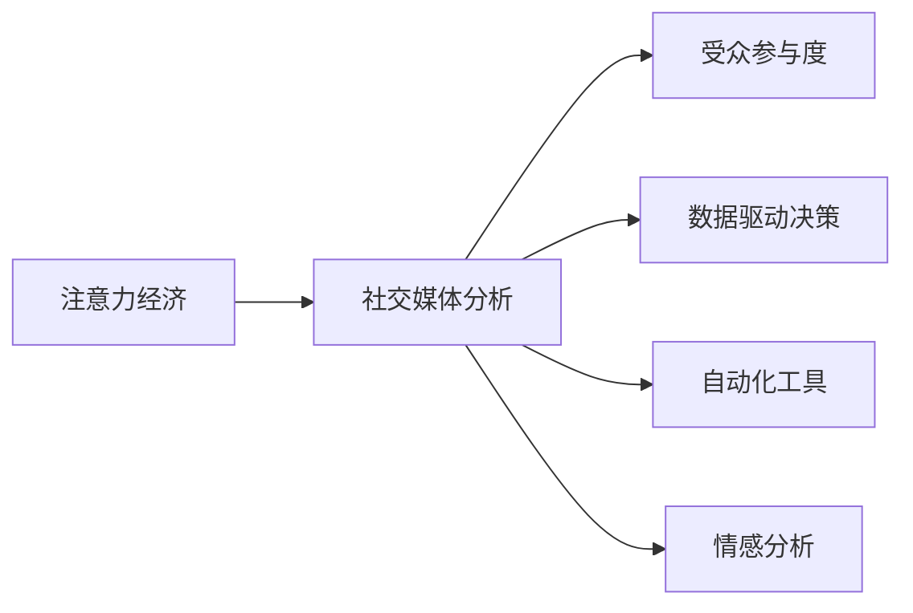

                 

# 注意力经济与社交媒体分析洞见：了解受众参与度的秘密

> 关键词：注意力经济, 社交媒体, 受众参与度, 数据分析, 机器学习, 自然语言处理(NLP), 深度学习, 用户行为分析

## 1. 背景介绍

### 1.1 问题由来

在信息爆炸的互联网时代，注意力成为了一种稀缺资源。各大社交媒体平台为了吸引用户关注，不断在内容和算法上迭代优化。而企业也希望能够在浩如烟海的数据中精准把握受众的兴趣和需求，进行有针对性的营销和运营。由此，注意力经济应运而生，通过分析用户的注意力流向，指导企业的决策方向，构建以用户为中心的商业模式。

### 1.2 问题核心关键点

1. **注意力经济**：利用用户的注意力资源，创造经济价值。企业通过优化内容吸引用户关注，进而提升广告投放效果、增强品牌价值。
2. **社交媒体分析**：通过分析用户社交媒体行为数据，理解用户兴趣和需求，指导内容生产和广告投放策略。
3. **受众参与度**：衡量用户对内容的互动和参与程度，通过量化指标反映用户对品牌的关注和忠诚度。
4. **数据驱动**：将大数据分析与机器学习算法结合，从海量数据中挖掘有价值的洞察，指导决策制定。
5. **自动化工具**：使用自动化工具进行数据处理和分析，提升效率，减少人为误差。
6. **情感分析**：通过情感分析理解用户情感倾向，进一步优化内容和广告策略。

### 1.3 问题研究意义

通过深入理解受众参与度的秘密，企业可以更加精准地进行内容优化和广告投放，提升品牌影响力和用户粘性。这对于构建以用户为中心的商业模式，实现从产品到用户的全链条数字化转型，具有重要意义。同时，也推动了社交媒体分析技术的进步，促进了人工智能在实际应用中的落地。

## 2. 核心概念与联系

### 2.1 核心概念概述

为更好地理解注意力经济和社交媒体分析的原理，本节将介绍几个关键概念：

- **注意力经济**：指通过吸引用户注意力创造经济价值的活动。例如，通过优化内容、互动形式等方式，提升用户参与度，进而实现广告投放、品牌建设等经济目的。
- **社交媒体分析**：通过分析用户在社交媒体上的行为数据，理解其兴趣、需求和情感，指导内容生产和广告投放。
- **受众参与度**：指用户对内容的互动和参与程度，包括点赞、评论、分享等行为，是衡量用户粘性和品牌影响力的重要指标。
- **数据驱动决策**：将大数据分析与机器学习算法结合，从海量数据中挖掘有价值的洞察，指导商业决策。
- **自动化工具**：利用自动化工具进行数据处理、分析，提高效率，减少人为误差。
- **情感分析**：通过情感分析技术，理解用户情感倾向，优化内容和广告策略。

这些概念之间的关系可以用以下Mermaid流程图来表示：



这个流程图展示了注意力经济、社交媒体分析与受众参与度、数据驱动决策、自动化工具和情感分析等关键概念之间的逻辑关系。

## 3. 核心算法原理 & 具体操作步骤

### 3.1 算法原理概述

社交媒体分析的算法原理主要基于自然语言处理（NLP）和机器学习（ML）。具体流程如下：

1. **数据收集**：从社交媒体平台收集用户数据，包括文本、图片、视频等。
2. **数据预处理**：清洗数据，去除噪声和无用信息，转化为模型所需的格式。
3. **特征提取**：使用NLP技术提取文本的语义特征，如词频、情感极性等。
4. **模型训练**：利用机器学习算法（如分类、回归、聚类等）对特征进行训练，建立用户兴趣和行为的模型。
5. **预测与分析**：利用训练好的模型对新数据进行预测，分析用户兴趣和行为模式，指导内容和广告策略。

### 3.2 算法步骤详解

以下是社交媒体分析的核心步骤：

**Step 1: 数据收集**
- 从不同的社交媒体平台（如微博、微信、Twitter等）收集用户数据，包括文本、图片、视频等。
- 使用API接口获取数据，并存储到数据库中。

**Step 2: 数据预处理**
- 清洗数据，去除噪声和无用信息，如过滤掉广告、链接、表情符号等。
- 对文本进行分词、去停用词、词干提取等预处理，转化为模型所需的格式。

**Step 3: 特征提取**
- 使用NLP技术提取文本的语义特征，如词频、情感极性、话题模型等。
- 将提取的特征转化为数值向量，供机器学习模型使用。

**Step 4: 模型训练**
- 选择合适的机器学习算法，如朴素贝叶斯、随机森林、深度学习等。
- 将预处理后的数据分为训练集和测试集，训练模型并评估性能。

**Step 5: 预测与分析**
- 利用训练好的模型对新数据进行预测，分析用户兴趣和行为模式。
- 结合情感分析技术，进一步优化内容和广告策略。

### 3.3 算法优缺点

社交媒体分析的主要优点包括：

1. **高效性**：使用自动化工具进行数据处理和分析，提升效率。
2. **准确性**：结合机器学习算法，从海量数据中挖掘有价值的洞察，指导决策。
3. **全面性**：分析不同类型的数据（文本、图片、视频等），全面了解用户行为。
4. **灵活性**：可以根据不同的分析需求，选择合适的算法和特征。

然而，该方法也存在一些缺点：

1. **数据质量问题**：社交媒体数据的噪声和偏差较大，可能影响分析结果。
2. **隐私保护问题**：用户数据的隐私保护需要引起重视，避免数据滥用。
3. **算法复杂性**：部分算法的复杂度较高，需要较强的技术背景支持。
4. **实时性问题**：对于实时数据分析，处理速度和算法效率需要进一步提升。

### 3.4 算法应用领域

社交媒体分析在多个领域都有广泛应用，例如：

- **品牌营销**：分析用户对品牌的关注和情感倾向，指导广告投放和内容优化。
- **用户研究**：通过分析用户行为数据，理解其需求和兴趣，指导产品设计和改进。
- **舆情监测**：监测社交媒体上的舆情变化，及时调整策略，避免负面影响。
- **广告投放**：分析用户行为数据，指导精准投放，提升广告效果。
- **内容生产**：根据用户兴趣和行为，指导内容生产，吸引用户关注。

这些应用领域展示了社交媒体分析的广泛影响力和实际价值。

## 4. 数学模型和公式 & 详细讲解 & 举例说明

### 4.1 数学模型构建

社交媒体分析的数学模型主要基于文本处理和机器学习算法。以下是几个常见的数学模型：

- **朴素贝叶斯分类器**：
  $$
  P(y|x) = \frac{P(y)P(x|y)}{P(x)}
  $$
  用于分类任务，计算给定文本$x$属于类别$y$的概率。

- **支持向量机（SVM）**：
  $$
  w^* = \arg\min_{w} \frac{1}{2}\|w\|^2 + C\sum_{i=1}^n \max(0, 1-y_iw^Tx_i)
  $$
  用于分类任务，通过找到最优的超平面分类文本。

- **随机森林**：
  $$
  F(x) = \frac{1}{N}\sum_{i=1}^N f_i(x)
  $$
  用于分类或回归任务，通过集成多个决策树进行预测。

### 4.2 公式推导过程

以下是几个经典算法的公式推导过程：

**朴素贝叶斯分类器**
- 给定文本$x$和类别$y$，计算$P(y|x)$的概率：
  $$
  P(y|x) = \frac{P(y)}{P(x)} \prod_{i=1}^n P(x_i|y)
  $$
  其中$n$为特征维度，$x_i$为第$i$个特征。

**支持向量机**
- 给定训练集$(x_i, y_i)$，求解最优的超平面$w$：
  $$
  w^* = \arg\min_{w} \frac{1}{2}\|w\|^2 + C\sum_{i=1}^n \max(0, 1-y_iw^Tx_i)
  $$
  其中$C$为正则化系数，$y_i$为类别标签。

**随机森林**
- 给定训练集$(x_i, y_i)$，通过集成多个决策树$T$进行预测：
  $$
  F(x) = \frac{1}{N}\sum_{i=1}^N f_i(x)
  $$
  其中$f_i(x)$为第$i$棵决策树的预测结果。

### 4.3 案例分析与讲解

以情感分析为例，情感分析是社交媒体分析中常见的任务，用于理解用户的情感倾向。以下是情感分析的案例分析：

**数据集**：某社交媒体平台上用户对某产品的评论数据，包含正面和负面的评论。

**预处理**：对评论进行清洗，去除噪声和无用信息，进行分词、去停用词、词干提取等预处理。

**特征提取**：使用情感词典提取文本情感极性，使用词频、TF-IDF等特征表示文本。

**模型训练**：使用朴素贝叶斯、支持向量机、随机森林等算法训练情感分类模型。

**预测与分析**：利用训练好的模型对新的评论进行情感分类，分析用户的情感倾向。

例如，某品牌发布新产品后，收集到100条评论，使用情感分析模型预测每条评论的情感极性。结果发现，正面评论占60%，负面评论占40%，可以据此调整产品宣传策略，优化用户体验。

## 5. 项目实践：代码实例和详细解释说明

### 5.1 开发环境搭建

在进行社交媒体分析实践前，我们需要准备好开发环境。以下是使用Python进行NLP开发的开发环境配置流程：

1. 安装Anaconda：从官网下载并安装Anaconda，用于创建独立的Python环境。

2. 创建并激活虚拟环境：
```bash
conda create -n nlp-env python=3.8 
conda activate nlp-env
```

3. 安装NLP相关库：
```bash
conda install nltk spacy gensim scikit-learn transformers
```

4. 安装机器学习库：
```bash
pip install scikit-learn xgboost lightgbm catboost
```

5. 安装可视化库：
```bash
pip install matplotlib seaborn
```

完成上述步骤后，即可在`nlp-env`环境中开始社交媒体分析实践。

### 5.2 源代码详细实现

以下是使用Python进行社交媒体分析的代码实现：

```python
import pandas as pd
from sklearn.feature_extraction.text import CountVectorizer
from sklearn.model_selection import train_test_split
from sklearn.naive_bayes import MultinomialNB
from sklearn.svm import SVC
from sklearn.ensemble import RandomForestClassifier
from sklearn.metrics import accuracy_score, confusion_matrix
import matplotlib.pyplot as plt

# 读取数据
data = pd.read_csv('comments.csv')

# 预处理数据
data['text'] = data['text'].str.lower().str.replace('[^\w\s]', '')
data['text'] = data['text'].apply(lambda x: ' '.join([word for word in x.split() if word not in stopwords.words('english')]))
data['text'] = data['text'].apply(lambda x: x.split()[0])
data['label'] = data['label'].astype(int)

# 特征提取
vectorizer = CountVectorizer()
X = vectorizer.fit_transform(data['text'])
y = data['label']

# 划分数据集
X_train, X_test, y_train, y_test = train_test_split(X, y, test_size=0.2, random_state=42)

# 训练模型
clf = MultinomialNB()
clf.fit(X_train, y_train)

# 评估模型
y_pred = clf.predict(X_test)
accuracy = accuracy_score(y_test, y_pred)
confusion_matrix(y_test, y_pred)

# 可视化结果
labels = ['Negative', 'Positive']
plt.figure(figsize=(10, 5))
plt.bar(labels, y_pred)
plt.title('Predicted Labels')
plt.xlabel('Categories')
plt.ylabel('Count')
plt.show()
```

### 5.3 代码解读与分析

让我们再详细解读一下关键代码的实现细节：

**数据读取**：使用pandas库读取社交媒体评论数据，存储在DataFrame中。

**数据预处理**：使用NLTK和Spacy库进行数据清洗，去除噪声和无用信息，进行分词和去停用词处理。

**特征提取**：使用CountVectorizer提取文本的词频特征，将其转化为数值向量。

**模型训练**：使用朴素贝叶斯算法训练分类模型。

**模型评估**：使用测试集评估模型的准确率和混淆矩阵。

**结果可视化**：使用Matplotlib库可视化预测结果，展示不同类别的预测情况。

## 6. 实际应用场景

### 6.1 智能推荐系统

社交媒体分析可以应用于智能推荐系统，帮助企业精准推荐产品和服务。智能推荐系统通过分析用户行为数据，推荐用户可能感兴趣的内容，提升用户体验和转化率。

在实践中，可以通过社交媒体分析识别用户兴趣和行为模式，利用机器学习算法建立用户画像，指导推荐策略。例如，某电商平台分析用户评论数据，发现用户对某类商品感兴趣，便在其社交媒体页面上推荐该商品，增加曝光率和销售量。

### 6.2 品牌监控与舆情分析

品牌监控和舆情分析是社交媒体分析的重要应用。通过分析用户对品牌的评论和情感，帮助企业及时调整策略，提升品牌形象。

在实践中，可以使用情感分析技术监测品牌在社交媒体上的情感倾向，发现负面评论和舆情变化，及时响应和处理。例如，某品牌发布新产品后，通过情感分析监测到部分用户对产品不满意，便迅速调整产品设计和广告策略，提升用户满意度。

### 6.3 社交媒体广告投放

社交媒体广告投放是社交媒体分析的典型应用场景。通过分析用户行为数据，指导广告投放策略，提升广告效果和投资回报率。

在实践中，可以通过社交媒体分析识别目标用户群体，优化广告内容和投放策略。例如，某品牌推出新广告，通过分析用户数据，识别出高潜用户，精准投放广告，提升广告点击率和转化率。

### 6.4 用户行为分析

用户行为分析是社交媒体分析的核心应用之一。通过分析用户行为数据，理解用户兴趣和需求，指导产品设计和改进。

在实践中，可以通过社交媒体分析识别用户行为模式，发现用户痛点和需求，优化产品功能和用户体验。例如，某电商平台通过分析用户评论数据，发现用户对某类功能反馈较多，便迅速改进功能设计，提升用户满意度。

## 7. 工具和资源推荐

### 7.1 学习资源推荐

为了帮助开发者系统掌握社交媒体分析的理论基础和实践技巧，这里推荐一些优质的学习资源：

1. **《自然语言处理综述》**：斯坦福大学提供的NLP在线课程，系统介绍了NLP的基本概念和前沿技术。
2. **《Python文本挖掘与NLP》**：开源书籍，详细介绍文本处理和NLP库的使用，包括数据清洗、特征提取、模型训练等。
3. **《情感分析与情感计算》**：综述性文章，介绍了情感分析的原理和应用，涵盖多个实际案例。
4. **HuggingFace官方文档**：Transformer库的官方文档，提供了丰富的预训练模型和样例代码。
5. **Kaggle竞赛**：Kaggle提供了多个社交媒体分析相关的竞赛，通过竞赛实践学习数据处理和机器学习算法。

通过这些学习资源，相信你一定能够快速掌握社交媒体分析的精髓，并用于解决实际的NLP问题。

### 7.2 开发工具推荐

高效的开发离不开优秀的工具支持。以下是几款用于社交媒体分析开发的常用工具：

1. **Python**：开源编程语言，具有强大的数据处理和机器学习能力。
2. **NLTK**：Python自然语言处理库，提供丰富的NLP工具和数据集。
3. **Spacy**：Python NLP库，提供高效的文本处理和特征提取功能。
4. **Scikit-learn**：Python机器学习库，提供多种经典算法和工具。
5. **XGBoost**：开源机器学习库，支持高效的梯度提升树算法。
6. **TensorBoard**：TensorFlow配套的可视化工具，监测模型训练状态。
7. **Matplotlib**：Python可视化库，生成高质量的图表和可视化结果。

合理利用这些工具，可以显著提升社交媒体分析任务的开发效率，加快创新迭代的步伐。

### 7.3 相关论文推荐

社交媒体分析的研究源于学界的持续研究。以下是几篇奠基性的相关论文，推荐阅读：

1. **《社交媒体上的情感分析》**：综述性文章，总结了情感分析的技术和应用。
2. **《基于用户行为数据的推荐系统》**：介绍推荐系统的原理和实现方法。
3. **《社交媒体中的广告投放优化》**：实证研究，分析了广告投放策略的影响因素。
4. **《基于情感分析的品牌监控》**：案例分析，展示情感分析在品牌监控中的应用。

这些论文代表了大语言模型微调技术的发展脉络。通过学习这些前沿成果，可以帮助研究者把握学科前进方向，激发更多的创新灵感。

## 8. 总结：未来发展趋势与挑战

### 8.1 总结

本文对社交媒体分析的方法和应用进行了全面系统的介绍。首先阐述了社交媒体分析的背景和重要性，明确了注意力经济和社交媒体分析在理解用户参与度和指导决策制定中的独特价值。其次，从原理到实践，详细讲解了社交媒体分析的数学模型和关键步骤，给出了具体的代码实现。同时，本文还广泛探讨了社交媒体分析在智能推荐、品牌监控、广告投放等多个领域的应用前景，展示了社交媒体分析的广泛影响力和实际价值。此外，本文精选了社交媒体分析的各类学习资源，力求为读者提供全方位的技术指引。

通过本文的系统梳理，可以看到，社交媒体分析已经成为企业和品牌了解用户、优化运营的重要手段。这不仅提升了品牌影响力和用户体验，也为人工智能技术在实际应用中的落地提供了新思路。未来，伴随社交媒体分析技术的持续演进，必将在更多行业领域中发挥更大的作用。

### 8.2 未来发展趋势

展望未来，社交媒体分析技术将呈现以下几个发展趋势：

1. **数据融合与多样化**：通过融合社交媒体、搜索引擎、电商等多个数据源，全面了解用户行为和需求。
2. **实时分析与预测**：利用实时数据进行情感分析和舆情监测，及时调整策略。
3. **多模态分析**：结合文本、图像、音频等多种数据类型，提升分析的全面性和准确性。
4. **自动化与智能化**：利用自动化工具进行数据处理和分析，提高效率和准确性。
5. **个性化推荐**：通过深度学习算法，实现个性化推荐，提升用户体验。
6. **情感分析与舆情监测**：利用自然语言处理和机器学习技术，进行情感分析与舆情监测。

以上趋势凸显了社交媒体分析技术的广阔前景。这些方向的探索发展，必将进一步提升社交媒体分析系统的性能和应用范围，为品牌和企业在数字化转型中提供有力的支持。

### 8.3 面临的挑战

尽管社交媒体分析技术已经取得了一定的成就，但在迈向更加智能化、普适化应用的过程中，它仍面临着诸多挑战：

1. **数据质量和多样性**：社交媒体数据的噪声和偏差较大，可能影响分析结果。
2. **隐私保护问题**：用户数据的隐私保护需要引起重视，避免数据滥用。
3. **算法复杂性**：部分算法的复杂度较高，需要较强的技术背景支持。
4. **实时性问题**：对于实时数据分析，处理速度和算法效率需要进一步提升。

### 8.4 研究展望

未来研究需要在以下几个方面寻求新的突破：

1. **无监督与半监督学习**：摆脱对大规模标注数据的依赖，利用自监督学习、主动学习等无监督和半监督范式，最大限度利用非结构化数据，实现更加灵活高效的分析。
2. **多模态分析**：结合文本、图像、音频等多种数据类型，提升分析的全面性和准确性。
3. **自动化与智能化**：利用自动化工具进行数据处理和分析，提高效率和准确性。
4. **个性化推荐**：通过深度学习算法，实现个性化推荐，提升用户体验。
5. **情感分析与舆情监测**：利用自然语言处理和机器学习技术，进行情感分析与舆情监测。
6. **模型解释性与可解释性**：提升模型的解释性和可解释性，帮助用户理解分析结果。

这些研究方向将推动社交媒体分析技术向更智能、更普适、更可靠的方向发展，为品牌和企业在数字化转型中提供更有力的支持。

## 9. 附录：常见问题与解答

**Q1：如何进行数据清洗和预处理？**

A: 数据清洗和预处理是社交媒体分析的基础步骤。常见的清洗和预处理技术包括去除噪声和无用信息、分词、去停用词、词干提取等。可以使用NLTK和Spacy库进行文本处理。

**Q2：如何选择适合的机器学习算法？**

A: 选择合适的机器学习算法需要考虑数据类型、任务类型和数据量等因素。常见的分类算法包括朴素贝叶斯、支持向量机、随机森林等。对于回归任务，可以使用线性回归、决策树等算法。

**Q3：如何评估模型的性能？**

A: 模型的性能评估可以通过准确率、精确率、召回率、F1-score等指标进行衡量。使用测试集进行评估，计算混淆矩阵，可视化分类效果。

**Q4：如何在多模态数据中分析用户行为？**

A: 多模态数据的分析需要使用多种算法和工具。例如，结合文本、图像、音频等多种数据类型，使用不同的特征提取方法，建立多模态模型进行预测。

**Q5：如何在社交媒体平台上进行广告投放优化？**

A: 社交媒体平台的广告投放优化需要结合用户行为数据和广告效果数据，建立预测模型，优化广告投放策略。可以使用A/B测试、多臂赌博机等方法进行广告投放优化。

通过这些回答，希望能帮助你更好地理解社交媒体分析的技术细节和实际应用。进一步掌握社交媒体分析的核心概念和实践技巧，推动人工智能技术在实际应用中的落地和发展。

