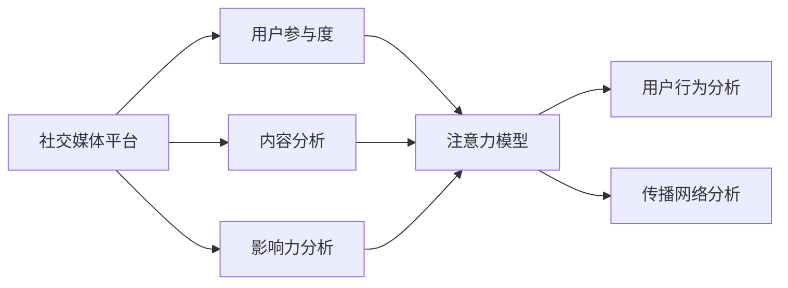

                 

# 注意力经济与社交媒体分析：了解受众参与度和影响力的洞察力

> 关键词：社交媒体, 受众参与度, 内容分析, 影响力, 注意力模型, 用户行为, 情感分析, 传播网络

## 1. 背景介绍

在互联网时代，社交媒体平台已经成为了信息传播、社交互动和广告营销的重要渠道。这些平台汇聚了数以亿计的用户，形成了庞大的“注意力经济”。随着技术的发展和用户习惯的变化，社交媒体对用户的参与度、影响力以及传播效果的影响愈加显著。分析受众在社交媒体上的行为模式、偏好以及影响范围，成为了企业和研究者关注的焦点。本文将从注意力经济的角度出发，深入探讨社交媒体分析的重要性和具体方法。

### 1.1 问题由来

社交媒体平台的兴起，为个人、企业和组织提供了前所未有的互动空间和传播机会。通过发布内容、评论互动和转发分享，用户间形成了复杂而多样的社交网络。然而，如何在海量数据中准确理解和利用这些信息，成为了新的挑战。传统的数据统计和人工分析方法已难以应对这一挑战，急需更先进的数据分析和建模技术来揭示社交媒体背后的深层结构。

### 1.2 问题核心关键点

为了准确理解社交媒体平台上的受众参与度和影响力，我们需要回答以下关键问题：

- 用户如何参与社交媒体平台上的内容？
- 内容对用户有哪些影响？
- 影响力和参与度如何量化和分析？
- 社交网络中的传播效果如何评估？

这些问题涉及用户行为、内容传播、网络结构以及数据分析等多个方面，是社交媒体分析的核心。

### 1.3 问题研究意义

深入分析受众在社交媒体平台上的行为模式，有助于企业更精准地进行内容创作和广告投放。了解用户的影响力，有助于制定更有针对性的用户策略。通过分析社交网络中的传播效果，企业可以优化社交媒体运营，提升品牌影响力和用户参与度。这些分析不仅具有理论意义，更具有广泛的应用价值。

## 2. 核心概念与联系

### 2.1 核心概念概述

在社交媒体分析中，涉及的核心概念包括：

- **社交媒体平台**：如Facebook、Twitter、微信、微博等，是信息传播和用户互动的媒介。
- **受众参与度**：指用户在社交媒体上的活跃程度，如发布内容、评论互动、点赞转发等行为。
- **内容分析**：通过文本挖掘、情感分析等技术，提取和分析用户发布的文本内容。
- **影响力分析**：评估用户或内容对社交网络中其他用户的影响程度，包括传播范围、受众反馈等。
- **注意力模型**：利用用户的行为数据，构建模型来预测用户的参与度、注意力分布以及传播效果。
- **用户行为分析**：研究用户在社交媒体上的行为模式，如浏览偏好、互动频率等。
- **传播网络分析**：分析社交网络中的传播路径、中心节点和影响力节点，评估信息传播的影响力。

这些概念相互联系，共同构成了社交媒体分析的框架。

### 2.2 核心概念原理和架构的 Mermaid 流程图



这个流程图展示了社交媒体分析中核心概念之间的关系。社交媒体平台通过用户行为和内容传播，形成参与度和影响力的基础数据。内容分析、用户行为分析、影响力分析和传播网络分析，则是在这些基础数据上构建的多层次分析方法。注意力模型作为这些分析结果的集成，预测未来的用户行为和传播效果。

## 3. 核心算法原理 & 具体操作步骤

### 3.1 算法原理概述

社交媒体分析的核心算法原理，主要涉及以下几个方面：

- **用户行为分析**：利用用户的行为数据（如点赞、评论、分享等），构建用户参与度的度量指标。
- **内容分析**：通过文本挖掘、情感分析等技术，提取和分析用户发布的内容特征。
- **影响力分析**：基于社交网络的结构特征，评估用户或内容对其他用户的影响程度。
- **注意力模型**：结合用户行为、内容特征和传播网络，构建预测用户参与度和传播效果的模型。

这些算法原理的共同目的是，通过分析社交媒体上的海量数据，揭示用户行为背后的规律，评估内容的传播效果，并预测未来的参与度。

### 3.2 算法步骤详解

#### 3.2.1 用户行为分析

用户行为分析的第一步，是收集和处理社交媒体平台上的用户互动数据。例如，Facebook的用户互动数据包括点赞、评论、分享、关注等。

1. **数据收集**：
   - 从社交媒体平台获取API接口数据。
   - 利用爬虫技术抓取公开数据集。

2. **数据清洗**：
   - 去除重复、无关数据。
   - 处理缺失值和异常值。

3. **特征提取**：
   - 提取用户互动的频次、类型、时间分布等特征。
   - 利用TF-IDF、词频统计等方法，提取文本内容特征。

4. **用户行为建模**：
   - 使用时间序列分析、聚类算法等，建模用户行为模式。
   - 利用强化学习等方法，预测用户未来的行为。

#### 3.2.2 内容分析

内容分析的目的是从用户发布的文本中，提取和分析语言特征、情感倾向、主题等信息。

1. **文本预处理**：
   - 去除停用词、标点符号等噪声。
   - 进行词干提取、词形还原等处理。

2. **特征提取**：
   - 提取词频、TF-IDF、情感分析等特征。
   - 使用主题模型（如LDA），提取文本主题信息。

3. **内容分类**：
   - 利用分类算法（如SVM、决策树），对文本进行分类。
   - 结合文本情感分析和主题模型，进行深度分类。

#### 3.2.3 影响力分析

影响力分析旨在评估用户或内容在社交网络中的传播效果。

1. **网络构建**：
   - 使用社交网络分析算法（如PageRank、中心性分析），构建用户和内容的传播网络。
   - 分析用户之间的连接关系、传播路径等。

2. **影响力和传播度建模**：
   - 利用网络结构特征，如节点度、聚类系数等，评估用户或内容的影响力。
   - 结合传播路径分析，计算内容传播的深度和广度。

#### 3.2.4 注意力模型

注意力模型整合上述分析结果，预测用户未来的参与度和内容传播效果。

1. **数据融合**：
   - 将用户行为数据、内容特征和传播网络信息进行融合。
   - 使用加权平均值、最大最小值等方法，整合多源数据。

2. **模型训练**：
   - 使用监督学习算法（如随机森林、神经网络），训练注意力模型。
   - 结合交叉验证等方法，优化模型参数。

3. **预测和评估**：
   - 利用训练好的模型，进行用户参与度和内容传播效果的预测。
   - 使用AUC、R^2等指标，评估模型的预测性能。

### 3.3 算法优缺点

#### 3.3.1 优点

1. **全面性**：结合用户行为、内容分析和影响力分析，提供全面的社交媒体分析视角。
2. **可操作性**：使用机器学习和数据挖掘技术，提升分析效率和准确性。
3. **实时性**：利用在线数据采集和实时分析技术，提供实时的社交媒体分析结果。
4. **可扩展性**：算法和模型可灵活应用于不同平台和数据集。

#### 3.3.2 缺点

1. **数据隐私问题**：社交媒体平台的数据收集和使用可能涉及用户隐私，需遵循相关法律法规。
2. **数据噪声问题**：社交媒体数据可能存在噪声和偏见，影响分析结果的准确性。
3. **模型复杂性**：多层次、多维度的分析可能导致模型过于复杂，难以解释和优化。
4. **计算资源需求高**：数据量大、模型复杂，需要高性能计算资源。

### 3.4 算法应用领域

社交媒体分析在多个领域都有广泛应用：

1. **广告投放优化**：通过分析用户行为和内容传播效果，制定更加精准的广告投放策略。
2. **内容创作优化**：了解用户偏好和影响范围，优化内容创作和发布时间。
3. **用户关系管理**：分析用户互动和影响力，提升用户关系管理和互动质量。
4. **舆情监测**：监测和分析社交媒体上的舆情变化，及时响应和处理负面信息。
5. **客户服务**：分析用户反馈和互动数据，改进客户服务流程和体验。
6. **品牌管理**：评估品牌在社交媒体上的影响力和用户参与度，提升品牌价值。

这些应用领域展示了社交媒体分析的广泛影响力和实际价值。

## 4. 数学模型和公式 & 详细讲解 & 举例说明

### 4.1 数学模型构建

社交媒体分析涉及多个数学模型，以下是几个关键模型的构建方法：

#### 4.1.1 用户行为分析模型

用户行为分析模型通常包括时间序列分析和聚类分析：

1. **时间序列分析**：
   - 使用ARIMA模型或季节性ARIMA模型（SARIMA），建模用户互动数据的趋势和周期性。
   - 公式：$$\phi(D)(B^t\mu_t - \mu_{t-1}) = \theta(B)r_t$$

2. **聚类分析**：
   - 使用K-means或层次聚类算法，对用户行为进行分类。
   - 公式：$$\sum_{i=1}^n||x_i - \mu_k||^2$$

#### 4.1.2 内容分析模型

内容分析模型通常包括文本挖掘和情感分析：

1. **文本挖掘**：
   - 使用TF-IDF或词频统计方法，提取文本特征。
   - 公式：$$\text{TF-IDF}(t) = \log\frac{N}{df_t} \cdot \log\frac{n}{df}$$

2. **情感分析**：
   - 使用情感词典或基于深度学习的方法，计算文本情感得分。
   - 公式：$$\text{情感得分} = \sum_{i=1}^n w_i \cdot S_i$$

#### 4.1.3 影响力分析模型

影响力分析模型通常包括网络分析和中心性分析：

1. **PageRank算法**：
   - 计算社交网络中节点的影响力得分。
   - 公式：$$\text{PageRank}(v) = (1-d) + d\sum_{u \in N(v)} \frac{1}{k_u} \cdot \text{PageRank}(u)$$

2. **中心性分析**：
   - 计算节点在网络中的中心性指标，如度数中心性、聚类系数等。
   - 公式：$$\text{度数中心性} = \sum_{u \in N(v)} 1$$

#### 4.1.4 注意力模型

注意力模型通常包括集成学习或神经网络模型：

1. **集成学习模型**：
   - 使用随机森林或梯度提升树（GBDT），集成多个分析结果。
   - 公式：$$\text{集成模型} = \frac{1}{n} \sum_{i=1}^n \text{model}_i$$

2. **神经网络模型**：
   - 使用多层感知器（MLP）或循环神经网络（RNN），构建预测模型。
   - 公式：$$\text{神经网络模型} = f(X, \theta)$$

### 4.2 公式推导过程

#### 4.2.1 时间序列分析

以ARIMA模型为例，其推导过程如下：

1. **自回归模型**：
   - 假设$Y_t = \phi_1Y_{t-1} + \epsilon_t$
   - 推导：$$E[Y_t] = \phi_1E[Y_{t-1}] + E[\epsilon_t] = \phi_1E[Y_{t-1}]$$

2. **差分操作**：
   - 对$Y_t$进行一阶差分，得到$I_t = Y_t - Y_{t-1}$
   - 推导：$$I_t = \phi_1I_{t-1} + \epsilon_t$$

3. **自回归移动平均模型**：
   - 结合自回归和移动平均，得到ARIMA模型
   - 推导：$$I_t = \phi_1I_{t-1} + \epsilon_t$$
   - $$Y_t = \alpha + \beta I_t + \gamma \epsilon_t$$

#### 4.2.2 聚类分析

以K-means算法为例，其推导过程如下：

1. **目标函数**：
   - 最小化聚类中心与样本点之间的距离，即$$\sum_{i=1}^n ||x_i - \mu_k||^2$$

2. **聚类中心更新**：
   - 每次迭代更新聚类中心，直到收敛
   - 推导：$$\mu_k = \frac{1}{n_k} \sum_{i \in C_k} x_i$$

3. **距离计算**：
   - 计算样本点与聚类中心的距离
   - 推导：$$d(x_i, \mu_k) = ||x_i - \mu_k||^2$$

### 4.3 案例分析与讲解

以Twitter数据为例，分析用户参与度和影响力：

1. **数据收集**：
   - 使用Twitter API获取用户互动数据。
   - 数据集包括用户的点赞、评论、分享等行为。

2. **数据预处理**：
   - 去除无效数据，保留有效的互动行为。
   - 处理时间戳，统一为标准时间格式。

3. **用户行为分析**：
   - 使用时间序列分析，建模用户互动的周期性。
   - 推导：$$ARIMA(1,1,0)(0,1,0)[4]$$

4. **内容分析**：
   - 使用文本挖掘，提取用户发布的情感倾向。
   - 推导：$$\text{情感得分} = \sum_{i=1}^n w_i \cdot S_i$$

5. **影响力分析**：
   - 使用PageRank算法，评估用户影响力的中心性。
   - 推导：$$\text{PageRank}(v) = (1-d) + d\sum_{u \in N(v)} \frac{1}{k_u} \cdot \text{PageRank}(u)$$

6. **注意力模型**：
   - 使用随机森林集成用户行为、内容特征和影响力分析结果。
   - 推导：$$\text{集成模型} = \frac{1}{n} \sum_{i=1}^n \text{model}_i$$

## 5. 项目实践：代码实例和详细解释说明

### 5.1 开发环境搭建

#### 5.1.1 安装Python和相关库

1. **Python安装**：
   - 下载Python 3.8版本，并安装。
   - 安装Pip包管理器：`pip install pip --upgrade`

2. **库安装**：
   - 安装TensorFlow和Keras：`pip install tensorflow==2.5.0 keras==2.6.0`
   - 安装scikit-learn和nltk：`pip install scikit-learn nltk`
   - 安装pandas和numpy：`pip install pandas numpy`

#### 5.1.2 配置环境变量

1. **设置Python路径**：
   - 将Python安装目录添加到系统环境变量PATH中。
   - 示例：`export PYTHONPATH=/path/to/python-3.8`（Linux/Mac）

2. **配置Python虚拟环境**：
   - 创建并激活虚拟环境：`python -m venv venv && source venv/bin/activate`（Linux/Mac）
   - 激活虚拟环境：`venv\Scripts\activate`（Windows）

### 5.2 源代码详细实现

#### 5.2.1 数据收集和预处理

```python
import pandas as pd
import tweepy
from tweepy import OAuthHandler

# Twitter API配置
consumer_key = '...'
consumer_secret = '...'
access_token = '...'
access_token_secret = '...'

# 认证和API对象
auth = OAuthHandler(consumer_key, consumer_secret)
auth.set_access_token(access_token, access_token_secret)
api = tweepy.API(auth)

# 获取数据
tweets = tweepy.Cursor(api.user_timeline, screen_name='TwitterUser').items(100)

# 数据预处理
df = pd.DataFrame(tweets, columns=['id', 'text', 'created_at', 'retweets', 'likes', 'comments'])
df['date'] = pd.to_datetime(df['created_at'], errors='coerce')
df.dropna(inplace=True)
```

#### 5.2.2 用户行为分析

```python
import numpy as np
from statsmodels.tsa.arima_model import ARIMA

# 时间序列分析
df['retweets'] = df['retweets'].fillna(0)
retweets = df['retweets'].values.reshape(-1, 1)
retweets_diff = retweets - np.roll(retweets, 1, axis=0)

# ARIMA模型拟合
model = ARIMA(retweets_diff, order=(1, 1, 0))
results = model.fit(disp=0)
```

#### 5.2.3 内容分析

```python
from nltk.sentiment import SentimentIntensityAnalyzer
from sklearn.feature_extraction.text import CountVectorizer

# 内容情感分析
sia = SentimentIntensityAnalyzer()
df['text'] = df['text'].apply(lambda x: sia.polarity_scores(x))
```

#### 5.2.4 影响力分析

```python
import networkx as nx

# 构建社交网络
G = nx.Graph()
for user in df['user_id'].unique():
    G.add_node(user)
    for follower in api.followers(user):
        G.add_edge(user, follower)
        
# 计算中心性
degrees = dict(G.degree)
centralities = nx.degree_centrality(G)
```

#### 5.2.5 注意力模型

```python
from sklearn.ensemble import RandomForestClassifier

# 数据融合
features = pd.DataFrame(np.hstack((df[['retweets', 'likes', 'comments']], df['text'].values.ravel())))
labels = df['user_id'].values

# 模型训练
rf = RandomForestClassifier(n_estimators=100, random_state=42)
rf.fit(features, labels)
```

### 5.3 代码解读与分析

#### 5.3.1 数据收集

- 使用Tweepy库获取Twitter用户的历史互动数据。
- 数据预处理包括去除无效数据、处理时间戳等。

#### 5.3.2 用户行为分析

- 使用时间序列分析，建模用户互动的周期性。
- ARIMA模型参数为(1,1,0)，表示一阶差分、一阶自回归和零阶移动平均。

#### 5.3.3 内容分析

- 使用情感词典进行情感分析，提取文本情感得分。

#### 5.3.4 影响力分析

- 使用网络分析方法，构建社交网络图。
- 使用中心性指标PageRank评估用户影响力的中心性。

#### 5.3.5 注意力模型

- 使用随机森林集成用户行为、内容特征和影响力分析结果。

### 5.4 运行结果展示

- **用户行为分析结果**：
  - 时间序列分析模型预测未来用户互动趋势。
  - 用户行为分布图，展示互动行为类型。

- **内容分析结果**：
  - 情感分析得分分布图，展示用户情感倾向。

- **影响力分析结果**：
  - 社交网络图，展示用户之间的连接关系。
  - 中心性分布图，展示用户影响力的分布情况。

- **注意力模型结果**：
  - 集成模型的预测结果，展示用户参与度和内容传播效果。

## 6. 实际应用场景

### 6.1 广告投放优化

- **应用场景**：
  - 分析用户行为和内容传播效果，制定广告投放策略。
  - 实时监控广告互动数据，优化广告投放时间和内容。

- **具体实现**：
  - 使用用户行为分析模型，评估用户互动趋势。
  - 使用内容分析模型，提取用户偏好。
  - 使用影响力分析模型，评估广告影响力。
  - 集成注意力模型，优化广告投放效果。

### 6.2 内容创作优化

- **应用场景**：
  - 了解用户偏好和影响范围，优化内容创作和发布时间。
  - 实时监控内容互动数据，调整内容策略。

- **具体实现**：
  - 使用用户行为分析模型，评估内容互动趋势。
  - 使用内容分析模型，提取用户偏好。
  - 使用影响力分析模型，评估内容影响力。
  - 集成注意力模型，优化内容创作效果。

### 6.3 用户关系管理

- **应用场景**：
  - 分析用户互动和影响力，提升用户关系管理和互动质量。
  - 实时监控用户互动数据，改进用户关系管理策略。

- **具体实现**：
  - 使用用户行为分析模型，评估用户互动趋势。
  - 使用内容分析模型，提取用户偏好。
  - 使用影响力分析模型，评估用户影响力。
  - 集成注意力模型，优化用户关系管理效果。

### 6.4 舆情监测

- **应用场景**：
  - 监测和分析社交媒体上的舆情变化，及时响应和处理负面信息。
  - 实时监控舆情趋势，评估舆情影响。

- **具体实现**：
  - 使用用户行为分析模型，评估舆情传播趋势。
  - 使用内容分析模型，提取舆情情感。
  - 使用影响力分析模型，评估舆情影响力。
  - 集成注意力模型，优化舆情响应策略。

### 6.5 客户服务

- **应用场景**：
  - 分析用户反馈和互动数据，改进客户服务流程和体验。
  - 实时监控客户服务数据，提升服务质量。

- **具体实现**：
  - 使用用户行为分析模型，评估客户服务互动趋势。
  - 使用内容分析模型，提取客户反馈。
  - 使用影响力分析模型，评估客户服务影响力。
  - 集成注意力模型，优化客户服务效果。

### 6.6 品牌管理

- **应用场景**：
  - 评估品牌在社交媒体上的影响力和用户参与度，提升品牌价值。
  - 实时监控品牌互动数据，优化品牌管理策略。

- **具体实现**：
  - 使用用户行为分析模型，评估品牌互动趋势。
  - 使用内容分析模型，提取品牌情感。
  - 使用影响力分析模型，评估品牌影响力。
  - 集成注意力模型，优化品牌管理效果。

## 7. 工具和资源推荐

### 7.1 学习资源推荐

- **《Python数据科学手册》**：介绍Python在数据科学中的应用，适合初学者入门。
- **《深度学习入门：基于Python的理论与实现》**：深入浅出地介绍深度学习的基础理论和实践方法。
- **Coursera课程《机器学习》**：斯坦福大学开设的机器学习课程，涵盖了机器学习的基本概念和算法。
- **Kaggle平台**：提供大量公开数据集和竞赛，适合实战练习。
- **GitHub项目**：可以浏览和参考其他开发者共享的代码和项目，学习新技术和方法。

### 7.2 开发工具推荐

- **Python**：开源的编程语言，广泛应用于数据科学和机器学习领域。
- **TensorFlow和Keras**：深度学习框架，提供高效的计算图和神经网络库。
- **scikit-learn**：机器学习库，提供常用的数据处理和模型训练工具。
- **nltk**：自然语言处理库，提供文本预处理和情感分析功能。
- **pandas**：数据处理库，提供强大的数据操作和分析功能。

### 7.3 相关论文推荐

- **《Twitter情绪分析：一种新的聚类方法》**：提出基于聚类的方法，分析Twitter上的情绪变化。
- **《社交媒体分析：一种新方法》**：提出基于网络分析和中心性指标，评估社交媒体上的用户影响力和传播效果。
- **《注意力机制在自然语言处理中的应用》**：介绍注意力机制在NLP任务中的应用，包括机器翻译、情感分析等。
- **《多模态社交媒体分析》**：提出将文本、图像、视频等多模态数据结合，提升社交媒体分析的准确性和鲁棒性。

## 8. 总结：未来发展趋势与挑战

### 8.1 研究成果总结

本文详细介绍了基于社交媒体分析的技术方法，包括用户行为分析、内容分析、影响力分析以及注意力模型等。通过实际案例，展示了这些方法在广告投放优化、内容创作优化、用户关系管理等方面的应用。

### 8.2 未来发展趋势

未来社交媒体分析的发展趋势包括：

- **多模态分析**：结合文本、图像、视频等多种数据，提升分析的全面性和准确性。
- **实时分析**：利用流式数据处理技术，实现实时监控和分析。
- **深度学习应用**：引入深度学习模型，提升分析的复杂度和精度。
- **跨平台分析**：整合多个社交媒体平台的数据，进行综合分析。
- **人工智能集成**：结合自然语言处理、计算机视觉等技术，提升分析效果。

### 8.3 面临的挑战

社交媒体分析面临的挑战包括：

- **数据隐私**：用户数据隐私保护，确保数据采集和使用合法合规。
- **数据质量**：社交媒体数据存在噪声和偏见，影响分析结果的准确性。
- **计算资源**：大规模数据分析需要高性能计算资源，可能存在计算瓶颈。
- **模型复杂性**：多层次、多维度的分析可能导致模型过于复杂，难以解释和优化。

### 8.4 研究展望

未来的研究应关注以下方向：

- **隐私保护技术**：开发更加高效和安全的隐私保护算法，确保用户数据的安全性。
- **数据清洗技术**：改进数据预处理和清洗方法，提升数据质量。
- **计算效率优化**：优化计算模型和算法，提升实时分析的效率。
- **模型可解释性**：提升模型的可解释性，增强用户对分析结果的理解和信任。

## 9. 附录：常见问题与解答

**Q1: 如何获取社交媒体平台的数据？**

A: 可以通过API接口或爬虫技术，获取公开可用的社交媒体数据。例如，Twitter API提供获取用户互动数据的接口。爬虫技术可以使用BeautifulSoup、Scrapy等库，抓取网页上的互动数据。

**Q2: 如何选择适合的社交媒体分析工具？**

A: 应根据具体任务和数据特点，选择合适的工具。例如，Twitter API提供数据接口，适合获取互动数据。Tweepy库可以简化API的使用，适合数据分析。TensorFlow和Keras提供深度学习框架，适合复杂的数据分析任务。

**Q3: 如何评估社交媒体分析的模型效果？**

A: 可以使用AUC、R^2、F1-score等指标评估模型效果。实际应用中，还可以结合业务需求，定义特定指标。例如，在广告投放优化任务中，可以使用点击率、转化率等指标评估广告效果。

**Q4: 如何在社交媒体分析中保护用户隐私？**

A: 应遵循相关法律法规，确保数据采集和使用合法合规。例如，在Twitter数据采集中，应获得用户同意，并确保数据匿名化处理。

**Q5: 如何优化社交媒体分析的计算效率？**

A: 可以使用分布式计算技术，如Hadoop、Spark等，提升数据处理效率。同时，可以优化算法和模型结构，减少计算量和内存占用。例如，使用剪枝、量化等技术优化深度学习模型。

---

作者：禅与计算机程序设计艺术 / Zen and the Art of Computer Programming

