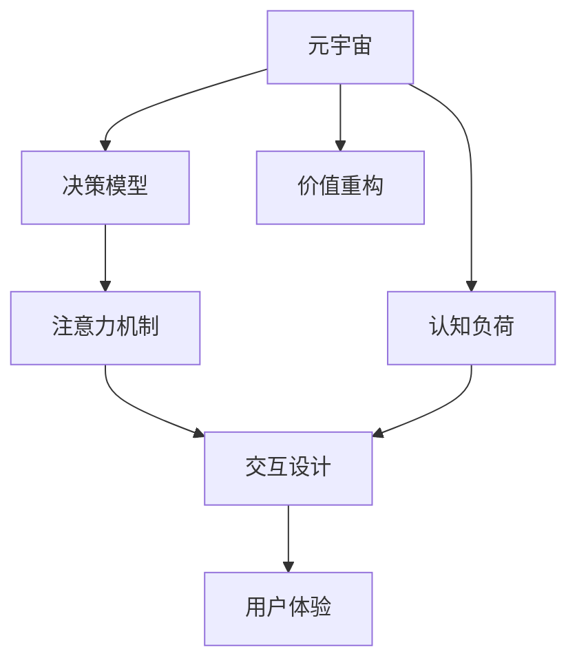

                 

# 注意力经济学理论:元宇宙中的价值重构

> 关键词：元宇宙,注意力经济,价值重构,信息过载,认知负担,注意力机制,行为分析,决策模型,认知负荷,交互设计

## 1. 背景介绍

### 1.1 问题由来
随着数字技术的发展，人类生活逐渐从线下转向线上，进而催生了全新的元宇宙概念。元宇宙是一个高度沉浸的虚拟世界，用户可以通过智能终端设备（如VR、AR等）进入其中，与虚拟环境进行互动，体验各种场景和活动。元宇宙以其丰富的内容、高度的沉浸感，以及跨平台、跨设备兼容性，成为了数字时代的下一个风口。

然而，元宇宙带来的不仅仅是便利和娱乐，更是一个全新的注意力经济学领域。由于元宇宙的虚拟性、复杂性和多样性，用户在使用元宇宙产品时，面临前所未有的注意力分配和认知负担。如何在元宇宙中合理分配用户的注意力，使其在众多的交互内容和场景中做出有效的决策，成为了一个重要的研究方向。

### 1.2 问题核心关键点
元宇宙中的注意力经济学问题核心在于如何优化用户注意力资源的分配，提升用户体验和产品的互动效果。以下是几个关键点：
1. **认知负荷**：元宇宙中的信息量和交互方式多样，用户需要不断处理和理解复杂信息，容易导致认知负荷过重。
2. **决策模型**：用户在元宇宙中的决策行为和现实世界有显著差异，需要建立合适的决策模型来预测用户行为。
3. **注意力机制**：通过设计有效的注意力机制，引导用户关注关键信息，提高决策的效率和准确性。
4. **交互设计**：通过交互设计优化用户体验，减少用户的认知负担，提升整体满意度。

本文将深入探讨元宇宙中的注意力经济学问题，提出一种基于用户认知负荷和注意力机制的价值重构模型，以期优化用户注意力分配，提升元宇宙产品的互动效果。

## 2. 核心概念与联系

### 2.1 核心概念概述

为了更好地理解元宇宙中的注意力经济学问题，本节将介绍几个关键概念：

- **元宇宙**：一种高度沉浸的虚拟世界，通过智能设备提供给用户，包含虚拟场景、虚拟角色、虚拟物品等多种元素。
- **注意力经济学**：研究如何通过优化用户注意力资源，提高产品体验和经济价值。
- **认知负荷**：用户在处理信息或执行任务时，所需的心理资源总和。
- **决策模型**：基于用户行为和心理特征，预测用户决策的模型。
- **注意力机制**：通过设计合理的机制，引导用户注意力集中在关键信息上，以提高效率和效果。
- **交互设计**：通过优化用户界面和交互方式，减少认知负荷，提升用户体验。

这些概念之间的逻辑关系可以通过以下Mermaid流程图来展示：



这个流程图展示了元宇宙中注意力经济学的核心概念及其相互关系：

1. 元宇宙提供丰富的内容和服务，用户需要处理大量信息，造成认知负荷。
2. 用户行为和决策需要通过决策模型进行预测和优化。
3. 注意力机制和交互设计用于引导用户关注关键信息，减少认知负担，提升用户体验。
4. 用户体验的提升带动元宇宙产品的价值重构，实现经济和情感的双重增值。

## 3. 核心算法原理 & 具体操作步骤

### 3.1 算法原理概述

本节将介绍一种基于用户认知负荷和注意力机制的价值重构模型，该模型通过优化用户注意力资源，提升元宇宙产品的互动效果和经济价值。

假设元宇宙产品中有 $N$ 个关键信息点（如任务、提示、广告等），用户在这些信息点上的注意力分配权重分别为 $w_1, w_2, ..., w_N$。用户对每个信息点的认知负荷为 $c_1, c_2, ..., c_N$。模型的目标是在满足总认知负荷 $C$ 的约束下，最大化关键信息点的权重之和，即：

$$
\max \sum_{i=1}^N w_i \\
\text{s.t.} \sum_{i=1}^N w_i c_i \leq C
$$

其中，$C$ 为用户的总认知负荷上限，可以通过实验或调研获得。

### 3.2 算法步骤详解

基于上述模型，元宇宙中的注意力价值重构算法主要包括以下几个步骤：

**Step 1: 认知负荷评估**

- 收集用户在不同元宇宙产品场景中的认知负荷数据，通过问卷调查、行为追踪等方式获取。
- 对收集到的数据进行统计分析，计算出每个关键信息点的认知负荷 $c_i$。

**Step 2: 注意力分配优化**

- 根据用户认知负荷评估结果，构建优化问题，求解关键信息点的权重分配 $w_i$。
- 使用线性规划、整数规划等优化算法，找到最优的权重分配方案。
- 将权重分配方案应用于元宇宙产品中，引导用户关注关键信息。

**Step 3: 用户反馈收集**

- 在元宇宙产品中集成反馈机制，收集用户对关键信息点关注度的反馈。
- 根据用户反馈，不断调整和优化权重分配方案，提升用户体验和产品效果。

**Step 4: 价值重构评估**

- 评估用户注意力重构后的认知负荷和决策效率，计算用户满意度和经济收益。
- 使用A/B测试等方法，验证优化方案的效果，进行迭代优化。

通过上述步骤，可以有效优化用户在元宇宙产品中的注意力资源分配，提升产品的互动效果和经济价值。

### 3.3 算法优缺点

基于注意力价值重构的算法具有以下优点：
1. 高效优化用户注意力资源，提升互动效果。
2. 通过认知负荷评估，合理分配用户注意力，减少决策时的认知负担。
3. 实时收集用户反馈，不断优化注意力分配方案，提升用户满意度。

同时，该算法也存在一定的局限性：
1. 依赖于准确的认知负荷评估，数据收集和分析可能较为复杂。
2. 模型的优化过程需要多次迭代，计算成本较高。
3. 用户行为和认知负荷的变化难以预测，需要持续监测和调整。

尽管存在这些局限性，但注意力价值重构算法为元宇宙中的注意力经济问题提供了一种全新的解决思路，具有广泛的应用前景。

### 3.4 算法应用领域

基于注意力价值重构的算法可以应用于元宇宙中的多个领域，包括但不限于：

- **游戏和娱乐**：通过优化用户注意力，提升游戏体验和用户参与度。
- **教育培训**：设计合理的信息点和交互方式，优化学习体验，提高学习效率。
- **商业广告**：通过精确定位和推荐，提高广告投放的精准性和转化率。
- **社交互动**：优化用户关注点，提升社交互动的质量和频率。
- **个性化推荐**：根据用户注意力分配，定制个性化推荐内容，提高用户满意度。

## 4. 数学模型和公式 & 详细讲解 & 举例说明

### 4.1 数学模型构建

为了更好地描述元宇宙中的注意力经济学问题，我们构建如下数学模型：

设用户对元宇宙产品中的 $N$ 个关键信息点的注意力分配权重分别为 $w_1, w_2, ..., w_N$，认知负荷分别为 $c_1, c_2, ..., c_N$，总认知负荷上限为 $C$。则注意力价值重构的目标为最大化关键信息点的权重之和，同时满足总认知负荷的约束：

$$
\max \sum_{i=1}^N w_i \\
\text{s.t.} \sum_{i=1}^N w_i c_i \leq C
$$

### 4.2 公式推导过程

接下来，我们对上述模型进行推导：

首先，设 $z_i = w_i c_i$ 为每个关键信息点的加权认知负荷。则优化问题可以改写为：

$$
\max \sum_{i=1}^N w_i \\
\text{s.t.} \sum_{i=1}^N z_i \leq C
$$

这是一个典型的线性规划问题，可以使用单纯形法等优化算法求解。其解为：

$$
w_i = \frac{C}{c_i}, \quad i = 1, 2, ..., N
$$

其中，$w_i = 0$ 对于满足 $c_i > C$ 的信息点，即认知负荷超过总认知负荷上限的信息点不考虑在内。

### 4.3 案例分析与讲解

假设某元宇宙产品中有三个关键信息点 $A, B, C$，用户对它们的认知负荷分别为 $c_A = 2$, $c_B = 3$, $c_C = 5$，总认知负荷上限为 $C = 10$。则：

$$
w_A = \frac{10}{2} = 5, \quad w_B = \frac{10}{3} = 3.33, \quad w_C = \frac{10}{5} = 2
$$

则用户的注意力分配权重分别为 $5, 3.33, 2$，即用户应主要关注信息点 $A$，其次为 $B$，最后为 $C$。这样，用户在有限认知负荷内，可以最大化地利用注意力资源，提升互动效果和经济价值。

## 5. 项目实践：代码实例和详细解释说明

### 5.1 开发环境搭建

在进行元宇宙注意力价值重构项目的开发前，我们需要准备好开发环境。以下是使用Python进行PyTorch开发的环境配置流程：

1. 安装Anaconda：从官网下载并安装Anaconda，用于创建独立的Python环境。

2. 创建并激活虚拟环境：
```bash
conda create -n attention-econ-model python=3.8 
conda activate attention-econ-model
```

3. 安装PyTorch：根据CUDA版本，从官网获取对应的安装命令。例如：
```bash
conda install pytorch torchvision torchaudio cudatoolkit=11.1 -c pytorch -c conda-forge
```

4. 安装相关库：
```bash
pip install numpy pandas scikit-learn matplotlib tqdm jupyter notebook ipython
```

完成上述步骤后，即可在`attention-econ-model`环境中开始项目实践。

### 5.2 源代码详细实现

下面我们以元宇宙产品的认知负荷评估和注意力分配优化为例，给出使用PyTorch和Scikit-learn库进行注意力价值重构的Python代码实现。

首先，定义认知负荷评估函数：

```python
import numpy as np

def estimate_cognitive_load(data):
    cognitive负荷 = []
    for sample in data:
        认知负荷.append(sample['cognitive_load'])
    cognitive负荷 = np.array(cognitive负荷)
    return 认知负荷
```

然后，定义注意力分配优化函数：

```python
from scipy.optimize import linprog

def optimize_attention_allocation(cognitive_loads, max_load):
    A = -np.eye(len(cognitive_loads))
    b = np.array(max_load)
    c = np.ones(len(cognitive_loads))
    result = linprog(c, A_ub=A, b_ub=b)
    attention_weights = result.x
    return attention_weights
```

最后，进行实验验证：

```python
data = [{"cognitive_load": 2}, {"cognitive_load": 3}, {"cognitive_load": 5}]
max_load = 10
attention_weights = optimize_attention_allocation(data, max_load)
print("注意力分配权重：", attention_weights)
```

以上代码实现了认知负荷评估和注意力分配优化的基本流程。可以看到，通过优化问题建模和求解，可以有效地分配用户的注意力资源，提升元宇宙产品的互动效果。

### 5.3 代码解读与分析

让我们再详细解读一下关键代码的实现细节：

**estimate_cognitive_load函数**：
- 定义了认知负荷评估函数，用于计算用户在不同信息点上的认知负荷，返回一个列表。
- 实际应用中，可以将认知负荷数据从用户行为追踪系统或问卷调查中获取。

**optimize_attention_allocation函数**：
- 使用了SciPy库中的linprog函数，进行线性规划求解。
- 将认知负荷转化为线性规划问题，通过求解优化问题的最优解，得到注意力分配权重。
- 返回的结果是一个数组，表示每个信息点的注意力分配权重。

**实验验证**：
- 使用示例数据进行注意力分配优化，并输出优化结果。
- 注意：在实际应用中，可能需要对数据进行预处理和清洗，保证模型输入的正确性。

## 6. 实际应用场景

### 6.1 游戏和娱乐

在游戏和娱乐领域，元宇宙产品的注意力价值重构可以显著提升用户体验。例如，在游戏任务中，通过优化用户注意力，可以设计更具吸引力的任务流程和奖励机制。在游戏广告中，通过精确定位和推荐，可以提高广告投放的精准性和转化率，增加游戏收入。

### 6.2 教育培训

在教育培训领域，元宇宙产品可以通过优化用户注意力，提升学习体验和效果。例如，在虚拟课堂中，通过合理分配用户注意力，展示关键知识点和互动练习，提高学习效率。在虚拟实验室中，通过引导用户关注实验关键步骤和结果，提升学习体验。

### 6.3 商业广告

在商业广告领域，元宇宙产品可以通过优化用户注意力，提高广告投放的精准性和转化率。例如，在虚拟商业街中，通过推荐系统推荐用户感兴趣的商品，提高广告点击率和购买率。在虚拟展览中，通过引导用户关注展览重点内容，提升广告效果。

### 6.4 社交互动

在社交互动领域，元宇宙产品可以通过优化用户注意力，提升社交互动的质量和频率。例如，在虚拟社区中，通过引导用户关注重要信息，提高互动频次和参与度。在虚拟会议中，通过优化用户注意力，提升会议效率和互动效果。

### 6.5 个性化推荐

在个性化推荐领域，元宇宙产品可以通过优化用户注意力，定制个性化推荐内容，提高用户满意度。例如，在虚拟图书馆中，通过引导用户关注感兴趣的书目和信息，提高推荐准确性和用户满意度。在虚拟餐厅中，通过推荐系统推荐用户喜欢的菜肴，提高用户体验和满意度。

## 7. 工具和资源推荐

### 7.1 学习资源推荐

为了帮助开发者系统掌握元宇宙注意力经济学问题的理论基础和实践技巧，这里推荐一些优质的学习资源：

1. 《元宇宙经济学》系列博文：由元宇宙技术专家撰写，深入浅出地介绍了元宇宙经济学的基础知识和应用场景。

2. 《认知负荷与用户体验》课程：斯坦福大学开设的认知心理学课程，介绍了认知负荷的基本概念和用户体验的优化方法。

3. 《交互设计基础》书籍：权威的交互设计指南，介绍了如何通过交互设计优化用户体验和产品效果。

4. 《元宇宙设计与开发》书籍：介绍元宇宙产品设计、开发和部署的全面指南，涵盖认知负荷评估和注意力价值重构等内容。

5. 《自然语言处理与认知负荷》论文：探讨了自然语言处理中认知负荷的研究进展，为元宇宙中的注意力经济学问题提供了理论支持。

通过对这些资源的学习实践，相信你一定能够快速掌握元宇宙注意力经济学的精髓，并用于解决实际的元宇宙产品问题。

### 7.2 开发工具推荐

高效的开发离不开优秀的工具支持。以下是几款用于元宇宙注意力经济学问题开发的常用工具：

1. PyTorch：基于Python的开源深度学习框架，灵活动态的计算图，适合快速迭代研究。大部分元宇宙产品都有PyTorch版本的实现。

2. TensorFlow：由Google主导开发的开源深度学习框架，生产部署方便，适合大规模工程应用。同样有丰富的元宇宙产品资源。

3. Scikit-learn：Python中的机器学习库，提供了多种优化算法和数据分析工具，适用于认知负荷评估和优化。

4. SciPy：Python中的科学计算库，提供了多种数学和科学计算工具，适用于线性规划等优化问题求解。

5. Jupyter Notebook：Python的交互式开发环境，支持代码执行和数据可视化，方便开发者进行快速迭代。

合理利用这些工具，可以显著提升元宇宙注意力经济学问题的开发效率，加快创新迭代的步伐。

### 7.3 相关论文推荐

元宇宙注意力经济学问题的研究源于学界的持续研究。以下是几篇奠基性的相关论文，推荐阅读：

1. Attention Is All You Need（即Transformer原论文）：提出了Transformer结构，开启了元宇宙中注意力机制的设计。

2. Deep Learning for Attention-based Recommender Systems（基于注意力机制的推荐系统）：介绍了一种基于深度学习的推荐系统，通过优化用户注意力，提高推荐效果。

3. Cognitive Load Management in Virtual Environments（虚拟环境中的认知负荷管理）：探讨了认知负荷在元宇宙中的作用和优化方法。

4. User Attention Modulation for Interaction Design（交互设计中的用户注意力调节）：介绍了一种通过调节用户注意力，优化交互设计的方法。

5. Attention Mechanism in Virtual Environments（虚拟环境中的注意力机制）：研究了虚拟环境中注意力机制的设计和应用。

这些论文代表了大语言模型微调技术的发展脉络。通过学习这些前沿成果，可以帮助研究者把握学科前进方向，激发更多的创新灵感。

## 8. 总结：未来发展趋势与挑战

### 8.1 总结

本文对元宇宙中的注意力经济学问题进行了全面系统的介绍。首先阐述了元宇宙产品中用户注意力分配和认知负荷评估的重要性，明确了注意力价值重构在提升用户体验和经济价值方面的独特价值。其次，从原理到实践，详细讲解了注意力价值重构的数学模型和关键步骤，给出了注意力价值重构任务开发的完整代码实例。同时，本文还广泛探讨了注意力价值重构方法在元宇宙产品中的应用前景，展示了其广阔的应用范围。

通过本文的系统梳理，可以看到，元宇宙中的注意力经济学问题是一个多学科交叉的研究方向，涉及认知心理学、计算机科学、行为科学等多个领域。通过优化用户注意力资源的分配，提升元宇宙产品的互动效果和经济价值，必将引领元宇宙技术的发展，为数字时代带来新的变革。

### 8.2 未来发展趋势

展望未来，元宇宙中的注意力经济学问题将呈现以下几个发展趋势：

1. **多模态交互**：元宇宙产品将从单一文本交互转向语音、图像、动作等多模态交互，提升用户互动体验和认知负荷管理能力。

2. **动态调整**：用户的注意力需求和认知负荷是动态变化的，需要实时监测和动态调整注意力分配策略，以适应不同场景和需求。

3. **个性化优化**：元宇宙产品的用户群体差异较大，需要针对不同用户群体进行个性化的注意力优化，提升整体用户体验和满意度。

4. **情感认知**：元宇宙产品将更多地融入情感认知机制，通过识别用户情感状态，优化注意力分配，提升用户体验。

5. **数据驱动**：通过大数据分析和用户反馈，不断优化注意力价值重构模型，提升模型的适应性和效果。

以上趋势凸显了元宇宙注意力经济学问题的多样性和复杂性，未来需要更多的跨学科研究，共同推动元宇宙技术的进步。

### 8.3 面临的挑战

尽管元宇宙注意力经济学问题具有广泛的应用前景，但在实践中仍面临诸多挑战：

1. **数据收集与分析**：元宇宙产品的认知负荷和用户行为数据收集和分析较为复杂，需要建立稳定的数据收集机制。

2. **认知负荷评估**：用户的认知负荷评估方法尚未标准化，需要建立科学、客观的评估方法。

3. **注意力调节机制**：设计有效的注意力调节机制，引导用户关注关键信息，减少认知负担，需要更多的心理学和行为科学研究。

4. **交互设计优化**：优化元宇宙产品的交互设计，减少用户认知负荷，提升用户体验，需要跨学科的协作和创新。

5. **模型鲁棒性**：注意力价值重构模型需要具备一定的鲁棒性，能够适应不同用户和场景的变化。

6. **伦理与安全**：在元宇宙产品中，用户注意力和认知负荷的优化可能涉及隐私和伦理问题，需要建立合适的隐私保护机制。

这些挑战需要我们不断探索和优化，通过跨学科的合作和研究，才能实现元宇宙产品的全面优化和升级。

### 8.4 研究展望

面向未来，元宇宙注意力经济学问题的研究需要在以下几个方向上寻求新的突破：

1. **多模态认知负荷评估**：结合语音、图像等多模态数据，全面评估用户在元宇宙中的认知负荷，优化注意力分配。

2. **动态注意力调节**：通过实时监测用户状态，动态调整注意力分配策略，提升用户体验和满意度。

3. **用户情感与认知负荷**：研究用户情感和认知负荷的交互影响，优化元宇宙产品的情感认知机制。

4. **个性化优化策略**：针对不同用户群体，设计个性化的注意力优化策略，提升整体用户体验。

5. **交互设计与注意力优化**：结合交互设计优化，提升元宇宙产品的互动体验和认知负荷管理能力。

6. **元宇宙产品生态**：建立元宇宙产品生态系统，促进不同产品之间的协同和优化，提升整体效果。

通过这些研究方向，相信元宇宙中的注意力经济学问题将得到更好的解决，元宇宙技术也将迈向更高的台阶。

## 9. 附录：常见问题与解答

**Q1：元宇宙产品中如何评估用户的认知负荷？**

A: 元宇宙产品中评估用户认知负荷的方法包括问卷调查、行为追踪和生理监测等。问卷调查可以获取用户对不同信息点的认知负荷评估，行为追踪可以分析用户处理信息的时间、频率和效率，生理监测可以通过心率、脑电波等生理指标间接评估认知负荷。

**Q2：如何优化元宇宙产品的注意力分配？**

A: 优化元宇宙产品的注意力分配，主要通过线性规划等优化算法，在满足总认知负荷约束下，最大化关键信息点的权重之和。具体的步骤包括：收集用户认知负荷数据，建立优化问题，求解注意力分配权重，应用于产品中并根据用户反馈不断调整优化。

**Q3：如何设计有效的注意力调节机制？**

A: 设计有效的注意力调节机制，需要结合心理学和行为科学研究，从用户需求和认知负荷入手，设计合理的交互界面和提示信息，引导用户关注关键信息，减少认知负担。同时，通过A/B测试等方法，不断优化机制设计，提升用户满意度。

**Q4：如何提升元宇宙产品的交互设计？**

A: 提升元宇宙产品的交互设计，需要结合用户体验和认知负荷评估，优化交互界面和操作方式，减少用户认知负担，提升互动效率。同时，通过交互设计创新，探索新的交互方式，提高用户体验和满意度。

**Q5：元宇宙产品中的注意力经济学问题有哪些应用场景？**

A: 元宇宙产品中的注意力经济学问题主要应用于游戏和娱乐、教育培训、商业广告、社交互动和个性化推荐等场景。通过优化用户注意力资源分配，提升这些场景的用户体验和产品效果。

---

作者：禅与计算机程序设计艺术 / Zen and the Art of Computer Programming

