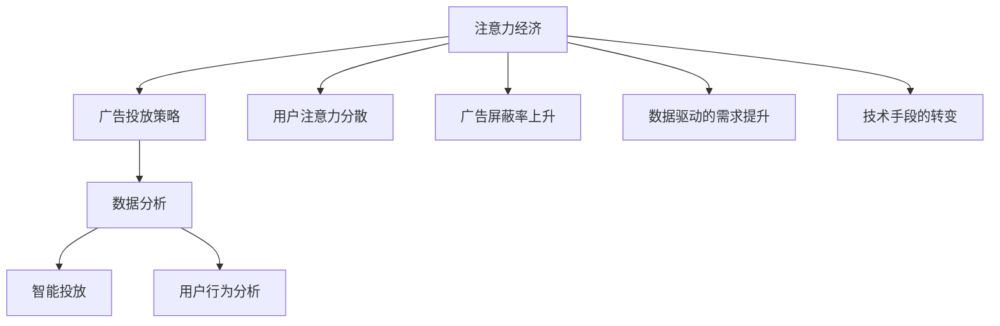

                 

# 注意力经济对传统广告投放策略的挑战

> 关键词：注意力经济, 广告投放策略, 数据分析, 智能投放, 用户行为分析

## 1. 背景介绍

### 1.1 问题由来

随着互联网的蓬勃发展，信息爆炸时代带来了一场注意力革命，即注意力经济(Attention Economy)。广告行业在这一背景下，传统的投放策略面临巨大挑战。在过去，广告主通常以曝光为衡量标准，通过大规模的展示来吸引用户的注意，从而达到品牌认知和销售转化的目的。然而，面对海量的信息流和分化的用户兴趣，这种粗放式的投放方法往往事倍功半，甚至导致用户的反感和抵触。

在这一背景下，传统广告投放策略急需变革，以适应注意力经济时代的新要求。在这一过程中，数据分析、机器学习等新兴技术的应用，为广告投放注入了新的活力，引领了智能投放、精准广告等新趋势。广告投放不再是盲目的“撒网捕鱼”，而是以数据驱动，更加聚焦于用户注意力，实现更高效率和更低成本的广告投放。

### 1.2 问题核心关键点

在注意力经济时代，传统广告投放策略面临的挑战主要包括：
1. **用户注意力分散**：用户接触信息的渠道越来越多，注意力更加分散。
2. **广告屏蔽率上升**：用户对频繁的展示广告产生厌烦，导致屏蔽行为增多。
3. **数据驱动的需求提升**：广告主需要更加精准地投放广告，以提升效果和ROI。
4. **技术手段的转变**：从简单的曝光量分析，到智能算法驱动的投放策略。

## 2. 核心概念与联系

### 2.1 核心概念概述

为更好地理解注意力经济对广告投放策略的影响，本节将介绍几个密切相关的核心概念：

- **注意力经济(Attention Economy)**：指在信息过载的时代，用户注意力成为稀缺资源，广告主需要更加高效地获取和利用用户注意力，以实现广告效果最大化。

- **广告投放策略(Ad Placement Strategy)**：指广告主在确定投放目标后，选择何种渠道、何种时间和何种形式进行投放的策略。

- **数据分析(Analytics)**：通过收集和分析用户行为数据，挖掘用户的兴趣和行为特征，为广告投放提供数据支撑。

- **智能投放(Smart Placement)**：指利用数据分析和机器学习技术，自动选择最佳的广告投放策略，提升广告投放效果。

- **用户行为分析(User Behavior Analysis)**：通过分析用户在互联网上的行为数据，如浏览记录、搜索历史、点击行为等，理解用户兴趣和需求。

这些核心概念之间的逻辑关系可以通过以下Mermaid流程图来展示：



这个流程图展示了大语言模型的核心概念及其之间的关系：

1. 注意力经济背景下，用户注意力成为稀缺资源。
2. 广告主需要更加高效地获取和利用用户注意力，选择最佳投放策略。
3. 数据分析和用户行为分析，为广告投放提供数据支撑。
4. 智能投放技术，基于数据分析自动选择最佳的投放策略。
5. 用户行为分析，深入理解用户兴趣和需求。

这些概念共同构成了广告投放的新的框架，使其能够更加聚焦于用户注意力，实现更高效率和更低成本的广告投放。

## 3. 核心算法原理 & 具体操作步骤

### 3.1 算法原理概述

在注意力经济时代，广告投放策略的核心在于最大化用户注意力，实现广告效果的最大化。这一目标可以通过数据分析和智能投放算法来实现。具体而言，通过收集用户行为数据，挖掘用户的兴趣和行为特征，自动选择最佳的广告投放渠道、时间和形式，以实现广告投放的高效率和低成本。

### 3.2 算法步骤详解

基于数据分析和智能投放的算法，广告投放主要包括以下几个关键步骤：

**Step 1: 数据采集和预处理**

1. **数据采集**：
   - 通过API接口、爬虫等方式，从各大平台获取用户行为数据，如浏览记录、搜索历史、点击行为等。
   - 对数据进行去重、去噪，过滤无效数据，确保数据的准确性和完整性。

2. **数据预处理**：
   - 对数据进行归一化、标准化处理，以便后续的特征提取。
   - 根据需求进行数据切分，如划分训练集、验证集和测试集。

**Step 2: 特征提取**

1. **用户行为特征提取**：
   - 从数据中提取用户的兴趣特征、行为特征、设备特征等。
   - 使用TF-IDF、词频统计、主题建模等方法，进行特征提取和降维处理。

2. **广告特征提取**：
   - 提取广告的文本、图片、视频等内容的特征。
   - 使用深度学习模型进行特征提取，如卷积神经网络、循环神经网络等。

**Step 3: 模型训练**

1. **选择模型**：
   - 根据广告投放目标，选择合适的机器学习模型，如线性回归、逻辑回归、决策树、随机森林、深度学习等。
   - 对于点击率预测等二分类任务，可以使用逻辑回归、SVM等模型。
   - 对于广告转化率预测等多分类任务，可以使用随机森林、深度学习等模型。

2. **训练模型**：
   - 在训练集上，使用随机梯度下降等优化算法，训练模型参数。
   - 使用交叉验证等技术，评估模型的泛化能力和性能。

**Step 4: 广告投放**

1. **实时投放**：
   - 根据模型预测，选择最佳的广告投放渠道、时间和形式，进行实时投放。
   - 使用A/B测试等方法，评估广告投放效果，优化投放策略。

2. **持续优化**：
   - 根据实际投放效果，持续更新和优化模型，以提升广告投放效果。

### 3.3 算法优缺点

基于数据分析和智能投放的算法具有以下优点：
1. **高效性**：通过自动化决策，快速选择最佳的投放策略，提升广告投放效率。
2. **精准性**：基于数据分析，深度挖掘用户兴趣和需求，实现精准投放。
3. **灵活性**：能够灵活应对多变的市场环境和用户需求。
4. **可扩展性**：能够快速适应新的广告形式和投放渠道。

同时，该方法也存在一定的局限性：
1. **数据质量依赖度高**：投放效果高度依赖于数据的准确性和完整性。
2. **模型复杂度高**：需要处理大规模数据和复杂模型，对计算资源和算法要求较高。
3. **技术门槛高**：需要具备较强的数据分析和机器学习技术背景。
4. **隐私问题**：在数据采集和使用过程中，需要注意用户隐私和数据安全。

尽管存在这些局限性，但就目前而言，基于数据分析和智能投放的算法仍是大广告主投放策略的主流范式。未来相关研究的重点在于如何进一步降低技术门槛，提高模型性能，同时兼顾用户隐私和数据安全等因素。

### 3.4 算法应用领域

基于数据分析和智能投放的算法，在广告投放领域已经得到了广泛的应用，涵盖了几乎所有常见的广告形式，如：

- **在线广告**：通过搜索引擎、社交媒体等平台进行展示和点击率预测。
- **视频广告**：在视频平台进行展示和观看时长预测。
- **移动广告**：在移动应用和新闻客户端进行展示和点击率预测。
- **程序化广告**：根据用户行为数据进行实时竞价，实现高效精准投放。

除了上述这些经典形式外，智能投放技术还被创新性地应用到更多场景中，如社交媒体广告投放优化、电商平台个性化推荐、动态广告创意生成等，为广告投放带来了全新的突破。随着数据分析和智能算法的不断进步，相信广告投放技术将在更广阔的应用领域大放异彩。

## 4. 数学模型和公式 & 详细讲解 & 举例说明

### 4.1 数学模型构建

本节将使用数学语言对基于数据分析和智能投放的广告投放过程进行更加严格的刻画。

记广告投放目标为 $T$，用户行为数据为 $D=\{(x_i,y_i)\}_{i=1}^N, x_i \in \mathbb{R}^d, y_i \in \{0,1\}$，其中 $x_i$ 表示用户行为特征向量，$y_i$ 表示广告投放效果标签（1表示点击/转化，0表示未点击/未转化）。

定义模型 $M_{\theta}:\mathbb{R}^d \rightarrow [0,1]$，其中 $\theta$ 为模型参数。广告投放的优化目标是最小化预测误差，即找到最优参数：

$$
\theta^* = \mathop{\arg\min}_{\theta} \sum_{i=1}^N (y_i \log M_{\theta}(x_i) + (1-y_i) \log(1-M_{\theta}(x_i)))
$$

在实践中，我们通常使用交叉熵损失函数来衡量模型预测与真实标签之间的差异。通过梯度下降等优化算法，微调过程不断更新模型参数 $\theta$，最小化损失函数，使得模型预测与真实标签的差异最小化。

### 4.2 公式推导过程

以下我们以点击率预测为例，推导交叉熵损失函数及其梯度的计算公式。

假设模型 $M_{\theta}$ 在用户行为特征 $x_i$ 上的预测概率为 $p_i=M_{\theta}(x_i) \in [0,1]$，真实标签 $y_i \in \{0,1\}$。则二分类交叉熵损失函数定义为：

$$
\ell(M_{\theta}(x_i),y_i) = -[y_i\log p_i + (1-y_i)\log(1-p_i)]
$$

将其代入经验风险公式，得：

$$
\mathcal{L}(\theta) = -\frac{1}{N}\sum_{i=1}^N [y_i\log M_{\theta}(x_i)+(1-y_i)\log(1-M_{\theta}(x_i))]
$$

根据链式法则，损失函数对参数 $\theta_k$ 的梯度为：

$$
\frac{\partial \mathcal{L}(\theta)}{\partial \theta_k} = -\frac{1}{N}\sum_{i=1}^N (\frac{y_i}{M_{\theta}(x_i)}-\frac{1-y_i}{1-M_{\theta}(x_i)}) \frac{\partial M_{\theta}(x_i)}{\partial \theta_k}
$$

其中 $\frac{\partial M_{\theta}(x_i)}{\partial \theta_k}$ 可进一步递归展开，利用自动微分技术完成计算。

在得到损失函数的梯度后，即可带入参数更新公式，完成模型的迭代优化。重复上述过程直至收敛，最终得到适应广告投放目标的最优模型参数 $\theta^*$。

### 4.3 案例分析与讲解

**案例：电商平台个性化推荐**

电商平台通过收集用户浏览记录、购物历史、评价信息等数据，构建用户行为特征 $x$。以点击率预测为例，使用逻辑回归模型 $M_{\theta}$，其中 $\theta$ 为模型参数。模型的预测输出 $p_i$ 为用户点击广告的概率。在训练阶段，使用交叉熵损失函数 $\ell(M_{\theta}(x_i),y_i)$ 进行优化，最小化预测误差。模型训练完毕后，在测试集上评估模型预测效果，如F1得分、ROC曲线等。

在实际应用中，通过实时获取用户行为数据，模型能够快速预测并推荐最适合的广告。这种基于数据的智能推荐，提高了广告的点击率和转化率，提升了用户购物体验。

## 5. 项目实践：代码实例和详细解释说明

### 5.1 开发环境搭建

在进行智能广告投放实践前，我们需要准备好开发环境。以下是使用Python进行Pandas和Scikit-learn开发的环境配置流程：

1. 安装Anaconda：从官网下载并安装Anaconda，用于创建独立的Python环境。

2. 创建并激活虚拟环境：
```bash
conda create -n ads-env python=3.8 
conda activate ads-env
```

3. 安装Pandas和Scikit-learn：
```bash
conda install pandas scikit-learn
```

4. 安装各类工具包：
```bash
pip install numpy matplotlib seaborn joblib dask
```

完成上述步骤后，即可在`ads-env`环境中开始智能广告投放实践。

### 5.2 源代码详细实现

下面我们以电商平台个性化推荐为例，给出使用Pandas和Scikit-learn对用户行为数据进行数据分析和广告点击率预测的Python代码实现。

首先，定义数据处理函数：

```python
import pandas as pd
from sklearn.model_selection import train_test_split
from sklearn.preprocessing import StandardScaler

def preprocess_data(data_path):
    data = pd.read_csv(data_path)
    # 数据预处理
    data.dropna(inplace=True)
    data = data.drop_duplicates()
    # 特征选择
    selected_features = ['浏览记录', '购物历史', '评价信息']
    data = data[selected_features]
    # 特征编码
    data = pd.get_dummies(data)
    # 划分训练集和测试集
    X_train, X_test, y_train, y_test = train_test_split(data.drop('点击率', axis=1), data['点击率'], test_size=0.2, random_state=42)
    # 特征缩放
    scaler = StandardScaler()
    X_train = scaler.fit_transform(X_train)
    X_test = scaler.transform(X_test)
    return X_train, X_test, y_train, y_test
```

然后，定义模型训练和评估函数：

```python
from sklearn.linear_model import LogisticRegression
from sklearn.metrics import roc_auc_score

def train_model(X_train, y_train):
    model = LogisticRegression()
    model.fit(X_train, y_train)
    return model

def evaluate_model(model, X_test, y_test):
    y_pred = model.predict_proba(X_test)[:, 1]
    auc = roc_auc_score(y_test, y_pred)
    print(f"AUC: {auc:.4f}")
```

最后，启动训练流程并在测试集上评估：

```python
X_train, X_test, y_train, y_test = preprocess_data('data.csv')

model = train_model(X_train, y_train)
evaluate_model(model, X_test, y_test)
```

以上就是使用Pandas和Scikit-learn对用户行为数据进行数据分析和广告点击率预测的完整代码实现。可以看到，得益于Pandas和Scikit-learn的强大封装，我们可以用相对简洁的代码完成广告点击率预测的实践。

### 5.3 代码解读与分析

让我们再详细解读一下关键代码的实现细节：

**preprocess_data函数**：
- `read_csv`方法：从指定路径读取CSV格式的数据文件。
- `dropna`方法：删除含有空值的行。
- `drop_duplicates`方法：删除重复的样本。
- `selected_features`列表：选择特征列。
- `pd.get_dummies`方法：将分类特征进行独热编码。
- `train_test_split`方法：划分训练集和测试集。
- `StandardScaler`类：对特征进行标准化处理。

**train_model函数**：
- `LogisticRegression`类：定义逻辑回归模型。
- `fit`方法：在训练集上训练模型。

**evaluate_model函数**：
- `predict_proba`方法：模型预测样本的概率。
- `roc_auc_score`方法：计算ROC曲线下的面积（AUC）。

**训练流程**：
- `preprocess_data`函数：数据预处理和特征选择。
- `train_model`函数：在训练集上训练逻辑回归模型。
- `evaluate_model`函数：在测试集上评估模型性能，输出AUC值。

可以看到，Pandas和Scikit-learn在数据处理、模型训练和评估等方面提供了丰富的工具支持，使得智能广告投放实践变得更加高效和便捷。

当然，工业级的系统实现还需考虑更多因素，如模型的保存和部署、超参数的自动搜索、多模型集成等。但核心的智能投放范式基本与此类似。

## 6. 实际应用场景

### 6.1 电商平台个性化推荐

基于智能投放技术的电商平台，通过收集用户行为数据，构建用户画像，预测用户行为，实现了更加精准的个性化推荐。在推荐过程中，平台根据用户历史行为、兴趣特征、设备信息等数据，动态调整推荐策略，提升用户点击率和转化率。

具体而言，平台可以实时获取用户行为数据，并使用推荐算法模型（如协同过滤、矩阵分解等）进行预测。在推荐策略上，可以灵活调整推荐频率、推荐内容、推荐时间等参数，以适应用户需求和市场变化。

### 6.2 社交媒体广告投放优化

社交媒体平台通过分析用户的互动数据（如点赞、评论、分享等），深入理解用户兴趣和需求。在此基础上，平台可以精准投放广告，实现更高的点击率和转化率。

在广告投放策略上，平台可以采用多种方法，如定向投放、程序化投放、动态创意优化等。通过不断优化投放策略和广告创意，平台能够更高效地吸引用户注意力，提升广告效果。

### 6.3 在线视频广告推荐

在线视频平台通过分析用户的观看行为（如播放时长、暂停次数等），预测用户对视频的偏好。基于此，平台可以精准投放广告，实现更高的广告效果。

在广告推荐策略上，平台可以采用多种方法，如基于内容的推荐、基于用户的推荐、基于行为的推荐等。通过不断优化推荐算法和广告创意，平台能够更高效地吸引用户注意力，提升广告效果。

### 6.4 未来应用展望

随着智能投放技术的不断发展，未来的广告投放将更加高效、精准和智能化。在广告主和广告平台的协同作用下，智能投放技术将在以下方向进一步突破：

1. **跨平台协同**：广告主和广告平台将更加紧密地合作，实现跨平台的数据共享和协同投放，提升广告投放效果。

2. **数据融合**：平台将整合更多数据源，如用户行为数据、社交网络数据、地理数据等，实现更全面和深入的用户画像。

3. **多模态广告**：广告形式将更加多样化，如视频广告、音频广告、AR广告等，提升广告的互动性和体验感。

4. **实时动态优化**：广告平台将实现更快速的投放响应和实时动态优化，实时调整投放策略和广告创意。

5. **用户隐私保护**：平台将更加注重用户隐私保护，采用匿名化、数据脱敏等技术，确保用户数据安全。

6. **AI辅助创意设计**：平台将利用AI技术进行广告创意设计，提升广告设计的效率和创意性。

以上趋势凸显了智能投放技术的广阔前景。这些方向的探索发展，必将进一步提升广告投放的精准度和效果，为广告主和用户创造更大的价值。

## 7. 工具和资源推荐

### 7.1 学习资源推荐

为了帮助开发者系统掌握智能投放技术的基础知识和实践技巧，这里推荐一些优质的学习资源：

1. **《机器学习实战》（《Python Machine Learning》）**：Wes McKinney著，涵盖了机器学习基础、数据预处理、模型选择和评估等内容，适合初学者入门。
2. **《深度学习》（《Deep Learning》）**：Ian Goodfellow等著，深入讲解了深度学习原理、模型构建和优化等内容，适合进阶学习。
3. **《Python数据科学手册》（《Python Data Science Handbook》）**：Jake VanderPlas著，详细介绍了Pandas、Scikit-learn等数据科学工具的使用，适合实战应用。
4. **Kaggle平台**：全球最大的数据科学竞赛平台，提供丰富的数据集和模型竞赛，适合实践和竞赛。
5. **Coursera平台**：提供多个机器学习、数据分析、智能投放等课程，由知名大学教授授课，适合系统学习。

通过对这些资源的学习实践，相信你一定能够快速掌握智能投放技术，并用于解决实际的广告投放问题。

### 7.2 开发工具推荐

高效的开发离不开优秀的工具支持。以下是几款用于智能广告投放开发的常用工具：

1. **Pandas**：Python数据分析库，提供了丰富的数据处理和分析功能。
2. **Scikit-learn**：Python机器学习库，提供了多种经典的机器学习模型和算法。
3. **Jupyter Notebook**：交互式编程环境，适合数据分析、模型训练和评估等。
4. **TensorFlow**：Google推出的开源深度学习框架，支持多种模型构建和训练方式。
5. **PyTorch**：Facebook推出的开源深度学习框架，适合动态图和深度学习模型的构建和训练。

合理利用这些工具，可以显著提升智能广告投放开发的效率，加快创新迭代的步伐。

### 7.3 相关论文推荐

智能广告投放技术的发展源于学界的持续研究。以下是几篇奠基性的相关论文，推荐阅读：

1. **《点击率预测的AdaBoost算法》**：J. Friedman等著，提出AdaBoost算法，提高了广告点击率预测的准确性。
2. **《基于协同过滤的推荐系统》**：B. Koren等著，介绍了协同过滤算法，提升了推荐系统的个性化和精准度。
3. **《程序化广告投放的实时优化算法》**：D. O'Hara等著，介绍了实时优化算法，实现了程序化广告的高效精准投放。
4. **《基于深度学习的广告投放优化》**：I. Goodfellow等著，介绍了深度学习在广告投放中的应用，提升了广告投放的效率和效果。
5. **《基于强化学习的广告投放策略》**：V. Zhou等著，介绍了强化学习在广告投放中的应用，实现了动态优化和智能决策。

这些论文代表了大广告投放技术的发展脉络。通过学习这些前沿成果，可以帮助研究者把握学科前进方向，激发更多的创新灵感。

## 8. 总结：未来发展趋势与挑战

### 8.1 总结

本文对基于数据分析和智能投放的广告投放策略进行了全面系统的介绍。首先阐述了智能投放技术在注意力经济时代的应用背景和重要性，明确了智能投放在广告主和广告平台中的核心作用。其次，从原理到实践，详细讲解了智能投放的数学模型和关键步骤，给出了智能广告投放的完整代码实例。同时，本文还广泛探讨了智能投放在电商平台、社交媒体、在线视频等多个领域的应用前景，展示了智能投放范式的巨大潜力。此外，本文精选了智能投放技术的各类学习资源，力求为读者提供全方位的技术指引。

通过本文的系统梳理，可以看到，基于数据分析和智能投放的广告投放策略，正在成为广告投放的重要范式，极大地提升了广告投放的精准度和效果。得益于智能投放技术，广告主和广告平台能够更加高效地利用用户注意力，实现广告效果最大化。未来，伴随智能投放技术的不断进步，广告投放将在更广阔的应用领域大放异彩。

### 8.2 未来发展趋势

展望未来，智能投放技术将呈现以下几个发展趋势：

1. **数据驱动的深度学习**：结合深度学习和大数据分析，智能投放技术将更加精准和高效，提升广告投放的转化率和ROI。
2. **跨平台协同**：广告主和广告平台将更加紧密地合作，实现跨平台的数据共享和协同投放，提升广告投放效果。
3. **多模态广告**：广告形式将更加多样化，如视频广告、音频广告、AR广告等，提升广告的互动性和体验感。
4. **实时动态优化**：广告平台将实现更快速的投放响应和实时动态优化，实时调整投放策略和广告创意。
5. **用户隐私保护**：平台将更加注重用户隐私保护，采用匿名化、数据脱敏等技术，确保用户数据安全。
6. **AI辅助创意设计**：平台将利用AI技术进行广告创意设计，提升广告设计的效率和创意性。

以上趋势凸显了智能投放技术的广阔前景。这些方向的探索发展，必将进一步提升广告投放的精准度和效果，为广告主和用户创造更大的价值。

### 8.3 面临的挑战

尽管智能投放技术已经取得了显著成效，但在迈向更加智能化、普适化应用的过程中，它仍面临着诸多挑战：

1. **数据质量问题**：智能投放的效果高度依赖于数据的质量和完整性。数据缺失、数据异常等问题，会导致模型预测的偏差。
2. **技术门槛高**：智能投放需要较强的数据分析和机器学习技术背景，技术门槛较高。
3. **隐私问题**：在数据采集和使用过程中，需要注意用户隐私和数据安全，避免侵犯用户权益。
4. **模型泛化能力不足**：模型在测试集上表现较好，但在实际投放过程中可能出现泛化能力不足的问题，导致效果波动。
5. **计算资源需求高**：智能投放需要处理大规模数据和复杂模型，对计算资源和算法要求较高。

尽管存在这些挑战，但智能投放技术仍在不断发展，研究者正在探索如何降低技术门槛，提高模型性能，同时兼顾用户隐私和数据安全等因素。相信在未来的技术演进中，这些挑战都将逐步得到解决，智能投放技术将进一步普及和应用。

### 8.4 研究展望

面对智能投放技术所面临的挑战，未来的研究需要在以下几个方面寻求新的突破：

1. **数据增强**：通过数据增强技术，提升数据质量和多样性，避免过拟合和泛化能力不足的问题。
2. **模型优化**：开发更加高效、可解释性更强的智能投放模型，降低技术门槛，提升用户信任度。
3. **隐私保护**：在数据采集和使用过程中，引入隐私保护技术，确保用户隐私和数据安全。
4. **实时优化**：结合强化学习等技术，实现实时动态优化，提升广告投放效果。
5. **跨平台协同**：实现跨平台的数据共享和协同投放，提升广告投放效果。

这些研究方向的探索，必将引领智能投放技术迈向更高的台阶，为广告主和广告平台创造更大的价值。面向未来，智能投放技术还需要与其他人工智能技术进行更深入的融合，如知识表示、因果推理、强化学习等，多路径协同发力，共同推动广告投放技术的进步。只有勇于创新、敢于突破，才能不断拓展智能投放的边界，让广告投放技术更好地造福人类社会。

## 9. 附录：常见问题与解答

**Q1：智能投放对广告主和广告平台有哪些好处？**

A: 智能投放对广告主和广告平台有以下好处：
1. **提升广告效果**：通过精准投放，最大化用户注意力，提升广告点击率和转化率。
2. **降低投放成本**：减少无效曝光，优化广告资源分配，降低投放成本。
3. **快速迭代优化**：实时获取用户反馈，动态调整投放策略，快速优化广告效果。
4. **提升用户体验**：根据用户兴趣和需求，展示更相关、更有吸引力的广告，提升用户体验。

**Q2：智能投放需要哪些关键技术支持？**

A: 智能投放需要以下关键技术支持：
1. **数据分析**：通过收集和分析用户行为数据，挖掘用户兴趣和行为特征。
2. **机器学习**：利用机器学习算法，预测用户行为，实现精准投放。
3. **自然语言处理**：通过自然语言处理技术，实现广告创意优化和用户画像构建。
4. **实时优化**：结合强化学习等技术，实现实时动态优化，提升广告投放效果。
5. **跨平台协同**：实现跨平台的数据共享和协同投放，提升广告投放效果。

**Q3：智能投放在实际应用中需要注意哪些问题？**

A: 在实际应用中，智能投放需要注意以下问题：
1. **数据质量**：保证数据的准确性和完整性，避免因数据质量问题导致投放效果偏差。
2. **技术门槛**：需要具备较强的数据分析和机器学习技术背景，提升技术门槛。
3. **隐私保护**：在数据采集和使用过程中，注重用户隐私保护，避免侵犯用户权益。
4. **模型泛化能力**：测试集和实际投放效果可能会有差异，需要提高模型的泛化能力，避免效果波动。
5. **计算资源**：处理大规模数据和复杂模型需要较高的计算资源，需要考虑优化资源消耗的问题。

这些问题的妥善解决，才能保证智能投放技术的稳定性和可靠性，进一步提升广告投放效果和用户体验。

**Q4：智能投放技术的未来发展方向是什么？**

A: 智能投放技术的未来发展方向包括：
1. **数据驱动的深度学习**：结合深度学习和大数据分析，提升广告投放的精准度和效果。
2. **跨平台协同**：实现跨平台的数据共享和协同投放，提升广告投放效果。
3. **多模态广告**：广告形式将更加多样化，如视频广告、音频广告、AR广告等，提升广告的互动性和体验感。
4. **实时动态优化**：实现更快速的投放响应和实时动态优化，实时调整投放策略和广告创意。
5. **用户隐私保护**：采用匿名化、数据脱敏等技术，确保用户数据安全。
6. **AI辅助创意设计**：利用AI技术进行广告创意设计，提升广告设计的效率和创意性。

这些方向将推动智能投放技术不断进步，提升广告投放的精准度和效果，为用户和广告主创造更大的价值。

---

作者：禅与计算机程序设计艺术 / Zen and the Art of Computer Programming

