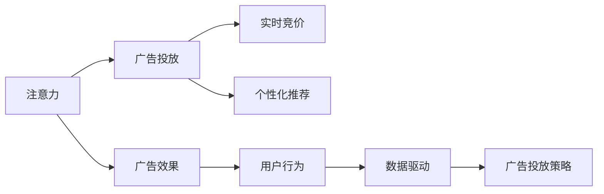

                 

## 1. 背景介绍

随着互联网的普及和社交媒体的兴起，传统的广告计费模式面临巨大的挑战。广告商在传统媒体上的投放主要依靠展示次数、点击率等指标来衡量广告效果。而现代互联网环境下的用户行为更加多元化和动态化，广告效果难以直接量化。同时，用户注意力分配的碎片化和个性化也使得广告计费方式亟需变革。

### 1.1 传统广告计费模式的局限

1. **展示次数**：传统广告计费模式大多基于展示次数，即广告在目标用户面前显示的次数。这种方式无法反映广告内容的有效性和用户真实需求，存在明显的无效点击和被动观看。

2. **点击率**：点击率计费模式主要依据广告被点击的次数和比例。这种方式忽略了用户在浏览广告时未产生点击，但实际有所了解的情况。

3. **成本效益低**：传统广告投放模式以固定的展示次数或点击次数计费，导致广告商无法精确控制广告成本，且往往在未产生预期收益的情况下进行支付。

### 1.2 互联网环境下的用户行为

1. **碎片化**：用户注意力被分散在多种信息源上，包括社交媒体、即时通讯应用、视频网站等，广告展示时间短，用户注意力难以长时间集中。

2. **个性化**：不同用户对信息的接受度和需求存在差异，传统的广告模式难以精准定位，无法针对不同用户群体的需求进行个性化的广告投放。

3. **互动性增强**：现代用户更倾向于主动参与广告内容，如互动广告、游戏化广告等，传统广告模式难以满足这种需求。

### 1.3 注意力经济的兴起

注意力经济（Attention Economy）是指在信息爆炸的时代，争夺用户注意力的经济形态。注意力经济的核心在于通过提高广告的吸引力和互动性，提高广告效果和用户参与度。

广告商通过分析用户的注意力行为数据，包括浏览、点击、互动等行为，精确识别用户的兴趣和需求，进而实施个性化的广告投放。这种模式不仅提升了广告效果，还能有效控制广告成本，提高广告的ROI。

## 2. 核心概念与联系

### 2.1 核心概念概述

为了更好地理解注意力经济对传统广告计费模式的挑战，本节将介绍几个关键概念：

1. **注意力（Attention）**：用户对广告内容的关注和投入，包括浏览、点击、评论等行为。

2. **广告效果（Ad Effectiveness）**：广告达到预期目标的程度，如品牌认知、用户行为改变等。

3. **广告投放（Ad Placement）**：广告在何种平台、何时、何种形式进行投放。

4. **数据驱动（Data-Driven）**：基于用户行为数据的广告投放策略，利用机器学习、数据分析等技术优化广告投放。

5. **实时竞价（Real-Time Bidding，RTB）**：在广告投放过程中，根据用户行为实时竞价，提高广告投放的精准性和效率。

6. **个性化推荐（Personalized Recommendation）**：基于用户行为数据，推荐个性化的广告内容，提升广告效果和用户体验。

### 2.2 核心概念联系

这些核心概念构成了注意力经济的广告投放模型，其联系可以用以下Mermaid流程图表示：



这个流程图展示了注意力、广告效果、广告投放、实时竞价、个性化推荐之间的关系。广告投放策略在数据驱动的基础上，根据用户行为实时竞价和个性化推荐，最终达到提升广告效果的目的。

## 3. 核心算法原理 & 具体操作步骤

### 3.1 算法原理概述

注意力经济下的广告投放算法，主要基于用户行为数据和广告效果数据，通过机器学习和数据分析技术，实现个性化广告推荐和实时竞价。

具体而言，广告投放算法包括以下步骤：

1. **数据采集**：从用户行为数据中提取广告曝光、点击、浏览时间、互动等数据。

2. **用户画像构建**：利用机器学习算法对用户行为数据进行聚类和建模，构建用户画像，识别用户的兴趣和需求。

3. **广告库构建**：从广告库中筛选出符合用户画像的广告内容，生成广告投放清单。

4. **实时竞价**：在广告投放过程中，根据用户行为实时竞价，选择最优广告投放策略。

5. **效果评估**：根据广告效果数据，评估广告投放策略的效果，持续优化广告投放。

### 3.2 算法步骤详解

以下是注意力经济下广告投放的具体操作步骤：

**Step 1: 数据采集与预处理**

1. **数据采集**：从网站、应用、社交平台等采集用户行为数据，包括广告曝光、点击、浏览时间、互动等。

2. **数据清洗与转换**：对采集到的数据进行清洗，去除噪声和异常值，转换为机器学习模型所需的格式。

**Step 2: 用户画像构建**

1. **特征提取**：从用户行为数据中提取有意义的特征，如浏览时间、点击频率、互动类型等。

2. **聚类分析**：利用聚类算法对用户进行分类，形成不同用户群体的用户画像。

3. **模型训练**：使用机器学习模型对用户画像进行训练，建立用户兴趣和需求模型。

**Step 3: 广告库构建**

1. **广告内容筛选**：从广告库中筛选出符合用户画像的广告内容，生成广告投放清单。

2. **广告效果预测**：利用预测模型评估广告内容的效果，选择效果最优的广告。

3. **广告排期**：根据用户行为和广告效果，制定广告投放排期，提高广告效果。

**Step 4: 实时竞价**

1. **竞价算法**：根据用户行为实时竞价，选择最优广告投放策略。

2. **广告投放**：根据竞价结果，投放广告，记录广告曝光和点击数据。

3. **反馈机制**：根据广告效果数据，调整竞价策略，持续优化广告投放。

**Step 5: 效果评估**

1. **效果指标**：根据广告效果数据，计算广告投放的各项指标，如点击率、转化率、ROI等。

2. **效果分析**：对广告投放效果进行详细分析，识别问题点和改进点。

3. **策略优化**：根据分析结果，优化广告投放策略，提升广告效果。

### 3.3 算法优缺点

注意力经济下的广告投放算法具有以下优点：

1. **精准投放**：基于用户行为数据，实现精准的广告投放，避免无效点击和被动观看。

2. **成本控制**：通过实时竞价和效果评估，精确控制广告成本，提高广告的ROI。

3. **用户满意度提升**：个性化推荐和实时竞价提高了广告的吸引力和互动性，提升用户满意度。

同时，该算法也存在以下缺点：

1. **隐私风险**：用户行为数据涉及隐私，数据采集和处理需要严格遵守数据保护法规。

2. **算法复杂性高**：需要构建复杂的用户画像和广告库，进行复杂的机器学习建模和数据分析。

3. **成本高**：数据采集和处理、模型训练和优化等环节需要较高的技术和资源投入。

4. **效果评估复杂**：广告效果评估涉及多个指标，难以简单量化和评估。

### 3.4 算法应用领域

注意力经济下的广告投放算法在多个领域得到了广泛应用，包括但不限于：

1. **电商广告**：通过分析用户浏览行为，推荐个性化商品广告，提高销售转化率。

2. **移动应用广告**：通过分析用户在应用中的行为，推荐个性化应用广告，提升用户留存率。

3. **社交媒体广告**：通过分析用户互动行为，推荐个性化内容广告，提高用户参与度。

4. **视频广告**：通过分析用户观看行为，推荐个性化视频广告，提高广告点击率。

5. **游戏广告**：通过分析用户在游戏中的行为，推荐个性化游戏广告，提高广告效果。

## 4. 数学模型和公式 & 详细讲解

### 4.1 数学模型构建

广告投放算法的数学模型主要基于用户行为数据和广告效果数据，利用机器学习和数据分析技术，实现个性化广告推荐和实时竞价。

假设广告投放的策略为 $S$，用户行为数据为 $X$，广告效果数据为 $Y$。则广告投放模型可以表示为：

$$ P(S|X,Y) = \frac{P(S,Y|X)}{P(Y|X)} $$

其中，$P(S,Y|X)$ 表示在用户行为数据 $X$ 下，广告投放策略 $S$ 和广告效果 $Y$ 的联合概率，$P(Y|X)$ 表示在用户行为数据 $X$ 下，广告效果的条件概率。

### 4.2 公式推导过程

以下是广告投放模型的推导过程：

1. **联合概率**：在用户行为数据 $X$ 下，广告投放策略 $S$ 和广告效果 $Y$ 的联合概率可以表示为：

$$ P(S,Y|X) = P(S|X)P(Y|X,S) $$

其中，$P(S|X)$ 表示在用户行为数据 $X$ 下，广告投放策略 $S$ 的概率，$P(Y|X,S)$ 表示在用户行为数据 $X$ 和广告投放策略 $S$ 下，广告效果的概率。

2. **条件概率**：在用户行为数据 $X$ 下，广告效果的条件概率可以表示为：

$$ P(Y|X) = \sum_S P(S|X)P(Y|X,S) $$

3. **广告投放模型**：将联合概率和条件概率代入广告投放模型的公式，可以得到：

$$ P(S|X,Y) = \frac{P(S,Y|X)}{P(Y|X)} = \frac{P(S|X)P(Y|X,S)}{P(Y|X)} $$

### 4.3 案例分析与讲解

以电商广告为例，分析广告投放模型的具体应用：

假设用户浏览电商网站，行为数据 $X$ 包括浏览时间、点击次数、浏览商品列表等。广告效果 $Y$ 包括点击率、购买率、转化率等。广告投放策略 $S$ 包括广告投放时间、投放平台、广告内容等。

1. **用户画像构建**：通过对用户行为数据 $X$ 进行聚类分析，生成用户画像 $U$。

2. **广告库筛选**：从广告库中筛选出符合用户画像 $U$ 的广告内容 $A$，生成广告投放清单 $A_U$。

3. **广告效果预测**：利用预测模型评估广告内容 $A$ 的效果，选择效果最优的广告 $A^*$。

4. **广告排期**：根据用户行为和广告效果，制定广告投放排期 $T$。

5. **实时竞价**：在广告投放过程中，根据用户行为实时竞价，选择最优广告投放策略 $S^*$。

6. **效果评估**：根据广告效果数据，评估广告投放策略 $S^*$ 的效果，持续优化广告投放。

## 5. 项目实践：代码实例和详细解释说明

### 5.1 开发环境搭建

在进行广告投放算法开发前，我们需要准备好开发环境。以下是使用Python进行PyTorch开发的环境配置流程：

1. 安装Anaconda：从官网下载并安装Anaconda，用于创建独立的Python环境。

2. 创建并激活虚拟环境：
```bash
conda create -n ad-planning python=3.8 
conda activate ad-planning
```

3. 安装PyTorch：根据CUDA版本，从官网获取对应的安装命令。例如：
```bash
conda install pytorch torchvision torchaudio cudatoolkit=11.1 -c pytorch -c conda-forge
```

4. 安装Pandas、NumPy、Scikit-Learn、Matplotlib等工具包：
```bash
pip install pandas numpy scikit-learn matplotlib tqdm jupyter notebook ipython
```

完成上述步骤后，即可在`ad-planning`环境中开始广告投放算法开发。

### 5.2 源代码详细实现

这里我们以电商广告投放为例，给出使用PyTorch和Scikit-Learn进行广告投放算法的PyTorch代码实现。

首先，定义广告投放模型的训练和评估函数：

```python
import torch
from torch.utils.data import Dataset, DataLoader
from sklearn.model_selection import train_test_split
from sklearn.metrics import roc_auc_score, precision_recall_curve
from sklearn.preprocessing import StandardScaler
from sklearn.ensemble import RandomForestClassifier

class AdDataset(Dataset):
    def __init__(self, data, labels, scaler=None):
        self.data = data
        self.labels = labels
        self.scaler = scaler
        
    def __len__(self):
        return len(self.data)
    
    def __getitem__(self, idx):
        x = self.data[idx]
        y = self.labels[idx]
        
        if self.scaler:
            x = self.scaler.transform(x)
        
        return {'features': torch.tensor(x, dtype=torch.float32),
                'label': torch.tensor(y, dtype=torch.float32)}
        
# 定义训练和评估函数
def train_and_evaluate(model, train_dataset, dev_dataset, test_dataset, num_epochs, batch_size):
    device = torch.device('cuda') if torch.cuda.is_available() else torch.device('cpu')
    model.to(device)
    
    train_loader = DataLoader(train_dataset, batch_size=batch_size, shuffle=True)
    dev_loader = DataLoader(dev_dataset, batch_size=batch_size)
    test_loader = DataLoader(test_dataset, batch_size=batch_size)
    
    optimizer = torch.optim.Adam(model.parameters(), lr=0.001)
    criterion = torch.nn.BCEWithLogitsLoss()
    
    for epoch in range(num_epochs):
        model.train()
        train_loss = 0.0
        train_correct = 0
        
        for batch_idx, batch in enumerate(train_loader):
            features = batch['features'].to(device)
            labels = batch['label'].to(device)
            
            optimizer.zero_grad()
            output = model(features)
            loss = criterion(output, labels)
            loss.backward()
            optimizer.step()
            
            train_loss += loss.item()
            predicted = (output > 0).float()
            train_correct += (predicted == labels).sum().item()
        
        train_loss /= len(train_loader)
        train_acc = train_correct / len(train_dataset)
        
        model.eval()
        dev_correct = 0
        
        with torch.no_grad():
            for batch in dev_loader:
                features = batch['features'].to(device)
                labels = batch['label'].to(device)
                
                output = model(features)
                predicted = (output > 0).float()
                dev_correct += (predicted == labels).sum().item()
        
        dev_acc = dev_correct / len(dev_dataset)
        print(f'Epoch {epoch+1}, Train Loss: {train_loss:.4f}, Train Acc: {train_acc:.4f}, Dev Acc: {dev_acc:.4f}')
        
    return model, dev_acc
    
# 定义广告投放策略模型
class AdModel(torch.nn.Module):
    def __init__(self, input_dim, output_dim):
        super(AdModel, self).__init__()
        self.fc1 = torch.nn.Linear(input_dim, 128)
        self.fc2 = torch.nn.Linear(128, output_dim)
        self.sigmoid = torch.nn.Sigmoid()
        
    def forward(self, x):
        x = self.fc1(x)
        x = self.fc2(x)
        return self.sigmoid(x)
    
# 定义广告效果预测模型
class EffectModel(torch.nn.Module):
    def __init__(self, input_dim, output_dim):
        super(EffectModel, self).__init__()
        self.fc1 = torch.nn.Linear(input_dim, 128)
        self.fc2 = torch.nn.Linear(128, output_dim)
        self.relu = torch.nn.ReLU()
        
    def forward(self, x):
        x = self.fc1(x)
        x = self.fc2(x)
        return self.relu(x)
```

然后，定义广告投放的训练数据集和评估数据集：

```python
# 准备广告投放数据集
data = ... # 广告投放数据集
labels = ... # 广告效果标签

# 标准化处理
scaler = StandardScaler()
data_scaled = scaler.fit_transform(data)

# 划分训练集和测试集
train_data, test_data, train_labels, test_labels = train_test_split(data_scaled, labels, test_size=0.2, random_state=42)

# 构建训练集和测试集
train_dataset = AdDataset(train_data, train_labels, scaler=scaler)
test_dataset = AdDataset(test_data, test_labels, scaler=scaler)

# 构建验证集
dev_dataset = AdDataset(data_scaled, labels, scaler=scaler)
```

最后，启动广告投放算法的训练流程并在测试集上评估：

```python
# 定义广告投放策略模型和效果预测模型
ad_model = AdModel(input_dim, output_dim)
effect_model = EffectModel(input_dim, output_dim)

# 定义优化器和损失函数
optimizer_ad = torch.optim.Adam(ad_model.parameters(), lr=0.001)
optimizer_effect = torch.optim.Adam(effect_model.parameters(), lr=0.001)
criterion = torch.nn.BCEWithLogitsLoss()

# 训练广告投放策略模型
ad_model, dev_acc = train_and_evaluate(ad_model, train_dataset, dev_dataset, test_dataset, num_epochs=10, batch_size=64)

# 训练效果预测模型
effect_model, _ = train_and_evaluate(effect_model, train_dataset, dev_dataset, test_dataset, num_epochs=10, batch_size=64)
```

以上就是使用PyTorch和Scikit-Learn进行电商广告投放算法的完整代码实现。可以看到，在广告投放算法中，广告投放策略模型和效果预测模型需要联合训练和优化，从而实现广告投放的个性化和效果预测。

### 5.3 代码解读与分析

让我们再详细解读一下关键代码的实现细节：

**AdDataset类**：
- `__init__`方法：初始化数据和标签，并可以传递一个特征缩放器。
- `__len__`方法：返回数据集的样本数量。
- `__getitem__`方法：对单个样本进行处理，将特征和标签转换为Tensor格式，并可以应用特征缩放器。

**train_and_evaluate函数**：
- 函数用于训练和评估广告投放策略模型，返回训练后的模型和验证集上的准确率。
- 函数内部定义了训练集、验证集和测试集的DataLoader，使用Adam优化器和交叉熵损失函数进行模型训练和评估。
- 在每个epoch中，记录训练损失和准确率，并在每个epoch结束后，在验证集上评估模型性能。

**AdModel类**：
- `__init__`方法：初始化广告投放策略模型，包含两个全连接层和Sigmoid激活函数。
- `forward`方法：定义前向传播过程，将输入特征通过两个全连接层和Sigmoid激活函数后输出。

**EffectModel类**：
- `__init__`方法：初始化广告效果预测模型，包含两个全连接层和ReLU激活函数。
- `forward`方法：定义前向传播过程，将输入特征通过两个全连接层和ReLU激活函数后输出。

**广告投放算法流程**：
- 准备广告投放数据集，并进行标准化处理。
- 划分训练集和测试集，构建训练集、验证集和测试集的AdDataset。
- 定义广告投放策略模型和效果预测模型，并设置优化器和损失函数。
- 训练广告投放策略模型和效果预测模型，并在验证集上评估模型性能。

可以看到，广告投放算法中，广告投放策略模型和效果预测模型的联合训练和优化是关键环节，能够实现广告投放的个性化和效果预测。

当然，工业级的系统实现还需考虑更多因素，如广告投放策略模型的选择、效果预测模型的评估指标、广告投放的实时优化等。但核心的广告投放范式基本与此类似。

## 6. 实际应用场景

### 6.1 智能推荐系统

智能推荐系统是注意力经济的重要应用场景。通过分析用户行为数据，推荐个性化商品、内容、应用等，提升用户满意度和粘性。

在技术实现上，可以收集用户浏览、点击、购买等行为数据，构建用户画像，推荐符合用户兴趣的商品、内容或应用。同时，利用实时竞价技术，根据用户行为实时调整广告投放策略，优化推荐效果。

### 6.2 营销活动策划

营销活动策划需要全面了解用户需求和行为，制定个性化的广告投放策略。

通过分析用户行为数据，识别用户兴趣和需求，设计符合用户预期的营销活动。利用广告投放算法，实时竞价，选择最优广告投放策略，提升活动效果。同时，通过效果评估，持续优化广告投放策略，确保活动目标的实现。

### 6.3 内容平台广告

内容平台广告主要面向视频、音频、图文等内容的广告投放。

通过分析用户在平台上的行为数据，推荐符合用户兴趣的内容广告。利用广告投放算法，根据用户行为实时竞价，选择最优广告投放策略。通过效果评估，优化广告投放策略，提高广告效果。

### 6.4 未来应用展望

随着注意力经济的发展，未来广告投放算法将呈现以下几个趋势：

1. **数据融合**：结合用户行为数据、社交网络数据、地理位置数据等多源数据，构建更加全面的用户画像。

2. **实时动态优化**：利用实时竞价和效果评估，动态调整广告投放策略，提升广告效果。

3. **深度学习应用**：引入深度学习技术，提高广告投放模型的准确性和鲁棒性。

4. **个性化推荐**：通过推荐算法，实现更精准的用户个性化广告推荐。

5. **跨平台整合**：实现跨平台广告投放，提升广告投放的覆盖面和效果。

6. **用户隐私保护**：在广告投放过程中，保护用户隐私，确保数据安全和合法使用。

这些趋势将推动广告投放算法的发展，提高广告投放的精准度和效果，为广告主提供更加智能化、个性化的广告服务。

## 7. 工具和资源推荐

### 7.1 学习资源推荐

为了帮助开发者系统掌握注意力经济下的广告投放技术，这里推荐一些优质的学习资源：

1. 《推荐系统实战》书籍：全面介绍了推荐系统的基本原理、实现方法和应用案例，包括广告推荐系统。

2. 《深度学习与推荐系统》课程：由斯坦福大学开设的深度学习课程，详细讲解了深度学习在推荐系统中的应用。

3. Coursera《Advertising Specialization》课程：由密歇根大学开设的广告学课程，深入浅出地介绍了广告投放的原理和方法。

4. 《广告投放优化实战指南》博文：详细讲解了广告投放的优化策略，包括实时竞价、广告投放优化等。

5. 《广告投放算法详解》视频：由数据科学博主讲解的详细广告投放算法教程，涵盖从数据采集到模型训练的全过程。

通过对这些资源的学习实践，相信你一定能够快速掌握注意力经济下的广告投放技术，并用于解决实际的广告投放问题。

### 7.2 开发工具推荐

高效的开发离不开优秀的工具支持。以下是几款用于广告投放算法开发的常用工具：

1. PyTorch：基于Python的开源深度学习框架，灵活动态的计算图，适合快速迭代研究。大部分广告投放算法都有PyTorch版本的实现。

2. TensorFlow：由Google主导开发的开源深度学习框架，生产部署方便，适合大规模工程应用。同样有丰富的广告投放算法资源。

3. Scikit-Learn：Python机器学习库，提供了大量的机器学习算法和工具，适合快速原型开发和实验验证。

4. Weights & Biases：模型训练的实验跟踪工具，可以记录和可视化模型训练过程中的各项指标，方便对比和调优。与主流深度学习框架无缝集成。

5. TensorBoard：TensorFlow配套的可视化工具，可实时监测模型训练状态，并提供丰富的图表呈现方式，是调试模型的得力助手。

6. Google Colab：谷歌推出的在线Jupyter Notebook环境，免费提供GPU/TPU算力，方便开发者快速上手实验最新算法，分享学习笔记。

合理利用这些工具，可以显著提升广告投放算法的开发效率，加快创新迭代的步伐。

### 7.3 相关论文推荐

广告投放算法的发展源于学界的持续研究。以下是几篇奠基性的相关论文，推荐阅读：

1. "Personalization and Intelligent Re-advertising"：提出基于用户行为数据的广告投放算法，利用机器学习进行广告效果预测。

2. "Real-Time Bidding Algorithms and Strategies: A Survey"：详细介绍了实时竞价算法的原理和实现方法，涵盖多种竞价策略和算法。

3. "Ad Feature and Information Compression in Real-Time Bidding"：提出广告特征压缩和信息表示方法，提高广告投放的效率和效果。

4. "Deep Learning for Recommendation Systems"：详细介绍了深度学习在推荐系统中的应用，涵盖多种深度学习模型和算法。

5. "A Survey on Online Advertisment Optimization"：详细介绍了在线广告优化的方法和算法，涵盖实时竞价、广告投放优化等。

这些论文代表了大语言模型微调技术的发展脉络。通过学习这些前沿成果，可以帮助研究者把握学科前进方向，激发更多的创新灵感。

## 8. 总结：未来发展趋势与挑战

### 8.1 总结

本文对基于注意力经济的大语言模型广告投放算法进行了全面系统的介绍。首先阐述了注意力经济下广告计费模式的变革需求，明确了广告投放算法的目标和意义。其次，从原理到实践，详细讲解了广告投放算法的数学模型和关键步骤，给出了广告投放任务开发的完整代码实例。同时，本文还广泛探讨了广告投放算法在智能推荐系统、营销活动策划、内容平台广告等多个领域的应用前景，展示了广告投放算法的巨大潜力。此外，本文精选了广告投放算法的各类学习资源，力求为读者提供全方位的技术指引。

通过本文的系统梳理，可以看到，注意力经济下的广告投放算法正逐步成为广告投放的主流范式，极大地提升了广告投放的精准度和效果。得益于深度学习和大数据分析技术，广告投放算法能够实现个性化的广告推荐和实时竞价，极大地降低了广告主的成本，提升了广告效果。未来，伴随注意力经济和广告投放算法的持续演进，相信广告投放将进一步向智能化、个性化方向发展，为广告主和用户带来更大的价值。

### 8.2 未来发展趋势

展望未来，广告投放算法将呈现以下几个发展趋势：

1. **数据融合与深度学习**：结合多源数据和深度学习技术，构建更加全面的用户画像，提高广告投放的精准度和效果。

2. **实时动态优化**：利用实时竞价和效果评估，动态调整广告投放策略，优化广告效果。

3. **个性化推荐**：通过推荐算法，实现更精准的用户个性化广告推荐。

4. **跨平台整合**：实现跨平台广告投放，提升广告投放的覆盖面和效果。

5. **用户隐私保护**：在广告投放过程中，保护用户隐私，确保数据安全和合法使用。

这些趋势将推动广告投放算法的发展，提高广告投放的精准度和效果，为广告主提供更加智能化、个性化的广告服务。

### 8.3 面临的挑战

尽管广告投放算法已经取得了瞩目成就，但在迈向更加智能化、普适化应用的过程中，它仍面临着诸多挑战：

1. **数据隐私**：用户行为数据涉及隐私，数据采集和处理需要严格遵守数据保护法规。

2. **算法复杂性**：广告投放算法需要构建复杂的用户画像和广告库，进行复杂的机器学习建模和数据分析。

3. **计算资源**：广告投放算法需要大量的计算资源，包括GPU、TPU等高性能设备，以及数据存储和传输。

4. **效果评估**：广告投放效果涉及多个指标，难以简单量化和评估。

5. **用户多样性**：不同用户对广告的反应和需求存在差异，广告投放算法需要考虑用户的多样性和复杂性。

6. **跨领域适应性**：广告投放算法需要适应不同的领域和场景，难以实现通用的广告投放策略。

正视广告投放算法面临的这些挑战，积极应对并寻求突破，将是大语言模型广告投放算法走向成熟的必由之路。相信随着学界和产业界的共同努力，这些挑战终将一一被克服，广告投放算法必将在构建智能化广告投放平台中扮演越来越重要的角色。

### 8.4 研究展望

面对广告投放算法所面临的挑战，未来的研究需要在以下几个方面寻求新的突破：

1. **隐私保护与数据安全**：开发更高效的数据保护技术，确保用户隐私和数据安全。

2. **多源数据融合**：结合多源数据，提高用户画像的准确性和全面性。

3. **模型压缩与优化**：开发更高效的模型压缩和优化技术，提高广告投放算法的效率和效果。

4. **效果评估与反馈机制**：开发更全面、实时的效果评估和反馈机制，持续优化广告投放策略。

5. **用户多样化适应**：开发更智能的用户画像建模技术，适应不同用户群体的需求和特征。

6. **跨领域适应性**：开发更通用的广告投放策略，适应不同领域和场景的广告投放需求。

这些研究方向的探索，必将引领广告投放算法向更高的台阶发展，为广告主和用户带来更大的价值。面向未来，广告投放算法还需要与其他人工智能技术进行更深入的融合，如知识表示、因果推理、强化学习等，多路径协同发力，共同推动广告投放技术的发展。只有勇于创新、敢于突破，才能不断拓展广告投放的边界，让广告投放技术更好地服务于广告主和用户。

## 9. 附录：常见问题与解答

**Q1：广告投放算法需要哪些数据？**

A: 广告投放算法需要以下关键数据：

1. **用户行为数据**：包括用户浏览、点击、购买等行为数据，用于构建用户画像。

2. **广告投放数据**：包括广告曝光、点击、转化等数据，用于评估广告效果。

3. **用户属性数据**：包括用户的年龄、性别、地域等属性数据，用于进一步细分用户群体。

4. **用户反馈数据**：包括用户对广告的评分、评论等反馈数据，用于评估广告的接受度和满意度。

5. **社交网络数据**：包括用户在社交平台上的行为数据，用于构建更全面的用户画像。

**Q2：广告投放算法如何提高广告效果？**

A: 广告投放算法通过以下几个方面提高广告效果：

1. **个性化推荐**：根据用户行为数据，推荐符合用户兴趣的广告内容。

2. **实时竞价**：根据用户行为实时竞价，选择最优广告投放策略，提升广告效果。

3. **效果评估**：利用效果评估指标（如点击率、转化率、ROI等），持续优化广告投放策略。

4. **广告排期**：根据用户行为和广告效果，制定最优的广告投放排期，提高广告效果。

5. **模型优化**：利用机器学习算法，优化广告投放策略模型，提高广告效果。

6. **数据融合**：结合多源数据，构建更全面的用户画像，提高广告投放的精准度。

**Q3：广告投放算法的开发流程是什么？**

A: 广告投放算法的开发流程如下：

1. **数据采集与预处理**：收集用户行为数据和广告效果数据，进行数据清洗和预处理。

2. **用户画像构建**：利用机器学习算法对用户行为数据进行聚类和建模，构建用户画像。

3. **广告库筛选**：从广告库中筛选出符合用户画像的广告内容。

4. **广告效果预测**：利用预测模型评估广告内容的效果，选择效果最优的广告。

5. **广告排期**：根据用户行为和广告效果，制定广告投放排期。

6. **实时竞价**：在广告投放过程中，根据用户行为实时竞价，选择最优广告投放策略。

7. **效果评估**：根据广告效果数据，评估广告投放策略的效果，持续优化广告投放。

8. **模型优化**：利用机器学习算法，优化广告投放策略模型，提高广告效果。

通过以上步骤，可以实现高效、精准的广告投放，提升广告效果和用户满意度。

**Q4：广告投放算法的评估指标有哪些？**

A: 广告投放算法的评估指标包括但不限于：

1. **点击率（CTR）**：广告被点击的次数与展示次数之比。

2. **转化率（CVR）**：广告被点击后，完成预定义行为的次数与广告点击次数之比。

3. **成本效益（ROI）**：广告带来的收益与广告投入之比。

4. **用户满意度（CDA）**：用户对广告的评分和评论，用于评估广告的接受度和满意度。

5. **广告效果（Ad Effectiveness）**：广告达到预期目标的程度，如品牌认知、用户行为改变等。

6. **用户参与度（Engagement）**：用户与广告的互动次数，包括点击、浏览、分享等。

通过这些评估指标，可以全面评估广告投放的效果，持续优化广告投放策略。

**Q5：广告投放算法与传统广告计费模式的区别是什么？**

A: 广告投放算法与传统广告计费模式有以下区别：

1. **数据依赖**：传统广告计费模式主要依赖展示次数和点击率，而广告投放算法依赖用户行为数据和广告效果数据。

2. **效果评估**：传统广告计费模式无法量化广告的实际效果，而广告投放算法通过个性化推荐和实时竞价，提升了广告的精准度和效果。

3. **成本控制**：传统广告计费模式难以精确控制广告成本，而广告投放算法通过实时竞价和效果评估，精确控制广告成本，提高广告的ROI。

4. **用户满意度**：传统广告计费模式难以提升用户满意度，而广告投放算法通过个性化推荐和实时竞价，提高用户满意度和粘性。

通过以上分析，可以看到，广告投放算法在广告投放的精准度、效果评估和成本控制等方面，具有显著优势，值得广泛应用。

---

作者：禅与计算机程序设计艺术 / Zen and the Art of Computer Programming

