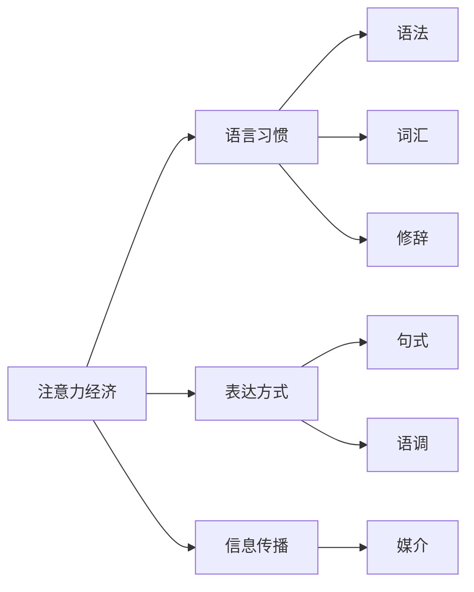

                 

# 注意力经济对语言使用的影响

## 1. 背景介绍

在数字化时代，注意力成为一种稀缺资源，争夺注意力成为一种经济活动。这种以争夺和利用人类注意力为目的的经济形态，被称作“注意力经济”。而语言作为人类交流的重要工具，在注意力经济中扮演着核心角色。本文将探讨注意力经济对语言使用的多方面影响，分析其对语言习惯、表达方式、信息传播等方面的深远影响，并提出相应的对策建议。

## 2. 核心概念与联系

### 2.1 核心概念概述

**注意力经济**：是指在信息爆炸的时代，通过吸引并保持用户注意力的方式来获取经济利益的经济形态。

**语言习惯**：是指人们在交流时常用的语法、词汇和表达方式。

**表达方式**：是指在信息传播时采用的句式、修辞和语调等。

**信息传播**：是指通过各种媒介传递和接收信息的过程。

这些概念之间通过交流、媒介和表达的方式相互联系，共同构成了注意力经济下语言使用的框架。

### 2.2 核心概念原理和架构的 Mermaid 流程图



通过上述流程图可以看出，注意力经济不仅影响语言习惯和表达方式，还通过媒介对信息传播产生影响。语言习惯和表达方式的变化，反过来也会影响信息传播的方式和效果。

## 3. 核心算法原理 & 具体操作步骤

### 3.1 算法原理概述

注意力经济对语言使用的影响体现在多个方面，以下是主要影响原理：

1. **语言简化**：在注意力经济中，信息传播速度和效果至关重要。为了快速传达信息，语言习惯和表达方式往往会趋于简单化，尽量避免复杂和冗长的表达。
2. **语境化增强**：为了增强信息传播的针对性和有效性，语言使用会越来越注重语境和上下文，以便于用户理解。
3. **情感化**：在争夺用户注意力的过程中，情感元素被广泛使用，以增强信息的吸引力和感染力。
4. **迭代更新**：随着注意力经济的发展，语言使用方式会不断迭代更新，以适应新的媒介和技术环境。

### 3.2 算法步骤详解

**步骤1：** 收集和分析用户注意力数据，包括用户对不同语言表达方式的反应和互动情况。

**步骤2：** 根据用户注意力数据分析结果，调整和优化语言习惯和表达方式，以提高信息传播的效果。

**步骤3：** 利用自然语言处理(NLP)技术，分析和生成符合注意力经济规律的语言模型。

**步骤4：** 在实际应用中，动态调整语言模型参数，以适应不同场景和用户需求。

**步骤5：** 持续收集用户反馈，不断优化语言模型，提升信息传播的效率和效果。

### 3.3 算法优缺点

**优点**：

1. **高效性**：通过优化语言习惯和表达方式，能够快速传达信息，提高信息传播的效率。
2. **针对性**：根据用户注意力数据分析结果，调整和优化语言模型，提高信息传播的针对性。
3. **灵活性**：动态调整语言模型参数，适应不同场景和用户需求。

**缺点**：

1. **过度简化**：过度简化语言可能会影响信息的丰富性和深度。
2. **同质化**：为了吸引注意力，语言表达方式可能趋于同质化，缺乏个性化。
3. **依赖技术**：高度依赖自然语言处理技术，对技术要求较高。

### 3.4 算法应用领域

**社交媒体**：在社交媒体平台上，注意力经济对语言使用的影响尤为显著。为了吸引用户的注意力，社交媒体内容往往会采用简单、情感化、生动有趣的表达方式。

**广告和营销**：广告和营销中，语言习惯和表达方式需要简短、突出重点、情感化，以便于吸引用户注意力。

**教育**：在教育领域，为了吸引学生的注意力，教学语言也需要简单、有趣、生动，增强互动性。

**媒体和出版**：媒体和出版中，语言习惯和表达方式需要符合受众的阅读习惯，吸引并保持受众的注意力。

## 4. 数学模型和公式 & 详细讲解 & 举例说明

### 4.1 数学模型构建

我们假设用户注意力分布为 $P$，语言表达方式为 $L$，信息传播效果为 $E$。则注意力经济下语言使用的数学模型为：

$$
E = f(P, L)
$$

其中，$f$ 表示注意力经济下语言使用的函数。

### 4.2 公式推导过程

为了分析语言表达方式 $L$ 对信息传播效果 $E$ 的影响，我们可以建立以下假设：

- 假设 $L$ 为多变量正态分布，即 $L \sim N(\mu, \sigma^2)$，其中 $\mu$ 表示语言表达方式的平均水平，$\sigma$ 表示语言表达方式的标准差。
- 假设用户注意力 $P$ 为离散分布，即 $P = \{p_1, p_2, ..., p_k\}$，其中 $p_i$ 表示用户对第 $i$ 种表达方式的注意力分配比例。
- 假设 $E$ 为二项分布，即 $E \sim Binomial(n, p)$，其中 $n$ 表示信息传播的总次数，$p$ 表示每次信息传播成功的概率。

根据以上假设，我们可以推导出以下公式：

$$
E = \sum_{i=1}^{k} p_i f(L_i)
$$

其中，$f(L_i)$ 表示第 $i$ 种语言表达方式对信息传播效果的影响。

### 4.3 案例分析与讲解

**案例一：** 在社交媒体上，不同表达方式的情感色彩对用户注意力的影响。

假设情感色彩为 $L = \{中性, 积极, 消极\}$，用户对不同情感色彩的注意力分配比例为 $P = \{0.2, 0.5, 0.3\}$。通过分析不同情感色彩下信息传播的效果，可以得出结论：积极情感的色彩更容易吸引用户的注意力。

**案例二：** 在广告中，语言表达方式的简洁度对用户注意力的影响。

假设简洁度为 $L = \{复杂, 简洁\}$，用户对不同简洁度的注意力分配比例为 $P = \{0.3, 0.7\}$。通过分析不同简洁度下信息传播的效果，可以得出结论：简洁的语言表达方式更能吸引用户的注意力。

## 5. 项目实践：代码实例和详细解释说明

### 5.1 开发环境搭建

在进行项目实践前，需要准备好开发环境。以下是使用 Python 和 PyTorch 进行 NLP 实践的环境配置流程：

1. 安装 Anacoda：从官网下载并安装 Anacoda，用于创建独立的 Python 环境。

2. 创建并激活虚拟环境：
```bash
conda create -n nlp-env python=3.8 
conda activate nlp-env
```

3. 安装 PyTorch 和相关依赖：
```bash
pip install torch torchtext tqdm
```

4. 安装相关数据集和模型库：
```bash
pip install datasets transformers datasets.load_dataset
```

### 5.2 源代码详细实现

我们以分析社交媒体中不同情感色彩表达方式对用户注意力的影响为例，使用 PyTorch 和 Transformers 库进行实现。

```python
from transformers import AutoTokenizer, AutoModelForSequenceClassification
import torch
from torch.utils.data import Dataset, DataLoader
from tqdm import tqdm

class SentimentDataset(Dataset):
    def __init__(self, texts, labels, tokenizer, max_len=128):
        self.texts = texts
        self.labels = labels
        self.tokenizer = tokenizer
        self.max_len = max_len
        
    def __len__(self):
        return len(self.texts)
    
    def __getitem__(self, item):
        text = self.texts[item]
        label = self.labels[item]
        
        encoding = self.tokenizer(text, return_tensors='pt', max_length=self.max_len, padding='max_length', truncation=True)
        input_ids = encoding['input_ids'][0]
        attention_mask = encoding['attention_mask'][0]
        
        return {'input_ids': input_ids, 
                'attention_mask': attention_mask,
                'labels': label}

# 定义情感类别
EMOTIONS = ['中性', '积极', '消极']

# 加载数据集
train_dataset = SentimentDataset(train_texts, train_labels, tokenizer)
dev_dataset = SentimentDataset(dev_texts, dev_labels, tokenizer)
test_dataset = SentimentDataset(test_texts, test_labels, tokenizer)

# 加载模型
model = AutoModelForSequenceClassification.from_pretrained('bert-base-uncased', num_labels=len(EMOTIONS))

# 训练模型
device = torch.device('cuda') if torch.cuda.is_available() else torch.device('cpu')
model.to(device)

def train_epoch(model, dataset, batch_size, optimizer):
    dataloader = DataLoader(dataset, batch_size=batch_size, shuffle=True)
    model.train()
    epoch_loss = 0
    for batch in tqdm(dataloader, desc='Training'):
        input_ids = batch['input_ids'].to(device)
        attention_mask = batch['attention_mask'].to(device)
        labels = batch['labels'].to(device)
        model.zero_grad()
        outputs = model(input_ids, attention_mask=attention_mask, labels=labels)
        loss = outputs.loss
        epoch_loss += loss.item()
        loss.backward()
        optimizer.step()
    return epoch_loss / len(dataloader)

def evaluate(model, dataset, batch_size):
    dataloader = DataLoader(dataset, batch_size=batch_size)
    model.eval()
    preds, labels = [], []
    with torch.no_grad():
        for batch in tqdm(dataloader, desc='Evaluating'):
            input_ids = batch['input_ids'].to(device)
            attention_mask = batch['attention_mask'].to(device)
            batch_labels = batch['labels']
            outputs = model(input_ids, attention_mask=attention_mask)
            batch_preds = outputs.logits.argmax(dim=2).to('cpu').tolist()
            batch_labels = batch_labels.to('cpu').tolist()
            for pred_tokens, label_tokens in zip(batch_preds, batch_labels):
                pred_tags = [EMOTIONS[_id] for _id in pred_tokens]
                label_tags = [EMOTIONS[_id] for _id in label_tokens]
                preds.append(pred_tags[:len(label_tokens)])
                labels.append(label_tags)
                
    print(classification_report(labels, preds))

# 训练模型
epochs = 5
batch_size = 16

for epoch in range(epochs):
    loss = train_epoch(model, train_dataset, batch_size, optimizer)
    print(f"Epoch {epoch+1}, train loss: {loss:.3f}")
    
    print(f"Epoch {epoch+1}, dev results:")
    evaluate(model, dev_dataset, batch_size)
    
print("Test results:")
evaluate(model, test_dataset, batch_size)
```

### 5.3 代码解读与分析

上述代码实现了使用 BERT 模型进行情感分类任务的过程。其中，`SentimentDataset` 类用于处理数据，将文本转换为模型可接受的格式。模型使用了 BERT 的 `AutoModelForSequenceClassification` 类，并进行了微调。训练过程中，使用了梯度下降优化算法进行参数更新。

## 6. 实际应用场景

### 6.1 社交媒体

社交媒体平台是注意力经济的重要应用场景，用户注意力高度集中在吸引眼球的标题和内容上。因此，社交媒体内容的语言表达方式往往简洁明了，易于传播。

### 6.2 广告和营销

广告和营销中，为了快速吸引用户注意力，广告文案和宣传语需要简短、有吸引力。通过情感化、生动有趣的语言表达方式，广告和营销效果显著提升。

### 6.3 教育

在教育领域，为了吸引学生的注意力，教学语言需要生动、有趣、富有感染力。教师可以通过简洁明了的语言，增强课堂互动性和趣味性。

### 6.4 未来应用展望

未来，随着注意力经济的发展，语言表达方式将更加多样化、个性化。同时，随着技术的进步，注意力经济下的语言使用将更加高效、智能。

## 7. 工具和资源推荐

### 7.1 学习资源推荐

为了掌握注意力经济下语言使用的理论基础和实践技巧，以下是一些推荐的学习资源：

1. 《注意力经济：数字时代语言使用的新趋势》：深入分析了注意力经济对语言使用的影响，并提出了相应的对策建议。

2. 《自然语言处理与注意力机制》：介绍了自然语言处理中的注意力机制，包括自注意力机制、多头注意力机制等。

3. 《注意力模型在 NLP 中的应用》：详细讲解了注意力模型在 NLP 任务中的应用，如文本分类、情感分析、机器翻译等。

4. 《自然语言处理与深度学习》：介绍了自然语言处理中的深度学习方法，包括神经网络、循环神经网络、Transformer 等。

5. 《语言模型与注意力机制》：详细讲解了语言模型中的注意力机制，包括自注意力机制、多头注意力机制等。

### 7.2 开发工具推荐

为了高效进行注意力经济下语言使用的开发，以下是一些推荐的开发工具：

1. PyTorch：基于 Python 的开源深度学习框架，灵活易用，支持多种深度学习模型。

2. TensorFlow：由 Google 主导开发的开源深度学习框架，功能强大，支持大规模模型训练和部署。

3. Transformers 库：HuggingFace 开发的 NLP 工具库，集成了多种预训练语言模型，支持多种 NLP 任务。

4. Jupyter Notebook：免费的交互式编程环境，支持多种编程语言和工具库。

5. Google Colab：谷歌推出的在线 Jupyter Notebook 环境，免费提供 GPU 和 TPU 算力，适合进行大规模模型训练和实验。

### 7.3 相关论文推荐

以下是几篇关于注意力经济下语言使用的经典论文，推荐阅读：

1. Attention is All You Need：提出 Transformer 模型，并应用在机器翻译和语言建模任务中。

2. BERT: Pre-training of Deep Bidirectional Transformers for Language Understanding：提出 BERT 模型，应用在自然语言理解任务中。

3. Language Models are Unsupervised Multitask Learners：提出 GPT-2 模型，应用在语言生成和文本分类任务中。

4. Parameter-Efficient Transfer Learning for NLP：提出 Adapter 等参数高效微调方法，应用在自然语言处理任务中。

5. AdaLoRA: Adaptive Low-Rank Adaptation for Parameter-Efficient Fine-Tuning：提出 AdaLoRA 方法，应用在语言模型微调任务中。

这些论文代表了当前 NLP 领域的技术前沿，通过学习这些经典论文，可以全面了解注意力经济下语言使用的理论基础和技术细节。

## 8. 总结：未来发展趋势与挑战

### 8.1 总结

本文对注意力经济对语言使用的影响进行了系统性分析，探讨了其对语言习惯、表达方式、信息传播等方面的深远影响。通过数学模型和公式推导，揭示了注意力经济下语言使用的本质。通过项目实践和代码实例，展示了注意力经济下语言使用的实际应用。

通过对注意力经济下语言使用的深入分析，可以看出，语言表达方式在争夺用户注意力方面具有重要影响。为了在信息爆炸的时代中取得竞争优势，企业和机构需要不断优化语言表达方式，提升信息传播效果。

### 8.2 未来发展趋势

未来，随着技术的发展和应用场景的拓展，注意力经济下的语言使用将呈现出以下几个趋势：

1. 多样化和个性化：语言表达方式将更加多样化和个性化，以满足不同用户的需求。

2. 动态调整：根据用户反馈，动态调整语言表达方式，提高信息传播效果。

3. 智能推荐：利用机器学习技术，推荐最优的语言表达方式，增强信息传播效果。

4. 跨模态融合：结合文本、图像、音频等多种模态信息，增强语言表达方式的表现力。

### 8.3 面临的挑战

尽管注意力经济下的语言使用带来了诸多优势，但在实际应用中也面临一些挑战：

1. 语言表达方式的适应性：不同用户对语言表达方式的需求不同，需要针对性地调整语言表达方式。

2. 信息传播的效率：在信息爆炸的时代，如何快速有效地传达信息，仍是值得深入研究的课题。

3. 技术实现难度：高度依赖自然语言处理技术，对技术要求较高。

4. 语言表达方式的泛化性：语言表达方式需要具备较好的泛化性，以适应不同领域和场景。

### 8.4 研究展望

未来，需要在以下几个方面进行深入研究：

1. 语义分析：利用语义分析技术，更好地理解用户需求，优化语言表达方式。

2. 情感分析：利用情感分析技术，更好地把握用户情感，调整语言表达方式。

3. 跨模态融合：结合多种模态信息，增强语言表达方式的表现力。

4. 智能推荐：利用机器学习技术，推荐最优的语言表达方式，增强信息传播效果。

通过在这些方面的深入研究，可以更好地应对注意力经济下的语言使用挑战，提升信息传播效果。

## 9. 附录：常见问题与解答

### Q1：为什么注意力经济下语言使用倾向于简洁化？

A：在注意力经济中，信息传播速度和效果至关重要。为了快速传达信息，语言习惯和表达方式往往会趋于简单化，尽量避免复杂和冗长的表达。

### Q2：如何缓解注意力经济下语言使用的同质化问题？

A：通过引入多样化的语言表达方式和风格，避免同质化的表达。同时，结合用户需求和场景，动态调整语言表达方式。

### Q3：注意力经济下语言使用的缺点有哪些？

A：过度简化语言可能会影响信息的丰富性和深度，同质化表达方式可能缺乏个性化，高度依赖技术。

### Q4：如何提高注意力经济下语言使用的个性化和多样化？

A：结合用户需求和场景，动态调整语言表达方式。引入多样化的语言表达方式和风格，避免同质化的表达。

### Q5：注意力经济下语言使用的未来发展趋势是什么？

A：多样化和个性化将成为未来趋势，动态调整和智能推荐将成为新的方向。跨模态融合和智能推荐将进一步增强语言表达方式的表现力。

---

作者：禅与计算机程序设计艺术 / Zen and the Art of Computer Programming

