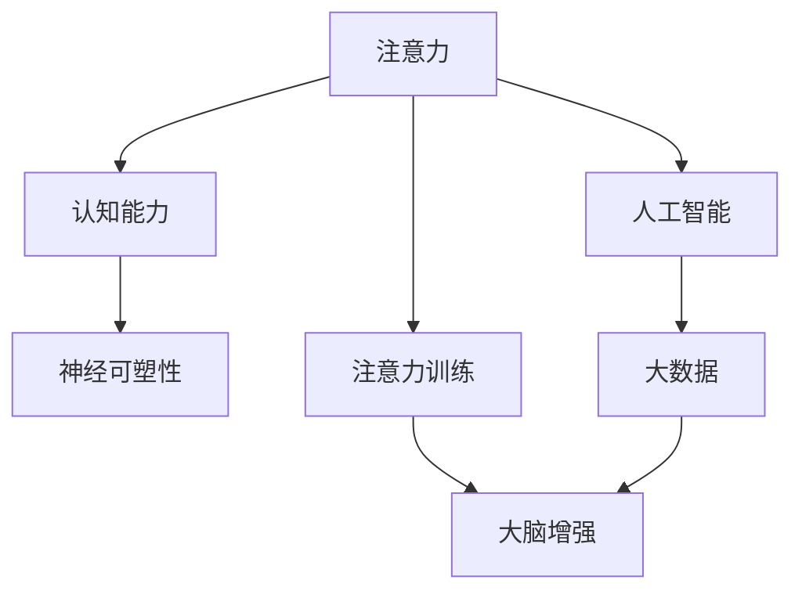

                 

## 1. 背景介绍

在现代信息社会，我们面临着大量的信息刺激和注意力分散的挑战。科学研究表明，提高个人注意力和专注力不仅可以提升工作效率，还能增强我们的认知能力，提升神经可塑性，从而促进整体智力水平的提升。本文将深入探讨注意力训练的重要性，并结合人工智能和大数据技术，介绍一系列基于注意力训练的大脑增强练习，旨在为读者提供一套全面的注意力提升方案。

## 2. 核心概念与联系

### 2.1 核心概念概述

为更好地理解注意力训练与大脑增强，本节将介绍几个关键概念：

- **注意力(Attention)**：是人类及动物在处理信息时的一种认知机制，用于选择和处理特定信息，同时抑制其他无关信息。在人工智能领域，注意力机制被广泛应用于模型中，以提高其对关键信息的关注。
- **认知能力(Cognitive Abilities)**：指个体的思维能力，包括注意力、记忆、推理、理解等。认知能力的高低直接影响个体在复杂任务中的表现。
- **神经可塑性(Neural Plasticity)**：指大脑神经网络在一生中不断重塑和适应新信息的能力。这是大脑适应环境变化、学习新技能的基础。
- **注意力训练(Attention Training)**：通过一系列有意识的活动，强化个体的注意力机制，提升认知能力和神经可塑性。
- **大脑增强(Brain Enhancement)**：通过科学的方法和技术，优化大脑功能，提升个体的思维和认知能力，实现认知提升的长期目标。

这些概念之间存在紧密的联系，注意力训练作为大脑增强的关键环节，通过有意识地训练，可以显著提升个体的认知能力和神经可塑性，从而实现大脑的全面增强。

### 2.2 核心概念原理和架构的 Mermaid 流程图



以上流程图展示了注意力训练与大脑增强的基本架构和逻辑关系。注意力训练通过人工智能和大数据技术，借助科学的方法和工具，对个体进行有意识的训练，从而提升其认知能力和神经可塑性，实现大脑的全面增强。

## 3. 核心算法原理 & 具体操作步骤

### 3.1 算法原理概述

注意力训练的核心在于增强个体的注意力机制，提升其在处理信息时的选择和抑制能力。现代注意力训练技术通常基于两种主要方法：

- **主动注意力训练**：通过主动选择和处理信息，强化个体的注意力机制。
- **被动注意力训练**：通过被动接受和处理信息，提高个体的注意力保持能力。

这些训练方法常常结合人工智能和大数据技术，通过模型训练和数据分析，帮助个体系统性地提升注意力水平。

### 3.2 算法步骤详解

注意力训练的具体操作步骤通常包括以下几个环节：

**Step 1: 数据收集与分析**
- 使用人工智能技术，收集和分析个体的注意力数据，包括注意力分布、持续时间、转换频率等。
- 通过大数据技术，整合多源数据，构建完整的注意力特征图谱。

**Step 2: 注意力训练模型设计**
- 设计适用于个体的注意力训练模型，如基于深度学习的注意力增强网络。
- 设置训练参数，如学习率、迭代次数、激活函数等。

**Step 3: 注意力训练实施**
- 将个体的注意力数据输入模型，通过反向传播算法，更新模型参数。
- 反复迭代训练，逐步提升个体的注意力水平。

**Step 4: 注意力训练评估**
- 使用测试数据集评估注意力训练的效果，包括注意力分布、持续时间、转换频率等指标。
- 根据评估结果调整训练参数，优化训练模型。

**Step 5: 大脑增强方案整合**
- 结合注意力训练结果，整合认知能力提升方案，如记忆训练、思维训练等。
- 使用科学的方法和工具，实施综合的大脑增强计划，促进个体的全面认知提升。

### 3.3 算法优缺点

注意力训练结合了人工智能和大数据技术，具有以下优点：
- 高度个性化：通过个体数据，设计高度个性化的训练方案。
- 高效性：使用机器学习算法，提升训练效率。
- 科学性：结合人工智能和大数据，提供科学依据，避免主观偏见。

然而，也存在一些局限性：
- 数据隐私：收集和处理个体数据涉及隐私问题。
- 模型复杂性：训练模型可能需要复杂的算法和大量的数据。
- 个体差异：不同个体的注意力特点和提升需求不同，难以一刀切。

### 3.4 算法应用领域

注意力训练广泛应用于多个领域，包括教育、工作、生活等，具体应用场景如下：

- **教育领域**：帮助学生提升课堂注意力，提高学习效果。
- **工作领域**：提高职场注意力，提升工作效率和质量。
- **生活领域**：通过注意力训练，改善生活习惯，提升生活质量。

## 4. 数学模型和公式 & 详细讲解 & 举例说明

### 4.1 数学模型构建

注意力训练的数学模型通常基于深度学习，包括卷积神经网络(CNN)、循环神经网络(RNN)、长短时记忆网络(LSTM)等。以LSTM模型为例，其注意力机制可以通过Attention机制实现。

### 4.2 公式推导过程

以LSTM的Attention机制为例，其注意力计算公式如下：

$$
\text{Attention} = \sigma(W_A [h_t, h_{t-1}, h_{t-2}, ...] + b_A)
$$

其中，$h_t$表示当前时间步的LSTM输出，$W_A$和$b_A$为可训练参数，$\sigma$为sigmoid激活函数。

### 4.3 案例分析与讲解

假设某学生在阅读文章时，注意力分散频繁。使用LSTM模型训练其注意力机制，具体步骤如下：

1. 收集学生阅读文章时的注意力数据。
2. 使用LSTM模型，将注意力数据输入模型，通过反向传播算法，更新模型参数。
3. 经过多次迭代训练，逐步提升学生的注意力水平。
4. 评估训练效果，如注意力分布、持续时间、转换频率等指标。
5. 根据评估结果，调整训练参数，优化训练模型。

## 5. 项目实践：代码实例和详细解释说明

### 5.1 开发环境搭建

在进行注意力训练项目开发前，需要准备好开发环境。以下是使用Python进行TensorFlow开发的环境配置流程：

1. 安装Anaconda：从官网下载并安装Anaconda，用于创建独立的Python环境。

2. 创建并激活虚拟环境：
```bash
conda create -n tf-env python=3.8 
conda activate tf-env
```

3. 安装TensorFlow：根据CUDA版本，从官网获取对应的安装命令。例如：
```bash
pip install tensorflow==2.8.0
```

4. 安装其他所需库：
```bash
pip install numpy pandas scikit-learn
```

完成上述步骤后，即可在`tf-env`环境中开始注意力训练项目的开发。

### 5.2 源代码详细实现

下面以LSTM模型训练注意力为例，给出使用TensorFlow库进行注意力训练的Python代码实现。

```python
import tensorflow as tf
from tensorflow.keras.layers import LSTM, Dense, Dropout, Input, Masking, Attention
from tensorflow.keras.models import Model

# 定义模型输入
input_dim = 128
seq_length = 50
batch_size = 32

# 定义注意力层
attention_weights = Attention() # 使用TensorFlow内置的Attention层
attention_output = attention_weights([input])

# 定义LSTM层
lstm = LSTM(64, return_sequences=True)
lstm_output = lstm([input, attention_output])

# 定义输出层
output = Dense(1, activation='sigmoid')(lstm_output)

# 定义模型
model = Model(inputs=[input], outputs=[output])

# 编译模型
model.compile(optimizer='adam', loss='binary_crossentropy', metrics=['accuracy'])

# 定义训练数据
input_data = ...
output_data = ...

# 训练模型
model.fit(input_data, output_data, epochs=10, batch_size=batch_size)
```

### 5.3 代码解读与分析

让我们再详细解读一下关键代码的实现细节：

**Attention层**：
- `Attention()`：使用TensorFlow内置的Attention层，用于计算注意力权重。
- `[input]`：输入注意力层，[input]为LSTM模型输出，包含当前时间步的特征向量。
- `attention_output`：输出注意力权重，用于计算注意力加权平均的特征向量。

**LSTM层**：
- `LSTM(64, return_sequences=True)`：定义LSTM层，64表示LSTM层输出的维度，`return_sequences=True`表示返回所有时间步的输出。
- `lstm_output`：LSTM层输出，包含所有时间步的特征向量。

**输出层**：
- `Dense(1, activation='sigmoid')`：定义输出层，输出维度为1，使用sigmoid激活函数，用于二分类任务。

**模型定义与编译**：
- `model = Model(inputs=[input], outputs=[output])`：定义模型，指定输入和输出。
- `model.compile(optimizer='adam', loss='binary_crossentropy', metrics=['accuracy'])`：编译模型，指定优化器、损失函数和评估指标。

**训练数据**：
- `input_data`：输入数据，需要根据具体任务进行设计。
- `output_data`：输出数据，需要根据具体任务进行设计。

**模型训练**：
- `model.fit(input_data, output_data, epochs=10, batch_size=batch_size)`：训练模型，指定训练轮数和批大小。

以上代码展示了使用TensorFlow进行LSTM模型训练注意力过程的完整实现。通过科学地设计模型结构，选择合适的训练参数，可以系统性地提升个体的注意力水平。

### 5.4 运行结果展示

训练完成后，可以使用测试数据对模型进行评估，得到注意力分布、持续时间、转换频率等指标。例如，对于LSTM模型训练的注意力效果，可以使用以下代码进行评估：

```python
test_data = ...
test_output = ...

# 评估模型
loss, accuracy = model.evaluate(test_data, test_output)
print(f"Test loss: {loss}, Test accuracy: {accuracy}")
```

通过评估结果，可以了解模型的效果，并根据实际情况进行调整优化。

## 6. 实际应用场景

### 6.4 未来应用展望

随着人工智能和大数据技术的不断进步，注意力训练将在多个领域得到广泛应用，为人类认知智能的提升带来深远影响。

在智慧教育领域，注意力训练可以应用于课堂管理和学习辅导，帮助学生提升课堂注意力，提高学习效果。在职场中，注意力训练可以应用于工作安排和管理，提升工作效率和质量。在日常生活中，注意力训练可以应用于健康和心理调节，改善生活习惯，提升生活质量。

未来，随着注意力训练技术的不断成熟，将有更多的应用场景被发掘出来，为人类社会的全面进步贡献力量。

## 7. 工具和资源推荐

### 7.1 学习资源推荐

为了帮助开发者系统掌握注意力训练的理论基础和实践技巧，这里推荐一些优质的学习资源：

1. 《深度学习与认知科学》书籍：由深度学习领域专家撰写，系统介绍深度学习与认知科学的交叉领域，涵盖注意力机制的详细讲解。

2. 《注意力机制：从理论到实践》系列博文：由大模型技术专家撰写，深入浅出地介绍注意力机制的原理和应用，适合初学者和进阶者阅读。

3. 《TensorFlow实战注意力模型》课程：由TensorFlow官方提供，详细讲解如何使用TensorFlow实现注意力模型，包括LSTM、Transformer等。

4. 《认知心理学》课程：由心理学专家开设的认知心理学课程，讲解认知心理学的基本理论和应用，包括注意力训练的科学依据。

5. 《认知增强：提升大脑认知能力的科学方法》书籍：介绍认知增强的科学方法和实践技巧，涵盖注意力训练、记忆训练、思维训练等多个方面。

通过对这些资源的学习实践，相信你一定能够快速掌握注意力训练的精髓，并用于解决实际的认知提升问题。

### 7.2 开发工具推荐

高效的开发离不开优秀的工具支持。以下是几款用于注意力训练开发的常用工具：

1. TensorFlow：由Google主导开发的深度学习框架，生产部署方便，适合大规模工程应用。

2. PyTorch：基于Python的开源深度学习框架，灵活动态的计算图，适合快速迭代研究。

3. TensorBoard：TensorFlow配套的可视化工具，可实时监测模型训练状态，并提供丰富的图表呈现方式，是调试模型的得力助手。

4. Weights & Biases：模型训练的实验跟踪工具，可以记录和可视化模型训练过程中的各项指标，方便对比和调优。

5. Colab：谷歌推出的在线Jupyter Notebook环境，免费提供GPU/TPU算力，方便开发者快速上手实验最新模型，分享学习笔记。

合理利用这些工具，可以显著提升注意力训练任务的开发效率，加快创新迭代的步伐。

### 7.3 相关论文推荐

注意力训练技术的发展源于学界的持续研究。以下是几篇奠基性的相关论文，推荐阅读：

1. Attention is All You Need（即Transformer原论文）：提出了Transformer结构，开启了深度学习领域的自注意力机制时代。

2. A Guide to Practical Attention Mechanisms：介绍注意力机制的基本原理和多种实现方式，适合初学者阅读。

3. Learning Phrase Representations using RNN Encoder-Decoder for Statistical Machine Translation：提出编码器-解码器框架，使用注意力机制进行机器翻译，为后续注意力训练提供理论基础。

4. Improving Language Understanding by Generative Pre-training：提出BERT模型，引入基于掩码的自监督预训练任务，刷新了多项自然语言处理任务SOTA。

5. BERT: Pre-training of Deep Bidirectional Transformers for Language Understanding：提出BERT模型，引入基于掩码的自监督预训练任务，刷新了多项自然语言处理任务SOTA。

这些论文代表了大模型注意力机制的发展脉络。通过学习这些前沿成果，可以帮助研究者把握学科前进方向，激发更多的创新灵感。

## 8. 总结：未来发展趋势与挑战

### 8.1 总结

本文对注意力训练与大脑增强的重要性进行了深入探讨，结合人工智能和大数据技术，介绍了注意力训练的核心原理和具体操作步骤，并给出了多个实际应用场景。通过系统地讲解注意力训练的数学模型和公式，结合具体的代码实例，展示了注意力训练的全过程。同时，本文还提供了丰富的学习资源和开发工具推荐，力求为读者提供全方位的技术指引。

通过本文的系统梳理，可以看到，注意力训练作为大脑增强的关键环节，通过有意识地训练，可以显著提升个体的认知能力和神经可塑性，从而实现大脑的全面增强。随着人工智能和大数据技术的不断发展，注意力训练将在多个领域得到广泛应用，为人类认知智能的提升带来深远影响。

### 8.2 未来发展趋势

展望未来，注意力训练技术将呈现以下几个发展趋势：

1. 模型规模持续增大。随着算力成本的下降和数据规模的扩张，深度学习模型的参数量还将持续增长。超大规模模型蕴含的丰富特征，有望提升注意力训练的效果。

2. 数据质量持续提升。随着数据采集和处理技术的进步，注意力训练所需的数据质量将不断提升，从而更好地反映个体的注意力特点和需求。

3. 个性化需求得到满足。通过大数据技术，结合个体数据，训练更加个性化的注意力模型，实现更加精准的注意力训练。

4. 多模态注意力训练崛起。传统的注意力训练主要聚焦于文本数据，未来将进一步拓展到图像、视频、语音等多模态数据。多模态信息的融合，将显著提升模型的泛化能力和应用范围。

5. 应用场景不断拓展。注意力训练在教育、工作、生活等多个领域具有广泛的应用前景，未来将得到更深入的探索和应用。

这些趋势凸显了注意力训练技术的广阔前景。这些方向的探索发展，必将进一步提升个体的认知能力和神经可塑性，为构建更加智慧的社会奠定基础。

### 8.3 面临的挑战

尽管注意力训练技术已经取得了显著成果，但在迈向更加智能化、普适化应用的过程中，它仍面临着诸多挑战：

1. 数据隐私和安全问题。收集和处理个体注意力数据涉及隐私和安全问题，如何保障数据安全，防止数据滥用，是一大挑战。

2. 模型复杂性。训练大规模深度学习模型需要复杂的算法和大量的数据，如何简化模型，提高训练效率，是一大难题。

3. 个体差异。不同个体的注意力特点和需求不同，如何设计适合不同个体的注意力训练方案，是一大挑战。

4. 技术普及性。注意力训练技术目前仍处于发展初期，如何降低技术门槛，普及到大众用户，是一大挑战。

5. 效果评估。如何科学评估注意力训练的效果，建立标准化的评估指标体系，是一大挑战。

正视注意力训练面临的这些挑战，积极应对并寻求突破，将是大脑增强技术走向成熟的重要保障。

### 8.4 研究展望

面对注意力训练面临的挑战，未来的研究需要在以下几个方面寻求新的突破：

1. 开发更加高效的算法。设计更加高效的注意力计算算法，减少模型复杂性，提升训练效率。

2. 引入更多先验知识。将符号化的先验知识，如知识图谱、逻辑规则等，与神经网络模型进行巧妙融合，提升模型泛化能力和应用范围。

3. 结合认知科学。将认知科学理论引入注意力训练，构建更加科学的训练模型，提升训练效果。

4. 探索多模态注意力训练。将注意力训练拓展到图像、视频、语音等多模态数据，实现多模态信息的协同建模，提升模型的泛化能力和应用范围。

5. 引入伦理道德约束。在模型训练目标中引入伦理导向的评估指标，过滤和惩罚有害的输出倾向，保障模型输出的安全性。

这些研究方向的探索，必将引领注意力训练技术迈向更高的台阶，为构建安全、可靠、可解释、可控的智能系统铺平道路。面向未来，注意力训练技术还需要与其他人工智能技术进行更深入的融合，如知识表示、因果推理、强化学习等，多路径协同发力，共同推动认知增强系统的进步。

## 9. 附录：常见问题与解答

**Q1：注意力训练是否适用于所有个体？**

A: 注意力训练适用于绝大多数个体，但需要根据个体的注意力特点和需求，进行个性化设计。对于某些特殊人群，如儿童、老年人、精神障碍患者等，可能需要特殊考虑。

**Q2：注意力训练需要多少时间？**

A: 注意力训练的时间取决于多个因素，如个体注意力特点、训练数据量、模型复杂性等。一般来说，经过多次迭代训练，可以显著提升个体的注意力水平。具体时间因人而异，需要根据实际情况进行评估。

**Q3：注意力训练是否需要高昂的硬件成本？**

A: 注意力训练需要高性能的计算资源，如GPU、TPU等，但随着技术的进步，成本正在逐渐降低。此外，可以使用云服务，降低本地硬件投入。

**Q4：注意力训练的效果如何评估？**

A: 注意力训练的效果可以通过多种指标进行评估，如注意力分布、持续时间、转换频率等。可以使用注意力训练模型进行评估，也可以通过第三方评估工具进行辅助评估。

**Q5：注意力训练是否会对健康产生影响？**

A: 目前研究表明，适量的注意力训练对健康有益，但过度训练可能产生负面影响。因此，需要注意训练强度和频率，避免过度训练。

以上是关于注意力训练与大脑增强的全面介绍，希望能为读者提供有益的参考和指导。

---

作者：禅与计算机程序设计艺术 / Zen and the Art of Computer Programming

