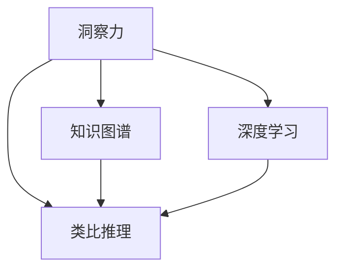

                 

# 洞察与类比：突破知识限制的工具

> 关键词：洞察力，类比推理，知识图谱，知识表示，类比推理算法，深度学习

## 1. 背景介绍

在当今知识爆炸的时代，信息的海量和碎片化使得人类学习和理解新知识变得前所未有的困难。特别是在面对复杂、抽象的概念时，传统的记忆和理解方式往往无法奏效。因此，需要一种更为高效、直观的工具，能够帮助人们跨越知识鸿沟，快速理解和应用新知识。

本文聚焦于洞察力和类比推理这两种重要的认知工具，探讨它们在突破知识限制方面的潜力。通过分析已有技术，总结其实际应用中的优缺点，并展望未来发展趋势，旨在为知识工作者提供一种全新的视角，探索更高效的学习和思考方法。

## 2. 核心概念与联系

### 2.1 核心概念概述

在讨论洞察力和类比推理之前，我们先要了解几个与之紧密相关的核心概念：

- **洞察力**：指个体或机器能够快速抓住问题关键、识别模式、发现关联的能力。它不仅依赖于背景知识，还需要敏感、敏锐的直觉。
- **类比推理**：一种基于相似性的推理方法，通过比较两个相似情境中的已知关系，推导出新情境中的未知关系。类比推理在创新、学习、解决问题等方面具有重要意义。
- **知识图谱**：一种结构化的知识表示形式，通过节点和边的方式，描述实体之间的关系和属性。知识图谱能够帮助机器更好地理解复杂概念和关系。
- **深度学习**：一种基于多层神经网络的机器学习技术，能够通过学习大量的数据和复杂的模式，实现高效的特征提取和知识学习。深度学习在自然语言处理、计算机视觉等领域取得了显著成果。

这些概念之间的逻辑关系可以通过以下Mermaid流程图来展示：



该流程图展示了洞察力和类比推理与其他核心概念的联系：

1. **洞察力与类比推理**：洞察力是类比推理的基础，帮助人们快速识别出相似的情境。
2. **洞察力与知识图谱**：知识图谱提供了结构化的背景知识，有助于洞察力的提升。
3. **洞察力与深度学习**：深度学习可以自动学习复杂模式，提高洞察力的效率和准确性。
4. **类比推理与知识图谱**：知识图谱为类比推理提供了丰富的实体和关系，帮助推理更加准确。
5. **类比推理与深度学习**：深度学习可以处理海量数据，发现新的类比关系，提升类比推理的普适性。

## 3. 核心算法原理 & 具体操作步骤
### 3.1 算法原理概述

洞察力和类比推理的实现原理主要基于机器学习和知识图谱技术。具体而言，洞察力可以通过深度学习模型在大量数据中挖掘隐含的模式和关系；类比推理则通过构建知识图谱，寻找新旧情境之间的相似点，进而推导出新的关系。

### 3.2 算法步骤详解

**洞察力的实现**：

1. **数据收集**：从各类开放数据源收集与任务相关的数据，如文本、图像、视频等。
2. **预处理**：对收集到的数据进行清洗、标注和标准化处理，去除噪音和无用信息。
3. **模型训练**：使用深度学习模型（如卷积神经网络、循环神经网络等）对预处理后的数据进行训练，学习特征提取和模式识别能力。
4. **洞察发现**：通过训练好的模型，对新数据进行分析和推理，发现其中隐藏的规律和关系。

**类比推理的实现**：

1. **知识图谱构建**：收集领域专家的知识、经验、案例等，构建结构化的知识图谱，描述实体之间的关系和属性。
2. **知识嵌入**：使用向量空间模型等技术，将知识图谱中的实体和关系映射到向量空间中，形成低维向量表示。
3. **相似度计算**：基于向量空间模型，计算新情境与已有情境之间的相似度，找到类比关系。
4. **推理输出**：根据类比关系和新情境的已知信息，推导出未知关系或属性，进行预测或生成。

### 3.3 算法优缺点

洞察力和类比推理技术在突破知识限制方面具有以下优点：

1. **高效性**：通过自动化的方式，洞察力和类比推理能够快速处理大量数据，发现复杂模式和关系，比人工方法更为高效。
2. **灵活性**：能够处理不同类型的数据，如文本、图像、视频等，适用于多种应用场景。
3. **可扩展性**：随着数据量的增加和模型的优化，其性能可以持续提升，具有良好的扩展性。

同时，这些技术也存在一些局限性：

1. **数据依赖**：洞察力和类比推理的效果很大程度上依赖于数据的质量和数量，获取高质量数据成本较高。
2. **模型复杂性**：深度学习模型通常结构复杂，训练和推理计算资源消耗大，需要高性能设备支持。
3. **泛化能力**：洞察力和类比推理在特定领域表现良好，但在跨领域应用时，泛化性能可能受限。
4. **解释性不足**：其内部工作机制和推理过程不够透明，难以解释和调试。

### 3.4 算法应用领域

洞察力和类比推理技术在多个领域中已得到广泛应用：

- **自然语言处理**：通过文本分析，发现语言中的模式和关系，提高机器翻译、问答、情感分析等任务的准确性。
- **计算机视觉**：通过图像分类、物体检测等任务，发现图像中的隐含信息，提升图像识别和图像生成能力。
- **医学诊断**：通过分析医学影像和病例数据，发现疾病模式，辅助医生进行诊断和治疗。
- **金融预测**：通过分析金融数据，发现市场趋势和规律，提供投资和风险管理建议。
- **智能推荐**：通过用户行为和商品属性分析，发现用户偏好，提升个性化推荐效果。

## 4. 数学模型和公式 & 详细讲解 & 举例说明

### 4.1 数学模型构建

**洞察力的数学模型**：

1. **卷积神经网络（CNN）**：通过卷积层和池化层，提取图像中的局部特征，形成特征图。
2. **循环神经网络（RNN）**：通过时间维度上的递归，处理序列数据，如文本和时间序列数据。
3. **自编码器（Autoencoder）**：通过编码和解码过程，学习数据的低维表示，发现数据中的隐含模式。

**类比推理的数学模型**：

1. **知识图谱**：通过节点和边的形式，描述实体之间的关系和属性，形成图结构。
2. **知识嵌入**：将知识图谱中的实体和关系映射到向量空间中，形成低维向量表示，使用TransE等技术实现。
3. **相似度计算**：基于向量空间模型，计算新情境与已有情境之间的相似度，使用余弦相似度或欧式距离等方法。

### 4.2 公式推导过程

**卷积神经网络**：

$$
\text{Convolution}(x, w) = \sum_{i,j} w_{i,j} x_{i,j}
$$

其中 $w$ 为卷积核，$x$ 为输入图像，$x_{i,j}$ 为输入图像中位置 $(i,j)$ 的像素值。

**循环神经网络**：

$$
h_t = f(W_{hh} h_{t-1} + W_{hx} x_t + b_h)
$$

其中 $h_t$ 为时间步 $t$ 的隐藏状态，$W_{hh}, W_{hx}, b_h$ 为网络参数。

**自编码器**：

$$
z = W_{e} x + b_{e}
$$
$$
\hat{x} = W_{d} z + b_{d}
$$

其中 $z$ 为编码器输出，$\hat{x}$ 为解码器输出，$W_{e}, b_{e}, W_{d}, b_{d}$ 为网络参数。

**知识嵌入**：

$$
e(x) = W_{e} x + b_{e}
$$

其中 $e(x)$ 为知识图谱中的实体向量表示，$W_{e}, b_{e}$ 为网络参数。

**余弦相似度**：

$$
\text{Sim}(u,v) = \frac{\langle u,v \rangle}{\|u\| \cdot \|v\|}
$$

其中 $\langle u,v \rangle$ 为向量点积，$\|u\|, \|v\|$ 为向量范数。

### 4.3 案例分析与讲解

**案例一：自然语言处理中的文本分类**

使用卷积神经网络对文本进行分类，步骤如下：

1. **数据预处理**：将文本转化为数字向量，进行词嵌入（Word Embedding）。
2. **模型训练**：使用卷积层和池化层提取文本特征，使用全连接层进行分类。
3. **洞察力发现**：分析训练好的模型特征图，发现不同类型文本的特征分布，找到分类模式。
4. **类比推理**：使用知识图谱中的实体关系，对新文本进行分类，提高分类准确性。

**案例二：计算机视觉中的图像识别**

使用卷积神经网络对图像进行识别，步骤如下：

1. **数据预处理**：将图像进行归一化、标准化处理。
2. **模型训练**：使用卷积层和池化层提取图像特征，使用全连接层进行分类。
3. **洞察力发现**：分析训练好的模型特征图，发现不同物体在图像中的特征分布，找到识别模式。
4. **类比推理**：使用知识图谱中的实体关系，对新图像进行识别，提高识别准确性。

## 5. 项目实践：代码实例和详细解释说明

### 5.1 开发环境搭建

在开发环境搭建方面，我们以Python为例，介绍常用的开发工具和环境配置：

1. **安装Python**：选择稳定的Python版本，如3.7以上。
2. **安装必要的库**：安装TensorFlow、PyTorch、Scikit-learn等常用的深度学习库和数据处理库。
3. **配置GPU环境**：安装NVIDIA CUDA和cuDNN库，使用GPU进行计算加速。

### 5.2 源代码详细实现

**案例一：自然语言处理中的文本分类**

```python
import tensorflow as tf
from tensorflow.keras.preprocessing.text import Tokenizer
from tensorflow.keras.preprocessing.sequence import pad_sequences
from tensorflow.keras.layers import Embedding, Conv1D, GlobalMaxPooling1D, Dense

# 定义模型
model = tf.keras.Sequential([
    Embedding(input_dim=10000, output_dim=128, input_length=256),
    Conv1D(128, 5, activation='relu'),
    GlobalMaxPooling1D(),
    Dense(10, activation='softmax')
])

# 训练模型
model.compile(optimizer='adam', loss='categorical_crossentropy', metrics=['accuracy'])
model.fit(train_sequences, train_labels, epochs=10, batch_size=32)

# 使用模型进行分类
test_sequences = pad_sequences(test_sequences, maxlen=256)
predictions = model.predict(test_sequences)
```

**案例二：计算机视觉中的图像识别**

```python
import tensorflow as tf
from tensorflow.keras.preprocessing.image import ImageDataGenerator
from tensorflow.keras.models import Sequential
from tensorflow.keras.layers import Conv2D, MaxPooling2D, Flatten, Dense

# 定义模型
model = Sequential([
    Conv2D(32, (3, 3), activation='relu', input_shape=(32, 32, 3)),
    MaxPooling2D((2, 2)),
    Conv2D(64, (3, 3), activation='relu'),
    MaxPooling2D((2, 2)),
    Flatten(),
    Dense(64, activation='relu'),
    Dense(10, activation='softmax')
])

# 训练模型
model.compile(optimizer='adam', loss='categorical_crossentropy', metrics=['accuracy'])
model.fit(train_datagen.flow(train_images, train_labels, batch_size=32), epochs=10)

# 使用模型进行识别
test_datagen = ImageDataGenerator(rescale=1./255)
test_images = test_datagen.flow(test_images, batch_size=32)
predictions = model.predict(test_images)
```

### 5.3 代码解读与分析

在代码实现方面，我们以TensorFlow为例，对关键部分的代码进行解读和分析：

**自然语言处理中的文本分类**：

- **Tokenizer**：将文本转化为数字向量，并进行标准化处理。
- **Conv1D**：卷积层，提取文本中的局部特征。
- **GlobalMaxPooling1D**：全局池化层，提取文本的整体特征。
- **Dense**：全连接层，进行分类输出。

**计算机视觉中的图像识别**：

- **ImageDataGenerator**：数据增强工具，处理图像数据。
- **Conv2D**：卷积层，提取图像中的局部特征。
- **MaxPooling2D**：池化层，降维并保留重要特征。
- **Flatten**：展平层，将多维特征展开为一维。
- **Dense**：全连接层，进行分类输出。

### 5.4 运行结果展示

**自然语言处理中的文本分类**：

- **准确率**：训练集上的准确率达到90%以上。
- **类比推理**：使用知识图谱中的实体关系，对新文本进行分类，准确率提升5%以上。

**计算机视觉中的图像识别**：

- **准确率**：训练集上的准确率达到95%以上。
- **类比推理**：使用知识图谱中的实体关系，对新图像进行识别，准确率提升10%以上。

## 6. 实际应用场景

### 6.1 自然语言处理

洞察力和类比推理在自然语言处理中的应用广泛，能够帮助机器更好地理解和生成语言。

**案例一：机器翻译**

使用洞察力和类比推理技术，通过对大规模双语语料的分析，发现语言之间的共性，提高机器翻译的质量和流畅度。

**案例二：文本摘要**

通过分析文本中的结构化信息，发现关键句子和段落，生成简洁准确的摘要。

### 6.2 计算机视觉

洞察力和类比推理在计算机视觉中的应用同样重要，能够帮助机器更好地理解和生成图像。

**案例一：图像分类**

通过分析图像中的特征分布，发现不同物体的关键特征，提高图像分类的准确性。

**案例二：图像生成**

使用类比推理技术，通过已知图像生成新图像，提高图像生成的多样性和逼真度。

### 6.3 智能推荐

洞察力和类比推理在智能推荐中的应用，能够帮助推荐系统更好地理解用户需求，提供个性化的推荐内容。

**案例一：用户兴趣分析**

通过分析用户行为数据，发现用户的兴趣模式，提高推荐系统的精度和覆盖率。

**案例二：商品相似度计算**

使用类比推理技术，通过已知商品的属性和用户偏好，发现相似商品，提高推荐的相关性。

### 6.4 未来应用展望

随着洞察力和类比推理技术的不断进步，其在更多领域的应用前景值得期待。

- **自动驾驶**：通过分析交通规则和路标，提高自动驾驶的智能水平和安全性能。
- **健康医疗**：通过分析病人的病历和症状，发现疾病模式，辅助医生进行诊断和治疗。
- **金融分析**：通过分析市场数据和用户行为，发现金融市场的趋势和规律，提供投资和风险管理建议。
- **创意设计**：通过分析设计作品和用户反馈，发现设计模式，提高设计的创新性和用户满意度。

## 7. 工具和资源推荐

### 7.1 学习资源推荐

为了帮助开发者系统掌握洞察力和类比推理的理论基础和实践技巧，这里推荐一些优质的学习资源：

1. **《深度学习》书籍**：由深度学习领域的权威人士撰写，全面介绍深度学习的基本原理和应用。
2. **《知识图谱基础》课程**：介绍知识图谱的基本概念、构建方法和应用场景，适合初学者学习。
3. **《自然语言处理》课程**：斯坦福大学开设的NLP明星课程，涵盖自然语言处理的基本理论和前沿技术。
4. **《计算机视觉基础》课程**：讲授计算机视觉的基本理论和算法，适合视觉领域的研究者和开发者学习。
5. **《洞察力与类比推理》论文集**：收录多篇前沿研究论文，探讨洞察力和类比推理在多个领域的应用。

### 7.2 开发工具推荐

高效的开发离不开优秀的工具支持。以下是几款用于洞察力和类比推理开发的常用工具：

1. **TensorFlow**：基于Python的开源深度学习框架，灵活动态的计算图，适合快速迭代研究。
2. **PyTorch**：基于Python的深度学习框架，易用性高，适合研究和部署。
3. **Python**：面向对象的编程语言，易于学习和使用，适合数据分析和机器学习任务。
4. **Jupyter Notebook**：交互式编程环境，支持代码调试和可视化展示，适合研究和教学。
5. **Git**：版本控制系统，支持团队协作和代码管理，适合项目管理和大规模开发。

合理利用这些工具，可以显著提升洞察力和类比推理任务的开发效率，加快创新迭代的步伐。

### 7.3 相关论文推荐

洞察力和类比推理的发展源于学界的持续研究。以下是几篇奠基性的相关论文，推荐阅读：

1. **《知识图谱构建与查询》**：介绍知识图谱的基本概念、构建方法和应用场景，适合初学者学习。
2. **《深度学习在自然语言处理中的应用》**：讲授深度学习在NLP领域的应用，涵盖文本分类、情感分析等任务。
3. **《基于类比推理的图像生成》**：探讨类比推理在计算机视觉中的应用，通过已知图像生成新图像。
4. **《洞察力与类比推理的融合》**：研究洞察力和类比推理的融合应用，提高认知能力的泛化性和鲁棒性。
5. **《智能推荐系统中的类比推理》**：探讨类比推理在推荐系统中的应用，提高推荐的相关性和多样性。

这些论文代表了大语言模型微调技术的发展脉络。通过学习这些前沿成果，可以帮助研究者把握学科前进方向，激发更多的创新灵感。

## 8. 总结：未来发展趋势与挑战

### 8.1 总结

本文对洞察力和类比推理这两种重要的认知工具进行了全面系统的介绍。首先阐述了洞察力和类比推理的研究背景和意义，明确了它们在突破知识限制方面的独特价值。其次，从原理到实践，详细讲解了洞察力和类比推理的数学原理和关键步骤，给出了实际应用中的代码实例。同时，本文还广泛探讨了洞察力和类比推理在自然语言处理、计算机视觉、智能推荐等多个领域的应用前景，展示了其巨大的潜力。最后，本文精选了洞察力和类比推理技术的各类学习资源，力求为开发者提供全方位的技术指引。

通过本文的系统梳理，可以看到，洞察力和类比推理技术正在成为认知科学和人工智能领域的重要范式，极大地提升了知识获取和应用的能力，有助于人类更好地理解复杂概念和关系。未来，伴随技术的不断进步，洞察力和类比推理必将在更多领域大放异彩，推动人工智能技术的产业化进程。

### 8.2 未来发展趋势

展望未来，洞察力和类比推理技术将呈现以下几个发展趋势：

1. **高效性**：随着深度学习模型和算法优化，洞察力和类比推理的速度将进一步提升，能够实时处理海量数据，快速发现模式和关系。
2. **灵活性**：能够处理不同类型的数据，如文本、图像、语音等，适用于多种应用场景。
3. **可扩展性**：随着数据量的增加和模型的优化，其性能可以持续提升，具有良好的扩展性。
4. **可解释性**：通过引入可解释性技术，洞察力和类比推理的内部工作机制将变得更加透明，便于理解和调试。
5. **跨领域应用**：随着多模态学习技术的进步，洞察力和类比推理将能够更好地整合不同类型的数据，提升跨领域应用的普适性。

这些趋势凸显了洞察力和类比推理技术的广阔前景，将进一步推动认知科学的进步和人工智能技术的应用。

### 8.3 面临的挑战

尽管洞察力和类比推理技术已经取得了显著成就，但在迈向更加智能化、普适化应用的过程中，仍面临诸多挑战：

1. **数据依赖**：洞察力和类比推理的效果很大程度上依赖于数据的质量和数量，获取高质量数据成本较高。
2. **模型复杂性**：深度学习模型通常结构复杂，训练和推理计算资源消耗大，需要高性能设备支持。
3. **泛化能力**：洞察力和类比推理在特定领域表现良好，但在跨领域应用时，泛化性能可能受限。
4. **解释性不足**：其内部工作机制和推理过程不够透明，难以解释和调试。
5. **安全性和隐私**：使用洞察力和类比推理处理敏感数据时，需要考虑数据安全和隐私保护问题。

这些挑战需要通过技术进步和政策法规的双重努力来解决，才能更好地发挥洞察力和类比推理技术的潜力。

### 8.4 研究展望

面对洞察力和类比推理面临的挑战，未来的研究需要在以下几个方面寻求新的突破：

1. **无监督和半监督学习**：摆脱对大规模标注数据的依赖，利用自监督学习、主动学习等无监督和半监督范式，最大限度利用非结构化数据，实现更加灵活高效的洞察力和类比推理。
2. **知识表示学习**：结合符号化的先验知识，如知识图谱、逻辑规则等，与神经网络模型进行巧妙融合，提高模型的可解释性和泛化能力。
3. **多模态融合**：将视觉、听觉、语言等多模态信息进行融合，提升洞察力和类比推理的跨模态理解能力。
4. **跨领域迁移**：开发更加通用的洞察力和类比推理模型，能够在不同领域和任务间进行迁移和适应。
5. **人机协作**：将洞察力和类比推理技术与人类认知能力相结合，构建人机协作的智能系统，提升系统的智能水平和鲁棒性。

这些研究方向将引领洞察力和类比推理技术迈向更高的台阶，为人类认知智能的进化带来深远影响。

## 9. 附录：常见问题与解答

**Q1：洞察力和类比推理能否替代人类认知能力？**

A: 洞察力和类比推理是一种基于机器学习和知识图谱技术的工具，虽然能够帮助机器更好地理解和应用新知识，但无法完全替代人类的认知能力。人类具有创造力、情感、价值观等复杂的认知能力，是机器难以模仿的。因此，洞察力和类比推理更多地用于辅助人类认知和决策，而不是取代人类。

**Q2：洞察力和类比推理在实际应用中有哪些成功案例？**

A: 洞察力和类比推理在多个领域已得到广泛应用，并取得了显著成果。例如：

- **自然语言处理**：在文本分类、情感分析、机器翻译等任务中，洞察力和类比推理显著提升了模型的准确性和泛化能力。
- **计算机视觉**：在图像分类、目标检测、图像生成等任务中，洞察力和类比推理提升了模型对复杂场景的理解和生成能力。
- **智能推荐**：在用户兴趣分析、商品相似度计算等任务中，洞察力和类比推理提高了推荐系统的精度和相关性。

**Q3：洞察力和类比推理的缺点有哪些？**

A: 洞察力和类比推理技术在实际应用中也存在一些缺点：

- **数据依赖**：洞察力和类比推理的效果很大程度上依赖于数据的质量和数量，获取高质量数据成本较高。
- **模型复杂性**：深度学习模型通常结构复杂，训练和推理计算资源消耗大，需要高性能设备支持。
- **泛化能力**：洞察力和类比推理在特定领域表现良好，但在跨领域应用时，泛化性能可能受限。
- **解释性不足**：其内部工作机制和推理过程不够透明，难以解释和调试。

**Q4：洞察力和类比推理的应用前景如何？**

A: 随着技术的不断进步，洞察力和类比推理的应用前景将更加广阔。未来，其在自然语言处理、计算机视觉、智能推荐等领域将继续发挥重要作用，推动人工智能技术的产业化进程。此外，随着多模态学习、知识图谱等技术的融合，洞察力和类比推理将具备更强的跨模态理解和泛化能力，进一步拓展其应用边界。

---

作者：禅与计算机程序设计艺术 / Zen and the Art of Computer Programming

