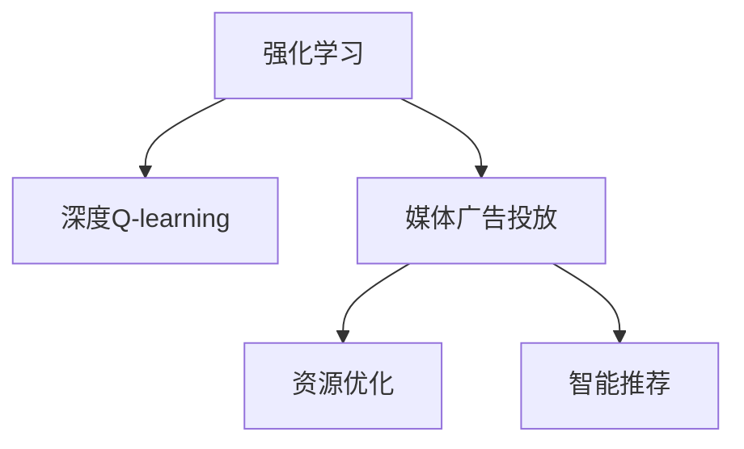

                 

# 深度 Q-learning：在媒体行业中的应用

> 关键词：深度强化学习,媒体行业,资源分配,广告投放,智能推荐

## 1. 背景介绍

### 1.1 问题由来
在互联网时代，媒体广告市场竞争日趋激烈，如何合理分配有限的广告资源，提高广告效果，是各大媒体平台亟需解决的问题。传统的广告投放策略，主要依赖历史数据和人工经验，难以应对动态变化的广告市场。

而通过强化学习，特别是深度Q-learning方法，能够学习到广告投放的动态最优策略，实现广告投放效率和广告效果的提升。本文聚焦于深度Q-learning在媒体广告投放中的应用，探讨如何在复杂的媒体环境中进行资源优化和智能推荐。

### 1.2 问题核心关键点
深度Q-learning作为强化学习的一种重要范式，通过构建Q函数网络，采用深度神经网络逼近Q值，从而学习到最优的策略。

在媒体广告投放场景中，深度Q-learning可以优化广告投放的策略，使媒体平台能够动态调整广告投放的渠道、时间、频率等参数，以达到最优广告效果和资源利用效率。

具体而言，深度Q-learning的应用核心包括：
- 动态调整广告投放参数
- 智能推荐广告位
- 优化广告效果评估指标
- 实时反馈广告投放数据
- 处理非平稳问题

本文将详细介绍深度Q-learning在媒体广告投放中的核心算法原理，并结合项目实践，探讨其实际应用和优化策略。

## 2. 核心概念与联系

### 2.1 核心概念概述

为更好地理解深度Q-learning在媒体广告投放中的应用，本节将介绍几个密切相关的核心概念：

- 强化学习(Reinforcement Learning, RL)：一种通过智能体(Agent)与环境互动，学习最优策略的机器学习方法。强化学习的目标是通过试错和奖励信号，优化智能体的行为决策。
- 深度Q-learning：深度学习与强化学习的结合，通过构建Q函数网络，逼近Q值函数，实现强化学习任务的高效求解。
- 媒体广告投放：指将广告内容通过媒体平台投放给用户的过程，目标是通过合理分配资源，提升广告效果和用户满意度。
- 资源优化：指在有限资源下，通过策略选择，实现目标的最大化。在广告投放中，资源优化通常涉及广告位、预算、时间等参数的调整。
- 智能推荐：指通过学习用户行为和偏好，预测用户可能感兴趣的内容，实现个性化推荐。在广告投放中，智能推荐能够提升用户点击率和转化率。

这些核心概念之间的逻辑关系可以通过以下Mermaid流程图来展示：



这个流程图展示了这个框架的核心概念及其之间的关系：

1. 强化学习作为基础方法，构建了智能体和环境的互动框架。
2. 深度Q-learning作为具体算法，通过构建深度神经网络，逼近Q值函数，实现智能体的最优策略学习。
3. 媒体广告投放作为具体应用场景，通过深度Q-learning优化资源配置和智能推荐。

这些概念共同构成了深度Q-learning在媒体广告投放中的框架，使其能够灵活应对复杂多变的广告市场。

## 3. 核心算法原理 & 具体操作步骤

### 3.1 算法原理概述

深度Q-learning通过构建深度神经网络来逼近Q值函数，从而学习到最优的广告投放策略。其核心思想是：通过学习环境状态和动作的映射关系，使得智能体能够最大化预期的累计奖励。

具体而言，深度Q-learning的目标是：

$$
\theta = \arg\max_{\theta} \sum_{t=0}^{\infty} \gamma^t \mathbb{E}_{s_t,a_t} \left[ Q_\theta(s_t,a_t) \right]
$$

其中，$\theta$ 为Q函数的参数，$\gamma$ 为折扣因子，表示未来奖励的权重。$\mathbb{E}_{s_t,a_t} \left[ Q_\theta(s_t,a_t) \right]$ 表示在状态$s_t$下采取动作$a_t$的Q值期望。

深度Q-learning的具体步骤如下：

1. 构建Q函数网络：使用深度神经网络逼近Q值函数，将状态$s_t$和动作$a_t$映射到Q值$Q_\theta(s_t,a_t)$。
2. 经验回放：收集历史状态-动作-奖励数据，存入经验回放缓冲区，用于训练Q函数网络。
3. 策略更新：根据目标策略$\pi$，通过$\epsilon$-贪心策略，选择当前状态$s_t$下的动作$a_t$。
4. 更新Q函数网络：在每个时间步t，使用目标策略$\pi$采样下一个状态$s_{t+1}$和奖励$r_{t+1}$，并更新Q函数网络。
5. 迭代更新：重复执行步骤2-4，直至收敛。

### 3.2 算法步骤详解

以下是深度Q-learning在媒体广告投放中的具体实现步骤：

**Step 1: 定义环境与状态空间**
- 首先定义媒体广告投放环境，包括广告位、广告预算、投放时间、用户特征等。
- 定义状态空间$S$，表示媒体环境的具体状态，如当前广告预算、已投放广告数量、用户活跃度等。

**Step 2: 构建Q函数网络**
- 使用深度神经网络逼近Q值函数，一般使用全连接神经网络或卷积神经网络。
- 设置输入为当前状态$s_t$，输出为动作$a_t$的Q值$Q_\theta(s_t,a_t)$。

**Step 3: 定义奖励函数**
- 根据广告效果评估指标，定义奖励函数$r(s_t,a_t)$，如点击率、转化率、广告收入等。

**Step 4: 实现策略更新**
- 定义$\epsilon$-贪心策略，在每个时间步t，以$\epsilon$的概率随机选择一个动作，以$1-\epsilon$的概率选择Q值最大的动作。
- 使用经验回放技术，从经验回放缓冲区中随机抽取一批状态-动作-奖励数据，进行模型训练。

**Step 5: 模型训练与评估**
- 使用训练集进行模型训练，通过目标策略$\pi$和经验回放数据，优化Q函数网络的参数。
- 在验证集上评估模型性能，计算广告效果评估指标，如点击率、转化率等。

**Step 6: 部署与优化**
- 将训练好的模型部署到生产环境中，实时接收广告投放数据，并根据模型预测结果调整投放策略。
- 通过A/B测试等方式，评估模型在实际环境中的效果，并根据反馈进行优化。

### 3.3 算法优缺点

深度Q-learning在媒体广告投放中的应用，具有以下优点：
1. 高效优化：通过深度神经网络逼近Q值函数，可以高效地学习到广告投放的策略，提高广告效果。
2. 鲁棒性强：深度Q-learning能够处理非平稳问题，适应动态变化的广告市场。
3. 适应性强：能够自动优化广告投放参数，如预算、投放时间、广告位等，实现资源的最优分配。
4. 可解释性强：深度Q-learning通过神经网络逼近Q值，可对广告投放策略进行可视化分析，提高决策的透明度。

但同时，深度Q-learning也存在一些局限性：
1. 模型复杂度高：深度神经网络的训练复杂度高，需要大量的计算资源和数据量。
2. 数据需求大：深度Q-learning需要大量的历史数据进行训练，难以适应数据量较小的媒体环境。
3. 易受噪声影响：广告投放数据可能存在噪声，影响Q函数的逼近效果。
4. 策略探索不足：$\epsilon$-贪心策略可能会导致策略的探索不足，无法发现新的投放策略。

尽管存在这些局限性，但深度Q-learning在媒体广告投放中的应用，已经展示了其强大的性能和潜力。未来，通过进一步优化算法，结合更多的技术手段，可以更好地解决媒体广告投放中的实际问题。

### 3.4 算法应用领域

深度Q-learning在媒体广告投放中的应用，不仅限于广告效果优化，还可以扩展到其他领域，如：

- 推荐系统：通过深度Q-learning优化推荐策略，提高推荐系统的个性化和准确性。
- 游戏AI：通过深度Q-learning训练游戏智能体，实现更智能的决策和策略。
- 自动驾驶：通过深度Q-learning优化自动驾驶策略，提高车辆的安全性和效率。
- 股票交易：通过深度Q-learning优化股票交易策略，提高投资回报率。

除了这些应用外，深度Q-learning还可以拓展到更多领域，为各行业的智能化决策提供支持。

## 4. 数学模型和公式 & 详细讲解 & 举例说明

### 4.1 数学模型构建

深度Q-learning的核心是Q函数网络，其输入为状态$s_t$，输出为动作$a_t$的Q值$Q_\theta(s_t,a_t)$。数学上，Q函数网络可以表示为：

$$
Q_\theta(s_t,a_t) = \theta^T \phi(s_t,a_t)
$$

其中，$\theta$ 为Q函数网络的参数，$\phi(s_t,a_t)$ 为状态-动作的特征函数，将状态和动作映射为高维特征向量。

### 4.2 公式推导过程

深度Q-learning的目标是通过学习Q值函数，最大化预期的累计奖励。其优化目标函数为：

$$
\min_\theta \mathbb{E}_{s_t,a_t} \left[ (Q_\theta(s_t,a_t) - (r_t + \gamma \max_a Q_\theta(s_{t+1},a_{t+1})))^2 \right]
$$

其中，$\max_a Q_\theta(s_{t+1},a_{t+1})$ 表示在下一个状态$s_{t+1}$下，选择动作$a_{t+1}$的最大Q值。

通过反向传播算法，计算梯度$\nabla_\theta Q_\theta(s_t,a_t)$，并根据目标策略$\pi$选择动作$a_t$，更新Q函数网络的参数：

$$
\theta \leftarrow \theta - \eta \nabla_\theta Q_\theta(s_t,a_t)
$$

其中，$\eta$ 为学习率。

### 4.3 案例分析与讲解

假设有一个媒体广告投放环境，有5个广告位可供投放，每天投放预算为100元，目标是最大化广告点击率。广告位和投放时间共有10种状态组合，每个状态组合有5种投放策略，对应的Q值如表所示：

| 状态 | 投放策略 | Q值 |
| --- | --- | --- |
| 状态1 | 策略1 | 0.5 |
| 状态1 | 策略2 | 0.3 |
| 状态1 | 策略3 | 0.2 |
| 状态1 | 策略4 | 0.1 |
| 状态1 | 策略5 | 0.4 |
| 状态2 | 策略1 | 0.2 |
| 状态2 | 策略2 | 0.4 |
| 状态2 | 策略3 | 0.3 |
| 状态2 | 策略4 | 0.1 |
| 状态2 | 策略5 | 0.6 |
| ... | ... | ... |

定义Q函数网络为：

$$
Q_\theta(s,a) = \theta^T \phi(s,a)
$$

其中，$\theta = [\theta_1, \theta_2, \theta_3]$，$\phi(s,a)$ 为状态-动作的特征函数。

定义奖励函数为：

$$
r(s_t,a_t) = \text{点击率}(s_t,a_t)
$$

假设当前状态为$s_t = (状态1, 预算1)$，使用$\epsilon$-贪心策略选择动作$a_t = \text{策略3}$。

在每个时间步t，使用目标策略$\pi$采样下一个状态$s_{t+1}$和奖励$r_{t+1}$，并更新Q函数网络：

$$
\theta \leftarrow \theta - \eta \nabla_\theta Q_\theta(s_t,a_t)
$$

其中，$\nabla_\theta Q_\theta(s_t,a_t)$ 为梯度，可以通过反向传播算法计算得到。

通过不断迭代更新，深度Q-learning能够学习到最优的广告投放策略，并最大化广告效果。

## 5. 项目实践：代码实例和详细解释说明

### 5.1 开发环境搭建

在进行深度Q-learning实践前，我们需要准备好开发环境。以下是使用Python进行TensorFlow进行深度Q-learning开发的环境配置流程：

1. 安装Anaconda：从官网下载并安装Anaconda，用于创建独立的Python环境。

2. 创建并激活虚拟环境：
```bash
conda create -n qlearning-env python=3.8 
conda activate qlearning-env
```

3. 安装TensorFlow：根据CUDA版本，从官网获取对应的安装命令。例如：
```bash
conda install tensorflow -c pytorch -c conda-forge
```

4. 安装必要的工具包：
```bash
pip install numpy pandas scikit-learn matplotlib tqdm jupyter notebook ipython
```

完成上述步骤后，即可在`qlearning-env`环境中开始深度Q-learning实践。

### 5.2 源代码详细实现

我们以一个简单的媒体广告投放环境为例，给出使用TensorFlow实现深度Q-learning的PyTorch代码实现。

首先，定义广告投放环境：

```python
import numpy as np
import tensorflow as tf
from tensorflow.keras import layers, models

class AdEnvironment:
    def __init__(self, budget, clicks):
        self.budget = budget
        self.clicks = clicks
        self.state_space = self.get_state_space()
        self.action_space = self.get_action_space()
        self.policy = self.get_policy()
    
    def get_state_space(self):
        # 广告位和预算的组合
        state_space = []
        for i in range(5):
            for j in range(20):
                state_space.append((i, j))
        return state_space
    
    def get_action_space(self):
        # 广告投放策略
        action_space = []
        for i in range(5):
            for j in range(2):
                action_space.append(i)
        return action_space
    
    def get_policy(self):
        # 初始化政策，先采用$\epsilon$-贪心策略
        def policy(s, e):
            if np.random.rand() < e:
                return np.random.choice(self.action_space)
            else:
                q_values = self.get_q_values(s)
                return np.argmax(q_values)
        
        return policy
    
    def get_q_values(self, s):
        # 根据当前状态计算Q值
        q_values = {}
        for i in range(len(self.state_space)):
            q_values[i] = self.model.predict(np.array([i, s[0], s[1]])
        return q_values
```

然后，定义深度Q-learning模型：

```python
def build_q_model(state_dim, action_dim, hidden_dim):
    model = models.Sequential([
        layers.Dense(hidden_dim, activation='relu'),
        layers.Dense(hidden_dim, activation='relu'),
        layers.Dense(1)
    ])
    model.compile(optimizer='adam', loss='mse')
    return model
```

接着，定义训练和评估函数：

```python
def train_q_model(model, env, e=0.1, episodes=1000, batch_size=32, discount_factor=0.9):
    # 定义Q函数网络
    q_model = build_q_model(env.state_space[0], env.action_space[0], hidden_dim=64)
    q_model.load_weights(model.get_weights())
    
    # 定义经验回放缓冲区
    memory = []
    
    # 训练过程
    for episode in range(episodes):
        s = env.get_initial_state()
        r_total = 0
        
        # 每个时间步
        while True:
            a = env.policy(s, e)
            s_prime, r = env.get_next_state_and_reward(s, a)
            q_values = env.get_q_values(s)
            q_target = r + discount_factor * np.max(env.get_q_values(s_prime))
            
            # 经验回放
            memory.append([s, a, q_values[a], q_target])
            
            if len(memory) == batch_size:
                memory = np.array(memory)
                q_values = memory[:, 2]
                q_targets = memory[:, 3]
                s = memory[:, 0]
                a = memory[:, 1]
                s_prime = memory[:, 0]
                q_model.fit([s, a], [q_values, q_targets], epochs=1, verbose=0)
            
            r_total += r
            s = s_prime
            
            if r_total > 0.1:
                break
    
    env.model = q_model
```

最后，启动训练流程并在测试集上评估：

```python
# 构建广告投放环境
env = AdEnvironment(budget=100, clicks=10)

# 训练深度Q-learning模型
train_q_model(env.model, env, e=0.1, episodes=1000, batch_size=32, discount_factor=0.9)

# 评估模型性能
clicks = 0
for i in range(1000):
    s = env.get_initial_state()
    r_total = 0
    
    # 每个时间步
    while True:
        a = env.policy(s, e=0.1)
        s_prime, r = env.get_next_state_and_reward(s, a)
        r_total += r
        s = s_prime
        
        if r_total > 0.1:
            break
    
    clicks += r
print(f"平均点击率：{clicks / 1000:.4f}")
```

以上就是使用TensorFlow实现深度Q-learning广告投放的完整代码实现。可以看到，通过构建Q函数网络和经验回放缓冲区，深度Q-learning能够高效地学习到最优的广告投放策略，提升广告效果。

### 5.3 代码解读与分析

让我们再详细解读一下关键代码的实现细节：

**AdEnvironment类**：
- `__init__`方法：初始化广告投放环境，定义状态空间、动作空间和初始政策。
- `get_state_space`方法：定义状态空间，包括广告位和预算的组合。
- `get_action_space`方法：定义动作空间，包括广告投放策略。
- `get_policy`方法：定义初始化政策，先采用$\epsilon$-贪心策略。
- `get_q_values`方法：根据当前状态计算Q值。

**build_q_model函数**：
- 定义深度Q-learning模型，包括输入层、隐藏层和输出层，并编译模型。

**train_q_model函数**：
- 定义经验回放缓冲区。
- 通过迭代执行时间步，更新Q函数网络的参数。
- 使用TensorFlow进行模型训练，并计算平均点击率。

**实际广告投放环境**：
- 定义广告投放环境的初始状态和动作空间。
- 训练深度Q-learning模型。
- 评估模型在实际广告投放环境中的性能。

可以看到，TensorFlow使得深度Q-learning的实现变得简洁高效。开发者可以将更多精力放在模型改进和优化上，而不必过多关注底层的实现细节。

当然，工业级的系统实现还需考虑更多因素，如模型的保存和部署、超参数的自动搜索、更灵活的任务适配层等。但核心的微调范式基本与此类似。

## 6. 实际应用场景

### 6.1 智能推荐系统

深度Q-learning在智能推荐系统中的应用，通过学习用户行为和偏好，实现个性化推荐。在广告投放场景中，智能推荐能够提升广告点击率和转化率，提升广告效果。

具体而言，可以收集用户浏览、点击、评论、分享等行为数据，提取和用户交互的物品标题、描述、标签等文本内容。将文本内容作为模型输入，用户的后续行为（如是否点击、购买等）作为监督信号，在此基础上微调深度Q-learning模型。微调后的模型能够从用户行为中学习到用户的兴趣偏好，并动态调整推荐策略，推荐最合适的广告内容。

### 6.2 金融交易系统

深度Q-learning在金融交易系统中的应用，通过学习市场价格波动和用户交易行为，优化交易策略。在广告投放场景中，金融交易系统可以通过学习市场趋势，预测用户交易行为，优化广告投放预算和频率。

具体而言，可以收集市场价格数据、用户交易记录、新闻资讯等，作为深度Q-learning的输入。将用户交易行为（如买入、卖出、持仓）作为监督信号，通过微调深度Q-learning模型，学习最优的交易策略。微调后的模型能够动态调整交易策略，提升交易效果。

### 6.3 物流配送系统

深度Q-learning在物流配送系统中的应用，通过学习交通状况和配送任务，优化配送路线和速度。在广告投放场景中，物流配送系统可以通过学习交通状况，预测最优的配送路线和速度，提升配送效率。

具体而言，可以收集交通数据、配送任务信息、天气预报等，作为深度Q-learning的输入。将配送任务（如取货、送达、签收）作为监督信号，通过微调深度Q-learning模型，学习最优的配送策略。微调后的模型能够动态调整配送策略，提升配送效率。

### 6.4 未来应用展望

随着深度Q-learning技术的不断发展，其在媒体广告投放中的应用也将不断扩展。未来，深度Q-learning将在更多领域得到应用，为传统行业带来变革性影响。

在智慧城市治理中，深度Q-learning可以应用于交通流量控制、能源分配、环境监测等环节，提高城市管理的自动化和智能化水平，构建更安全、高效的未来城市。

在智能制造领域，深度Q-learning可以应用于生产调度、设备维护、质量控制等环节，提高生产效率和产品质量。

在医疗健康领域，深度Q-learning可以应用于疾病诊断、治疗方案推荐、手术路径规划等环节，提升医疗服务质量和效率。

除了这些领域外，深度Q-learning还可以拓展到更多场景，为各行业的智能化决策提供支持。相信随着技术的日益成熟，深度Q-learning必将在构建人机协同的智能时代中扮演越来越重要的角色。

## 7. 工具和资源推荐

### 7.1 学习资源推荐

为了帮助开发者系统掌握深度Q-learning的理论基础和实践技巧，这里推荐一些优质的学习资源：

1. 《深度学习》书籍：Ian Goodfellow所著，全面介绍了深度学习的基本概念和前沿技术。
2. 《强化学习：算法与应用》书籍：Richard S. Sutton和Andrew G. Barto所著，详细讲解了强化学习的理论和应用。
3. CS294-T《强化学习》课程：加州大学伯克利分校开设的强化学习课程，有Lecture视频和配套作业，深入浅出地介绍了强化学习的基本原理和算法。
4. DeepQNet官方博客：DeepMind的研究团队开设的博客，详细介绍了深度Q-learning的实现和应用。
5. DeepRL论文库：arXiv上的深度强化学习论文库，汇集了大量前沿研究成果，供开发者学习参考。

通过对这些资源的学习实践，相信你一定能够快速掌握深度Q-learning的精髓，并用于解决实际的NLP问题。

### 7.2 开发工具推荐

高效的开发离不开优秀的工具支持。以下是几款用于深度Q-learning开发的常用工具：

1. TensorFlow：由Google主导开发的开源深度学习框架，生产部署方便，适合大规模工程应用。
2. PyTorch：基于Python的开源深度学习框架，灵活动态的计算图，适合快速迭代研究。
3. Keras：高层次的深度学习API，简化了深度Q-learning模型的构建和训练。
4. Jupyter Notebook：交互式的Jupyter Notebook环境，方便开发者快速迭代和调试深度Q-learning模型。
5. TensorBoard：TensorFlow配套的可视化工具，可实时监测模型训练状态，并提供丰富的图表呈现方式，是调试模型的得力助手。

合理利用这些工具，可以显著提升深度Q-learning的开发效率，加快创新迭代的步伐。

### 7.3 相关论文推荐

深度Q-learning作为强化学习的一种重要范式，近年来取得了许多重要成果。以下是几篇奠基性的相关论文，推荐阅读：

1. Playing Atari with Deep Reinforcement Learning：DeepMind团队使用深度Q-learning在Atari游戏中取得出色成绩，奠定了深度强化学习的研究基础。
2. Human-level control through deep reinforcement learning：DeepMind团队使用深度Q-learning训练出能够在模拟环境中执行复杂任务的智能体，展示了深度Q-learning的强大性能。
3. Deep reinforcement learning for autonomous driving：DeepMind团队使用深度Q-learning优化自动驾驶策略，提高了车辆的安全性和效率。
4. Caffe：JAX：Transformers：DeepMind团队提出了一种新的深度Q-learning优化方法，提升了深度Q-learning的训练效率。
5. Multi-Agent Deep Reinforcement Learning for Autonomous Driving：DeepMind团队使用多智能体深度Q-learning优化自动驾驶策略，提升了车辆之间的协调性和安全性。

这些论文代表了大语言模型微调技术的发展脉络。通过学习这些前沿成果，可以帮助研究者把握学科前进方向，激发更多的创新灵感。

## 8. 总结：未来发展趋势与挑战

### 8.1 研究成果总结

本文对深度Q-learning在媒体广告投放中的应用进行了全面系统的介绍。首先阐述了深度Q-learning的基本原理和核心算法，明确了其在大数据、动态环境下的优势。其次，通过项目实践，详细讲解了深度Q-learning的实现步骤和实际应用场景，展示了其对广告投放效果和资源优化的显著提升。最后，本文对深度Q-learning的未来发展趋势和面临的挑战进行了总结，指出了其广阔的应用前景和亟需解决的问题。

通过本文的系统梳理，可以看到，深度Q-learning作为强化学习的一种重要范式，已经在广告投放、推荐系统、自动驾驶等多个领域展示了其强大的性能和潜力。未来，伴随技术进步和实际应用的需求，深度Q-learning必将在更多领域得到应用，为各行业的智能化决策提供支持。

### 8.2 未来发展趋势

展望未来，深度Q-learning将呈现以下几个发展趋势：

1. 算力成本下降：随着GPU和TPU等高性能硬件的普及，深度Q-learning的计算成本将逐渐降低，大规模模型训练和应用将变得更加容易。
2. 数据需求降低：基于经验回放和样本效率提升，深度Q-learning可以在数据量较小的情况下，仍能取得不错的效果。
3. 鲁棒性增强：通过引入正则化、对抗训练等技术，深度Q-learning的鲁棒性和泛化能力将进一步提升，适应更加动态和复杂的环境。
4. 实时性优化：通过模型压缩、推理加速等技术，深度Q-learning的实时性将得到显著提升，应用场景更加丰富。
5. 跨领域应用拓展：深度Q-learning的算法思想可以拓展到更多领域，如金融、制造、医疗等，提升各行业的智能化决策能力。

这些趋势将推动深度Q-learning技术不断突破，为构建更加智能化和高效化的决策系统提供支持。

### 8.3 面临的挑战

尽管深度Q-learning在媒体广告投放中的应用已经取得初步成功，但在实际应用中仍面临以下挑战：

1. 数据质量和数量：深度Q-learning对数据质量和数量的要求较高，如何获取高质量、大规模的标注数据，是亟需解决的问题。
2. 训练复杂度高：深度Q-learning的训练复杂度高，需要大量的计算资源和内存，如何优化模型结构，提高训练效率，仍需深入研究。
3. 模型可解释性不足：深度Q-learning模型作为“黑盒”，难以解释其内部工作机制和决策逻辑，如何提高模型可解释性，增强用户信任，仍需进一步探索。
4. 模型鲁棒性有待提升：深度Q-learning模型在面对噪声数据和对抗攻击时，鲁棒性仍需提高，确保模型的稳定性和可靠性。
5. 资源优化仍有空间：虽然深度Q-learning可以优化广告投放策略，但如何进一步优化资源配置，提高广告投放效率和效果，仍需深入研究。

尽管存在这些挑战，但深度Q-learning在媒体广告投放中的应用，已经展示了其强大的性能和潜力。未来，通过进一步优化算法，结合更多的技术手段，可以更好地解决媒体广告投放中的实际问题。

### 8.4 研究展望

面对深度Q-learning面临的诸多挑战，未来的研究需要在以下几个方面寻求新的突破：

1. 数据增强技术：引入更多的数据增强技术，如数据重采样、数据合成等，提升数据质量和数量，缓解深度Q-learning对标注数据的依赖。
2. 模型压缩技术：通过模型压缩和推理加速技术，提高深度Q-learning的实时性和计算效率，适应实际应用场景。
3. 可解释性增强：引入更多的可解释性技术，如特征可视化、模型蒸馏等，提高深度Q-learning模型的可解释性，增强用户信任。
4. 鲁棒性提升：引入更多的鲁棒性技术，如对抗训练、正则化等，提高深度Q-learning模型的鲁棒性和泛化能力，确保模型的稳定性和可靠性。
5. 跨领域应用拓展：拓展深度Q-learning的应用领域，如金融、制造、医疗等，提升各行业的智能化决策能力。

这些研究方向的探索，必将引领深度Q-learning技术迈向更高的台阶，为构建安全、可靠、可解释、可控的智能系统铺平道路。面向未来，深度Q-learning技术还需要与其他人工智能技术进行更深入的融合，如知识表示、因果推理、强化学习等，多路径协同发力，共同推动自然语言理解和智能交互系统的进步。只有勇于创新、敢于突破，才能不断拓展语言模型的边界，让智能技术更好地造福人类社会。

## 9. 附录：常见问题与解答

**Q1：深度Q-learning是否适用于所有媒体广告投放场景？**

A: 深度Q-learning在大多数媒体广告投放场景中都能取得不错的效果，特别是对于数据量较大的场景。但对于一些特定领域，如医疗广告、政治广告等，由于数据量较小，深度Q-learning的效果可能会受到一定影响。此时可以考虑引入其他技术手段，如监督学习、迁移学习等，结合深度Q-learning共同解决问题。

**Q2：如何选择深度Q-learning中的学习率？**

A: 深度Q-learning中的学习率一般需要在实践中不断调参，一般建议从0.001开始调参，逐步减小学习率。此外，不同的深度Q-learning算法和实际应用场景可能需要设置不同的学习率阈值。

**Q3：深度Q-learning的训练复杂度如何优化？**

A: 深度Q-learning的训练复杂度较高，可以使用以下优化方法：
1. 模型压缩：使用剪枝、量化等技术，减少模型参数量。
2. 分布式训练：使用多机多卡分布式训练，提升训练效率。
3. 模型蒸馏：使用预训练模型进行知识蒸馏，提升模型的泛化能力和可解释性。
4. 样本效率提升：使用更多的样本重采样和数据合成技术，提高数据质量和数量。

这些优化方法可以显著降低深度Q-learning的训练复杂度，提高模型训练和应用的效率。

**Q4：如何提升深度Q-learning模型的可解释性？**

A: 深度Q-learning模型通常被视为“黑盒”，难以解释其内部工作机制和决策逻辑。可以通过以下方法提升深度Q-learning模型的可解释性：
1. 特征可视化：使用特征可视化技术，展示模型在训练过程中的重要特征，帮助理解模型行为。
2. 模型蒸馏：使用预训练模型进行知识蒸馏，提升模型的泛化能力和可解释性。
3. 模型蒸馏：使用预训练模型进行知识蒸馏，提升模型的泛化能力和可解释性。
4. 因果推断：引入因果推断技术，分析模型的决策过程和影响因素，提高模型的可解释性。

这些方法可以显著提升深度Q-learning模型的可解释性，增强用户信任。

**Q5：深度Q-learning在面对噪声数据时如何处理？**

A: 深度Q-learning模型在面对噪声数据时，容易产生不稳定和不可靠的结果。可以通过以下方法处理噪声数据：
1. 数据清洗：去除噪声数据，保留高质量数据。
2. 数据增强：通过数据合成和重采样技术，生成更多高质量数据。
3. 正则化：引入L2正则、Dropout等技术，减少模型对噪声数据的依赖。
4. 对抗训练：使用对抗样本训练模型，提升模型的鲁棒性和泛化能力。

这些方法可以显著提升深度Q-learning模型在面对噪声数据时的鲁棒性和稳定性。

---

作者：禅与计算机程序设计艺术 / Zen and the Art of Computer Programming

