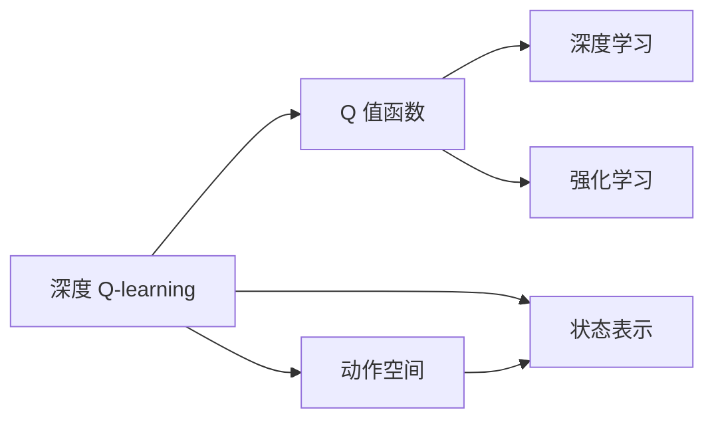

                 

## 1. 背景介绍

### 1.1 问题由来

深度 Q-learning 是一种在强化学习领域中用于解决连续动作空间问题的方法。它结合了深度学习和强化学习的优势，通过构建神经网络来近似 Q 值函数，从而实现对复杂环境的学习和优化。深度 Q-learning 的出现，使得强化学习在许多复杂环境中取得了显著的进展，例如在机器人控制、游戏 AI、自动驾驶等领域。

### 1.2 问题核心关键点

深度 Q-learning 的核心关键点在于：
1. 如何构建神经网络近似 Q 值函数。
2. 如何高效地进行环境建模和优化。
3. 如何平衡探索与利用的策略。
4. 如何处理状态表示和动作空间问题。

深度 Q-learning 通过使用深度神经网络，能够自动学习复杂的特征表示，从而更有效地处理高维连续动作空间和环境建模问题。然而，它的训练复杂度较高，且需要大量数据和计算资源。

## 2. 核心概念与联系

### 2.1 核心概念概述

为了更好地理解深度 Q-learning，本节将介绍几个关键概念：

- 深度 Q-learning (DQN)：一种结合深度学习和强化学习的算法，通过构建神经网络来近似 Q 值函数，从而实现对复杂环境的学习和优化。
- Q 值函数：在强化学习中，Q 值函数用于评估在给定状态下采取某一动作的价值，即 Q(s,a) = r + γ * max Q(s',a')。
- 动作空间：在强化学习中，一个动作空间定义了所有可行的动作。对于连续动作空间，通常使用神经网络来编码动作。
- 状态表示：在深度 Q-learning 中，状态表示是通过神经网络自动学习得到的，它可以高效地捕捉环境的复杂特征。
- 深度学习：一种通过多层神经网络来学习和表示数据的方法，能够自动发现数据中的高阶特征。
- 强化学习：一种学习方式，通过与环境互动，优化策略以最大化奖励。

这些核心概念之间的逻辑关系可以通过以下 Mermaid 流程图来展示：



这个流程图展示了大模型微调的几个核心概念及其之间的关系：

1. 深度 Q-learning 将 Q 值函数近似为深度神经网络。
2. Q 值函数是强化学习中的核心概念，用于评估状态和动作的价值。
3. 动作空间和状态表示是深度 Q-learning 中两个重要的组成部分。
4. 深度学习和强化学习是深度 Q-learning 的两个基础组件，共同构成了算法的核心。

这些概念共同构成了深度 Q-learning 的完整框架，使其能够在各种环境中实现对复杂问题的优化。

## 3. 核心算法原理 & 具体操作步骤
### 3.1 算法原理概述

深度 Q-learning 的原理是通过构建深度神经网络来近似 Q 值函数。具体而言，对于每个状态 $s$ 和动作 $a$，计算其 Q 值 $Q(s,a)$，然后通过反向传播算法更新神经网络参数，使得 Q 值函数的估计值尽可能接近真实 Q 值。

深度 Q-learning 的训练过程包括以下几个步骤：

1. 从环境中随机选择一个状态 $s_t$，并随机选择一个动作 $a_t$。
2. 根据动作 $a_t$ 执行环境操作，获得下一状态 $s_{t+1}$ 和奖励 $r_{t+1}$。
3. 使用深度神经网络计算 Q 值 $Q(s_t,a_t)$ 和 $Q(s_{t+1},a_{t+1})$，并通过 Bellman 方程 $Q(s_t,a_t) = r_t + \gamma \max Q(s_{t+1},a_{t+1})$ 更新神经网络参数。
4. 使用经验回放 (Experience Replay) 技术，将历史经验数据存储在经验池 (Experience Pool) 中，并通过随机抽样来更新模型参数。

### 3.2 算法步骤详解

以下是深度 Q-learning 的具体操作步骤：

1. **环境初始化**：首先，需要对环境进行初始化，包括状态空间、动作空间、奖励函数等。在深度 Q-learning 中，通常使用深度神经网络来表示状态和动作，状态空间可以是连续的，如像素值、声音信号等。

2. **策略选择**：在每个时间步 $t$，根据当前的神经网络输出，选择动作 $a_t$。由于动作空间可能是连续的，通常使用随机策略或参数化策略来选择一个动作。

3. **环境交互**：根据选择的动作 $a_t$ 执行环境操作，获得下一个状态 $s_{t+1}$ 和奖励 $r_{t+1}$。在深度 Q-learning 中，通常使用深度神经网络来预测状态转移和奖励。

4. **状态更新**：根据新的状态 $s_{t+1}$ 和动作 $a_{t+1}$，使用 Bellman 方程 $Q(s_t,a_t) = r_t + \gamma \max Q(s_{t+1},a_{t+1})$ 更新神经网络参数。这个更新过程可以使用梯度下降等优化算法。

5. **经验回放**：将历史经验数据存储在经验池中，并通过随机抽样来更新神经网络参数。这可以避免过度拟合，提高模型的泛化能力。

6. **模型训练**：使用训练数据集对神经网络进行训练，优化其参数。训练数据集可以从经验池中随机抽取。

### 3.3 算法优缺点

深度 Q-learning 具有以下优点：

1. 能够处理高维连续动作空间和复杂环境建模问题。
2. 通过神经网络自动学习特征表示，具有较强的泛化能力。
3. 可以并行计算，提高训练效率。

然而，深度 Q-learning 也存在一些缺点：

1. 训练复杂度高，需要大量计算资源和数据。
2. 可能出现过度拟合现象，需要设计有效的经验回放机制。
3. 可能陷入局部最优解，需要采用一些优化策略，如层级策略、信任区域策略等。

### 3.4 算法应用领域

深度 Q-learning 已经在多个领域得到了广泛应用，例如：

- 机器人控制：在机器人的路径规划、抓取等任务中，深度 Q-learning 可以用于优化动作策略。
- 游戏 AI：在复杂游戏中，深度 Q-learning 可以用于优化游戏策略，如 AlphaGo。
- 自动驾驶：在自动驾驶中，深度 Q-learning 可以用于优化决策策略，如车道保持、交通信号识别等。
- 金融交易：在金融交易中，深度 Q-learning 可以用于优化投资策略，如股票交易、风险控制等。

深度 Q-learning 的这些应用领域，展示了其在解决复杂决策问题上的强大能力。

## 4. 数学模型和公式 & 详细讲解 & 举例说明

### 4.1 数学模型构建

深度 Q-learning 的数学模型基于 Q 值函数，其形式为 $Q(s,a)$。在每个时间步 $t$，状态 $s_t$ 和动作 $a_t$ 对应的 Q 值可以通过神经网络进行估计。具体而言，深度 Q-learning 的目标是最大化期望的累积奖励，即：

$$
\max_{\theta} \mathbb{E}_{s,a \sim \pi} [\sum_{t=0}^{\infty} \gamma^t Q(s_t, a_t)]
$$

其中，$\pi$ 表示策略，$\gamma$ 表示折扣因子。

### 4.2 公式推导过程

深度 Q-learning 的训练过程可以通过 Bellman 方程进行推导。Bellman 方程是一个递推式方程，用于计算 Q 值函数的值：

$$
Q(s_t, a_t) = r_t + \gamma \max_{a'} Q(s_{t+1}, a')
$$

将 Bellman 方程应用到深度 Q-learning 中，可以得到：

$$
Q(s_t, a_t) = r_t + \gamma \max_a Q(s_{t+1}, a)
$$

其中，$r_t$ 表示时间步 $t$ 的奖励，$Q(s_{t+1}, a)$ 表示下一个状态 $s_{t+1}$ 和动作 $a$ 对应的 Q 值。

### 4.3 案例分析与讲解

以机器人控制任务为例，假设机器人需要在一个迷宫中寻找出口。状态 $s_t$ 可以表示为迷宫中的位置和方向，动作 $a_t$ 可以表示为移动方向和速度。

1. **环境初始化**：首先，需要对迷宫进行建模，并将其表示为状态和动作空间。状态空间可以是连续的，如机器人在迷宫中的坐标和方向。动作空间可以是离散的，如机器人可以向上、下、左、右移动，或者保持当前位置。

2. **策略选择**：在每个时间步 $t$，根据当前的神经网络输出，选择一个动作 $a_t$。由于动作空间是连续的，通常使用随机策略或者参数化策略来选择动作。

3. **环境交互**：根据选择的动作 $a_t$ 执行环境操作，获得下一个状态 $s_{t+1}$ 和奖励 $r_{t+1}$。在这个例子中，机器人会移动到一个新的位置，并获得一个奖励。

4. **状态更新**：根据新的状态 $s_{t+1}$ 和动作 $a_{t+1}$，使用 Bellman 方程更新神经网络参数。神经网络将根据新的状态和动作，计算 Q 值，并将其与真实 Q 值进行比较，通过反向传播算法更新神经网络参数。

5. **经验回放**：将历史经验数据存储在经验池中，并通过随机抽样来更新神经网络参数。这可以避免过度拟合，提高模型的泛化能力。

6. **模型训练**：使用训练数据集对神经网络进行训练，优化其参数。训练数据集可以从经验池中随机抽取。

通过以上步骤，深度 Q-learning 可以在机器人控制任务中不断优化策略，最终找到迷宫的出口。

## 5. 项目实践：代码实例和详细解释说明

### 5.1 开发环境搭建

在进行深度 Q-learning 实践前，我们需要准备好开发环境。以下是使用 Python 进行 TensorFlow 开发的环境配置流程：

1. 安装 Anaconda：从官网下载并安装 Anaconda，用于创建独立的 Python 环境。

2. 创建并激活虚拟环境：
```bash
conda create -n dqntf python=3.8 
conda activate dqntf
```

3. 安装 TensorFlow：从官网获取对应的安装命令，例如：
```bash
pip install tensorflow==2.6.0
```

4. 安装其他必要的工具包：
```bash
pip install gym numpy matplotlib scikit-learn
```

完成上述步骤后，即可在 `dqntf` 环境中开始深度 Q-learning 的实践。

### 5.2 源代码详细实现

这里我们以机器人控制任务为例，给出使用 TensorFlow 实现深度 Q-learning 的完整代码。

首先，定义环境、状态和动作：

```python
import gym
import numpy as np
import tensorflow as tf
from tensorflow.keras import layers, optimizers, models

# 定义环境
env = gym.make('MountainCar-v0')

# 定义状态
state_dim = env.observation_space.shape[0]

# 定义动作
action_dim = env.action_space.n
```

然后，定义神经网络：

```python
# 定义输入层
input_layer = layers.Input(shape=(state_dim,))

# 定义隐藏层
hidden_layer = layers.Dense(256, activation='relu')(input_layer)

# 定义输出层
output_layer = layers.Dense(action_dim, activation='linear')(hidden_layer)

# 定义模型
model = models.Model(inputs=input_layer, outputs=output_layer)
```

接下来，定义 Q 值函数：

```python
# 定义 Q 值函数
def q_values(state, model):
    state = np.expand_dims(state, axis=0)
    return model.predict(state)

# 定义损失函数
def q_loss(state, action, q_values, reward, next_state, model, target_q):
    q = q_values(state, model)
    q_target = reward + gamma * np.max(q_values(next_state, model))
    target = tf.keras.losses.mean_squared_error(target_q, q)
    return target

# 定义优化器
optimizer = optimizers.Adam(learning_rate=0.001)
```

然后，定义训练函数：

```python
# 定义训练函数
def train(model, env, gamma=0.99, epsilon=0.1, batch_size=32, epochs=10000):
    # 定义状态、动作、奖励和下一状态的存储列表
    state_buffer, action_buffer, reward_buffer, next_state_buffer = [], [], [], []

    # 训练循环
    for episode in range(epochs):
        # 重置环境
        state = env.reset()

        # 探索-利用平衡
        while True:
            # 根据策略选择动作
            if np.random.rand() < epsilon:
                action = env.action_space.sample()
            else:
                action = np.argmax(q_values(state, model))

            # 执行环境操作，获得下一个状态和奖励
            next_state, reward, done, _ = env.step(action)

            # 存储经验
            state_buffer.append(state)
            action_buffer.append(action)
            reward_buffer.append(reward)
            next_state_buffer.append(next_state)

            # 记录训练数据
            if done or len(state_buffer) >= batch_size:
                # 从存储列表中抽取经验数据
                state = np.array(state_buffer)
                action = np.array(action_buffer)
                reward = np.array(reward_buffer)
                next_state = np.array(next_state_buffer)

                # 计算 Q 值
                q_values = q_values(state, model)
                q_target = reward + gamma * np.max(q_values, axis=1)

                # 计算损失
                loss = q_loss(state, action, q_values, reward, next_state, model, q_target)

                # 更新模型参数
                optimizer.minimize(loss, model.trainable_variables)

                # 清空存储列表
                state_buffer = []
                action_buffer = []
                reward_buffer = []
                next_state_buffer = []

                # 更新折扣因子
                gamma = 0.95

                # 重置环境
                state = env.reset()

                # 探索-利用平衡
                if np.random.rand() < epsilon:
                    epsilon -= epsilon / epochs
```

最后，启动训练流程并在测试环境中评估：

```python
# 启动训练
train(model, env)

# 评估模型
while True:
    # 重置环境
    state = env.reset()

    # 执行动作
    done = False
    while not done:
        action = np.argmax(q_values(state, model))
        next_state, reward, done, _ = env.step(action)
        state = next_state
```

以上就是使用 TensorFlow 实现深度 Q-learning 的完整代码实现。可以看到，通过构建深度神经网络来近似 Q 值函数，并结合经验回放和探索-利用平衡策略，可以高效地对复杂环境进行学习和优化。

### 5.3 代码解读与分析

让我们再详细解读一下关键代码的实现细节：

1. **环境初始化**：使用 gym 库定义了一个 MountainCar-v0 环境，这是一个经典的机器人控制任务，目标是将机器人从山底推到山顶。通过环境初始化，定义了状态和动作空间。

2. **神经网络构建**：定义了一个包含一个输入层、一个隐藏层和一个输出层的深度神经网络模型。输入层和输出层的维度分别为状态空间和动作空间的大小，隐藏层的维度为 256。

3. **Q 值函数定义**：定义了一个 Q 值函数，用于计算给定状态和动作的 Q 值。通过调用模型的 predict 方法，得到输入状态的 Q 值。

4. **损失函数定义**：定义了一个损失函数，用于计算模型的 Q 值与目标 Q 值之间的差异。目标 Q 值是通过 Bellman 方程计算得到的。

5. **优化器定义**：使用 Adam 优化器来更新神经网络参数。学习率为 0.001。

6. **训练函数实现**：在训练函数中，首先定义了四个存储列表，用于存储状态、动作、奖励和下一状态。在每个时间步中，根据策略选择动作，并执行环境操作，将经验和损失存储在缓冲区中。在缓冲区满或环境结束时，计算 Q 值和目标 Q 值，计算损失，并使用优化器更新模型参数。

7. **模型评估**：在评估模型时，使用模型选择动作，并执行环境操作，直到环境结束。

通过以上代码实现，可以有效地使用深度 Q-learning 解决机器人控制任务。

## 6. 实际应用场景

### 6.1 智能控制

深度 Q-learning 可以应用于各种智能控制场景，例如机器人、无人机、自动驾驶等。在这些场景中，智能体需要根据环境状态选择最优的动作，以最大化长期奖励。通过深度 Q-learning，智能体可以学习到最优的动作策略，从而实现复杂的控制任务。

### 6.2 游戏 AI

深度 Q-learning 在游戏 AI 中也有广泛应用。例如 AlphaGo 就是一个基于深度 Q-learning 的围棋 AI。通过深度 Q-learning，AlphaGo 可以学习到围棋的复杂策略，并在与人类对战中取得胜利。

### 6.3 金融交易

深度 Q-learning 也可以应用于金融交易领域。例如，可以使用深度 Q-learning 来优化股票交易策略，最大化投资回报率。通过深度 Q-learning，智能体可以学习到最优的交易策略，并根据市场变化进行调整。

### 6.4 未来应用展望

随着深度 Q-learning 技术的不断进步，未来在更多领域中将会得到应用，为智能系统的开发和部署提供新的思路。

## 7. 工具和资源推荐

### 7.1 学习资源推荐

为了帮助开发者系统掌握深度 Q-learning 的理论基础和实践技巧，这里推荐一些优质的学习资源：

1. Deep Q-learning：一本由 Ian Goodfellow 撰写的书籍，详细介绍了深度 Q-learning 的理论基础和应用实例。

2. Deep Q-learning in Action：一本由 Julian Schmid.de 撰写的书籍，提供了深度 Q-learning 的实践指南和案例分析。

3. CS231n：斯坦福大学开设的深度学习课程，详细介绍了深度 Q-learning 的原理和应用。

4. Coursera：提供了一系列深度学习和强化学习的课程，涵盖了深度 Q-learning 的各个方面。

5. ArXiv：一个学术论文库，包含大量深度 Q-learning 的研究论文，可以帮助开发者了解最新的研究成果。

通过对这些资源的学习实践，相信你一定能够快速掌握深度 Q-learning 的精髓，并用于解决实际的强化学习问题。

### 7.2 开发工具推荐

高效的开发离不开优秀的工具支持。以下是几款用于深度 Q-learning 开发的常用工具：

1. TensorFlow：由 Google 主导开发的开源深度学习框架，生产部署方便，适合大规模工程应用。

2. PyTorch：基于 Python 的开源深度学习框架，灵活动态的计算图，适合快速迭代研究。

3. OpenAI Gym：一个用于环境模拟和测试的库，支持各种强化学习环境，便于开发者进行模型训练和测试。

4. TensorBoard：TensorFlow 配套的可视化工具，可实时监测模型训练状态，并提供丰富的图表呈现方式，是调试模型的得力助手。

5. Weights & Biases：模型训练的实验跟踪工具，可以记录和可视化模型训练过程中的各项指标，方便对比和调优。

通过合理利用这些工具，可以显著提升深度 Q-learning 的开发效率，加快创新迭代的步伐。

### 7.3 相关论文推荐

深度 Q-learning 的发展得益于学界的持续研究。以下是几篇奠基性的相关论文，推荐阅读：

1. Playing Atari with Deep Reinforcement Learning：DQN 论文，由 DeepMind 团队发表，展示了 DQN 在 Atari 游戏中的应用。

2. Prioritized Experience Replay：提出了经验回放算法，可以更有效地利用历史经验数据，提高模型的泛化能力。

3. DeepMind's AlphaGo Zero：展示了 AlphaGo 在围棋游戏中的胜利，展示了深度 Q-learning 在游戏 AI 中的应用。

4. Trust Region Policy Optimization：提出了信任区域策略，可以更有效地处理高维动作空间。

5. Continuous Control with Deep Reinforcement Learning：展示了深度 Q-learning 在机器人控制中的成功应用。

这些论文代表了大语言模型微调技术的发展脉络。通过学习这些前沿成果，可以帮助研究者把握学科前进方向，激发更多的创新灵感。

## 8. 总结：未来发展趋势与挑战

### 8.1 总结

本文对深度 Q-learning 进行了全面系统的介绍。首先阐述了深度 Q-learning 在强化学习中的重要地位，明确了其在处理复杂环境决策问题上的独特价值。其次，从原理到实践，详细讲解了深度 Q-learning 的数学模型和关键步骤，给出了深度 Q-learning 任务开发的完整代码实例。同时，本文还广泛探讨了深度 Q-learning 在智能控制、游戏 AI、金融交易等多个领域的应用前景，展示了深度 Q-learning 的强大能力。

通过本文的系统梳理，可以看到，深度 Q-learning 已经在多个领域中取得了显著进展，为复杂决策问题的解决提供了新的思路。未来，随着深度学习和强化学习技术的不断进步，深度 Q-learning 必将在更多场景中发挥重要作用，推动人工智能技术的进一步发展。

### 8.2 未来发展趋势

展望未来，深度 Q-learning 的发展将呈现以下几个趋势：

1. 深度 Q-learning 将结合更多的先进技术，如 GAN、对抗学习等，以提升模型的性能和泛化能力。

2. 深度 Q-learning 将应用于更多复杂的决策问题，如智能制造、智能医疗等领域，推动这些领域的智能化进程。

3. 深度 Q-learning 将与其他人工智能技术进行更深入的融合，如自然语言处理、计算机视觉等，推动多模态智能系统的开发。

4. 深度 Q-learning 将采用更加高效的训练和优化策略，如分布式训练、迁移学习等，提升训练效率和模型泛化能力。

5. 深度 Q-learning 将结合更多的先验知识，如专家系统、知识图谱等，增强模型的决策能力。

以上趋势凸显了深度 Q-learning 在解决复杂决策问题上的强大潜力。这些方向的探索发展，必将进一步提升深度 Q-learning 模型的性能和应用范围，为人工智能技术的发展注入新的动力。

### 8.3 面临的挑战

尽管深度 Q-learning 已经取得了显著进展，但在迈向更加智能化、普适化应用的过程中，它仍面临诸多挑战：

1. 训练复杂度高，需要大量计算资源和数据。这对于大规模部署和实时应用提出了挑战。

2. 模型泛化能力有限，可能出现过度拟合现象，需要设计有效的经验回放机制。

3. 模型的决策能力受限于环境建模和优化，可能无法处理高维度状态空间。

4. 模型的解释性不足，难以理解和解释决策过程。

5. 模型的鲁棒性有待提升，需要应对环境变化和对抗攻击。

6. 模型的伦理和安全问题需要进一步研究，确保其行为的合法性和公正性。

正视深度 Q-learning 面临的这些挑战，积极应对并寻求突破，将是大语言模型微调走向成熟的必由之路。相信随着学界和产业界的共同努力，这些挑战终将一一被克服，深度 Q-learning 必将在构建人机协同的智能时代中扮演越来越重要的角色。

### 8.4 研究展望

面对深度 Q-learning 所面临的种种挑战，未来的研究需要在以下几个方面寻求新的突破：

1. 探索无监督和半监督深度 Q-learning 方法。摆脱对大规模标注数据的依赖，利用自监督学习、主动学习等无监督和半监督范式，最大限度利用非结构化数据，实现更加灵活高效的深度 Q-learning。

2. 研究深度 Q-learning 与强化学习其他分支的融合，如深度强化学习、进化策略等，提升决策能力和鲁棒性。

3. 引入更多先验知识，如符号化的先验知识、知识图谱等，增强模型的决策能力，推动多模态智能系统的开发。

4. 结合因果分析和博弈论工具，增强模型的因果关系识别能力，学习更加普适、鲁棒的语言表征。

5. 纳入伦理道德约束，确保模型的行为符合人类价值观和伦理道德，推动伦理 AI 的发展。

这些研究方向的探索，必将引领深度 Q-learning 技术迈向更高的台阶，为构建安全、可靠、可解释、可控的智能系统铺平道路。面向未来，深度 Q-learning 技术还需要与其他人工智能技术进行更深入的融合，如自然语言处理、计算机视觉等，多路径协同发力，共同推动智能系统的进步。

## 9. 附录：常见问题与解答

**Q1：深度 Q-learning 是否适用于所有强化学习任务？**

A: 深度 Q-learning 适用于处理高维连续动作空间的强化学习任务。对于离散动作空间或状态空间较小的任务，通常可以使用其他强化学习算法，如 Q-learning、SARSA 等。

**Q2：深度 Q-learning 的训练复杂度如何？**

A: 深度 Q-learning 的训练复杂度较高，需要大量计算资源和数据。通常需要在 GPU 或 TPU 等高性能设备上进行训练。

**Q3：深度 Q-learning 如何避免过度拟合？**

A: 深度 Q-learning 可以使用经验回放、批量训练、层级策略、信任区域策略等方法来避免过度拟合。经验回放可以更有效地利用历史经验数据，批量训练可以减小模型波动，层级策略和信任区域策略可以帮助模型更平稳地收敛。

**Q4：深度 Q-learning 的模型解释性如何？**

A: 深度 Q-learning 的模型解释性不足，难以理解和解释决策过程。因此，研究如何增强模型的可解释性和透明性，是深度 Q-learning 的重要研究方向之一。

**Q5：深度 Q-learning 的应用场景有哪些？**

A: 深度 Q-learning 可以应用于智能控制、游戏 AI、金融交易、智能制造、智能医疗等多个领域。在这些场景中，深度 Q-learning 可以用于优化决策策略，提升系统的性能和智能程度。

通过以上问答，可以看到深度 Q-learning 在强化学习中的重要地位和广泛应用前景。随着深度 Q-learning 技术的不断进步，相信其在解决复杂决策问题上将发挥更大的作用，推动人工智能技术的发展。

---

作者：禅与计算机程序设计艺术 / Zen and the Art of Computer Programming

