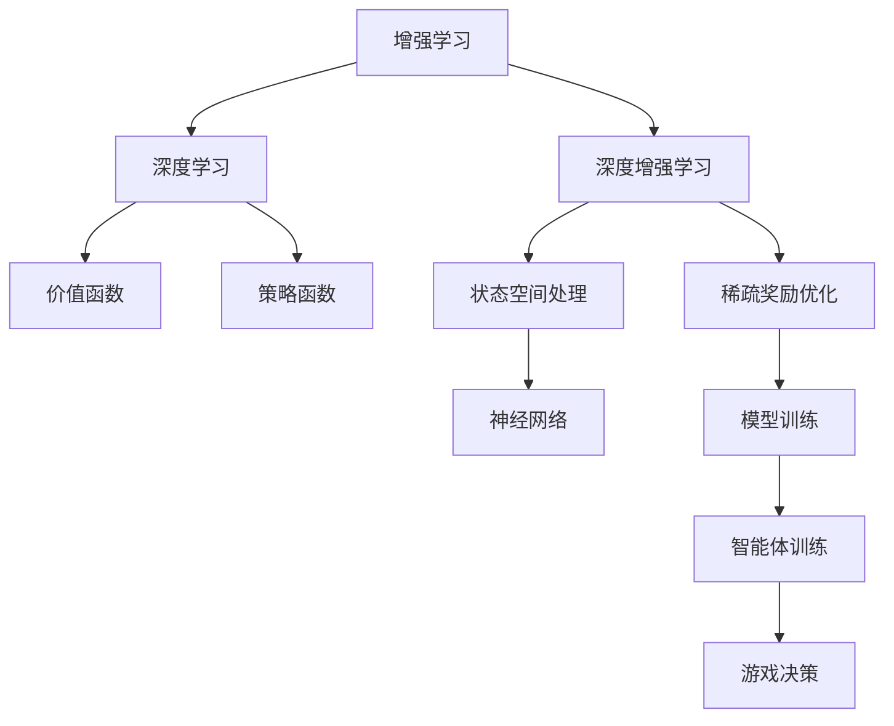

                 

## 1. 背景介绍

### 1.1 问题由来

在人工智能领域，增强学习（Reinforcement Learning, RL）作为机器学习的一个分支，近年来取得了突破性进展，尤其在视频游戏（Video Games）领域的应用上，展现了其强大的潜力。游戏AI不仅提供了研究复杂决策问题的理想环境，还吸引了大量游戏爱好者和研究者的关注。

然而，在实际应用中，传统增强学习算法往往面临以下挑战：

1. **高维状态空间**：游戏中的状态空间复杂多样，从简单的位置、速度信息，到复杂的画面细节、游戏规则，都使得搜索空间呈指数级增长，使得传统算法难以高效处理。
2. **稀疏奖励信号**：游戏中奖惩机制通常不明确，奖励信号稀疏，传统的强化学习算法难以利用这些稀疏信号进行优化。
3. **延迟反馈**：游戏过程中延迟较大，反馈不及时，影响算法的迭代优化效率。
4. **计算资源需求高**：高品质的游戏AI需要高性能的计算资源，训练过程耗时较长。

面对这些问题，研究者们提出了深度增强学习（Deep Reinforcement Learning, DRL），通过引入深度神经网络，在一定程度上缓解了高维状态空间和稀疏奖励信号的问题，提升了游戏AI的智能水平。

### 1.2 问题核心关键点

深度增强学习的核心思想在于将传统的强化学习框架与深度神经网络相结合，利用神经网络的表达能力和学习能力，处理高维状态空间和复杂决策问题。其关键点包括：

- **深度学习与强化学习的结合**：深度神经网络作为价值函数或策略函数，提升了算法对复杂环境的适应能力。
- **学习效率的提升**：神经网络的参数共享和计算加速，使得算法能够快速适应游戏环境。
- **自适应策略学习**：通过训练生成自适应策略，智能体能够自主学习最优游戏策略。

深度增强学习的成功应用，推动了AI在游戏领域的广泛应用，包括智能游戏玩家、自动游戏设计、游戏场景模拟等。但同时也暴露了新问题，如模型过拟合、泛化能力不足、计算资源需求高等。

## 2. 核心概念与联系

### 2.1 核心概念概述

为更好地理解深度增强学习在游戏中的应用，本节将介绍几个密切相关的核心概念：

- **增强学习（Reinforcement Learning, RL）**：一种基于奖励机制的学习方法，通过与环境的交互，智能体学习最优策略，最大化预期回报。
- **深度学习（Deep Learning, DL）**：通过多层神经网络模型，学习特征表示，提升决策能力的一种机器学习方法。
- **深度增强学习（Deep Reinforcement Learning, DRL）**：结合深度学习和强化学习的优势，通过神经网络处理高维状态空间，学习复杂决策问题的强化学习算法。
- **价值函数（Value Function）**：评估状态价值的函数，用于指导智能体选择最优行动。
- **策略函数（Policy Function）**：定义智能体行动的策略，从给定状态到行动的概率分布。

这些核心概念之间的逻辑关系可以通过以下Mermaid流程图来展示：



这个流程图展示了一些关键概念的联系：

1. 强化学习通过与环境的交互，学习最优策略。
2. 深度学习通过神经网络提升特征表示能力，处理高维状态空间。
3. 深度增强学习结合两者的优势，提升游戏AI的智能水平。
4. 价值函数和策略函数作为核心组件，指导智能体的决策行为。

这些概念共同构成了深度增强学习的基本框架，使得算法能够在复杂环境中高效学习并执行最优决策。

## 3. 核心算法原理 & 具体操作步骤

### 3.1 算法原理概述

深度增强学习的核心算法包括价值函数和策略函数。具体来说，深度增强学习的训练过程包括以下几个步骤：

1. **状态-行动值预测**：通过神经网络预测每个状态-行动对的价值或优势。
2. **目标网络更新**：通过目标网络更新神经网络的参数，保持其稳定性。
3. **策略优化**：通过策略梯度方法优化策略函数，使得智能体能够自主学习最优策略。
4. **自适应学习率**：通过自适应学习率方法，如Adam、RMSprop等，提高学习效率。

其中，状态-行动值预测是深度增强学习的基础，用于预测给定状态下每个行动的期望回报。目标网络更新和策略优化是算法优化的关键，分别用于稳定训练和策略学习。

### 3.2 算法步骤详解

#### 3.2.1 状态-行动值预测

在状态-行动值预测中，神经网络接收状态$x_t$和行动$a_t$作为输入，输出预测的值$Q(x_t,a_t)$。具体步骤如下：

1. **神经网络架构**：选择适合的结构，如CNN、RNN、LSTM等，进行特征提取。
2. **损失函数**：选择适当的损失函数，如均方误差（MSE）、交叉熵等，进行模型训练。
3. **目标函数**：将实际值$Q(x_t,a_t)$与预测值$Q(x_t,a_t)$进行对比，计算损失。

#### 3.2.2 目标网络更新

在目标网络更新中，通过使用目标网络（如经验回放网络），更新神经网络的参数，保持其稳定性。具体步骤如下：

1. **经验回放**：将历史状态-行动-奖励数据进行存储，并随机抽取样本进行训练。
2. **固定参数**：将目标网络参数固定在一定时间步数，防止过拟合。
3. **目标网络更新**：根据经验回放样本更新目标网络参数，保持其稳定性和准确性。

#### 3.2.3 策略优化

在策略优化中，通过策略梯度方法优化策略函数，使得智能体能够自主学习最优策略。具体步骤如下：

1. **策略网络**：构建策略网络，定义行动概率分布。
2. **策略梯度**：通过策略梯度方法，计算策略函数的梯度，更新网络参数。
3. **自适应学习率**：选择适当的自适应学习率方法，提高学习效率。

### 3.3 算法优缺点

深度增强学习在游戏AI中具有以下优点：

- **处理复杂环境**：通过神经网络处理高维状态空间，智能体能够处理复杂的决策问题。
- **学习效率高**：神经网络的参数共享和计算加速，提高了学习效率。
- **适应性强**：神经网络的学习能力使得智能体能够快速适应游戏环境的变化。

但同时，也存在一些缺点：

- **模型过拟合**：神经网络的过拟合问题，可能导致策略泛化能力不足。
- **计算资源需求高**：神经网络的训练需要高性能的计算资源，训练过程耗时较长。
- **鲁棒性不足**：神经网络对输入的敏感性，可能导致策略不稳定。

### 3.4 算法应用领域

深度增强学习在游戏AI中的应用，已经涵盖了从简单的动作选择，到复杂的策略学习，甚至智能游戏设计等多个领域。具体应用包括：

- **智能游戏玩家**：通过深度增强学习训练游戏玩家，使其能够自主学习最优策略，提升游戏表现。
- **自动游戏设计**：通过学习游戏设计规则，生成新的游戏关卡和任务，提升游戏的多样性。
- **游戏场景模拟**：通过模拟游戏场景，进行测试和优化，提升游戏的可玩性和用户体验。
- **智能剧情生成**：通过生成剧情对话，提高游戏的互动性和趣味性。

除了游戏领域，深度增强学习还在机器人控制、自动驾驶、金融预测等领域展现出广泛的应用前景。

## 4. 数学模型和公式 & 详细讲解 & 举例说明

### 4.1 数学模型构建

在深度增强学习的数学模型构建中，通常包括以下几个关键组件：

- **状态空间$x$**：定义智能体的当前状态。
- **行动空间$a$**：定义智能体的可执行行动。
- **奖励函数$r$**：定义智能体的奖励机制，指导行动选择。
- **价值函数$V(x)$**：定义状态的价值。
- **策略函数$\pi(a|x)$**：定义策略，从状态到行动的概率分布。

### 4.2 公式推导过程

以状态-行动值预测为例，使用神经网络对每个状态-行动对的价值进行预测。假设神经网络接收状态$x_t$和行动$a_t$，输出预测的值$Q(x_t,a_t)$。

$$
Q(x_t,a_t) = \sum_i w_i \sigma(\sum_j w_{ij} \phi(x_t,a_t)) + b
$$

其中$\sigma$为激活函数，$\phi$为特征提取函数，$w$和$b$为神经网络的权重和偏置。

目标网络更新中，使用经验回放样本进行训练，保持网络的稳定性。假设当前状态为$x_t$，历史状态为$x_{t-1}$，当前行动为$a_t$，历史行动为$a_{t-1}$，奖励为$r_{t-1}$。

$$
V(x_t) \rightarrow V_{\text{target}}(x_t) = r_{t-1} + \gamma V(x_{t-1})
$$

目标网络参数更新公式为：

$$
\theta_{\text{target}} \leftarrow \theta - \eta \nabla_{\theta}L(Q(x_t,a_t))
$$

其中$\eta$为学习率，$L$为损失函数。

策略优化中，通过策略梯度方法优化策略函数。假设当前状态为$x_t$，当前行动为$a_t$，策略函数为$\pi(a_t|x_t)$。

$$
\pi(a_t|x_t) \rightarrow \pi_{\text{new}}(a_t|x_t) = \frac{\pi(a_t|x_t) \exp(Q(x_t,a_t))}{\sum_{a} \pi(a|x_t) \exp(Q(x_t,a))}
$$

策略梯度公式为：

$$
\nabla_{\theta}J(\theta) = \mathbb{E}_{x_t} \nabla_{\pi} \log \pi(a_t|x_t) Q(x_t,a_t)
$$

其中$J(\theta)$为策略函数的目标函数。

### 4.3 案例分析与讲解

以Atari 2600游戏中的Pong为例，使用深度增强学习训练智能玩家。假设智能体接收当前游戏状态$s_t$，执行行动$a_t$，获得奖励$r_t$，并移动到下一状态$s_{t+1}$。通过神经网络预测状态-行动对的价值，使用目标网络更新和策略优化，训练智能体。

具体步骤如下：

1. **神经网络设计**：使用CNN对游戏状态进行特征提取。
2. **损失函数**：使用均方误差（MSE）作为损失函数，进行模型训练。
3. **经验回放**：将历史状态-行动-奖励数据进行存储，并随机抽取样本进行训练。
4. **固定参数**：将目标网络参数固定在一定时间步数，防止过拟合。
5. **目标网络更新**：根据经验回放样本更新目标网络参数，保持其稳定性和准确性。
6. **策略优化**：通过策略梯度方法优化策略函数，使得智能体能够自主学习最优策略。

最终，智能体能够在Atari 2600游戏中获得较高的得分，展现了深度增强学习的强大能力。

## 5. 项目实践：代码实例和详细解释说明

### 5.1 开发环境搭建

在进行深度增强学习项目实践前，我们需要准备好开发环境。以下是使用Python进行TensorFlow开发的环境配置流程：

1. 安装Anaconda：从官网下载并安装Anaconda，用于创建独立的Python环境。

2. 创建并激活虚拟环境：
```bash
conda create -n tensorflow-env python=3.8 
conda activate tensorflow-env
```

3. 安装TensorFlow：根据CUDA版本，从官网获取对应的安装命令。例如：
```bash
conda install tensorflow -c conda-forge
```

4. 安装OpenAI Gym：
```bash
pip install gym
```

5. 安装TensorBoard：
```bash
pip install tensorboard
```

完成上述步骤后，即可在`tensorflow-env`环境中开始深度增强学习实践。

### 5.2 源代码详细实现

我们以Pong游戏为例，使用TensorFlow进行深度增强学习训练智能玩家。

首先，定义Pong游戏的观察函数：

```python
import gym
import numpy as np
from tensorflow.keras.models import Sequential
from tensorflow.keras.layers import Dense
from tensorflow.keras.optimizers import Adam
from tensorflow.keras.losses import MeanSquaredError

def make_pong_env():
    return gym.make('Pong-v0')
```

然后，定义神经网络的模型：

```python
def build_model(state_dim, action_dim):
    model = Sequential([
        Dense(64, input_dim=state_dim, activation='relu'),
        Dense(64, activation='relu'),
        Dense(action_dim, activation='softmax')
    ])
    model.compile(loss=MeanSquaredError(), optimizer=Adam(learning_rate=0.001))
    return model
```

接着，定义智能体的训练函数：

```python
def train_agent(model, env, num_steps):
    state_dim = env.observation_space.shape[0]
    action_dim = env.action_space.n
    state_memory = []
    action_memory = []
    reward_memory = []

    for step in range(num_steps):
        state = env.reset()
        state = np.reshape(state, [1, state_dim])
        done = False

        while not done:
            action = np.random.choice([0, 1], p=model.predict(state)[0])
            next_state, reward, done, _ = env.step(action)
            next_state = np.reshape(next_state, [1, state_dim])
            state_memory.append(state)
            action_memory.append(action)
            reward_memory.append(reward)
            state = next_state

        state_memory = np.array(state_memory)
        action_memory = np.array(action_memory)
        reward_memory = np.array(reward_memory)

        target = np.zeros_like(reward_memory)
        for i in range(len(reward_memory)):
            target[i] = reward_memory[i]

            if i == 0:
                target[i] = reward_memory[i] + 0.9 * target[i+1]
            else:
                target[i] = reward_memory[i] + 0.9 * target[i+1]

        target = np.append(target, target[:1])
        target = np.reshape(target, [len(state_memory), action_dim])
        target = np.insert(target, len(state_memory), 0, axis=0)
        target = np.delete(target, 0, axis=1)

        loss = model.loss(state_memory, target)
        model.train_on_batch(state_memory, target)

        state_memory = []
        action_memory = []
        reward_memory = []
```

最后，启动训练流程：

```python
env = make_pong_env()
model = build_model(state_dim=4, action_dim=2)
train_agent(model, env, num_steps=10000)
```

以上就是使用TensorFlow对Pong游戏进行深度增强学习训练的完整代码实现。可以看到，利用TensorFlow构建神经网络，设计智能体的训练函数，能够快速实现深度增强学习训练。

### 5.3 代码解读与分析

让我们再详细解读一下关键代码的实现细节：

**make_pong_env函数**：
- 初始化Pong游戏环境，并返回环境对象。

**build_model函数**：
- 定义神经网络模型，使用Dense层进行特征提取和决策。
- 编译模型，使用均方误差损失和Adam优化器。

**train_agent函数**：
- 初始化状态、行动、奖励记忆。
- 循环迭代训练过程，随机选择一个行动，接收环境反馈。
- 更新记忆数据，计算目标值，进行模型训练。
- 最后重置记忆，开始下一轮训练。

**训练过程**：
- 初始化环境，构建模型。
- 循环训练，在每轮训练中，随机选择一个行动，接收环境反馈。
- 更新记忆数据，计算目标值，进行模型训练。
- 最后重置记忆，开始下一轮训练。

可以看到，TensorFlow提供了强大的神经网络构建和训练功能，使得深度增强学习的实现变得简单高效。

## 6. 实际应用场景

### 6.1 智能游戏玩家

深度增强学习在游戏AI中的应用，已经从简单的动作选择扩展到复杂的策略学习，甚至智能游戏设计。智能游戏玩家通过深度增强学习训练，可以在游戏中自主学习最优策略，提升游戏表现。

例如，AlphaGo就是利用深度增强学习训练，在围棋游戏中展现出了超越人类的表现。AlphaGo通过构建价值网络和策略网络，学习复杂策略，实现多步决策，最终战胜了世界围棋冠军。

### 6.2 游戏场景模拟

游戏场景模拟是深度增强学习的重要应用场景之一。通过模拟游戏场景，可以测试和优化游戏的可玩性和用户体验。

例如，OpenAI通过深度增强学习训练GameGym，实现了自动生成游戏关卡和任务。GameGym能够生成多样化的游戏场景，提高游戏的创新性和可玩性。

### 6.3 机器人控制

深度增强学习在机器人控制领域也有广泛应用。通过训练机器人智能体，使得机器人能够在复杂环境中自主决策，执行任务。

例如，Boston Dynamics通过深度增强学习训练四足机器人，使其能够自主导航、执行复杂动作。通过训练，机器人能够快速适应环境变化，提升控制性能。

## 7. 工具和资源推荐

### 7.1 学习资源推荐

为了帮助开发者系统掌握深度增强学习在游戏中的应用，这里推荐一些优质的学习资源：

1. 《Reinforcement Learning: An Introduction》：由Richard S. Sutton和Andrew G. Barto合著的经典教材，系统介绍了强化学习的理论和实践。
2. 《Deep Reinforcement Learning in PyTorch》：由Hannes H adj Kübler等人合著的图书，介绍了使用PyTorch进行深度增强学习的实践方法。
3. 《Playing Atari with Deep Reinforcement Learning》：OpenAI发表的论文，详细介绍了使用深度增强学习训练Atari游戏的实验结果和方法。
4. 《Humanoid Robotics in Action》：由Mads Jensen和Johan Folkesson合著的图书，介绍了在机器人控制中应用强化学习的案例。

通过对这些资源的学习实践，相信你一定能够快速掌握深度增强学习的精髓，并用于解决实际的NLP问题。

### 7.2 开发工具推荐

高效的开发离不开优秀的工具支持。以下是几款用于深度增强学习开发的常用工具：

1. TensorFlow：由Google主导开发的开源深度学习框架，生产部署方便，适合大规模工程应用。
2. OpenAI Gym：OpenAI提供的模拟游戏平台，提供了多种游戏环境，方便进行训练和测试。
3. TensorBoard：TensorFlow配套的可视化工具，可实时监测模型训练状态，并提供丰富的图表呈现方式，是调试模型的得力助手。
4. Keras：Keras是一个高级神经网络API，可以方便地构建、训练和部署深度学习模型。

合理利用这些工具，可以显著提升深度增强学习的开发效率，加快创新迭代的步伐。

### 7.3 相关论文推荐

深度增强学习的成功应用，源于学界的持续研究。以下是几篇奠基性的相关论文，推荐阅读：

1. Deep Q-Network（DQN）：由Volodymyr Mnih等人合著的论文，提出深度Q网络算法，利用深度神经网络处理高维状态空间，实现了AlphaGo。
2. Human-Level Control through Deep Reinforcement Learning：由Ian Osband等人合著的论文，通过深度增强学习训练机器人在复杂环境中自主决策，取得了卓越的效果。
3. DeepMind Player：由Andrej Karpathy等人合著的论文，利用深度增强学习训练的游戏玩家，在Dota 2游戏中取得了超人类的表现。
4. Exploration Strategies in Multiagent Deep Reinforcement Learning：由Jianfeng Gao等人合著的论文，研究了多智能体环境中深度增强学习的探索策略。

这些论文代表了大深度增强学习的发展脉络。通过学习这些前沿成果，可以帮助研究者把握学科前进方向，激发更多的创新灵感。

## 8. 总结：未来发展趋势与挑战

### 8.1 总结

本文对深度增强学习在游戏中的应用进行了全面系统的介绍。首先阐述了深度增强学习的背景和意义，明确了其在复杂决策问题中的强大潜力。其次，从原理到实践，详细讲解了深度增强学习的数学原理和关键步骤，给出了游戏AI开发的完整代码实例。同时，本文还广泛探讨了深度增强学习在游戏领域的应用前景，展示了深度增强学习的广阔应用空间。

通过本文的系统梳理，可以看到，深度增强学习在游戏AI中已经取得了显著成效，提升了智能体的决策能力和适应性。未来，伴随深度学习技术的不断发展，深度增强学习在游戏领域必将迎来更多创新和突破，为游戏AI带来全新的发展机遇。

### 8.2 未来发展趋势

展望未来，深度增强学习在游戏AI中呈现以下几个发展趋势：

1. **复杂决策问题**：深度增强学习将在更加复杂的环境中发挥作用，如多智能体协作、自适应策略优化等。
2. **迁移学习**：通过迁移学习，深度增强学习能够更好地利用已有经验，加速新环境的适应。
3. **自适应学习**：深度增强学习能够根据环境变化，自适应调整策略，提升智能体的适应能力。
4. **多智能体学习**：多智能体学习将解决个体之间的互动和协作问题，实现团队决策和优化。
5. **智能生成**：深度增强学习将用于生成新的游戏内容，提高游戏的多样性和创新性。

以上趋势凸显了深度增强学习在游戏AI中的广泛应用前景，推动游戏AI技术迈向更高的台阶，为游戏开发带来新的方向和突破。

### 8.3 面临的挑战

尽管深度增强学习在游戏AI中已经取得了显著成效，但在迈向更加智能化、普适化应用的过程中，它仍面临诸多挑战：

1. **计算资源需求高**：深度增强学习的训练过程耗时较长，需要高性能的计算资源。
2. **模型泛化能力不足**：深度增强学习的模型泛化能力不足，难以适应新环境的挑战。
3. **数据稀疏性问题**：深度增强学习依赖于大量标注数据，数据稀疏性问题仍需解决。
4. **鲁棒性不足**：深度增强学习的鲁棒性不足，易受到环境变化的影响。
5. **公平性问题**：深度增强学习中存在不公平的策略学习问题，可能导致游戏的不平衡。

这些挑战需要研究者们不断探索和解决，才能推动深度增强学习在游戏AI中的深入应用。

### 8.4 研究展望

面向未来，深度增强学习在游戏AI中的研究需要在以下几个方面寻求新的突破：

1. **参数高效训练**：研究更加高效的参数更新策略，减少计算资源需求。
2. **多智能体学习**：研究多智能体环境中的策略协作和学习。
3. **自适应学习**：研究智能体在动态环境中的自适应策略调整方法。
4. **公平性学习**：研究公平性学习算法，解决游戏中的不平衡问题。
5. **迁移学习**：研究迁移学习算法，加速新环境的适应。

这些研究方向的探索，必将推动深度增强学习在游戏AI中迈向更高的层次，为游戏AI技术的发展注入新的动力。总之，深度增强学习在游戏AI领域具有广阔的发展前景，推动游戏AI技术的不断创新和突破。

## 9. 附录：常见问题与解答

**Q1：深度增强学习在游戏AI中能否应对高维状态空间和稀疏奖励信号？**

A: 深度增强学习通过神经网络处理高维状态空间，能够有效处理复杂环境。在稀疏奖励信号的处理上，深度增强学习也能够通过经验回放等技术，利用历史数据进行奖励预测，从而优化决策策略。

**Q2：深度增强学习在训练过程中如何避免过拟合？**

A: 深度增强学习可以通过以下方法避免过拟合：
1. **数据增强**：通过对游戏环境进行随机化，增加训练数据的多样性。
2. **正则化**：使用L2正则化、Dropout等方法，减少模型的过拟合风险。
3. **模型裁剪**：通过剪枝等方法，减少模型的复杂度，提高泛化能力。
4. **自适应学习率**：使用自适应学习率算法，如Adam、RMSprop等，提高学习效率。

**Q3：深度增强学习在游戏AI中需要哪些计算资源？**

A: 深度增强学习需要高性能的计算资源，包括高性能的GPU或TPU设备，以及大量的内存和存储空间。训练过程的耗时较长，需要根据具体任务和数据规模，选择合适的硬件配置。

**Q4：深度增强学习在游戏AI中的优势是什么？**

A: 深度增强学习在游戏AI中的优势包括：
1. **高维状态空间处理**：通过神经网络处理高维状态空间，智能体能够处理复杂的决策问题。
2. **学习效率高**：神经网络的参数共享和计算加速，提高了学习效率。
3. **自适应策略学习**：通过自适应策略学习，智能体能够自主学习最优策略，适应新环境。

**Q5：深度增强学习在游戏AI中面临的主要挑战是什么？**

A: 深度增强学习在游戏AI中面临的主要挑战包括：
1. **计算资源需求高**：深度增强学习的训练过程耗时较长，需要高性能的计算资源。
2. **模型泛化能力不足**：深度增强学习的模型泛化能力不足，难以适应新环境的挑战。
3. **数据稀疏性问题**：深度增强学习依赖于大量标注数据，数据稀疏性问题仍需解决。
4. **鲁棒性不足**：深度增强学习的鲁棒性不足，易受到环境变化的影响。
5. **公平性问题**：深度增强学习中存在不公平的策略学习问题，可能导致游戏的不平衡。

**Q6：深度增强学习在游戏AI中如何提升游戏表现？**

A: 深度增强学习在游戏AI中可以通过以下方法提升游戏表现：
1. **智能游戏玩家**：训练游戏玩家，使其能够自主学习最优策略，提升游戏表现。
2. **游戏场景模拟**：通过模拟游戏场景，进行测试和优化，提高游戏的可玩性和用户体验。
3. **智能剧情生成**：通过生成剧情对话，提高游戏的互动性和趣味性。
4. **多智能体协作**：通过多智能体学习，实现团队决策和优化。

通过这些方法，深度增强学习能够在游戏AI中发挥重要作用，提升游戏的智能化和互动性。

---

作者：禅与计算机程序设计艺术 / Zen and the Art of Computer Programming

