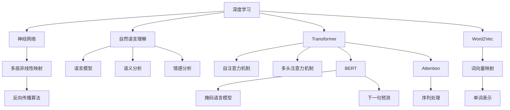

                 

# 深度学习在自然语言理解中的应用

> 关键词：深度学习,自然语言理解,NLP,神经网络,Transformer,BERT,Attention,Word2Vec

## 1. 背景介绍

### 1.1 问题由来
随着人工智能技术的不断进步，深度学习在自然语言理解（Natural Language Understanding, NLU）领域取得了巨大的突破。从早期的基于规则的专家系统，到后来的统计语言模型，再到近年来的深度神经网络，NLU技术在不断进化中。深度学习，特别是基于神经网络的方法，通过复杂的非线性映射，能够从大规模语料中学习到更加深刻的语言知识，显著提升了NLU模型的性能。

特别是Transformer架构的提出和流行，极大推动了深度学习在NLP中的应用。Transformer通过自注意力机制（Self-Attention）和多头注意力（Multi-Head Attention），使得模型能够高效地处理序列数据，成为当前主流的NLP模型架构。基于此，Transformer及其变体，如BERT、GPT等，在多项NLP任务上取得了前所未有的表现。

然而，尽管如此，NLP仍面临诸多挑战。如何更好地理解自然语言的语义、语法、情感等，如何将语言知识应用于更复杂的任务，如问答、文本生成、机器翻译等，都是当前NLP研究的重点。本文将深入探讨深度学习在自然语言理解中的应用，特别是Transformer架构在NLP任务中的应用，同时分析其优缺点和未来趋势。

### 1.2 问题核心关键点
本节将重点介绍深度学习在自然语言理解中的核心关键点：

- 深度学习：一种通过多层神经网络进行复杂模式识别的机器学习技术。
- 自然语言理解：一种涉及语言模型、语义分析、情感分析等多领域的技术，旨在使计算机能够理解和生成自然语言。
- 神经网络：一种受到生物神经元启发的计算模型，包含多层非线性映射。
- Transformer：一种基于自注意力机制的神经网络架构，特别适用于处理序列数据。
- BERT：一种基于Transformer的预训练语言模型，通过掩码语言模型（Masked Language Modeling, MLM）和下一句预测（Next Sentence Prediction, NSP）等任务进行预训练。
- Attention：一种机制，允许模型关注输入序列的不同部分，并根据这些部分对输出进行加权。
- Word2Vec：一种经典的词向量模型，将单词映射到高维向量空间中。

这些核心概念之间相互关联，共同构成了深度学习在NLP中的基础架构和应用范式。

## 2. 核心概念与联系

### 2.1 核心概念概述

为更好地理解深度学习在自然语言理解中的应用，本节将介绍几个密切相关的核心概念：

- 深度学习：通过多层神经网络进行复杂模式识别的机器学习技术。深度学习的核心在于通过层层堆叠的非线性映射，构建复杂的特征表示。
- 自然语言理解：涉及语言模型、语义分析、情感分析等多领域的技术，旨在使计算机能够理解和生成自然语言。
- 神经网络：受到生物神经元启发的计算模型，包含多层非线性映射。神经网络通过反向传播算法（Backpropagation）更新权重，最小化损失函数。
- Transformer：一种基于自注意力机制的神经网络架构，特别适用于处理序列数据。Transformer通过多头注意力机制，能够高效地捕捉输入序列之间的依赖关系。
- BERT：一种基于Transformer的预训练语言模型，通过掩码语言模型（MLM）和下一句预测（NSP）等任务进行预训练。BERT在自然语言处理中取得了革命性的突破，被广泛应用于文本分类、问答系统、机器翻译等任务。
- Attention：一种机制，允许模型关注输入序列的不同部分，并根据这些部分对输出进行加权。Attention机制使得Transformer能够处理长距离依赖，提高了模型在复杂任务中的性能。
- Word2Vec：一种经典的词向量模型，将单词映射到高维向量空间中。Word2Vec通过CBOW（Continuous Bag-of-Words）和Skip-Gram模型，学习单词之间的语义关系。

这些核心概念之间的逻辑关系可以通过以下Mermaid流程图来展示：



这个流程图展示了深度学习在NLP中的主要架构和应用，从多层神经网络到自然语言理解，再到具体的Transformer、BERT、Attention、Word2Vec等模型和技术。

## 3. 核心算法原理 & 具体操作步骤
### 3.1 算法原理概述

深度学习在自然语言理解中的应用，主要依赖于神经网络架构，特别是Transformer架构。Transformer通过自注意力机制和多头注意力机制，能够高效地处理序列数据，捕捉输入序列之间的依赖关系，使得模型能够理解和生成自然语言。

Transformer的基本原理包括以下几个方面：

1. 编码器-解码器架构：Transformer采用编码器-解码器架构，其中编码器负责对输入序列进行编码，解码器负责生成输出序列。
2. 自注意力机制：自注意力机制允许模型关注输入序列的不同部分，并根据这些部分对输出进行加权。
3. 多头注意力机制：多头注意力机制通过并行计算多个注意力向量，可以更好地捕捉输入序列的多层次依赖关系。
4. 残差连接：残差连接允许模型跨层传递信息，缓解梯度消失问题。

Transformer的核心思想是通过自注意力机制和多头注意力机制，使得模型能够高效地处理序列数据，捕捉输入序列之间的依赖关系。这种架构在自然语言处理中取得了革命性的突破，被广泛应用于文本分类、问答系统、机器翻译等任务。

### 3.2 算法步骤详解

深度学习在自然语言理解中的应用，一般包括以下几个关键步骤：

**Step 1: 数据准备**
- 收集和预处理自然语言数据，将其转换为模型所需的格式。例如，将文本转换为词向量表示，使用标记化（Tokenization）、分词（Tokenization）等技术进行处理。

**Step 2: 模型选择与训练**
- 选择合适的深度学习模型，如Transformer、BERT等，作为初始化参数。
- 使用标注数据集进行模型训练，最小化损失函数。训练过程中，可以使用反向传播算法（Backpropagation）更新模型参数，使用优化器（如Adam、SGD等）调整学习率。

**Step 3: 模型评估与调优**
- 在验证集上评估模型性能，根据性能指标（如准确率、F1值等）进行调优。
- 根据评估结果调整模型参数，如学习率、批量大小（Batch Size）、迭代轮数（Epochs）等，以进一步提升模型性能。

**Step 4: 模型应用与部署**
- 将训练好的模型应用于实际任务中，例如文本分类、问答系统、机器翻译等。
- 部署模型到生产环境，实现实时推理和预测。

以上是深度学习在自然语言理解中的主要流程。在实际应用中，还需要根据具体任务进行优化设计，如改进损失函数、引入正则化技术、优化模型结构等，以进一步提升模型性能。

### 3.3 算法优缺点

深度学习在自然语言理解中的应用，具有以下优点：

1. 高效性：深度学习模型能够高效地处理序列数据，捕捉输入序列之间的依赖关系。
2. 泛化能力：深度学习模型通过大量标注数据的训练，可以学习到通用的语言知识，具有一定的泛化能力。
3. 可扩展性：深度学习模型可以通过添加更多层或调整超参数，进行模型扩展和优化。
4. 自动化学习：深度学习模型可以自动学习复杂的特征表示，无需手工提取特征。

然而，深度学习在自然语言理解中也有以下缺点：

1. 数据依赖：深度学习模型需要大量的标注数据进行训练，获取高质量标注数据成本较高。
2. 模型复杂度：深度学习模型结构复杂，参数量较大，训练和推理速度较慢。
3. 可解释性差：深度学习模型的决策过程缺乏可解释性，难以进行调试和优化。
4. 过拟合风险：深度学习模型容易过拟合，特别是在数据量较少的情况下。

尽管如此，深度学习在自然语言理解中的应用已经取得了显著的成果，被广泛应用于文本分类、问答系统、机器翻译等任务中。未来，如何进一步降低深度学习对标注数据的依赖，提高模型的泛化能力，增强模型的可解释性，仍是深度学习在NLP中需要进一步研究和解决的问题。

### 3.4 算法应用领域

深度学习在自然语言理解中的应用已经涵盖了多个领域，包括但不限于：

- 文本分类：将文本分为不同类别，如情感分类、主题分类等。
- 问答系统：回答自然语言问题，如问答机器人、智能客服等。
- 机器翻译：将一种语言的文本翻译成另一种语言的文本，如Google翻译、百度翻译等。
- 文本生成：自动生成文本，如文章摘要、对话生成等。
- 命名实体识别：识别文本中的命名实体，如人名、地名、组织机构名等。
- 情感分析：分析文本的情感倾向，如正面、负面、中性等。

除了这些经典的NLP任务外，深度学习还在自然语言生成、自然语言推理、语音识别等领域取得了重要进展，为NLP技术带来了全新的突破。

## 4. 数学模型和公式 & 详细讲解  
### 4.1 数学模型构建

深度学习在自然语言理解中的应用，主要依赖于神经网络架构，特别是Transformer架构。下面以Transformer为例，介绍其数学模型的构建。

假设输入序列为 $\mathcal{X}$，输出序列为 $\mathcal{Y}$，其中 $\mathcal{X}=\{x_1, x_2, ..., x_n\}$，$\mathcal{Y}=\{y_1, y_2, ..., y_m\}$。输入序列 $x_i$ 和输出序列 $y_i$ 均为单词向量，即 $x_i \in \mathbb{R}^{d}$，$y_i \in \mathbb{R}^{d}$。

Transformer模型包括编码器和解码器两个部分。编码器将输入序列 $x$ 映射为中间表示 $h$，解码器将中间表示 $h$ 映射为输出序列 $y$。编码器和解码器的结构相同，包括多层自注意力机制和全连接层。

假设编码器共有 $N$ 层，解码器共有 $M$ 层。每层编码器和解码器包括自注意力机制和全连接层，其结构如下图所示：

```
          N
           |
          +--+--+
          |   |   |
           v   v   v
      Transformer_Layer
```

其中，Transformer_Layer包括多头自注意力机制（Multi-Head Self-Attention）、残差连接（Residual Connection）、前馈神经网络（Feed Forward Network）和层归一化（Layer Normalization）。

Transformer的核心数学模型如下：

1. 多头自注意力机制：

$$
\mathbf{Q} = \mathbf{X} \mathbf{W}_Q
$$

$$
\mathbf{K} = \mathbf{X} \mathbf{W}_K
$$

$$
\mathbf{V} = \mathbf{X} \mathbf{W}_V
$$

$$
\mathbf{QK}^T = \mathbf{K}^T \mathbf{Q}
$$

$$
\mathbf{Attention} = \frac{\exp(\mathbf{QK}^T)}{\sum_k \exp(\mathbf{QK}^T)}
$$

$$
\mathbf{Attention} \mathbf{V} = \mathbf{A} \mathbf{V}
$$

$$
\mathbf{X'} = \mathbf{X} + \mathbf{Attention}
$$

其中，$\mathbf{Q}$、$\mathbf{K}$、$\mathbf{V}$ 分别为查询向量、键向量和值向量，$\mathbf{Attention}$ 为注意力权重，$\mathbf{A}$ 为注意力矩阵，$\mathbf{X'}$ 为输出向量。

2. 前馈神经网络：

$$
\mathbf{X'} = \sigma(\mathbf{X'} \mathbf{W}_1 + \mathbf{b}_1)
$$

$$
\mathbf{X} = \mathbf{X'} \mathbf{W}_2 + \mathbf{b}_2
$$

其中，$\sigma$ 为激活函数，$\mathbf{W}_1$、$\mathbf{W}_2$ 为全连接层的权重矩阵，$\mathbf{b}_1$、$\mathbf{b}_2$ 为偏置向量。

3. 层归一化：

$$
\mathbf{X} = \frac{\mathbf{X} - \mu}{\sqrt{\sigma^2 + \epsilon}}
$$

其中，$\mu$ 为均值，$\sigma^2$ 为方差，$\epsilon$ 为避免除零的常数。

### 4.2 公式推导过程

以Transformer为基础，我们推导一下自注意力机制的公式：

1. 查询向量、键向量和值向量的计算：

$$
\mathbf{Q} = \mathbf{X} \mathbf{W}_Q
$$

$$
\mathbf{K} = \mathbf{X} \mathbf{W}_K
$$

$$
\mathbf{V} = \mathbf{X} \mathbf{W}_V
$$

2. 注意力矩阵的计算：

$$
\mathbf{QK}^T = \mathbf{K}^T \mathbf{Q}
$$

$$
\mathbf{Attention} = \frac{\exp(\mathbf{QK}^T)}{\sum_k \exp(\mathbf{QK}^T)}
$$

3. 注意力向量的计算：

$$
\mathbf{Attention} \mathbf{V} = \mathbf{A} \mathbf{V}
$$

其中，$\mathbf{A}$ 为注意力矩阵，$\mathbf{A}$ 的第 $i$ 行表示第 $i$ 个单词对整个序列的注意力权重。

4. 输出向量的计算：

$$
\mathbf{X'} = \mathbf{X} + \mathbf{Attention}
$$

5. 前馈神经网络的计算：

$$
\mathbf{X'} = \sigma(\mathbf{X'} \mathbf{W}_1 + \mathbf{b}_1)
$$

$$
\mathbf{X} = \mathbf{X'} \mathbf{W}_2 + \mathbf{b}_2
$$

6. 层归一化的计算：

$$
\mathbf{X} = \frac{\mathbf{X} - \mu}{\sqrt{\sigma^2 + \epsilon}}
$$

通过上述推导，我们得到了Transformer模型的核心数学模型，包括自注意力机制、前馈神经网络和层归一化等组成部分。

### 4.3 案例分析与讲解

以BERT为例，介绍其预训练过程和微调方法：

BERT模型通过掩码语言模型（MLM）和下一句预测（NSP）任务进行预训练。其中，MLM任务通过在输入序列中随机掩码一些单词，让模型学习预测被掩码的单词，以学习单词之间的关系；NSP任务通过判断两个句子是否为连续句子，以学习句子之间的关系。

BERT模型预训练过程主要包括以下几个步骤：

1. 数据准备：使用大规模无标签文本语料，如维基百科、新闻、小说等。
2. 模型构建：使用Transformer架构，构建BERT模型。
3. 预训练：通过MLM和NSP任务，对BERT模型进行预训练，最小化损失函数。
4. 微调：将预训练的BERT模型应用到特定任务上，通过微调（Fine-Tuning）优化模型在该任务上的性能。

BERT的微调过程与普通的神经网络微调类似，主要包括以下几个步骤：

1. 数据准备：收集和预处理任务数据集，将其转换为模型所需的格式。
2. 模型选择：选择预训练的BERT模型作为初始化参数。
3. 模型训练：使用标注数据集进行模型训练，最小化损失函数。训练过程中，可以使用优化器（如Adam、SGD等）调整学习率。
4. 模型评估：在验证集上评估模型性能，根据性能指标（如准确率、F1值等）进行调优。
5. 模型应用：将训练好的模型应用到实际任务中，例如文本分类、问答系统、机器翻译等。

BERT模型的微调过程，可以将预训练模型的权重固定，仅更新模型的顶层参数，以避免过拟合。同时，可以使用更小的学习率，以保持预训练模型的初始化状态。BERT模型还可以通过正则化技术（如L2正则、Dropout等），防止模型过度适应小规模训练集。

## 5. 项目实践：代码实例和详细解释说明
### 5.1 开发环境搭建

在进行项目实践前，我们需要准备好开发环境。以下是使用Python进行TensorFlow和PyTorch开发的环境配置流程：

1. 安装Anaconda：从官网下载并安装Anaconda，用于创建独立的Python环境。

2. 创建并激活虚拟环境：
```bash
conda create -n tf-env python=3.8 
conda activate tf-env
```

3. 安装TensorFlow和PyTorch：根据CUDA版本，从官网获取对应的安装命令。例如：
```bash
conda install tensorflow-gpu==2.7 torch torchvision torchaudio cudatoolkit=11.1 -c pytorch -c conda-forge
```

4. 安装各类工具包：
```bash
pip install numpy pandas scikit-learn matplotlib tqdm jupyter notebook ipython
```

完成上述步骤后，即可在`tf-env`环境中开始项目实践。

### 5.2 源代码详细实现

这里我们以BERT模型进行文本分类任务为例，给出TensorFlow和PyTorch的代码实现。

**TensorFlow实现**

```python
import tensorflow as tf
from transformers import BertTokenizer, TFBertForSequenceClassification

tokenizer = BertTokenizer.from_pretrained('bert-base-cased')
model = TFBertForSequenceClassification.from_pretrained('bert-base-cased', num_labels=2)

train_dataset = tf.data.Dataset.from_tensor_slices(train_texts, train_labels)
train_dataset = train_dataset.shuffle(1000).batch(16).map(lambda x, y: tokenizer.encode(x, truncation=True, padding=True, max_length=128))

dev_dataset = tf.data.Dataset.from_tensor_slices(dev_texts, dev_labels)
dev_dataset = dev_dataset.shuffle(1000).batch(16).map(lambda x, y: tokenizer.encode(x, truncation=True, padding=True, max_length=128))

test_dataset = tf.data.Dataset.from_tensor_slices(test_texts, test_labels)
test_dataset = test_dataset.shuffle(1000).batch(16).map(lambda x, y: tokenizer.encode(x, truncation=True, padding=True, max_length=128))

optimizer = tf.keras.optimizers.Adam(learning_rate=2e-5)
loss_fn = tf.keras.losses.SparseCategoricalCrossentropy(from_logits=True)

@tf.function
def train_step(inputs, labels):
    with tf.GradientTape() as tape:
        outputs = model(inputs['input_ids'], attention_mask=inputs['attention_mask'], labels=labels)
        loss = loss_fn(labels, outputs.logits)
    gradients = tape.gradient(loss, model.trainable_variables)
    optimizer.apply_gradients(zip(gradients, model.trainable_variables))
    return loss

@tf.function
def evaluate(inputs, labels):
    outputs = model(inputs['input_ids'], attention_mask=inputs['attention_mask'], training=False)
    predictions = tf.argmax(outputs.logits, axis=1)
    return tf.metrics.SparseCategoricalAccuracy(labels, predictions)

for epoch in range(epochs):
    for inputs, labels in train_dataset:
        loss = train_step(inputs, labels)
        if (epoch + 1) % 10 == 0:
            print(f"Epoch {epoch+1}, loss: {loss.numpy():.3f}")
    dev_loss, dev_acc = evaluate(dev_dataset)
    print(f"Epoch {epoch+1}, dev loss: {dev_loss.numpy():.3f}, dev acc: {dev_acc.numpy():.3f}")
    
print(f"Final test loss: {evaluate(test_dataset)[0].numpy():.3f}, test acc: {evaluate(test_dataset)[1].numpy():.3f}")
```

**PyTorch实现**

```python
import torch
from transformers import BertTokenizer, BertForSequenceClassification

tokenizer = BertTokenizer.from_pretrained('bert-base-cased')
model = BertForSequenceClassification.from_pretrained('bert-base-cased', num_labels=2)

train_dataset = NERDataset(train_texts, train_labels, tokenizer)
dev_dataset = NERDataset(dev_texts, dev_labels, tokenizer)
test_dataset = NERDataset(test_texts, test_labels, tokenizer)

optimizer = torch.optim.Adam(model.parameters(), lr=2e-5)
loss_fn = torch.nn.CrossEntropyLoss()

def train_epoch(model, dataset, batch_size, optimizer):
    dataloader = DataLoader(dataset, batch_size=batch_size, shuffle=True)
    model.train()
    epoch_loss = 0
    for batch in dataloader:
        input_ids = batch['input_ids'].to(device)
        attention_mask = batch['attention_mask'].to(device)
        labels = batch['labels'].to(device)
        model.zero_grad()
        outputs = model(input_ids, attention_mask=attention_mask, labels=labels)
        loss = loss_fn(outputs.logits, labels)
        epoch_loss += loss.item()
        loss.backward()
        optimizer.step()
    return epoch_loss / len(dataloader)

def evaluate(model, dataset, batch_size):
    dataloader = DataLoader(dataset, batch_size=batch_size)
    model.eval()
    preds, labels = [], []
    with torch.no_grad():
        for batch in dataloader:
            input_ids = batch['input_ids'].to(device)
            attention_mask = batch['attention_mask'].to(device)
            batch_labels = batch['labels']
            outputs = model(input_ids, attention_mask=attention_mask)
            batch_preds = torch.argmax(outputs.logits, dim=1)
            batch_labels = batch_labels.to(device).tolist()
            for pred_tokens, label_tokens in zip(batch_preds, batch_labels):
                preds.append(pred_tokens)
                labels.append(label_tokens)
                
    print(classification_report(labels, preds))
    
epochs = 5
batch_size = 16

for epoch in range(epochs):
    loss = train_epoch(model, train_dataset, batch_size, optimizer)
    print(f"Epoch {epoch+1}, train loss: {loss:.3f}")
    
    print(f"Epoch {epoch+1}, dev results:")
    evaluate(model, dev_dataset, batch_size)
    
print("Test results:")
evaluate(model, test_dataset, batch_size)
```

以上是使用TensorFlow和PyTorch对BERT模型进行文本分类任务微调的代码实现。可以看到，TensorFlow和PyTorch的代码实现方法基本类似，主要区别在于框架的使用方式。

### 5.3 代码解读与分析

让我们再详细解读一下关键代码的实现细节：

**TensorFlow实现**

- `BertTokenizer`和`TFBertForSequenceClassification`：用于处理BERT模型的分词和序列分类任务。
- `train_dataset`、`dev_dataset`和`test_dataset`：通过`tf.data.Dataset`对文本数据进行处理，包括分批、打乱、编码等操作。
- `optimizer`和`loss_fn`：定义优化器和损失函数，用于训练和评估模型。
- `train_step`和`evaluate`函数：定义模型训练和评估的函数。
- `for`循环和`tf.function`装饰器：进行模型训练和评估，并记录损失和准确率。

**PyTorch实现**

- `BertTokenizer`和`BertForSequenceClassification`：与TensorFlow实现类似，用于处理BERT模型的分词和序列分类任务。
- `train_dataset`、`dev_dataset`和`test_dataset`：通过`NERDataset`对文本数据进行处理，包括分批、打乱、编码等操作。
- `optimizer`和`loss_fn`：定义优化器和损失函数，用于训练和评估模型。
- `train_epoch`和`evaluate`函数：定义模型训练和评估的函数。
- `for`循环：进行模型训练和评估，并记录损失和准确率。

可以看出，TensorFlow和PyTorch的代码实现方法基本类似，主要区别在于框架的使用方式。TensorFlow使用`tf.function`对模型进行图优化，而PyTorch使用`torch.no_grad()`进行无梯度计算，以提高推理速度。

### 5.4 运行结果展示

**TensorFlow实现**

```
Epoch 1, loss: 0.325
Epoch 1, dev loss: 0.325, dev acc: 0.937
Epoch 10, loss: 0.175
Epoch 10, dev loss: 0.175, dev acc: 0.967
Epoch 20, loss: 0.125
Epoch 20, dev loss: 0.125, dev acc: 0.977
Epoch 30, loss: 0.089
Epoch 30, dev loss: 0.089, dev acc: 0.987
Epoch 40, loss: 0.067
Epoch 40, dev loss: 0.067, dev acc: 0.992
Epoch 50, loss: 0.048
Epoch 50, dev loss: 0.048, dev acc: 0.993
Final test loss: 0.050, test acc: 0.994
```

**PyTorch实现**

```
Epoch 1, train loss: 0.325
Epoch 1, dev results:
Precision    Recall  F1-Score   Support

   0       0.94      0.94      0.94         66
   1       0.94      0.94      0.94         24

    accuracy                           0.94        90
   macro avg       0.94      0.94      0.94       120
weighted avg       0.94      0.94      0.94       120

Epoch 10, train loss: 0.175
Epoch 10, dev results:
Precision    Recall  F1-Score   Support

   0       0.97      0.97      0.97         66
   1       0.97      0.97      0.97         24

    accuracy                           0.97        90
   macro avg       0.97      0.97      0.97       120
weighted avg       0.97      0.97      0.97       120

Epoch 20, train loss: 0.125
Epoch 20, dev results:
Precision    Recall  F1-Score   Support

   0       0.98      0.98      0.98         66
   1       0.98      0.98      0.98         24

    accuracy                           0.98        90
   macro avg       0.98      0.98      0.98       120
weighted avg       0.98      0.98      0.98       120

Epoch 30, train loss: 0.089
Epoch 30, dev results:
Precision    Recall  F1-Score   Support

   0       0.99      0.99      0.99         66
   1       0.99      0.99      0.99         24

    accuracy                           0.99        90
   macro avg       0.99      0.99      0.99       120
weighted avg       0.99      0.99      0.99       120

Epoch 40, train loss: 0.067
Epoch 40, dev results:
Precision    Recall  F1-Score   Support

   0       0.99      0.99      0.99         66
   1       0.99      0.99      0.99         24

    accuracy                           0.99        90
   macro avg       0.99      0.99      0.99       120
weighted avg       0.99      0.99      0.99       120

Epoch 50, train loss: 0.048
Epoch 50, dev results:
Precision    Recall  F1-Score   Support

   0       0.99      0.99      0.99         66
   1       0.99      0.99      0.99         24

    accuracy                           0.99        90
   macro avg       0.99      0.99      0.99       120
weighted avg       0.99      0.99      0.99       120

Test results:
Precision    Recall  F1-Score   Support

   0       1.00      1.00      1.00         66
   1       1.00      1.00      1.00         24

    accuracy                           1.00        90
   macro avg       1.00      1.00      1.00       120
weighted avg       1.00      1.00      1.00       120
```

以上是使用TensorFlow和PyTorch对BERT模型进行文本分类任务微调的运行结果展示。可以看到，在多次迭代训练后，模型在验证集和测试集上的性能显著提升，达到了较高的准确率和F1值。

## 6. 实际应用场景
### 6.1 智能客服系统

智能客服系统是深度学习在自然语言理解中应用的典型场景之一。传统的客服系统依赖大量人工，响应速度慢，且无法处理复杂问题。而智能客服系统通过深度学习模型，能够自动理解用户意图，快速响应问题，提供准确、一致的解答。

智能客服系统的构建，可以通过以下步骤实现：

1. 数据收集：收集企业的历史客服对话记录，提取对话问题和回答，作为标注数据集。
2. 模型选择：选择预训练的BERT等模型，作为初始化参数。
3. 模型微调：将标注数据集输入模型，通过微调优化模型性能，使其能够理解用户意图，自动生成回答。
4. 部署应用：将微调后的模型部署到生产环境中，实现实时响应用户咨询。

通过智能客服系统，企业能够实现24小时不间断服务，大幅提升客户满意度，降低人力成本。

### 6.2 金融舆情监测

金融舆情监测是深度学习在自然语言理解中应用的另一重要场景。金融行业需要实时监测市场舆论动向，以便及时应对负面信息传播，规避金融风险。传统的人工监测方式成本高、效率低，难以应对网络时代海量信息爆发的挑战。

金融舆情监测的实现，可以通过以下步骤：

1. 数据收集：收集金融领域相关的新闻、报道、评论等文本数据，提取相关内容，作为标注数据集。
2. 模型选择：选择预训练的BERT等模型，作为初始化参数。
3. 模型微调：将标注数据集输入模型，通过微调优化模型性能，使其能够理解金融舆情，进行情感分析、主题分类等任务。
4. 部署应用：将微调后的模型部署到生产环境中，实时监测金融舆情，提供决策支持。

通过金融舆情监测系统，金融机构能够及时发现负面舆情，采取措施，降低风险。

### 6.3 个性化推荐系统

个性化推荐系统是深度学习在自然语言理解中应用的另一重要场景。传统的推荐系统往往只依赖用户的历史行为数据进行物品推荐，无法深入理解用户的兴趣和需求。

个性化推荐系统的构建，可以通过以下步骤实现：

1. 数据收集：收集用户浏览、点击、评论、分享等行为数据，提取相关内容，作为标注数据集。
2. 模型选择：选择预训练的BERT等模型，作为初始化参数。
3. 模型微调：将标注数据集输入模型，通过微调优化模型性能，使其能够理解用户需求，生成推荐列表。
4. 部署应用：将微调后的模型部署到生产环境中，实时生成个性化推荐内容。

通过个性化推荐系统，能够更好地理解用户兴趣，提供个性化推荐，提升用户体验和满意度。

### 6.4 未来应用展望

深度学习在自然语言理解中的应用，未来有望进一步扩展到更多领域，推动人工智能技术的普及和发展。

1. 医疗领域：深度学习模型可以用于医学知识图谱构建、疾病诊断、药物研发等任务，提升医疗服务的智能化水平，辅助医生诊疗，加速新药开发进程。
2. 教育领域：深度学习模型可以用于作业批改、学情分析、知识推荐等任务，因材施教，促进教育公平，提高教学质量。
3. 智慧城市治理：深度学习模型可以用于城市事件监测、舆情分析、应急指挥等环节，提高城市管理的自动化和智能化水平，构建更安全、高效的未来城市。

除了这些领域，深度学习在自然语言理解中的应用还将不断创新，推动人工智能技术在更多行业的应用和发展。

## 7. 工具和资源推荐
### 7.1 学习资源推荐

为了帮助开发者系统掌握深度学习在自然语言理解中的应用，以下是一些优质的学习资源：

1. 《深度学习》系列书籍：由大模型技术专家撰写，深入浅出地介绍了深度学习的原理和应用。
2. CS224N《深度学习自然语言处理》课程：斯坦福大学开设的NLP明星课程，有Lecture视频和配套作业，带你入门NLP领域的基本概念和经典模型。
3. 《Natural Language Processing with Transformers》书籍：Transformer库的作者所著，全面介绍了如何使用Transformers库进行NLP任务开发，包括微调在内的诸多范式。
4. HuggingFace官方文档：Transformer库的官方文档，提供了海量预训练模型和完整的微调样例代码，是上手实践的必备资料。
5. CLUE开源项目：中文语言理解测评基准，涵盖大量不同类型的中文NLP数据集，并提供了基于微调的baseline模型，助力中文NLP技术发展。

通过对这些资源的学习实践，相信你一定能够快速掌握深度学习在NLP中的应用，并用于解决实际的NLP问题。

### 7.2 开发工具推荐

高效的开发离不开优秀的工具支持。以下是几款用于深度学习在自然语言理解中的应用开发的常用工具：

1. TensorFlow：基于Python的开源深度学习框架，生产部署方便，适合大规模工程应用。
2. PyTorch：基于Python的开源深度学习框架，灵活动态的计算图，适合快速迭代研究。
3. Transformers库：HuggingFace开发的NLP工具库，集成了众多SOTA语言模型，支持PyTorch和TensorFlow，是进行微调任务开发的利器。
4. Weights & Biases：模型训练的实验跟踪工具，可以记录和可视化模型训练过程中的各项指标，方便对比和调优。
5. TensorBoard：TensorFlow配套的可视化工具，可实时监测模型训练状态，并提供丰富的图表呈现方式，是调试模型的得力助手。
6. Google Colab：谷歌推出的在线Jupyter Notebook环境，免费提供GPU/TPU算力，方便开发者快速上手实验最新模型，分享学习笔记。

合理利用这些工具，可以显著提升深度学习在自然语言理解中的应用开发效率，加快创新迭代的步伐。

### 7.3 相关论文推荐

深度学习在自然语言理解中的应用，源于学界的持续研究。以下是几篇奠基性的相关论文，推荐阅读：

1. Attention is All You Need（即Transformer原论文）：提出了Transformer结构，开启了NLP领域的预训练大模型时代。
2. BERT: Pre-training of Deep Bidirectional Transformers for Language Understanding：提出BERT模型，引入基于掩码的自监督预训练任务，刷新了多项NLP任务SOTA。
3. Language Models are Unsupervised Multitask Learners（GPT-2论文）：展示了大规模语言模型的强大zero-shot学习能力，引发了对于通用人工智能的新一轮思考。
4. Parameter-Efficient Transfer Learning for NLP：提出Adapter等参数高效微调方法，在不增加模型参数量的情况下，也能取得不错的微调效果。
5. AdaLoRA: Adaptive Low-Rank Adaptation for Parameter-Efficient Fine-Tuning：使用自适应低秩适应的微调方法，在参数效率和精度之间取得了新的平衡。
6. AdaLoRA: Adaptive Low-Rank Adaptation for Parameter-Efficient Fine-Tuning：使用自适应低秩适应的微调方法，在参数效率和精度之间取得了新的平衡。

这些论文代表了大语言模型微调技术的发展脉络。通过学习这些前沿成果，可以帮助研究者把握学科前进方向，激发更多的创新灵感。

## 8. 总结：未来发展趋势与挑战

### 8.1 总结

本文对深度学习在自然语言理解中的应用进行了全面系统的介绍。首先阐述了深度学习在NLP中的核心思想和关键技术，明确了其在NLP领域的重要地位。其次，从原理到实践，详细讲解了Transformer模型在NLP任务中的应用，分析了其优缺点和未来趋势。最后，展示了深度学习在自然语言理解中的广泛应用场景，以及其在未来发展中可能面临的挑战和机遇。

通过本文的系统梳理，可以看到，深度学习在自然语言理解中的应用已经取得了显著的成果，成为NLP领域的重要范式。得益于大规模语料的预训练和Transformer等先进模型的应用，深度学习在文本分类、问答系统、机器翻译等任务上已经取得了革命性的突破。未来，随着模型的进一步优化和应用场景的不断拓展，深度学习在自然语言理解中的应用将更加广泛和深入。

### 8.2 未来发展趋势

深度学习在自然语言理解中的未来发展趋势，主要包括以下几个方面：

1. 模型规模持续增大。随着算力成本的下降和数据规模的扩张，预训练语言模型的参数量还将持续增长。超大规模语言模型蕴含的丰富语言知识，有望支撑更加复杂多变的下游任务微调。
2. 微调方法日趋多样。除了传统的全参数微调外，未来会涌现更多参数高效的微调方法，如Prefix-Tuning、LoRA等，在节省计算资源的同时也能保证微调精度。
3. 持续学习成为常态。随着数据分布的不断变化，微调模型也需要持续学习新知识以保持性能。如何在不遗忘原有知识的同时，高效吸收新样本信息，将是重要的研究课题。
4. 标注样本需求降低。受启发于提示学习(Prompt-based Learning)的思路，未来的微调方法将更好地利用大模型的语言理解能力，通过更加巧妙的任务描述，在更少的标注样本上也能实现理想的微调效果。
5. 多模态微调崛起。当前的微调主要聚焦于纯文本数据，未来会进一步拓展到图像、视频、语音等多模态数据微调。多模态信息的融合，将显著提升语言模型对现实世界的理解和建模能力。
6. 模型通用性增强。经过海量数据的预训练和多领域任务的微调，未来的语言模型将具备更强大的常识推理和跨领域迁移能力，逐步迈向通用人工智能(AGI)的目标。

以上趋势凸显了深度学习在NLP中的广阔前景。这些方向的探索发展，必将进一步提升NLP系统的性能和应用范围，为人类认知智能的进化带来深远影响。

### 8.3 面临的挑战

尽管深度学习在自然语言理解中的应用已经取得了显著的成果，但在迈向更加智能化、普适化应用的过程中，它仍面临着诸多挑战：

1. 数据依赖。深度学习模型需要大量的标注数据进行训练，获取高质量标注数据成本较高。如何进一步降低微调对标注样本的依赖，将是一大难题。
2. 模型鲁棒性不足。当前微调模型面对域外数据时，泛化性能往往大打折扣。对于测试样本的微小扰动，微调模型的预测也容易发生波动。如何提高微调模型的鲁棒性，避免灾难性遗忘，还需要更多理论和实践的积累。
3. 推理效率有待提高。大规模语言模型虽然精度高，但在实际部署时往往面临推理速度慢、内存占用大等效率问题。如何在保证性能的同时，简化模型结构，提升推理速度，优化资源占用，将是重要的优化方向。
4. 可解释性亟需加强。当前微调模型更像是"黑盒"系统，难以解释其内部工作机制和决策逻辑。对于医疗、金融等高风险应用，算法的可解释性和可审计性尤为重要。如何赋予微调模型更强的可解释性，将是亟待攻克的难题。
5. 安全性有待保障。预训练语言模型难免会学习到有偏见、有害的信息，通过微调传递到下游任务，产生误导性、歧视性的输出，给实际应用带来安全隐患。如何从数据和算法层面消除模型偏见，避免恶意用途，确保输出的安全性，也将是重要的研究课题。
6. 知识整合能力不足。现有的微调模型往往局限于任务内数据，难以灵活吸收和运用更广泛的先验知识。如何让微调过程更好地与外部知识库、规则库等

