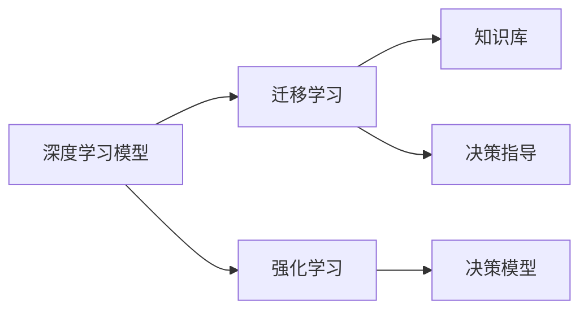

                 

# 深度思考:问题解决的利器

## 1. 背景介绍

### 1.1 问题由来
深度思考，这一概念在人工智能和认知科学领域内具有广泛的应用。在AI领域，深度思考被视为实现复杂问题解决的关键工具。无论是在自然语言处理、计算机视觉、机器人学等领域，还是在大数据、云计算、区块链等热点领域，深度思考都扮演着不可或缺的角色。深度思考不仅有助于提高问题解决效率，还能提升模型的鲁棒性和泛化能力。

### 1.2 问题核心关键点
深度思考的核心理念是通过构建和利用深度学习模型，模拟人类大脑的复杂决策机制，实现对问题的高效分析和解决。其主要步骤如下：

1. **数据收集**：获取与问题相关的数据集，作为模型训练的原始材料。
2. **模型设计**：选择合适的深度学习模型结构，并根据问题特点调整模型参数。
3. **模型训练**：使用训练数据对模型进行训练，优化模型参数以提高预测准确性。
4. **模型评估**：通过测试数据对训练好的模型进行评估，检测其在不同数据分布下的表现。
5. **模型部署**：将训练好的模型部署到实际应用场景中，解决具体问题。

深度思考方法的成功应用，使得AI技术在各行各业中得到了广泛应用，推动了技术进步和产业变革。

### 1.3 问题研究意义
研究深度思考方法，对于推动AI技术的不断发展，提高问题解决效率，具有重要意义：

1. **提升技术水平**：深度思考技术能帮助AI系统更准确地理解和处理复杂问题，提升模型性能。
2. **拓展应用范围**：深度思考方法的应用，能将AI技术推广到更多领域，加速行业数字化转型。
3. **提高问题解决效率**：深度思考技术可以自动化处理大量数据和复杂逻辑，缩短问题解决时间。
4. **增强模型泛化能力**：深度思考模型具备较强的适应能力，能在不同场景下实现泛化。
5. **推动理论研究**：深度思考的研究，有助于深入理解人类认知过程，推动认知科学的发展。

## 2. 核心概念与联系

### 2.1 核心概念概述

深度思考的核心概念包括深度学习模型、迁移学习、强化学习等。这些概念之间存在着密切的联系和相互作用，共同构成了深度思考的完整框架。

- **深度学习模型**：包括神经网络、卷积神经网络、递归神经网络等，是深度思考的基础。
- **迁移学习**：指通过在多个任务上训练模型，利用已有的知识解决新问题，提升模型泛化能力。
- **强化学习**：通过奖励机制指导模型学习，使其在特定环境中作出最优决策。

这些概念的联系主要体现在：深度学习模型通过迁移学习获取知识，而强化学习则进一步优化模型的决策能力。

### 2.2 核心概念原理和架构的 Mermaid 流程图



这个流程图展示了深度学习模型、迁移学习、强化学习之间的联系和作用。深度学习模型通过迁移学习获取知识，强化学习则利用知识指导决策模型的构建，最终形成有效的深度思考系统。

## 3. 核心算法原理 & 具体操作步骤
### 3.1 算法原理概述

深度思考的核心算法原理是利用深度学习模型构建问题解决器，通过迁移学习和强化学习机制，不断优化模型参数，提升模型的决策能力和泛化能力。其核心思想是：

1. **数据驱动**：利用大量标注数据进行模型训练，使模型能够从数据中学习到解决问题的关键特征。
2. **模型优化**：通过迭代训练和参数优化，使模型不断逼近问题的最佳解。
3. **决策优化**：利用强化学习机制，通过奖励机制指导模型学习，提升决策准确性。

### 3.2 算法步骤详解

深度思考的算法步骤通常包括以下几个关键步骤：

**Step 1: 数据收集和预处理**
- 收集与问题相关的标注数据集。
- 对数据进行清洗、标注和预处理，如去除噪声、数据增强等。

**Step 2: 模型设计和选择**
- 根据问题特点，选择合适的深度学习模型结构，如CNN、RNN、Transformer等。
- 确定模型的超参数，如学习率、批大小等。

**Step 3: 模型训练和优化**
- 使用训练数据对模型进行训练，优化模型参数。
- 通过交叉验证等技术，评估模型性能，调整模型超参数。

**Step 4: 迁移学习和知识融合**
- 利用迁移学习机制，在多个相关任务上训练模型，获取知识。
- 将获取的知识融合到当前任务中，提升模型性能。

**Step 5: 强化学习和决策优化**
- 利用强化学习机制，通过奖励机制指导模型学习，优化决策过程。
- 反复迭代训练和优化，直到达到满意的性能。

### 3.3 算法优缺点

深度思考算法的优点包括：

1. **高效性**：能够自动化处理大量数据和复杂逻辑，提高问题解决效率。
2. **泛化能力**：通过迁移学习和知识融合，模型具备较强的适应能力，能在不同场景下实现泛化。
3. **决策优化**：利用强化学习机制，提升模型决策的准确性和鲁棒性。

但深度思考算法也存在一些缺点：

1. **数据依赖**：需要大量的标注数据进行训练，数据获取成本较高。
2. **模型复杂性**：深度学习模型结构复杂，需要大量的计算资源。
3. **解释性不足**：深度模型通常缺乏可解释性，难以理解和调试。
4. **过拟合风险**：模型容易在训练数据上过拟合，泛化性能受到影响。

### 3.4 算法应用领域

深度思考算法在多个领域中得到了广泛应用，包括但不限于：

- **自然语言处理**：机器翻译、情感分析、文本生成等。
- **计算机视觉**：图像分类、目标检测、图像生成等。
- **机器人学**：路径规划、动作生成、人机交互等。
- **医疗领域**：医学影像分析、疾病预测、药物研发等。
- **金融领域**：市场分析、风险评估、投资策略等。

## 4. 数学模型和公式 & 详细讲解 & 举例说明

### 4.1 数学模型构建

深度思考的数学模型通常基于深度学习框架构建，如TensorFlow、PyTorch等。下面以神经网络模型为例，展示其数学模型构建过程。

假设输入数据为 $x \in \mathbb{R}^d$，模型参数为 $\theta$，输出为 $y \in \mathbb{R}^k$。神经网络的数学模型为：

$$
y = \sigma(Wx + b)
$$

其中，$W$ 为权重矩阵，$b$ 为偏置向量，$\sigma$ 为激活函数。

### 4.2 公式推导过程

神经网络的前向传播和反向传播过程如下：

**前向传播**：
$$
y = \sigma(Wx + b)
$$

**反向传播**：
$$
\frac{\partial L}{\partial \theta} = \frac{\partial L}{\partial y} \frac{\partial y}{\partial \theta}
$$

其中，$L$ 为损失函数，$y$ 为模型输出，$\theta$ 为模型参数。

### 4.3 案例分析与讲解

以图像分类任务为例，展示神经网络模型的训练和优化过程。假设我们有一个包含1000个类别的图像数据集，每张图像大小为 $28 \times 28$，共有60,000张图像。

**Step 1: 数据准备**
- 收集标注数据集。
- 对数据进行预处理，如归一化、数据增强等。

**Step 2: 模型设计**
- 选择卷积神经网络作为模型结构。
- 设置模型超参数，如学习率、批大小等。

**Step 3: 模型训练**
- 使用训练数据对模型进行训练，优化模型参数。
- 通过交叉验证等技术，评估模型性能，调整模型超参数。

**Step 4: 迁移学习和知识融合**
- 利用迁移学习机制，在多个相关任务上训练模型，获取知识。
- 将获取的知识融合到当前任务中，提升模型性能。

**Step 5: 强化学习和决策优化**
- 利用强化学习机制，通过奖励机制指导模型学习，优化决策过程。
- 反复迭代训练和优化，直到达到满意的性能。

## 5. 项目实践：代码实例和详细解释说明

### 5.1 开发环境搭建

在进行深度思考项目实践前，我们需要准备好开发环境。以下是使用Python进行TensorFlow开发的环境配置流程：

1. 安装Anaconda：从官网下载并安装Anaconda，用于创建独立的Python环境。

2. 创建并激活虚拟环境：
```bash
conda create -n tf-env python=3.8 
conda activate tf-env
```

3. 安装TensorFlow：
```bash
pip install tensorflow
```

4. 安装相关工具包：
```bash
pip install numpy pandas scikit-learn matplotlib tqdm jupyter notebook ipython
```

完成上述步骤后，即可在`tf-env`环境中开始深度思考项目实践。

### 5.2 源代码详细实现

下面以图像分类任务为例，展示使用TensorFlow进行深度思考项目开发的代码实现。

```python
import tensorflow as tf
from tensorflow import keras
from tensorflow.keras import layers
from tensorflow.keras.datasets import cifar10

# 加载数据集
(x_train, y_train), (x_test, y_test) = cifar10.load_data()

# 数据预处理
x_train = x_train / 255.0
x_test = x_test / 255.0

# 定义模型
model = keras.Sequential([
    layers.Conv2D(32, (3, 3), activation='relu', input_shape=(32, 32, 3)),
    layers.MaxPooling2D((2, 2)),
    layers.Conv2D(64, (3, 3), activation='relu'),
    layers.MaxPooling2D((2, 2)),
    layers.Flatten(),
    layers.Dense(64, activation='relu'),
    layers.Dense(10)
])

# 编译模型
model.compile(optimizer='adam',
              loss=tf.keras.losses.SparseCategoricalCrossentropy(from_logits=True),
              metrics=['accuracy'])

# 训练模型
model.fit(x_train, y_train, epochs=10, validation_data=(x_test, y_test))
```

以上就是使用TensorFlow进行图像分类任务深度思考项目开发的完整代码实现。可以看到，得益于TensorFlow的强大封装，我们可以用相对简洁的代码完成神经网络模型的构建和训练。

### 5.3 代码解读与分析

让我们再详细解读一下关键代码的实现细节：

**数据加载和预处理**：
- 使用`cifar10.load_data()`加载CIFAR-10数据集。
- 对图像数据进行归一化处理，将像素值缩放到[0,1]之间。

**模型定义**：
- 定义包含卷积层、池化层、全连接层的神经网络模型。
- 使用`Sequential`类按顺序构建模型。

**模型编译和训练**：
- 使用`model.compile()`编译模型，设置优化器、损失函数和评估指标。
- 使用`model.fit()`对模型进行训练，指定训练轮数和验证集。

可以看到，TensorFlow的API设计简洁高效，使得深度思考模型的开发和训练变得非常直观。开发者只需关注模型结构和训练过程，而不需要过多关注底层实现细节。

当然，工业级的系统实现还需考虑更多因素，如模型保存和部署、超参数调优、模型剪枝和压缩等。但核心的深度思考范式基本与此类似。

## 6. 实际应用场景

### 6.1 智能客服系统

基于深度思考的智能客服系统，可以广泛应用于企业的客户服务领域。传统客服往往需要配备大量人力，高峰期响应缓慢，且一致性和专业性难以保证。而使用深度思考模型构建的智能客服系统，可以7x24小时不间断服务，快速响应客户咨询，用自然流畅的语言解答各类常见问题。

在技术实现上，可以收集企业内部的历史客服对话记录，将问题和最佳答复构建成监督数据，在此基础上对深度思考模型进行训练。训练好的模型能够自动理解用户意图，匹配最合适的答案模板进行回复。对于客户提出的新问题，还可以接入检索系统实时搜索相关内容，动态组织生成回答。如此构建的智能客服系统，能大幅提升客户咨询体验和问题解决效率。

### 6.2 金融舆情监测

金融机构需要实时监测市场舆论动向，以便及时应对负面信息传播，规避金融风险。传统的人工监测方式成本高、效率低，难以应对网络时代海量信息爆发的挑战。基于深度思考的文本分类和情感分析技术，为金融舆情监测提供了新的解决方案。

具体而言，可以收集金融领域相关的新闻、报道、评论等文本数据，并对其进行主题标注和情感标注。在此基础上对深度思考模型进行微调，使其能够自动判断文本属于何种主题，情感倾向是正面、中性还是负面。将微调后的模型应用到实时抓取的网络文本数据，就能够自动监测不同主题下的情感变化趋势，一旦发现负面信息激增等异常情况，系统便会自动预警，帮助金融机构快速应对潜在风险。

### 6.3 个性化推荐系统

当前的推荐系统往往只依赖用户的历史行为数据进行物品推荐，无法深入理解用户的真实兴趣偏好。基于深度思考的个性化推荐系统，可以更好地挖掘用户行为背后的语义信息，从而提供更精准、多样的推荐内容。

在实践中，可以收集用户浏览、点击、评论、分享等行为数据，提取和用户交互的物品标题、描述、标签等文本内容。将文本内容作为模型输入，用户的后续行为（如是否点击、购买等）作为监督信号，在此基础上微调深度思考模型。微调后的模型能够从文本内容中准确把握用户的兴趣点。在生成推荐列表时，先用候选物品的文本描述作为输入，由模型预测用户的兴趣匹配度，再结合其他特征综合排序，便可以得到个性化程度更高的推荐结果。

### 6.4 未来应用展望

随着深度思考技术的发展，基于深度思考的智能系统将在更多领域得到应用，为各行各业带来变革性影响。

在智慧医疗领域，基于深度思考的医学影像分析、疾病预测、药物研发等应用将提升医疗服务的智能化水平，辅助医生诊疗，加速新药开发进程。

在智能教育领域，深度思考可应用于作业批改、学情分析、知识推荐等方面，因材施教，促进教育公平，提高教学质量。

在智慧城市治理中，深度思考可应用于城市事件监测、舆情分析、应急指挥等环节，提高城市管理的自动化和智能化水平，构建更安全、高效的未来城市。

此外，在企业生产、社会治理、文娱传媒等众多领域，基于深度思考的智能应用也将不断涌现，为经济社会发展注入新的动力。相信随着技术的日益成熟，深度思考方法将成为智能技术落地应用的重要范式，推动人工智能技术向更广阔的领域加速渗透。

## 7. 工具和资源推荐

### 7.1 学习资源推荐

为了帮助开发者系统掌握深度思考的理论基础和实践技巧，这里推荐一些优质的学习资源：

1. 《深度学习》课程：由斯坦福大学Andrew Ng教授主讲，深入浅出地介绍了深度学习的基本概念和原理。

2. 《TensorFlow实战》书籍：由TensorFlow官方团队撰写，全面介绍了TensorFlow的API和使用技巧，适合实战操作。

3. 《动手学深度学习》书籍：由李沐等人撰写，涵盖了深度学习的理论基础和实现细节，附带大量代码实现和实践案例。

4. Weights & Biases：模型训练的实验跟踪工具，可以记录和可视化模型训练过程中的各项指标，方便对比和调优。与主流深度学习框架无缝集成。

5. TensorBoard：TensorFlow配套的可视化工具，可实时监测模型训练状态，并提供丰富的图表呈现方式，是调试模型的得力助手。

通过对这些资源的学习实践，相信你一定能够快速掌握深度思考技术的精髓，并用于解决实际的复杂问题。

### 7.2 开发工具推荐

高效的开发离不开优秀的工具支持。以下是几款用于深度思考项目开发的常用工具：

1. TensorFlow：由Google主导开发的开源深度学习框架，生产部署方便，适合大规模工程应用。

2. PyTorch：基于Python的开源深度学习框架，灵活动态的计算图，适合快速迭代研究。

3. Weights & Biases：模型训练的实验跟踪工具，可以记录和可视化模型训练过程中的各项指标，方便对比和调优。

4. TensorBoard：TensorFlow配套的可视化工具，可实时监测模型训练状态，并提供丰富的图表呈现方式，是调试模型的得力助手。

5. Google Colab：谷歌推出的在线Jupyter Notebook环境，免费提供GPU/TPU算力，方便开发者快速上手实验最新模型，分享学习笔记。

合理利用这些工具，可以显著提升深度思考项目的开发效率，加快创新迭代的步伐。

### 7.3 相关论文推荐

深度思考技术的发展源于学界的持续研究。以下是几篇奠基性的相关论文，推荐阅读：

1. ImageNet Classification with Deep Convolutional Neural Networks：提出卷积神经网络，开启了深度学习在计算机视觉领域的应用。

2. Deep Learning：由Ian Goodfellow等人撰写，全面介绍了深度学习的理论基础和应用案例。

3. Deep Speech 2: End-to-End Speech Recognition in English and Mandarin：提出深度学习在语音识别中的应用，刷新了语音识别的SOTA。

4. AlphaGo Zero: Mastering the Game of Go without Human Knowledge：展示深度强化学习在围棋中的应用，证明了深度学习在复杂策略游戏中的巨大潜力。

这些论文代表了大深度思考技术的发展脉络。通过学习这些前沿成果，可以帮助研究者把握学科前进方向，激发更多的创新灵感。

## 8. 总结：未来发展趋势与挑战

### 8.1 总结

本文对深度思考技术进行了全面系统的介绍。首先阐述了深度思考的背景和意义，明确了深度思考在复杂问题解决中的独特价值。其次，从原理到实践，详细讲解了深度思考的数学模型和算法步骤，给出了深度思考项目开发的完整代码实例。同时，本文还广泛探讨了深度思考方法在智能客服、金融舆情、个性化推荐等多个行业领域的应用前景，展示了深度思考技术的巨大潜力。最后，本文精选了深度思考技术的各类学习资源，力求为读者提供全方位的技术指引。

通过本文的系统梳理，可以看到，深度思考技术正在成为AI领域的重要工具，极大地提升了问题解决的效率和效果。未来，伴随深度思考技术的不断发展，其应用范围将进一步拓展，为各行各业带来更多创新和变革。

### 8.2 未来发展趋势

展望未来，深度思考技术将呈现以下几个发展趋势：

1. **模型复杂性提升**：随着模型结构的不断优化，深度思考模型将变得越来越复杂，能够处理更加复杂的问题。

2. **数据驱动深入**：深度思考将更加依赖高质量的数据进行训练，数据驱动的深度思考模型将更加可靠。

3. **知识融合增强**：深度思考将更多地融合外部知识，如知识图谱、逻辑规则等，提升模型的泛化能力和决策能力。

4. **多模态融合**：深度思考将更多地融合多模态数据，如文本、图像、语音等，提升模型的综合能力。

5. **决策优化深化**：深度思考将更多地利用强化学习等优化方法，提升模型的决策能力。

以上趋势凸显了深度思考技术的广阔前景。这些方向的探索发展，必将进一步提升深度思考模型的性能和应用范围，为构建智能系统提供更强大的技术支持。

### 8.3 面临的挑战

尽管深度思考技术已经取得了显著成就，但在迈向更加智能化、普适化应用的过程中，它仍面临着诸多挑战：

1. **数据获取成本高**：高质量的标注数据获取成本较高，难以大规模推广。

2. **模型资源消耗大**：深度思考模型通常需要大量的计算资源，部署和训练成本较高。

3. **模型解释性不足**：深度思考模型通常缺乏可解释性，难以理解和调试。

4. **过拟合风险**：深度思考模型容易在训练数据上过拟合，泛化性能受到影响。

5. **安全性和隐私问题**：深度思考模型涉及大量个人数据，如何保障数据安全性和隐私性是一个重要问题。

6. **伦理和法律问题**：深度思考模型的使用涉及伦理和法律问题，需要制定相应的规范和标准。

这些挑战需要深度思考技术的开发者和用户共同努力，积极应对并寻求突破，才能推动深度思考技术向更成熟、更普适的方向发展。

### 8.4 研究展望

面对深度思考技术所面临的种种挑战，未来的研究需要在以下几个方面寻求新的突破：

1. **无监督学习**：探索无监督和半监督学习，摆脱对大规模标注数据的依赖，利用自监督学习、主动学习等方法，实现更加灵活高效的深度思考。

2. **多任务学习**：研究多任务学习，提升模型在不同任务上的泛化能力，增强模型的适应性。

3. **模型压缩**：开发模型压缩技术，减小模型尺寸，提高推理速度和计算效率，适应更广泛的应用场景。

4. **解释性增强**：研究深度思考模型的解释性增强方法，提升模型的可解释性和可调试性。

5. **安全性保障**：研究深度思考模型的安全性保障方法，确保模型的公平性和透明性，避免有害输出。

这些研究方向的探索，必将引领深度思考技术迈向更高的台阶，为构建安全、可靠、可解释、可控的智能系统铺平道路。面向未来，深度思考技术还需要与其他人工智能技术进行更深入的融合，如知识表示、因果推理、强化学习等，多路径协同发力，共同推动深度思考技术的发展。

## 9. 附录：常见问题与解答

**Q1：深度思考是否适用于所有复杂问题？**

A: 深度思考在大多数复杂问题上都能取得不错的效果，特别是对于数据量较大的问题。但对于一些特定领域的复杂问题，如医疗、法律等，仅仅依靠通用数据集进行训练可能难以很好地适应。此时需要在特定领域的数据集上进一步训练，才能获得理想效果。

**Q2：如何选择合适的深度学习模型？**

A: 选择合适的深度学习模型通常需要考虑以下几个因素：
1. 数据类型：如文本、图像、声音等。
2. 问题类型：如分类、回归、生成等。
3. 计算资源：如GPU、TPU等。
4. 可解释性需求：如是否需要模型可解释。

根据问题类型和数据类型选择合适的深度学习模型结构，如CNN、RNN、Transformer等，同时考虑计算资源和模型可解释性需求。

**Q3：如何缓解深度思考模型中的过拟合问题？**

A: 过拟合是深度思考模型面临的主要挑战，尤其是在训练数据较少的情况下。缓解过拟合的方法包括：
1. 数据增强：通过数据增强技术，如旋转、缩放、翻转等，增加训练集多样性。
2. 正则化：使用L2正则、Dropout等技术，防止模型过拟合。
3. 早停策略：在验证集性能不再提升时，停止训练，避免过拟合。

这些方法往往需要根据具体问题进行灵活组合，以达到最佳的缓解过拟合的效果。

**Q4：深度思考模型在落地部署时需要注意哪些问题？**

A: 将深度思考模型转化为实际应用，还需要考虑以下因素：
1. 模型裁剪：去除不必要的层和参数，减小模型尺寸，加快推理速度。
2. 量化加速：将浮点模型转为定点模型，压缩存储空间，提高计算效率。
3. 服务化封装：将模型封装为标准化服务接口，便于集成调用。
4. 弹性伸缩：根据请求流量动态调整资源配置，平衡服务质量和成本。
5. 监控告警：实时采集系统指标，设置异常告警阈值，确保服务稳定性。

深度思考模型的落地部署需要考虑多个方面，确保模型的稳定性和可扩展性，才能真正发挥其价值。

**Q5：如何提高深度思考模型的可解释性？**

A: 提高深度思考模型的可解释性是当前研究的一个重要方向。以下是一些提高可解释性的方法：
1. 可视化技术：使用可视化工具，如图像、文本、热力图等，展示模型内部结构和工作机制。
2. 简化模型：通过剪枝、量化等技术，简化模型结构，提高可解释性。
3. 模型融合：将深度思考模型与符号化模型（如规则引擎、知识图谱）进行融合，增强模型的可解释性。
4. 交互式学习：通过用户交互，引导模型输出可解释的结果，提升模型的透明度和可理解性。

这些方法可以综合应用，提升深度思考模型的可解释性，帮助用户更好地理解模型的决策过程。

---

作者：禅与计算机程序设计艺术 / Zen and the Art of Computer Programming

