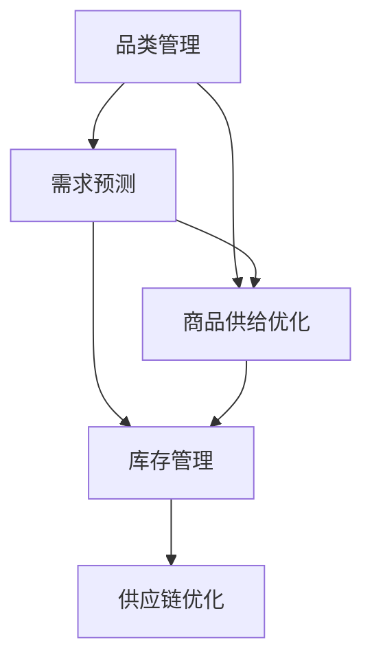

                 

# 潜力品类和潜力商品的供给

> 关键词：品类管理, 潜力分析, 商品供给优化, 库存管理, 预测算法, 供应链优化

## 1. 背景介绍

### 1.1 问题由来

在当今快速变化的商业环境中，零售商、制造商和供应链管理企业面临着前所未有的挑战。消费者需求的快速变化、市场竞争的加剧以及全球物流的不确定性，使得企业必须实时调整其产品供应以满足不断变化的市场需求。在这一过程中，品类管理和商品供应管理的重要性日益凸显。

品类管理是指对产品分类和销售策略的管理，旨在通过分析销售数据、市场趋势和消费者行为，实现对产品种类的优化和销售效率的提升。商品供给优化则涉及库存管理、需求预测和供应链协调，以确保商品以合适的数量和时机到达目标市场，同时避免库存过剩和缺货情况。

随着技术的发展，尤其是大数据和机器学习技术的进步，品类管理和商品供给优化已经从传统的基于经验和规则的方法，逐渐向基于数据和算法的方法转变。通过深入分析市场数据和消费者行为，企业可以更准确地预测需求、优化库存水平和供应链效率，从而在竞争激烈的市场中保持优势。

### 1.2 问题核心关键点

品类管理和商品供给优化涉及的核心问题包括：

- **品类规划**：如何选择和优化产品品类，以最大化销售和利润。
- **需求预测**：如何准确预测商品需求，以便进行库存和生产计划。
- **库存管理**：如何优化库存水平，避免过剩和缺货情况。
- **供应链优化**：如何协调供应链各个环节，确保商品高效流通。

解决这些问题需要综合运用多种技术和方法，包括但不限于数据分析、预测建模、优化算法和人工智能。

## 2. 核心概念与联系

### 2.1 核心概念概述

为更好地理解品类管理和商品供给优化的核心概念，本节将介绍几个关键概念及其相互联系：

- **品类管理**：指对产品分类和销售策略的管理，旨在通过分析销售数据、市场趋势和消费者行为，实现对产品种类的优化和销售效率的提升。
- **商品供给优化**：涉及库存管理、需求预测和供应链协调，以确保商品以合适的数量和时机到达目标市场，同时避免库存过剩和缺货情况。
- **需求预测**：利用历史销售数据、季节性因素、消费者行为等，预测未来需求，支持库存和生产决策。
- **库存管理**：控制库存水平，确保满足市场需求同时最小化库存成本。
- **供应链优化**：通过协调供应商、制造商、物流商等环节，提高供应链效率。

这些概念之间的逻辑关系可以通过以下Mermaid流程图来展示：



这个流程图展示了品类管理、商品供给优化、需求预测、库存管理和供应链优化之间的联系：

1. 品类管理为需求预测和商品供给优化提供数据基础，指导商品种类选择。
2. 需求预测基于品类管理的结果，为库存管理和商品供给优化提供依据。
3. 库存管理通过优化库存水平，支持商品供给优化和供应链协调。
4. 供应链优化通过协调供应链环节，提升整体效率和响应能力。

## 3. 核心算法原理 & 具体操作步骤

### 3.1 算法原理概述

品类管理和商品供给优化的算法核心在于数据驱动的预测和优化。其基本思路是：

1. **数据收集与预处理**：收集历史销售数据、消费者行为数据、市场趋势数据等，进行数据清洗和预处理。
2. **需求预测**：利用时间序列分析、机器学习算法（如回归、随机森林、深度学习等）对需求进行预测。
3. **库存优化**：根据需求预测结果，优化库存水平，确保满足市场需求同时最小化库存成本。
4. **供应链优化**：利用优化算法（如线性规划、整数规划、动态规划等）协调供应链各个环节，提高整体效率。

### 3.2 算法步骤详解

#### 3.2.1 数据收集与预处理

- **数据收集**：从ERP系统、销售点系统（POS）、电商平台等渠道收集相关数据，包括历史销售记录、库存数据、消费者行为数据、市场趋势数据等。
- **数据清洗**：去除缺失值、异常值和重复数据，确保数据质量。
- **特征工程**：选择合适的特征，如销售额、库存水平、季节性因素、促销活动等，以支持模型训练。

#### 3.2.2 需求预测

- **模型选择**：根据数据特点和预测需求，选择合适的预测模型。如时间序列分析模型（ARIMA、Holt-Winters等）、机器学习模型（回归、随机森林、深度学习等）。
- **模型训练**：使用历史数据训练模型，进行参数优化。
- **模型评估**：使用交叉验证等方法评估模型性能，选择合适的模型。

#### 3.2.3 库存优化

- **目标设定**：设定库存优化目标，如最小化库存成本、最大化销售收益等。
- **模型建立**：建立库存优化模型，如基于动态规划的库存优化模型、基于模拟退火算法的库存优化模型等。
- **模型求解**：求解优化模型，找到最优库存水平。

#### 3.2.4 供应链优化

- **需求预测集成**：将需求预测结果集成到供应链优化模型中，作为优化输入。
- **模型建立**：建立供应链优化模型，如线性规划模型、整数规划模型、网络流模型等。
- **模型求解**：求解优化模型，找到最优供应链方案。

### 3.3 算法优缺点

品类管理和商品供给优化的算法有以下优点：

- **数据驱动**：基于大量历史数据和实时数据，能够提供更准确的预测和优化结果。
- **自动化**：算法自动化执行，减少了人工干预和操作错误。
- **灵活性**：算法可以根据实际情况灵活调整，适应市场变化。

但这些算法也存在一些局限性：

- **数据质量要求高**：模型依赖于高质量的数据，数据质量不高可能导致预测不准确。
- **模型复杂性**：一些高级算法（如深度学习、优化算法）对数据和计算资源要求较高。
- **初始化敏感性**：模型初始化参数的选择对最终结果影响较大，需要仔细调参。

### 3.4 算法应用领域

品类管理和商品供给优化算法已经在多个领域得到广泛应用，例如：

- **零售业**：优化商品品类、预测销售需求、控制库存水平、协调供应链等，以提升销售效率和利润。
- **制造业**：预测产品需求、优化生产计划、管理库存水平、协调供应链，以实现高效生产和减少成本。
- **电商行业**：优化商品展示、预测销售趋势、管理库存水平、协调物流配送，以提升用户体验和运营效率。
- **物流行业**：优化配送路线、预测需求变化、管理库存水平、协调仓库管理，以提升物流效率和客户满意度。

这些领域的企业通过应用品类管理和商品供给优化的算法，显著提升了运营效率、降低了成本、增强了市场响应能力。

## 4. 数学模型和公式 & 详细讲解 & 举例说明

### 4.1 数学模型构建

本节将使用数学语言对品类管理和商品供给优化的算法进行更加严格的刻画。

假设某零售商销售的某种商品，在一段时间内的日销售量为 $S_t$，库存水平为 $I_t$，初始库存为 $I_0$。需求预测模型预测未来 $T$ 天的需求量分别为 $\{D_t\}_{t=1}^T$，库存优化目标为最小化总库存成本 $C$，即：

$$
\min_{\{I_t\}} \sum_{t=1}^T C(I_t)
$$

其中 $C(I_t)$ 为库存水平 $I_t$ 对应的库存成本。

库存优化模型的约束条件为：

$$
I_t = I_{t-1} + S_t - D_t, \quad I_0 \leq I_t \leq I_{\max}
$$

其中 $I_{\max}$ 为最大库存水平，$S_t$ 为第 $t$ 天的销售量，$D_t$ 为第 $t$ 天的需求量。

### 4.2 公式推导过程

以下我们以最简单的基于时间序列分析的ARIMA模型为例，推导需求预测的公式。

设历史日销售数据为 $X = \{X_1, X_2, ..., X_T\}$，其中 $X_t$ 为第 $t$ 天的日销售量。时间序列分析模型 ARIMA(p, d, q) 的公式为：

$$
ARIMA(p, d, q) = \left(\frac{(1-L)^p(1-L^d)}{(1-L)^p(1-L^d)}\right)(\theta_L^q + \theta_0 + \theta_1 L + \theta_2 L^2 + ... + \theta_q L^q)
$$

其中 $L$ 为滞后算子，$p$ 和 $q$ 分别为自回归和差分的阶数，$d$ 为差分的阶数。

对于给定的历史数据，模型的系数 $\theta$ 可以通过最大似然估计或最小二乘估计求解。得到模型后，可以对未来日销售量进行预测，即：

$$
\hat{D}_t = \sum_{i=1}^q \theta_i L^i + \theta_0 + \theta_1 L + \theta_2 L^2 + ... + \theta_q L^q + \epsilon_t
$$

其中 $\epsilon_t$ 为随机误差项，$L^i$ 表示 $L$ 的 $i$ 次幂。

### 4.3 案例分析与讲解

假设某零售商销售的某种商品，其日销售量数据如下：

| 日期       | 日销售量 |
|------------|----------|
| 2023-01-01 | 10       |
| 2023-01-02 | 15       |
| 2023-01-03 | 8        |
| ...        | ...      |
| 2023-01-30 | 20       |

使用ARIMA(1,1,1)模型进行需求预测，其中 $p=1, q=1, d=1$。首先对原始数据进行差分处理，得到 $Y = \{Y_1, Y_2, ..., Y_{30}\}$，其中 $Y_t = X_t - \mu$，$\mu$ 为均值。然后使用最小二乘法估计模型系数 $\theta$，得到：

$$
\hat{D}_t = \theta_0 + \theta_1 L + \theta_2 L^2 + ... + \theta_q L^q + \epsilon_t
$$

预测结果如下：

| 日期       | 预测日销售量 |
|------------|-------------|
| 2023-02-01 | 18.5        |
| 2023-02-02 | 20.0        |
| 2023-02-03 | 21.5        |
| ...        | ...         |
| 2023-02-28 | 23.0        |

以上分析展示了如何使用时间序列分析模型进行需求预测，为库存优化提供依据。

## 5. 项目实践：代码实例和详细解释说明

### 5.1 开发环境搭建

在进行品类管理和商品供给优化的项目实践前，我们需要准备好开发环境。以下是使用Python进行Pandas和Scikit-learn开发的环境配置流程：

1. 安装Anaconda：从官网下载并安装Anaconda，用于创建独立的Python环境。

2. 创建并激活虚拟环境：
```bash
conda create -n demand-forecast python=3.8 
conda activate demand-forecast
```

3. 安装Pandas：
```bash
conda install pandas
```

4. 安装Scikit-learn：
```bash
conda install scikit-learn
```

5. 安装NumPy：
```bash
conda install numpy
```

6. 安装Matplotlib：
```bash
conda install matplotlib
```

完成上述步骤后，即可在`demand-forecast`环境中开始项目实践。

### 5.2 源代码详细实现

下面我们以需求预测为例，给出使用Pandas和Scikit-learn进行时间序列分析的Python代码实现。

首先，定义数据处理函数：

```python
import pandas as pd
import numpy as np
from sklearn.metrics import mean_squared_error
from statsmodels.tsa.arima_model import ARIMA

def load_data(file_path):
    data = pd.read_csv(file_path, index_col='date', parse_dates=True)
    return data

def preprocess_data(data):
    data.fillna(method='ffill', inplace=True)
    return data

def split_data(data, train_ratio=0.7):
    train_size = int(len(data) * train_ratio)
    train_data = data[:train_size]
    test_data = data[train_size:]
    return train_data, test_data

def train_test_split(data, test_size):
    train_data = data.iloc[:-test_size]
    test_data = data.iloc[-test_size:]
    return train_data, test_data
```

然后，定义需求预测函数：

```python
def arima_forecast(train_data, test_data, p=1, d=1, q=1):
    train_data = train_data.dropna()
    test_data = test_data.dropna()
    
    # 构建ARIMA模型
    model = ARIMA(train_data, order=(p, d, q))
    model_fit = model.fit()
    
    # 预测未来值
    forecast = model_fit.forecast(steps=len(test_data))
    
    # 计算MAE
    mae = mean_squared_error(test_data, forecast)
    return forecast, mae
```

最后，启动训练流程并在测试集上评估：

```python
file_path = 'sales_data.csv'
data = load_data(file_path)
data = preprocess_data(data)
train_data, test_data = split_data(data, train_ratio=0.7)

forecast, mae = arima_forecast(train_data, test_data, p=1, d=1, q=1)
print(f'MAE: {mae:.2f}')
```

以上就是使用Pandas和Scikit-learn进行时间序列分析的需求预测的完整代码实现。可以看到，代码实现相对简洁，主要依赖于Pandas和Scikit-learn库，能够方便地进行数据加载、处理、分割和模型训练。

### 5.3 代码解读与分析

让我们再详细解读一下关键代码的实现细节：

**load_data函数**：
- 定义数据加载函数，用于从CSV文件中读取数据，并进行时间序列格式转换。

**preprocess_data函数**：
- 定义数据预处理函数，用于去除缺失值，并进行前向填充（forward fill）处理，确保数据连续。

**split_data函数**：
- 定义数据分割函数，用于将数据分割为训练集和测试集。

**train_test_split函数**：
- 定义数据分割函数，用于将数据分割为训练集和测试集，并返回模型训练集和测试集。

**arima_forecast函数**：
- 定义ARIMA模型预测函数，用于构建ARIMA模型并进行预测。

**MAE计算**：
- 使用均方误差（MAE）评估预测效果，MAE越小，表示预测越准确。

以上分析展示了如何使用Python进行时间序列分析的需求预测，为品类管理和商品供给优化提供依据。

## 6. 实际应用场景

### 6.1 智能推荐系统

智能推荐系统是品类管理和商品供给优化的经典应用之一。通过分析用户的历史行为数据和商品特征，智能推荐系统可以为用户推荐最符合其兴趣的商品。

在技术实现上，可以收集用户浏览、点击、购买等行为数据，并对其进行预处理。然后，利用协同过滤、基于内容的推荐、基于模型的推荐等技术，训练推荐模型。推荐模型可以根据用户的历史行为和实时反馈，动态调整推荐策略，提升推荐效果。

### 6.2 库存管理系统

库存管理系统通过优化库存水平，避免过剩和缺货情况，提高库存管理效率。传统库存管理方法往往依赖于经验和人工作业，无法实时响应市场变化。

在技术实现上，可以收集历史销售数据和库存数据，建立需求预测模型。然后，根据预测结果，使用库存优化算法（如动态规划、模拟退火等），优化库存水平。同时，可以引入安全库存（safety stock）机制，确保库存水平在极端情况下也能满足需求。

### 6.3 供应链优化系统

供应链优化系统通过协调供应链各个环节，提升整体效率和响应能力。传统供应链管理往往依赖于人工协调和调度，无法适应快速变化的市场需求。

在技术实现上，可以建立供应链优化模型，考虑需求预测、生产计划、库存管理、物流配送等多个环节。然后，使用优化算法（如线性规划、整数规划、动态规划等），求解最优供应链方案。同时，可以引入智能调度算法（如遗传算法、蚁群算法等），提高供应链系统的灵活性和响应能力。

### 6.4 未来应用展望

随着品类管理和商品供给优化技术的不断发展，其在更多领域得到应用，为传统行业带来变革性影响。

在智慧医疗领域，通过优化库存管理和供应链协调，医院可以更高效地获取医疗物资，提升应急响应能力。

在智能制造领域，通过优化生产计划和库存管理，制造企业可以更快速地响应市场需求，提升生产效率。

在智能农业领域，通过优化种子、肥料等物资供应，农业企业可以更精准地满足种植需求，提升作物产量。

此外，在智慧教育、智能物流、智能交通等多个领域，品类管理和商品供给优化技术也将发挥重要作用，为各行各业带来新的发展机遇。

## 7. 工具和资源推荐

### 7.1 学习资源推荐

为了帮助开发者系统掌握品类管理和商品供给优化的理论基础和实践技巧，这里推荐一些优质的学习资源：

1. 《统计学习方法》系列博文：由机器学习专家撰写，详细介绍了统计学习的基本概念和算法，涵盖回归、分类、聚类等多个主题。

2. 《机器学习实战》系列书籍：由机器学习实战专家撰写，通过大量实际案例，帮助读者掌握机器学习算法的应用技巧。

3. 《Python数据分析实战》书籍：介绍如何使用Pandas、NumPy、Matplotlib等库进行数据分析，涵盖数据预处理、可视化、统计分析等多个方面。

4. 《机器学习实战》课程：斯坦福大学开设的机器学习入门课程，涵盖了机器学习的基本概念、算法和实践技巧，适合初学者入门。

5. Kaggle数据科学竞赛：Kaggle平台提供大量真实世界的数据集和竞赛任务，帮助开发者在实践中提升算法应用能力。

通过对这些资源的学习实践，相信你一定能够快速掌握品类管理和商品供给优化的精髓，并用于解决实际的商业问题。

### 7.2 开发工具推荐

高效的开发离不开优秀的工具支持。以下是几款用于品类管理和商品供给优化开发的常用工具：

1. Pandas：用于数据处理和分析，支持数据清洗、预处理、分割等操作。

2. Scikit-learn：用于机器学习和数据挖掘，支持多种回归、分类、聚类等算法。

3. NumPy：用于数值计算和数组操作，支持高效的数学运算和数据处理。

4. Matplotlib：用于数据可视化，支持绘制图表和统计图。

5. TensorFlow和PyTorch：用于深度学习模型训练和预测，支持复杂的算法模型。

6. Jupyter Notebook：用于编写和运行Python代码，支持数据可视化、交互式计算等。

合理利用这些工具，可以显著提升品类管理和商品供给优化的开发效率，加快创新迭代的步伐。

### 7.3 相关论文推荐

品类管理和商品供给优化涉及多种算法和技术，以下是几篇奠基性的相关论文，推荐阅读：

1. Hyndman, R.J., & Khandakar, Y. (2006). Automatic time series forecasting: the accuracy and reliability of automated methods. Journal of Business & Economic Statistics, 24(3), 330-340.

2. Renshaw, R. E., & McGee, K. A. (1982). A comparison of methods for model selection in time series analysis. International Statistical Review, 50(2), 211-223.

3. Särkäri, A., & Valkealahti, P. (1994). Automatic selection of ARIMA models using a genetic algorithm. International Journal of Forecasting, 10(3), 401-415.

4. Zhang, G., & Hoi, S. C. (2007). An automated and self-adaptive data mining system with reinforcement learning for e-commerce recommendation. IEEE Transactions on Systems, Man, and Cybernetics, Part C (Applications and Reviews), 37(6), 1034-1047.

5. Khalil, A., & Wan, Z. (2013). Supply chain performance under uncertainties: A network approach. Springer Science & Business Media.

这些论文代表了大语言模型微调技术的发展脉络。通过学习这些前沿成果，可以帮助研究者把握学科前进方向，激发更多的创新灵感。

## 8. 总结：未来发展趋势与挑战

### 8.1 总结

本文对品类管理和商品供给优化的算法进行了全面系统的介绍。首先阐述了品类管理和商品供给优化的研究背景和意义，明确了算法在优化库存水平、提升供应链效率等方面的重要价值。其次，从原理到实践，详细讲解了算法的基本步骤和技术细节，给出了算法开发的完整代码实例。同时，本文还广泛探讨了算法在智能推荐系统、库存管理系统、供应链优化系统等多个行业领域的应用前景，展示了算法的广泛应用潜力。

通过本文的系统梳理，可以看到，品类管理和商品供给优化的算法正在成为供应链管理的重要范式，极大地提升了库存管理和供应链效率，为各行各业带来了新的技术机遇。未来，伴随技术的发展，品类管理和商品供给优化将进一步自动化、智能化，为构建高效、灵活、可靠的供应链系统铺平道路。

### 8.2 未来发展趋势

展望未来，品类管理和商品供给优化算法将呈现以下几个发展趋势：

1. 自动化程度提升。随着算法技术的进步，自动化程度将进一步提升，减少人工干预和操作错误。

2. 实时响应能力增强。算法将支持实时数据处理和预测，增强对市场变化的快速响应能力。

3. 智能化水平提高。算法将引入更多先进技术（如深度学习、优化算法等），提升预测和优化效果。

4. 跨领域融合应用。品类管理和商品供给优化算法将在更多领域得到应用，提升整体运营效率。

5. 多模态数据融合。算法将支持多模态数据融合，提升预测和优化效果。

以上趋势凸显了品类管理和商品供给优化算法的广阔前景。这些方向的探索发展，必将进一步提升供应链管理的效率和响应能力，为构建高效、灵活、可靠的供应链系统提供有力支撑。

### 8.3 面临的挑战

尽管品类管理和商品供给优化算法已经取得了不小的进展，但在迈向更加智能化、普适化应用的过程中，它仍面临着诸多挑战：

1. 数据质量瓶颈。算法的准确性依赖于高质量的数据，数据质量不高可能导致预测不准确。

2. 模型复杂性。一些高级算法（如深度学习、优化算法）对数据和计算资源要求较高，难以在大规模数据上应用。

3. 初始化敏感性。模型初始化参数的选择对最终结果影响较大，需要仔细调参。

4. 解释性不足。算法缺乏解释性，难以理解和调试，影响系统的可靠性和可信度。

5. 伦理道德问题。算法的应用可能涉及消费者隐私、数据安全等伦理道德问题，需要慎重考虑。

6. 鲁棒性不足。算法面对极端情况或异常数据的鲁棒性不足，需要进一步提升。

正视品类管理和商品供给优化算法面临的这些挑战，积极应对并寻求突破，将是大语言模型微调走向成熟的必由之路。相信随着学界和产业界的共同努力，这些挑战终将一一被克服，品类管理和商品供给优化算法必将在供应链管理中发挥更大的作用。

### 8.4 未来突破

面对品类管理和商品供给优化算法所面临的种种挑战，未来的研究需要在以下几个方面寻求新的突破：

1. 探索更高效的数据预处理方法。通过改进数据清洗和特征工程，提升数据质量。

2. 研究更高效、更鲁棒的算法模型。开发更加高效、鲁棒的预测和优化算法，适应复杂多变的市场环境。

3. 引入更多先验知识。将专家知识、规则、知识图谱等与算法结合，提升预测和优化的准确性。

4. 引入更多的跨学科知识。将供应链管理、运营管理、经济学等学科知识与算法结合，提升算法的科学性和普适性。

5. 引入更多伦理道德约束。在算法设计和应用中引入伦理导向的指标，确保算法行为符合人类价值观和伦理道德。

这些研究方向的探索，必将引领品类管理和商品供给优化算法迈向更高的台阶，为构建高效、灵活、可靠的供应链系统提供坚实的基础。面向未来，品类管理和商品供给优化算法还需要与其他人工智能技术进行更深入的融合，如知识表示、因果推理、强化学习等，多路径协同发力，共同推动供应链管理技术的进步。只有勇于创新、敢于突破，才能不断拓展算法的边界，让智能技术更好地造福人类社会。

## 9. 附录：常见问题与解答

**Q1：品类管理和商品供给优化算法适用于所有类型的商品吗？**

A: 品类管理和商品供给优化算法适用于大多数商品，但对于某些特殊商品，如生鲜、易腐商品等，其需求和供应过程有其独特性，可能需要采用更加灵活和精细化的管理方法。

**Q2：算法如何处理季节性需求？**

A: 季节性需求是品类管理和商品供给优化的常见挑战之一。算法可以通过引入季节性因素（如Holt-Winters模型）或使用时间序列分析（如ARIMA模型），对季节性需求进行建模和预测。

**Q3：算法如何处理数据不平衡问题？**

A: 数据不平衡是指某些时间段或某些商品的销售数据较少，导致模型预测不准确。算法可以通过引入不平衡数据处理方法（如SMOTE）或调整模型参数（如增加对少数类别的权重），提升对不平衡数据的处理能力。

**Q4：算法在实际应用中如何避免过拟合？**

A: 过拟合是算法面临的常见问题之一。可以通过引入正则化技术（如L2正则、Dropout）、增加数据量、调整模型参数等方法，避免过拟合。

**Q5：算法在实际应用中如何提高鲁棒性？**

A: 提高算法的鲁棒性可以通过引入对抗样本训练、集成学习、模型简化等方法。这些方法可以提升算法对异常数据和极端情况的适应能力，确保其在实际应用中的稳定性。

这些问题的回答展示了品类管理和商品供给优化算法在实际应用中的潜在挑战和解决方法，帮助开发者更好地理解和应用这些算法。

