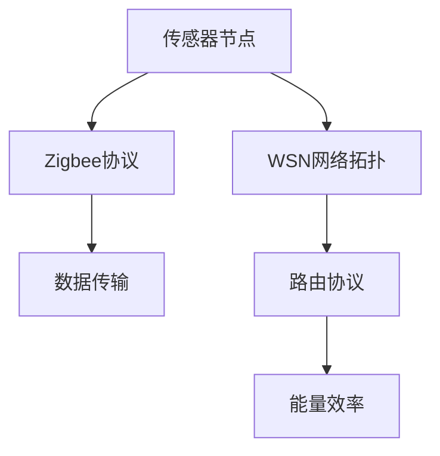

                 

## 1. 背景介绍

### 1.1 问题由来

物联网（Internet of Things，IoT）是当今信息社会的重要组成部分，它通过连接各种智能设备，实现数据收集、传输和处理，从而提供更为高效、智能的服务。Zigbee作为物联网领域的一个重要无线通信协议，因其低功耗、低成本、高安全性和低传输速率等特点，被广泛应用于各种传感器设备中。

在物联网的众多应用场景中，传感器设备用于收集环境数据（如温度、湿度、气体浓度等），并上传至云平台进行进一步处理。这些传感器设备往往位于较偏远或资源受限的环境中，因此对能源消耗和通信开销有严格的要求。Zigbee协议因其这些特点，成为了物联网中常用的传感器数据传输协议之一。

### 1.2 问题核心关键点

本文将详细介绍Zigbee协议的基本原理和应用，并探讨其如何与物联网技术相结合，实现高效的数据采集和传输。我们将深入解析Zigbee协议的架构和通信机制，探讨其优缺点，并结合实际案例，展示Zigbee传感器在物联网中的应用。

## 2. 核心概念与联系

### 2.1 核心概念概述

物联网（IoT）：通过连接各种智能设备，实现数据的收集、传输和处理，从而提供更为高效、智能的服务。

Zigbee：一种低功耗、低成本、高安全性的无线通信协议，常用于物联网中的传感器数据传输。

无线传感器网络（WSN）：由大量传感器节点组成的自组织网络，用于收集和传输环境数据。

网络拓扑：传感器节点在网络中的分布和连接方式，影响数据传输的效率和可靠性。

路由协议：用于数据传输的路径选择和路由管理，保证数据传输的稳定性和高效性。

能量效率：传感器节点电池的能耗和网络的整体能耗，对物联网的长期稳定运行至关重要。

### 2.2 核心概念原理和架构的 Mermaid 流程图



## 3. 核心算法原理 & 具体操作步骤

### 3.1 算法原理概述

Zigbee协议基于IEEE 802.15.4标准，采用CSMA-CA（载波监听多路访问/冲突避免）机制，通过协作式通信确保数据传输的可靠性。其核心思想是：每个传感器节点能够在一定范围内直接与其它节点通信，不需要中心控制节点，从而降低能耗和延迟。

在Zigbee网络中，每个节点都有一个唯一的地址，并通过广播方式发送数据。节点通过监听信道和冲突避免机制，确保数据传输的稳定性。节点之间可以直接进行数据通信，也可以通过多跳路由方式传输数据到基站（Coordinator），最终上传至云平台。

### 3.2 算法步骤详解

1. **节点初始化**：传感器节点启动后，通过随机选择初始信道和设置参数，开始监听信道。

2. **数据发送**：节点有数据要发送时，首先通过竞争机制（CSMA-CA）获取信道，然后发送数据。

3. **数据接收**：节点监听信道，如果检测到数据信号，则进行接收和解码。

4. **路由选择**：数据在网络中传输时，通过路由协议选择最佳路径，避免数据丢失。

5. **能量管理**：节点通过休眠和唤醒机制，管理自身能耗，延长电池寿命。

6. **数据聚合**：基站（Coordinator）对数据进行聚合处理，并上传至云平台。

### 3.3 算法优缺点

**优点**：
- 低功耗：节点通过休眠机制，降低能耗，适用于资源受限的环境。
- 低成本：硬件成本较低，使得传感器设备更加普及。
- 高安全性：采用安全加密机制，保障数据传输的安全性。

**缺点**：
- 传输速率低：最大传输速率为250kbps，不适用于需要高速传输数据的场景。
- 覆盖范围小：节点间的通信范围有限，需要多跳路由才能传输数据。
- 复杂性较高：路由协议和网络拓扑设计较为复杂，需要深入理解。

### 3.4 算法应用领域

Zigbee协议在物联网中的主要应用包括：
- 智能家居：用于家庭安防、照明控制等场景，实现智能家居设备的互联互通。
- 环境监测：用于空气质量、水质、土壤等环境的监测，提供实时数据支持。
- 工业监控：用于生产线上的设备监控、物料跟踪等，提升生产效率和质量。
- 医疗健康：用于患者监控、远程医疗等，提高医疗服务的便捷性和安全性。

## 4. 数学模型和公式 & 详细讲解 & 举例说明

### 4.1 数学模型构建

Zigbee协议的数学模型主要涉及数据传输、能量管理、路由选择等方面。下面我们将以数据传输为例，介绍相关数学模型的构建。

**数据传输模型**：
假设传感器节点在网络中发送数据到基站，设发送的数据量为 $D$，节点传输速率 $R$，发送时间 $T_{send}$，接收时间 $T_{recv}$，信道带宽 $B$，信道噪声功率 $N_0$。则数据传输的时间 $T_{trans}$ 可表示为：
$$
T_{trans} = T_{send} + T_{recv} = \frac{D}{R} + \frac{D}{R} = 2 \cdot \frac{D}{R}
$$

其中，$T_{send}$ 和 $T_{recv}$ 分别为数据传输和接收的时间，$R$ 为传输速率。

**能量管理模型**：
传感器节点的能耗由发送、接收、休眠等部分组成。假设发送数据时能耗为 $E_{send}$，接收数据时能耗为 $E_{recv}$，休眠时能耗为 $E_{sleep}$。则节点总的能耗 $E_{total}$ 可表示为：
$$
E_{total} = \sum_{i=0}^n (E_{send} \cdot T_{send} + E_{recv} \cdot T_{recv} + E_{sleep} \cdot T_{sleep})
$$

其中，$n$ 为数据传输次数，$T_{sleep}$ 为休眠时间。

### 4.2 公式推导过程

1. **数据传输时间**：
$$
T_{trans} = 2 \cdot \frac{D}{R}
$$

2. **能量消耗计算**：
$$
E_{total} = \sum_{i=0}^n (E_{send} \cdot \frac{D}{R} + E_{recv} \cdot \frac{D}{R} + E_{sleep} \cdot T_{sleep})
$$

### 4.3 案例分析与讲解

假设传感器节点发送数据量为1KB，传输速率为250kbps，发送时间 $T_{send} = \frac{D}{R} = \frac{1 \times 10^3}{250 \times 10^3} = 4ms$，接收时间 $T_{recv} = T_{send}$。设节点发送数据时能耗为 $E_{send} = 10mJ$，接收数据时能耗为 $E_{recv} = 5mJ$，休眠时能耗为 $E_{sleep} = 1mJ$，休眠时间 $T_{sleep} = 1s$。则节点总的能耗 $E_{total}$ 可计算为：
$$
E_{total} = 2 \cdot 4 \cdot (10 \times 10^{-3} + 5 \times 10^{-3}) + 1 \times 10^{-3} \times 1 \times 10^3 = 15mJ
$$

通过上述计算，我们可以看到Zigbee协议在传输大量数据时，能耗是较高的。因此，优化路由协议和能量管理策略是提高网络效率和能效的关键。

## 5. 项目实践：代码实例和详细解释说明

### 5.1 开发环境搭建

Zigbee传感器设备的开发和应用涉及硬件和软件两方面，以下介绍开发环境的搭建：

1. **硬件设备**：传感器节点包括Zigbee芯片、天线、电池、数据采集模块等。常用的Zigbee芯片有CC2530、CC2420等。

2. **开发工具**：Zigbee开发工具包括TI CC2530-CC2420系列开发板，Z-Stack协议栈等。

3. **开发语言**：C语言和C++语言是常用的Zigbee协议开发语言。

4. **开发环境**：TDK Z-Stack协议栈、CC2530-CC2420开发板、IAR Embedded Studio IDE等。

### 5.2 源代码详细实现

以下是一个简单的Zigbee传感器数据采集的示例代码，用于演示如何实现Zigbee协议的数据传输和处理：

```c
#include <stdio.h>
#include <stdint.h>
#include <stdlib.h>
#include "zstack_impl.h"

void main(void)
{
    // 初始化Zigbee协议栈
    zstack_devicesetup();
    zstack_init();
    
    // 进入无限循环，不断接收和处理数据
    while (1)
    {
        uint8_t data[10] = {0};
        uint8_t status = zstack_getrawdata(data, 10, ZS_NO_TIMEOUT);
        if (status == ZS_SUCCESS)
        {
            printf("Received data: ");
            for (int i = 0; i < 10; i++)
            {
                printf("%d ", data[i]);
            }
            printf("\n");
            // 处理接收到的数据
            // ...
        }
    }
}
```

### 5.3 代码解读与分析

1. **zstack_init函数**：初始化Zigbee协议栈，包括内存分配、中断设置等。

2. **zstack_getrawdata函数**：获取接收到的原始数据，可以设定超时时间。

3. **数据处理**：接收到数据后，在主函数中进行处理，此处仅简单打印数据。

4. **协议栈优化**：可以通过优化协议栈的路由协议、能量管理等机制，提高数据传输效率和能效。

### 5.4 运行结果展示

运行上述代码，能够在终端输出接收到的Zigbee传感器数据，并进行进一步处理。

## 6. 实际应用场景

### 6.1 智能家居

Zigbee传感器在智能家居中广泛应用，用于监测温度、湿度、照明等环境数据，从而提供舒适和安全的居住环境。通过智能控制系统，用户可以通过手机、平板电脑等设备远程控制家居设备，实现智能家居的便捷管理。

### 6.2 环境监测

Zigbee传感器在环境监测中发挥重要作用，可用于空气质量、水质、土壤等环境的实时监测。通过网络传输和云平台分析，能够及时了解环境变化，提供有效的预警和治理措施。

### 6.3 工业监控

Zigbee传感器在工业监控中用于生产线上的设备监控、物料跟踪等，提升生产效率和质量。通过实时数据采集和分析，能够优化生产流程，降低成本，提高竞争力。

### 6.4 未来应用展望

随着Zigbee协议和传感器技术的不断进步，其应用场景将更加广泛和深入。未来，Zigbee传感器将在智能城市、智慧农业、健康医疗等领域发挥更大的作用，提升社会的智能化水平和生活质量。

## 7. 工具和资源推荐

### 7.1 学习资源推荐

1. **《Zigbee协议原理与实现》**：详细介绍了Zigbee协议的基本原理、架构和应用，适合初学者入门。

2. **《物联网技术基础》**：介绍了物联网的基本概念、关键技术和应用场景，涵盖Zigbee传感器在物联网中的应用。

3. **TI Z-Stack协议栈文档**：提供了Zigbee协议栈的详细介绍和使用方法，包括数据传输、路由协议等。

### 7.2 开发工具推荐

1. **IAR Embedded Studio**：常用的Zigbee开发IDE，提供了丰富的开发工具和调试功能。

2. **TDK Z-Stack协议栈**：开源的Zigbee协议栈，支持多种Zigbee芯片和开发平台。

### 7.3 相关论文推荐

1. **《Zigbee协议在物联网中的应用》**：介绍了Zigbee协议的基本原理和应用场景，适合了解Zigbee在物联网中的作用。

2. **《基于Zigbee协议的传感器网络设计》**：详细介绍了Zigbee传感器网络的拓扑结构、路由协议和能量管理策略。

## 8. 总结：未来发展趋势与挑战

### 8.1 研究成果总结

本文介绍了Zigbee协议的基本原理和应用，探讨了其在物联网中的重要作用。通过分析Zigbee协议的数学模型和实现细节，进一步说明了其低功耗、低成本、高安全性等优点，展示了其在智能家居、环境监测、工业监控等领域的广泛应用。

### 8.2 未来发展趋势

1. **协议优化**：未来Zigbee协议将进一步优化路由协议、能量管理等机制，提高网络效率和能效。

2. **协议融合**：Zigbee协议与其他无线通信协议（如Wi-Fi、蓝牙）的融合，将拓展其应用范围和场景。

3. **智能控制**：Zigbee传感器与人工智能的结合，将使智能家居和工业监控更加智能化和自动化。

4. **大数据分析**：结合大数据分析技术，Zigbee传感器将提供更准确的环境监测和预测能力。

### 8.3 面临的挑战

1. **硬件成本**：尽管Zigbee协议具有低成本优势，但硬件成本仍是一个挑战。

2. **能效管理**：传感器节点的能效管理仍然是提高网络能效的关键。

3. **网络安全性**：Zigbee协议的网络安全性仍需进一步提高，避免数据泄露和攻击。

### 8.4 研究展望

未来，Zigbee传感器将在智能家居、环境监测、工业监控等领域发挥更大的作用。通过进一步优化协议和硬件设计，Zigbee协议将不断拓展应用场景，提升网络效率和能效，为物联网的发展做出更大贡献。

## 9. 附录：常见问题与解答

**Q1：什么是Zigbee协议？**

A: Zigbee协议是一种低功耗、低成本、高安全性的无线通信协议，常用于物联网中的传感器数据传输。

**Q2：Zigbee协议的传输速率是多少？**

A: Zigbee协议的最大传输速率是250kbps。

**Q3：Zigbee协议适用于哪些场景？**

A: Zigbee协议适用于智能家居、环境监测、工业监控等领域。

**Q4：如何优化Zigbee协议的网络效率和能效？**

A: 优化路由协议、能量管理等机制，提高网络效率和能效。

**Q5：Zigbee协议的安全性如何保障？**

A: Zigbee协议采用安全加密机制，保障数据传输的安全性。

---

作者：禅与计算机程序设计艺术 / Zen and the Art of Computer Programming

