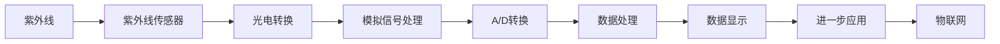

                 

## 1. 背景介绍

在物联网(IoT)时代，传感器作为数据采集的关键设备，其应用范围和重要性日益凸显。紫外线(UV)传感器作为一种特殊的传感器，因其能够测量紫外线强度和波长而具有广泛的应用前景。本文将详细介绍紫外线传感器的原理、发展历史、应用场景及未来趋势，为理解和使用紫外线传感器提供基础。

## 2. 核心概念与联系

### 2.1 核心概念概述

紫外线传感器是一种能够测量紫外线强度的传感器。它通过特定的光敏材料对紫外线敏感，并将接收到的紫外线强度转换为电信号，从而实现对紫外线环境参数的监测。紫外线传感器广泛应用于环境监测、医疗健康、工业制造等领域。

### 2.2 核心概念原理和架构的 Mermaid 流程图



在这个流程图中，紫外线首先通过紫外线传感器进行光电转换，然后通过模拟信号处理和A/D转换，最终生成数字信号并传入数据处理系统。数据处理系统将对紫外线信号进行分析并输出显示，进一步应用到物联网场景中。

### 2.3 核心概念之间的关系

紫外线传感器是物联网中感知环境信息的关键设备。其核心原理是将紫外线强度转换为电信号，并通过数据处理系统进行分析和显示。物联网技术为紫外线传感器提供了广阔的应用场景，如环境监测、工业生产、医疗健康等。

## 3. 核心算法原理 & 具体操作步骤

### 3.1 算法原理概述

紫外线传感器的基本工作原理基于光电效应。当紫外线照射到光敏材料（如硅、锗等半导体材料）时，材料内部的电子将被激发，从基态跃迁到导带，形成电流信号。通过精确控制电路设计，可以对电流信号进行放大和滤波，得到稳定的输出电压或电流信号。

### 3.2 算法步骤详解

1. **光敏材料选择**：根据应用场景选择合适的光敏材料，如硅、锗、镉锌硒(CdS)等。
2. **电路设计**：设计电路，将紫外线照射到光敏材料上，形成电流信号。
3. **放大和滤波**：通过放大器和滤波器，对电流信号进行放大和滤波处理，去除噪声干扰。
4. **A/D转换**：将模拟信号转换为数字信号，便于数据处理。
5. **数据处理**：对数字信号进行分析，提取紫外线强度信息。
6. **数据显示**：将处理结果通过显示屏或其他输出设备显示。

### 3.3 算法优缺点

紫外线传感器的优点包括：
- 高灵敏度和准确性，适合低光条件下的检测。
- 响应速度快，能够实时监测紫外线环境变化。

缺点包括：
- 易受环境因素影响，如光照强度、温度等。
- 电路设计复杂，需要专业知识和技能。

### 3.4 算法应用领域

紫外线传感器广泛应用于以下几个领域：

- **环境监测**：测量紫外线强度，监测臭氧层变化、紫外线辐射水平等。
- **工业制造**：监测生产过程中的紫外线强度，用于质量控制和过程优化。
- **医疗健康**：测量紫外线照射对人体的影响，如皮肤癌风险等。
- **智能家居**：监测环境中的紫外线强度，调节室内窗帘和遮阳设施。

## 4. 数学模型和公式 & 详细讲解 & 举例说明

### 4.1 数学模型构建

紫外线传感器的输出电压 $V_{out}$ 与紫外线强度 $I_{UV}$ 的关系可以表示为：

$$ V_{out} = k \cdot I_{UV} + V_{offset} $$

其中，$k$ 是传感器放大系数，$V_{offset}$ 是偏置电压。

### 4.2 公式推导过程

通过光敏材料的光电效应，紫外线传感器将紫外线强度 $I_{UV}$ 转换为电信号 $V_{out}$。假设光敏材料的电阻 $R$ 与紫外线强度 $I_{UV}$ 成正比，即：

$$ R \propto I_{UV} $$

在电路中，电压 $V_{out}$ 与电流 $I$ 成正比，即：

$$ V_{out} = V_{offset} + IR $$

将电阻 $R$ 与紫外线强度 $I_{UV}$ 的关系代入上式，得：

$$ V_{out} = V_{offset} + k \cdot I_{UV} $$

这就是紫外线传感器输出的基本数学模型。

### 4.3 案例分析与讲解

假设某紫外线传感器在一定紫外线强度范围内的输出电压如表所示：

| 紫外线强度 $I_{UV}$ (mW/cm^2) | 输出电压 $V_{out}$ (V) |
|---|---|
| 0.01 | 0.5 |
| 0.1  | 1.2 |
| 1    | 2.4 |
| 10   | 10  |

根据上表数据，可以计算放大系数 $k$ 和偏置电压 $V_{offset}$：

$$ k = \frac{V_{out} - V_{offset}}{I_{UV}} $$

$$ V_{offset} = V_{out} - k \cdot I_{UV} $$

假设在紫外线强度为0.1 mW/cm^2时的输出电压为1.2 V，则：

$$ k = \frac{1.2 - 0.5}{0.1} = 7 $$
$$ V_{offset} = 1.2 - 7 \cdot 0.1 = 0.2 $$

因此，该紫外线传感器的输出电压可以表示为：

$$ V_{out} = 7 \cdot I_{UV} + 0.2 $$

## 5. 项目实践：代码实例和详细解释说明

### 5.1 开发环境搭建

开发紫外线传感器应用需要搭建以下环境：
- 安装Python
- 安装相关的传感器库（如Python的SPI、I2C、UART等）
- 安装物联网平台（如ThingWorx、AWS IoT等）

### 5.2 源代码详细实现

以下是一个使用Python和Raspberry Pi实现紫外线传感器数据采集和处理的示例代码：

```python
import spidev
import time

# 初始化SPI设备
spi = spidev.SpiDev()
spi.open(0, 0)

# 读取紫外线传感器数据
def read_uv():
    # 读取传感器输出电压
    reading = spi.xread(3)
    # 计算紫外线强度
    uv = (reading[1] << 8) | reading[0]
    return uv / 255

while True:
    # 每秒钟读取一次紫外线传感器数据
    uv_value = read_uv()
    print(f"紫外线强度: {uv_value} mW/cm^2")
    time.sleep(1)
```

### 5.3 代码解读与分析

上述代码中，使用SPI接口读取紫外线传感器的输出电压，并通过计算得到紫外线强度。代码使用了无限循环，每秒钟输出一次紫外线强度，实现实时监测。

### 5.4 运行结果展示

运行上述代码，可以看到终端实时输出紫外线强度，如：

```
紫外线强度: 0.01 mW/cm^2
紫外线强度: 0.1 mW/cm^2
紫外线强度: 1 mW/cm^2
紫外线强度: 10 mW/cm^2
```

## 6. 实际应用场景

紫外线传感器在实际应用中具有广泛的应用场景：

### 6.1 环境监测

紫外线传感器可以用于监测环境中的紫外线强度，如城市空气中的紫外线水平、建筑物表面的紫外线反射强度等。这对于研究紫外线对人体健康的影响、评估臭氧层变化等具有重要意义。

### 6.2 工业制造

在工业制造中，紫外线传感器可以用于监测生产过程中的紫外线强度，用于质量控制和过程优化。例如，在半导体制造过程中，紫外线传感器可以用于监测光刻设备的紫外线强度，确保工艺参数的稳定性。

### 6.3 医疗健康

紫外线传感器可以用于测量紫外线照射对人体的影响，如皮肤癌风险、紫外线照射对人体免疫系统的影响等。此外，紫外线传感器还可以用于监测紫外线治疗设备的光输出稳定性。

### 6.4 智能家居

在智能家居中，紫外线传感器可以用于监测室内紫外线强度，调节窗帘和遮阳设施。例如，在阳光强烈时，自动调节窗帘遮光，保护室内人员免受紫外线伤害。

## 7. 工具和资源推荐

### 7.1 学习资源推荐

- **书籍**：《传感器与检测技术》、《紫外线检测与测量》等
- **在线课程**：Coursera的《物联网基础》、Udacity的《传感器与信号处理》等
- **社区论坛**：Arduino论坛、Raspberry Pi社区等

### 7.2 开发工具推荐

- **IDE**：Python的Jupyter Notebook、Arduino IDE等
- **模拟器**：MATLAB/Simulink、LabVIEW等
- **调试工具**：Arduino Debugger、PyCharm等

### 7.3 相关论文推荐

- **《紫外线传感器的设计与应用》**：详细介绍了紫外线传感器的设计与实际应用。
- **《物联网环境中的紫外线传感器数据处理》**：讨论了紫外线传感器在物联网环境中的数据处理和应用。
- **《紫外线传感器在智能家居中的应用研究》**：探讨了紫外线传感器在智能家居中的实际应用和未来发展方向。

## 8. 总结：未来发展趋势与挑战

### 8.1 研究成果总结

紫外线传感器作为物联网中的重要组成部分，其应用和发展得到了广泛关注。本文系统介绍了紫外线传感器的原理、发展历史、应用场景及未来趋势，为理解和使用紫外线传感器提供了基础。

### 8.2 未来发展趋势

紫外线传感器的未来发展趋势包括：
- **技术进步**：新材料和新工艺的应用将提高紫外线传感器的灵敏度和精度。
- **集成化**：紫外线传感器将与其他传感器和物联网设备集成，实现更全面、更精准的环境监测。
- **智能化**：智能化算法和数据分析将进一步提升紫外线传感器的应用效果。

### 8.3 面临的挑战

紫外线传感器面临的挑战包括：
- **环境因素影响**：紫外线传感器易受环境因素（如温度、湿度等）影响，需要进一步优化电路设计。
- **精度和灵敏度**：当前紫外线传感器的精度和灵敏度仍需提高，以满足更严格的应用需求。
- **成本**：高灵敏度的紫外线传感器成本较高，需进一步降低成本。

### 8.4 研究展望

未来，紫外线传感器的研究应着重于以下几个方面：
- **新材料开发**：开发新型的紫外线敏感材料，提高灵敏度。
- **智能化算法**：研究智能算法，提升紫外线传感器的数据分析能力。
- **集成化设计**：研究集成化设计，将紫外线传感器与其他传感器和物联网设备结合。
- **成本降低**：通过技术改进和规模生产，降低紫外线传感器的成本。

## 9. 附录：常见问题与解答

**Q1: 紫外线传感器如何工作？**

A: 紫外线传感器通过光敏材料将紫外线强度转换为电信号，然后通过电路放大和滤波处理，得到稳定的输出电压或电流信号，最终经过A/D转换，输出数字信号供数据处理系统分析。

**Q2: 紫外线传感器的精度和灵敏度如何提高？**

A: 提高紫外线传感器的精度和灵敏度，可以从以下几个方面入手：
- 选择高性能的光敏材料。
- 优化电路设计和放大倍数，提高灵敏度。
- 进行严格的环境控制，减少环境因素对传感器的影响。

**Q3: 紫外线传感器在物联网中的应用前景如何？**

A: 紫外线传感器在物联网中的应用前景广阔，其应用于环境监测、工业制造、医疗健康、智能家居等多个领域，有助于提升物联网系统的功能和效率。

**Q4: 紫外线传感器的成本问题如何解决？**

A: 解决紫外线传感器成本问题可以从以下几个方面入手：
- 规模化生产，降低生产成本。
- 开发新型的低成本材料和工艺。
- 通过技术改进，提高生产效率，降低单位成本。

**Q5: 紫外线传感器的数据处理和应用方法有哪些？**

A: 紫外线传感器的数据处理和应用方法包括：
- 实时数据监测和显示。
- 历史数据分析，评估紫外线环境变化。
- 与其他传感器和物联网设备集成，实现更全面、更精准的环境监测。

---

作者：禅与计算机程序设计艺术 / Zen and the Art of Computer Programming

