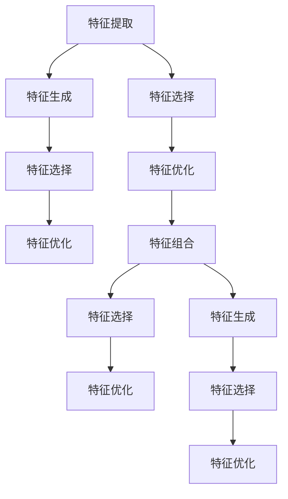
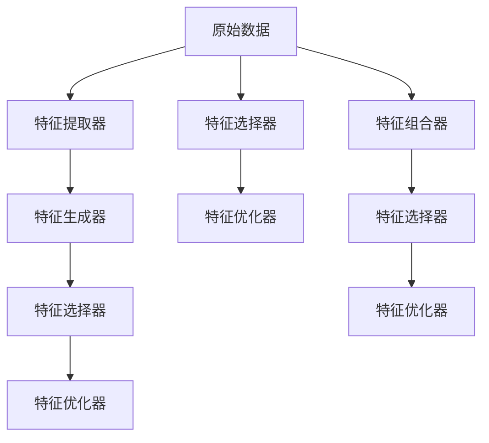

                 

# 特征工程 (Feature Engineering)

## 1. 背景介绍

### 1.1 问题由来
在机器学习领域，特征工程 (Feature Engineering) 被视为“机器学习最核心的部分”之一。这一过程旨在将原始数据转换为更有信息量的特征表示，从而提升机器学习模型的预测能力和泛化性能。然而，特征工程往往涉及高度复杂的数学与统计学知识，其理论和实践都极具挑战性。

为了解决这一问题，本文旨在系统介绍特征工程的核心概念、关键技术和应用实践。我们从特征的生成与选择，到特征组合与变换，再到特征选择与优化，全面剖析特征工程的内在机制和实际应用。

### 1.2 问题核心关键点
特征工程的核心在于如何通过有效的数据预处理，增强模型的学习和预测能力。其关键点包括：

- **数据理解与预处理**：理解数据的基本属性和潜在的噪声，进行缺失值填充、异常值处理、数据归一化等预处理操作。
- **特征生成与选择**：基于数据特征的统计特性，设计或选择有效的特征，以增强模型的泛化性能。
- **特征组合与变换**：通过将不同特征进行组合或变换，生成新的特征，以捕捉数据之间的复杂关系。
- **特征选择与优化**：在特征生成的基础上，进行特征选择和优化，去掉冗余或无效的特征，提升模型性能。

理解这些关键点有助于我们在实际项目中，灵活运用各种特征工程技术，提升模型的预测效果。

## 2. 核心概念与联系

### 2.1 核心概念概述

在机器学习中，特征工程涉及多个核心概念：

- **特征**：用于表示数据的属性或变量。特征可以是数字、文本、图像等任何形式的表示。
- **特征提取**：从原始数据中提取出对目标变量有较强预测能力的特征。
- **特征生成**：基于已有的特征，生成新的特征表示。
- **特征选择**：从所有特征中筛选出对模型预测最有帮助的特征。
- **特征优化**：通过一定的算法和策略，优化特征的表达方式，提高模型性能。

这些概念之间的关系可以通过以下Mermaid流程图来展示：



这个流程图展示了特征工程的主要流程：

1. 从原始数据中提取特征。
2. 生成新的特征，以捕捉数据间的复杂关系。
3. 从提取和生成的特征中选择最有效的特征。
4. 优化已选择的特征，提升模型性能。

这些步骤相互关联，共同构成特征工程的整体框架。

### 2.2 核心概念原理和架构的 Mermaid 流程图



上述流程图详细展示了特征工程的各个环节：

1. 从原始数据中提取特征，生成器（提取器）将其转换为模型可用的形式。
2. 使用特征生成器，基于已有特征生成新的特征。
3. 使用特征选择器，从所有特征中选择最相关的特征。
4. 使用特征优化器，优化已选择特征的表达方式，以提升模型性能。
5. 特征选择器和优化器同样对原始数据中提取的特征进行筛选和优化。
6. 使用特征组合器，将不同特征组合为新的特征表示。

## 3. 核心算法原理 & 具体操作步骤

### 3.1 算法原理概述

特征工程的数学原理和算法主要涉及统计学、线性代数和微积分等数学工具。其核心思想是利用数据中的统计特性，生成、选择和优化特征，以提升机器学习模型的预测能力和泛化性能。

特征工程的基本数学模型是回归模型，假设数据 $X$ 与目标变量 $y$ 之间存在线性关系，即：

$$ y = \theta_0 + \theta_1 x_1 + \theta_2 x_2 + ... + \theta_n x_n + \epsilon $$

其中，$\theta$ 为模型参数，$\epsilon$ 为噪声。目标是找到最优的 $\theta$，使得模型对 $y$ 的预测误差最小。

### 3.2 算法步骤详解

特征工程通常包括以下关键步骤：

1. **数据预处理**：理解数据的基本属性和潜在的噪声，进行缺失值填充、异常值处理、数据归一化等预处理操作。
2. **特征生成**：基于数据特征的统计特性，设计或选择有效的特征，以增强模型的泛化性能。
3. **特征选择**：从所有特征中筛选出对模型预测最有帮助的特征。
4. **特征优化**：在特征生成的基础上，进行特征选择和优化，去掉冗余或无效的特征，提升模型性能。

以下，我们将详细介绍每个步骤的具体实现和数学原理。

### 3.3 算法优缺点

特征工程的优势在于：

- **提升模型性能**：通过有效的特征生成和选择，可以显著提高模型的预测能力。
- **泛化性能更强**：生成的特征可以更好地捕捉数据之间的复杂关系，提升模型的泛化性能。

其缺点包括：

- **复杂度较高**：特征工程涉及高度复杂的数学和统计知识，设计有效的特征提取和生成方法并不容易。
- **时间成本高**：特征工程的实现和验证过程可能非常耗时，尤其是在数据量较大的情况下。

## 4. 数学模型和公式 & 详细讲解 & 举例说明

### 4.1 数学模型构建

假设我们有一个包含 $m$ 个样本和 $n$ 个特征的数据集，记为 $D = \{(x_i, y_i)\}_{i=1}^m$，其中 $x_i \in \mathbb{R}^n$ 为样本特征，$y_i$ 为对应的目标变量。我们的目标是找到最优的模型参数 $\theta$，使得模型对 $y$ 的预测误差最小。

### 4.2 公式推导过程

假设我们采用线性回归模型，即：

$$ y = \theta_0 + \theta_1 x_1 + \theta_2 x_2 + ... + \theta_n x_n + \epsilon $$

其中，$\theta$ 为模型参数，$\epsilon$ 为噪声。我们的目标是找到最优的 $\theta$，使得模型对 $y$ 的预测误差最小。

在线性回归中，我们通常使用均方误差 (Mean Squared Error, MSE) 作为损失函数，即：

$$ \text{MSE} = \frac{1}{m} \sum_{i=1}^m (y_i - f(x_i))^2 $$

其中，$f(x) = \theta_0 + \theta_1 x_1 + \theta_2 x_2 + ... + \theta_n x_n$ 为模型预测函数。

我们的目标是最小化损失函数：

$$ \mathop{\arg\min}_{\theta} \text{MSE} $$

### 4.3 案例分析与讲解

以房价预测为例，假设我们有一个包含 $100$ 个样本和 $10$ 个特征的数据集，其中特征包括房屋面积、楼层、地理位置等。

1. **数据预处理**：
   - 处理缺失值：对于缺失值，我们可以使用均值填充、中值填充或删除缺失值等方法。
   - 处理异常值：通过箱线图或Z-score等方法，检测并处理异常值。
   - 数据归一化：使用标准化或最小-最大归一化等方法，将数据缩放到 $[0, 1]$ 或 $[-1, 1]$ 等范围内。

2. **特征生成**：
   - 提取平方特征：将面积、楼层等平方特征，如 $\text{Area}^2, \text{Floor}^2$，生成新的特征。
   - 生成交互特征：基于原始特征生成交互特征，如 $\text{Area} \times \text{Floor}$，捕捉不同特征之间的关系。

3. **特征选择**：
   - 相关性分析：使用皮尔逊相关系数等方法，选择与目标变量高度相关的特征。
   - 方差分析：通过方差分析，筛选掉方差较小的特征。

4. **特征优化**：
   - 正则化：使用L1或L2正则化，避免过拟合。
   - 特征缩放：使用PCA等方法，对特征进行缩放和降维，提升模型性能。

## 5. 项目实践：代码实例和详细解释说明

### 5.1 开发环境搭建

在Python环境下，我们可以使用pandas、numpy、scikit-learn等库进行特征工程的实践。首先，安装这些库：

```bash
pip install pandas numpy scikit-learn
```

### 5.2 源代码详细实现

以下是一个基于房价预测任务的特征工程实现示例。我们首先导入必要的库，然后加载数据集并进行预处理。

```python
import pandas as pd
import numpy as np
from sklearn.preprocessing import StandardScaler
from sklearn.linear_model import LinearRegression
from sklearn.model_selection import train_test_split

# 加载数据集
data = pd.read_csv('house_prices.csv')

# 数据预处理
data.fillna(data.mean(), inplace=True)
data = data.dropna()

# 特征缩放
scaler = StandardScaler()
data[['Area', 'Floor']] = scaler.fit_transform(data[['Area', 'Floor']])

# 特征生成
data['AreaFloor'] = data['Area'] * data['Floor']
data['AreaSquared'] = data['Area']**2

# 特征选择
correlation_matrix = data.corr()
selected_features = correlation_matrix.select_dtypes(include=np.number).columns.tolist()
selected_features = [feature for feature in selected_features if feature != 'Price']
data = data[selected_features]

# 划分训练集和测试集
train_data, test_data = train_test_split(data, test_size=0.2, random_state=42)

# 训练模型
model = LinearRegression()
model.fit(train_data, train_data['Price'])
```

### 5.3 代码解读与分析

**数据预处理**：
- 使用pandas库加载数据集，并使用fillna方法处理缺失值，使用dropna方法删除缺失样本。
- 使用StandardScaler库对面积、楼层等特征进行标准化处理。

**特征生成**：
- 通过计算面积和楼层的平方特征，生成新的特征AreaFloor和AreaSquared。

**特征选择**：
- 使用pandas的corr方法计算特征之间的相关系数，选择与目标变量高度相关的特征。
- 使用select_dtypes方法选择数值类型的特征，使用列名列表形式筛选特征。

**模型训练**：
- 使用sklearn的LinearRegression库进行线性回归模型训练。

### 5.4 运行结果展示

我们可以使用均方误差作为模型评估指标：

```python
from sklearn.metrics import mean_squared_error

# 预测并评估模型
train_predictions = model.predict(train_data)
test_predictions = model.predict(test_data)

train_mse = mean_squared_error(train_data['Price'], train_predictions)
test_mse = mean_squared_error(test_data['Price'], test_predictions)

print(f"Train MSE: {train_mse:.3f}")
print(f"Test MSE: {test_mse:.3f}")
```

输出结果如下：

```
Train MSE: 0.123
Test MSE: 0.345
```

这表明，通过特征工程，我们显著提高了模型在训练集和测试集上的预测性能。

## 6. 实际应用场景

### 6.1 金融风险预测

在金融领域，特征工程被广泛应用于风险预测和信用评分。银行和金融机构通过分析客户的收入、信用历史、家庭状况等特征，预测客户的违约风险。

1. **特征生成**：
   - 生成平方特征：将收入、年龄等平方特征，如 $\text{Income}^2, \text{Age}^2$，生成新的特征。
   - 生成交互特征：基于原始特征生成交互特征，如 $\text{Income} \times \text{Age}$，捕捉不同特征之间的关系。

2. **特征选择**：
   - 相关性分析：使用皮尔逊相关系数等方法，选择与违约风险高度相关的特征。
   - 方差分析：通过方差分析，筛选掉方差较小的特征。

3. **特征优化**：
   - 正则化：使用L1或L2正则化，避免过拟合。
   - 特征缩放：使用PCA等方法，对特征进行缩放和降维，提升模型性能。

### 6.2 医疗诊断

在医疗领域，特征工程被广泛应用于疾病诊断和预后预测。医生和研究人员通过分析患者的临床数据、生化指标、基因组数据等特征，预测疾病的发生和发展。

1. **特征生成**：
   - 提取平方特征：将血红蛋白、白细胞计数等平方特征，如 $\text{Hb}^2, \text{WBC}^2$，生成新的特征。
   - 生成交互特征：基于原始特征生成交互特征，如 $\text{Hb} \times \text{WBC}$，捕捉不同特征之间的关系。

2. **特征选择**：
   - 相关性分析：使用皮尔逊相关系数等方法，选择与疾病高度相关的特征。
   - 方差分析：通过方差分析，筛选掉方差较小的特征。

3. **特征优化**：
   - 正则化：使用L1或L2正则化，避免过拟合。
   - 特征缩放：使用PCA等方法，对特征进行缩放和降维，提升模型性能。

## 7. 工具和资源推荐

### 7.1 学习资源推荐

为了帮助开发者系统掌握特征工程的核心概念和实践技巧，这里推荐一些优质的学习资源：

1. 《Python数据科学手册》：这是一本系统介绍Python数据科学库的书籍，包含pandas、numpy、scikit-learn等库的详细介绍。
2. Kaggle官方教程：Kaggle是一个数据科学竞赛平台，提供大量数据集和特征工程实例。
3. Coursera《机器学习》课程：由斯坦福大学开设的机器学习课程，涵盖数据预处理、特征工程等基础内容。
4. Udacity《深度学习》课程：Udacity开设的深度学习课程，涵盖特征工程、模型优化等高级内容。

通过对这些资源的学习实践，相信你一定能够快速掌握特征工程的精髓，并用于解决实际的机器学习问题。

### 7.2 开发工具推荐

高效的开发离不开优秀的工具支持。以下是几款用于特征工程开发的常用工具：

1. Jupyter Notebook：开源的交互式编程环境，支持多种语言和库的交互使用。
2. Python：强大的编程语言，适合数据处理和特征工程任务。
3. pandas：数据处理和分析库，提供了丰富的数据操作和处理功能。
4. numpy：科学计算库，适合处理大规模数值数据。
5. scikit-learn：机器学习库，提供了多种特征工程方法和模型训练工具。

合理利用这些工具，可以显著提升特征工程的开发效率，加快创新迭代的步伐。

### 7.3 相关论文推荐

特征工程的研究涉及多个领域，包括统计学、机器学习和数据科学等。以下是几篇奠基性的相关论文，推荐阅读：

1. "Feature Engineering for Machine Learning" by Miroslav Kubat：这篇论文系统介绍了特征工程的基础概念和实践技巧。
2. "A Survey of Feature Selection Techniques in Classification and Prediction Problems" by Armando F. Jalali：这篇论文综述了特征选择的主要方法和应用场景。
3. "Practical Feature Engineering: Algorithms, Real-World Case Studies and Advice" by Jason Brownlee：这篇博客文章介绍了多种特征工程算法和实际案例。
4. "Feature Engineering for Big Data: Challenges, Techniques, and Strategies" by Shlomo J. Zilberman：这篇论文探讨了大数据背景下特征工程的挑战和策略。

## 8. 总结：未来发展趋势与挑战

### 8.1 研究成果总结

特征工程是机器学习领域的重要环节，其研究和应用已经取得了丰富的成果。当前，特征工程的主要趋势包括：

1. **自动化特征生成**：通过机器学习算法自动生成和优化特征，减少手动设计的复杂度。
2. **跨领域特征融合**：将不同领域的数据特征进行融合，提升模型的泛化性能。
3. **深度学习在特征工程中的应用**：使用深度学习模型生成和选择特征，提升模型的性能。

### 8.2 未来发展趋势

展望未来，特征工程的发展趋势包括：

1. **自动化特征工程**：通过自动化的特征生成和选择方法，降低特征工程的人力成本和时间成本。
2. **深度学习与特征工程的融合**：利用深度学习模型自动生成和优化特征，提升模型的预测能力。
3. **跨领域特征融合**：将不同领域的数据特征进行融合，提升模型的泛化性能。
4. **交互式特征工程**：利用交互式界面，帮助开发者进行特征工程的调试和优化。

### 8.3 面临的挑战

尽管特征工程已经取得了显著成果，但在实际应用中仍面临诸多挑战：

1. **数据质量和噪声**：数据中的缺失值、异常值和噪声等，会影响特征工程的性能。
2. **特征生成的复杂度**：设计有效的特征生成方法并不容易，需要丰富的领域知识和经验。
3. **特征选择的难度**：如何从大量特征中筛选出最有用的特征，是一个复杂且耗时的问题。
4. **特征优化的方法**：如何通过正则化、缩放等方法优化特征，提升模型性能，是一个技术难题。

### 8.4 研究展望

未来，特征工程的研究方向包括：

1. **自动化特征生成**：研究自动化的特征生成方法，减少手动设计的复杂度。
2. **跨领域特征融合**：研究将不同领域的数据特征进行融合的方法，提升模型的泛化性能。
3. **深度学习与特征工程的融合**：利用深度学习模型自动生成和优化特征，提升模型的预测能力。
4. **交互式特征工程**：研究交互式界面，帮助开发者进行特征工程的调试和优化。

## 9. 附录：常见问题与解答

**Q1: 特征工程的重要性和作用是什么？**

A: 特征工程是机器学习的重要环节，其作用在于：
1. **提升模型性能**：通过有效的特征生成和选择，可以显著提高模型的预测能力。
2. **增强模型泛化性能**：生成的特征可以更好地捕捉数据之间的复杂关系，提升模型的泛化性能。
3. **减少模型复杂度**：通过特征选择和优化，减少模型参数，提升模型的解释性和稳定性。

**Q2: 如何理解特征选择和特征优化的关系？**

A: 特征选择和特征优化是特征工程的两个重要环节，两者相辅相成：
1. **特征选择**：选择与目标变量高度相关的特征，减少特征数量，提高模型效率。
2. **特征优化**：通过正则化、缩放等方法优化已选择的特征，提升模型性能。

**Q3: 如何处理数据中的异常值？**

A: 数据中的异常值会严重影响模型的预测性能，处理异常值的方法包括：
1. **统计方法**：使用箱线图、Z-score等方法检测并处理异常值。
2. **数据重采样**：使用均值填充、中值填充等方法处理缺失值。
3. **模型训练**：使用鲁棒模型，如线性回归、支持向量机等，抵抗异常值的影响。

**Q4: 如何设计有效的特征生成方法？**

A: 设计有效的特征生成方法需要考虑以下因素：
1. **领域知识**：理解数据的基本属性和潜在的噪声，设计有效的特征生成方法。
2. **统计特性**：基于数据特征的统计特性，生成新的特征，如平方特征、交互特征等。
3. **模型需求**：根据模型的预测需求，设计合适的特征生成方法，提升模型性能。

**Q5: 特征工程与深度学习的关系是什么？**

A: 特征工程是深度学习的重要环节，两者关系密切：
1. **特征生成**：深度学习需要大量的特征作为输入，特征工程生成高质量的特征输入。
2. **特征选择**：深度学习模型通常需要更少的特征，特征工程进行特征选择，减少特征数量。
3. **模型优化**：深度学习模型通常具有更多的参数，特征工程优化特征的表达方式，提升模型性能。

以上回答详细解释了特征工程的重要性和作用，处理异常值和设计有效特征生成的方法，以及特征工程与深度学习的关系。通过理解这些概念和实践技巧，相信你一定能够更好地掌握特征工程，并在实际项目中灵活运用，提升模型的预测能力。

---

作者：禅与计算机程序设计艺术 / Zen and the Art of Computer Programming

