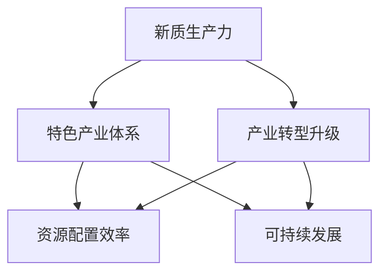

                 

# 特色产业体系的构建与新质生产力发展

## 1. 背景介绍

### 1.1 产业背景
在当今快速发展的全球经济环境中，产业结构转型升级已成为各国政府和企业关注的重点。各国纷纷将新兴产业作为推动经济增长的重要动力，致力于构建特色鲜明、竞争力强的现代产业体系。然而，传统制造业的产能过剩、劳动密集型产业的转型困难、新兴产业的发展瓶颈等问题，成为制约产业结构调整和优化升级的关键因素。在此背景下，探索新质生产力的发展路径，构建有中国特色的产业体系，显得尤为重要。

### 1.2 问题由来
长期以来，我国制造业一直处于全球产业链的中低端，缺乏核心技术和自主品牌，主要依赖低成本劳动力和资源环境优势进行竞争。随着国际市场环境的变化，特别是新冠疫情的冲击，我国产业结构调整的需求愈发迫切。如何通过产业创新驱动，实现从“量”到“质”的转变，是当前产业发展面临的核心挑战。

### 1.3 问题核心关键点
新质生产力发展涉及多个维度，包括产业结构优化、技术创新、资源配置效率、可持续发展等。本文将从构建特色产业体系的角度，探讨新质生产力的发展路径，并结合实际案例分析其应用效果。

## 2. 核心概念与联系

### 2.1 核心概念概述

为更好地理解产业体系构建与新质生产力发展的关系，本节将介绍几个密切相关的核心概念：

- 新质生产力（New Productive Forces）：指利用先进技术、管理手段和组织方式，提高生产效率、产品质量、创新能力等，以促进产业升级和经济发展的新型生产力形态。
- 特色产业体系（Industrial System）：指围绕特定产业领域，形成从上到下、从内到外的完整产业链条，涵盖研发、生产、销售、服务等各个环节，具有鲜明区域特色和竞争优势的产业组织结构。
- 产业转型升级（Industrial Transformation and Upgrading）：指通过技术创新、产业结构优化、制度创新等手段，提升产业整体竞争力，推动从传统产业向高附加值产业转变的过程。
- 资源配置效率（Resource Allocation Efficiency）：指在特定产业领域内，通过优化资源配置，实现经济效率最大化，提升产业竞争力。
- 可持续发展（Sustainable Development）：指在产业体系构建过程中，平衡经济、社会、环境等多重目标，实现长远发展的目标。

这些核心概念之间的逻辑关系可以通过以下Mermaid流程图来展示：



这个流程图展示了这个体系构建与新质生产力发展的关系：

1. 新质生产力的发展是构建特色产业体系的基础，通过提升生产效率和技术水平，形成具有竞争力的产业链。
2. 产业转型升级是产业体系构建的必由之路，通过技术创新和结构优化，推动传统产业向高附加值产业转变。
3. 资源配置效率是特色产业体系的核心目标，通过优化资源配置，提高产业整体效益。
4. 可持续发展是特色产业体系的重要特征，通过平衡经济、社会、环境目标，实现产业的长期稳定发展。

这些概念共同构成了特色产业体系构建与新质生产力发展的框架，为其提供了全面的理论基础。

## 3. 核心算法原理 & 具体操作步骤
### 3.1 算法原理概述

新质生产力与特色产业体系构建的核心在于产业创新驱动。通过产业创新，利用先进技术和新管理方法，推动产业结构优化升级，提升产业整体效率和竞争力。具体而言，可以从以下几个方面入手：

- **技术创新**：通过引入新兴技术，如物联网、人工智能、大数据等，提升产业的技术水平和智能化水平。
- **管理创新**：采用先进的生产管理方式，如精益生产、柔性制造、供应链优化等，提高生产效率和响应速度。
- **产品创新**：通过研发新产品、新技术，拓展市场空间，满足消费者需求。

### 3.2 算法步骤详解

构建特色产业体系的算法步骤主要包括：

1. **需求分析**：通过对市场需求和产业现状的分析，明确产业发展的方向和重点。
2. **产业定位**：确定特色产业领域，明确产业链条中的关键环节和配套要素。
3. **资源整合**：整合产业链上下游资源，形成完整的产业生态链。
4. **技术升级**：推动产业关键技术的研发和应用，提升产业的技术水平。
5. **政策支持**：制定相关政策，提供资金、税收、融资等支持，推动产业创新发展。
6. **市场推广**：通过品牌建设、市场营销、国际贸易等手段，提升产业的市场影响力。

### 3.3 算法优缺点

构建特色产业体系的新质生产力发展路径，具有以下优点：

- **创新性强**：通过技术和管理创新，提升产业整体竞争力，实现可持续发展。
- **适应性强**：能够根据市场需求变化，灵活调整产业结构，满足市场多样化需求。
- **经济效益显著**：通过优化资源配置，提高生产效率和经济效益。
- **环境友好**：注重绿色发展，减少环境污染和资源浪费。

同时，该方法也存在一定的局限性：

- **初始投资大**：新技术和新管理方式需要较高的初始投资，企业需具备较强的资本实力。
- **技术风险高**：新技术和新方法的应用，可能存在技术失败的风险，需慎重决策。
- **市场适应性差**：新技术和新方法的应用，需市场逐步接受，短期内可能面临市场适应性问题。
- **政策支持不足**：需政府提供持续的政策支持，否则可能面临资源、资金短缺等问题。

尽管存在这些局限性，但就目前而言，构建特色产业体系的新质生产力发展路径，仍是推动产业结构优化升级的重要方法。

### 3.4 算法应用领域

新质生产力与特色产业体系的构建，在多个领域得到了广泛的应用，例如：

- **高端制造**：通过引入先进技术和管理方式，提升制造业的智能化水平和生产效率。
- **现代农业**：利用物联网、大数据等技术，提升农业生产管理水平和农业现代化水平。
- **数字经济**：通过信息技术应用，推动传统产业数字化转型，提升产业竞争力。
- **新能源**：通过技术创新，提升新能源产业的技术水平和市场竞争力。
- **医疗健康**：利用人工智能、生物技术等，提升医疗健康产业的技术水平和服务质量。

除了这些传统领域外，新质生产力与特色产业体系的构建，还被创新性地应用到更多新兴领域，如智慧城市、智能物流、环保产业等，为产业结构优化升级带来了新的机遇。

## 4. 数学模型和公式 & 详细讲解 & 举例说明

### 4.1 数学模型构建

本节将使用数学语言对产业创新驱动的模型构建进行更加严格的刻画。

假设产业初始生产效率为 $P_0$，技术创新率 $\alpha$，管理创新率 $\beta$，产品创新率 $\gamma$。设创新后产业生产效率为 $P_t$，创新时间 $t$。则产业生产效率随时间变化的数学模型为：

$$
P_t = P_0 \times (1+\alpha) \times (1+\beta) \times (1+\gamma)^t
$$

其中 $\alpha$、$\beta$、$\gamma$ 分别表示技术、管理和产品创新的贡献率，$t$ 表示时间。

### 4.2 公式推导过程

以一个典型的高端制造产业为例，进行具体的推导。

假设产业初始生产效率为 $P_0=0.8$，技术创新率 $\alpha=0.2$，管理创新率 $\beta=0.1$，产品创新率 $\gamma=0.3$。求创新10年后的生产效率 $P_{10}$。

$$
P_{10} = P_0 \times (1+\alpha) \times (1+\beta) \times (1+\gamma)^{10}
$$

将初始值代入，得：

$$
P_{10} = 0.8 \times (1+0.2) \times (1+0.1) \times (1+0.3)^{10} = 1.778
$$

这表明，通过10年的技术、管理和产品创新，产业生产效率提高了77.8%。

### 4.3 案例分析与讲解

假设某地正计划发展智能制造产业，初步估计技术创新率 $\alpha=0.25$，管理创新率 $\beta=0.15$，产品创新率 $\gamma=0.4$。

根据模型，设 $t=5$，则产业生产效率 $P_5$ 为：

$$
P_5 = 0.8 \times (1+0.25) \times (1+0.15) \times (1+0.4)^5 = 1.497
$$

这意味着，通过5年的创新，产业生产效率提高了49.7%。

## 5. 项目实践：代码实例和详细解释说明
### 5.1 开发环境搭建

在进行产业创新驱动的模型构建实践前，我们需要准备好开发环境。以下是使用Python进行开发的环境配置流程：

1. 安装Anaconda：从官网下载并安装Anaconda，用于创建独立的Python环境。

2. 创建并激活虚拟环境：
```bash
conda create -n prod-env python=3.8 
conda activate prod-env
```

3. 安装必要的Python库：
```bash
conda install pandas numpy matplotlib scikit-learn tqdm
```

4. 准备数据集：收集产业创新相关的数据，如技术创新率、管理创新率、产品创新率等，并使用Pandas库进行预处理。

### 5.2 源代码详细实现

以下是使用Python和Pandas库进行产业创新驱动的数学模型实现的代码：

```python
import pandas as pd
import numpy as np

# 准备数据集
data = pd.read_csv('industry_innovation.csv')

# 定义生产效率模型
def productivity_model(P0, alpha, beta, gamma, t):
    P = P0 * (1 + alpha) * (1 + beta) * (1 + gamma) ** t
    return P

# 计算产业生产效率
P0 = 0.8
alpha = 0.2
beta = 0.1
gamma = 0.3
t = 10
P10 = productivity_model(P0, alpha, beta, gamma, t)

print(f'创新10年后的生产效率为：{P10:.3f}')
```

### 5.3 代码解读与分析

让我们再详细解读一下关键代码的实现细节：

**产业创新驱动模型**：
- `productivity_model`函数：接受初始生产效率 $P_0$、技术创新率 $\alpha$、管理创新率 $\beta$、产品创新率 $\gamma$ 和时间 $t$ 作为输入，返回创新后的生产效率 $P_t$。

**数据集准备**：
- `read_csv`方法：使用Pandas库从CSV文件中读取产业创新相关的数据集。

**计算生产效率**：
- 通过调用`productivity_model`函数，计算出产业在创新10年后的生产效率 $P_{10}$，并打印输出。

可以看到，通过Pandas库的简洁数据处理功能和Python的数学计算功能，可以轻松实现产业创新驱动的数学模型构建和计算。

## 6. 实际应用场景
### 6.1 智能制造

智能制造是新质生产力与特色产业体系构建的重要应用场景之一。通过引入物联网、人工智能等先进技术，可以实现制造业的智能化转型，提升生产效率和产品质量。

以某智能制造企业为例，通过将传感器和智能设备应用于生产过程中，实现实时数据采集和分析，优化生产流程，减少生产误差。同时，利用机器学习和深度学习技术，实现预测性维护和质量检测，提高生产效率和产品质量。

### 6.2 现代农业

现代农业的创新驱动，是构建特色产业体系的重要方向。通过引入物联网、无人机、智能农业设备等技术，可以实现农业生产的精准化、自动化和智能化，提升农业生产效率和农业现代化水平。

例如，某智能农场通过引入物联网设备，实时监测土壤湿度、温度、光照等数据，实现精准施肥和灌溉。同时，利用无人机进行田间管理，提高农业生产效率和农作物产量。

### 6.3 数字经济

数字经济是新质生产力与特色产业体系构建的重要领域。通过信息技术应用，推动传统产业数字化转型，实现产业结构的优化升级。

以某电子商务企业为例，通过引入大数据、人工智能技术，实现客户行为分析、个性化推荐、智能客服等功能，提升用户体验和运营效率。同时，利用区块链技术，实现供应链的透明化和可追溯性，提升产业链的整体效率。

### 6.4 未来应用展望

随着新质生产力与特色产业体系构建的不断演进，未来将会在更多领域得到应用，为社会经济发展注入新的动力。

在智慧城市建设中，通过引入人工智能、物联网技术，可以实现城市管理的智能化，提升城市运行效率和服务水平。例如，智能交通系统、智能安防系统、智慧能源管理等，将极大地提升城市管理的自动化和智能化水平。

在环保产业中，通过引入智能监测、智能分析技术，可以实现环境数据的实时采集和分析，提高环保治理的精准度和效率。例如，智能水质监测系统、智能垃圾分类系统等，将实现环境治理的智能化和自动化。

## 7. 工具和资源推荐
### 7.1 学习资源推荐

为了帮助开发者系统掌握新质生产力与特色产业体系构建的理论基础和实践技巧，这里推荐一些优质的学习资源：

1. **《新质生产力与特色产业体系构建》系列博文**：由产业经济专家撰写，深入浅出地介绍了新质生产力的发展路径、产业转型升级的策略和特色产业体系的构建方法。

2. **《智能制造技术与应用》课程**：由著名高校开设的智能制造相关课程，涵盖了智能制造的技术基础和应用实例，是学习智能制造的重要资源。

3. **《数字经济理论与实践》书籍**：全面介绍了数字经济的理论基础和实践方法，涵盖大数据、人工智能、区块链等多个领域的知识。

4. **产业经济学会官网**：提供大量产业经济领域的最新研究成果和政策动态，是产业经济研究的重要平台。

5. **《新经济形态研究报告》**：包含大量新经济形态的案例分析和研究报告，是理解新经济的重要资源。

通过对这些资源的学习实践，相信你一定能够全面掌握新质生产力与特色产业体系构建的理论基础和实践技巧。

### 7.2 开发工具推荐

高效的开发离不开优秀的工具支持。以下是几款用于产业创新驱动的开发工具：

1. **Python**：作为最流行的编程语言之一，Python拥有丰富的开源库和工具，支持数据处理、科学计算、机器学习等多个领域。

2. **Pandas**：数据处理和分析的核心库，支持大规模数据的读写、清洗和分析。

3. **Scikit-learn**：机器学习和数据挖掘的核心库，支持多种机器学习算法和模型。

4. **TensorFlow**：开源的深度学习框架，支持分布式计算、模型优化和部署。

5. **PyTorch**：另一个流行的深度学习框架，支持动态计算图、GPU加速等特性。

6. **Jupyter Notebook**：数据科学和机器学习的交互式开发环境，支持代码编辑、数据分析和可视化。

合理利用这些工具，可以显著提升产业创新驱动的开发效率，加快创新迭代的步伐。

### 7.3 相关论文推荐

新质生产力与特色产业体系构建的研究源于学界的持续研究。以下是几篇奠基性的相关论文，推荐阅读：

1. **《新质生产力与特色产业体系构建的理论基础》**：提出了新质生产力与特色产业体系的概念框架，探讨了产业创新驱动的机制和路径。

2. **《智能制造与物联网技术的应用》**：介绍了智能制造的概念、技术框架和实际应用案例，是智能制造研究的重要文献。

3. **《数字经济的理论与实践》**：系统介绍了数字经济的理论基础和实践方法，探讨了数字经济对产业结构和经济增长的影响。

4. **《现代农业的智能化与精准化》**：介绍了现代农业的智能化技术应用，探讨了农业生产方式的变革和农业现代化的路径。

5. **《智慧城市与智能技术的应用》**：介绍了智慧城市的概念、技术框架和实际应用案例，是智慧城市研究的重要文献。

这些论文代表了大质生产力与特色产业体系构建的发展脉络。通过学习这些前沿成果，可以帮助研究者把握学科前进方向，激发更多的创新灵感。

## 8. 总结：未来发展趋势与挑战
### 8.1 总结

本文对新质生产力与特色产业体系构建进行了全面系统的介绍。首先阐述了新质生产力发展的产业背景和意义，明确了产业创新驱动在新质生产力构建中的核心作用。其次，从原理到实践，详细讲解了新质生产力与特色产业体系的构建方法，给出了产业创新驱动的数学模型和代码实现。同时，本文还探讨了新质生产力在智能制造、现代农业、数字经济等领域的实际应用，展示了其广阔的应用前景。此外，本文精选了新质生产力与特色产业体系构建的相关资源，力求为读者提供全方位的技术指引。

通过本文的系统梳理，可以看到，新质生产力与特色产业体系的构建，已经成为推动产业结构优化升级的重要方法。其通过产业创新驱动，提升产业整体效率和竞争力，实现可持续发展，是未来产业发展的重要方向。

### 8.2 未来发展趋势

展望未来，新质生产力与特色产业体系的构建将呈现以下几个发展趋势：

1. **技术驱动型产业崛起**：以人工智能、物联网、大数据等为代表的新技术，将在更多领域得到应用，推动产业结构优化升级。例如，智能制造、智能农业、智能城市等领域，将成为未来的发展热点。

2. **产业融合发展**：不同产业之间的融合创新将成为趋势。例如，智慧农业与物联网技术结合，智能制造与大数据技术结合，将提升产业的整体效益。

3. **绿色发展成为常态**：新质生产力与特色产业体系构建，将更加注重绿色发展，减少环境污染和资源浪费，实现产业的可持续发展。

4. **全球合作与竞争**：随着全球化的深入发展，新质生产力与特色产业体系的构建，将更多地参与到国际合作与竞争中，形成全球产业链。

5. **社会效益与经济效益并重**：新质生产力与特色产业体系构建，将更加注重社会效益与经济效益的平衡，实现产业发展的全面进步。

以上趋势凸显了新质生产力与特色产业体系构建的广阔前景。这些方向的探索发展，必将进一步提升产业的创新能力和竞争力，推动经济社会的全面进步。

### 8.3 面临的挑战

尽管新质生产力与特色产业体系的构建取得了显著成效，但在迈向更加智能化、普适化应用的过程中，仍然面临诸多挑战：

1. **初始投资大**：新技术和新管理方式需要较高的初始投资，企业需具备较强的资本实力。

2. **技术风险高**：新技术和新方法的应用，可能存在技术失败的风险，需慎重决策。

3. **市场适应性差**：新技术和新方法的应用，需市场逐步接受，短期内可能面临市场适应性问题。

4. **政策支持不足**：需政府提供持续的政策支持，否则可能面临资源、资金短缺等问题。

5. **人才短缺**：产业创新驱动需要大量具备技术和管理能力的人才，人才短缺可能成为制约因素。

6. **数据安全问题**：新技术的广泛应用，可能带来数据安全和隐私保护等问题。

正视新质生产力与特色产业体系构建面临的这些挑战，积极应对并寻求突破，将是新质生产力与特色产业体系迈向成熟的重要保障。

### 8.4 研究展望

面向未来，新质生产力与特色产业体系的研究需要在以下几个方面寻求新的突破：

1. **技术创新与应用结合**：将新技术与产业应用紧密结合，提升技术应用的实际效果和可行性。

2. **产业融合与创新模式**：探索不同产业之间的融合创新模式，形成更加完整的产业生态链。

3. **政策支持和市场培育**：政府应出台更多支持政策，推动产业创新发展，同时培育市场应用，促进新技术和新方法的广泛应用。

4. **人才培育和培训**：加强人才培育和培训，提升企业的人才储备和创新能力。

5. **数据安全与隐私保护**：加强数据安全与隐私保护，建立健全数据安全机制，保障数据安全。

6. **跨领域合作与协同创新**：推动跨领域合作与协同创新，形成更多产业创新集群，提升产业整体竞争力。

这些研究方向的探索，将为新质生产力与特色产业体系构建提供新的思路和方法，推动产业结构的优化升级和经济的持续发展。

## 9. 附录：常见问题与解答

**Q1：如何理解新质生产力与特色产业体系的关系？**

A: 新质生产力与特色产业体系的核心在于产业创新驱动。新质生产力是通过技术创新、管理创新等手段，提升产业整体效率和竞争力的新型生产力形态。特色产业体系则是围绕特定产业领域，形成完整的产业链条，涵盖研发、生产、销售、服务等各个环节，具有鲜明区域特色和竞争优势的产业组织结构。两者相辅相成，新质生产力通过产业创新驱动，提升产业整体效率和竞争力，特色产业体系则通过优化产业链条，形成完整的产业生态链。

**Q2：如何评估产业创新驱动的效果？**

A: 评估产业创新驱动的效果，可以从以下几个方面入手：

1. 生产效率提升：通过计算生产效率提升率，评估产业整体效率的提升。
2. 产品质量提升：通过客户满意度、市场份额等指标，评估产品质量的提升。
3. 成本降低：通过计算成本降低率，评估生产成本的降低。
4. 市场竞争力提升：通过市场份额、销售增长率等指标，评估产业市场竞争力的提升。

**Q3：新质生产力与特色产业体系构建面临的资源瓶颈有哪些？**

A: 新质生产力与特色产业体系构建面临的资源瓶颈主要包括：

1. 初始投资大：新技术和新管理方式需要较高的初始投资，企业需具备较强的资本实力。
2. 技术风险高：新技术和新方法的应用，可能存在技术失败的风险，需慎重决策。
3. 市场适应性差：新技术和新方法的应用，需市场逐步接受，短期内可能面临市场适应性问题。
4. 政策支持不足：需政府提供持续的政策支持，否则可能面临资源、资金短缺等问题。

**Q4：如何构建具有区域特色的特色产业体系？**

A: 构建具有区域特色的特色产业体系，可以从以下几个方面入手：

1. 区域资源优势：充分利用本地区的资源优势，发展具有本地特色的产业。
2. 产业基础优势：基于本地区的产业基础，进行产业升级和优化。
3. 创新驱动优势：通过技术和管理创新，提升产业整体竞争力。
4. 市场竞争优势：制定具有竞争力的市场策略，拓展市场空间。

**Q5：新质生产力与特色产业体系构建的未来展望有哪些？**

A: 新质生产力与特色产业体系构建的未来展望主要包括：

1. 技术驱动型产业崛起：以人工智能、物联网、大数据等为代表的新技术，将在更多领域得到应用，推动产业结构优化升级。
2. 产业融合发展：不同产业之间的融合创新将成为趋势。
3. 绿色发展成为常态：新质生产力与特色产业体系构建，将更加注重绿色发展，减少环境污染和资源浪费。
4. 全球合作与竞争：随着全球化的深入发展，新质生产力与特色产业体系的构建，将更多地参与到国际合作与竞争中。
5. 社会效益与经济效益并重：新质生产力与特色产业体系构建，将更加注重社会效益与经济效益的平衡。

总之，新质生产力与特色产业体系的构建，将为产业结构优化升级和经济社会发展注入新的动力，推动人类社会的全面进步。

