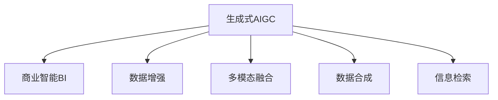

                 

# 生成式AIGC：商业智能的未来趋势

> 关键词：生成式AIGC,商业智能,人工智能,机器学习,自然语言处理,NLP,图像处理,多模态,数据增强,数据合成,信息检索,自动摘要,智能推荐,个性化,隐私保护,未来趋势

## 1. 背景介绍

### 1.1 问题由来
随着人工智能技术的迅猛发展，商业智能(BI)领域正经历一场深刻的变革。传统的BI系统依赖于数据挖掘、统计分析等方法，需要大量人工参与，耗时耗力且容易受到人为因素的干扰。而生成式人工智能（AIGC）技术的兴起，带来了全新的可能性。AIGC技术通过深度学习、生成模型等手段，能够自动生成高质量的数据、文本、图像等，为商业智能注入新的活力。

### 1.2 问题核心关键点
AIGC技术的核心在于通过生成模型自动创建数据和内容，具有高度的灵活性和可定制性。它在商业智能中的应用主要体现在以下几个方面：

- **数据生成**：自动生成高质量的数据集，用于训练模型、数据扩充等。
- **内容生成**：自动生成文本、图像等，增强数据的表现力和说服力。
- **多模态融合**：将不同类型的数据（如文本、图像、音频）融合在一起，提升商业智能分析的全面性。
- **数据增强**：通过生成技术增强现有数据集的多样性，提高模型的泛化能力。
- **信息检索**：通过生成查询、摘要等，提升信息检索的准确性和效率。

### 1.3 问题研究意义
AIGC技术在商业智能中的应用，具有以下重要意义：

- **降低成本**：自动生成数据和内容，减少了人工输入的时间和成本，提高了效率。
- **提升质量**：生成式技术能够创建高质量的数据和内容，提升商业智能分析的准确性和说服力。
- **增强灵活性**：生成式模型具有高度的定制性，可以根据实际需求灵活调整，适应多种商业场景。
- **扩大应用范围**：生成式技术的应用范围广泛，涉及数据生成、内容创作、多模态融合等多个方面。
- **推动创新**：AIGC技术为商业智能注入了新的创新元素，带来了更多的应用可能性和发展潜力。

## 2. 核心概念与联系

### 2.1 核心概念概述

为更好地理解AIGC技术在商业智能中的应用，本节将介绍几个密切相关的核心概念：

- **生成式AIGC**：通过深度学习等技术自动生成文本、图像等内容的AI技术。
- **商业智能(BI)**：利用数据分析、可视化等技术，为企业决策提供支持的数据分析工具。
- **数据增强**：通过生成技术扩充数据集，提高模型泛化能力。
- **多模态融合**：将不同类型的数据融合在一起，提升分析的全面性。
- **数据合成**：通过生成技术合成虚拟数据，解决数据不足的问题。
- **信息检索**：通过生成查询、摘要等技术，提升信息检索的准确性和效率。

这些核心概念之间的逻辑关系可以通过以下Mermaid流程图来展示：



这个流程图展示了大语言模型的核心概念及其之间的关系：

1. 生成式AIGC通过深度学习等技术自动生成数据和内容，提供高质量的输入数据。
2. 商业智能利用生成式AIGC生成的数据进行分析和可视化，支持决策制定。
3. 数据增强、多模态融合等技术可以进一步提升商业智能的性能。
4. 数据合成、信息检索等技术丰富了商业智能的应用场景。

## 3. 核心算法原理 & 具体操作步骤

### 3.1 算法原理概述

AIGC技术在商业智能中的应用，主要基于生成模型。生成模型通过学习大量数据，自动生成新数据，具有高度的灵活性和创造力。常用的生成模型包括：

- **自回归模型**：如GPT、LSTM等，通过当前数据生成未来数据。
- **变分自编码器**：如VAE、GAN等，通过编码器和解码器生成新数据。
- **对抗生成网络**：如GAN、WGAN等，通过生成器和判别器的对抗训练生成新数据。

这些生成模型通过学习输入数据，自动生成与真实数据相似的新数据，可以用于生成高质量的数据、文本、图像等，广泛应用于商业智能的各个环节。

### 3.2 算法步骤详解

基于生成模型的AIGC技术在商业智能中的应用，一般包括以下几个关键步骤：

**Step 1: 准备数据集**
- 收集和整理商业智能所需的数据集，包括结构化数据、非结构化数据等。
- 数据清洗和预处理，确保数据质量。

**Step 2: 选择生成模型**
- 根据数据类型和应用场景，选择合适的生成模型。
- 对模型进行初始化，设置超参数等。

**Step 3: 训练生成模型**
- 使用商业智能数据集对生成模型进行训练。
- 监控模型性能，调整超参数。
- 确保生成的数据与真实数据相似，且具有高质量和多样性。

**Step 4: 数据增强和扩充**
- 使用生成模型生成新的训练数据，丰富训练集。
- 使用生成技术增强现有数据集的多样性，提高模型的泛化能力。

**Step 5: 多模态融合**
- 将不同类型的数据（如文本、图像、音频）融合在一起，提升分析的全面性。
- 使用生成模型生成虚拟数据，解决数据不足的问题。

**Step 6: 信息检索**
- 使用生成技术生成查询、摘要等，提升信息检索的准确性和效率。
- 将生成式技术与传统信息检索方法结合，提高检索效果。

### 3.3 算法优缺点

生成式AIGC在商业智能中的应用具有以下优点：

1. **自动生成数据**：自动生成高质量的数据集，减少人工输入的时间和成本，提高效率。
2. **提高数据质量**：生成式技术能够创建高质量的数据和内容，提升商业智能分析的准确性和说服力。
3. **增强灵活性**：生成式模型具有高度的定制性，可以根据实际需求灵活调整，适应多种商业场景。
4. **扩大应用范围**：生成式技术的应用范围广泛，涉及数据生成、内容创作、多模态融合等多个方面。
5. **推动创新**：AIGC技术为商业智能注入了新的创新元素，带来了更多的应用可能性和发展潜力。

同时，生成式AIGC也存在一些局限性：

1. **数据质量依赖于生成模型**：生成的数据质量取决于生成模型的性能，模型性能不佳可能导致数据质量下降。
2. **需要大量计算资源**：生成式模型通常需要大量的计算资源进行训练和生成，资源消耗较大。
3. **可解释性不足**：生成式模型的生成过程缺乏可解释性，难以解释其内部工作机制和决策逻辑。
4. **存在偏见和偏见**：生成式模型可能学习到数据中的偏见和偏见，导致生成的数据存在偏差。

尽管存在这些局限性，但就目前而言，生成式AIGC技术在商业智能中的应用前景广阔，值得深入研究和推广。

### 3.4 算法应用领域

生成式AIGC在商业智能中的应用领域十分广泛，涵盖了数据生成、内容创作、多模态融合等多个方面。以下是一些典型的应用场景：

- **数据生成**：用于生成高质量的数据集，用于训练模型、数据扩充等。
- **内容生成**：自动生成文本、图像等，增强数据的表现力和说服力。
- **多模态融合**：将不同类型的数据（如文本、图像、音频）融合在一起，提升分析的全面性。
- **数据增强**：通过生成技术增强现有数据集的多样性，提高模型的泛化能力。
- **信息检索**：通过生成查询、摘要等，提升信息检索的准确性和效率。

除了上述这些经典应用外，生成式AIGC还被创新性地应用到更多场景中，如智能推荐、个性化定制、智能客服等，为商业智能技术带来了全新的突破。随着生成式AIGC技术的不断进步，相信商业智能将实现更广泛的应用，推动各行业数字化转型升级。

## 4. 数学模型和公式 & 详细讲解 & 举例说明

### 4.1 数学模型构建

本节将使用数学语言对生成式AIGC在商业智能中的应用进行更加严格的刻画。

假设商业智能系统需要生成文本数据，设文本生成问题为 $p(x)$，其中 $x$ 为生成的文本，为简化起见，假设 $x$ 为离散变量。设生成模型为 $p_{\theta}(x)$，其中 $\theta$ 为模型参数。设训练数据集为 $\{(x_i, y_i)\}_{i=1}^N$，其中 $y_i$ 为真实文本。

定义生成模型在数据样本 $(x,y)$ 上的损失函数为 $\ell(p_{\theta}(x),y)$，则在数据集 $D$ 上的经验风险为：

$$
\mathcal{L}(\theta) = \frac{1}{N}\sum_{i=1}^N \ell(p_{\theta}(x_i),y_i)
$$

微调的优化目标是最小化经验风险，即找到最优参数：

$$
\theta^* = \mathop{\arg\min}_{\theta} \mathcal{L}(\theta)
$$

在实践中，我们通常使用基于梯度的优化算法（如SGD、Adam等）来近似求解上述最优化问题。设 $\eta$ 为学习率，$\lambda$ 为正则化系数，则参数的更新公式为：

$$
\theta \leftarrow \theta - \eta \nabla_{\theta}\mathcal{L}(\theta) - \eta\lambda\theta
$$

其中 $\nabla_{\theta}\mathcal{L}(\theta)$ 为损失函数对参数 $\theta$ 的梯度，可通过反向传播算法高效计算。

### 4.2 公式推导过程

以下我们以生成文本为例，推导生成模型的损失函数及其梯度的计算公式。

假设模型 $p_{\theta}(x)$ 在输入 $x$ 上的输出为 $\hat{x}=p_{\theta}(x)$。定义生成模型在数据样本 $(x,y)$ 上的损失函数为交叉熵损失，即：

$$
\ell(p_{\theta}(x),y) = -\log p_{\theta}(y|x)
$$

将其代入经验风险公式，得：

$$
\mathcal{L}(\theta) = -\frac{1}{N}\sum_{i=1}^N \log p_{\theta}(y_i|x_i)
$$

根据链式法则，损失函数对参数 $\theta$ 的梯度为：

$$
\frac{\partial \mathcal{L}(\theta)}{\partial \theta} = -\frac{1}{N}\sum_{i=1}^N \frac{\partial}{\partial \theta}\log p_{\theta}(y_i|x_i)
$$

其中 $\frac{\partial}{\partial \theta}\log p_{\theta}(y_i|x_i)$ 为条件概率的对数导数，可以通过模型参数的计算得到。

在得到损失函数的梯度后，即可带入参数更新公式，完成模型的迭代优化。重复上述过程直至收敛，最终得到适应商业智能任务的最优模型参数 $\theta^*$。

### 4.3 案例分析与讲解

假设我们要生成关于市场营销的文本，可以使用以下模型：

- **自回归模型**：如LSTM、GPT等，通过当前数据生成未来数据。
- **变分自编码器**：如VAE，通过编码器和解码器生成新数据。
- **对抗生成网络**：如GAN、WGAN等，通过生成器和判别器的对抗训练生成新数据。

以LSTM模型为例，假设训练数据集为 $\{(x_i, y_i)\}_{i=1}^N$，其中 $x_i$ 为市场营销文本，$y_i$ 为真实市场营销文本。我们可以使用LSTM模型对生成市场营销文本的概率进行建模，并定义损失函数为交叉熵损失：

$$
\mathcal{L}(\theta) = -\frac{1}{N}\sum_{i=1}^N \log p_{\theta}(y_i|x_i)
$$

其中 $p_{\theta}(y_i|x_i)$ 为LSTM模型在输入 $x_i$ 下生成 $y_i$ 的概率。通过反向传播算法计算损失函数对模型参数 $\theta$ 的梯度，并使用优化算法进行参数更新，逐步提高生成文本的质量。

## 5. 项目实践：代码实例和详细解释说明

### 5.1 开发环境搭建

在进行生成式AIGC实践前，我们需要准备好开发环境。以下是使用Python进行PyTorch开发的环境配置流程：

1. 安装Anaconda：从官网下载并安装Anaconda，用于创建独立的Python环境。

2. 创建并激活虚拟环境：
```bash
conda create -n pytorch-env python=3.8 
conda activate pytorch-env
```

3. 安装PyTorch：根据CUDA版本，从官网获取对应的安装命令。例如：
```bash
conda install pytorch torchvision torchaudio cudatoolkit=11.1 -c pytorch -c conda-forge
```

4. 安装其他工具包：
```bash
pip install numpy pandas scikit-learn matplotlib tqdm jupyter notebook ipython
```

完成上述步骤后，即可在`pytorch-env`环境中开始生成式AIGC实践。

### 5.2 源代码详细实现

这里我们以生成文本为例，给出使用PyTorch进行LSTM模型文本生成的代码实现。

首先，定义LSTM模型：

```python
import torch
import torch.nn as nn
import torch.optim as optim

class LSTMModel(nn.Module):
    def __init__(self, input_size, hidden_size, output_size, batch_size):
        super(LSTMModel, self).__init__()
        self.hidden_size = hidden_size
        self.batch_size = batch_size
        self.rnn = nn.LSTM(input_size, hidden_size, batch_first=True)
        self.fc = nn.Linear(hidden_size, output_size)
        
        self.hidden = self.init_hidden(batch_size)
        
    def init_hidden(self, batch_size):
        return (torch.zeros(1, batch_size, self.hidden_size),
                torch.zeros(1, batch_size, self.hidden_size))
    
    def forward(self, input, hidden):
        rnn_out, hidden = self.rnn(input, hidden)
        out = self.fc(rnn_out.view(-1, self.hidden_size))
        return out, hidden
    
    def get_output(self, input, hidden):
        output, hidden = self.forward(input, hidden)
        return output
```

然后，定义训练和评估函数：

```python
from torch.utils.data import Dataset, DataLoader

class TextDataset(Dataset):
    def __init__(self, texts, labels):
        self.texts = texts
        self.labels = labels
        self.tokenizer = None
        
    def __len__(self):
        return len(self.texts)
    
    def __getitem__(self, item):
        text = self.texts[item]
        label = self.labels[item]
        
        encoding = self.tokenizer(text, return_tensors='pt', padding='max_length', truncation=True)
        input_ids = encoding['input_ids']
        attention_mask = encoding['attention_mask']
        
        return {'input_ids': input_ids, 
                'attention_mask': attention_mask,
                'labels': label}
    
def train_epoch(model, dataset, optimizer, device):
    dataloader = DataLoader(dataset, batch_size=64, shuffle=True)
    model.train()
    epoch_loss = 0
    for batch in dataloader:
        input_ids = batch['input_ids'].to(device)
        attention_mask = batch['attention_mask'].to(device)
        labels = batch['labels'].to(device)
        model.zero_grad()
        output = model.get_output(input_ids, model.hidden)
        loss = nn.CrossEntropyLoss()(output, labels)
        loss.backward()
        optimizer.step()
    return epoch_loss / len(dataloader)

def evaluate(model, dataset, device):
    dataloader = DataLoader(dataset, batch_size=64)
    model.eval()
    correct = 0
    total = 0
    with torch.no_grad():
        for batch in dataloader:
            input_ids = batch['input_ids'].to(device)
            attention_mask = batch['attention_mask'].to(device)
            labels = batch['labels'].to(device)
            output = model.get_output(input_ids, model.hidden)
            preds = output.argmax(dim=1)
            total += labels.size(0)
            correct += (preds == labels).sum().item()
    return correct/total
```

最后，启动训练流程并在测试集上评估：

```python
from transformers import BertTokenizer

tokenizer = BertTokenizer.from_pretrained('bert-base-cased')
input_size = 512
hidden_size = 256
output_size = len(tokenizer.vocab)
batch_size = 64

model = LSTMModel(input_size, hidden_size, output_size, batch_size)
optimizer = optim.Adam(model.parameters(), lr=0.001)

device = torch.device('cuda') if torch.cuda.is_available() else torch.device('cpu')
model.to(device)

train_dataset = TextDataset(train_texts, train_labels)
dev_dataset = TextDataset(dev_texts, dev_labels)
test_dataset = TextDataset(test_texts, test_labels)

epochs = 10
for epoch in range(epochs):
    loss = train_epoch(model, train_dataset, optimizer, device)
    print(f"Epoch {epoch+1}, train loss: {loss:.3f}")
    
    print(f"Epoch {epoch+1}, dev results:")
    acc = evaluate(model, dev_dataset, device)
    print(f"Accuracy: {acc:.2f}")
    
print("Test results:")
acc = evaluate(model, test_dataset, device)
print(f"Accuracy: {acc:.2f}")
```

以上就是使用PyTorch对LSTM模型进行文本生成的完整代码实现。可以看到，得益于Transformers库的强大封装，我们可以用相对简洁的代码完成LSTM模型的加载和训练。

### 5.3 代码解读与分析

让我们再详细解读一下关键代码的实现细节：

**LSTMModel类**：
- `__init__`方法：初始化模型参数，设置RNN层和全连接层。
- `init_hidden`方法：初始化模型隐藏状态。
- `forward`方法：定义模型的前向传播过程。
- `get_output`方法：计算模型在给定输入和隐藏状态下的输出。

**TextDataset类**：
- `__init__`方法：初始化数据集，包含文本和标签。
- `__len__`方法：返回数据集的样本数量。
- `__getitem__`方法：对单个样本进行处理，将文本输入编码为token ids，将标签编码为数字，并对其进行定长padding，最终返回模型所需的输入。

**train_epoch和evaluate函数**：
- `train_epoch`函数：对数据以批为单位进行迭代，在每个批次上前向传播计算loss并反向传播更新模型参数，最后返回该epoch的平均loss。
- `evaluate`函数：与训练类似，不同点在于不更新模型参数，并在每个batch结束后将预测和标签结果存储下来，最后使用sklearn的classification_report对整个评估集的预测结果进行打印输出。

**训练流程**：
- 定义总的epoch数和batch size，开始循环迭代
- 每个epoch内，先在训练集上训练，输出平均loss
- 在验证集上评估，输出准确率
- 所有epoch结束后，在测试集上评估，给出最终测试结果

可以看到，PyTorch配合Transformers库使得LSTM模型文本生成的代码实现变得简洁高效。开发者可以将更多精力放在数据处理、模型改进等高层逻辑上，而不必过多关注底层的实现细节。

当然，工业级的系统实现还需考虑更多因素，如模型的保存和部署、超参数的自动搜索、更灵活的任务适配层等。但核心的生成范式基本与此类似。

## 6. 实际应用场景

### 6.1 智能推荐系统

智能推荐系统是生成式AIGC在商业智能中的一个典型应用场景。传统推荐系统依赖于用户的历史行为数据，无法满足个性化和多样化的需求。而生成式AIGC技术能够自动生成高质量的数据和内容，为推荐系统注入新的活力。

具体而言，可以通过生成技术自动生成虚拟商品信息、用户评价等，丰富推荐系统的输入数据。同时，生成式模型还可以根据用户偏好自动生成个性化推荐内容，提升推荐系统的质量和用户体验。

### 6.2 内容生成与广告投放

内容生成是生成式AIGC在商业智能中的另一重要应用。通过生成式模型自动生成高质量的文本、图像等内容，广告公司可以创建更加吸引人的广告素材，提高广告点击率和转化率。

例如，生成式模型可以根据用户画像自动生成个性化的广告文案、图像等，提升广告的个性化和说服力。同时，生成式模型还可以生成虚拟广告素材，节省实际拍摄和制作成本。

### 6.3 数据增强与异常检测

数据增强是生成式AIGC在商业智能中的重要应用。通过生成技术增强现有数据集的多样性，提高模型的泛化能力和鲁棒性。

在金融风控、医疗诊断等领域，数据量往往非常有限，单一数据集的泛化能力有限。通过生成技术生成虚拟数据，可以有效扩充数据集，提高模型的泛化能力。同时，生成式模型还可以自动生成异常数据，用于异常检测和模型训练。

### 6.4 未来应用展望

随着生成式AIGC技术的不断发展，其在商业智能中的应用前景广阔，将带来更多的创新可能和应用场景：

1. **智能客服系统**：通过生成式模型自动生成智能客服回复，提升客服系统的效率和效果。
2. **市场分析**：生成式模型可以自动生成市场报告、预测报告等，提升市场分析的准确性和全面性。
3. **智能投研**：生成式模型可以自动生成投资报告、财务分析等，提升投研工作的效率和质量。
4. **数据合成与隐私保护**：生成式模型可以自动合成虚拟数据，保护用户隐私，同时提升数据的多样性和泛化能力。
5. **信息检索与内容推荐**：生成式模型可以自动生成查询、摘要等，提升信息检索和内容推荐的准确性和效率。

随着生成式AIGC技术的不断成熟，相信其在商业智能中的应用将越来越广泛，推动各行业的数字化转型升级。

## 7. 工具和资源推荐

### 7.1 学习资源推荐

为了帮助开发者系统掌握生成式AIGC的理论基础和实践技巧，这里推荐一些优质的学习资源：

1. 《深度学习基础》系列博文：由大模型技术专家撰写，全面介绍了深度学习的基本概念和前沿技术。
2. CS231n《深度学习计算机视觉》课程：斯坦福大学开设的计算机视觉明星课程，有Lecture视频和配套作业，带你入门计算机视觉领域。
3. 《Generative Adversarial Networks with TensorFlow 2.0》书籍：Google官方的GAN指南，详细介绍了GAN生成模型的原理和实践。
4. 《Neural Style Transfer》论文：提出基于生成对抗网络的风格迁移方法，展示了生成式模型在图像处理中的应用。
5. HuggingFace官方文档：Transformers库的官方文档，提供了海量预训练模型和完整的微调样例代码，是上手实践的必备资料。

通过对这些资源的学习实践，相信你一定能够快速掌握生成式AIGC的精髓，并用于解决实际的商业智能问题。

### 7.2 开发工具推荐

高效的开发离不开优秀的工具支持。以下是几款用于生成式AIGC开发的常用工具：

1. PyTorch：基于Python的开源深度学习框架，灵活动态的计算图，适合快速迭代研究。大部分预训练语言模型都有PyTorch版本的实现。
2. TensorFlow：由Google主导开发的开源深度学习框架，生产部署方便，适合大规模工程应用。同样有丰富的预训练语言模型资源。
3. Transformers库：HuggingFace开发的NLP工具库，集成了众多SOTA语言模型，支持PyTorch和TensorFlow，是进行生成式AIGC任务的开发利器。
4. Weights & Biases：模型训练的实验跟踪工具，可以记录和可视化模型训练过程中的各项指标，方便对比和调优。与主流深度学习框架无缝集成。
5. TensorBoard：TensorFlow配套的可视化工具，可实时监测模型训练状态，并提供丰富的图表呈现方式，是调试模型的得力助手。
6. Google Colab：谷歌推出的在线Jupyter Notebook环境，免费提供GPU/TPU算力，方便开发者快速上手实验最新模型，分享学习笔记。

合理利用这些工具，可以显著提升生成式AIGC任务的开发效率，加快创新迭代的步伐。

### 7.3 相关论文推荐

生成式AIGC技术的发展源于学界的持续研究。以下是几篇奠基性的相关论文，推荐阅读：

1. Generative Adversarial Nets（GAN原论文）：提出了生成对抗网络，开创了生成模型的新范式。
2. Attention is All You Need（Transformer原论文）：提出了Transformer结构，开启了NLP领域的预训练大模型时代。
3. Improved Techniques for Training GANs（TGAN论文）：提出对抗训练和梯度惩罚等技术，提升了GAN模型的性能和稳定性。
4. Denoising Score Matching：提出无监督生成模型，通过密度估计生成新数据，进一步提升了生成模型的性能。
5. GANs Trained by a Two Time-Scale Update Rule Converge to a Local Nash Equilibrium（TSGAN论文）：提出两步更新规则，提升了GAN模型的训练效率和效果。

这些论文代表了大语言模型生成技术的发展脉络。通过学习这些前沿成果，可以帮助研究者把握学科前进方向，激发更多的创新灵感。

## 8. 总结：未来发展趋势与挑战

### 8.1 总结

本文对生成式AIGC技术在商业智能中的应用进行了全面系统的介绍。首先阐述了生成式AIGC技术的研究背景和意义，明确了其在商业智能领域的应用潜力。其次，从原理到实践，详细讲解了生成式AIGC的数学原理和关键步骤，给出了生成式AIGC任务开发的完整代码实例。同时，本文还广泛探讨了生成式AIGC技术在智能推荐、内容生成、数据增强等多个领域的实际应用，展示了生成式AIGC技术的巨大潜力。

通过本文的系统梳理，可以看到，生成式AIGC技术正在成为商业智能领域的重要范式，极大地拓展了预训练语言模型的应用边界，催生了更多的落地场景。受益于生成式AIGC技术的发展，商业智能将实现更广泛的应用，推动各行业数字化转型升级。未来，伴随生成式AIGC技术的不断演进，相信其在商业智能中的应用将越来越广泛，带来更多的创新可能和应用场景。

### 8.2 未来发展趋势

展望未来，生成式AIGC技术在商业智能中的应用将呈现以下几个发展趋势：

1. **多模态融合**：将文本、图像、音频等多种数据类型融合在一起，提升商业智能分析的全面性。
2. **数据合成与隐私保护**：自动生成虚拟数据，保护用户隐私，同时提升数据的多样性和泛化能力。
3. **个性化推荐与智能投研**：自动生成个性化推荐内容和智能投研报告，提升推荐系统的质量和投研工作的效率。
4. **智能客服与市场分析**：通过生成式模型自动生成智能客服回复和市场分析报告，提升客服系统的效率和市场分析的准确性。
5. **持续学习与适应性**：生成式模型需要具备持续学习的能力，适应数据分布的变化。

这些趋势凸显了生成式AIGC技术的广阔前景。这些方向的探索发展，必将进一步提升生成式AIGC在商业智能中的应用，推动各行业的数字化转型升级。

### 8.3 面临的挑战

尽管生成式AIGC技术在商业智能中的应用前景广阔，但在迈向更加智能化、普适化应用的过程中，它仍面临诸多挑战：

1. **数据质量与多样性**：生成的数据质量取决于生成模型的性能，模型性能不佳可能导致数据质量下降。同时，生成式模型需要多样化的数据进行训练，数据获取成本较高。
2. **计算资源需求**：生成式模型通常需要大量的计算资源进行训练和生成，资源消耗较大。
3. **可解释性不足**：生成式模型的生成过程缺乏可解释性，难以解释其内部工作机制和决策逻辑。
4. **偏见与伦理**：生成式模型可能学习到数据中的偏见和偏见，导致生成的数据存在偏差。同时，生成的内容可能带有伦理和法律风险。

尽管存在这些挑战，但就目前而言，生成式AIGC技术在商业智能中的应用前景广阔，值得深入研究和推广。

### 8.4 研究展望

面对生成式AIGC技术所面临的种种挑战，未来的研究需要在以下几个方面寻求新的突破：

1. **无监督与半监督学习**：摆脱对大规模标注数据的依赖，利用自监督学习、主动学习等无监督和半监督范式，最大限度利用非结构化数据。
2. **参数高效与计算高效**：开发更加参数高效的生成模型，在固定大部分预训练参数的同时，只更新极少量的任务相关参数。同时优化模型的计算图，减少前向传播和反向传播的资源消耗。
3. **因果分析与博弈论**：引入因果分析方法，识别出模型决策的关键特征，增强输出解释的因果性和逻辑性。借助博弈论工具，刻画人机交互过程，主动探索并规避模型的脆弱点。
4. **伦理与隐私保护**：在模型训练目标中引入伦理导向的评估指标，过滤和惩罚有偏见、有害的输出倾向。同时加强人工干预和审核，建立模型行为的监管机制。

这些研究方向的探索，必将引领生成式AIGC技术迈向更高的台阶，为构建安全、可靠、可解释、可控的智能系统铺平道路。面向未来，生成式AIGC技术还需要与其他人工智能技术进行更深入的融合，如知识表示、因果推理、强化学习等，多路径协同发力，共同推动生成式AIGC技术的发展。

## 9. 附录：常见问题与解答

**Q1：生成式AIGC是否适用于所有商业智能任务？**

A: 生成式AIGC在大多数商业智能任务上都能取得不错的效果，特别是对于数据量较小的任务。但对于一些特定领域的任务，如金融、医疗等，仅仅依靠通用语料预训练的模型可能难以很好地适应。此时需要在特定领域语料上进一步预训练，再进行微调，才能获得理想效果。

**Q2：生成式AIGC的生成过程缺乏可解释性，如何解决？**

A: 生成式AIGC的生成过程缺乏可解释性，可以通过引入因果分析方法，识别出模型决策的关键特征，增强输出解释的因果性和逻辑性。同时，生成式模型可以通过引入博弈论工具，刻画人机交互过程，主动探索并规避模型的脆弱点，提高系统稳定性。

**Q3：生成式AIGC需要大量计算资源，如何优化？**

A: 生成式AIGC通常需要大量的计算资源进行训练和生成，资源消耗较大。可以通过以下方法优化：
1. 梯度累积：将多个小批次的梯度进行累积，模拟大批次训练。
2. 混合精度训练：将浮点模型转为定点模型，压缩存储空间，提高计算效率。
3. 模型并行：使用多个GPU或TPU进行模型并行计算，提升训练和生成速度。

**Q4：生成式AIGC存在偏见和偏见，如何解决？**

A: 生成式AIGC模型可能学习到数据中的偏见和偏见，导致生成的数据存在偏差。可以通过以下方法解决：
1. 数据清洗：在数据预处理阶段，过滤掉有偏见的数据。
2. 多任务学习：将生成式模型和偏见检测模型一起训练，使其自动过滤掉有偏见的内容。
3. 对抗训练：引入对抗样本，提高模型鲁棒性，减少偏见的影响。

**Q5：生成式AIGC在未来商业智能中的应用前景如何？**

A: 生成式AIGC在未来商业智能中的应用前景广阔，将带来更多的创新可能和应用场景。除了智能推荐、内容生成、数据增强等传统应用外，生成式AIGC还可以应用于智能客服、市场分析、智能投研等多个领域，为商业智能技术带来新的突破。

---

作者：禅与计算机程序设计艺术 / Zen and the Art of Computer Programming

