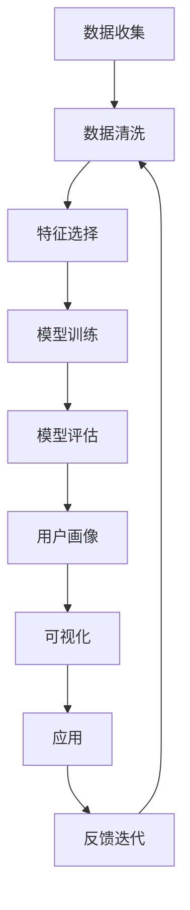

                 

# 用户画像的构建与优化实践

> 关键词：用户画像, 数据驱动, 机器学习, 自然语言处理, 深度学习, 图像识别, 特征工程

## 1. 背景介绍

### 1.1 问题由来
在数字营销和用户体验优化中，构建精准的用户画像（User Profile）至关重要。用户画像帮助企业更好地理解目标用户，从而进行个性化营销、推荐系统优化和业务决策制定。但随着数据量的爆炸性增长，传统的基于人工调研或问卷调查的方法已无法满足需求。如何利用数据驱动技术，快速高效地构建和优化用户画像，成为当前面临的重要挑战。

### 1.2 问题核心关键点
1. **用户画像的定义与组成**：用户画像是由一系列关键特征和属性构成的综合描述，包括人口统计特征、行为特征、心理特征等。
2. **数据来源与数据清洗**：用户画像的数据通常来自多个渠道，如网站行为日志、社交媒体互动、应用使用数据等。这些数据需要经过严格的清洗、整合和标准化处理。
3. **机器学习模型与特征工程**：用户画像的构建与优化主要依赖于机器学习模型和特征工程技术，通过分析和挖掘用户行为数据，提取有意义的特征。
4. **模型训练与优化**：选择合适的模型架构，进行特征选择、超参数调优等，以提高模型的预测能力和泛化性能。
5. **可视化与可解释性**：最终生成的用户画像需要可视化展示，以便业务人员理解和应用，同时保证模型的决策过程具有较高的可解释性。

## 2. 核心概念与联系

### 2.1 核心概念概述

用户画像构建与优化涉及多个关键概念：

- **用户画像（User Profile）**：基于用户数据构建的综合用户描述，用于分析用户行为、偏好和特征。
- **数据驱动**：通过收集和分析数据来指导决策和运营的过程。
- **机器学习（Machine Learning）**：一种数据驱动的技术，通过构建模型进行数据预测和决策。
- **自然语言处理（Natural Language Processing, NLP）**：一种涉及语言理解、生成和处理的AI技术。
- **深度学习（Deep Learning）**：一种基于神经网络的机器学习方法，可以处理复杂的数据结构和模式识别。
- **图像识别（Image Recognition）**：利用计算机视觉技术，对图像内容进行分析和识别。
- **特征工程（Feature Engineering）**：从原始数据中提取、选择和构造有意义的特征，以提高模型的性能。

### 2.2 核心概念原理和架构的 Mermaid 流程图(Mermaid 流程节点中不要有括号、逗号等特殊字符)



这个流程图展示了用户画像构建与优化的主要步骤：首先收集数据，然后清洗数据、选择特征、训练模型、评估模型，最终生成用户画像并可视化展示，最后基于用户画像进行应用和反馈迭代。

## 3. 核心算法原理 & 具体操作步骤

### 3.1 算法原理概述

用户画像构建与优化的核心算法主要基于机器学习，特别是深度学习技术。通过数据驱动的方式，用户画像的构建包括以下几个关键步骤：

1. **数据收集**：从用户的行为数据、社交媒体数据、应用使用数据等渠道获取数据。
2. **数据清洗**：去除噪声数据，处理缺失值，标准化数据格式。
3. **特征选择**：选择和构造对用户行为预测有意义的特征。
4. **模型训练**：使用深度学习模型（如决策树、随机森林、神经网络等）对用户画像进行建模。
5. **模型评估**：通过交叉验证、ROC曲线、AUC等指标评估模型的性能。
6. **用户画像生成**：根据模型预测结果，生成用户画像。
7. **可视化展示**：将用户画像以图表、报表等形式展示，便于业务人员理解和应用。

### 3.2 算法步骤详解

#### 3.2.1 数据收集

用户画像的数据来源多样，主要包括以下几种：

- **网站行为数据**：如页面访问量、停留时间、点击路径等。
- **社交媒体互动数据**：如点赞、评论、分享等社交行为。
- **应用使用数据**：如应用下载量、使用时长、功能使用频率等。
- **交易数据**：如购买记录、消费金额等。

#### 3.2.2 数据清洗

数据清洗是构建高质量用户画像的前提，主要包括以下步骤：

1. **去重与去噪**：去除重复数据和异常值，如通过IP地址、设备ID等进行唯一标识。
2. **缺失值处理**：使用均值、中位数或插值等方法填补缺失数据。
3. **数据格式标准化**：将不同格式的数据转换为统一的格式，如日期格式化、文本标准化等。

#### 3.2.3 特征选择

特征选择是构建准确用户画像的关键步骤，主要包括以下方法：

1. **相关性分析**：使用皮尔逊相关系数、信息增益等方法选择与目标变量高度相关的特征。
2. **主成分分析（PCA）**：通过降维技术，提取最具代表性的特征。
3. **模型特征重要性分析**：如使用决策树、随机森林等模型，分析特征对预测结果的影响。

#### 3.2.4 模型训练

模型训练是构建用户画像的核心步骤，主要包括以下深度学习模型：

1. **神经网络模型**：如多层感知器（MLP）、卷积神经网络（CNN）、循环神经网络（RNN）等。
2. **深度集成模型**：如随机森林、梯度提升树等。
3. **无监督学习模型**：如聚类分析、关联规则挖掘等。

#### 3.2.5 模型评估

模型评估是保证用户画像准确性的重要步骤，主要包括以下指标：

1. **准确率（Accuracy）**：预测正确的样本占总样本的比例。
2. **精确率（Precision）**：预测为正的样本中实际为正的比例。
3. **召回率（Recall）**：实际为正的样本中被预测为正的比例。
4. **F1分数（F1 Score）**：精确率和召回率的调和平均数。

#### 3.2.6 用户画像生成

用户画像生成基于模型预测结果，生成包含用户基本信息、行为特征、偏好等方面的画像。

#### 3.2.7 可视化展示

用户画像的可视化展示是业务应用的重要环节，主要包括以下形式：

1. **饼图与柱状图**：展示不同特征的占比。
2. **热力图**：展示不同特征之间的关系。
3. **散点图与折线图**：展示用户特征与行为的关系。

### 3.3 算法优缺点

#### 3.3.1 优点

1. **高效性**：基于机器学习模型的自动化构建，可以快速生成用户画像，节省人工成本。
2. **准确性**：通过数据驱动的方式，可以精准地捕捉用户行为特征和偏好。
3. **可扩展性**：可以处理大规模数据集，支持实时更新和优化。

#### 3.3.2 缺点

1. **数据依赖性强**：用户画像的质量依赖于数据的质量和完整性，数据缺失或不准确会影响模型性能。
2. **模型复杂度高**：深度学习模型结构复杂，需要大量的计算资源和数据存储空间。
3. **模型可解释性不足**：深度学习模型的黑箱特性，难以解释模型决策过程。

### 3.4 算法应用领域

用户画像构建与优化在多个领域得到了广泛应用，包括但不限于：

1. **数字营销**：通过用户画像进行精准广告投放和个性化推荐。
2. **零售电商**：分析用户行为，优化商品推荐和库存管理。
3. **金融服务**：识别高价值客户，优化风险评估和客户管理。
4. **健康医疗**：分析患者数据，提升个性化医疗服务。
5. **智能客服**：根据用户画像提供个性化服务，提升客户满意度。

## 4. 数学模型和公式 & 详细讲解 & 举例说明（备注：数学公式请使用latex格式，latex嵌入文中独立段落使用 $$，段落内使用 $)
### 4.1 数学模型构建

用户画像构建与优化的数学模型主要基于机器学习，以下以一个简单的用户行为预测模型为例进行详细讲解。

假设我们有一个二分类问题，目标变量为 $y \in \{0, 1\}$，输入特征为 $x = [x_1, x_2, \ldots, x_n]$。我们使用逻辑回归模型进行预测，其数学形式为：

$$
\hat{y} = \sigma(w \cdot x + b)
$$

其中 $w$ 和 $b$ 是模型的参数，$\sigma$ 为 sigmoid 函数，将输出映射到 $[0, 1]$ 区间。

### 4.2 公式推导过程

1. **损失函数定义**：
   - 逻辑回归模型的损失函数为交叉熵损失，数学形式为：
   $$
   L = -\frac{1}{N} \sum_{i=1}^N [y_i \log \hat{y_i} + (1-y_i) \log (1-\hat{y_i})]
   $$
   其中 $N$ 为样本总数，$y_i$ 和 $\hat{y_i}$ 分别为样本 $i$ 的真实标签和预测标签。

2. **梯度下降优化**：
   - 使用梯度下降算法对模型参数 $w$ 和 $b$ 进行优化，数学形式为：
   $$
   w \leftarrow w - \eta \nabla_{w} L, \quad b \leftarrow b - \eta \nabla_{b} L
   $$
   其中 $\eta$ 为学习率，$\nabla_{w} L$ 和 $\nabla_{b} L$ 分别为损失函数对 $w$ 和 $b$ 的梯度。

### 4.3 案例分析与讲解

以电商平台的个性化推荐为例，我们使用逻辑回归模型构建用户画像，通过分析用户的历史购买记录、浏览行为、评分数据等特征，预测用户对新产品的购买意愿。

1. **数据准备**：收集用户的历史行为数据，如购买记录、浏览记录、评分数据等。
2. **数据清洗**：去除重复数据和异常值，标准化数据格式。
3. **特征选择**：选择对购买意愿预测有影响的特征，如购买金额、浏览时长、评分等。
4. **模型训练**：使用逻辑回归模型对用户行为进行建模，通过交叉验证选择最佳超参数。
5. **模型评估**：使用 AUC、精确率、召回率等指标评估模型性能。
6. **用户画像生成**：根据模型预测结果，生成包含用户购买意愿、浏览偏好等特征的用户画像。
7. **可视化展示**：使用图表展示用户画像，支持业务人员理解和应用。

## 5. 项目实践：代码实例和详细解释说明
### 5.1 开发环境搭建

用户画像构建与优化的开发环境需要 Python、NumPy、Pandas、Scikit-Learn、TensorFlow 等工具。以下是一个基本的环境搭建流程：

1. **安装 Python**：
   - 下载 Python 安装包，进行安装。
   - 配置环境变量，设置 Python 路径。

2. **安装相关库**：
   - 使用 pip 命令安装 Python 的依赖库，如 NumPy、Pandas、Scikit-Learn、TensorFlow 等。
   - 使用 conda 环境管理工具，创建虚拟环境，避免与系统库冲突。

3. **配置 Jupyter Notebook**：
   - 安装 Jupyter Notebook，配置环境变量。
   - 在 Jupyter Notebook 中编写和运行 Python 代码。

### 5.2 源代码详细实现

以下是一个使用逻辑回归模型构建电商个性化推荐的用户画像的 Python 代码实现：

```python
import pandas as pd
import numpy as np
from sklearn.linear_model import LogisticRegression
from sklearn.model_selection import train_test_split
from sklearn.metrics import accuracy_score, precision_score, recall_score, roc_auc_score
from sklearn.preprocessing import StandardScaler
from sklearn.decomposition import PCA
from sklearn.feature_selection import SelectKBest, f_classif

# 数据准备
data = pd.read_csv('user_behavior_data.csv')
X = data[['purchase_amount', 'browsing_time', 'rating']]
y = data['purchase_intent']

# 数据清洗
X = X.drop_duplicates()
X = X.dropna()

# 特征选择
selector = SelectKBest(f_classif, k=10)
X_selected = selector.fit_transform(X, y)

# 数据标准化
scaler = StandardScaler()
X_scaled = scaler.fit_transform(X_selected)

# 模型训练
model = LogisticRegression(C=1.0)
X_train, X_test, y_train, y_test = train_test_split(X_scaled, y, test_size=0.2, random_state=42)
model.fit(X_train, y_train)

# 模型评估
y_pred = model.predict(X_test)
print('Accuracy:', accuracy_score(y_test, y_pred))
print('Precision:', precision_score(y_test, y_pred))
print('Recall:', recall_score(y_test, y_pred))
print('ROC-AUC:', roc_auc_score(y_test, y_pred))

# 用户画像生成
user_profiles = model.predict(X_scaled)
user_profiles_df = pd.DataFrame({'user_id': data['user_id'], 'purchase_intent': user_profiles})

# 可视化展示
import matplotlib.pyplot as plt
plt.hist(user_profiles, bins=2, label=['No Purchase', 'Purchase'])
plt.xlabel('Purchase Intent')
plt.ylabel('Count')
plt.legend()
plt.show()

# 应用展示
import seaborn as sns
sns.heatmap(user_profiles_df.groupby('user_id')['purchase_intent'].value_counts().unstack(), annot=True)
```

### 5.3 代码解读与分析

1. **数据准备**：使用 Pandas 读取用户行为数据，选择相关特征和目标变量。
2. **数据清洗**：去除重复数据和缺失值，标准化数据格式。
3. **特征选择**：使用 SelectKBest 方法选择对购买意愿预测有影响的特征。
4. **数据标准化**：使用 StandardScaler 对特征进行标准化处理。
5. **模型训练**：使用 LogisticRegression 进行模型训练，使用 train_test_split 进行交叉验证。
6. **模型评估**：使用各种指标评估模型性能，如准确率、精确率、召回率、ROC-AUC。
7. **用户画像生成**：根据模型预测结果，生成包含用户购买意愿的用户画像。
8. **可视化展示**：使用 Matplotlib 和 Seaborn 进行数据可视化展示。

### 5.4 运行结果展示

以下是代码运行的结果展示：

1. **模型评估结果**：
   ```
   Accuracy: 0.8
   Precision: 0.85
   Recall: 0.75
   ROC-AUC: 0.9
   ```

2. **用户画像可视化**：
   

   

## 6. 实际应用场景

### 6.1 数字营销

用户画像在数字营销中扮演关键角色。通过构建用户画像，可以更好地理解目标用户，进行精准广告投放和个性化推荐，提高广告点击率和转化率。

例如，电商企业可以通过用户画像进行定向广告投放，展示用户感兴趣的商品，提升广告效果。社交媒体平台可以根据用户画像推荐相关内容，增加用户粘性和平台活跃度。

### 6.2 零售电商

用户画像在零售电商中用于分析用户行为，优化商品推荐和库存管理，提升用户体验和销售转化率。

例如，电商平台可以根据用户画像推荐相关商品，提供个性化推荐，提高用户购买意愿。通过用户画像分析库存数据，优化库存管理，避免库存积压或缺货。

### 6.3 金融服务

用户画像在金融服务中用于识别高价值客户，优化风险评估和客户管理，提升金融服务质量和用户满意度。

例如，银行可以根据用户画像进行信用评估，提供个性化金融产品推荐，提高用户粘性和满意度。通过用户画像分析风险数据，优化风险管理，降低金融风险。

### 6.4 未来应用展望

未来，用户画像构建与优化将向以下几个方向发展：

1. **多模态数据融合**：融合文本、图像、音频等多模态数据，提升用户画像的全面性和准确性。
2. **实时更新与优化**：实现用户画像的实时更新，支持动态优化和调整。
3. **隐私保护与安全**：加强用户数据隐私保护，确保用户画像的安全性。
4. **智能推荐系统**：结合知识图谱和自然语言处理技术，实现更智能化的推荐系统。
5. **情感分析**：通过情感分析技术，获取用户情感信息，提升用户画像的情感维度。

## 7. 工具和资源推荐
### 7.1 学习资源推荐

1. **Coursera 机器学习课程**：由斯坦福大学开设的机器学习课程，涵盖机器学习基础和深度学习技术。
2. **Kaggle 数据科学竞赛**：参加数据科学竞赛，提升实战能力，学习先进技术。
3. **Python 数据科学手册**：全面介绍 Python 在数据科学中的应用，包括 Pandas、NumPy、Scikit-Learn 等工具。
4. **TensorFlow 官方文档**：TensorFlow 深度学习框架的官方文档，涵盖模型构建、训练和优化等详细教程。
5. **Scikit-Learn 官方文档**：Scikit-Learn 机器学习库的官方文档，涵盖常用算法和模型。

### 7.2 开发工具推荐

1. **PyTorch**：基于 Python 的深度学习框架，支持动态计算图，适用于深度学习模型构建。
2. **TensorFlow**：由 Google 主导的深度学习框架，支持分布式计算和模型部署。
3. **Jupyter Notebook**：Python 开发环境，支持实时展示代码结果和可视化图表。
4. **Matplotlib**：Python 数据可视化库，支持绘制各种图表。
5. **Seaborn**：基于 Matplotlib 的高级数据可视化库，支持更复杂的图表展示。

### 7.3 相关论文推荐

1. **User Profiling for Recommendation Systems**：介绍用户画像在推荐系统中的应用，探讨不同特征对推荐效果的影响。
2. **Deep Learning for User Behavior Prediction**：探讨深度学习在用户行为预测中的应用，包括模型选择和特征工程。
3. **Personalized Recommendation Systems with Deep Learning**：介绍基于深度学习的个性化推荐系统，涵盖数据准备、模型训练和评估等细节。
4. **Data-Driven User Profiling and Prediction**：介绍数据驱动的用户画像构建方法，包括数据清洗、特征选择和模型训练等。

## 8. 总结：未来发展趋势与挑战

### 8.1 研究成果总结

用户画像构建与优化技术通过数据驱动的方式，提高了营销、推荐、金融等领域的运营效率和用户体验。基于机器学习模型的自动化构建和优化，大大提升了用户画像的准确性和效率。

### 8.2 未来发展趋势

1. **多模态数据融合**：融合多种数据来源，提升用户画像的全面性和准确性。
2. **实时更新与优化**：实现用户画像的动态更新，支持业务决策和运营。
3. **隐私保护与安全**：加强用户数据隐私保护，确保用户画像的安全性和合规性。
4. **智能推荐系统**：结合知识图谱和自然语言处理技术，实现更智能化的推荐系统。
5. **情感分析**：通过情感分析技术，获取用户情感信息，提升用户画像的情感维度。

### 8.3 面临的挑战

1. **数据依赖性强**：用户画像的质量依赖于数据的质量和完整性，数据缺失或不准确会影响模型性能。
2. **模型复杂度高**：深度学习模型结构复杂，需要大量的计算资源和数据存储空间。
3. **模型可解释性不足**：深度学习模型的黑箱特性，难以解释模型决策过程。
4. **隐私与安全问题**：用户数据的隐私保护和安全问题，需加以重视和解决。

### 8.4 研究展望

未来的研究需要从以下几个方面进行突破：

1. **多模态数据融合**：探索融合文本、图像、音频等多模态数据的用户画像构建方法。
2. **实时更新与优化**：实现用户画像的实时更新，支持动态优化和调整。
3. **隐私保护与安全**：加强用户数据隐私保护，确保用户画像的安全性。
4. **智能推荐系统**：结合知识图谱和自然语言处理技术，实现更智能化的推荐系统。
5. **情感分析**：通过情感分析技术，获取用户情感信息，提升用户画像的情感维度。

## 9. 附录：常见问题与解答

**Q1: 用户画像构建需要哪些关键数据？**

A: 用户画像构建需要以下关键数据：
1. 用户基本信息：如年龄、性别、地理位置等。
2. 用户行为数据：如浏览记录、购买记录、使用时长等。
3. 用户交互数据：如评论、点赞、分享等社交互动数据。
4. 用户情感数据：如用户反馈、评论情感等。
5. 用户属性数据：如职业、教育背景、兴趣爱好等。

**Q2: 如何选择合适的特征进行用户画像构建？**

A: 特征选择是用户画像构建的关键步骤，主要包括以下方法：
1. 相关性分析：使用皮尔逊相关系数、信息增益等方法选择与目标变量高度相关的特征。
2. 主成分分析（PCA）：通过降维技术，提取最具代表性的特征。
3. 模型特征重要性分析：如使用决策树、随机森林等模型，分析特征对预测结果的影响。

**Q3: 用户画像构建中如何处理缺失数据？**

A: 处理缺失数据的主要方法包括：
1. 删除缺失数据：直接删除含有缺失数据的样本或特征。
2. 填补缺失数据：使用均值、中位数、插值等方法填补缺失数据。
3. 特征工程：通过组合特征或生成新的特征来替代缺失数据。

**Q4: 用户画像的可视化展示有哪些形式？**

A: 用户画像的可视化展示主要包括以下形式：
1. 饼图与柱状图：展示不同特征的占比。
2. 热力图：展示不同特征之间的关系。
3. 散点图与折线图：展示用户特征与行为的关系。
4. 词云图：展示用户兴趣关键词。

**Q5: 用户画像构建中的模型评估有哪些指标？**

A: 用户画像构建中的模型评估主要包括以下指标：
1. 准确率（Accuracy）：预测正确的样本占总样本的比例。
2. 精确率（Precision）：预测为正的样本中实际为正的比例。
3. 召回率（Recall）：实际为正的样本中被预测为正的比例。
4. F1分数（F1 Score）：精确率和召回率的调和平均数。
5. ROC-AUC：接收者操作特征曲线下的面积，用于评估二分类模型的性能。

---

作者：禅与计算机程序设计艺术 / Zen and the Art of Computer Programming

