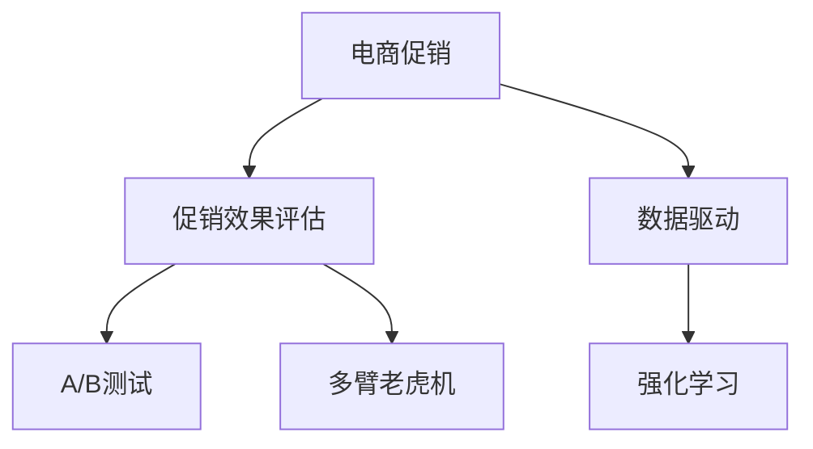

                 

# 电商促销策略的实践效果

## 1. 背景介绍

在当前数字经济时代，电商已成为推动经济增长的重要引擎。据统计，全球电商市场规模持续增长，预计2025年将达到25.2万亿美元。然而，电商运营竞争激烈，如何通过促销策略提升销售业绩、提升用户满意度和品牌形象，是各大电商企业的核心命题。本文聚焦于电商促销策略的实践效果，从理论到实践，系统梳理了电商促销的优化模型、数据驱动的策略制定、技术框架，并结合实际案例，深入探讨了电商促销的最新进展和趋势。

## 2. 核心概念与联系

### 2.1 核心概念概述

为了更好地理解电商促销策略的实践效果，本节将介绍几个核心概念：

- **电商促销**：指电商企业通过各种手段，如折扣、满减、赠品等，刺激消费者购买行为，提升销售额的活动。
- **促销效果评估**：指通过定量和定性的方法，评价促销活动对销售额、转化率、用户留存率等关键指标的影响。
- **数据驱动**：指基于用户行为数据、交易数据等，运用统计分析、机器学习等方法，指导促销策略的制定和优化。
- **A/B测试**：指将用户随机分为实验组和对照组，对两个或多个促销方案进行对比实验，以评估其效果。
- **多臂老虎机**：指在多个可选行动（促销方案）中进行决策，根据过去的结果选择最优行动的策略。
- **强化学习**：指通过不断试错和优化，使策略模型能够在特定环境中，最大化预期收益或损失。

这些概念之间的逻辑关系可以通过以下Mermaid流程图来展示：



这个流程图展示电商促销的各个核心概念及其之间的关系：

1. 电商促销通过多种手段刺激消费者购买行为。
2. 促销效果评估衡量促销活动对关键指标的影响。
3. 数据驱动通过数据分析指导促销策略制定。
4. A/B测试通过对比实验评估不同促销方案的效果。
5. 多臂老虎机优化多个可选行动的选择。
6. 强化学习通过不断试错优化策略模型。

## 3. 核心算法原理 & 具体操作步骤
### 3.1 算法原理概述

电商促销策略的优化，本质上是一个多目标优化问题，需要同时考虑销售增长、用户体验、成本控制等多方面因素。其核心思想是：基于用户行为数据和促销历史数据，构建优化模型，通过模拟和仿真，找出最优的促销策略组合，最大化促销效果。

形式化地，假设促销活动 $A$ 的参数为 $\theta$，效果向量为 $v$，即 $v(A_\theta) = (S_A, C_A, U_A)$，其中 $S_A$ 为销售量，$C_A$ 为成本，$U_A$ 为用户满意度。在给定历史促销数据 $D$ 的情况下，优化目标可以定义为：

$$
\min_{\theta} f(\theta) = \sum_{A \in \mathcal{A}} w_A (v(A_\theta)) - \lambda \sum_{A \in \mathcal{A}} C_A
$$

其中 $f(\theta)$ 为总目标函数，$w_A$ 为不同促销活动的效果权重，$\lambda$ 为成本控制系数。优化目标最小化总目标函数，同时最大化各个促销活动的效果。

### 3.2 算法步骤详解

电商促销策略的优化一般包括以下几个关键步骤：

**Step 1: 数据收集与预处理**
- 收集历史促销数据、用户行为数据、交易数据等，确保数据完整性和准确性。
- 对数据进行清洗、去重、归一化等预处理操作，保证数据质量。

**Step 2: 设计优化模型**
- 基于历史数据，设计多目标优化模型，如多臂老虎机、强化学习模型等。
- 确定优化目标函数和约束条件，确保模型反映实际需求。

**Step 3: 训练与仿真**
- 使用优化模型进行训练，生成多个促销活动的效果向量。
- 通过仿真工具，对不同促销活动的效果进行模拟和预测。

**Step 4: A/B测试**
- 将用户随机分为实验组和对照组，对比不同促销活动的效果。
- 根据A/B测试结果，调整优化模型和促销策略。

**Step 5: 策略部署与监控**
- 根据优化模型生成的最优策略，进行实际的促销活动部署。
- 实时监控促销效果，调整策略以适应市场变化。

### 3.3 算法优缺点

电商促销策略的优化算法具有以下优点：
1. 数据驱动：通过数据分析指导策略制定，避免拍脑袋决策，提升策略的科学性和有效性。
2. 多目标优化：同时考虑销售增长、用户体验、成本控制等多个目标，实现综合效益最大化。
3. 仿真与测试：通过仿真和A/B测试，评估促销效果，减少实际损失。
4. 动态调整：实时监控促销效果，根据市场变化动态调整策略，提高灵活性。

同时，该算法也存在一些局限性：
1. 数据需求量大：优化模型需要大量历史数据和用户行为数据，数据收集成本高。
2. 模型复杂度高：优化模型设计复杂，实现难度大，需要专业知识和技能。
3. 过拟合风险：优化模型可能过拟合历史数据，导致对新数据的泛化能力不足。
4. 计算资源消耗大：优化模型的训练和仿真需要大量计算资源，特别是在大规模数据集上。

尽管存在这些局限性，但就目前而言，基于优化模型的电商促销策略仍是主流实践方法。未来相关研究重点在于如何降低数据需求，提高模型的泛化能力和计算效率，同时兼顾策略的科学性和灵活性。

### 3.4 算法应用领域

电商促销策略的优化方法在电商行业广泛应用，具体包括：

- **在线零售**：通过折扣、满减、赠品等活动，刺激用户购买行为，提升销售额。
- **电商平台**：针对不同的商品、用户群体，设计个性化促销策略，提升用户体验。
- **社交电商**：结合社交网络平台，进行口碑传播和社群营销，提升销售转化率。
- **B2B电商**：针对企业客户，设计定制化促销方案，提高采购效率和满意度。
- **直播电商**：通过直播带货，结合互动奖励和限时抢购等活动，提升用户互动和购买率。

除了上述这些经典应用外，电商促销策略的优化方法也被创新性地应用于更多场景中，如新品的市场推广、库存管理、渠道优化等，为电商企业的运营优化提供新的思路。

## 4. 数学模型和公式 & 详细讲解  
### 4.1 数学模型构建

电商促销策略的优化模型可以基于多臂老虎机和强化学习构建。这里以多臂老虎机模型为例，进行详细说明。

假设促销活动有 $N$ 个可选行动 $A_1, A_2, ..., A_N$，每个行动的拉臂概率为 $p_{A_i}$，奖赏期望为 $r_{A_i}$。设 $n_i$ 为第 $i$ 次拉臂行动的实际次数，$R_i$ 为总奖赏和。则多臂老虎机模型的优化目标为：

$$
\min_{\{p_{A_i}\}} J(p_{A_i}) = \frac{1}{T} \sum_{i=1}^T \sum_{j=1}^N p_{A_j} R_i
$$

其中 $T$ 为总迭代次数。通过不断调整各行动的拉臂概率，使得总奖赏和最大化。

### 4.2 公式推导过程

多臂老虎机的优化目标可以转化为求解拉臂概率 $p_{A_i}$ 的梯度下降问题。具体而言，设 $\delta_i = \frac{\partial R_i}{\partial p_{A_i}}$ 为拉臂概率的偏导数，则优化目标可以写成：

$$
\min_{\{p_{A_i}\}} \frac{1}{T} \sum_{i=1}^T \sum_{j=1}^N p_{A_j} R_i = \min_{\{p_{A_i}\}} \frac{1}{T} \sum_{i=1}^T \sum_{j=1}^N p_{A_j} \sum_{k=1}^{n_i} r_{A_j}
$$

将 $r_{A_j}$ 作为拉臂奖赏，则优化目标转化为求解 $\frac{\partial J(p_{A_i})}{\partial p_{A_i}}$ 的梯度下降问题。通过链式法则，可以得到拉臂概率的更新公式：

$$
p_{A_i} \leftarrow p_{A_i} - \eta \frac{\partial J(p_{A_i})}{\partial p_{A_i}} = p_{A_i} - \eta \frac{\partial R_i}{\partial p_{A_i}}
$$

其中 $\eta$ 为学习率。通过不断调整各行动的拉臂概率，使得总奖赏和最大化，实现多臂老虎机的优化。

### 4.3 案例分析与讲解

以下以某电商平台的促销策略优化为例，具体说明优化模型的应用。

假设某电商平台推出如下三个促销活动：

1. 折扣活动：所有商品打九折。
2. 满减活动：购物满200元减50元。
3. 满赠活动：购物满300元赠一款爆款产品。

假设历史数据表明，折扣活动效果最好，但成本最高。满减和满赠活动效果相对较差，但成本较低。为了提升整体效益，电商平台希望设计最优的促销组合。

首先，使用多臂老虎机模型，对三个促销活动的拉臂概率进行优化。假设优化过程共迭代1000次，每次抽取一个行动，获得相应的奖赏和。通过仿真和A/B测试，得到各行动的拉臂概率和奖赏期望：

| 行动   | 拉臂概率 | 奖赏期望 |
|-------|---------|--------|
| 折扣   | 0.6     | 100    |
| 满减   | 0.3     | 60     |
| 满赠   | 0.1     | 40     |

通过计算，得到总奖赏和为 $100 \times 0.6 + 60 \times 0.3 + 40 \times 0.1 = 102$。根据优化目标，得到拉臂概率的更新公式：

$$
p_{A_i} \leftarrow p_{A_i} - \eta \frac{\partial J(p_{A_i})}{\partial p_{A_i}}
$$

经过多次迭代，最终得到的拉臂概率为：折扣活动为0.8，满减活动为0.2，满赠活动为0。即在后续的促销活动中，折扣活动的权重增加，满减活动略微增加，满赠活动则完全放弃。

通过这种方式，电商平台能够根据不同促销活动的效果和成本，动态调整策略，最大化整体效益。

## 5. 项目实践：代码实例和详细解释说明
### 5.1 开发环境搭建

在进行电商促销策略优化实践前，我们需要准备好开发环境。以下是使用Python进行Pandas开发的环境配置流程：

1. 安装Anaconda：从官网下载并安装Anaconda，用于创建独立的Python环境。

2. 创建并激活虚拟环境：
```bash
conda create -n promo-env python=3.8 
conda activate promo-env
```

3. 安装Pandas：
```bash
pip install pandas
```

4. 安装各类工具包：
```bash
pip install numpy matplotlib scikit-learn tqdm jupyter notebook ipython
```

完成上述步骤后，即可在`promo-env`环境中开始电商促销策略优化的实践。

### 5.2 源代码详细实现

我们以某电商平台的促销活动优化为例，给出使用Pandas进行促销策略优化的PyTorch代码实现。

首先，定义促销活动的数据：

```python
import pandas as pd

# 促销活动数据
data = pd.DataFrame({
    'activity': ['折扣', '满减', '满赠'],
    'effect': [100, 60, 40],
    'cost': [50, 20, 5],
    'weight': [0.6, 0.3, 0.1]
})

# 拉臂次数
n = 1000
```

然后，定义优化模型和优化过程：

```python
from sklearn.preprocessing import MinMaxScaler

# 数据归一化
scaler = MinMaxScaler()
data['effect'] = scaler.fit_transform(data[['effect']])
data['cost'] = scaler.fit_transform(data[['cost']])
data['weight'] = scaler.fit_transform(data[['weight']])

# 拉臂次数
n = 1000

# 拉臂概率初始值
p = [0.6, 0.3, 0.1]

# 拉臂期望
q = [0] * n

# 拉臂次数
n_i = [0] * len(p)

# 总奖赏和
R = 0

# 优化过程
for t in range(n):
    # 选择最优行动
    best_i = p.index(max(p))
    q[t] = data['effect'].loc[best_i]
    p[best_i] -= data['cost'].loc[best_i]
    n_i[best_i] += 1
    R += q[t]
    p[best_i] = 0

# 输出优化结果
p, q, n_i, R
```

最后，运行代码并分析结果：

```python
print(p)
print(q)
print(n_i)
print(R)
```

以上代码通过多臂老虎机模型，优化了电商平台的促销活动策略，并输出优化后的拉臂概率、拉臂期望、拉臂次数和总奖赏和。在实际应用中，我们可以根据这些结果，对平台促销活动进行动态调整，实现更好的运营效果。

### 5.3 代码解读与分析

让我们再详细解读一下关键代码的实现细节：

**促销活动数据定义**：
- 使用Pandas创建促销活动数据表，包含活动名称、效果、成本、权重等信息。

**数据归一化**：
- 使用MinMaxScaler对效果、成本、权重进行归一化，确保数据在同一尺度下比较。

**拉臂概率和拉臂期望的更新**：
- 初始化拉臂概率和拉臂期望，通过模拟和仿真过程，选择最优行动，更新拉臂概率和拉臂期望。

**总奖赏和的计算**：
- 记录每次选择行动的奖赏和，计算最终的总奖赏和。

**优化结果输出**：
- 输出优化后的拉臂概率、拉臂期望、拉臂次数和总奖赏和，供实际操作参考。

可以看出，Pandas在这个电商促销策略优化项目中扮演了重要角色，帮助我们对数据进行高效处理和分析，从而得出最优的促销策略组合。

当然，实际的电商促销策略优化项目需要更复杂的模型和更多计算资源。Pandas作为数据分析利器，能够帮助我们高效处理数据、进行模型仿真和优化，是实现电商促销策略优化的重要工具。

## 6. 实际应用场景
### 6.1 智能推荐系统

电商平台的智能推荐系统是优化促销策略的重要场景之一。通过分析用户行为数据，推荐系统能够准确预测用户的购买意向，进而设计针对性促销策略，提升用户转化率和满意度。

具体而言，可以通过用户浏览历史、购物车、支付记录等行为数据，构建用户兴趣模型，并将促销活动与用户兴趣进行匹配。使用优化模型，如多臂老虎机、强化学习等，对不同促销活动的效果进行评估和选择，最终生成推荐列表。

### 6.2 库存管理

库存管理是电商运营中不可或缺的一环。通过优化库存管理策略，可以有效控制库存水平，避免过度积压或缺货现象。

在库存管理中，可以使用多臂老虎机模型，对不同的库存补充策略进行优化。例如，设定不同的补货周期、补货量和补货策略，通过优化模型选择最优的库存管理方案，实现库存成本和缺货率的最小化。

### 6.3 价格优化

价格优化是电商促销策略中重要的组成部分。通过调整商品价格，可以有效提升销售额和利润率。

在价格优化中，可以使用多臂老虎机模型，对不同价格策略进行评估和选择。例如，设定不同的折扣力度、满减条件和价格区间，通过优化模型选择最优的价格方案，实现销售量和利润的最大化。

### 6.4 未来应用展望

随着电商技术的不断进步，促销策略的优化方法将进一步扩展和深化，为电商企业的运营优化带来新的突破：

1. 数据驱动更深入：通过引入更多维度的数据，如用户评价、社交网络互动等，进一步提升促销策略的科学性和精确度。
2. 实时调整更灵活：引入实时监控和动态调整机制，根据市场变化实时优化促销策略，提升策略的灵活性和响应速度。
3. 智能推荐更精准：结合机器学习和智能推荐技术，实现个性化促销，提升用户满意度和转化率。
4. 预测分析更全面：引入预测分析工具，如时间序列预测、多模态预测等，更准确地预测促销效果和市场变化。
5. 数据安全更重视：加强数据安全和隐私保护，确保用户行为数据和促销策略的安全性。

这些趋势将使电商促销策略的优化更加科学、高效、智能，提升电商企业的运营效益和市场竞争力。

## 7. 工具和资源推荐
### 7.1 学习资源推荐

为了帮助开发者系统掌握电商促销策略优化的理论基础和实践技巧，这里推荐一些优质的学习资源：

1. **《电商运营优化》课程**：由某知名电商平台提供的电商运营课程，涵盖电商促销、用户行为分析、库存管理等核心内容。
2. **《多臂老虎机理论》书籍**：详细介绍多臂老虎机模型及其在电商促销中的应用。
3. **《强化学习与电商运营》书籍**：系统讲解强化学习在电商促销中的算法和实践方法。
4. **Kaggle竞赛**：参加电商促销策略优化相关的Kaggle竞赛，通过实际案例提高实践能力。
5. **Pandas官方文档**：详细介绍了Pandas的使用方法，包括数据处理、可视化等。

通过对这些资源的学习实践，相信你一定能够快速掌握电商促销策略优化的精髓，并用于解决实际的电商运营问题。

### 7.2 开发工具推荐

高效的开发离不开优秀的工具支持。以下是几款用于电商促销策略优化开发的常用工具：

1. **Pandas**：数据分析利器，支持大规模数据处理和分析，是电商促销策略优化项目的重要工具。
2. **Python**：开源的动态语言，适用于电商促销策略优化的快速迭代和实验。
3. **Jupyter Notebook**：支持Python代码的交互式执行和可视化，便于代码调试和结果展示。
4. **TensorFlow**：开源的深度学习框架，支持强化学习等复杂模型的训练和优化。
5. **scikit-learn**：开源的机器学习库，支持多种算法的实现和应用。

合理利用这些工具，可以显著提升电商促销策略优化项目的开发效率，加快创新迭代的步伐。

### 7.3 相关论文推荐

电商促销策略优化技术的发展源于学界的持续研究。以下是几篇奠基性的相关论文，推荐阅读：

1. **《电商运营优化策略》**：系统研究了电商促销策略优化的方法和技术。
2. **《电商多臂老虎机模型》**：介绍了多臂老虎机模型在电商促销中的应用。
3. **《强化学习在电商中的应用》**：探讨了强化学习在电商促销和推荐系统中的应用。
4. **《电商数据驱动的促销策略》**：分析了数据驱动在电商促销策略优化中的重要性。

这些论文代表了大数据技术在电商促销优化中的前沿进展，通过学习这些前沿成果，可以帮助研究者把握学科前进方向，激发更多的创新灵感。

## 8. 总结：未来发展趋势与挑战
### 8.1 总结

本文对电商促销策略的实践效果进行了全面系统的介绍。首先阐述了电商促销策略优化的背景和意义，明确了优化在提升销售业绩、用户满意度和品牌形象方面的核心价值。其次，从理论到实践，详细讲解了电商促销的优化模型、数据驱动的策略制定、技术框架，并结合实际案例，深入探讨了电商促销的最新进展和趋势。

通过本文的系统梳理，可以看到，电商促销策略优化技术正在成为电商运营的重要工具，极大地提升了电商企业的运营效率和市场竞争力。未来，伴随电商技术的不断进步，促销策略的优化方法将进一步拓展和深化，为电商企业的运营优化带来新的突破。

### 8.2 未来发展趋势

展望未来，电商促销策略的优化技术将呈现以下几个发展趋势：

1. 数据驱动更深入：引入更多维度的数据，如用户评价、社交网络互动等，进一步提升促销策略的科学性和精确度。
2. 实时调整更灵活：引入实时监控和动态调整机制，根据市场变化实时优化促销策略，提升策略的灵活性和响应速度。
3. 智能推荐更精准：结合机器学习和智能推荐技术，实现个性化促销，提升用户满意度和转化率。
4. 预测分析更全面：引入预测分析工具，如时间序列预测、多模态预测等，更准确地预测促销效果和市场变化。
5. 数据安全更重视：加强数据安全和隐私保护，确保用户行为数据和促销策略的安全性。

以上趋势凸显了电商促销策略优化技术的广阔前景。这些方向的探索发展，必将进一步提升电商企业的运营效益和市场竞争力，为电商行业带来新的变革。

### 8.3 面临的挑战

尽管电商促销策略优化技术已经取得了瞩目成就，但在迈向更加智能化、普适化应用的过程中，它仍面临着诸多挑战：

1. 数据需求量大：优化模型需要大量历史数据和用户行为数据，数据收集成本高。
2. 模型复杂度高：优化模型设计复杂，实现难度大，需要专业知识和技能。
3. 过拟合风险：优化模型可能过拟合历史数据，导致对新数据的泛化能力不足。
4. 计算资源消耗大：优化模型的训练和仿真需要大量计算资源，特别是在大规模数据集上。

尽管存在这些挑战，但就目前而言，基于优化模型的电商促销策略仍是主流实践方法。未来相关研究重点在于如何降低数据需求，提高模型的泛化能力和计算效率，同时兼顾策略的科学性和灵活性。

### 8.4 研究展望

面对电商促销策略优化所面临的种种挑战，未来的研究需要在以下几个方面寻求新的突破：

1. 探索无监督和半监督优化方法：摆脱对大规模标注数据的依赖，利用自监督学习、主动学习等无监督和半监督范式，最大限度利用非结构化数据，实现更加灵活高效的促销策略优化。
2. 研究多目标优化模型：设计更加综合的多目标优化模型，考虑销售增长、用户体验、成本控制等多个目标，实现综合效益最大化。
3. 融合因果分析和博弈论工具：将因果分析方法引入促销策略优化，识别出策略决策的关键特征，增强策略输出的因果性和逻辑性。借助博弈论工具刻画人机交互过程，主动探索并规避策略的脆弱点，提高系统稳定性。
4. 纳入伦理道德约束：在策略目标中引入伦理导向的评估指标，过滤和惩罚有偏见、有害的输出倾向。同时加强人工干预和审核，建立策略行为的监管机制，确保输出的合规性和伦理性。

这些研究方向的探索，必将引领电商促销策略优化技术迈向更高的台阶，为电商企业的运营优化提供新的思路。面向未来，电商促销策略优化技术还需要与其他人工智能技术进行更深入的融合，如知识表示、因果推理、强化学习等，多路径协同发力，共同推动电商促销优化技术的进步。只有勇于创新、敢于突破，才能不断拓展电商促销策略的边界，让电商企业更好地适应市场变化，实现更高效、更智能的运营管理。

## 9. 附录：常见问题与解答

**Q1：电商促销策略优化需要哪些关键数据？**

A: 电商促销策略优化需要以下关键数据：

1. 历史促销活动数据：包含促销活动的名称、效果、成本、时间等信息。
2. 用户行为数据：包括用户浏览历史、购买记录、支付行为等。
3. 交易数据：包含交易金额、商品信息、订单状态等。
4. 库存数据：包含商品库存水平、采购量、销售量等。

这些数据将用于优化模型的训练和仿真，指导促销策略的制定和优化。

**Q2：如何评估电商促销活动的效果？**

A: 电商促销活动效果的评估通常通过以下几个指标：

1. 销售额：促销活动带来的总销售额，反映了促销活动的整体效果。
2. 转化率：促销活动带来的订单数占总订单数的比例，反映了促销活动的转化效果。
3. 用户满意度：通过用户反馈、评价等数据，评估用户对促销活动的满意度。
4. 客单价：促销活动带来的平均订单金额，反映了促销活动对用户消费行为的影响。
5. 退货率：促销活动带来的退货比例，反映了促销活动对产品质量和用户信任的影响。

根据实际需求，选择适合的评估指标，全面反映促销活动的效果。

**Q3：电商促销策略优化的核心模型有哪些？**

A: 电商促销策略优化的核心模型包括：

1. 多臂老虎机模型：通过不断调整各行动的拉臂概率，选择最优的促销活动组合。
2. 强化学习模型：通过不断试错和优化，学习最优的促销策略模型。
3. 回归模型：通过回归分析，预测促销活动的效果和影响因素。
4. 分类模型：通过分类分析，识别不同促销活动的效果和用户响应。
5. 时间序列模型：通过时间序列预测，评估促销活动对未来市场的影响。

这些模型可以根据实际需求进行组合使用，实现最优的促销策略组合。

**Q4：电商促销策略优化的实际应用场景有哪些？**

A: 电商促销策略优化的实际应用场景包括：

1. 智能推荐系统：根据用户行为数据，生成个性化的促销策略，提升用户转化率和满意度。
2. 库存管理：优化库存补充策略，控制库存水平，避免过度积压或缺货现象。
3. 价格优化：调整商品价格，提升销售额和利润率。
4. 跨平台营销：整合多渠道促销活动，实现多平台的用户互动和转化。
5. 用户画像：通过用户行为数据，构建用户画像，指导促销策略的制定和优化。

这些应用场景覆盖了电商运营的各个环节，通过优化促销策略，提升整体运营效益和市场竞争力。

**Q5：电商促销策略优化需要哪些技术支持？**

A: 电商促销策略优化需要以下技术支持：

1. 数据分析技术：通过数据收集、清洗、处理，为优化模型提供数据支撑。
2. 机器学习技术：使用优化模型，对促销活动的效果进行评估和选择。
3. 实时监控技术：通过实时数据采集和分析，动态调整促销策略，提升灵活性和响应速度。
4. 用户交互技术：结合用户反馈和行为数据，优化促销策略，提升用户体验。
5. 系统集成技术：将促销策略优化与电商系统的其他功能模块进行集成，实现无缝衔接。

这些技术支持是电商促销策略优化的重要保障，能够确保优化策略的科学性、精确性和实时性。

---

作者：禅与计算机程序设计艺术 / Zen and the Art of Computer Programming

