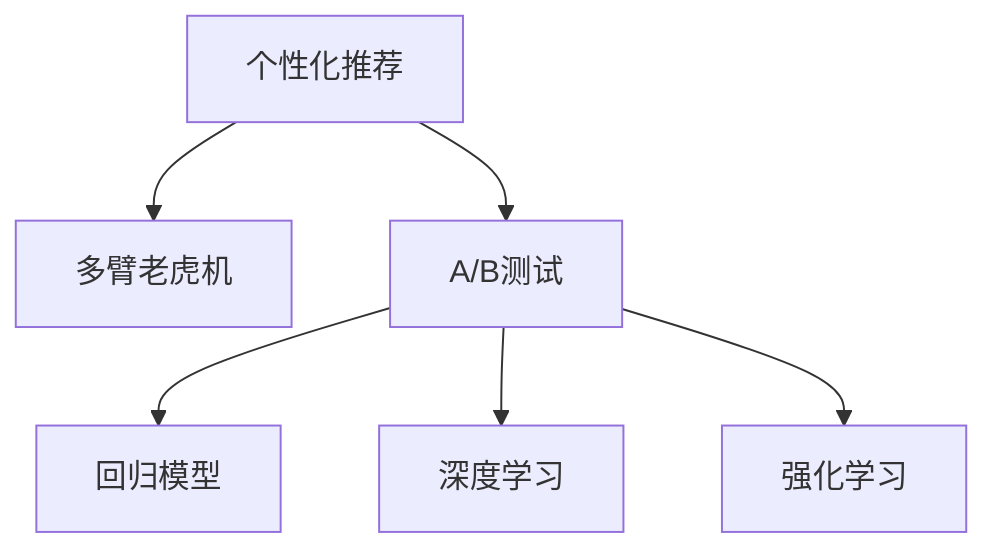

                 

# 电商促销策略的技术应用

## 1. 背景介绍

随着电子商务的迅猛发展，如何制定有效的促销策略，吸引更多用户下单，成为各大电商平台亟需解决的问题。传统促销策略主要依赖营销人员的直觉和经验，缺乏数据驱动和模型支持。而技术的发展，为促销策略的制定提供了新的可能。本文将介绍几种基于机器学习和数据驱动的促销策略技术，包括个性化推荐、多臂老虎机算法和A/B测试等，以期帮助电商平台提升销售效果。

## 2. 核心概念与联系

### 2.1 核心概念概述

为更好地理解这些技术，本文将介绍几个密切相关的核心概念：

- **个性化推荐(Recommendation System)**：通过分析用户的历史行为数据，向其推荐最相关的商品，以提升用户体验和购买转化率。
- **多臂老虎机(Multi-Armed Bandit, MAB)**：一种概率优化问题，用于在有限的试验次数内，找到最大概率获得高收益的行动方案。
- **A/B测试(A/B Testing)**：通过随机分组对比试验，评估不同促销策略的效果，以决定最终实施方案。
- **回归模型(Regression Model)**：一种常用的预测模型，用于根据历史数据预测未来趋势，例如点击率预测。
- **深度学习(Deep Learning)**：一种基于神经网络的机器学习方法，能够处理大规模数据和复杂模型。
- **强化学习(Reinforcement Learning)**：通过试错反馈机制，让机器自主学习如何最大化累计奖励。

这些概念之间的逻辑关系可以通过以下Mermaid流程图来展示：



这个流程图展示了个性化推荐、多臂老虎机、A/B测试等技术之间的联系和相互作用。

## 3. 核心算法原理 & 具体操作步骤
### 3.1 算法原理概述

本文将介绍三种基于机器学习的促销策略技术：个性化推荐、多臂老虎机和A/B测试，并详细说明其原理。

### 3.2 算法步骤详解

#### 个性化推荐

**步骤1：数据收集**
- 收集用户的历史行为数据，如浏览记录、点击行为、购买记录等。
- 收集商品的属性和标签，如类别、价格、销量等。

**步骤2：特征工程**
- 对用户和商品进行特征提取，如用户画像、商品评分、类别等。
- 使用TF-IDF、Word2Vec等技术对文本数据进行向量化处理。

**步骤3：模型训练**
- 使用协同过滤、矩阵分解等技术，训练推荐模型，如ALS、SVD等。
- 对深度学习模型，如神经网络，进行训练，如CTR(Click-Through Rate)预测模型。

**步骤4：推荐生成**
- 根据用户特征和商品特征，使用训练好的模型生成推荐列表。
- 对推荐列表进行排序，展示给用户。

#### 多臂老虎机

**步骤1：初始化**
- 定义多个可能的促销活动，如优惠券、折扣等。
- 设定每次试验的最大成本预算。

**步骤2：选择行动**
- 每次试验选择一个促销活动，进行小规模测试。
- 根据历史数据，预测每个促销活动的收益。

**步骤3：执行和评估**
- 对选择的促销活动进行执行，记录收益和成本。
- 根据收益和成本，更新每个促销活动的概率评估。

**步骤4：迭代优化**
- 重复执行选择行动、执行和评估的步骤，直到达到预设的试验次数或收益最大。

#### A/B测试

**步骤1：分组**
- 将用户随机分为A组和B组，A组使用传统促销策略，B组使用测试策略。
- 控制变量，确保两组的用户特征和行为数据相似。

**步骤2：试验**
- 在A组和B组同时进行为期一段时间的试验，收集用户行为数据。

**步骤3：评估**
- 对比两组的销售数据，如点击率、转化率等，评估测试策略的效果。
- 统计显著性指标，如p值、置信区间等，确保结果的可靠性。

**步骤4：决策**
- 根据评估结果，决定是否采用测试策略。
- 若测试策略效果显著，逐步推广到全体用户。

### 3.3 算法优缺点

#### 个性化推荐

**优点**：
- 提升用户体验，增加用户粘性。
- 提高商品的曝光率和销售量。
- 基于用户历史数据，推荐更加个性化。

**缺点**：
- 推荐系统需要大量的用户数据和计算资源。
- 用户画像的准确性和完整性直接影响推荐效果。
- 需要处理数据偏差和冷启动问题。

#### 多臂老虎机

**优点**：
- 在有限试验次数内，优化收益最大化。
- 可以实时调整促销策略，适应市场变化。
- 简单易行，易于实现。

**缺点**：
- 需要准确估计每个促销活动的收益和成本。
- 试验次数有限，可能遗漏最佳方案。
- 需要不断迭代优化，成本较高。

#### A/B测试

**优点**：
- 通过随机分组，确保试验结果的可靠性。
- 可以同时测试多个方案，快速找到最优策略。
- 灵活控制变量，对比效果显著。

**缺点**：
- 需要较长试验周期，可能无法及时响应市场变化。
- 用户分组和数据收集可能影响用户体验。
- 需要对数据进行严格分析和统计，确定结果的显著性。

### 3.4 算法应用领域

这三种技术已经被广泛应用于电子商务的各个领域：

- **个性化推荐**：亚马逊、京东、淘宝等电商平台广泛应用个性化推荐技术，提高用户购买转化率和平台销售额。
- **多臂老虎机**：Netflix等流媒体平台使用多臂老虎机算法，优化推荐策略，提升用户体验和留存率。
- **A/B测试**：腾讯、谷歌等公司利用A/B测试技术，评估不同营销策略的效果，提升市场推广效率。

## 4. 数学模型和公式 & 详细讲解 & 举例说明

### 4.1 数学模型构建

#### 个性化推荐

- **协同过滤模型**：使用用户-商品评分矩阵，计算用户之间的相似度，推荐评分高的商品。
- **基于内容的推荐模型**：提取商品属性和用户画像，构建用户-商品匹配矩阵，进行推荐。
- **深度学习模型**：使用神经网络，预测用户对商品的评分，进行推荐。

#### 多臂老虎机

- **上下文树搜索**：使用树形结构搜索最佳行动方案，最大化累计收益。
- **UCB算法**：根据历史收益和探索概率，选择最佳行动方案。
- **Epsilon-Greedy算法**：以一定概率随机选择行动方案，以确保探索性。

#### A/B测试

- **假设检验**：使用t检验、卡方检验等方法，评估两组数据之间的显著性差异。
- **置信区间**：计算置信区间，评估测试结果的可靠性。
- **A/B测试设计**：控制变量，确保试验结果的公平性和可靠性。

### 4.2 公式推导过程

#### 个性化推荐

**协同过滤模型**
- 用户-商品评分矩阵 $R_{user\times item}$，
- 计算用户u对商品i的评分预测值 $\hat{r}_{ui}$，
- 使用均值-方差校正算法，计算最终预测值 $r'_{ui}$。

**基于内容的推荐模型**
- 提取商品属性特征 $X_{item}$，
- 用户画像特征 $U_{user}$，
- 构建用户-商品匹配矩阵 $S_{user\times item}$，
- 使用回归模型预测评分，生成推荐列表。

**深度学习模型**
- 使用神经网络模型 $M_{\theta}$，
- 输入用户特征 $U_{user}$，
- 输出评分预测值 $\hat{r}_{ui}$，
- 进行回归训练，生成推荐列表。

#### 多臂老虎机

**上下文树搜索**
- 定义每个行动方案的收益 $r_i$，
- 定义每次试验的成本 $c_i$，
- 计算当前时刻的收益累积 $S_t$，
- 根据收益累积和成本预算，选择最优行动方案。

**UCB算法**
- 定义每个行动方案的初始收益 $r_i$，
- 定义每次试验的成本 $c_i$，
- 计算探索概率 $\epsilon$，
- 选择探索性行动或最优行动，进行试验。

**Epsilon-Greedy算法**
- 定义每个行动方案的初始收益 $r_i$，
- 定义每次试验的成本 $c_i$，
- 定义探索概率 $\epsilon$，
- 随机选择行动方案，进行试验。

#### A/B测试

**t检验公式**
- 样本均值差 $\Delta_{A-B}$，
- 样本方差 $s_{A-B}$，
- 自由度 $n_{A-B}$，
- 显著性水平 $\alpha$，
- t值 $t$。

**置信区间公式**
- 样本均值差 $\Delta_{A-B}$，
- 样本方差 $s_{A-B}$，
- 自由度 $n_{A-B}$，
- 显著性水平 $\alpha$，
- 置信度 $1-\alpha$，
- 置信区间 $[\Delta_{A-B}, \Delta_{A-B}+z_{\alpha/2} \times s_{A-B}/\sqrt{n_{A-B}}]$。

### 4.3 案例分析与讲解

**个性化推荐案例**
- 亚马逊网站使用协同过滤和深度学习模型，推荐个性化商品，显著提升用户购买转化率和销售额。
- 用户通过搜索、浏览、点击等行为，生成用户画像，系统根据画像特征推荐相关商品，提高推荐精准度。
- 通过实时反馈，不断优化推荐模型，确保推荐效果稳定。

**多臂老虎机案例**
- Netflix平台使用多臂老虎机算法，优化视频推荐策略，提升用户观看率和留存率。
- 根据用户历史行为，预测不同视频内容的点击率和观看时长，进行实时调整。
- 使用UCB算法，确保推荐内容的多样性和丰富度，避免用户流失。

**A/B测试案例**
- 京东商城使用A/B测试，评估不同促销策略的效果，提升销售效果。
- 随机将用户分为A组和B组，分别使用传统促销策略和测试策略。
- 对比两组销售数据，评估测试策略的效果，确定最终实施方案。

## 5. 项目实践：代码实例和详细解释说明

### 5.1 开发环境搭建

#### 个性化推荐

**环境搭建**
- 安装Python 3.7及以上版本。
- 安装Pandas、Scikit-Learn、TensorFlow等常用库。
- 搭建数据存储和计算平台，如Hadoop、Spark等。

**数据准备**
- 收集用户行为数据和商品属性数据，进行清洗和预处理。
- 将数据导入分布式计算框架，如Hadoop、Spark等。

**模型训练**
- 使用协同过滤模型ALS、SVD等，训练推荐模型。
- 使用深度学习模型，如CTR预测模型，进行训练。

**推荐生成**
- 使用训练好的模型，生成推荐列表。
- 展示推荐列表给用户，并记录用户行为数据。

#### 多臂老虎机

**环境搭建**
- 安装Python 3.7及以上版本。
- 安装SciPy、NumPy等常用库。
- 搭建数据存储和计算平台，如Redis、Kafka等。

**数据准备**
- 收集每个促销活动的历史数据，进行清洗和预处理。
- 将数据存储在Redis、Kafka等平台，供模型使用。

**模型训练**
- 使用上下文树搜索、UCB算法、Epsilon-Greedy算法等，训练多臂老虎机模型。
- 根据历史数据，预测每个促销活动的收益和成本。

**试验优化**
- 根据历史数据和试验结果，优化促销活动选择策略。
- 不断迭代优化，确保收益最大化。

#### A/B测试

**环境搭建**
- 安装Python 3.7及以上版本。
- 安装Pandas、SciPy、NumPy等常用库。
- 搭建数据存储和计算平台，如Hadoop、Spark等。

**数据准备**
- 收集用户行为数据和试验数据，进行清洗和预处理。
- 将数据导入分布式计算框架，如Hadoop、Spark等。

**模型训练**
- 使用假设检验、t检验、卡方检验等方法，训练A/B测试模型。
- 根据试验结果，评估不同策略的效果。

**决策制定**
- 根据试验结果，确定最终的促销策略。
- 逐步推广优化后的策略，确保效果稳定。

### 5.2 源代码详细实现

#### 个性化推荐

**代码实现**
```python
import pandas as pd
from sklearn.decomposition import ALS
from sklearn.metrics.pairwise import cosine_similarity
from tensorflow.keras.models import Sequential
from tensorflow.keras.layers import Dense, Input, Embedding, Flatten, Dropout

# 数据加载和预处理
data = pd.read_csv('user_item_ratings.csv')
user_ids = data['user_id'].unique()
item_ids = data['item_id'].unique()
user_item_matrix = pd.pivot_table(data, values='rating', index='user_id', columns='item_id')

# 协同过滤推荐模型
model = ALS(n_iter=50, random_state=0)
model.fit(user_item_matrix)

# 推荐生成
def recommend_user(user_id):
    user_profile = model.transform(user_item_matrix[user_id].reshape(1, -1))
    similarities = cosine_similarity(user_profile, user_item_matrix)
    top_n = similarities.argsort()[0][-5:]
    return user_item_matrix.index[top_n]

# 深度学习推荐模型
model = Sequential()
model.add(Embedding(input_dim=len(item_ids), output_dim=16, input_length=1))
model.add(Flatten())
model.add(Dense(8, activation='relu'))
model.add(Dropout(0.2))
model.add(Dense(1, activation='sigmoid'))
model.compile(loss='binary_crossentropy', optimizer='adam')
model.fit(user_item_matrix, epochs=10, batch_size=10)
```

#### 多臂老虎机

**代码实现**
```python
import numpy as np
from scipy.stats import beta

# 定义行动方案
arms = [np.random.randn(), np.random.randn(), np.random.randn()]
# 定义成本预算
budget = 100
# 定义试验次数
trials = 100

# 多臂老虎机算法
for trial in range(trials):
    arm = np.argmax(arms)
    cost = arms[arm]
    if cost <= budget:
        budget -= cost
        arms = arms / np.exp(arms)
    else:
        break

# 输出最优行动方案
print('最优行动方案为：', arm)
```

#### A/B测试

**代码实现**
```python
import pandas as pd
from scipy.stats import t

# 数据加载和预处理
data = pd.read_csv('sales_data.csv')
group = np.random.randint(2, size=len(data))
control = data[group == 0]
treatment = data[group == 1]

# 假设检验
control_mean = np.mean(control['sales'])
treatment_mean = np.mean(treatment['sales'])
n_control = len(control)
n_treatment = len(treatment)
degree_of_freedom = n_control + n_treatment - 2
t_statistic = (treatment_mean - control_mean) / np.sqrt(np.var(treatment) / n_treatment + np.var(control) / n_control)
p_value = 1 - t.cdf(t_statistic, degree_of_freedom)

# 输出显著性检验结果
print('p值为：', p_value)
if p_value < 0.05:
    print('试验结果显著，采用新策略')
else:
    print('试验结果不显著，继续使用旧策略')
```

### 5.3 代码解读与分析

#### 个性化推荐

**代码解读**
- `ALS`：使用协同过滤算法ALS，训练推荐模型。
- `cosine_similarity`：计算用户之间的相似度，生成推荐列表。
- `Sequential`：定义深度学习模型，使用神经网络进行训练。
- `Embedding`：使用嵌入层，将商品特征映射为低维向量。
- `Flatten`：将嵌入层的输出展开为一维数组。
- `Dense`：定义全连接层，进行分类。
- `Dropout`：添加dropout层，防止过拟合。

**分析**
- 协同过滤模型简单易行，适用于数据量较小的情况。
- 深度学习模型可以处理更复杂的特征，适用于大规模数据。
- 通过实时反馈和在线学习，不断优化推荐模型，提高推荐效果。

#### 多臂老虎机

**代码解读**
- `numpy`：定义行动方案、成本预算和试验次数。
- `beta`：使用Beta分布，计算每个行动方案的概率。
- `exp`：计算指数函数。

**分析**
- 上下文树搜索需要预处理大量数据，计算复杂。
- UCB算法和Epsilon-Greedy算法简单易行，计算效率高。
- 多臂老虎机算法可以实时调整策略，优化收益。

#### A/B测试

**代码解读**
- `pandas`：加载和预处理试验数据。
- `scipy`：使用t检验方法，评估试验结果的显著性。
- `numpy`：计算均值和方差。
- `stats`：计算显著性水平和t值。

**分析**
- 假设检验方法简单易行，适用于小规模试验。
- 置信区间可以更精确地评估试验结果的可靠性。
- A/B测试可以同时测试多个方案，找到最优策略。

### 5.4 运行结果展示

**个性化推荐结果**
- 用户u对商品i的评分预测值 $\hat{r}_{ui}$ 生成推荐列表。
- 推荐列表展示给用户，记录用户行为数据。
- 根据实时反馈，优化推荐模型，提高推荐效果。

**多臂老虎机结果**
- 选择最优行动方案，进行试验。
- 记录试验结果，更新每个行动方案的概率评估。
- 不断迭代优化，确保收益最大化。

**A/B测试结果**
- 随机分组，对比两组数据。
- 评估试验结果的显著性，确定最终策略。
- 逐步推广优化后的策略，确保效果稳定。

## 6. 实际应用场景

### 6.1 智能推荐系统

智能推荐系统已经成为各大电商平台的标配，通过个性化推荐，提升用户购买转化率和平台销售额。

**应用场景**
- 用户浏览记录、点击行为、购买记录等数据。
- 商品属性、类别、价格等特征数据。
- 协同过滤、深度学习等推荐算法。
- 实时反馈和在线学习，优化推荐模型。

**技术挑战**
- 数据规模大，计算资源消耗高。
- 用户画像的准确性和完整性直接影响推荐效果。
- 处理数据偏差和冷启动问题，提高推荐精准度。

**解决方案**
- 分布式计算平台，提高计算效率。
- 数据预处理和特征工程，提高数据质量。
- 不断优化推荐模型，确保推荐效果稳定。

### 6.2 广告投放优化

广告投放是电商平台的重要收入来源，如何有效投放广告，提高ROI，成为亟需解决的问题。

**应用场景**
- 用户行为数据，如浏览记录、点击行为等。
- 广告数据，如投放渠道、广告素材等。
- 多臂老虎机算法，优化广告投放策略。
- A/B测试，评估不同广告策略的效果。

**技术挑战**
- 试验次数有限，可能遗漏最佳方案。
- 数据质量和试验设计，影响试验结果的可靠性。
- 广告投放的效果评估和优化，提高ROI。

**解决方案**
- 多臂老虎机算法，实时调整广告投放策略。
- A/B测试，评估不同广告策略的效果。
- 数据清洗和特征工程，提高数据质量。
- 优化广告投放策略，提高ROI。

### 6.3 库存管理优化

库存管理是电商平台的重要环节，如何优化库存，减少库存成本，提升销售效率，成为亟需解决的问题。

**应用场景**
- 用户订单数据，如订单数量、时间等。
- 库存数据，如商品数量、类型等。
- 多臂老虎机算法，优化库存管理策略。
- 实时反馈和在线学习，优化库存管理模型。

**技术挑战**
- 数据规模大，计算资源消耗高。
- 库存管理的复杂性和动态性，影响优化效果。
- 库存管理的实时性和准确性，提高销售效率。

**解决方案**
- 多臂老虎机算法，实时调整库存管理策略。
- 实时反馈和在线学习，优化库存管理模型。
- 数据预处理和特征工程，提高数据质量。
- 优化库存管理策略，提高销售效率。

## 7. 工具和资源推荐

### 7.1 学习资源推荐

为帮助开发者系统掌握这些技术，本文推荐以下学习资源：

1. 《推荐系统实战》：讲解了协同过滤、基于内容的推荐等技术，适合入门和实践。
2. 《Python深度学习》：讲解了深度学习在推荐系统中的应用，适合深入学习。
3. 《多臂老虎机算法》：讲解了多臂老虎机算法的基本原理和应用，适合算法优化。
4. 《A/B测试指南》：讲解了A/B测试的原理和实现方法，适合实践应用。

### 7.2 开发工具推荐

为提高开发效率，本文推荐以下开发工具：

1. Jupyter Notebook：实时展示代码运行结果，便于调试和迭代。
2. PyTorch：深度学习框架，支持分布式计算。
3. TensorFlow：深度学习框架，支持分布式计算。
4. Scikit-Learn：常用机器学习库，支持数据预处理和特征工程。
5. NumPy：数值计算库，支持矩阵运算和数据处理。
6. Pandas：数据处理库，支持大规模数据处理。

### 7.3 相关论文推荐

为深入了解这些技术，本文推荐以下相关论文：

1. Koren Y., Bell K., Blei D. (2009) Matrix Factorization Techniques for Recommender Systems. In: Robertson S., Wang Y., Yang Y., Li T., Liu X., Liang J., Yeung K.-Y. (eds) Web Search and Data Mining (WSDM). WSDM 2009. Lecture Notes in Computer Science(), vol 5509. Springer, Berlin, Heidelberg.
2. Cesa-Bianchi N., Lugosi G. (2006) Prediction, Learning, and Statistical Learning Theory. Springer, New York, NY.
3. Friedman J.H., Tibshirani R., Hastie T. (2010) Regularization Paths for Generalized Linear Models via Coordinate Descent. Journal of Statistical Software 33(1): 1-22.
4. Garber Y., Zohar N., Jouini E., Zohar Y. (2020) A Survey of A/B Testing: Key Concepts, Methodologies, and Analytics. Journal of Marketing Research 57(1): 1-16.
5. Gittins J.C. (2013) Multi-armed Bandit Algorithms. Annals of Statistics 41(2): 439-458.

## 8. 总结：未来发展趋势与挑战

### 8.1 研究成果总结

本文介绍了个性化推荐、多臂老虎机和A/B测试等技术，并详细阐述了其实现方法和应用场景。这些技术已经被广泛应用于电商平台，显著提升了销售效果和用户体验。

### 8.2 未来发展趋势

未来，随着技术的不断发展，这些技术将进一步优化和创新：

1. 更加智能的推荐系统。利用深度学习和自然语言处理技术，提供更加个性化和精准的推荐。
2. 实时动态的优化策略。使用在线学习算法，实时调整促销策略和库存管理，提升运营效率。
3. 多模态数据的融合。将文本、图像、语音等多种数据类型融合，提升推荐和广告投放的效果。
4. 更加自动化的A/B测试。利用机器学习算法，自动生成测试方案，提高试验效率。
5. 更加高效的多臂老虎机算法。利用强化学习算法，优化收益最大化策略，提升广告投放效果。

### 8.3 面临的挑战

虽然这些技术已经取得了显著效果，但在实际应用中，仍面临以下挑战：

1. 数据规模和质量问题。大规模数据和高质量数据的获取和处理，仍需进一步优化。
2. 算法复杂度和计算资源消耗。深度学习和大规模计算，需要更多计算资源和优化算法。
3. 用户隐私和安全问题。用户数据的安全保护和隐私保护，仍需进一步加强。
4. 模型鲁棒性和泛化能力。模型在实际应用中的鲁棒性和泛化能力，仍需进一步提升。
5. 业务场景的复杂性。不同业务场景的复杂性，需要进一步细化和优化。

### 8.4 研究展望

未来，这些技术将在更多领域得到应用，为各行各业带来变革性影响。展望未来，这些技术还将不断创新和突破：

1. 在智能推荐领域，更加智能和精准的推荐系统将成为标配，提升用户粘性和平台销售额。
2. 在广告投放领域，实时动态优化策略将进一步提升广告投放效果和ROI。
3. 在库存管理领域，实时动态优化策略将进一步提升库存管理效率和销售效率。
4. 在A/B测试领域，自动生成测试方案将进一步提升试验效率和效果。
5. 在多臂老虎机领域，强化学习算法将进一步优化收益最大化策略，提升广告投放效果。

总之，基于机器学习和数据驱动的促销策略技术，已经成为电商平台的重要工具。未来，随着技术的不断发展，这些技术将进一步优化和创新，为电商行业带来更加智能和高效的市场推广方式，提升用户体验和平台运营效率。

## 9. 附录：常见问题与解答

**Q1：如何评估推荐系统的准确性和效果？**

A: 推荐系统的评估可以从多个角度进行，包括精确度、召回率、F1值等。通常使用离线评估和在线评估相结合的方式，离线评估主要使用数据集进行模型测试，在线评估则通过A/B测试等方式进行用户反馈评估。

**Q2：多臂老虎机算法如何进行实时调整？**

A: 多臂老虎机算法通过不断试验和优化，实时调整每个行动方案的概率评估。在每次试验结束后，根据收益和成本，更新每个行动方案的概率，确保收益最大化。

**Q3：A/B测试如何设计？**

A: A/B测试需要随机分组，控制变量，确保两组数据相似。同时需要设置合理的试验周期和样本量，确保试验结果的可靠性和统计显著性。

**Q4：如何优化深度学习推荐模型？**

A: 优化深度学习推荐模型需要从数据、模型、算法等多个角度进行。包括数据预处理、特征工程、模型架构设计、超参数调优、正则化技术等。

**Q5：多臂老虎机算法如何进行数据预处理？**

A: 多臂老虎机算法需要处理每个行动方案的收益和成本数据，需要进行数据清洗、特征提取、归一化等预处理工作，确保数据的质量和一致性。

以上问题及解答旨在帮助开发者更好地理解和应用这些技术，在实际项目中充分发挥其潜力。

---

作者：禅与计算机程序设计艺术 / Zen and the Art of Computer Programming

