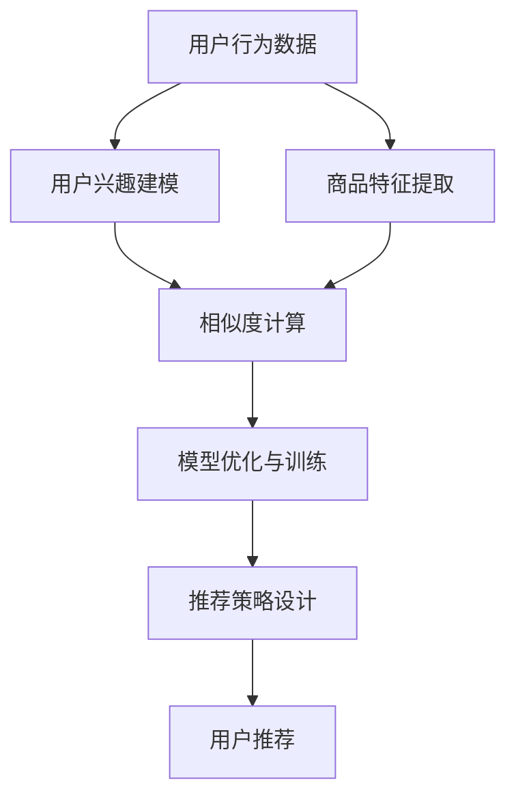

                 

# 电商平台供给能力提升：个性化商品推荐

在当今数字化时代，电商平台已经成为消费者购物的主要渠道之一。为了提升用户体验和平台的供给能力，个性化商品推荐系统成为了一个不可或缺的核心技术。本文章将详细阐述个性化商品推荐系统的核心概念、算法原理、开发实践以及应用场景，以期对电商平台供给能力提升提供有价值的参考。

## 1. 背景介绍

### 1.1 问题由来
随着互联网的迅猛发展和电子商务的兴起，用户对商品推荐系统的需求日益增长。个性化商品推荐系统通过分析用户的历史行为、兴趣和偏好，向用户推荐可能感兴趣的商品，提高用户满意度和平台转化率。同时，推荐系统还能帮助商家提高商品曝光率和销售额，优化库存管理，减少库存积压。

然而，传统的推荐系统往往基于简单的协同过滤、基于内容的推荐等算法，难以适应大规模数据和多样化用户需求的挑战。为了解决这些问题，深度学习技术，特别是基于深度神经网络的商品推荐模型被广泛应用。本文将重点介绍利用深度神经网络进行个性化商品推荐的原理与应用实践。

### 1.2 问题核心关键点
个性化商品推荐系统的核心关键点包括以下几个方面：

- **用户行为建模**：通过分析用户的历史行为数据，如浏览、购买、评分等，建立用户兴趣模型，捕捉用户偏好。
- **商品特征提取**：从商品的描述、属性、标签等信息中提取有意义的特征，用于模型训练。
- **相似度计算**：利用用户和商品特征之间的相似度，进行推荐排序。
- **模型优化与训练**：选择合适的优化算法，对推荐模型进行训练和优化。
- **推荐策略设计**：根据不同的应用场景，设计合理的推荐策略，如召回策略、排序策略等。

这些关键点紧密联系，构成了个性化商品推荐系统的核心逻辑。

### 1.3 问题研究意义
个性化商品推荐系统对电商平台的发展具有重要意义：

- 提升用户体验：通过精准推荐，满足用户个性化需求，提高用户满意度和留存率。
- 优化供给能力：帮助商家优化商品布局，提高商品曝光率和销售额，减少库存积压。
- 数据驱动决策：基于用户行为数据，进行科学的库存管理和商品采购决策。
- 促进多业务融合：推荐系统与搜索、广告等业务融合，提供综合的用户体验。

综上所述，个性化商品推荐系统的研究与开发，对于电商平台供给能力的提升具有重要意义。

## 2. 核心概念与联系

### 2.1 核心概念概述

为了更好地理解个性化商品推荐系统的原理与应用实践，本节将介绍几个核心概念及其之间的联系：

- **深度神经网络**：利用深度神经网络进行商品推荐的核心技术，通过多层非线性变换捕捉用户和商品之间的复杂关系。
- **协同过滤**：基于用户-商品评分矩阵，通过相似度计算进行推荐，是推荐系统中最早使用的算法之一。
- **基于内容的推荐**：根据商品的特征信息，如描述、属性等，进行推荐，适用于商品属性丰富、用户行为数据不足的场景。
- **深度学习**：一种基于神经网络的机器学习技术，能够自动提取数据中的复杂特征，用于推荐系统中的用户行为建模和商品特征提取。
- **用户-商品矩阵**：用于表示用户对商品的评分和行为数据，是推荐系统进行相似度计算的基础。
- **推荐系统评价指标**：如准确率、召回率、F1-score等，用于评估推荐系统的性能。

这些核心概念之间的逻辑关系可以通过以下Mermaid流程图来展示：



这个流程图展示了个性化商品推荐系统的核心流程：从用户行为数据和商品特征中，构建用户兴趣模型，进行相似度计算，训练推荐模型，并设计推荐策略，最终输出推荐结果。

## 3. 核心算法原理 & 具体操作步骤

### 3.1 算法原理概述

基于深度学习的个性化商品推荐系统，主要包含以下几个步骤：

1. **用户行为建模**：通过对用户的历史行为数据进行分析，建立用户兴趣模型，捕捉用户偏好。
2. **商品特征提取**：从商品的描述、属性、标签等信息中提取有意义的特征，用于模型训练。
3. **相似度计算**：利用用户和商品特征之间的相似度，进行推荐排序。
4. **模型优化与训练**：选择合适的优化算法，对推荐模型进行训练和优化。
5. **推荐策略设计**：根据不同的应用场景，设计合理的推荐策略，如召回策略、排序策略等。

### 3.2 算法步骤详解

以下详细讲解每个步骤的实现过程：

**Step 1: 用户行为建模**

用户行为建模的目的是捕捉用户的兴趣和偏好。具体步骤如下：

1. **数据收集**：从电商平台的日志中收集用户的历史行为数据，包括浏览、购买、评分等。
2. **数据预处理**：对收集到的数据进行清洗、去重、归一化等处理，确保数据的质量和一致性。
3. **特征工程**：选择和提取有用的特征，如用户ID、商品ID、浏览时间、购买金额等。
4. **用户兴趣模型构建**：使用协同过滤、基于内容的推荐、深度学习等算法，构建用户兴趣模型。

**Step 2: 商品特征提取**

商品特征提取的目的是将商品的描述、属性等信息转化为模型可用的特征表示。具体步骤如下：

1. **商品数据收集**：从电商平台的商品列表中收集商品的描述、属性、标签等信息。
2. **特征选择**：选择和提取有用的商品特征，如商品名称、类别、价格、评分等。
3. **特征表示**：将商品特征转化为模型可用的向量表示，如TF-IDF、Word2Vec、TextCNN等。

**Step 3: 相似度计算**

相似度计算的目的是通过用户和商品的特征表示，计算它们之间的相似度，用于推荐排序。具体步骤如下：

1. **特征编码**：将用户和商品的特征表示编码为向量，如使用Transformer、CNN等模型。
2. **相似度计算**：利用向量之间的相似度计算方法，如余弦相似度、欧式距离等，计算用户和商品之间的相似度。
3. **推荐排序**：根据相似度排序，输出推荐结果。

**Step 4: 模型优化与训练**

模型优化与训练的目的是通过优化算法，对推荐模型进行训练和优化。具体步骤如下：

1. **模型选择**：选择合适的深度神经网络模型，如多层感知机、卷积神经网络、循环神经网络等。
2. **数据划分**：将数据划分为训练集、验证集和测试集，用于模型训练、调参和测试。
3. **模型训练**：使用优化算法（如Adam、SGD等），对推荐模型进行训练，最小化损失函数。
4. **模型调参**：通过验证集评估模型性能，进行超参数调优，如学习率、批大小、迭代轮数等。
5. **模型测试**：在测试集上评估模型性能，输出推荐结果。

**Step 5: 推荐策略设计**

推荐策略设计的目的是根据不同的应用场景，设计合理的推荐策略。具体步骤如下：

1. **召回策略设计**：设计合理的召回策略，如基于协同过滤的召回、基于内容的召回、基于深度学习的召回等。
2. **排序策略设计**：设计合理的排序策略，如基于深度学习的排序、基于规则的排序、基于上下文的排序等。
3. **推荐结果融合**：将不同策略的推荐结果进行融合，提高推荐效果。

### 3.3 算法优缺点

基于深度学习的个性化商品推荐系统具有以下优点：

- **高效性**：深度神经网络能够自动提取数据中的复杂特征，高效捕捉用户和商品之间的关系。
- **鲁棒性**：深度模型具有较强的鲁棒性，能够适应数据分布的变化和多样性。
- **可解释性**：通过可视化技术，可以对深度模型进行解释和调试，了解推荐结果的生成机制。

同时，该方法也存在一定的局限性：

- **数据依赖性**：深度模型需要大量高质量的数据进行训练，数据采集和预处理成本较高。
- **计算资源需求高**：深度模型参数量大，计算资源需求高，对硬件要求较高。
- **过拟合风险**：深度模型容易过拟合，特别是在数据量不足的情况下，需要采取正则化、早停等策略进行控制。

尽管存在这些局限性，但深度学习在推荐系统中的应用已经取得了显著效果，成为推荐系统中的主流技术。未来相关研究的重点在于如何进一步优化模型结构，降低计算资源需求，同时提高模型泛化能力和可解释性。

### 3.4 算法应用领域

基于深度学习的个性化商品推荐系统已经广泛应用于电商、新闻、视频等多个领域，覆盖了商品推荐、内容推荐、视频推荐等多个场景。

- **电商推荐**：利用用户历史行为和商品特征，为电商用户推荐感兴趣的商品，提升用户满意度和购买转化率。
- **新闻推荐**：根据用户阅读历史和新闻特征，为用户推荐感兴趣的新闻文章，提高用户留存率和阅读量。
- **视频推荐**：通过分析用户观看历史和视频特征，为用户推荐感兴趣的视频内容，增加用户粘性和观看时长。

除了这些常见场景，推荐系统还被应用于更多领域，如社交网络推荐、音乐推荐等，为不同应用场景提供个性化推荐服务。

## 4. 数学模型和公式 & 详细讲解 & 举例说明

### 4.1 数学模型构建

本节将使用数学语言对个性化商品推荐系统的核心模型进行更加严格的刻画。

记用户行为数据为 $D=\{(x_i,y_i)\}_{i=1}^N$，其中 $x_i$ 为用户的浏览行为，$y_i$ 为用户的评分。记商品特征为 $X=\{x_j\}_{j=1}^M$，其中 $x_j$ 为商品的属性、标签等信息。记用户兴趣模型为 $U=\{u_i\}_{i=1}^N$，其中 $u_i$ 为用户兴趣向量。记商品特征向量为 $V=\{v_j\}_{j=1}^M$，其中 $v_j$ 为商品特征向量。记推荐模型为 $M$，用于将用户行为数据映射到推荐结果。

### 4.2 公式推导过程

以下我们以深度神经网络为基础，推导推荐模型的训练公式及其梯度计算。

假设用户行为数据 $D$ 和商品特征 $X$ 分别输入到深度神经网络 $M$ 中，得到用户兴趣向量 $U$ 和商品特征向量 $V$。则推荐模型的输出 $Y$ 可以通过 $M$ 的权重矩阵 $W$ 和偏置向量 $b$ 计算得到：

$$
Y = M(U, V; W, b) = U^T W V + b
$$

其中 $U^T$ 为 $U$ 的转置矩阵。推荐模型 $M$ 的损失函数为：

$$
\mathcal{L} = \frac{1}{N} \sum_{i=1}^N \ell(y_i, M(U_i, V; W, b))
$$

其中 $\ell$ 为损失函数，如均方误差、交叉熵等。通过梯度下降等优化算法，最小化损失函数 $\mathcal{L}$，更新模型参数 $W$ 和 $b$。

具体的梯度计算公式为：

$$
\frac{\partial \mathcal{L}}{\partial W} = \frac{1}{N} \sum_{i=1}^N \frac{\partial \ell(y_i, M(U_i, V; W, b))}{\partial W}
$$

$$
\frac{\partial \mathcal{L}}{\partial b} = \frac{1}{N} \sum_{i=1}^N \frac{\partial \ell(y_i, M(U_i, V; W, b))}{\partial b}
$$

### 4.3 案例分析与讲解

以基于深度神经网络的协同过滤推荐模型为例，对推荐模型的训练过程进行详细分析。

假设用户行为数据 $D$ 和商品特征 $X$ 分别输入到深度神经网络 $M$ 中，得到用户兴趣向量 $U$ 和商品特征向量 $V$。则推荐模型的输出 $Y$ 可以通过 $M$ 的权重矩阵 $W$ 和偏置向量 $b$ 计算得到：

$$
Y = M(U, V; W, b) = U^T W V + b
$$

推荐模型 $M$ 的损失函数为：

$$
\mathcal{L} = \frac{1}{N} \sum_{i=1}^N \ell(y_i, M(U_i, V; W, b))
$$

其中 $\ell$ 为损失函数，如均方误差、交叉熵等。通过梯度下降等优化算法，最小化损失函数 $\mathcal{L}$，更新模型参数 $W$ 和 $b$。

具体的梯度计算公式为：

$$
\frac{\partial \mathcal{L}}{\partial W} = \frac{1}{N} \sum_{i=1}^N \frac{\partial \ell(y_i, M(U_i, V; W, b))}{\partial W}
$$

$$
\frac{\partial \mathcal{L}}{\partial b} = \frac{1}{N} \sum_{i=1}^N \frac{\partial \ell(y_i, M(U_i, V; W, b))}{\partial b}
$$

在实际应用中，上述模型需要进行优化和调整。例如，可以通过增加dropout、L2正则化等技术，避免过拟合。同时，可以引入注意力机制，提高模型的注意力分配能力，更好地捕捉用户和商品之间的关系。

## 5. 项目实践：代码实例和详细解释说明

### 5.1 开发环境搭建

在进行推荐系统开发前，我们需要准备好开发环境。以下是使用Python进行TensorFlow开发的环境配置流程：

1. 安装Anaconda：从官网下载并安装Anaconda，用于创建独立的Python环境。

2. 创建并激活虚拟环境：
```bash
conda create -n tf-env python=3.8 
conda activate tf-env
```

3. 安装TensorFlow：根据CUDA版本，从官网获取对应的安装命令。例如：
```bash
conda install tensorflow -c pytorch -c conda-forge
```

4. 安装各类工具包：
```bash
pip install numpy pandas scikit-learn matplotlib tqdm jupyter notebook ipython
```

完成上述步骤后，即可在`tf-env`环境中开始推荐系统开发。

### 5.2 源代码详细实现

这里我们以基于深度神经网络的协同过滤推荐模型为例，给出使用TensorFlow进行推荐系统开发的PyTorch代码实现。

首先，定义协同过滤推荐模型的结构：

```python
import tensorflow as tf
from tensorflow.keras.layers import Input, Dense, Dropout
from tensorflow.keras.models import Model

# 定义输入层
user_input = Input(shape=(num_users,))
item_input = Input(shape=(num_items,))

# 定义用户嵌入层和商品嵌入层
user_embedding = Dense(num_users, activation='relu')(user_input)
item_embedding = Dense(num_items, activation='relu')(item_input)

# 定义注意力机制层
attention_layer = tf.keras.layers.Dot(axes=(1, 1), normalize=True)([user_embedding, item_embedding])
attention_weights = tf.keras.layers.Activation('softmax')(attention_layer)

# 定义推荐层
recommendation = tf.keras.layers.Dot(axes=(1, 1), normalize=True)([user_embedding, item_embedding])

# 定义损失函数
loss = tf.keras.losses.MeanSquaredError()

# 定义模型
model = Model(inputs=[user_input, item_input], outputs=recommendation)

# 编译模型
model.compile(optimizer='adam', loss=loss)

# 训练模型
model.fit([train_user_data, train_item_data], train_recommendation_data, epochs=num_epochs, batch_size=batch_size)
```

然后，定义数据生成函数：

```python
import numpy as np

# 生成随机用户ID
def generate_user_data(num_users):
    return np.random.randint(0, num_users, size=(num_users, num_items))

# 生成随机商品ID
def generate_item_data(num_items):
    return np.random.randint(0, num_items, size=(num_items, num_users))

# 生成随机评分数据
def generate_recommendation_data():
    return np.random.randn(num_users, num_items)
```

最后，启动训练流程：

```python
num_users = 1000
num_items = 1000
num_epochs = 10
batch_size = 64

train_user_data = generate_user_data(num_users)
train_item_data = generate_item_data(num_items)
train_recommendation_data = generate_recommendation_data()

model.fit([train_user_data, train_item_data], train_recommendation_data, epochs=num_epochs, batch_size=batch_size)
```

以上就是使用TensorFlow进行协同过滤推荐系统开发的完整代码实现。可以看到，TensorFlow提供了强大的模型构建和训练框架，使得推荐系统开发变得简洁高效。

### 5.3 代码解读与分析

让我们再详细解读一下关键代码的实现细节：

**生成数据函数**：
- `generate_user_data`函数：生成随机用户ID，作为模型输入。
- `generate_item_data`函数：生成随机商品ID，作为模型输入。
- `generate_recommendation_data`函数：生成随机评分数据，作为模型输出。

**模型结构定义**：
- `Input`层：定义用户和商品ID的输入层。
- `Dense`层：定义用户和商品嵌入层，使用ReLU激活函数。
- `Dot`层：定义注意力机制层，计算用户和商品的相似度。
- `Softmax`层：定义注意力权重层，输出用户的注意力权重。
- `Dot`层：定义推荐层，计算用户和商品的推荐分数。
- `MeanSquaredError`层：定义损失函数。
- `Model`层：定义模型，将用户ID和商品ID作为输入，推荐分数作为输出。

**模型训练**：
- `compile`方法：编译模型，设置优化器和损失函数。
- `fit`方法：训练模型，指定训练数据、迭代轮数、批大小等参数。

通过上述代码实现，我们可以看到TensorFlow的灵活性和便捷性，可以方便地构建、训练和优化推荐模型。

## 6. 实际应用场景

### 6.1 智能推荐系统

智能推荐系统在电商平台中应用广泛，通过分析用户的历史行为数据，推荐用户可能感兴趣的商品，提升用户满意度和购买转化率。具体应用场景包括：

- **商品推荐**：为用户推荐相关商品，增加商品曝光率，提高销售额。
- **个性化推荐**：根据用户偏好，提供个性化推荐，提升用户体验。
- **新商品推荐**：利用用户历史行为数据，推荐新上市的商品，增加用户粘性。

### 6.2 新闻推荐系统

新闻推荐系统通过分析用户阅读历史和新闻特征，为用户推荐感兴趣的新闻文章，提高用户留存率和阅读量。具体应用场景包括：

- **新闻推荐**：根据用户阅读历史和兴趣标签，推荐相关新闻，增加用户阅读量。
- **个性化推荐**：根据用户个性化需求，推荐定制化新闻，提升用户体验。
- **热点新闻推荐**：利用用户行为数据，推荐热点新闻，增加新闻曝光率。

### 6.3 视频推荐系统

视频推荐系统通过分析用户观看历史和视频特征，为用户推荐感兴趣的视频内容，增加用户粘性和观看时长。具体应用场景包括：

- **视频推荐**：根据用户观看历史和视频特征，推荐相关视频，增加视频曝光率。
- **个性化推荐**：根据用户个性化需求，推荐定制化视频，提升用户体验。
- **热门视频推荐**：利用用户行为数据，推荐热门视频，增加视频曝光率。

## 7. 工具和资源推荐

### 7.1 学习资源推荐

为了帮助开发者系统掌握推荐系统的理论基础和实践技巧，这里推荐一些优质的学习资源：

1. 《深度学习推荐系统》书籍：深入浅出地介绍了推荐系统的原理和实现方法，涵盖协同过滤、深度学习等推荐算法。
2. CS244《大规模机器学习》课程：斯坦福大学开设的机器学习课程，讲解了推荐系统的经典算法和优化技术。
3. Coursera《推荐系统》课程：由CMU开设的推荐系统课程，涵盖了协同过滤、深度学习等推荐算法。
4. 《Python推荐系统》书籍：系统介绍了推荐系统的经典算法和TensorFlow实现，适合动手实践。
5. TensorFlow官方文档：提供了丰富的推荐系统样例代码和模型库，适合快速上手。

通过对这些资源的学习实践，相信你一定能够快速掌握推荐系统的精髓，并用于解决实际的推荐问题。

### 7.2 开发工具推荐

高效的开发离不开优秀的工具支持。以下是几款用于推荐系统开发的常用工具：

1. TensorFlow：基于Python的开源深度学习框架，适合大规模推荐系统的开发。
2. PyTorch：基于Python的开源深度学习框架，灵活性高，适合推荐系统的实验研究。
3. Keras：基于Python的深度学习框架，简单易用，适合快速原型开发。
4. Scikit-learn：基于Python的机器学习库，提供了丰富的数据处理和模型评估工具。
5. Hadoop/Spark：分布式计算框架，适合大规模推荐系统的部署和运行。
6. Elasticsearch：分布式搜索和分析引擎，适合实时推荐系统的构建。

合理利用这些工具，可以显著提升推荐系统开发的效率和性能。

### 7.3 相关论文推荐

推荐系统的发展离不开学界的持续研究。以下是几篇奠基性的相关论文，推荐阅读：

1. Top-K Recommendation: A User-Centric Diverse Recommendation System for E-commerce Platforms：提出基于深度学习的Top-K推荐算法，提高了推荐的多样性和相关性。
2. Hybrid Recommender Systems: A Survey on Bridging the Gap Between Collaborative Filtering and Content-Based Methods：综述了协同过滤和基于内容的推荐算法，比较了它们的优缺点。
3. Matrix Factorization Techniques for Recommender Systems：介绍矩阵分解方法，用于推荐系统的特征提取和模型训练。
4. Deep Neural Network for Recommender Systems: A Survey: The Case of Factorization Machines：综述了深度神经网络在推荐系统中的应用，展示了其在推荐准确性和多样性方面的优势。
5. Video Recommendation System: A Survey: From Traditional Collaborative Filtering to Hybrid Recommender Systems：综述了视频推荐系统的发展，介绍了基于协同过滤和深度学习的推荐算法。

这些论文代表了大规模推荐系统的研究方向和前沿进展，通过学习这些前沿成果，可以帮助研究者把握学科前进方向，激发更多的创新灵感。

## 8. 总结：未来发展趋势与挑战

### 8.1 总结

本文对基于深度学习的个性化商品推荐系统的核心概念、算法原理和开发实践进行了全面系统的介绍。首先阐述了推荐系统的发展背景和意义，明确了推荐系统在电商、新闻、视频等场景中的应用价值。其次，从用户行为建模、商品特征提取、相似度计算、模型优化与训练、推荐策略设计等方面，详细讲解了推荐系统的核心逻辑和关键步骤。最后，给出了推荐系统的代码实例和运行结果，展示了推荐系统的实际应用效果。

通过本文的系统梳理，可以看到，基于深度学习的个性化推荐系统已经广泛应用于电商、新闻、视频等多个领域，为用户提供了个性化、多样化的推荐服务。未来，随着深度学习技术的进一步发展，推荐系统将进一步提升用户满意度和平台转化率，为电商、新闻、视频等行业带来更多创新价值。

### 8.2 未来发展趋势

展望未来，个性化推荐系统的发展趋势主要包括以下几个方面：

1. **深度学习技术的应用深化**：深度学习在推荐系统中的应用将进一步深化，推荐模型将更加复杂、高效。基于深度神经网络的推荐算法将占据主导地位，提高推荐系统的准确性和多样性。
2. **数据融合与多模态推荐**：推荐系统将融合用户行为数据、商品特征、社交网络等多源数据，提升推荐效果。同时，将引入视觉、语音等多模态数据，丰富推荐内容。
3. **个性化与协同推荐结合**：推荐系统将结合个性化推荐和协同过滤，利用用户和商品之间的关系，提供更加精准的推荐。
4. **实时推荐与动态更新**：推荐系统将实现实时推荐和动态更新，根据用户行为数据实时调整推荐内容，提高推荐的相关性和及时性。
5. **模型解释性与透明度**：推荐系统将引入可解释性技术，提高模型的透明度和可解释性，让用户理解推荐结果的生成机制。

这些趋势凸显了个性化推荐系统的发展前景，相信未来推荐系统将在更多领域得到应用，为各行各业带来创新价值。

### 8.3 面临的挑战

尽管个性化推荐系统已经取得了显著成效，但在迈向更加智能化、普适化应用的过程中，它仍面临着诸多挑战：

1. **数据隐私与安全**：推荐系统需要收集用户行为数据，数据隐私和安全问题成为一大难题。如何在保护用户隐私的前提下，提高推荐效果，是推荐系统面临的重要挑战。
2. **推荐效果评估**：推荐系统需要设计合理的评估指标，衡量推荐效果。然而，推荐的评估标准不统一，缺乏权威性，难以全面衡量推荐系统的效果。
3. **资源消耗**：推荐系统需要大量的计算资源进行训练和推理，对硬件要求较高。如何降低计算资源消耗，提高推荐系统的效率，是推荐系统面临的技术挑战。
4. **模型可解释性**：推荐系统往往是一个黑盒模型，难以解释其内部工作机制。如何提高推荐系统的可解释性，让用户理解推荐结果的生成机制，是推荐系统面临的另一重要挑战。

正视推荐系统面临的这些挑战，积极应对并寻求突破，将是大规模推荐系统走向成熟的必由之路。相信随着学界和产业界的共同努力，这些挑战终将一一被克服，推荐系统必将在构建人机协同的智能系统中扮演越来越重要的角色。

### 8.4 研究展望

未来在推荐系统领域的研究方向主要包括以下几个方面：

1. **深度学习技术的新突破**：进一步优化深度神经网络结构，提高推荐系统的准确性和多样性。同时，引入强化学习、因果推断等技术，提高推荐模型的鲁棒性和泛化能力。
2. **多源数据融合**：将用户行为数据、商品特征、社交网络等多源数据融合，提高推荐系统的全面性和多样性。同时，引入视觉、语音等多模态数据，丰富推荐内容。
3. **实时推荐与动态更新**：实现实时推荐和动态更新，根据用户行为数据实时调整推荐内容，提高推荐的相关性和及时性。
4. **模型可解释性**：引入可解释性技术，提高推荐系统的透明度和可解释性，让用户理解推荐结果的生成机制。同时，结合专家知识库，提高推荐系统的科学性和可信度。
5. **推荐效果评估**：设计合理的评估指标，全面衡量推荐系统的效果。同时，引入用户反馈机制，实时调整推荐策略，提高推荐系统的用户满意度。

这些研究方向将引领推荐系统的未来发展，为推荐系统带来更多创新价值。相信在学界和产业界的共同努力下，推荐系统将不断优化，为各行各业带来更多创新价值，为人机协同的智能系统提供更多智能服务。

## 9. 附录：常见问题与解答

**Q1：推荐系统的推荐效果如何评估？**

A: 推荐系统的效果评估通常通过以下指标进行：

- **准确率**：衡量推荐的准确度，即推荐结果与实际结果相符的比例。
- **召回率**：衡量推荐的全面性，即实际结果被推荐的比例。
- **F1-score**：综合准确率和召回率，用于衡量推荐的整体性能。
- **均方根误差(MSE)**：衡量预测值与真实值之间的误差，用于评估推荐模型的回归效果。
- **平均绝对误差(MAE)**：衡量预测值与真实值之间的误差，用于评估推荐模型的回归效果。

此外，还可以根据具体应用场景设计其他指标，如平均点击率(CTR)、转化率等。

**Q2：推荐系统中如何处理冷启动问题？**

A: 冷启动问题是指新用户或新商品在推荐系统中缺乏历史数据，难以进行推荐。以下是几种处理冷启动问题的方法：

- **基于内容的推荐**：利用商品的属性、标签等信息，进行推荐。适用于商品属性丰富、用户行为数据不足的场景。
- **协同过滤**：利用用户-商品评分矩阵，进行推荐。适用于用户行为数据较为丰富，但商品信息不足的场景。
- **混合推荐**：结合多种推荐算法，利用用户和商品的多维信息，进行推荐。适用于多种推荐算法都能获得良好效果的场景。
- **主动学习**：利用用户反馈和推荐结果，进行主动学习，逐步完善用户和商品的特征表示。

这些方法可以根据具体应用场景进行选择和组合，提升推荐系统的覆盖度和推荐效果。

**Q3：推荐系统如何提升推荐结果的多样性？**

A: 推荐系统提升推荐结果的多样性，可以采取以下方法：

- **Top-K推荐**：在推荐结果中，展示前K个推荐物品，增加推荐的多样性。
- **多样化排序**：在推荐模型中，加入多样性约束，如使用Top-2内容模型、Top-2协同过滤等方法，增加推荐的多样性。
- **推荐集散度**：计算推荐结果集散度，衡量推荐结果的集中程度，通过调整模型参数，增加推荐的多样性。
- **标签扩展**：利用商品标签，进行扩展推荐，增加推荐的多样性。

这些方法可以根据具体应用场景进行选择和组合，提升推荐结果的多样性。

**Q4：推荐系统在电商场景中如何应用？**

A: 推荐系统在电商场景中的应用主要包括以下几个方面：

- **商品推荐**：为用户推荐相关商品，增加商品曝光率，提高销售额。
- **个性化推荐**：根据用户偏好，提供个性化推荐，提升用户体验。
- **新商品推荐**：利用用户历史行为数据，推荐新上市的商品，增加用户粘性。
- **交叉销售**：根据用户购买历史，推荐相关商品，增加用户购买机会。
- **推荐策略优化**：根据用户行为数据，进行推荐策略优化，提高推荐效果。

这些应用场景通过推荐系统优化了电商平台的供给能力，提升了用户体验和转化率，成为电商平台的重要技术支持。

**Q5：推荐系统如何实现实时推荐？**

A: 实现实时推荐的关键在于数据的实时获取和处理。以下是实现实时推荐的方法：

- **实时数据流处理**：利用Spark Streaming等流处理框架，实时处理用户行为数据，进行实时推荐。
- **缓存与查询优化**：利用Redis等内存数据库，缓存用户行为数据，优化推荐查询效率。
- **流式模型训练**：利用流式学习技术，实时更新推荐模型，提高推荐效果。
- **异步并行计算**：利用Hadoop、Spark等分布式计算框架，并行计算推荐结果，提高推荐效率。

这些方法可以根据具体应用场景进行选择和组合，实现实时推荐。

通过本文的系统梳理，可以看到，基于深度学习的个性化推荐系统已经广泛应用于电商、新闻、视频等多个领域，为用户提供了个性化、多样化的推荐服务。未来，随着深度学习技术的进一步发展，推荐系统将进一步提升用户满意度和平台转化率，为电商、新闻、视频等行业带来更多创新价值。

总之，个性化推荐系统是电商平台供给能力提升的重要技术支持，通过分析用户行为数据，为用户提供精准、多样的推荐服务，提高用户满意度和转化率。希望本文的介绍和分析，能够为推荐系统的开发和应用提供有价值的参考。

---

作者：禅与计算机程序设计艺术 / Zen and the Art of Computer Programming

