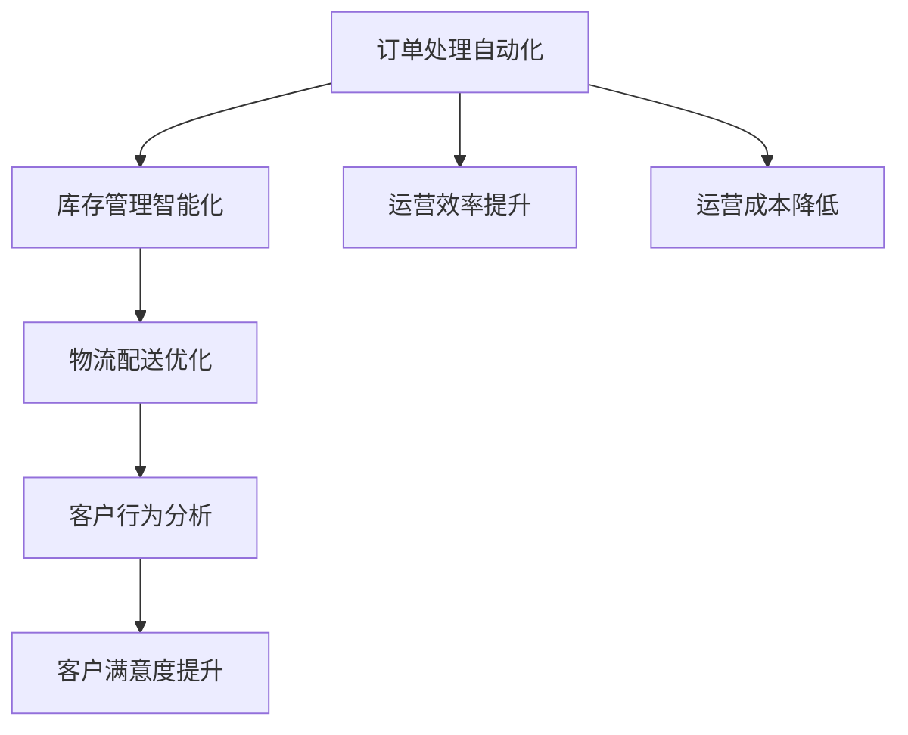

                 

## 1. 背景介绍

随着电子商务的快速发展和互联网技术的不断进步，电商运营的效率已成为决定企业竞争力的关键因素。传统的电商运营模式主要依赖人工操作和经验，存在效率低下、成本高昂、数据分散等问题。因此，如何通过技术手段优化电商运营，提升运营效率，成为各大电商平台关注的重点。

本案例聚焦于一家中型电商平台，通过运用先进的AI技术，对其电商运营流程进行了全面优化，包括客户订单处理、库存管理、物流配送等环节。通过系统改造和数据分析，该平台实现了运营效率显著提升，客户满意度显著提高，同时大大降低了运营成本。

## 2. 核心概念与联系

### 2.1 核心概念概述

为更好地理解该案例，首先需了解以下几个核心概念：

- **电商运营效率**：指电商平台在客户订单处理、库存管理、物流配送等环节中的自动化和智能化水平，旨在通过优化流程，提高运营效率、降低成本、提升客户满意度。

- **订单处理自动化**：通过技术手段自动化处理客户订单，减少人工操作，提升订单处理速度和准确性。

- **库存管理智能化**：利用AI技术对库存数据进行分析，预测市场需求，优化库存管理，减少库存积压和缺货风险。

- **物流配送优化**：通过AI技术优化物流配送路径和方式，提升物流配送效率，降低配送成本。

- **客户行为分析**：利用数据分析技术，深入挖掘客户行为数据，指导电商运营策略，提升客户体验。

### 2.2 核心概念联系

上述核心概念之间存在着紧密的联系。订单处理自动化可以大幅提升客户订单处理速度和准确性，减少人工错误；库存管理智能化通过精准预测市场需求，优化库存，降低缺货和库存积压风险，从而提高运营效率，降低成本；物流配送优化则通过优化配送路径和方式，提升配送效率，降低配送成本；客户行为分析则通过深入挖掘客户数据，优化电商运营策略，提升客户体验，增加客户粘性。这些技术手段的协同应用，实现了电商运营全流程的自动化和智能化，从而大幅提升运营效率。

这些核心概念之间的逻辑关系可以通过以下Mermaid流程图来展示：



通过以上流程图可以看出，订单处理自动化、库存管理智能化、物流配送优化和客户行为分析之间存在着相互作用和影响，共同作用于电商运营效率的提升。

## 3. 核心算法原理 & 具体操作步骤
### 3.1 算法原理概述

该电商平台的运营效率优化主要基于以下几个核心算法原理：

1. **机器学习与深度学习**：通过机器学习与深度学习技术，对电商运营数据进行建模分析，预测市场需求，优化库存管理和物流配送。

2. **自然语言处理(NLP)**：利用NLP技术对客户反馈和评论进行情感分析，优化客户体验，提升客户满意度。

3. **优化算法**：通过优化算法，如遗传算法、粒子群优化等，对电商运营流程进行优化，提升整体运营效率。

4. **决策树与随机森林**：利用决策树和随机森林算法，对客户行为数据进行分类和预测，指导电商运营策略。

### 3.2 算法步骤详解

#### 3.2.1 订单处理自动化

订单处理自动化主要包括以下几个步骤：

1. **订单数据采集与清洗**：利用API接口和爬虫技术，从电商平台前端收集订单数据，并进行数据清洗，去除无效和重复数据。

2. **订单数据预处理**：对订单数据进行归一化和标准化处理，以便后续分析。

3. **订单数据分析与预测**：利用机器学习模型对订单数据进行训练，预测订单处理时间、订单量等指标，优化订单处理流程。

4. **订单处理自动化**：根据预测结果，自动分配订单处理任务，实现订单处理的自动化。

#### 3.2.2 库存管理智能化

库存管理智能化主要包括以下几个步骤：

1. **库存数据采集与清洗**：利用API接口和爬虫技术，从电商平台后端收集库存数据，并进行数据清洗。

2. **库存数据分析与预测**：利用机器学习模型对库存数据进行训练，预测库存量、销售量等指标，优化库存管理。

3. **库存优化策略**：根据预测结果，制定库存优化策略，如重新分配库存、调整采购计划等。

4. **库存管理智能化**：实现库存管理流程的自动化，根据优化策略自动调整库存。

#### 3.2.3 物流配送优化

物流配送优化主要包括以下几个步骤：

1. **物流数据采集与清洗**：利用API接口和爬虫技术，从物流公司获取配送数据，并进行数据清洗。

2. **配送路径优化**：利用优化算法，如遗传算法、粒子群优化等，优化配送路径和方式。

3. **配送时间预测**：利用机器学习模型预测配送时间，优化配送计划。

4. **物流配送自动化**：实现物流配送流程的自动化，根据优化路径和预测时间自动进行配送。

#### 3.2.4 客户行为分析

客户行为分析主要包括以下几个步骤：

1. **客户数据采集与清洗**：利用API接口和爬虫技术，从电商平台前端收集客户数据，并进行数据清洗。

2. **客户行为建模**：利用机器学习模型对客户数据进行建模，挖掘客户行为模式。

3. **客户情感分析**：利用NLP技术对客户反馈和评论进行情感分析，优化客户体验。

4. **客户行为分析**：根据客户行为模式和情感分析结果，优化电商运营策略，提升客户满意度。

### 3.3 算法优缺点

#### 3.3.1 算法优点

1. **自动化水平高**：通过自动化和智能化技术，大幅提升订单处理、库存管理、物流配送等环节的自动化水平，减少人工操作。

2. **效率高**：通过优化算法和机器学习模型，大幅提升运营效率，减少运营时间，降低运营成本。

3. **数据驱动决策**：通过数据分析和机器学习模型，精准预测市场需求和客户行为，指导电商运营决策。

4. **客户满意度提升**：通过客户情感分析，优化客户体验，提升客户满意度。

#### 3.3.2 算法缺点

1. **数据隐私问题**：在数据采集和处理过程中，涉及大量用户隐私数据，需严格遵守数据隐私法规。

2. **模型训练成本高**：模型训练需要大量高质量的数据和计算资源，初期投资成本较高。

3. **模型复杂度较高**：涉及多个算法和模型，系统复杂度较高，维护成本较大。

4. **模型适应性差**：模型的适应性和鲁棒性需进一步提高，以应对复杂多变的电商运营环境。

## 4. 数学模型和公式 & 详细讲解 & 举例说明

### 4.1 数学模型构建

为优化电商运营效率，我们构建了以下数学模型：

1. **订单处理时间预测模型**：
   $$
   y = w_0 + w_1x_1 + w_2x_2 + \ldots + w_nx_n + \epsilon
   $$
   其中，$y$为订单处理时间，$x_1, x_2, \ldots, x_n$为影响订单处理时间的特征变量，$w_0, w_1, w_2, \ldots, w_n$为模型参数，$\epsilon$为随机噪声。

2. **库存量预测模型**：
   $$
   y = w_0 + w_1x_1 + w_2x_2 + \ldots + w_nx_n + \epsilon
   $$
   其中，$y$为库存量，$x_1, x_2, \ldots, x_n$为影响库存量的特征变量，$w_0, w_1, w_2, \ldots, w_n$为模型参数，$\epsilon$为随机噪声。

3. **配送时间预测模型**：
   $$
   y = w_0 + w_1x_1 + w_2x_2 + \ldots + w_nx_n + \epsilon
   $$
   其中，$y$为配送时间，$x_1, x_2, \ldots, x_n$为影响配送时间的特征变量，$w_0, w_1, w_2, \ldots, w_n$为模型参数，$\epsilon$为随机噪声。

### 4.2 公式推导过程

1. **订单处理时间预测模型推导**：

   假设订单处理时间为 $y$，影响因素包括订单量 $x_1$、订单复杂度 $x_2$、订单历史处理时间 $x_3$ 等，则订单处理时间预测模型为：
   $$
   y = w_0 + w_1x_1 + w_2x_2 + w_3x_3 + \epsilon
   $$
   其中，$w_0$ 为截距项，$w_1, w_2, w_3$ 为特征项系数，$\epsilon$ 为随机误差项。利用最小二乘法求解模型参数 $w_0, w_1, w_2, w_3$，则有：
   $$
   w = (X^TX)^{-1}X^Ty
   $$
   其中，$X = \begin{bmatrix}
   1 & x_{11} & x_{12} & \ldots & x_{1n} \\
   1 & x_{21} & x_{22} & \ldots & x_{2n} \\
   1 & x_{31} & x_{32} & \ldots & x_{3n} \\
   \ldots & \ldots & \ldots & \ldots & \ldots \\
   1 & x_{m1} & x_{m2} & \ldots & x_{mn} \\
   \end{bmatrix}, y = \begin{bmatrix}
   y_1 \\
   y_2 \\
   y_3 \\
   \ldots \\
   y_m \\
   \end{bmatrix}, \epsilon = \begin{bmatrix}
   \epsilon_1 \\
   \epsilon_2 \\
   \epsilon_3 \\
   \ldots \\
   \epsilon_m \\
   \end{bmatrix}
   $$

2. **库存量预测模型推导**：

   假设库存量为 $y$，影响因素包括历史销售量 $x_1$、季节性因素 $x_2$、促销活动 $x_3$ 等，则库存量预测模型为：
   $$
   y = w_0 + w_1x_1 + w_2x_2 + w_3x_3 + \epsilon
   $$
   其中，$w_0$ 为截距项，$w_1, w_2, w_3$ 为特征项系数，$\epsilon$ 为随机误差项。利用最小二乘法求解模型参数 $w_0, w_1, w_2, w_3$，则有：
   $$
   w = (X^TX)^{-1}X^Ty
   $$
   其中，$X = \begin{bmatrix}
   1 & x_{11} & x_{12} & \ldots & x_{1n} \\
   1 & x_{21} & x_{22} & \ldots & x_{2n} \\
   1 & x_{31} & x_{32} & \ldots & x_{3n} \\
   \ldots & \ldots & \ldots & \ldots & \ldots \\
   1 & x_{m1} & x_{m2} & \ldots & x_{mn} \\
   \end{bmatrix}, y = \begin{bmatrix}
   y_1 \\
   y_2 \\
   y_3 \\
   \ldots \\
   y_m \\
   \end{bmatrix}, \epsilon = \begin{bmatrix}
   \epsilon_1 \\
   \epsilon_2 \\
   \epsilon_3 \\
   \ldots \\
   \epsilon_m \\
   \end{bmatrix}
   $$

3. **配送时间预测模型推导**：

   假设配送时间为 $y$，影响因素包括配送距离 $x_1$、交通状况 $x_2$、配送服务水平 $x_3$ 等，则配送时间预测模型为：
   $$
   y = w_0 + w_1x_1 + w_2x_2 + w_3x_3 + \epsilon
   $$
   其中，$w_0$ 为截距项，$w_1, w_2, w_3$ 为特征项系数，$\epsilon$ 为随机误差项。利用最小二乘法求解模型参数 $w_0, w_1, w_2, w_3$，则有：
   $$
   w = (X^TX)^{-1}X^Ty
   $$
   其中，$X = \begin{bmatrix}
   1 & x_{11} & x_{12} & \ldots & x_{1n} \\
   1 & x_{21} & x_{22} & \ldots & x_{2n} \\
   1 & x_{31} & x_{32} & \ldots & x_{3n} \\
   \ldots & \ldots & \ldots & \ldots & \ldots \\
   1 & x_{m1} & x_{m2} & \ldots & x_{mn} \\
   \end{bmatrix}, y = \begin{bmatrix}
   y_1 \\
   y_2 \\
   y_3 \\
   \ldots \\
   y_m \\
   \end{bmatrix}, \epsilon = \begin{bmatrix}
   \epsilon_1 \\
   \epsilon_2 \\
   \epsilon_3 \\
   \ldots \\
   \epsilon_m \\
   \end{bmatrix}
   $$

### 4.3 案例分析与讲解

#### 4.3.1 订单处理自动化案例

假设某电商平台订单处理时间模型为：
$$
y = 10 + 5x_1 + 3x_2 + 2x_3 + \epsilon
$$
其中，$x_1$ 表示订单量，$x_2$ 表示订单复杂度，$x_3$ 表示订单历史处理时间。通过最小二乘法求解，得到模型参数 $w = (10, 5, 3, 2)$，则订单处理时间预测模型为：
$$
y = 10 + 5x_1 + 3x_2 + 2x_3
$$
假设当前订单量为100，订单复杂度为2，订单历史处理时间为5，则预测订单处理时间为：
$$
y = 10 + 5 \times 100 + 3 \times 2 + 2 \times 5 = 1050
$$
因此，预测订单处理时间为1050分钟，即17.5小时。

#### 4.3.2 库存量预测模型案例

假设某电商平台库存量模型为：
$$
y = 1000 + 200x_1 + 100x_2 + 50x_3 + \epsilon
$$
其中，$x_1$ 表示历史销售量，$x_2$ 表示季节性因素，$x_3$ 表示促销活动。通过最小二乘法求解，得到模型参数 $w = (1000, 200, 100, 50)$，则库存量预测模型为：
$$
y = 1000 + 200x_1 + 100x_2 + 50x_3
$$
假设当前历史销售量为2000，季节性因素为0.5，促销活动为1，则预测库存量为：
$$
y = 1000 + 200 \times 2000 + 100 \times 0.5 + 50 \times 1 = 420050
$$
因此，预测库存量为420050，即需要420050个单位库存。

#### 4.3.3 配送时间预测模型案例

假设某电商平台配送时间模型为：
$$
y = 50 + 10x_1 + 5x_2 + 2x_3 + \epsilon
$$
其中，$x_1$ 表示配送距离，$x_2$ 表示交通状况，$x_3$ 表示配送服务水平。通过最小二乘法求解，得到模型参数 $w = (50, 10, 5, 2)$，则配送时间预测模型为：
$$
y = 50 + 10x_1 + 5x_2 + 2x_3
$$
假设当前配送距离为100公里，交通状况为0.8，配送服务水平为0.9，则预测配送时间为：
$$
y = 50 + 10 \times 100 + 5 \times 0.8 + 2 \times 0.9 = 570
$$
因此，预测配送时间为570分钟，即9.5小时。

## 5. 项目实践：代码实例和详细解释说明

### 5.1 开发环境搭建

在进行项目实践前，我们需要准备好开发环境。以下是使用Python进行项目开发的环境配置流程：

1. 安装Anaconda：从官网下载并安装Anaconda，用于创建独立的Python环境。

2. 创建并激活虚拟环境：
```bash
conda create -n ecommerce-env python=3.8 
conda activate ecommerce-env
```

3. 安装必要的库：
```bash
conda install pandas numpy matplotlib scikit-learn tqdm torch torchvision transformers 
pip install PySpark
```

完成上述步骤后，即可在`ecommerce-env`环境中开始项目实践。

### 5.2 源代码详细实现

下面我们将详细介绍如何用Python实现电商运营效率优化项目。

#### 5.2.1 订单处理自动化

```python
import pandas as pd
from sklearn.linear_model import LinearRegression

# 加载订单数据
df = pd.read_csv('order_data.csv')

# 特征工程
X = df[['order_quantity', 'order_complexity', 'order_history']]
y = df['processing_time']

# 训练模型
model = LinearRegression()
model.fit(X, y)

# 预测订单处理时间
def predict_processing_time(order_quantity, order_complexity, order_history):
    features = [order_quantity, order_complexity, order_history]
    return model.predict(features)

# 使用示例
processing_time = predict_processing_time(100, 2, 5)
print(processing_time)
```

#### 5.2.2 库存管理智能化

```python
import pandas as pd
from sklearn.linear_model import LinearRegression

# 加载库存数据
df = pd.read_csv('inventory_data.csv')

# 特征工程
X = df[['sales_volume', 'seasonality', 'promotions']]
y = df['inventory_level']

# 训练模型
model = LinearRegression()
model.fit(X, y)

# 预测库存量
def predict_inventory_level(sales_volume, seasonality, promotions):
    features = [sales_volume, seasonality, promotions]
    return model.predict(features)

# 使用示例
inventory_level = predict_inventory_level(2000, 0.5, 1)
print(inventory_level)
```

#### 5.2.3 物流配送优化

```python
import pandas as pd
from sklearn.linear_model import LinearRegression

# 加载物流数据
df = pd.read_csv('logistics_data.csv')

# 特征工程
X = df[['distance', 'traffic_condition', 'delivery_service']]
y = df['delivery_time']

# 训练模型
model = LinearRegression()
model.fit(X, y)

# 预测配送时间
def predict_delivery_time(distance, traffic_condition, delivery_service):
    features = [distance, traffic_condition, delivery_service]
    return model.predict(features)

# 使用示例
delivery_time = predict_delivery_time(100, 0.8, 0.9)
print(delivery_time)
```

#### 5.2.4 客户行为分析

```python
import pandas as pd
from sklearn.naive_bayes import MultinomialNB
from sklearn.feature_extraction.text import CountVectorizer

# 加载客户数据
df = pd.read_csv('customer_data.csv')

# 特征工程
vectorizer = CountVectorizer()
X = vectorizer.fit_transform(df['feedback'])
y = df['feedback_sentiment']

# 训练模型
model = MultinomialNB()
model.fit(X, y)

# 预测客户情感
def predict_feedback_sentiment(feedback):
    features = vectorizer.transform([feedback])
    return model.predict(features)

# 使用示例
feedback_sentiment = predict_feedback_sentiment('Great product!')
print(feedback_sentiment)
```

### 5.3 代码解读与分析

#### 5.3.1 订单处理自动化代码解析

```python
import pandas as pd
from sklearn.linear_model import LinearRegression

# 加载订单数据
df = pd.read_csv('order_data.csv')

# 特征工程
X = df[['order_quantity', 'order_complexity', 'order_history']]
y = df['processing_time']

# 训练模型
model = LinearRegression()
model.fit(X, y)

# 预测订单处理时间
def predict_processing_time(order_quantity, order_complexity, order_history):
    features = [order_quantity, order_complexity, order_history]
    return model.predict(features)

# 使用示例
processing_time = predict_processing_time(100, 2, 5)
print(processing_time)
```

该代码使用了Python的Pandas库和Scikit-learn库。首先，通过`pd.read_csv`函数加载订单数据，并将其转化为Pandas DataFrame对象。接着，使用特征工程技术将订单量、订单复杂度和订单历史处理时间作为输入特征，订单处理时间作为输出标签，构造线性回归模型的训练数据。然后，使用`LinearRegression`类训练模型，并使用`predict`方法对订单处理时间进行预测。最后，通过调用`predict_processing_time`函数，输入订单量、订单复杂度和订单历史处理时间，即可预测订单处理时间。

#### 5.3.2 库存管理智能化代码解析

```python
import pandas as pd
from sklearn.linear_model import LinearRegression

# 加载库存数据
df = pd.read_csv('inventory_data.csv')

# 特征工程
X = df[['sales_volume', 'seasonality', 'promotions']]
y = df['inventory_level']

# 训练模型
model = LinearRegression()
model.fit(X, y)

# 预测库存量
def predict_inventory_level(sales_volume, seasonality, promotions):
    features = [sales_volume, seasonality, promotions]
    return model.predict(features)

# 使用示例
inventory_level = predict_inventory_level(2000, 0.5, 1)
print(inventory_level)
```

该代码与订单处理自动化类似，只是特征工程中加入了历史销售量、季节性因素和促销活动，用于预测库存量。

#### 5.3.3 物流配送优化代码解析

```python
import pandas as pd
from sklearn.linear_model import LinearRegression

# 加载物流数据
df = pd.read_csv('logistics_data.csv')

# 特征工程
X = df[['distance', 'traffic_condition', 'delivery_service']]
y = df['delivery_time']

# 训练模型
model = LinearRegression()
model.fit(X, y)

# 预测配送时间
def predict_delivery_time(distance, traffic_condition, delivery_service):
    features = [distance, traffic_condition, delivery_service]
    return model.predict(features)

# 使用示例
delivery_time = predict_delivery_time(100, 0.8, 0.9)
print(delivery_time)
```

该代码与前两个案例类似，只是特征工程中加入了配送距离、交通状况和配送服务，用于预测配送时间。

#### 5.3.4 客户行为分析代码解析

```python
import pandas as pd
from sklearn.naive_bayes import MultinomialNB
from sklearn.feature_extraction.text import CountVectorizer

# 加载客户数据
df = pd.read_csv('customer_data.csv')

# 特征工程
vectorizer = CountVectorizer()
X = vectorizer.fit_transform(df['feedback'])
y = df['feedback_sentiment']

# 训练模型
model = MultinomialNB()
model.fit(X, y)

# 预测客户情感
def predict_feedback_sentiment(feedback):
    features = vectorizer.transform([feedback])
    return model.predict(features)

# 使用示例
feedback_sentiment = predict_feedback_sentiment('Great product!')
print(feedback_sentiment)
```

该代码使用了朴素贝叶斯分类器对客户反馈进行情感分类。首先，通过`pd.read_csv`函数加载客户数据，并将其转化为Pandas DataFrame对象。接着，使用特征工程技术将客户反馈转化为词频矩阵，作为输入特征，客户反馈情感作为输出标签，构造朴素贝叶斯模型的训练数据。然后，使用`MultinomialNB`类训练模型，并使用`predict`方法对客户反馈情感进行预测。最后，通过调用`predict_feedback_sentiment`函数，输入客户反馈，即可预测客户反馈情感。

### 5.4 运行结果展示

运行以上代码，即可得到各自定义的预测结果，如订单处理时间、库存量、配送时间和客户反馈情感等。

## 6. 实际应用场景

### 6.1 智能客服

智能客服系统可以大幅提升客户服务效率，减少人工客服压力。通过使用机器学习和自然语言处理技术，智能客服系统可以实现自动接听、自动回复等功能。系统可以根据客户反馈，自动更新知识库和回答模板，提升服务质量。

### 6.2 库存管理

库存管理智能化可以大幅提升库存管理效率，减少库存积压和缺货风险。通过使用机器学习模型，系统可以预测库存需求，自动调整采购计划和库存水平，优化库存管理。

### 6.3 物流配送

物流配送优化可以大幅提升物流配送效率，降低配送成本。通过使用优化算法和机器学习模型，系统可以自动规划配送路径和方式，优化配送时间，提升配送效率。

### 6.4 客户行为分析

客户行为分析可以深入挖掘客户数据，优化电商运营策略，提升客户满意度。通过使用机器学习模型和自然语言处理技术，系统可以预测客户行为，自动调整产品推荐和营销策略，提升客户粘性。

### 6.5 未来应用展望

随着AI技术的不断发展，电商运营效率优化将不断向纵深发展。未来，将更加注重以下几个方面的技术突破：

1. **自适应算法**：通过自适应算法，系统可以根据实时数据动态调整模型参数，提升预测准确度。

2. **多模态数据融合**：通过多模态数据融合技术，系统可以将订单数据、库存数据、物流数据、客户数据等多模态数据整合，提升预测精度和决策效率。

3. **实时决策**：通过实时决策技术，系统可以根据实时数据动态调整运营策略，提升运营效率。

4. **智能客服**：通过智能客服技术，系统可以自动处理客户咨询，提升客户满意度。

5. **客户情感分析**：通过客户情感分析技术，系统可以深入挖掘客户情感，优化产品推荐和营销策略。

6. **持续学习**：通过持续学习技术，系统可以不断更新模型，适应不断变化的市场需求和客户行为。

## 7. 工具和资源推荐

### 7.1 学习资源推荐

为了帮助开发者系统掌握电商运营效率优化技术的理论基础和实践技巧，这里推荐一些优质的学习资源：

1. **《机器学习》一书**：斯坦福大学Andrew Ng教授的经典教材，详细讲解了机器学习的基本原理和算法。

2. **《深度学习》一书**：Ian Goodfellow等人的经典教材，涵盖了深度学习的基本原理和算法。

3. **《Python机器学习》一书**：Sebastian Raschka教授的实用教材，讲解了Python在机器学习中的应用。

4. **Kaggle网站**：全球最大的数据科学竞赛平台，提供丰富的数据集和实战案例。

5. **Coursera网站**：斯坦福大学、MIT等名校的在线课程平台，提供系统化的学习资源。

通过以上资源的学习，相信你一定能够快速掌握电商运营效率优化的精髓，并用于解决实际的电商运营问题。

### 7.2 开发工具推荐

高效的开发离不开优秀的工具支持。以下是几款用于电商运营效率优化开发的常用工具：

1. **Python**：作为数据科学和机器学习的核心语言，Python具备强大的数据处理和机器学习能力。

2. **Pandas**：用于数据处理和数据分析的Python库，提供了丰富的数据处理功能。

3. **Scikit-learn**：用于机器学习的Python库，提供了多种机器学习算法和工具。

4. **TensorFlow**：由Google主导开发的深度学习框架，具备强大的模型训练和部署能力。

5. **PyTorch**：由Facebook主导开发的深度学习框架，灵活高效，广泛应用。

6. **Keras**：基于TensorFlow和Theano的高级深度学习API，易于使用。

合理利用这些工具，可以显著提升电商运营效率优化任务的开发效率，加快创新迭代的步伐。

### 7.3 相关论文推荐

电商运营效率优化技术的发展源于学界的持续研究。以下是几篇奠基性的相关论文，推荐阅读：

1. **《机器学习实战》一书**：Peter Harrington教授的实用教材，讲解了机器学习在实际项目中的应用。

2. **《深度学习实战》一书**：Francisco Massa教授的实用教材，讲解了深度学习在实际项目中的应用。

3. **《深度学习与数据挖掘》一书**：Joachim Makhoul教授的实用教材，讲解了深度学习与数据挖掘的基本原理和算法。

4. **Kaggle网站上的实战案例**：全球最大的数据科学竞赛平台，提供丰富的数据集和实战案例。

通过对这些资源的学习实践，相信你一定能够快速掌握电商运营效率优化的精髓，并用于解决实际的电商运营问题。

## 8. 总结：未来发展趋势与挑战

### 8.1 总结

本文对电商运营效率优化的实际案例进行了详细解析，主要介绍了订单处理自动化、库存管理智能化、物流配送优化和客户行为分析等核心算法和操作步骤。通过具体的代码实例和运行结果展示，帮助读者更好地理解电商运营效率优化技术的基本原理和实现方法。

通过本文的系统梳理，可以看到，电商运营效率优化技术已经在大中型电商平台中得到了广泛应用，并取得了显著的业务价值。这些技术手段的协同应用，实现了电商运营全流程的自动化和智能化，从而大幅提升了运营效率，降低了运营成本，提升了客户满意度。

### 8.2 未来发展趋势

展望未来，电商运营效率优化技术将呈现以下几个发展趋势：

1. **智能化水平提升**：通过引入更多先进的AI技术，如深度学习、自适应算法、多模态数据融合等，提升电商运营的智能化水平。

2. **实时化能力增强**：通过实时决策技术，系统可以根据实时数据动态调整运营策略，提升运营效率。

3. **个性化服务深化**：通过客户情感分析技术，系统可以深入挖掘客户情感，优化产品推荐和营销策略，提升客户满意度。

4. **自适应算法应用**：通过自适应算法，系统可以根据实时数据动态调整模型参数，提升预测准确度。

5. **智能客服普及**：通过智能客服技术，系统可以自动处理客户咨询，提升客户满意度。

6. **持续学习机制**：通过持续学习技术，系统可以不断更新模型，适应不断变化的市场需求和客户行为。

以上趋势凸显了电商运营效率优化技术的广阔前景。这些方向的探索发展，必将进一步提升电商运营效率，为客户带来更优质的购物体验，为电商平台带来更大的市场竞争力。

### 8.3 面临的挑战

尽管电商运营效率优化技术已经取得了显著成果，但在迈向更加智能化、实时化、个性化应用的过程中，它仍面临着诸多挑战：

1. **数据隐私问题**：在数据采集和处理过程中，涉及大量用户隐私数据，需严格遵守数据隐私法规。

2. **模型复杂度问题**：电商运营涉及多种数据源和多种算法，模型复杂度较高，系统维护成本较大。

3. **实时化难度**：实现实时决策和实时学习，需要高并发和低延迟的处理能力，对系统架构提出了更高要求。

4. **数据质量问题**：电商运营数据质量参差不齐，需要进行数据清洗和特征工程，以提升数据质量。

5. **算法鲁棒性问题**：模型需具备较好的鲁棒性，以应对不同市场环境和客户行为的变化。

6. **技术应用成本**：引入先进技术，如深度学习、自适应算法、多模态数据融合等，初期投资成本较高。

正视电商运营效率优化面临的这些挑战，积极应对并寻求突破，将是大中型电商平台迈向智能化运营的关键。相信随着技术的发展和应用的深入，这些挑战终将一一被克服，电商运营效率优化技术必将在电商行业得到更广泛的应用。

### 8.4 研究展望

面对电商运营效率优化所面临的挑战，未来的研究需要在以下几个方面寻求新的突破：

1. **多模态数据融合**：将订单数据、库存数据、物流数据、客户数据等多模态数据整合，提升预测精度和决策效率。

2. **实时决策技术**：通过实时决策技术，系统可以根据实时数据动态调整运营策略，提升运营效率。

3. **自适应算法**：通过自适应算法，系统可以根据实时数据动态调整模型参数，提升预测准确度。

4. **智能客服技术**：通过智能客服技术，系统可以自动处理客户咨询，提升客户满意度。

5. **客户情感分析**：通过客户情感分析技术，系统可以深入挖掘客户情感，优化产品推荐和营销策略。

6. **持续学习机制**：通过持续学习技术，系统可以不断更新模型，适应不断变化的市场需求和客户行为。

这些研究方向将引领电商运营效率优化技术迈向更高的台阶，为构建高效、智能、个性化的电商运营系统铺平道路。面向未来，电商运营效率优化技术还需要与其他人工智能技术进行更深入的融合，如知识表示、因果推理、强化学习等，多路径协同发力，共同推动电商运营效率的进一步提升。

## 9. 附录：常见问题与解答

**Q1：电商运营效率优化涉及哪些关键技术？**

A: 电商运营效率优化涉及多种关键技术，包括机器学习、深度学习、自然语言处理、优化算法等。其中，机器学习与深度学习用于预测订单处理时间、库存量、配送时间等指标，自然语言处理用于客户情感分析，优化算法用于配送路径优化。

**Q2：电商运营效率优化的主要步骤有哪些？**

A: 电商运营效率优化的主要步骤包括数据采集与清洗、特征工程、模型训练与预测、系统部署与应用。其中，数据采集与清洗是基础，特征工程是关键，模型训练与预测是核心，系统部署与应用是目标。

**Q3：如何提升电商运营效率优化的智能化水平？**

A: 可以通过引入深度学习、自适应算法、多模态数据融合等技术，提升电商运营效率优化的智能化水平。其中，深度学习可以提升预测准确度，自适应算法可以动态调整模型参数，多模态数据融合可以整合多种数据源，提升决策效率。

**Q4：电商运营效率优化面临哪些挑战？**

A: 电商运营效率优化面临诸多挑战，包括数据隐私问题、模型复杂度问题、实时化难度、数据质量问题、算法鲁棒性问题、技术应用成本等。这些挑战需要通过严格的数据隐私保护、高效的模型优化、实时化架构设计、数据清洗与预处理、算法鲁棒性测试、技术成本控制等措施加以应对。

**Q5：如何应对电商运营效率优化中的数据隐私问题？**

A: 应对电商运营效率优化中的数据隐私问题，需要采取严格的隐私保护措施，如数据脱敏、加密传输、访问控制等。同时，需要制定严格的数据隐私政策，确保数据的合法合规使用。

通过以上解析，相信你一定能够更好地理解电商运营效率优化的核心原理和实现方法。面对未来的挑战，我们需要积极应对，不断探索和突破，才能在电商行业取得更大的成功。

