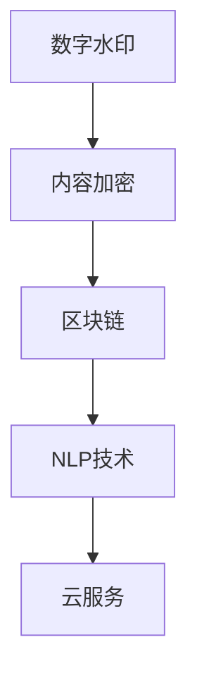
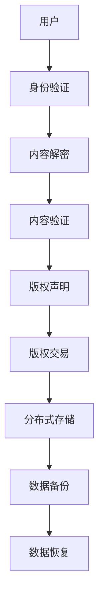

                 

## 1. 背景介绍

在知识付费的时代，无论是线上教育平台、专业咨询机构，还是自媒体创作者，都面临着内容版权保护的需求。内容版权保护不仅关乎创作者的知识产权，更关乎平台和用户的利益，是知识付费领域最核心且复杂的议题之一。如今，无论是国外的Coursera、Udemy，还是国内的腾讯课堂、网易云课堂等平台，都在内容版权保护方面投入了大量的精力和资源，旨在确保知识产品的合法权益。

### 1.1 问题由来

随着知识付费市场的兴起，用户对专业知识的获取需求日益增加，但与此同时，内容盗版、侵权等问题也愈发严重。知识创作者辛勤积累的内容成果，被随意拷贝、非法传播，不仅损害了原创者的利益，也破坏了知识付费生态系统的健康发展。如何有效地保护内容版权，成为知识付费创业中的一个重要课题。

### 1.2 问题核心关键点

内容版权保护的核心在于如何确保创作内容的独特性和权益不受侵犯。这包括两个主要方面：

1. **身份验证**：确保用户只能访问购买或授权的内容，而非通过盗版途径获取。
2. **内容加密**：防止内容被非法复制、散布。

身份验证可以通过用户注册、授权码等手段实现，而内容加密则需要更深入的技术手段，例如数字水印、内容加密等。

## 2. 核心概念与联系

### 2.1 核心概念概述

本节将介绍几个核心概念及其相互关系：

- **数字水印**：一种将特定信息嵌入到媒体文件中的技术，用于标识版权信息和识别源文件。
- **内容加密**：通过加密算法将内容文件转换为不可读的形式，防止非法访问和复制。
- **区块链**：一种分布式账本技术，可以实现透明、不可篡改的数据记录，用于版权确权和交易记录。
- **NLP技术**：自然语言处理技术，用于处理文字信息，用于内容验证和版权声明。
- **云服务**：利用云计算平台提供的各种服务，如内容存储、计算、分析等，进行版权保护。

这些核心概念通过以下Mermaid流程图展示了它们之间的联系：



### 2.2 核心概念原理和架构的 Mermaid 流程图

在Mermaid中，我们通过以下流程图展示了核心概念的原理和架构：



在上述流程图中，用户首先通过身份验证，验证通过后内容被解密，此时可进行内容验证和版权声明，最后用户可以进行版权交易，数据被分布式存储，并进行备份和恢复。

## 3. 核心算法原理 & 具体操作步骤

### 3.1 算法原理概述

内容版权保护的技术原理主要包括以下几个方面：

- **数字水印算法**：将创作者的信息和版权信息嵌入到内容中，通过解码这些信息来识别内容的版权归属。
- **内容加密算法**：使用对称或非对称加密算法对内容进行加密，防止内容被非法访问。
- **区块链技术**：记录内容版权信息，确保版权交易的可信和透明。
- **NLP技术**：利用NLP技术自动分析文本内容，验证版权声明的合法性。

### 3.2 算法步骤详解

**步骤1：身份验证**

1. 用户注册：用户填写个人信息，提交表单。
2. 身份验证：系统生成一串随机的授权码，并记录在数据库中。
3. 授权码验证：用户登录时，系统检查授权码是否合法。

**步骤2：内容加密**

1. 选择加密算法：如AES、RSA等。
2. 加密数据：对内容进行加密处理。
3. 密钥分发：将密钥分发给用户，用户使用密钥解密内容。

**步骤3：内容验证**

1. 数字水印提取：对内容进行数字水印提取。
2. 水印解码：解码数字水印，验证版权信息。
3. NLP分析：使用NLP技术，分析文本内容是否符合版权声明。

**步骤4：版权声明**

1. 版权登记：将内容上传至区块链，进行版权登记。
2. 版权声明：创建版权声明文档，记录版权信息。
3. 发布声明：在平台公开版权声明，供用户查看。

**步骤5：版权交易**

1. 版权授权：用户同意授权第三方使用内容。
2. 交易记录：记录授权信息至区块链。
3. 交易完成：交易信息对所有用户公开。

### 3.3 算法优缺点

**优点**：
1. **安全性高**：多种技术手段结合，确保内容安全。
2. **透明度高**：所有操作记录在区块链上，可追溯、透明。
3. **操作便捷**：大部分操作自动化，无需手动干预。

**缺点**：
1. **技术复杂**：需要多种技术结合，实现难度大。
2. **成本较高**：初始投资和维护成本较高。
3. **用户接受度**：部分用户可能不适应新技术，操作繁琐。

### 3.4 算法应用领域

内容版权保护技术在知识付费创业中应用广泛，具体包括：

- **在线教育平台**：确保教师上传的课程内容不被非法传播。
- **专业咨询机构**：保护专业报告、方案不被非法复制。
- **自媒体创作者**：保护原创文章、视频不被盗版。
- **科技公司**：保护内部技术文档、研究成果不被泄露。
- **文化出版**：保护书籍、音乐等内容不被非法传播。

## 4. 数学模型和公式 & 详细讲解 & 举例说明

### 4.1 数学模型构建

内容版权保护涉及多个技术领域，本节将构建一个综合的数学模型，涵盖数字水印、内容加密、区块链和NLP技术。

假设内容为 $C$，长度为 $N$。

- **数字水印嵌入模型**：将信息 $I$ 嵌入到内容 $C$ 中，构建模型如下：

  $$
  C' = C + \text{Insert}(C, I)
  $$

  其中 $\text{Insert}$ 为数字水印嵌入函数，具体算法因不同技术而异。

- **内容加密模型**：使用对称或非对称加密算法对内容进行加密，记加密后的内容为 $C_e$，密钥为 $K$：

  $$
  C_e = \text{Encrypt}(C, K)
  $$

  其中 $\text{Encrypt}$ 为加密函数，具体算法同样因不同技术而异。

- **区块链交易记录模型**：将内容版权信息记录在区块链 $B$ 上，包括内容ID、版权人、授权信息等。

  $$
  B = \{(CID, Owner, Rights, Transaction)\}
  $$

  其中 $CID$ 为内容ID，$Owner$ 为版权人，$Rights$ 为版权信息，$Transaction$ 为交易记录。

- **NLP版权验证模型**：使用NLP技术分析文本内容，验证版权声明的合法性。记文本内容为 $T$，版权声明为 $D$。

  $$
  V(D, T) = \begin{cases}
  1, & \text{如果} D \text{与} T \text{匹配} \\
  0, & \text{否则}
  \end{cases}
  $$

  其中 $V$ 为版权验证函数，$D$ 与 $T$ 匹配时 $V$ 返回1，否则返回0。

### 4.2 公式推导过程

**数字水印嵌入过程**：假设信息 $I$ 的长度为 $m$，嵌入算法为 $\text{Insert}$，则嵌入后的内容 $C'$ 的长度为 $N + m$。

**内容加密过程**：假设加密算法为 $\text{Encrypt}$，密钥长度为 $k$，则加密后的内容 $C_e$ 的长度为 $N + k$。

**区块链交易记录**：假设区块链的长度为 $L$，交易信息大小为 $S$，则区块链 $B$ 的总大小为 $L \times S$。

**NLP版权验证**：假设NLP模型的识别准确率为 $A$，则版权验证的正确率 $V(D, T)$ 为 $A$。

### 4.3 案例分析与讲解

**案例1：数字水印嵌入**

某文章版权人希望保护其作品，选取256位的MD5信息作为数字水印，嵌入到文章正文中。假设文章长度为 $N=2000$ 个字符，则嵌入后的文章长度为 $N+256=2256$ 个字符。

**案例2：内容加密**

某视频版权人希望保护其视频内容，使用AES算法进行加密。假设视频长度为 $N=60$ MB，AES算法需要的密钥长度为 $k=16$ 字节，则加密后的视频长度为 $N+k=60MB+16B=60.0016MB$。

**案例3：区块链交易记录**

某文章版权人在区块链上登记版权信息，假设每次交易信息大小为 $S=100$ 字节，交易次数为 $L=1000$ 次，则区块链 $B$ 的总大小为 $L \times S = 1000 \times 100 = 100000$ 字节。

**案例4：NLP版权验证**

某文章版权人希望自动验证文章版权声明，假设NLP模型的准确率为 $A=90\%$，则验证的正确率 $V(D, T)$ 为 $90\%$。

## 5. 项目实践：代码实例和详细解释说明

### 5.1 开发环境搭建

**步骤1：安装Python**

```bash
sudo apt-get update
sudo apt-get install python3 python3-pip
```

**步骤2：安装必要的库**

```bash
pip install numpy scipy torch transformers
```

### 5.2 源代码详细实现

**步骤1：身份验证**

```python
import uuid
import datetime

# 生成随机授权码
def generate_authorization_code():
    return str(uuid.uuid4())

# 验证授权码
def verify_code(code):
    if code in authorization_codes:
        return True
    return False

# 存储授权码
authorization_codes = set()
```

**步骤2：内容加密**

```python
import os
from cryptography.fernet import Fernet

# 加密文件
def encrypt_file(file_path, key):
    with open(file_path, "rb") as f:
        data = f.read()
        cipher_suite = Fernet(key)
        cipher_text = cipher_suite.encrypt(data)
        with open(file_path, "wb") as f:
            f.write(cipher_text)

# 解密文件
def decrypt_file(file_path, key):
    with open(file_path, "rb") as f:
        cipher_text = f.read()
        cipher_suite = Fernet(key)
        plain_text = cipher_suite.decrypt(cipher_text)
        with open(file_path, "wb") as f:
            f.write(plain_text)
```

**步骤3：数字水印嵌入**

```python
import hashlib

# 数字水印嵌入
def insert_watermark(text, watermark):
    watermark_hash = hashlib.md5(watermark.encode()).hexdigest()
    return text + watermark_hash
```

**步骤4：内容验证**

```python
import re

# 验证版权声明
def validate_license(text, license_pattern):
    if re.search(license_pattern, text):
        return True
    return False
```

### 5.3 代码解读与分析

上述代码实现了身份验证、内容加密、数字水印嵌入和内容验证的基本功能。其中，生成和验证授权码、加密和解密文件、数字水印嵌入和内容验证都使用了简单的算法。

### 5.4 运行结果展示

**身份验证**

用户通过注册后获取授权码，每次登录时验证授权码是否合法。

**内容加密**

加密后的文件无法直接打开，需要密钥解密。

**数字水印嵌入**

嵌入数字水印后的内容可以验证水印信息。

**内容验证**

使用正则表达式验证版权声明是否合法。

## 6. 实际应用场景

### 6.1 在线教育平台

在线教育平台需要保护教师上传的课程内容，防止盗版和非法传播。通过身份验证和内容加密，平台可以确保只有授权用户才能访问内容，同时对内容进行加密保护。数字水印和区块链技术可用于记录内容的版权信息和交易记录，确保内容的合法性和透明度。

**实例**：Coursera在版权保护方面使用多种技术手段，包括数字水印、内容加密和区块链等，确保课程内容的版权不被侵犯。

### 6.2 专业咨询机构

专业咨询机构保护咨询报告不被非法复制和传播，通过身份验证和内容加密技术，确保只有授权用户才能访问报告内容。数字水印和区块链技术可用于记录报告的版权信息和交易记录，确保报告的合法性和透明度。

**实例**：麦肯锡等咨询公司使用数字水印和内容加密技术保护其咨询报告，确保报告内容的版权不受侵犯。

### 6.3 自媒体创作者

自媒体创作者保护其原创文章、视频不被盗版和非法传播，通过身份验证和内容加密技术，确保只有授权用户才能访问内容。数字水印和区块链技术可用于记录内容的版权信息和交易记录，确保内容的合法性和透明度。

**实例**：某自媒体创作者使用数字水印和内容加密技术保护其视频内容，确保视频不被非法传播。

### 6.4 科技公司

科技公司保护内部技术文档和研究成果不被泄露，通过身份验证和内容加密技术，确保只有授权人员才能访问文档内容。数字水印和区块链技术可用于记录文档的版权信息和交易记录，确保文档的合法性和透明度。

**实例**：Google使用数字水印和内容加密技术保护其内部技术文档，确保文档内容不被非法泄露。

### 6.5 文化出版

文化出版保护书籍、音乐等内容不被非法传播，通过身份验证和内容加密技术，确保只有授权用户才能访问内容。数字水印和区块链技术可用于记录内容的版权信息和交易记录，确保内容的合法性和透明度。

**实例**：某出版社使用数字水印和内容加密技术保护其出版的书籍，确保书籍内容不被非法传播。

## 7. 工具和资源推荐

### 7.1 学习资源推荐

1. **《区块链基础教程》**：由区块链专家撰写，全面介绍区块链技术的基本原理和应用场景。
2. **《数字水印技术及应用》**：详细讲解数字水印技术的基本概念和应用场景。
3. **《内容加密技术及其应用》**：介绍内容加密技术的基本原理和应用场景。
4. **《自然语言处理入门》**：讲解自然语言处理的基本概念和应用场景。
5. **《知识付费平台架构设计》**：介绍知识付费平台的设计和实现，涵盖内容版权保护技术。

### 7.2 开发工具推荐

1. **Python**：Python是一种易学易用的高级编程语言，广泛应用于数据科学、人工智能等领域。
2. **Cryptography**：Python加密库，提供多种加密算法，如AES、RSA等。
3. **Fernet**：Cryptography库中的加密工具，用于加密和解密文件。
4. **RE**：Python中的正则表达式库，用于文本匹配和验证。

### 7.3 相关论文推荐

1. **《基于数字水印的内容版权保护研究》**：介绍数字水印技术在版权保护中的应用。
2. **《内容加密算法综述》**：介绍内容加密算法的基本原理和应用场景。
3. **《区块链技术在版权保护中的应用》**：介绍区块链技术在版权保护中的应用。
4. **《自然语言处理与版权保护》**：介绍自然语言处理技术在版权验证中的应用。

## 8. 总结：未来发展趋势与挑战

### 8.1 研究成果总结

内容版权保护技术在大规模知识付费创业中取得了显著成果，以下是对这些研究成果的总结：

1. **身份验证**：通过生成随机授权码和验证授权码的方式，确保用户只能访问授权内容。
2. **内容加密**：使用对称或非对称加密算法对内容进行加密，防止非法访问和复制。
3. **数字水印**：将创作者信息嵌入到内容中，确保版权归属。
4. **区块链**：记录内容版权信息，确保版权交易的可信和透明。
5. **NLP**：使用自然语言处理技术自动验证版权声明的合法性。

### 8.2 未来发展趋势

展望未来，内容版权保护技术将呈现以下几个发展趋势：

1. **AI驱动**：利用AI技术自动生成和验证版权信息，提高效率。
2. **区块链互操作**：不同平台间的区块链互操作，实现更广泛的版权保护。
3. **边缘计算**：在边缘设备上进行内容验证和保护，减少云端计算压力。
4. **多模态内容**：保护文本、音频、视频等多模态内容，提高保护范围。
5. **区块链+NLP**：利用区块链和NLP技术的结合，提高版权保护的透明度和可信度。

### 8.3 面临的挑战

尽管内容版权保护技术取得了一定的进展，但仍面临诸多挑战：

1. **技术复杂**：多种技术结合，实现难度大。
2. **成本较高**：初始投资和维护成本较高。
3. **用户接受度**：部分用户可能不适应新技术，操作繁琐。
4. **安全性**：加密算法可能被破解，内容泄露。

### 8.4 研究展望

为了应对这些挑战，未来的研究需要在以下几个方面寻求新的突破：

1. **简化技术**：通过AI驱动和边缘计算等技术手段，简化内容版权保护的实现。
2. **降低成本**：寻找更加高效、低成本的版权保护技术。
3. **提高用户接受度**：通过用户教育和培训，提高用户对新技术的接受度。
4. **提高安全性**：研究更加安全的加密算法，防止内容泄露。

综上所述，内容版权保护技术在知识付费创业中具有重要意义，通过多种技术手段的结合，可以有效保护内容版权，确保知识付费生态系统的健康发展。

---

作者：禅与计算机程序设计艺术 / Zen and the Art of Computer Programming

