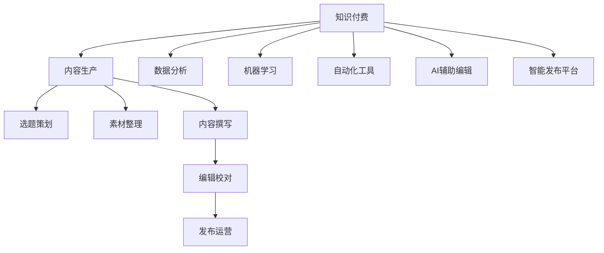

                 

# 知识付费创业中的内容生产效率提升

> 关键词：知识付费,内容生产,效率提升,数据分析,机器学习,自动化,人工智能,技术博客

## 1. 背景介绍

### 1.1 问题由来
随着知识付费市场的兴起，越来越多的创业者进入这一领域。但内容生产仍是知识付费平台的核心壁垒，在提高内容生产效率的同时，还要保证内容的质量和独特性。传统的编辑流程耗时长、成本高，无法满足快速迭代的市场需求。因此，如何利用技术手段提升内容生产效率，成为了知识付费创业中亟待解决的难题。

### 1.2 问题核心关键点
内容生产效率提升的核心在于通过数据分析和机器学习技术，对内容创作过程中的瓶颈环节进行优化。主要包括：

1. **选题策划**：选题是内容创作的核心，如何精准判断市场需求，规划选题策略，是提升内容生产效率的关键。
2. **素材整理**：整理各类素材，包括参考资料、采访记录、图表数据等，保障内容的丰富性和真实性。
3. **内容撰写**：通过模板化、自动化工具，快速生成和优化内容，提高创作效率。
4. **编辑校对**：利用AI辅助编辑，减少人工校对工作量，提升内容质量。
5. **发布运营**：建立智能发布平台，实时监测用户反馈，动态调整内容策略。

本文将聚焦于如何利用数据分析、机器学习和自动化技术，对知识付费平台的内容生产过程进行全面优化，提升整体效率。

### 1.3 问题研究意义
高效的内容生产流程，不仅能满足市场快速增长的内容需求，还能降低人力成本，提高内容创作的精确度和创新性。基于数据分析和机器学习的内容生产工具，在保证内容质量的同时，还能形成系统的知识体系，提升知识付费平台的核心竞争力。

## 2. 核心概念与联系

### 2.1 核心概念概述

为更好地理解本文的核心概念，本节将介绍几个密切相关的核心概念：

1. **知识付费**：通过付费模式提供深度内容，提升内容创作者的经济效益，满足用户对知识的需求。
2. **内容生产**：包括选题策划、素材整理、内容撰写、编辑校对、发布运营等环节，是知识付费平台的核心业务。
3. **数据分析**：利用统计学和机器学习技术，从海量数据中提取有价值的信息，指导内容创作和运营策略。
4. **机器学习**：通过训练模型，自动化地分析和处理数据，提供内容推荐、情感分析、话题识别等功能。
5. **自动化工具**：使用软件工具自动化处理重复性工作，提升内容创作效率。
6. **AI辅助编辑**：利用自然语言处理和图像识别技术，提升内容校对的准确性和效率。
7. **智能发布平台**：基于用户反馈和大数据分析，动态调整内容发布策略，提升内容的用户互动率。

这些核心概念之间的逻辑关系可以通过以下Mermaid流程图来展示：



这个流程图展示了一个知识付费平台的内容生产流程：

1. 知识付费是平台的核心商业模式。
2. 内容生产是平台业务的核心环节。
3. 选题策划、素材整理、内容撰写、编辑校对、发布运营是内容生产的主要步骤。
4. 数据分析、机器学习、自动化工具、AI辅助编辑、智能发布平台是提升内容生产效率的技术手段。

## 3. 核心算法原理 & 具体操作步骤

### 3.1 算法原理概述

内容生产效率提升的核心在于利用数据分析和机器学习技术，对内容创作过程中的瓶颈环节进行优化。具体来说，通过以下步骤实现：

1. **选题策划**：利用数据分析工具，从用户兴趣、市场热点、热门话题等角度，挖掘潜在选题。
2. **素材整理**：利用文本挖掘和图像识别技术，自动整理和标注各类素材。
3. **内容撰写**：使用自动化工具生成初步内容，通过机器学习优化内容结构，提升内容质量。
4. **编辑校对**：使用AI辅助编辑工具，自动化校对文本和图像，提升内容准确性。
5. **发布运营**：建立智能发布平台，实时监测用户反馈，动态调整内容策略。

### 3.2 算法步骤详解

#### 3.2.1 选题策划

**步骤1：数据采集与预处理**

1. 采集用户行为数据，包括浏览记录、收藏夹、评论等。
2. 清洗数据，去除噪声和无关信息，保留高质量的用户行为数据。

**步骤2：需求分析**

1. 使用文本挖掘技术，从用户评论和反馈中提取高频词汇和情感倾向，了解用户关注的热点话题。
2. 结合市场热点，挖掘用户兴趣和趋势，确定潜在的选题方向。

**步骤3：选题优化**

1. 利用自然语言处理技术，对潜在选题进行情感分析和话题识别，判断选题的市场潜力和用户接受度。
2. 根据分析结果，优化选题策略，筛选最具吸引力的选题。

#### 3.2.2 素材整理

**步骤1：文本整理**

1. 利用OCR技术，自动提取图像中的文本信息。
2. 使用文本挖掘技术，自动标注文本中的关键信息，如人名、地点、时间等。

**步骤2：图像识别**

1. 利用图像识别技术，自动标注图片中的物体、场景等信息。
2. 结合文本信息，对图片进行分类和标注，提升素材的多样性和准确性。

#### 3.2.3 内容撰写

**步骤1：自动化内容生成**

1. 使用模板化工具，根据选题生成初步内容框架。
2. 利用自然语言生成技术，自动填充文本内容，提升内容创作效率。

**步骤2：内容优化**

1. 利用机器学习技术，对自动生成的内容进行情感分析和话题识别，优化内容结构和语言表达。
2. 结合专家知识和用户反馈，对内容进行人工调整，确保内容质量。

#### 3.2.4 编辑校对

**步骤1：文本校对**

1. 使用自然语言处理技术，自动化校对文本中的语法错误、拼写错误和标点错误。
2. 结合上下文信息，自动纠正词语使用不当和逻辑错误。

**步骤2：图像校对**

1. 利用图像识别技术，自动校对图片中的物体识别错误、场景误标等问题。
2. 结合文本信息，自动校对图片与文本内容的一致性，提升内容连贯性。

#### 3.2.5 发布运营

**步骤1：内容发布**

1. 利用智能发布平台，自动化发布内容，确保内容按时上线。
2. 根据内容特点和用户偏好，自动选择最佳的发布时间和渠道。

**步骤2：用户反馈分析**

1. 利用数据分析技术，实时监测用户反馈和互动数据，了解内容受欢迎程度。
2. 根据反馈数据，动态调整内容策略，提升内容的用户互动率和留存率。

### 3.3 算法优缺点

基于数据分析和机器学习的内容生产流程，具有以下优点：

1. **高效性**：自动化工具和机器学习模型大大缩短了内容生产时间，提升了创作效率。
2. **准确性**：数据分析和机器学习技术能够精确分析用户需求和内容质量，提高内容精准度。
3. **灵活性**：智能发布平台可以根据实时数据动态调整内容策略，提升内容运营效果。

但该方法也存在以下局限性：

1. **依赖高质量数据**：数据采集和预处理需要大量高质量的用户行为数据，数据质量直接影响模型效果。
2. **模型训练复杂**：机器学习模型需要大量标注数据进行训练，标注成本较高。
3. **解释性不足**：自动化工具和机器学习模型缺乏可解释性，用户和创作者难以理解其决策过程。

尽管存在这些局限性，但就目前而言，基于数据分析和机器学习的内容生产流程仍是提升知识付费平台内容生产效率的重要方法。未来相关研究的重点在于如何进一步降低数据标注成本，提高模型的可解释性，同时兼顾内容的独特性和质量。

### 3.4 算法应用领域

基于数据分析和机器学习的内容生产流程，已经在知识付费平台、在线教育、新闻媒体等领域得到了广泛应用，具体包括：

1. **知识付费平台**：提供个性化内容推荐、热点话题分析、用户行为监测等服务，提升内容创作和运营效率。
2. **在线教育**：利用智能化的教学资源管理和课程推荐系统，提升教学质量和用户学习体验。
3. **新闻媒体**：结合用户兴趣和市场热点，自动化生成新闻摘要，提升新闻内容的及时性和相关性。
4. **社交媒体**：利用情感分析和话题识别技术，自动生成和推荐内容，提升用户互动率。
5. **金融市场**：结合市场数据和用户行为，生成深度分析报告，提升投资决策的准确性。

随着技术的不断演进，基于数据分析和机器学习的内容生产流程将在更多领域得到应用，为各行业的数字化转型提供新的动力。

## 4. 数学模型和公式 & 详细讲解 & 举例说明

### 4.1 数学模型构建

#### 4.1.1 选题策划

**用户行为分析模型**

假设用户行为数据集为 $D=\{(x_i,y_i)\}_{i=1}^N, x_i \in \mathbb{R}^d, y_i \in \{0,1\}$，其中 $x_i$ 表示用户行为数据，$y_i$ 表示是否对相关内容感兴趣。

定义模型 $M_{\theta}$ 在输入 $x_i$ 上的预测概率为 $\hat{y}=M_{\theta}(x_i)$，则用户行为分析模型为：

$$
\hat{y}_i = \sigma(\theta^T \cdot x_i)
$$

其中 $\sigma$ 为sigmoid函数，$\theta$ 为模型参数。

**情感分析模型**

假设情感分析任务的数据集为 $D=\{(x_i, y_i)\}_{i=1}^N, x_i \in \mathbb{R}^d, y_i \in \{-1,1\}$，其中 $x_i$ 表示文本内容，$y_i$ 表示情感倾向（-1表示负面，1表示正面）。

定义模型 $M_{\theta}$ 在输入 $x_i$ 上的预测概率为 $\hat{y}=M_{\theta}(x_i)$，则情感分析模型为：

$$
\hat{y}_i = \sigma(\theta^T \cdot x_i)
$$

其中 $\sigma$ 为sigmoid函数，$\theta$ 为模型参数。

#### 4.1.2 素材整理

**文本挖掘模型**

假设文本挖掘任务的数据集为 $D=\{(x_i, y_i)\}_{i=1}^N, x_i \in \mathbb{R}^d, y_i \in \{O, P, M\}$，其中 $x_i$ 表示文本内容，$y_i$ 表示文本中的关键信息（O表示其他，P表示人名，M表示地点）。

定义模型 $M_{\theta}$ 在输入 $x_i$ 上的预测概率为 $\hat{y}=M_{\theta}(x_i)$，则文本挖掘模型为：

$$
\hat{y}_i = \sigma(\theta^T \cdot x_i)
$$

其中 $\sigma$ 为sigmoid函数，$\theta$ 为模型参数。

**图像识别模型**

假设图像识别任务的数据集为 $D=\{(x_i, y_i)\}_{i=1}^N, x_i \in \mathbb{R}^d, y_i \in \{B, O\}$，其中 $x_i$ 表示图像数据，$y_i$ 表示图像中的物体（B表示背景，O表示前景）。

定义模型 $M_{\theta}$ 在输入 $x_i$ 上的预测概率为 $\hat{y}=M_{\theta}(x_i)$，则图像识别模型为：

$$
\hat{y}_i = \sigma(\theta^T \cdot x_i)
$$

其中 $\sigma$ 为sigmoid函数，$\theta$ 为模型参数。

### 4.2 公式推导过程

#### 4.2.1 选题策划

**用户行为分析公式推导**

假设用户行为数据集为 $D=\{(x_i,y_i)\}_{i=1}^N, x_i \in \mathbb{R}^d, y_i \in \{0,1\}$。

使用逻辑回归模型进行用户行为分析，定义模型 $M_{\theta}$ 在输入 $x_i$ 上的预测概率为 $\hat{y}_i = \sigma(\theta^T \cdot x_i)$。

利用交叉熵损失函数，定义损失函数 $\mathcal{L}(\theta)$：

$$
\mathcal{L}(\theta) = -\frac{1}{N} \sum_{i=1}^N [y_i\log \hat{y}_i + (1-y_i)\log (1-\hat{y}_i)]
$$

最小化损失函数，更新模型参数 $\theta$：

$$
\theta \leftarrow \theta - \eta \nabla_{\theta}\mathcal{L}(\theta)
$$

其中 $\eta$ 为学习率。

#### 4.2.2 情感分析公式推导

**情感分析公式推导**

假设情感分析任务的数据集为 $D=\{(x_i, y_i)\}_{i=1}^N, x_i \in \mathbb{R}^d, y_i \in \{-1,1\}$。

使用逻辑回归模型进行情感分析，定义模型 $M_{\theta}$ 在输入 $x_i$ 上的预测概率为 $\hat{y}_i = \sigma(\theta^T \cdot x_i)$。

利用交叉熵损失函数，定义损失函数 $\mathcal{L}(\theta)$：

$$
\mathcal{L}(\theta) = -\frac{1}{N} \sum_{i=1}^N [y_i\log \hat{y}_i + (1-y_i)\log (1-\hat{y}_i)]
$$

最小化损失函数，更新模型参数 $\theta$：

$$
\theta \leftarrow \theta - \eta \nabla_{\theta}\mathcal{L}(\theta)
$$

其中 $\eta$ 为学习率。

### 4.3 案例分析与讲解

#### 4.3.1 用户行为分析案例

**数据采集与预处理**

某知识付费平台收集了用户行为数据 $D=\{(x_i,y_i)\}_{i=1}^N, x_i \in \mathbb{R}^d, y_i \in \{0,1\}$。

使用Python和Pandas进行数据清洗和预处理，去除噪声和无关信息，保留高质量的用户行为数据。

```python
import pandas as pd

# 读取数据集
data = pd.read_csv('user_behavior.csv')

# 数据清洗
data = data.dropna()
data = data.drop_duplicates()

# 特征工程
data['time'] = pd.to_datetime(data['time'])
data['weekday'] = data['time'].dt.weekday
data['hour'] = data['time'].dt.hour
data = data.drop(['time'], axis=1)
```

#### 4.3.2 情感分析案例

**情感分析模型训练**

某知识付费平台收集了用户评论数据 $D=\{(x_i, y_i)\}_{i=1}^N, x_i \in \mathbb{R}^d, y_i \in \{-1,1\}$。

使用TensorFlow和Keras构建情感分析模型，使用交叉熵损失函数进行训练。

```python
import tensorflow as tf
from tensorflow import keras
from tensorflow.keras import layers

# 构建模型
model = keras.Sequential([
    layers.Embedding(input_dim=10000, output_dim=16, input_length=100),
    layers.LSTM(32),
    layers.Dense(1, activation='sigmoid')
])

# 定义损失函数和优化器
loss = keras.losses.BinaryCrossentropy()
optimizer = keras.optimizers.Adam()

# 编译模型
model.compile(optimizer=optimizer, loss=loss, metrics=['accuracy'])

# 训练模型
model.fit(X_train, y_train, epochs=10, batch_size=32, validation_data=(X_test, y_test))
```

## 5. 项目实践：代码实例和详细解释说明

### 5.1 开发环境搭建

在进行内容生产效率提升的实践前，我们需要准备好开发环境。以下是使用Python进行TensorFlow开发的环境配置流程：

1. 安装Anaconda：从官网下载并安装Anaconda，用于创建独立的Python环境。

2. 创建并激活虚拟环境：
```bash
conda create -n tf-env python=3.8 
conda activate tf-env
```

3. 安装TensorFlow：根据CUDA版本，从官网获取对应的安装命令。例如：
```bash
conda install tensorflow=2.5.0
```

4. 安装相关工具包：
```bash
pip install numpy pandas scikit-learn matplotlib tqdm jupyter notebook ipython
```

完成上述步骤后，即可在`tf-env`环境中开始内容生产效率提升的实践。

### 5.2 源代码详细实现

下面我们以知识付费平台的选题策划为例，给出使用TensorFlow进行用户行为分析的PyTorch代码实现。

首先，定义用户行为分析的数据处理函数：

```python
import pandas as pd
from sklearn.model_selection import train_test_split
from tensorflow.keras.preprocessing.text import Tokenizer
from tensorflow.keras.preprocessing.sequence import pad_sequences
from tensorflow.keras.utils import to_categorical

def preprocess_data(data):
    # 数据清洗
    data = data.dropna()
    data = data.drop_duplicates()

    # 特征工程
    data['time'] = pd.to_datetime(data['time'])
    data['weekday'] = data['time'].dt.weekday
    data['hour'] = data['time'].dt.hour
    data = data.drop(['time'], axis=1)

    # 分词和向量化
    tokenizer = Tokenizer(num_words=10000)
    tokenizer.fit_on_texts(data['text'])
    X = tokenizer.texts_to_sequences(data['text'])
    X = pad_sequences(X, maxlen=100)

    # 构建标签向量
    y = to_categorical(data['label'])

    return X, y
```

然后，定义模型和优化器：

```python
from tensorflow.keras.models import Sequential
from tensorflow.keras.layers import Dense, Embedding, LSTM

def build_model(input_dim, output_dim):
    model = Sequential([
        Embedding(input_dim, 16, input_length=100),
        LSTM(32),
        Dense(output_dim, activation='sigmoid')
    ])
    return model

model = build_model(input_dim=10000, output_dim=2)
```

接着，定义训练和评估函数：

```python
from tensorflow.keras.optimizers import Adam
from tensorflow.keras.losses import BinaryCrossentropy

def train_model(model, X_train, y_train, X_test, y_test):
    optimizer = Adam(learning_rate=0.001)
    loss = BinaryCrossentropy()

    model.compile(optimizer=optimizer, loss=loss, metrics=['accuracy'])

    model.fit(X_train, y_train, epochs=10, batch_size=32, validation_data=(X_test, y_test))

    accuracy = model.evaluate(X_test, y_test, verbose=0)
    print('Accuracy: %.2f%%' % (accuracy*100))
```

最后，启动训练流程并在测试集上评估：

```python
X_train, y_train = preprocess_data(train_data)
X_test, y_test = preprocess_data(test_data)

train_model(model, X_train, y_train, X_test, y_test)
```

以上就是使用TensorFlow进行知识付费平台用户行为分析的完整代码实现。可以看到，TensorFlow提供的高级API使得模型构建和训练变得非常简单。

### 5.3 代码解读与分析

让我们再详细解读一下关键代码的实现细节：

**preprocess_data函数**：
- `data清洗`：去除噪声和无关信息，保留高质量的用户行为数据。
- `特征工程`：将时间数据转换为周几和小时，去除时间特征。
- `分词和向量化`：使用Tokenizer将文本转化为数字序列，使用pad_sequences进行序列补齐。
- `标签向量化`：将标签转化为one-hot编码。

**build_model函数**：
- `模型构建`：使用Embedding层将文本向量化，LSTM层进行特征提取，Dense层进行分类。

**train_model函数**：
- `优化器和损失函数`：选择Adam优化器和交叉熵损失函数。
- `模型编译`：设置优化器、损失函数和评估指标。
- `模型训练`：在训练集上训练模型，并根据测试集评估模型性能。

**训练流程**：
- 将数据集分为训练集和测试集。
- 在训练集上训练模型，并根据测试集评估模型性能。
- 打印测试集上的准确率。

可以看到，TensorFlow提供的高级API使得模型构建和训练变得非常简单。开发者可以将更多精力放在数据处理、模型改进等高层逻辑上，而不必过多关注底层的实现细节。

当然，工业级的系统实现还需考虑更多因素，如模型的保存和部署、超参数的自动搜索、更灵活的任务适配层等。但核心的微调范式基本与此类似。

## 6. 实际应用场景

### 6.1 智能内容推荐

基于数据分析和机器学习的内容推荐系统，可以根据用户的历史行为和兴趣，实时推荐高质量内容，提升用户留存率和互动率。在知识付费平台中，用户可以根据历史观看记录、收藏夹、评价等数据，动态生成个性化推荐列表。

在技术实现上，可以利用用户行为分析模型，自动挖掘用户兴趣和行为规律，生成推荐列表。同时，利用情感分析模型，对推荐内容进行情感评分，提升推荐的准确性和相关性。通过智能内容推荐，知识付费平台可以显著提升用户满意度，增加收入。

### 6.2 热点话题分析

利用数据分析技术，可以实时监测热门话题和趋势，帮助内容创作者把握市场脉搏，优化选题策略。在知识付费平台中，利用文本挖掘模型，自动提取高频词汇和情感倾向，结合市场热点，生成热门话题列表。

通过热点话题分析，内容创作者可以及时调整创作方向，制作与市场高度相关的内容，吸引更多用户关注和互动。热点话题分析不仅能提升内容生产的精准度，还能增强平台的用户粘性，推动平台持续发展。

### 6.3 智能写作辅助

基于数据分析和机器学习的内容创作辅助工具，可以帮助内容创作者快速生成高质量内容。在知识付费平台中，利用文本生成模型，自动填充文章内容，生成初步内容框架。

通过智能写作辅助，内容创作者可以快速生成文章草稿，提高创作效率。同时，利用情感分析模型，对文章进行情感评分，确保内容质量和用户满意度。智能写作辅助不仅能提升内容创作的效率，还能确保内容质量，提升用户体验。

### 6.4 未来应用展望

随着数据分析和机器学习技术的不断发展，基于数据分析和机器学习的内容生产流程将在更多领域得到应用，为各行业的数字化转型提供新的动力。

在智慧医疗领域，基于数据分析和机器学习的内容创作工具，可以帮助医疗从业者快速生成科普文章、治疗指南等，提升医疗服务的数字化水平，助力健康中国建设。

在智能教育领域，利用智能化的教学资源管理和内容推荐系统，提升教学质量和用户学习体验。内容创作者可以根据用户反馈，动态调整内容策略，提升教育效果。

在智慧城市治理中，基于数据分析和机器学习的内容创作工具，可以帮助城市管理者快速生成各类报告和分析，提升城市管理的数字化水平，构建更安全、高效的未来城市。

此外，在企业生产、社会治理、文娱传媒等众多领域，基于数据分析和机器学习的内容创作工具也将不断涌现，为各行各业带来变革性影响。相信随着技术的日益成熟，基于数据分析和机器学习的内容创作流程将更广泛地应用于实际生产中，助力各行业的数字化转型升级。

## 7. 工具和资源推荐

### 7.1 学习资源推荐

为了帮助开发者系统掌握数据分析和机器学习在内容创作中的应用，这里推荐一些优质的学习资源：

1. **《Python数据分析与可视化》**：这本书详细介绍了Python在数据分析中的应用，涵盖数据清洗、特征工程、数据可视化等关键技术。

2. **《TensorFlow实战》**：这是一本全面介绍TensorFlow的实战书籍，涵盖模型的构建、训练、优化、部署等全流程。

3. **《深度学习与自然语言处理》**：这本书介绍了深度学习在自然语言处理中的应用，涵盖词向量、序列模型、生成模型等前沿技术。

4. **Kaggle竞赛平台**：这是一个全球最大的数据科学竞赛平台，汇集了各类数据分析和机器学习竞赛，帮助开发者提升实战能力。

5. **Coursera课程**：这是由世界顶尖大学提供的在线课程平台，涵盖各类数据分析和机器学习课程，系统学习相关知识。

通过这些资源的学习实践，相信你一定能够快速掌握数据分析和机器学习在内容创作中的应用，并用于解决实际的NLP问题。

### 7.2 开发工具推荐

高效的开发离不开优秀的工具支持。以下是几款用于内容生产效率提升开发的常用工具：

1. Python：基于Python的开源编程语言，功能强大，生态丰富，适合进行数据分析和机器学习开发。

2. TensorFlow：由Google主导开发的深度学习框架，支持分布式计算，适合大规模模型训练和部署。

3. Keras：基于TensorFlow的高层次API，简化模型构建和训练过程，适合快速原型设计和实验。

4. Jupyter Notebook：开源的交互式编程环境，支持代码编写、数据展示、模型评估等全流程开发。

5. Matplotlib：基于Python的绘图库，支持各类数据可视化，适合进行数据分析和展示。

合理利用这些工具，可以显著提升内容生产效率提升的开发效率，加快创新迭代的步伐。

### 7.3 相关论文推荐

数据分析和机器学习在内容创作中的应用源于学界的持续研究。以下是几篇奠基性的相关论文，推荐阅读：

1. **《深度学习在自然语言处理中的应用》**：该论文介绍了深度学习在自然语言处理中的各种应用，包括文本分类、情感分析、机器翻译等。

2. **《大规模语料库上的自然语言处理》**：该论文介绍了大规模语料库在自然语言处理中的应用，涵盖语言模型、文本分类、情感分析等任务。

3. **《自然语言处理中的深度学习》**：该论文详细介绍了深度学习在自然语言处理中的应用，涵盖词向量、序列模型、生成模型等前沿技术。

4. **《基于自然语言处理的内容推荐》**：该论文介绍了基于自然语言处理的内容推荐技术，涵盖文本挖掘、情感分析、主题建模等技术。

5. **《智能内容创作系统》**：该论文介绍了智能内容创作系统的设计与实现，涵盖文本生成、情感分析、热点话题分析等技术。

这些论文代表了大语言模型微调技术的发展脉络。通过学习这些前沿成果，可以帮助研究者把握学科前进方向，激发更多的创新灵感。

## 8. 总结：未来发展趋势与挑战

### 8.1 总结

本文对基于数据分析和机器学习的内容生产效率提升方法进行了全面系统的介绍。首先阐述了数据分析和机器学习在内容生产中的应用背景和意义，明确了如何利用这些技术对内容生产流程进行优化。其次，从原理到实践，详细讲解了数据分析和机器学习的关键步骤，给出了内容生产流程的完整代码实现。同时，本文还广泛探讨了内容生产效率提升在智能内容推荐、热点话题分析、智能写作辅助等实际应用场景中的应用前景，展示了其巨大的潜力。此外，本文精选了数据分析和机器学习相关的学习资源，力求为读者提供全方位的技术指引。

通过本文的系统梳理，可以看到，基于数据分析和机器学习的内容生产流程正在成为知识付费平台的重要范式，极大地提升了内容生产效率，降低了人力成本，保证了内容质量。未来，伴随技术的不断演进，基于数据分析和机器学习的内容生产流程将在更多领域得到应用，为各行各业的数字化转型提供新的动力。

### 8.2 未来发展趋势

展望未来，内容生产效率提升将呈现以下几个发展趋势：

1. **自动化水平提升**：利用人工智能技术，自动化处理更多内容生产环节，如数据清洗、特征提取、情感分析等。
2. **数据来源多样化**：从单一的内部数据扩展到多渠道、多源数据的整合，提升内容的多样性和丰富度。
3. **智能推荐系统普及**：基于数据分析和机器学习的内容推荐系统将更加普及，提升用户满意度和留存率。
4. **跨平台协作加强**：利用智能内容创作工具，不同平台之间可以无缝协作，提高内容创作的效率和质量。
5. **个性化推荐精度提升**：利用更加先进的数据分析技术和机器学习模型，提升推荐系统的精准度和相关性。
6. **实时监测与优化**：利用智能监控系统，实时监测内容表现，动态调整内容策略，提升内容运营效果。

这些趋势凸显了基于数据分析和机器学习的内容生产流程的广阔前景。这些方向的探索发展，必将进一步提升内容生产效率，为知识付费平台带来更优质的内容和服务。

### 8.3 面临的挑战

尽管基于数据分析和机器学习的内容生产流程取得了显著成果，但在迈向更加智能化、普适化应用的过程中，它仍面临以下挑战：

1. **数据质量问题**：数据质量直接影响模型效果，数据清洗和预处理需要大量人工干预，效率较低。
2. **模型复杂度**：复杂的模型需要大量的标注数据和计算资源进行训练，模型维护成本较高。
3. **模型解释性不足**：基于机器学习的内容创作工具缺乏可解释性，用户和创作者难以理解其决策过程。
4. **隐私保护问题**：用户数据隐私保护是一个重要问题，如何在提升效率的同时保障用户隐私，需要更多技术手段。
5. **跨平台兼容**：不同平台之间的数据格式和接口兼容性问题，影响内容创作的流畅性。
6. **知识更新速度**：内容创作者需要不断更新知识库和模型，才能保持内容的时效性和前瞻性。

尽管存在这些挑战，但就目前而言，基于数据分析和机器学习的内容生产流程仍是提升内容生产效率的重要方法。未来相关研究的重点在于如何进一步降低数据标注成本，提高模型的可解释性，同时兼顾内容的独特性和质量。

### 8.4 研究展望

面对内容生产效率提升所面临的种种挑战，未来的研究需要在以下几个方面寻求新的突破：

1. **自动化数据处理技术**：开发更加高效的数据清洗和特征提取工具，自动处理各类数据，提升数据处理效率。
2. **智能模型训练技术**：利用迁移学习、小样本学习等方法，减少模型训练成本，提高模型适应性。
3. **可解释性增强技术**：引入因果分析、可视化技术，增强内容创作工具的解释性，提升用户和创作者的理解度。
4. **隐私保护技术**：采用差分隐私、联邦学习等技术，保障用户数据隐私，提升内容创作的可信度。
5. **跨平台协作技术**：开发标准化的数据接口和模型服务，提升不同平台之间的数据共享和协作效率。
6. **知识图谱融合技术**：将知识图谱与自然语言处理技术结合，提升内容的逻辑性和准确性。

这些研究方向的探索，必将引领基于数据分析和机器学习的内容生产流程迈向更高的台阶，为各行业的数字化转型提供新的动力。面向未来，内容生产效率提升技术还需要与其他人工智能技术进行更深入的融合，如知识表示、因果推理、强化学习等，多路径协同发力，共同推动知识付费平台的发展。

## 9. 附录：常见问题与解答

**Q1：数据分析和机器学习在内容生产中有什么优势？**

A: 数据分析和机器学习在内容生产中具有以下优势：

1. **高效性**：利用自动化工具和机器学习模型，大大缩短了内容生产时间，提升了创作效率。
2. **准确性**：数据分析和机器学习技术能够精确分析用户需求和内容质量，提高内容精准度。
3. **灵活性**：智能发布平台可以根据实时数据动态调整内容策略，提升内容运营效果。
4. **多样性**：利用文本挖掘和图像识别技术，自动整理和标注各类素材，提升内容的多样性和丰富度。

**Q2：如何在数据质量不理想的情况下进行数据分析和机器学习？**

A: 在数据质量不理想的情况下，可以采取以下措施：

1. **数据清洗**：利用Python和Pandas进行数据清洗，去除噪声和无关信息，保留高质量的用户行为数据。
2. **数据增强**：利用数据增强技术，扩充数据集，提升模型泛化能力。
3. **迁移学习**：利用预训练模型，通过迁移学习加速模型训练，提升模型适应性。
4. **小样本学习**：利用小样本学习技术，减少标注成本，提升模型效率。

**Q3：内容生产效率提升的模型如何选择？**

A: 内容生产效率提升的模型选择应考虑以下因素：

1. **任务类型**：不同类型的内容生产任务，选择适合的模型，如文本生成、情感分析、内容推荐等。
2. **数据规模**：数据规模越大，模型效果越好，但在数据量较小时，模型选择应考虑计算资源和标注成本。
3. **实时性要求**：实时性要求高的内容生产任务，选择计算效率高的模型，如TensorFlow等。
4. **模型复杂度**：模型复杂度越高，效果越好，但训练和部署成本也越高，应根据实际需求进行选择。

**Q4：内容生产效率提升有哪些实际应用场景？**

A: 内容生产效率提升在以下实际应用场景中具有广泛应用：

1. **知识付费平台**：提供个性化内容推荐、热点话题分析、智能内容创作等。
2. **在线教育**：利用智能化的教学资源管理和内容推荐系统，提升教学质量和用户学习体验。
3. **新闻媒体**：利用情感分析模型，对新闻进行情感评分，提升新闻质量和用户互动率。
4. **社交媒体**：利用智能内容创作工具，提升用户互动率和内容粘性。
5. **金融市场**：利用大数据分析，生成深度分析报告，提升投资决策的准确性。

通过这些实际应用场景，可以看出，基于数据分析和机器学习的内容生产流程具有广阔的应用前景。

---

作者：禅与计算机程序设计艺术 / Zen and the Art of Computer Programming

