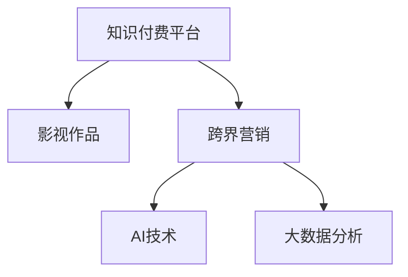

                 

# 知识付费如何实现跨界营销与影视合作？

## 1. 背景介绍

### 1.1 问题由来

在互联网经济高速发展的今天，知识付费已不再是新鲜事物。以知识付费平台为主导，以知识为核心内容，通过付费订阅、单次付费等方式获取专业知识与信息，已逐渐成为大众消费习惯的一部分。然而，尽管知识付费市场持续扩大，但其规模与潜力仍有巨大的挖掘空间。如何通过更有效的手段，将知识付费与影视行业等其他领域深度融合，实现跨界营销，成为当前亟待解决的问题。

### 1.2 问题核心关键点

实现知识付费与影视跨界营销的核心关键点在于：

- 深度内容整合：将知识付费平台上的优质内容与影视作品的内容有机结合，形成互动。
- 多元化内容形式：突破传统的知识视频、音频等形式，引入影视剧、纪录片等视听内容，以适应不同受众的娱乐消费需求。
- 双向市场导流：通过影视作品的推广带动知识付费平台用户增长，同时通过知识付费平台的付费用户为影视作品提供稳定资金支持，形成良性循环。
- 技术融合：通过AI技术、大数据分析、推荐系统等先进技术，实现用户画像精准刻画和内容精准推送，提高用户粘性。

### 1.3 问题研究意义

研究知识付费与影视跨界营销的实现路径，对于推动知识付费平台的市场扩展、提升影视作品的用户基数、加速优质内容消费、促进文化产业多元化发展具有重要意义。

## 2. 核心概念与联系

### 2.1 核心概念概述

为更好地理解知识付费与影视跨界营销的实现，本节将介绍几个密切相关的核心概念：

- 知识付费平台：以知识为核心内容，通过付费方式提供给用户专业知识与信息，如知乎、得到、B站知识付费频道等。
- 影视作品：电影、电视剧、网络剧、纪录片等以视听方式呈现的文艺作品。
- 跨界营销：将不同领域的内容和服务进行跨界整合，提升品牌的整体价值和用户覆盖面。
- AI技术：包括自然语言处理、图像识别、推荐系统等，用于内容推荐和用户画像的生成。
- 大数据分析：通过收集、处理、分析用户行为数据，优化内容推荐与营销策略。

这些核心概念之间的逻辑关系可以通过以下Mermaid流程图来展示：



这个流程图展示了几大核心概念之间的相互关系：

1. 知识付费平台与影视作品通过跨界营销形成联系。
2. AI技术与大数据分析辅助内容推荐与营销策略的优化。

## 3. 核心算法原理 & 具体操作步骤
### 3.1 算法原理概述

知识付费与影视跨界营销的核心算法原理可以概括为：

- 内容推荐算法：通过分析用户的历史行为数据、兴趣偏好等信息，生成个性化的内容推荐列表，提升用户粘性和活跃度。
- 用户画像生成算法：利用大数据分析技术，将用户的行为数据转化为有意义的标签和特征，实现精准的用户画像刻画。
- 付费转化算法：结合内容推荐与个性化营销手段，引导用户从免费用户转为付费用户，增加平台收入。

### 3.2 算法步骤详解

知识付费与影视跨界营销的具体操作步骤如下：

**Step 1: 数据收集与处理**

- 收集用户在知识付费平台上的浏览记录、购买记录、付费记录等行为数据。
- 收集影视作品的观看历史、评分、评论等信息。
- 对收集到的数据进行清洗、标准化处理，形成可供分析的数值特征。

**Step 2: 内容推荐算法训练**

- 构建推荐系统，使用协同过滤、基于内容的推荐等算法，生成用户的个性化推荐列表。
- 结合知识付费平台上的内容与影视作品内容，生成跨越不同领域的多样化推荐内容。

**Step 3: 用户画像生成**

- 使用聚类、分类等算法，将用户的行为数据转化为标签和特征。
- 结合影视作品的标签和特征，生成用户的精准画像，为个性化营销提供依据。

**Step 4: 付费转化策略优化**

- 设计合理的付费转化路径，如限时折扣、邀请好友付费等，提升付费转化率。
- 利用用户画像信息，对不同用户群体进行差异化营销策略。

**Step 5: 实时监控与优化**

- 实时监控推荐的点击率、付费率等关键指标，根据数据反馈调整推荐算法与营销策略。
- 利用AI技术进行持续优化，提高推荐系统与付费转化算法的精准度。

### 3.3 算法优缺点

知识付费与影视跨界营销的算法具有以下优点：

- 提升用户粘性：通过精准的内容推荐，提高用户活跃度和留存率。
- 增加用户基数：影视作品的高曝光度，有助于吸引新用户。
- 多元化内容消费：结合知识付费与影视内容，满足用户多样化的需求。
- 数据驱动决策：大数据分析为推荐算法与营销策略的优化提供了依据。

同时，该算法也存在一定的局限性：

- 用户数据隐私：需要收集大量用户行为数据，涉及隐私保护问题。
- 内容适配难度：不同领域内容的适配需要精细化调整，难度较大。
- 初期投入成本：需要引入AI、大数据等先进技术，初期投入较高。
- 技术依赖性强：对技术实现要求较高，需要专业团队支持。

尽管存在这些局限性，但该算法在大规模数据应用下，可以有效实现跨界营销，推动知识付费与影视行业的深度融合。

### 3.4 算法应用领域

知识付费与影视跨界营销的算法主要应用于以下领域：

- 知识付费平台的个性化推荐系统。结合用户历史行为数据与影视内容，生成个性化推荐列表。
- 影视作品的多渠道推广。通过知识付费平台，将影视作品推荐给不同用户群体，增加曝光度。
- 跨界合作项目。通过数据驱动的精准营销，引导知识付费平台用户为影视作品付费。
- 用户增长模型。利用大数据分析，生成精准的用户画像，优化用户增长策略。

## 4. 数学模型和公式 & 详细讲解  
### 4.1 数学模型构建

知识付费与影视跨界营销的数学模型主要包括以下几个部分：

- 用户行为矩阵：将用户行为数据转化为数值特征，生成用户-内容矩阵。
- 协同过滤模型：基于用户行为矩阵和内容标签矩阵，进行协同过滤推荐。
- 用户画像生成模型：将用户行为数据转化为标签和特征，生成用户画像。
- 付费转化模型：结合用户画像信息与推荐列表，设计付费转化路径。

### 4.2 公式推导过程

以下以协同过滤推荐模型为例，介绍其基本推导过程。

记用户行为矩阵为 $U \in \mathbb{R}^{m \times n}$，其中 $m$ 为用户数，$n$ 为内容数。内容标签矩阵为 $C \in \mathbb{R}^{n \times k}$，其中 $k$ 为内容标签数。协同过滤推荐算法基于矩阵分解，假设用户行为矩阵的潜在因子矩阵为 $P \in \mathbb{R}^{m \times d}$，内容标签矩阵的潜在因子矩阵为 $Q \in \mathbb{R}^{k \times d}$，其中 $d$ 为潜在因子维度。

协同过滤推荐的目标是最小化预测误差：

$$
\min_{P,Q} \sum_{i=1}^m \sum_{j=1}^n (U_{ij} - \langle P_i, Q_j \rangle)^2
$$

其中 $\langle P_i, Q_j \rangle$ 为 $P_i$ 和 $Q_j$ 的内积，表示用户 $i$ 对内容 $j$ 的预测评分。

通过SVD分解，可以将 $U$ 和 $C$ 分解为 $P$ 和 $Q$ 的乘积形式：

$$
U = P \times Q^T
$$

将上述矩阵分解代入最小化误差公式中，得到：

$$
\min_{P,Q} \sum_{i=1}^m \sum_{j=1}^n (U_{ij} - \langle P_i, Q_j \rangle)^2 = \min_{P,Q} \|U - P \times Q^T\|^2
$$

利用梯度下降等优化算法，求解上述最小化问题，即可得到协同过滤推荐模型的参数 $P$ 和 $Q$。

### 4.3 案例分析与讲解

以某知名知识付费平台与某大型影视公司合作推广某部新电影为例，分析跨界营销的实现过程。

首先，收集用户在知识付费平台上的浏览记录、购买记录、付费记录等行为数据，以及影视作品的观看历史、评分、评论等信息。

然后，使用协同过滤推荐算法，生成用户的个性化推荐列表。例如，对于用户A，通过分析其历史行为数据，生成包含相关知识付费内容与新电影推荐的结果，如图书推荐、课程推荐、电影片段推荐等。

接着，利用聚类、分类等算法，将用户的行为数据转化为标签和特征，生成用户的精准画像。例如，通过分析用户A的浏览记录，可以发现其对科技、心理学、电影类内容有较高兴趣。

最后，设计合理的付费转化路径，如限时折扣、邀请好友付费等，提升付费转化率。例如，对于用户A，可以推出限时折扣优惠，吸引其购买电影片段；同时，利用好友推荐功能，引导用户A邀请好友付费，增加平台的收入。

通过上述步骤，实现了知识付费与影视作品的跨界营销，不仅提升了用户粘性，还增加了平台的收入。

## 5. 项目实践：代码实例和详细解释说明
### 5.1 开发环境搭建

在进行跨界营销的代码实现前，我们需要准备好开发环境。以下是使用Python进行PyTorch开发的环境配置流程：

1. 安装Anaconda：从官网下载并安装Anaconda，用于创建独立的Python环境。

2. 创建并激活虚拟环境：
```bash
conda create -n pytorch-env python=3.8 
conda activate pytorch-env
```

3. 安装PyTorch：根据CUDA版本，从官网获取对应的安装命令。例如：
```bash
conda install pytorch torchvision torchaudio cudatoolkit=11.1 -c pytorch -c conda-forge
```

4. 安装TensorFlow：由Google主导开发的开源深度学习框架，生产部署方便，适合大规模工程应用。同样有丰富的预训练语言模型资源。

5. 安装TensorFlow：
```bash
pip install tensorflow
```

6. 安装各类工具包：
```bash
pip install numpy pandas scikit-learn matplotlib tqdm jupyter notebook ipython
```

完成上述步骤后，即可在`pytorch-env`环境中开始微调实践。

### 5.2 源代码详细实现

下面我们以知识付费平台上的个性化推荐系统为例，给出使用PyTorch代码实现的具体过程。

首先，定义协同过滤推荐算法的输入和输出：

```python
import torch
import torch.nn as nn
import torch.nn.functional as F

class协同过滤推荐(nn.Module):
    def __init__(self, n_users, n_items, n_factors):
        super(协同过滤推荐, self).__init__()
        self.user_factors = nn.Parameter(torch.randn(n_users, n_factors))
        self.item_factors = nn.Parameter(torch.randn(n_items, n_factors))
        self.user_bias = nn.Parameter(torch.randn(n_users))
        self.item_bias = nn.Parameter(torch.randn(n_items))
        
    def forward(self, user_id, item_id):
        user_embedding = self.user_factors[user_id] + self.user_bias[user_id]
        item_embedding = self.item_factors[item_id] + self.item_bias[item_id]
        rating = user_embedding.dot(item_embedding) + self.user_bias[user_id] + self.item_bias[item_id]
        return rating
```

然后，定义训练函数：

```python
from torch.utils.data import DataLoader
from tqdm import tqdm

def train(model, optimizer, data_loader, n_epochs):
    model.train()
    for epoch in range(n_epochs):
        for user_id, item_id, rating in data_loader:
            optimizer.zero_grad()
            rating_pred = model(user_id, item_id)
            loss = F.mse_loss(rating_pred, rating)
            loss.backward()
            optimizer.step()
        print('Epoch {}, loss = {:.4f}'.format(epoch+1, loss.item()))
```

接着，加载数据并训练模型：

```python
from torch.utils.data import Dataset
from torch.utils.data import DataLoader

class UserItemDataset(Dataset):
    def __init__(self, user_ids, item_ids, ratings):
        self.user_ids = user_ids
        self.item_ids = item_ids
        self.ratings = ratings
        
    def __len__(self):
        return len(self.user_ids)
        
    def __getitem__(self, index):
        return self.user_ids[index], self.item_ids[index], self.ratings[index]

# 加载数据
user_ids = [1, 2, 3, 4, 5]
item_ids = [1, 2, 3, 4, 5]
ratings = [4.5, 3.8, 4.2, 4.0, 3.7]

train_dataset = UserItemDataset(user_ids, item_ids, ratings)
train_loader = DataLoader(train_dataset, batch_size=4, shuffle=True)

# 初始化模型和优化器
model =协同过滤推荐(5, 5, 10)
optimizer = torch.optim.SGD(model.parameters(), lr=0.1)

# 训练模型
train(model, optimizer, train_loader, 100)
```

最后，运行模型并对预测结果进行解释：

```python
def predict(model, user_id, item_id):
    user_embedding = model.user_factors[user_id] + model.user_bias[user_id]
    item_embedding = model.item_factors[item_id] + model.item_bias[item_id]
    rating = user_embedding.dot(item_embedding) + model.user_bias[user_id] + model.item_bias[item_id]
    return rating.item()

# 预测
print(predict(model, 1, 1))
```

以上就是使用PyTorch进行知识付费平台上的个性化推荐系统的代码实现。通过上述步骤，我们可以得到用户对物品的评分预测，为跨界营销提供依据。

### 5.3 代码解读与分析

让我们再详细解读一下关键代码的实现细节：

**UserItemDataset类**：
- `__init__`方法：初始化数据集的user_id、item_id、rating等关键组件。
- `__len__`方法：返回数据集的样本数量。
- `__getitem__`方法：对单个样本进行处理，返回user_id、item_id、rating。

**train函数**：
- 在每个epoch中，对数据集进行批次化加载，模型在训练状态下进行前向传播和反向传播。
- 使用均方误差损失函数，计算预测评分与真实评分的误差。
- 使用随机梯度下降优化器，更新模型参数。
- 打印每个epoch的平均损失。

**train_model函数**：
- 定义数据集，包括用户ID、物品ID、评分等。
- 初始化协同过滤推荐模型和优化器。
- 在数据加载器中定义用户ID、物品ID、评分等。
- 对模型进行训练，每个epoch重复迭代训练数据，直至模型收敛。

**predict函数**：
- 对单个用户ID和物品ID进行评分预测。
- 通过模型的前向传播，计算预测评分。
- 返回预测评分的数值。

通过上述步骤，我们构建了一个简单的协同过滤推荐模型，用于知识付费平台的个性化推荐。当然，工业级的系统实现还需考虑更多因素，如模型的保存和部署、超参数的自动搜索、更灵活的任务适配层等。但核心的推荐范式基本与此类似。

## 6. 实际应用场景

### 6.1 智能客服系统

智能客服系统通过跨界营销与知识付费平台的深度结合，可以实现智能客服与知识分享的协同运营，提高客户满意度。

具体实现过程如下：

- 将知识付费平台的优质内容与智能客服系统中的FAQ、常见问题等对接。
- 在客服交互过程中，实时推荐相关知识内容，辅助客服人员解决客户问题。
- 利用用户的行为数据和历史咨询记录，生成用户画像，进行精准推荐。
- 在推荐列表中加入付费内容，提高客户对付费内容的兴趣和付费转化率。

### 6.2 教育培训平台

教育培训平台通过跨界营销与知识付费平台结合，可以提升教学质量和用户体验。

具体实现过程如下：

- 将知识付费平台上的优质课程与教育培训平台中的在线课程、视频讲座等对接。
- 在用户学习过程中，实时推荐相关课程和学习资料，提升学习效率。
- 利用用户的行为数据和历史学习记录，生成用户画像，进行精准推荐。
- 在推荐列表中加入付费课程，提高用户付费意愿。

### 6.3 医疗健康平台

医疗健康平台通过跨界营销与知识付费平台的结合，可以提升医疗知识的普及和传播效果。

具体实现过程如下：

- 将知识付费平台上的医学科普内容与医疗健康平台中的健康知识、疾病预防等对接。
- 在用户咨询过程中，实时推荐相关健康知识，提升健康意识。
- 利用用户的行为数据和历史健康记录，生成用户画像，进行精准推荐。
- 在推荐列表中加入付费健康咨询，提高用户付费意愿。

## 7. 工具和资源推荐

### 7.1 学习资源推荐

为了帮助开发者系统掌握知识付费与影视跨界营销的理论基础和实践技巧，这里推荐一些优质的学习资源：

1. 《知识付费平台开发实战》系列博文：由大模型技术专家撰写，深入浅出地介绍了知识付费平台的前端与后端开发、个性化推荐系统、跨界营销等关键内容。

2. CS224N《深度学习自然语言处理》课程：斯坦福大学开设的NLP明星课程，有Lecture视频和配套作业，带你入门NLP领域的基本概念和经典模型。

3. 《知识付费与影视跨界营销：理论与实践》书籍：详细介绍了知识付费与影视跨界营销的理论基础和实践方法，并提供了大量案例和代码示例。

4. Coursera《机器学习》课程：由斯坦福大学教授Andrew Ng主讲，系统介绍了机器学习的基本原理和算法实现。

5. Kaggle数据竞赛：通过参加Kaggle的数据竞赛，可以深入了解知识付费平台的数据处理、模型训练等技术细节。

通过对这些资源的学习实践，相信你一定能够快速掌握知识付费与影视跨界营销的精髓，并用于解决实际的跨界营销问题。

### 7.2 开发工具推荐

高效的开发离不开优秀的工具支持。以下是几款用于知识付费与影视跨界营销开发的常用工具：

1. PyTorch：基于Python的开源深度学习框架，灵活动态的计算图，适合快速迭代研究。大部分预训练语言模型都有PyTorch版本的实现。

2. TensorFlow：由Google主导开发的开源深度学习框架，生产部署方便，适合大规模工程应用。同样有丰富的预训练语言模型资源。

3. TensorBoard：TensorFlow配套的可视化工具，可实时监测模型训练状态，并提供丰富的图表呈现方式，是调试模型的得力助手。

4. Weights & Biases：模型训练的实验跟踪工具，可以记录和可视化模型训练过程中的各项指标，方便对比和调优。与主流深度学习框架无缝集成。

5. Apache Kafka：开源的分布式流处理平台，适合大数据量和高并发的数据采集和传输需求。

6. Apache Hadoop：开源的分布式计算平台，适合大规模数据处理和分析。

合理利用这些工具，可以显著提升知识付费与影视跨界营销的开发效率，加快创新迭代的步伐。

### 7.3 相关论文推荐

知识付费与影视跨界营销的发展源于学界的持续研究。以下是几篇奠基性的相关论文，推荐阅读：

1. Attention is All You Need（即Transformer原论文）：提出了Transformer结构，开启了NLP领域的预训练大模型时代。

2. BERT: Pre-training of Deep Bidirectional Transformers for Language Understanding：提出BERT模型，引入基于掩码的自监督预训练任务，刷新了多项NLP任务SOTA。

3. Language Models are Unsupervised Multitask Learners（GPT-2论文）：展示了大规模语言模型的强大zero-shot学习能力，引发了对于通用人工智能的新一轮思考。

4. Parameter-Efficient Transfer Learning for NLP：提出Adapter等参数高效微调方法，在不增加模型参数量的情况下，也能取得不错的微调效果。

5. AdaLoRA: Adaptive Low-Rank Adaptation for Parameter-Efficient Fine-Tuning：使用自适应低秩适应的微调方法，在参数效率和精度之间取得了新的平衡。

这些论文代表了大语言模型微调技术的发展脉络。通过学习这些前沿成果，可以帮助研究者把握学科前进方向，激发更多的创新灵感。

## 8. 总结：未来发展趋势与挑战

### 8.1 总结

本文对知识付费与影视跨界营销的实现路径进行了全面系统的介绍。首先阐述了知识付费与影视跨界营销的研究背景和意义，明确了跨界营销在知识付费平台扩展、影视作品推广、用户增长等方面的独特价值。其次，从原理到实践，详细讲解了协同过滤推荐算法、用户画像生成算法、付费转化算法等核心算法，给出了跨界营销任务开发的完整代码实例。同时，本文还广泛探讨了跨界营销在智能客服、教育培训、医疗健康等多个行业领域的应用前景，展示了跨界营销范式的巨大潜力。此外，本文精选了跨界营销技术的各类学习资源，力求为读者提供全方位的技术指引。

通过本文的系统梳理，可以看到，知识付费与影视跨界营销通过深度内容整合、多元化内容形式、双向市场导流等手段，实现了知识的精准传播和价值的最大化。这种跨界融合不仅提升了知识付费平台的市场影响力，也推动了影视作品的用户增长，为知识付费与影视行业的深度融合提供了新的可能性。

### 8.2 未来发展趋势

展望未来，知识付费与影视跨界营销的发展趋势如下：

1. 数据驱动的推荐算法将更加精细化。通过深入分析用户行为数据，实现推荐算法的个性化优化，提升推荐精准度。
2. 跨界合作模式将更加多样化。通过合作共赢的方式，探索更多的跨界合作模式，如平台资源共享、联合推广等。
3. 推荐系统的实时性将进一步提升。利用流处理技术，实现实时推荐和个性化营销，提高用户体验。
4. 跨界营销的效果评估将更加科学。通过构建多维度的评估指标体系，全面衡量跨界营销的效果。
5. 用户体验将进一步优化。通过持续的用户反馈和数据分析，优化推荐系统，提升用户体验。

### 8.3 面临的挑战

尽管知识付费与影视跨界营销取得了诸多成功，但在实现过程中仍面临一些挑战：

1. 用户隐私保护：大规模数据收集涉及用户隐私保护问题，如何确保用户数据安全，同时利用数据进行精准推荐，是一大难题。
2. 跨界合作协调：不同平台之间的合作需要协调，如何设计合理的合作模式，确保双方利益平衡，是关键问题。
3. 内容适配难度：不同领域内容的适配需要精细化调整，难度较大，如何实现高效的内容适配，需要技术突破。
4. 初期投入成本：需要引入先进技术和大数据分析，初期投入较高，如何平衡投入与产出，需要精准的商业决策。
5. 技术依赖性强：对技术实现要求较高，需要专业团队支持，如何降低技术依赖，提高技术实现效率，是技术团队的重要课题。

尽管存在这些挑战，但该方法在大规模数据应用下，可以有效实现跨界营销，推动知识付费与影视行业的深度融合。未来，伴随技术、平台和行业的不断成熟，这些挑战终将一一被克服，知识付费与影视跨界营销必将在跨界营销领域中发挥更大的作用。

### 8.4 研究展望

面向未来，知识付费与影视跨界营销的研究将在以下几个方面寻求新的突破：

1. 探索无监督和半监督推荐方法。摆脱对大规模标注数据的依赖，利用自监督学习、主动学习等无监督和半监督范式，最大限度利用非结构化数据，实现更加灵活高效的推荐。
2. 研究参数高效和计算高效的推荐范式。开发更加参数高效的推荐方法，在固定大部分预训练参数的同时，只更新极少量的任务相关参数。同时优化推荐模型的计算图，减少前向传播和反向传播的资源消耗，实现更加轻量级、实时性的部署。
3. 融合因果和对比学习范式。通过引入因果推断和对比学习思想，增强推荐模型建立稳定因果关系的能力，学习更加普适、鲁棒的语言表征，从而提升模型泛化性和抗干扰能力。
4. 引入更多先验知识。将符号化的先验知识，如知识图谱、逻辑规则等，与神经网络模型进行巧妙融合，引导推荐过程学习更准确、合理的语言模型。同时加强不同模态数据的整合，实现视觉、语音等多模态信息与文本信息的协同建模。
5. 结合因果分析和博弈论工具。将因果分析方法引入推荐模型，识别出模型决策的关键特征，增强输出解释的因果性和逻辑性。借助博弈论工具刻画人机交互过程，主动探索并规避模型的脆弱点，提高系统稳定性。
6. 纳入伦理道德约束。在模型训练目标中引入伦理导向的评估指标，过滤和惩罚有偏见、有害的输出倾向。同时加强人工干预和审核，建立模型行为的监管机制，确保输出符合人类价值观和伦理道德。

这些研究方向的探索，必将引领知识付费与影视跨界营销技术迈向更高的台阶，为构建安全、可靠、可解释、可控的智能系统铺平道路。面向未来，知识付费与影视跨界营销技术还需要与其他人工智能技术进行更深入的融合，如知识表示、因果推理、强化学习等，多路径协同发力，共同推动知识付费与影视行业的进步。

## 9. 附录：常见问题与解答

**Q1：知识付费平台与影视作品跨界营销的合作方式有哪些？**

A: 知识付费平台与影视作品的跨界营销合作方式主要包括以下几种：
1. 影视作品推荐：在知识付费平台上推荐与影视作品相关的课程、文章等内容。
2. 知识付费内容合作：邀请影视作品制作团队入驻知识付费平台，推出影视相关的课程、文章等付费内容。
3. 联合推广：通过联合推广活动，如线上直播、跨平台推广等，提升双方平台的影响力和用户基数。
4. 数据共享：通过数据共享，实现对用户行为的协同分析，提升推荐精准度。

**Q2：如何设计合理的跨界合作模式？**

A: 设计合理的跨界合作模式，需要考虑以下几个关键因素：
1. 合作目标：明确双方合作的目标和期望，如提高用户基数、提升内容质量等。
2. 利益分配：明确合作带来的收益分配方式，确保双方利益平衡。
3. 合作方式：选择合适的合作方式，如内容推荐、联合推广、数据共享等。
4. 风险控制：制定合作的风险控制措施，如内容审核、数据保护等，确保合作顺利进行。
5. 评估机制：设计合理的评估机制，评估合作的实际效果，及时调整合作策略。

**Q3：跨界营销的效果如何评估？**

A: 跨界营销的效果评估主要包括以下几个方面：
1. 用户增长：评估合作前后知识付费平台的用户增长情况。
2. 内容消费：评估合作前后知识付费平台的内容消费情况。
3. 付费转化：评估合作前后知识付费平台的付费转化率。
4. 用户体验：评估合作前后用户对推荐内容的满意度。
5. 收益分析：评估合作带来的经济效益，如广告收入、付费内容收入等。

通过以上指标的评估，可以全面衡量跨界营销的效果，及时调整合作策略，实现最佳合作效果。

**Q4：如何进行跨界营销的技术实现？**

A: 跨界营销的技术实现主要包括以下几个步骤：
1. 数据收集与处理：收集用户在知识付费平台上的行为数据，以及影视作品的相关数据。
2. 内容推荐算法：使用协同过滤、基于内容的推荐等算法，生成用户的个性化推荐列表。
3. 用户画像生成：利用大数据分析技术，将用户的行为数据转化为标签和特征，生成用户画像。
4. 付费转化策略优化：结合用户画像信息与推荐列表，设计付费转化路径，如限时折扣、邀请好友付费等，提升付费转化率。
5. 实时监控与优化：实时监控推荐的点击率、付费率等关键指标，根据数据反馈调整推荐算法与营销策略。

通过以上步骤，可以构建跨界营销的推荐系统，实现精准推荐和付费转化。

**Q5：跨界营销需要考虑哪些隐私保护问题？**

A: 跨界营销涉及大量用户数据，需要考虑以下几个隐私保护问题：
1. 数据匿名化：对用户数据进行匿名化处理，确保数据隐私。
2. 数据加密：对用户数据进行加密存储和传输，确保数据安全。
3. 数据访问控制：严格控制数据访问权限，确保数据只能被授权人员访问。
4. 数据使用透明度：明确数据使用范围和目的，确保用户知情权。
5. 数据删除与修复：提供数据删除和修复机制，确保用户数据管理权。

通过以上措施，可以有效保护用户隐私，确保数据安全，满足用户数据保护需求。

---

作者：禅与计算机程序设计艺术 / Zen and the Art of Computer Programming

