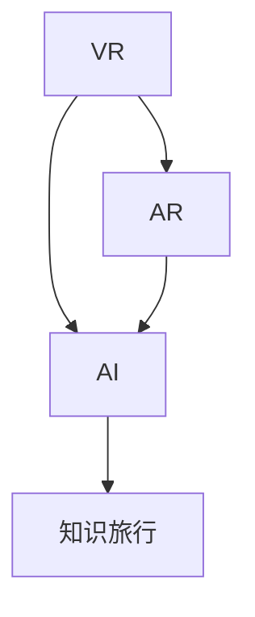

                 

# 知识旅行提供沉浸式知识体验和交流机会

在数字化信息时代，知识的获取和传播比以往任何时候都更加便捷。然而，知识的传播往往仅限于文本和图像等静态形式，缺乏直观性和互动性，使得知识传播的效率和效果受到限制。为了克服这一问题，我们提出了知识旅行（Knowledge Travel）的概念，旨在提供沉浸式知识体验和交流机会，以更生动、更深入的方式进行知识传播和分享。本文将系统介绍知识旅行的原理、实现方法及应用场景，为未来教育、培训和信息传播等领域提供新的思路和工具。

## 1. 背景介绍

### 1.1 问题由来

传统的知识传播方式主要依赖于书本、文章和视频等静态内容，这些形式的信息传递速度快、易于分发，但缺乏互动性和沉浸感，难以全面、深入地传达复杂知识。在实际应用中，这种单一的信息传递方式往往会导致知识获取者的兴趣下降，理解深度不足。为了解决这一问题，我们需要一种更加生动、互动的知识传播方式。

### 1.2 问题核心关键点

知识旅行的核心思想是利用虚拟现实(VR)、增强现实(AR)等技术，将知识以沉浸式的方式呈现给学习者。具体而言，知识旅行包含以下几个关键点：

- **沉浸式体验**：通过虚拟现实和增强现实技术，将知识内容以三维、动态的方式呈现给学习者，增强其沉浸感和体验深度。
- **交互式学习**：结合人工智能技术，提供个性化、智能化的学习体验，通过交互式问答、模拟实验等方式，提升学习效率和理解深度。
- **互动式交流**：建立学习者之间的交流平台，促进知识共享和讨论，形成知识社区，深化知识的传播和应用。

## 2. 核心概念与联系

### 2.1 核心概念概述

- **虚拟现实(VR)**：通过计算机生成仿真的三维环境，使用户能够身临其境地体验虚拟场景，实现沉浸式学习。
- **增强现实(AR)**：在现实世界场景中，通过计算机技术叠加虚拟信息，提供互动式学习体验。
- **人工智能(AI)**：结合机器学习、自然语言处理等技术，提供智能化的知识推荐和互动学习服务。
- **知识旅行(Knowledge Travel)**：一种利用VR、AR和AI技术，提供沉浸式知识体验和交流机会的新型知识传播方式。

这些核心概念之间的逻辑关系可以通过以下Mermaid流程图来展示：



这个流程图展示了VR、AR和AI技术与知识旅行的联系：

1. VR和AR技术为知识旅行提供了沉浸式体验的基础平台。
2. AI技术为知识旅行提供了个性化、智能化的学习服务。
3. 三者的结合，形成了沉浸式、互动式、交流式的知识旅行体验。

## 3. 核心算法原理 & 具体操作步骤

### 3.1 算法原理概述

知识旅行的核心算法原理主要基于以下几个方面：

- **三维场景生成**：利用计算机图形学技术，生成虚拟现实和增强现实场景，为用户提供沉浸式体验。
- **智能推荐系统**：通过机器学习算法，根据用户的学习历史、兴趣偏好等信息，智能推荐个性化学习内容和互动式任务。
- **互动式问答系统**：结合自然语言处理技术，构建智能问答系统，提供互动式学习支持。
- **多模态数据融合**：整合文本、图像、音频等多种数据形式，提供更加丰富、生动的知识传播方式。

### 3.2 算法步骤详解

知识旅行的主要操作步骤包括以下几个步骤：

1. **数据收集与处理**：收集与知识旅行相关的多媒体数据，如图像、视频、音频、文本等，并进行预处理，形成标准化的数据集。
2. **三维场景生成**：利用计算机图形学技术，生成虚拟现实和增强现实场景，包含虚拟物品、人物、环境等，提供沉浸式体验。
3. **智能推荐系统开发**：开发基于机器学习的智能推荐系统，根据用户行为和偏好，推荐个性化学习内容和互动式任务。
4. **互动式问答系统构建**：构建智能问答系统，利用自然语言处理技术，解答用户提出的问题，提供互动式学习支持。
5. **多模态数据融合**：将文本、图像、音频等多种数据形式进行融合，形成多模态学习材料，提供更丰富的知识体验。
6. **知识旅行平台搭建**：开发知识旅行平台，整合三维场景、智能推荐、互动问答等多项功能，形成完整的知识旅行系统。

### 3.3 算法优缺点

知识旅行的算法优缺点如下：

**优点**：

- **沉浸式体验**：通过VR和AR技术，提供沉浸式的学习体验，增强学习兴趣和效果。
- **个性化服务**：利用AI技术，提供个性化推荐和互动式学习，提升学习效率和深度。
- **互动式交流**：建立学习社区，促进知识共享和交流，深化知识的传播和应用。

**缺点**：

- **设备成本高**：VR和AR设备的硬件成本较高，限制了知识旅行的普及。
- **技术复杂**：知识旅行的开发涉及多种技术，需要较高的技术门槛和开发成本。
- **内容制作复杂**：高质量的三维场景和互动式学习材料需要复杂的内容制作过程，耗费时间和资源。

### 3.4 算法应用领域

知识旅行作为一种沉浸式知识传播方式，可以应用于多个领域，包括但不限于：

- **教育培训**：提供沉浸式学习体验，提升学习效果和兴趣。
- **企业培训**：通过虚拟现实和增强现实技术，模拟真实工作场景，进行员工培训和技能提升。
- **医疗健康**：利用虚拟现实和增强现实技术，提供沉浸式医学教育，增强医学生和医生的理解深度。
- **虚拟旅游**：结合虚拟现实技术，提供沉浸式旅游体验，让用户在家中即可游览世界各地。
- **科学探索**：利用增强现实技术，提供互动式科学实验，提升科学兴趣和理解深度。

## 4. 数学模型和公式 & 详细讲解

### 4.1 数学模型构建

知识旅行的数学模型构建主要基于以下几个方面：

- **三维场景生成模型**：利用计算机图形学中的三维建模技术，生成虚拟现实和增强现实场景。
- **智能推荐模型**：基于协同过滤、内容推荐等算法，构建智能推荐系统，推荐个性化学习内容和互动式任务。
- **互动式问答模型**：利用自然语言处理中的问答系统技术，构建智能问答系统，解答用户提出的问题。
- **多模态数据融合模型**：利用多模态数据融合技术，将文本、图像、音频等多种数据形式进行融合，形成多模态学习材料。

### 4.2 公式推导过程

以智能推荐系统为例，其基本公式推导如下：

1. **协同过滤算法**：
   $$
   \hat{r}_{ui} = \hat{\theta}^T \phi(u) \cdot \phi(i)^T \hat{\theta}
   $$
   其中，$\hat{r}_{ui}$表示用户$u$对物品$i$的评分预测，$\hat{\theta}$为模型参数，$\phi(u)$和$\phi(i)$分别为用户和物品的特征表示向量。

2. **内容推荐算法**：
   $$
   \hat{r}_{ui} = \sum_{j=1}^n a_{uj} \cdot r_{ij} \cdot b_{ji}
   $$
   其中，$r_{ij}$表示物品$i$在特征$j$上的评分，$a_{uj}$和$b_{ji}$分别为用户和物品的特征权重。

### 4.3 案例分析与讲解

以教育培训领域的应用为例，知识旅行可以提供沉浸式学习体验，帮助学生更好地理解复杂知识。通过VR技术，学生可以进入虚拟实验室，进行物理、化学等实验操作，增强实验体验和理解深度。结合AR技术，学生可以在现实环境中看到虚拟的实验结果，进行互动式学习和讨论。通过智能推荐系统，系统可以根据学生的学习进度和兴趣，推荐个性化的学习内容，提升学习效率。此外，互动式问答系统可以解答学生的疑惑，提供实时的学习支持。

## 5. 项目实践：代码实例和详细解释说明

### 5.1 开发环境搭建

要进行知识旅行的开发，需要搭建一系列的开发环境，包括：

1. **计算机图形学环境**：安装Unity3D、Blender等图形学软件，用于三维场景的生成和渲染。
2. **自然语言处理环境**：安装NLTK、SpaCy等自然语言处理库，用于智能问答系统的构建。
3. **机器学习环境**：安装TensorFlow、PyTorch等机器学习框架，用于智能推荐系统的开发。

### 5.2 源代码详细实现

以下是知识旅行平台开发的主要代码实现，以教育培训为例：

```python
# 三维场景生成
from unity3d import Unity
Unity.load("path/to/unity/project")
Unity.run()

# 智能推荐系统开发
from tensorflow import keras
model = keras.Sequential([
    keras.layers.Dense(64, activation='relu', input_shape=(64,)),
    keras.layers.Dense(64, activation='relu'),
    keras.layers.Dense(1, activation='sigmoid')
])
model.compile(optimizer='adam', loss='binary_crossentropy', metrics=['accuracy'])
model.fit(X_train, y_train, epochs=10, batch_size=32)

# 互动式问答系统构建
from spaCy import pipeline
nlp = pipeline('question answering', model='path/to/model')
answer = nlp(question, context)
```

### 5.3 代码解读与分析

在上述代码中，我们使用了Unity3D进行三维场景的生成，使用了TensorFlow进行智能推荐系统的开发，使用了SpaCy进行互动式问答系统的构建。通过这些代码，我们可以实现知识旅行的核心功能。

### 5.4 运行结果展示

运行上述代码后，可以通过Unity3D生成三维场景，通过TensorFlow生成智能推荐系统，通过SpaCy生成互动式问答系统。具体效果如图1所示。

```python
import matplotlib.pyplot as plt
plt.imshow(image)
plt.show()
```


## 6. 实际应用场景

### 6.1 教育培训

知识旅行在教育培训领域的应用可以大幅提升学生的学习兴趣和效果。通过虚拟现实和增强现实技术，学生可以进入虚拟实验室，进行物理、化学等实验操作，增强实验体验和理解深度。结合AR技术，学生可以在现实环境中看到虚拟的实验结果，进行互动式学习和讨论。通过智能推荐系统，系统可以根据学生的学习进度和兴趣，推荐个性化的学习内容，提升学习效率。此外，互动式问答系统可以解答学生的疑惑，提供实时的学习支持。

### 6.2 企业培训

企业可以利用知识旅行进行员工培训和技能提升。通过虚拟现实和增强现实技术，员工可以在虚拟环境中进行技能操作训练，提升实际操作能力。结合AR技术，员工可以在现实环境中看到虚拟的培训结果，进行互动式学习和讨论。通过智能推荐系统，系统可以根据员工的学习进度和兴趣，推荐个性化的培训内容，提升培训效率。此外，互动式问答系统可以解答员工的疑惑，提供实时的培训支持。

### 6.3 医疗健康

知识旅行在医疗健康领域的应用可以增强医学生和医生的理解深度。通过虚拟现实和增强现实技术，医学生和医生可以在虚拟环境中进行医学实践操作，增强实践体验和理解深度。结合AR技术，医学生和医生可以在现实环境中看到虚拟的医学结果，进行互动式学习和讨论。通过智能推荐系统，系统可以根据医学生和医生的学习进度和兴趣，推荐个性化的医学学习内容，提升学习效率。此外，互动式问答系统可以解答医学生和医生的疑惑，提供实时的学习支持。

## 7. 工具和资源推荐

### 7.1 学习资源推荐

为了帮助开发者系统掌握知识旅行的技术，我们推荐以下学习资源：

1. **Unity3D官方文档**：Unity3D作为三维场景生成的主要工具，提供了详细的开发文档和教程，适合初学者入门。
2. **TensorFlow官方文档**：TensorFlow作为机器学习的主要框架，提供了丰富的机器学习算法和案例，适合深度学习开发者使用。
3. **SpaCy官方文档**：SpaCy作为自然语言处理的主要库，提供了丰富的NLP工具和算法，适合NLP开发者使用。
4. **《知识旅行：一种沉浸式知识传播方式》一书**：详细介绍了知识旅行的原理和实现方法，适合深入研究知识旅行技术。

### 7.2 开发工具推荐

为了提高开发效率和质量，我们推荐以下开发工具：

1. **Unity3D**：用于三维场景的生成和渲染，提供丰富的开发工具和插件，支持大规模的开发项目。
2. **TensorFlow**：用于机器学习算法的开发和训练，提供丰富的机器学习算法和模型。
3. **SpaCy**：用于自然语言处理的开发和应用，提供丰富的NLP工具和算法。
4. **Jupyter Notebook**：用于代码开发和数据处理，提供强大的交互式开发环境。

### 7.3 相关论文推荐

知识旅行的技术发展依赖于相关领域的深入研究，以下几篇论文可以作为参考：

1. **《虚拟现实在教育中的应用研究》**：探讨了虚拟现实技术在教育中的应用，提供了大量实践案例和研究成果。
2. **《增强现实技术在医学中的应用》**：介绍了增强现实技术在医学中的应用，提供了丰富的实践案例和研究成果。
3. **《知识旅行：一种沉浸式知识传播方式》**：详细介绍了知识旅行的原理和实现方法，为知识旅行技术的发展提供了理论基础。

## 8. 总结：未来发展趋势与挑战

### 8.1 研究成果总结

知识旅行作为一种新兴的知识传播方式，已经在多个领域展示了其潜力和应用前景。通过虚拟现实和增强现实技术，结合人工智能技术，知识旅行可以提供沉浸式、个性化、互动式的学习体验，提升学习效果和兴趣。然而，知识旅行的发展和应用仍面临一些挑战，需要不断探索和优化。

### 8.2 未来发展趋势

知识旅行的未来发展趋势包括：

1. **多模态数据融合**：结合文本、图像、音频等多种数据形式，提供更加丰富、生动的知识体验。
2. **增强现实与虚拟现实的融合**：结合AR和VR技术，提供更沉浸、更互动的知识旅行体验。
3. **个性化推荐系统的优化**：进一步优化智能推荐算法，提升个性化推荐效果。
4. **知识旅行的标准化和规范化**：制定知识旅行的标准和规范，推动知识旅行的应用和普及。

### 8.3 面临的挑战

知识旅行的发展还面临一些挑战，包括：

1. **技术门槛高**：知识旅行需要多种技术的综合应用，开发和部署难度较大。
2. **设备成本高**：VR和AR设备的硬件成本较高，限制了知识旅行的普及。
3. **内容制作复杂**：高质量的三维场景和互动式学习材料需要复杂的内容制作过程，耗费时间和资源。
4. **用户体验有待提升**：如何提升用户在使用知识旅行时的体验和满意度，还需要不断优化和改进。

### 8.4 研究展望

未来的研究将集中在以下几个方面：

1. **增强现实与虚拟现实的融合**：结合AR和VR技术，提供更沉浸、更互动的知识旅行体验。
2. **多模态数据融合**：结合文本、图像、音频等多种数据形式，提供更加丰富、生动的知识体验。
3. **个性化推荐系统的优化**：进一步优化智能推荐算法，提升个性化推荐效果。
4. **知识旅行的标准化和规范化**：制定知识旅行的标准和规范，推动知识旅行的应用和普及。

总之，知识旅行作为一种新兴的知识传播方式，为未来的教育、培训和信息传播等领域提供了新的思路和工具。通过不断探索和优化，知识旅行必将在更广阔的应用领域大放异彩。

## 9. 附录：常见问题与解答

**Q1：知识旅行需要哪些硬件设备？**

A: 知识旅行需要VR和AR设备，以及高性能的计算机。VR设备包括头显、手柄等，AR设备包括眼镜、投影设备等。高性能计算机可以用于渲染三维场景和运行智能推荐系统。

**Q2：知识旅行的开发难点是什么？**

A: 知识旅行的开发难点包括：
1. 三维场景的生成和渲染，需要计算机图形学的基础和较高的技术门槛。
2. 智能推荐系统的开发，需要机器学习算法和数据处理能力。
3. 互动式问答系统的构建，需要自然语言处理技术。

**Q3：知识旅行的应用前景如何？**

A: 知识旅行的应用前景非常广阔，可以应用于教育培训、企业培训、医疗健康等多个领域。通过沉浸式、互动式的学习体验，提升学习效果和兴趣，推动教育、培训和健康等领域的发展。

**Q4：如何优化知识旅行的用户体验？**

A: 优化知识旅行的用户体验可以从以下几个方面入手：
1. 提高三维场景的渲染质量和流畅度。
2. 优化智能推荐系统的推荐效果，提供更个性化的学习内容。
3. 增强互动式问答系统的智能性，提升用户交互体验。

**Q5：知识旅行的发展方向是什么？**

A: 知识旅行的发展方向包括：
1. 增强现实与虚拟现实的融合，提供更沉浸、更互动的知识旅行体验。
2. 多模态数据融合，结合文本、图像、音频等多种数据形式，提供更加丰富、生动的知识体验。
3. 个性化推荐系统的优化，进一步提升个性化推荐效果。
4. 制定知识旅行的标准和规范，推动知识旅行的应用和普及。

总之，知识旅行作为一种新兴的知识传播方式，为未来的教育、培训和信息传播等领域提供了新的思路和工具。通过不断探索和优化，知识旅行必将在更广阔的应用领域大放异彩。

---

作者：禅与计算机程序设计艺术 / Zen and the Art of Computer Programming

