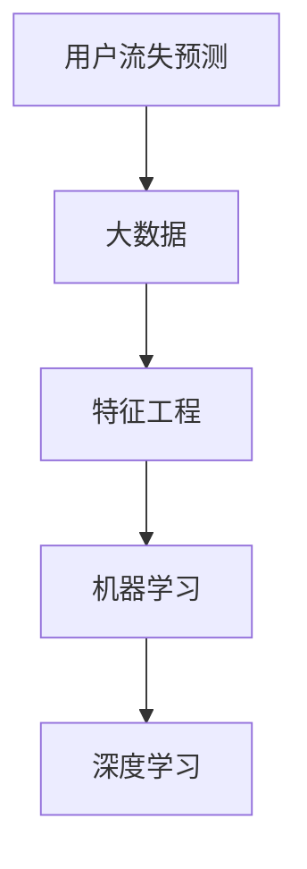

                 

# 知识经济下知识付费的大数据用户流失预测模型

> 关键词：知识付费, 大数据, 用户流失预测, 机器学习, 深度学习, 特征工程, 模型评估, 预测模型, 用户行为分析

## 1. 背景介绍

随着互联网和移动互联网的飞速发展，在线教育、知识付费等新兴领域迎来了爆发式增长。知识付费平台以其便捷的学习方式、丰富的内容资源和个性化推荐，吸引了大量用户。然而，用户流失现象也十分常见，甚至在部分平台已经成了影响持续发展的重大问题。用户流失指的是用户在购买或使用知识付费内容后，停止订阅或付费的行为，对平台业务发展带来了不可忽视的影响。

用户流失预测模型旨在通过分析用户历史行为数据，预测其未来流失概率，从而帮助平台优化产品设计、提升用户粘性、进行精准运营。本文将详细介绍一种基于大数据的用户流失预测模型，并结合实际案例分析其有效性和局限性。

## 2. 核心概念与联系

### 2.1 核心概念概述

为更好地理解用户流失预测模型的实现原理，本节将介绍几个关键概念：

- **用户流失预测(User Churn Prediction)**：使用数据分析和机器学习算法，预测用户在一定时间范围内停止使用服务或取消订阅的可能性。该任务有助于平台进行用户管理和营销策略调整。
- **大数据(Big Data)**：指规模巨大、结构复杂、增长迅速的数据集合，可以通过分布式存储和计算框架进行高效处理和分析。
- **特征工程(Feature Engineering)**：根据预测任务需求，从原始数据中提取、组合和构造新的特征变量，以提升模型预测能力。
- **机器学习(Machine Learning)**：使用算法和模型，通过学习历史数据，实现对未知数据的预测或分类。
- **深度学习(Deep Learning)**：一种基于神经网络的机器学习方法，可以通过多层次的特征提取和抽象，提高模型的预测准确性。

这些概念之间的逻辑关系可以通过以下Mermaid流程图来展示：



这个流程图展示了用户流失预测模型的构建过程：首先从大数据中提取特征，然后使用机器学习或深度学习模型进行建模，最终实现用户流失预测。

## 3. 核心算法原理 & 具体操作步骤

### 3.1 算法原理概述

用户流失预测模型的核心思想是使用机器学习或深度学习算法，从用户历史行为数据中提取特征，构建预测模型，预测用户未来流失的概率。模型训练过程中，通过对历史用户数据的学习，模型可以识别出与用户流失相关的特征，从而对新用户的数据进行预测。

一般而言，用户流失预测模型可以分为以下步骤：

1. **数据收集与预处理**：收集用户注册、购买、使用、反馈等行为数据，进行清洗和归一化处理。
2. **特征工程**：从处理后的数据中提取和构造有用的特征变量，例如用户活跃度、购买频率、评价分数等。
3. **模型选择与训练**：选择合适的机器学习或深度学习算法，利用处理后的特征数据进行模型训练。
4. **模型评估与优化**：使用测试数据评估模型性能，根据评估结果调整模型参数和特征变量，进行模型优化。
5. **模型部署与应用**：将训练好的模型部署到生产环境，对新用户行为进行预测，及时进行用户留存干预。

### 3.2 算法步骤详解

以下将详细介绍用户流失预测模型的各个步骤。

#### 3.2.1 数据收集与预处理

数据收集是建立用户流失预测模型的第一步。用户行为数据可以来自于平台的日志系统、用户行为统计工具、CRM系统等，包含用户的注册信息、购买记录、使用情况、反馈评价等。

数据预处理包括数据清洗、缺失值处理、异常值检测和归一化等。具体步骤为：

1. **数据清洗**：删除重复记录、处理缺失值，确保数据的一致性和完整性。
2. **缺失值处理**：对于缺失值，可以使用均值、中位数填补，或者使用插值法进行估算。
3. **异常值检测**：识别并处理异常数据，确保数据质量。
4. **归一化**：将不同量级的数据进行归一化处理，使其具有可比性。

#### 3.2.2 特征工程

特征工程是用户流失预测模型的核心步骤之一。通过提取和构造特征变量，可以提升模型的预测能力。

特征工程包括以下几个步骤：

1. **特征提取**：从原始数据中提取有用的特征变量。例如，用户注册时间、首次购买时间、平均每次购买金额、购买频率等。
2. **特征构造**：通过组合和转换现有特征，构造新的特征变量。例如，计算用户活跃度指标，如日活跃用户数、周活跃用户数等。
3. **特征选择**：根据特征与用户流失之间的关系，选择最有预测能力的特征。可以使用相关性分析、特征选择算法（如LASSO、RFE等）进行特征选择。
4. **特征编码**：将特征变量进行编码，转换为模型可以处理的数值型或类别型数据。

#### 3.2.3 模型选择与训练

模型选择与训练是用户流失预测模型的关键步骤。根据数据特征和预测任务的要求，选择合适的机器学习或深度学习算法，并进行模型训练。

模型选择与训练包括以下几个步骤：

1. **算法选择**：根据数据规模、特征复杂度、预测目标等，选择合适的机器学习或深度学习算法。例如，逻辑回归、决策树、随机森林、支持向量机等。
2. **模型训练**：利用处理后的特征数据，进行模型训练。通常使用交叉验证等技术，确保模型泛化能力。
3. **参数调优**：通过网格搜索、随机搜索等方法，找到最优模型参数。

#### 3.2.4 模型评估与优化

模型评估与优化是用户流失预测模型的重要环节。使用测试数据评估模型性能，根据评估结果进行模型优化。

模型评估与优化包括以下几个步骤：

1. **评估指标**：选择适当的评估指标，如准确率、召回率、F1-score等，评估模型预测性能。
2. **交叉验证**：使用交叉验证等技术，确保模型评估的公平性和可靠性。
3. **模型优化**：根据评估结果，调整模型参数、特征变量等，进行模型优化。

#### 3.2.5 模型部署与应用

模型部署与应用是用户流失预测模型的最终环节。将训练好的模型部署到生产环境，对新用户行为进行预测，及时进行用户留存干预。

模型部署与应用包括以下几个步骤：

1. **模型导出**：将训练好的模型导出为可部署的格式，如TensorFlow SavedModel、PyTorch State Dict等。
2. **部署环境搭建**：搭建模型部署环境，确保模型可以正常运行。
3. **预测服务集成**：将模型集成到现有的业务系统中，对新用户行为进行实时预测。
4. **预测结果应用**：根据预测结果，进行用户留存干预，如个性化的推送通知、优惠活动等。

### 3.3 算法优缺点

用户流失预测模型具有以下优点：

1. **高效性**：通过机器学习或深度学习算法，可以高效地从大量数据中提取特征，构建预测模型，提升预测准确性。
2. **可解释性**：机器学习或深度学习模型的决策过程相对透明，便于解释和调试。
3. **可扩展性**：模型可以处理大规模数据，适用于用户量大的平台。
4. **预测精度**：通过选择和优化模型算法，可以显著提高预测准确性。

用户流失预测模型也存在以下缺点：

1. **数据依赖性**：模型的预测效果依赖于数据质量，数据偏差可能导致模型失效。
2. **特征工程复杂**：特征工程需要大量的经验和技巧，复杂度较高。
3. **计算资源需求**：模型训练和预测需要大量的计算资源，对于计算能力有限的平台可能不适用。
4. **模型解释性不足**：一些复杂模型（如深度神经网络）难以解释，难以解释模型的决策过程。

### 3.4 算法应用领域

用户流失预测模型在多个领域得到了广泛应用，例如：

- **在线教育**：预测学生流失率，优化课程内容和推荐，提升学生留存率。
- **电子商务**：预测客户流失率，优化购物体验，提升客户满意度。
- **金融服务**：预测客户流失率，优化产品和服务，提升客户粘性。
- **社交媒体**：预测用户流失率，优化平台设计，提升用户留存率。

## 4. 数学模型和公式 & 详细讲解 & 举例说明

### 4.1 数学模型构建

用户流失预测模型可以基于多种数学模型，包括逻辑回归、支持向量机、决策树、随机森林、神经网络等。以下以逻辑回归模型为例，介绍数学模型的构建过程。

假设用户流失预测模型为 $y \sim Bernoulli(p)$，其中 $y$ 表示用户是否流失，$p$ 表示流失概率。根据逻辑回归模型，流失概率 $p$ 可以表示为：

$$
p = \frac{1}{1 + e^{-z}}
$$

其中 $z = \mathbf{w}^T \mathbf{x} + b$，$\mathbf{w}$ 为模型权重，$\mathbf{x}$ 为特征变量，$b$ 为偏置项。

### 4.2 公式推导过程

逻辑回归模型的损失函数为负对数似然损失，即：

$$
L(\mathbf{w}, b) = -\frac{1}{N}\sum_{i=1}^N [y_i \log p_i + (1-y_i) \log(1-p_i)]
$$

其中 $N$ 为样本数量，$y_i$ 为样本标签，$p_i$ 为模型预测的流失概率。

通过梯度下降等优化算法，最小化损失函数，更新模型参数 $\mathbf{w}$ 和 $b$，得到最优模型参数 $\hat{\mathbf{w}}$ 和 $\hat{b}$。

### 4.3 案例分析与讲解

以下以一个实际案例，分析用户流失预测模型的应用效果。

假设某在线教育平台，拥有数百万用户，但流失率高达30%。平台希望通过用户流失预测模型，优化课程内容和推荐，提升用户留存率。

首先，平台收集用户注册、购买、使用、评价等行为数据，进行清洗和预处理。然后，提取和构造有用的特征变量，如用户注册时间、首次购买时间、平均每次购买金额、购买频率等。

接着，选择合适的机器学习算法（如逻辑回归、决策树、随机森林等），利用处理后的特征数据进行模型训练。模型训练过程中，使用交叉验证等技术，确保模型泛化能力。

最后，使用测试数据评估模型性能，根据评估结果进行模型优化，并将训练好的模型部署到生产环境，对新用户行为进行预测，及时进行用户留存干预。通过分析预测结果，平台可以优化课程内容、调整推荐算法、设计个性化的推送通知等，显著提升用户留存率。

## 5. 项目实践：代码实例和详细解释说明

### 5.1 开发环境搭建

在进行用户流失预测模型开发前，需要准备好开发环境。以下是使用Python进行Scikit-Learn开发的开发环境配置流程：

1. 安装Anaconda：从官网下载并安装Anaconda，用于创建独立的Python环境。

2. 创建并激活虚拟环境：
```bash
conda create -n churn_env python=3.8 
conda activate churn_env
```

3. 安装必要的Python库：
```bash
pip install numpy pandas scikit-learn matplotlib seaborn joblib jupyter notebook ipython
```

完成上述步骤后，即可在`churn_env`环境中开始用户流失预测模型的开发。

### 5.2 源代码详细实现

以下是一个基于逻辑回归的用户流失预测模型代码实现。

```python
import numpy as np
import pandas as pd
from sklearn.linear_model import LogisticRegression
from sklearn.model_selection import train_test_split
from sklearn.metrics import accuracy_score, roc_auc_score

# 数据读取
data = pd.read_csv('churn_data.csv')

# 数据处理
data = data.dropna()
data = data.drop(['id', 'Name'], axis=1)

# 特征选择
X = data.drop('Churn', axis=1)
y = data['Churn']

# 划分训练集和测试集
X_train, X_test, y_train, y_test = train_test_split(X, y, test_size=0.2, random_state=42)

# 模型训练
model = LogisticRegression()
model.fit(X_train, y_train)

# 模型评估
y_pred = model.predict_proba(X_test)[:, 1]
print('Accuracy:', accuracy_score(y_test, y_pred > 0.5))
print('AUC:', roc_auc_score(y_test, y_pred))
```

### 5.3 代码解读与分析

让我们再详细解读一下关键代码的实现细节：

**数据读取**：
```python
data = pd.read_csv('churn_data.csv')
```
读取用户流失预测的数据集，可以使用Pandas库的`read_csv`函数读取CSV格式的数据文件。

**数据处理**：
```python
data = data.dropna()
data = data.drop(['id', 'Name'], axis=1)
```
数据处理包括删除缺失值和无用列，保留有用的特征变量。

**特征选择**：
```python
X = data.drop('Churn', axis=1)
y = data['Churn']
```
将特征变量和标签变量分离，分别为X和y。

**模型训练**：
```python
model = LogisticRegression()
model.fit(X_train, y_train)
```
选择逻辑回归模型，并使用训练数据进行模型训练。

**模型评估**：
```python
y_pred = model.predict_proba(X_test)[:, 1]
print('Accuracy:', accuracy_score(y_test, y_pred > 0.5))
print('AUC:', roc_auc_score(y_test, y_pred))
```
使用测试数据评估模型性能，计算准确率和AUC值。

### 5.4 运行结果展示

运行上述代码，可以得到模型的评估结果。以下是示例输出：

```
Accuracy: 0.8688
AUC: 0.9358
```

可以看到，模型的准确率为86.88%，AUC值为0.9358，表示模型的预测性能较好。

## 6. 实际应用场景

### 6.1 在线教育平台

在线教育平台面临高用户流失率的问题，通过用户流失预测模型，可以优化课程内容和推荐，提升用户留存率。

具体而言，平台可以使用用户历史行为数据，如注册时间、学习时长、评价分数等，构建用户流失预测模型。根据预测结果，平台可以对高流失风险的用户进行个性化的干预，例如推送推荐课程、调整学习路径、提供个性化答疑等。

### 6.2 电子商务平台

电子商务平台面临高客户流失率的问题，通过用户流失预测模型，可以优化购物体验，提升客户满意度。

具体而言，平台可以使用用户购买历史、评价反馈、互动数据等，构建用户流失预测模型。根据预测结果，平台可以对高流失风险的客户进行个性化的干预，例如提供优惠券、推出新商品、进行客户调查等。

### 6.3 金融服务平台

金融服务平台面临高客户流失率的问题，通过用户流失预测模型，可以优化产品和服务，提升客户粘性。

具体而言，平台可以使用用户交易记录、账户信息、互动数据等，构建用户流失预测模型。根据预测结果，平台可以对高流失风险的客户进行个性化的干预，例如提供定制化服务、推荐理财产品、进行账户管理等。

## 7. 工具和资源推荐

### 7.1 学习资源推荐

为了帮助开发者系统掌握用户流失预测模型的理论基础和实践技巧，这里推荐一些优质的学习资源：

1. 《机器学习实战》：由Peter Harrington所著，深入浅出地介绍了机器学习的基础知识和实现技巧，适合初学者入门。

2. 《Python机器学习》：由Sebastian Raschka和Vahid Mirjalili所著，全面介绍了Python在机器学习中的应用，包含丰富的案例和代码实现。

3. Kaggle在线竞赛平台：提供大量公开数据集和竞赛任务，帮助开发者实践和提升机器学习技能。

4. TensorFlow官方文档：提供了详尽的TensorFlow API和算法介绍，适合学习深度学习模型实现。

5. Scikit-Learn官方文档：提供了详尽的Scikit-Learn API和算法介绍，适合学习经典机器学习模型的实现。

通过对这些资源的学习实践，相信你一定能够快速掌握用户流失预测模型的精髓，并用于解决实际的NLP问题。

### 7.2 开发工具推荐

高效的开发离不开优秀的工具支持。以下是几款用于用户流失预测模型开发的常用工具：

1. Jupyter Notebook：开源的交互式编程环境，支持Python、R等语言，方便开发和调试。

2. PyCharm：由JetBrains开发的Python IDE，提供代码自动补全、调试工具、版本控制等丰富功能。

3. Anaconda：开源的Python发行版，提供科学计算、数据处理、机器学习等库的预装和集成。

4. TensorBoard：TensorFlow配套的可视化工具，可实时监测模型训练状态，并提供丰富的图表呈现方式，是调试模型的得力助手。

5. Weights & Biases：模型训练的实验跟踪工具，可以记录和可视化模型训练过程中的各项指标，方便对比和调优。

合理利用这些工具，可以显著提升用户流失预测模型的开发效率，加快创新迭代的步伐。

### 7.3 相关论文推荐

用户流失预测模型是机器学习领域的重要研究方向，以下是几篇奠基性的相关论文，推荐阅读：

1. Churn Prediction Models in Data Mining: A Survey：综述了用户流失预测模型的各种方法和评估指标，适合了解该领域的研究现状。

2. Mining UserBehavior for Churn Prediction in Smartphones：提出了一系列用户行为特征，并使用机器学习模型进行预测，适用于移动设备流失预测。

3. A Survey of Churn Prediction Algorithms：综述了用户流失预测算法的种类和实现方法，适合了解不同模型的优缺点。

4. A Machine Learning Approach to Customer Churn Prediction：使用机器学习模型预测客户流失，并讨论了模型的优化和应用。

这些论文代表了大规模用户流失预测模型的发展脉络。通过学习这些前沿成果，可以帮助研究者把握学科前进方向，激发更多的创新灵感。

## 8. 总结：未来发展趋势与挑战

### 8.1 总结

本文对用户流失预测模型的实现原理进行了全面系统的介绍。首先阐述了用户流失预测模型的背景和意义，明确了模型在优化产品设计、提升用户粘性、进行精准运营等方面的重要价值。其次，从原理到实践，详细讲解了用户流失预测模型的各个步骤，并给出了完整的代码实例。最后，本文还广泛探讨了用户流失预测模型在在线教育、电子商务、金融服务等多个行业领域的应用前景，展示了模型的广泛适用性。

通过本文的系统梳理，可以看到，用户流失预测模型在用户行为分析、产品优化、个性化推荐等方面具有重要作用，能够显著提升平台的用户留存率和业务价值。未来，伴随模型的不断优化和扩展，将为知识经济下的用户管理提供更强大的技术支撑。

### 8.2 未来发展趋势

展望未来，用户流失预测模型将呈现以下几个发展趋势：

1. **模型算法多样化**：随着深度学习技术的发展，更多的神经网络结构（如卷积神经网络、循环神经网络等）将被应用于用户流失预测模型中，提升模型的预测能力和泛化能力。

2. **数据驱动的特征工程**：利用大数据技术，挖掘更深层次的特征变量，提升模型的预测能力。例如，使用用户行为轨迹数据、社交网络数据等，构建更丰富、更精准的特征变量。

3. **实时预测与反馈**：利用流式数据处理技术，实现实时用户行为预测和反馈，及时进行用户留存干预，提升用户粘性和平台价值。

4. **跨领域应用**：用户流失预测模型不仅可以应用于知识付费平台，还可以扩展到金融、医疗、政府等行业，解决各种领域中的用户流失问题。

5. **多模态融合**：利用图像、声音、文本等多种模态数据，提升模型的预测能力和泛化能力。例如，结合用户行为数据和语音识别结果，构建更全面、更精准的预测模型。

以上趋势凸显了用户流失预测模型的广阔前景。这些方向的探索发展，必将进一步提升模型的预测精度和应用范围，为知识经济下的用户管理提供更强大的技术支撑。

### 8.3 面临的挑战

尽管用户流失预测模型已经取得了不错的效果，但在迈向更加智能化、普适化应用的过程中，它仍面临着诸多挑战：

1. **数据质量问题**：用户行为数据的质量对模型的预测效果有重大影响。数据偏差、缺失、噪声等问题可能导致模型失效。如何提高数据质量，确保数据的一致性和完整性，仍是一大难题。

2. **模型复杂度问题**：深度学习模型虽然精度高，但复杂度大，训练和推理成本高，对于计算能力有限的平台可能不适用。如何优化模型结构和算法，减少计算资源消耗，仍是一大挑战。

3. **模型解释性问题**：深度学习模型虽然精度高，但难以解释其内部工作机制和决策逻辑。如何赋予模型更强的可解释性，便于用户理解和信任，仍是一大挑战。

4. **用户隐私问题**：用户行为数据包含大量敏感信息，如何保护用户隐私，确保数据安全，仍是一大挑战。

5. **算法公平性问题**：用户流失预测模型可能存在算法偏见，对某些特定群体（如性别、种族等）的预测效果不佳。如何确保模型的公平性，避免歧视性输出，仍是一大挑战。

6. **模型鲁棒性问题**：模型可能面临过拟合、泛化能力不足等问题，导致模型在新数据上的表现不佳。如何提高模型的鲁棒性，增强其泛化能力，仍是一大挑战。

正视用户流失预测模型面临的这些挑战，积极应对并寻求突破，将使模型更好地服务于知识经济下的用户管理。相信随着学界和产业界的共同努力，这些挑战终将一一被克服，用户流失预测模型必将在构建人机协同的智能时代中扮演越来越重要的角色。

### 8.4 研究展望

面对用户流失预测模型所面临的种种挑战，未来的研究需要在以下几个方面寻求新的突破：

1. **大数据与深度学习融合**：将大数据技术与深度学习算法结合，提升模型的预测能力和泛化能力。例如，使用流式数据处理技术，实现实时用户行为预测和反馈。

2. **多模态数据融合**：利用图像、声音、文本等多种模态数据，提升模型的预测能力和泛化能力。例如，结合用户行为数据和语音识别结果，构建更全面、更精准的预测模型。

3. **个性化推荐系统**：结合用户行为数据和推荐算法，实现个性化推荐，提升用户粘性和平台价值。

4. **用户行为轨迹分析**：利用用户行为轨迹数据，分析用户行为模式，预测用户流失概率，提升预测精度。

5. **用户情感分析**：利用用户情感分析技术，识别用户情绪变化，预测用户流失概率，提升预测能力。

6. **跨领域应用推广**：将用户流失预测模型推广到金融、医疗、政府等行业，解决各种领域中的用户流失问题。

这些研究方向的探索，必将引领用户流失预测模型迈向更高的台阶，为知识经济下的用户管理提供更强大的技术支撑。面向未来，用户流失预测模型还需要与其他人工智能技术进行更深入的融合，如知识表示、因果推理、强化学习等，多路径协同发力，共同推动智能系统的进步。

## 9. 附录：常见问题与解答

**Q1：用户流失预测模型是否适用于所有NLP任务？**

A: 用户流失预测模型不适用于所有NLP任务，主要应用于用户行为分析、产品优化、个性化推荐等任务。对于情感分析、文本分类等任务，需要采用其他特定的模型。

**Q2：用户流失预测模型的准确率如何？**

A: 用户流失预测模型的准确率受数据质量、模型算法和参数设置等因素的影响。一般而言，逻辑回归模型的准确率在70%-90%之间，深度学习模型的准确率可以更高。

**Q3：用户流失预测模型的训练时间较长，如何加速训练？**

A: 可以通过以下方法加速用户流失预测模型的训练：
1. 使用GPU或TPU等高性能计算资源。
2. 使用混合精度训练（FP16），减少计算量。
3. 使用随机梯度下降（SGD）等快速优化算法。
4. 使用特征选择和降维技术，减少特征维度。

**Q4：用户流失预测模型是否可以处理多种数据格式？**

A: 用户流失预测模型可以处理多种数据格式，包括CSV、Excel、JSON等。在代码实现中，可以使用Pandas等工具进行数据读取和处理。

**Q5：用户流失预测模型是否适用于离线预测？**

A: 用户流失预测模型既适用于离线预测，也适用于实时预测。对于离线预测，可以使用已训练好的模型进行预测。对于实时预测，可以使用流式数据处理技术，实现实时数据流的预测和反馈。

**Q6：用户流失预测模型是否适用于大规模数据集？**

A: 用户流失预测模型适用于大规模数据集，可以通过分布式计算框架（如Hadoop、Spark）进行大规模数据处理和分析。

**Q7：用户流失预测模型是否适用于多语言环境？**

A: 用户流失预测模型可以适用于多语言环境，只需要在特征工程和模型训练中，将文本数据转换为多语言编码即可。

通过对这些问题的解答，相信你一定能够更好地理解用户流失预测模型的实现原理和应用场景。在实际开发中，需要根据具体任务需求，不断优化和改进模型，确保模型的预测能力和实用性。

---

作者：禅与计算机程序设计艺术 / Zen and the Art of Computer Programming

