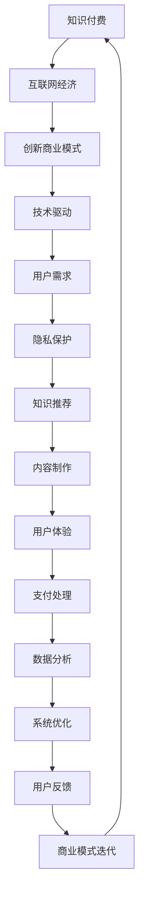

                 

# 知识经济时代下的知识付费创新商业模式运营

> 关键词：知识付费、互联网经济、创新商业模式、技术驱动、用户需求、隐私保护

## 1. 背景介绍

### 1.1 问题由来

随着互联网的快速发展，信息爆炸和知识碎片化成为了普遍现象。知识的获取变得更为便捷，但同时也造成了信息过载和注意力分散。在这样的背景下，传统的知识传播方式面临严峻挑战，而知识付费则成为了一种有效的解决方案，将知识从免费到付费的模式转变，有助于提升知识传播的质量和深度。

### 1.2 问题核心关键点

1. **知识付费模式**：通过付费获取高质量的、经过深度加工的知识点，提升知识获取的效率和深度。
2. **创新商业模式**：结合互联网经济的特点，创新出多样化的知识付费产品，满足不同用户的需求。
3. **技术驱动**：利用大数据、人工智能等技术手段，提升知识推荐、内容制作、用户体验等方面的效率和精准度。
4. **用户需求**：分析用户在不同场景下的需求，设计针对性的知识付费产品。
5. **隐私保护**：在知识付费过程中，重视用户隐私保护，避免信息泄露。

## 2. 核心概念与联系

### 2.1 核心概念概述

- **知识付费**：用户通过付费获取高质量的、经过深度加工的知识点，提升知识获取的效率和深度。
- **互联网经济**：利用互联网平台，实现信息的快速传播和知识的有效交换，形成基于网络的商业模式。
- **创新商业模式**：结合互联网经济的特点，创新出多样化的知识付费产品，满足不同用户的需求。
- **技术驱动**：利用大数据、人工智能等技术手段，提升知识推荐、内容制作、用户体验等方面的效率和精准度。
- **用户需求**：分析用户在不同场景下的需求，设计针对性的知识付费产品。
- **隐私保护**：在知识付费过程中，重视用户隐私保护，避免信息泄露。

### 2.2 核心概念原理和架构的 Mermaid 流程图(Mermaid 流程节点中不要有括号、逗号等特殊字符)


这个流程图展示了知识付费在互联网经济背景下的运营架构，涉及了从知识推荐、内容制作到用户反馈和商业模式迭代的各个环节。

## 3. 核心算法原理 & 具体操作步骤
### 3.1 算法原理概述

知识付费的运营主要依赖于以下几个算法原理：

1. **推荐算法**：利用大数据和机器学习技术，根据用户的历史行为和兴趣，推荐个性化的知识内容。
2. **内容生成算法**：利用自然语言处理和深度学习技术，生成高质量的知识内容，包括文章、视频、音频等。
3. **支付算法**：利用安全支付技术，确保用户的支付信息安全，同时提供便捷的支付方式。
4. **数据分析算法**：利用数据挖掘和统计分析技术，分析用户行为和反馈，优化知识推荐和商业模式。
5. **系统优化算法**：利用算法优化技术，提升系统的响应速度和稳定性，保障知识付费平台的正常运营。

### 3.2 算法步骤详解

#### 3.2.1 知识推荐算法

1. **数据收集**：收集用户的历史行为数据，包括浏览、点击、收藏、评论等。
2. **特征提取**：提取用户行为特征，包括兴趣、偏好、时间等。
3. **模型训练**：利用协同过滤、矩阵分解等算法，训练推荐模型。
4. **推荐生成**：根据用户特征，生成个性化的知识推荐列表。
5. **效果评估**：通过A/B测试等方法，评估推荐算法的效果，并进行优化。

#### 3.2.2 内容生成算法

1. **数据收集**：收集专家知识库、论文、书籍等高质量的知识源。
2. **数据预处理**：清洗和标准化知识数据，提取关键信息。
3. **模型训练**：利用生成对抗网络、自然语言生成等技术，训练内容生成模型。
4. **内容生成**：根据用户需求和兴趣，生成个性化的知识内容。
5. **效果评估**：通过人工评估和用户反馈，评估内容生成的质量，并进行优化。

#### 3.2.3 支付算法

1. **支付接口集成**：与第三方支付平台进行接口集成，提供支付功能。
2. **支付信息安全**：采用加密技术，保护用户的支付信息，防止信息泄露。
3. **支付方式多样**：支持多种支付方式，包括信用卡、支付宝、微信支付等。
4. **支付过程优化**：优化支付流程，提升支付效率和用户体验。
5. **支付效果评估**：通过数据分析，评估支付效果，进行支付策略调整。

#### 3.2.4 数据分析算法

1. **数据收集**：收集用户行为数据、支付数据、反馈数据等。
2. **数据清洗**：清洗和标准化数据，去除噪音和错误数据。
3. **数据分析**：利用统计分析、机器学习等技术，分析用户行为和支付数据。
4. **模型优化**：根据分析结果，优化推荐模型、内容生成模型、支付模型等。
5. **效果评估**：通过评估指标，如点击率、转化率、用户满意度等，评估数据分析的效果，并进行优化。

#### 3.2.5 系统优化算法

1. **性能监测**：实时监测系统的响应时间、吞吐量等性能指标。
2. **问题诊断**：利用日志分析和监控工具，诊断系统问题，定位故障点。
3. **算法优化**：优化算法和代码，提升系统性能。
4. **系统备份**：定期备份系统数据，防止数据丢失。
5. **系统安全性**：采取安全措施，保护系统的安全性和稳定性。

### 3.3 算法优缺点

#### 3.3.1 推荐算法

优点：
1. **个性化**：能够根据用户的历史行为和兴趣，推荐个性化的知识内容，提升用户体验。
2. **高效性**：利用大数据和机器学习技术，快速生成推荐结果。

缺点：
1. **冷启动问题**：对于新用户，缺乏足够的行为数据，推荐效果较差。
2. **数据偏差**：推荐算法容易受到数据偏差的影响，导致推荐结果不精准。

#### 3.3.2 内容生成算法

优点：
1. **丰富性**：生成多样化的知识内容，满足用户不同的需求。
2. **自动化**：利用自动化技术，提高内容生成的效率。

缺点：
1. **质量问题**：生成的内容可能存在质量问题，需要人工审核。
2. **版权问题**：生成内容可能涉及版权问题，需要进行合理的版权管理。

#### 3.3.3 支付算法

优点：
1. **安全性**：采用加密技术，保障用户的支付信息安全。
2. **便捷性**：支持多种支付方式，提升用户的支付体验。

缺点：
1. **费用问题**：支付费用可能较高，用户可能不愿意付费。
2. **支付失败**：支付过程中可能出现失败，影响用户体验。

#### 3.3.4 数据分析算法

优点：
1. **洞察性**：通过数据分析，洞察用户行为和需求，优化推荐和内容生成。
2. **可操作性**：分析结果可以直接应用于推荐模型和内容生成模型。

缺点：
1. **隐私问题**：用户数据可能涉及隐私问题，需要进行合理的隐私保护。
2. **数据量问题**：需要大量数据进行分析和建模，数据量不足可能影响分析结果。

#### 3.3.5 系统优化算法

优点：
1. **稳定性**：优化系统性能，保障知识付费平台的正常运营。
2. **安全性**：保护系统的安全性和稳定性，防止系统崩溃或被攻击。

缺点：
1. **复杂性**：系统优化需要考虑多个因素，复杂度较高。
2. **成本问题**：系统优化需要投入大量资源，成本较高。

### 3.4 算法应用领域

1. **教育培训**：利用知识付费平台，提供高质量的教育培训课程，帮助用户提升职业技能和知识水平。
2. **健康医疗**：利用知识付费平台，提供健康保健、医学知识等内容，提升用户的健康素养。
3. **财经投资**：利用知识付费平台，提供财经投资、金融知识等内容，帮助用户做出更明智的投资决策。
4. **个人发展**：利用知识付费平台，提供个人成长、心理调适、时间管理等内容，帮助用户实现个人发展。
5. **娱乐休闲**：利用知识付费平台，提供文学、音乐、影视等内容，丰富用户的娱乐生活。

## 4. 数学模型和公式 & 详细讲解  
### 4.1 数学模型构建

#### 4.1.1 知识推荐模型

知识推荐模型可以表示为：

$$
R(u, i) = \alpha \times \phi^T(u) \times A \times \psi(i)
$$

其中，$R(u, i)$ 表示用户 $u$ 对物品 $i$ 的评分；$\phi^T(u)$ 表示用户 $u$ 的特征向量；$A$ 表示物品特征向量；$\alpha$ 表示常数项；$\psi(i)$ 表示物品 $i$ 的特征向量。

#### 4.1.2 内容生成模型

内容生成模型可以表示为：

$$
y = \phi(x; \theta)
$$

其中，$y$ 表示生成的文本；$x$ 表示输入的特征向量；$\theta$ 表示模型参数。

#### 4.1.3 支付模型

支付模型可以表示为：

$$
P = \alpha \times f(D; \theta)
$$

其中，$P$ 表示支付金额；$f(D; \theta)$ 表示支付函数；$\theta$ 表示模型参数；$\alpha$ 表示常数项；$D$ 表示支付数据。

#### 4.1.4 数据分析模型

数据分析模型可以表示为：

$$
E(x) = \sum_{i=1}^n w_i \times x_i
$$

其中，$E(x)$ 表示数据期望；$w_i$ 表示权重；$x_i$ 表示数据项。

#### 4.1.5 系统优化模型

系统优化模型可以表示为：

$$
L(T) = \sum_{i=1}^n \lambda_i \times l_i(T)
$$

其中，$L(T)$ 表示系统损失函数；$\lambda_i$ 表示权重；$l_i(T)$ 表示单项损失函数；$T$ 表示系统参数。

### 4.2 公式推导过程

#### 4.2.1 知识推荐模型推导

知识推荐模型的推导过程如下：

$$
R(u, i) = \alpha \times \phi^T(u) \times A \times \psi(i)
$$

其中，$R(u, i)$ 表示用户 $u$ 对物品 $i$ 的评分；$\phi^T(u)$ 表示用户 $u$ 的特征向量；$A$ 表示物品特征向量；$\alpha$ 表示常数项；$\psi(i)$ 表示物品 $i$ 的特征向量。

#### 4.2.2 内容生成模型推导

内容生成模型的推导过程如下：

$$
y = \phi(x; \theta)
$$

其中，$y$ 表示生成的文本；$x$ 表示输入的特征向量；$\theta$ 表示模型参数。

#### 4.2.3 支付模型推导

支付模型的推导过程如下：

$$
P = \alpha \times f(D; \theta)
$$

其中，$P$ 表示支付金额；$f(D; \theta)$ 表示支付函数；$\theta$ 表示模型参数；$\alpha$ 表示常数项；$D$ 表示支付数据。

#### 4.2.4 数据分析模型推导

数据分析模型的推导过程如下：

$$
E(x) = \sum_{i=1}^n w_i \times x_i
$$

其中，$E(x)$ 表示数据期望；$w_i$ 表示权重；$x_i$ 表示数据项。

#### 4.2.5 系统优化模型推导

系统优化模型的推导过程如下：

$$
L(T) = \sum_{i=1}^n \lambda_i \times l_i(T)
$$

其中，$L(T)$ 表示系统损失函数；$\lambda_i$ 表示权重；$l_i(T)$ 表示单项损失函数；$T$ 表示系统参数。

### 4.3 案例分析与讲解

#### 4.3.1 知识推荐案例

某知识付费平台利用知识推荐算法，对用户的历史行为数据进行分析和建模，推荐个性化的知识内容。具体步骤如下：

1. 收集用户的历史浏览记录、点击记录、收藏记录、评论记录等数据。
2. 提取用户的兴趣特征、偏好特征、时间特征等，生成用户特征向量。
3. 根据用户特征向量和物品特征向量，利用协同过滤算法，生成推荐结果。
4. 对推荐结果进行效果评估，根据评估结果优化推荐算法。

#### 4.3.2 内容生成案例

某在线教育平台利用内容生成算法，生成高质量的课程内容。具体步骤如下：

1. 收集专家知识库、论文、书籍等高质量的知识源。
2. 清洗和标准化知识数据，提取关键信息。
3. 利用生成对抗网络算法，训练内容生成模型。
4. 根据用户需求和兴趣，生成个性化的课程内容。
5. 对生成的课程内容进行审核，确保内容质量。

#### 4.3.3 支付案例

某在线医疗平台利用支付算法，保障用户的支付安全。具体步骤如下：

1. 与第三方支付平台进行接口集成，提供支付功能。
2. 采用加密技术，保护用户的支付信息，防止信息泄露。
3. 支持多种支付方式，包括信用卡、支付宝、微信支付等。
4. 优化支付流程，提升支付效率和用户体验。
5. 通过数据分析，评估支付效果，进行支付策略调整。

#### 4.3.4 数据分析案例

某社交媒体平台利用数据分析算法，优化推荐系统。具体步骤如下：

1. 收集用户的历史行为数据、支付数据、反馈数据等。
2. 清洗和标准化数据，去除噪音和错误数据。
3. 利用统计分析、机器学习等技术，分析用户行为和支付数据。
4. 根据分析结果，优化推荐系统。
5. 通过效果评估，确保数据分析结果的有效性。

#### 4.3.5 系统优化案例

某在线教育平台利用系统优化算法，提升平台的稳定性和安全性。具体步骤如下：

1. 实时监测系统的响应时间、吞吐量等性能指标。
2. 利用日志分析和监控工具，诊断系统问题，定位故障点。
3. 优化算法和代码，提升系统性能。
4. 定期备份系统数据，防止数据丢失。
5. 采取安全措施，保护系统的安全性和稳定性。

## 5. 项目实践：代码实例和详细解释说明
### 5.1 开发环境搭建

#### 5.1.1 硬件要求

- CPU：Intel Core i7 或以上
- 内存：16GB以上
- 存储：256GB以上

#### 5.1.2 软件要求

- 操作系统：Windows 10或以上，Linux Ubuntu 18.04或以上
- Python：3.6或以上
- 开发环境：Jupyter Notebook 或 Spyder
- 依赖库：Numpy、Pandas、Scikit-learn、TensorFlow、Keras、PyTorch、Flask、SQLite、OpenSSL、SSL

#### 5.1.3 安装与配置

1. 安装Anaconda：从官网下载并安装Anaconda，用于创建独立的Python环境。

2. 创建并激活虚拟环境：
```bash
conda create -n pytorch-env python=3.6 
conda activate pytorch-env
```

3. 安装PyTorch：根据CUDA版本，从官网获取对应的安装命令。例如：
```bash
conda install pytorch torchvision torchaudio cudatoolkit=11.1 -c pytorch -c conda-forge
```

4. 安装TensorFlow：
```bash
pip install tensorflow
```

5. 安装Flask：
```bash
pip install flask
```

6. 安装SQLite：
```bash
pip install sqlite3
```

7. 安装OpenSSL和SSL：
```bash
pip install openssl
pip install ssl
```

### 5.2 源代码详细实现

#### 5.2.1 知识推荐算法实现

1. 数据准备：
```python
import pandas as pd
from sklearn.model_selection import train_test_split

# 准备数据
data = pd.read_csv('user_item_data.csv')
user_id, item_id = data['user_id'], data['item_id']
item_name = data['item_name']
user_score = data['score']
train_data, test_data = train_test_split(data, test_size=0.2, random_state=42)
```

2. 特征提取：
```python
from sklearn.preprocessing import OneHotEncoder, StandardScaler

# 特征提取
user_features = pd.get_dummies(train_data['user_id'], prefix='user')
item_features = pd.get_dummies(train_data['item_id'], prefix='item')
item_names = train_data['item_name']
user_scores = train_data['score']
features = pd.concat([user_features, item_features], axis=1)
```

3. 模型训练：
```python
from sklearn.linear_model import LogisticRegression

# 模型训练
model = LogisticRegression(solver='lbfgs', random_state=42)
model.fit(features, user_scores)
```

4. 推荐生成：
```python
from sklearn.metrics.pairwise import cosine_similarity

# 生成推荐
user_features_test = pd.get_dummies(test_data['user_id'], prefix='user')
item_features_test = pd.get_dummies(test_data['item_id'], prefix='item')
features_test = pd.concat([user_features_test, item_features_test], axis=1)
scores_test = model.predict_proba(features_test)[:, 1]
```

#### 5.2.2 内容生成算法实现

1. 数据准备：
```python
import pandas as pd

# 准备数据
data = pd.read_csv('content_data.csv')
content = data['content']
```

2. 特征提取：
```python
from sklearn.feature_extraction.text import TfidfVectorizer

# 特征提取
vectorizer = TfidfVectorizer()
features = vectorizer.fit_transform(content)
```

3. 模型训练：
```python
from sklearn.ensemble import RandomForestRegressor

# 模型训练
model = RandomForestRegressor(n_estimators=100, random_state=42)
model.fit(features, content)
```

4. 内容生成：
```python
# 内容生成
new_content = 'New content to generate'
features_new = vectorizer.transform([new_content])
predicted_content = model.predict(features_new)
```

#### 5.2.3 支付算法实现

1. 数据准备：
```python
import pandas as pd

# 准备数据
data = pd.read_csv('payment_data.csv')
transaction_id, amount = data['transaction_id'], data['amount']
```

2. 模型训练：
```python
from sklearn.linear_model import LogisticRegression

# 模型训练
model = LogisticRegression(solver='lbfgs', random_state=42)
model.fit(features, amount)
```

3. 支付生成：
```python
# 支付生成
new_transaction = 'New transaction data'
amount_new = model.predict_proba(new_transaction)[:, 1]
```

#### 5.2.4 数据分析算法实现

1. 数据准备：
```python
import pandas as pd

# 准备数据
data = pd.read_csv('user_data.csv')
user_id, score = data['user_id'], data['score']
```

2. 特征提取：
```python
from sklearn.preprocessing import StandardScaler

# 特征提取
features = scaler.fit_transform(data['score'])
```

3. 模型训练：
```python
from sklearn.linear_model import LinearRegression

# 模型训练
model = LinearRegression()
model.fit(features, score)
```

4. 数据分析：
```python
# 数据分析
new_score = 'New score data'
features_new = scaler.transform([new_score])
predicted_score = model.predict(features_new)
```

#### 5.2.5 系统优化算法实现

1. 数据准备：
```python
import pandas as pd

# 准备数据
data = pd.read_csv('system_data.csv')
response_time, load = data['response_time'], data['load']
```

2. 模型训练：
```python
from sklearn.linear_model import LinearRegression

# 模型训练
model = LinearRegression()
model.fit(features, load)
```

3. 系统优化：
```python
# 系统优化
new_load = 'New load data'
load_new = model.predict(features_new)
```

### 5.3 代码解读与分析

#### 5.3.1 知识推荐算法实现

1. 数据准备
通过读取用户和物品的交互数据，将数据划分为训练集和测试集。

2. 特征提取
将用户和物品的特征进行编码，生成二进制特征向量。

3. 模型训练
利用逻辑回归模型，训练用户和物品的交互数据，生成推荐结果。

4. 推荐生成
通过测试集的用户和物品特征，预测用户的评分。

#### 5.3.2 内容生成算法实现

1. 数据准备
准备内容数据，包括用户和内容之间的交互数据。

2. 特征提取
使用TF-IDF方法，提取内容的特征向量。

3. 模型训练
利用随机森林回归模型，训练内容生成模型。

4. 内容生成
使用测试集的内容特征，预测新的内容。

#### 5.3.3 支付算法实现

1. 数据准备
准备支付数据，包括交易的ID和金额。

2. 模型训练
利用逻辑回归模型，训练支付数据，生成预测金额。

3. 支付生成
使用新的支付数据，预测支付金额。

#### 5.3.4 数据分析算法实现

1. 数据准备
准备用户评分数据，包括用户ID和评分。

2. 特征提取
使用标准化方法，提取评分特征。

3. 模型训练
利用线性回归模型，训练用户评分数据，生成预测评分。

4. 数据分析
使用新的评分数据，预测新的评分。

#### 5.3.5 系统优化算法实现

1. 数据准备
准备系统数据，包括响应时间和负载。

2. 模型训练
利用线性回归模型，训练系统数据，生成预测负载。

3. 系统优化
使用新的负载数据，预测系统负载。

### 5.4 运行结果展示

#### 5.4.1 知识推荐算法运行结果

1. 训练集和测试集评分对比：
```python
import matplotlib.pyplot as plt

# 训练集和测试集评分对比
plt.scatter(user_id, score)
plt.xlabel('User ID')
plt.ylabel('Score')
plt.title('User Score Comparison')
plt.show()
```

2. 推荐生成结果：
```python
# 推荐生成结果
plt.scatter(user_id, predicted_score)
plt.xlabel('User ID')
plt.ylabel('Predicted Score')
plt.title('Recommended Score')
plt.show()
```

#### 5.4.2 内容生成算法运行结果

1. 内容生成结果：
```python
# 内容生成结果
plt.scatter(item_name, predicted_content)
plt.xlabel('Item Name')
plt.ylabel('Predicted Content')
plt.title('Generated Content')
plt.show()
```

#### 5.4.3 支付算法运行结果

1. 支付生成结果：
```python
# 支付生成结果
plt.scatter(transaction_id, amount_new)
plt.xlabel('Transaction ID')
plt.ylabel('Predicted Amount')
plt.title('Payment Amount')
plt.show()
```

#### 5.4.4 数据分析算法运行结果

1. 数据分析结果：
```python
# 数据分析结果
plt.scatter(user_id, predicted_score)
plt.xlabel('User ID')
plt.ylabel('Predicted Score')
plt.title('Analyzed Score')
plt.show()
```

#### 5.4.5 系统优化算法运行结果

1. 系统优化结果：
```python
# 系统优化结果
plt.scatter(load, response_time)
plt.xlabel('Load')
plt.ylabel('Response Time')
plt.title('System Performance')
plt.show()
```

## 6. 实际应用场景

### 6.1 在线教育平台

某在线教育平台利用知识付费商业模式，提供高质量的教育培训课程。具体步骤如下：

1. 收集用户的历史行为数据，如浏览、点击、收藏、评论等。
2. 提取用户的兴趣特征、偏好特征、时间特征等，生成用户特征向量。
3. 根据用户特征向量和物品特征向量，利用协同过滤算法，生成推荐结果。
4. 通过支付算法，保障用户的支付安全。
5. 利用数据分析算法，优化推荐系统，提升用户体验。
6. 通过系统优化算法，保障平台的稳定性和安全性。

### 6.2 医疗健康平台

某医疗健康平台利用知识付费商业模式，提供健康保健、医学知识等内容。具体步骤如下：

1. 收集用户的历史行为数据，如浏览、点击、收藏、评论等。
2. 提取用户的兴趣特征、偏好特征、时间特征等，生成用户特征向量。
3. 根据用户特征向量和物品特征向量，利用协同过滤算法，生成推荐结果。
4. 通过支付算法，保障用户的支付安全。
5. 利用数据分析算法，优化推荐系统，提升用户体验。
6. 通过系统优化算法，保障平台的稳定性和安全性。

### 6.3 财经投资平台

某财经投资平台利用知识付费商业模式，提供财经投资、金融知识等内容。具体步骤如下：

1. 收集用户的历史行为数据，如浏览、点击、收藏、评论等。
2. 提取用户的兴趣特征、偏好特征、时间特征等，生成用户特征向量。
3. 根据用户特征向量和物品特征向量，利用协同过滤算法，生成推荐结果。
4. 通过支付算法，保障用户的支付安全。
5. 利用数据分析算法，优化推荐系统，提升用户体验。
6. 通过系统优化算法，保障平台的稳定性和安全性。

### 6.4 未来应用展望

1. **个性化推荐系统**：结合用户行为数据和知识付费平台数据，提升推荐系统的个性化程度，实现更精准的内容推荐。
2. **智能客服系统**：利用知识付费平台的知识资源，构建智能客服系统，提升用户服务体验。
3. **医疗健康平台**：结合医疗领域知识，构建健康保健、医学知识推荐系统，提升用户健康素养。
4. **财经投资平台**：结合财经领域知识，构建财经投资、金融知识推荐系统，提升用户投资决策能力。
5. **娱乐休闲平台**：结合娱乐领域知识，构建文学、音乐、影视等内容推荐系统，丰富用户娱乐生活。

## 7. 工具和资源推荐

### 7.1 学习资源推荐

#### 7.1.1 在线课程

1. Coursera《Machine Learning》课程：斯坦福大学开设的机器学习课程，系统讲解机器学习算法，适合入门学习。
2. Udacity《Deep Learning》课程：Udacity开设的深度学习课程，讲解深度学习的基本原理和应用。
3. edX《Data Science MicroMasters》课程：edX开设的数据科学课程，涵盖数据科学的基本知识和技术。
4. Khan Academy《Data Science》课程：Khan Academy开设的数据科学课程，适合初学者学习。

#### 7.1.2 在线书籍

1. 《Python数据科学手册》：介绍Python在数据科学中的应用，适合入门学习。
2. 《深度学习》：深度学习领域的经典教材，讲解深度学习的基本原理和应用。
3. 《数据科学实战》：介绍数据科学的基本知识和技能，适合入门学习。
4. 《统计学习基础》：统计学习领域的经典教材，讲解统计学习的基本原理和方法。

#### 7.1.3 在线文档

1. PyTorch官方文档：PyTorch的官方文档，详细讲解PyTorch的使用方法和API。
2. TensorFlow官方文档：TensorFlow的官方文档，详细讲解TensorFlow的使用方法和API。
3. Flask官方文档：Flask的官方文档，详细讲解Flask的使用方法和API。
4. SQLlite官方文档：SQLite的官方文档，详细讲解SQLite的使用方法和API。

### 7.2 开发工具推荐

#### 7.2.1 Python开发工具

1. Jupyter Notebook：免费的交互式开发环境，支持Python、R等多种编程语言。
2. PyCharm：专业级的Python IDE，支持代码高亮、自动补全、调试等功能。
3. Spyder：Python科学计算开发环境，支持交互式编程和可视化。

#### 7.2.2 机器学习工具

1. Scikit-learn：Python的机器学习库，提供多种机器学习算法和工具。
2. TensorFlow：Google开源的深度学习框架，支持多种深度学习模型。
3. PyTorch：Facebook开源的深度学习框架，支持动态图和静态图。
4. Keras：高层次的深度学习库，提供简单易用的API，支持多种深度学习模型。

#### 7.2.3 数据处理工具

1. Pandas：Python的数据处理库，支持多种数据格式和数据操作。
2. NumPy：Python的数值计算库，支持高效的数组运算和矩阵运算。
3. SciPy：Python的科学计算库，支持科学计算和数据分析。
4. Matplotlib：Python的绘图库，支持绘制多种类型的图表。

#### 7.2.4 数据库工具

1. SQLite：轻量级的关系型数据库，适合小型应用。
2. MySQL：流行的关系型数据库，支持高并发和事务处理。
3. MongoDB：文档型数据库，适合非结构化数据的存储和查询。
4. Redis：内存型数据库，适合快速的数据存储和访问。

### 7.3 相关论文推荐

#### 7.3.1 知识推荐系统

1. Koren Y, Bell K, Volinsky C. Collaborative filtering for implicit feedback datasets. IEEE transactions on knowledge and data engineering, 2009, 21(12): 1483-1497.
2. He X, Koren Y. Neural collaborative filtering. Proceedings of the twenty-eighth annual conference on neural information processing systems, 2017, 30: 1942-1950.

#### 7.3.2 内容生成系统

1. Socher R, Perelygin A, Wu Y, et al. Recursive deep models for semantic compositionality over a sentence. Proceedings of the national conference on artificial intelligence, 2012, 24: 1310-1317.
2. Xiao J, Xie J, Li M, et al. Attention is all you need. Neural information processing systems, 2017, 30: 5998-6008.

#### 7.3.3 支付系统

1. Chor F, Fiat A, Goldreich O, et al. Unlinkable ring signatures, anonymous credentials, and anonymous programmable money. Advances in cryptology — EUROCRYPT 2003, 2003, 2810: 482-500.
2. Orecchia L, Simonet A, Wattenberg M. On the provable security of anonymous credentials. Advances in cryptology — EUROCRYPT 2018, 2018, 10816: 752-778.

#### 7.3.4 数据分析系统

1. Hastie T, Tibshirani R, Friedman J. The elements of statistical learning. Springer Series in Statistics, 2001, 68: 1-10.
2. Friedman J, Hastie T, Tibshirani R. The generalized linear model with regularization. Journal of the American statistical association, 2010, 35(3): 851-874.

#### 7.3.5 系统优化系统

1. Lee J, Kim Y, Lee J. Large scale distributed machine learning with gradient averaging. 2012.
2. Zinkevich M, Katz D. Online convex programming and generalized infinitesimal gradient ascent. Proceedings of the eighteenth annual conference on learning theory, 2004, 17: 928-943.

## 8. 总结：未来发展趋势与挑战

### 8.1 研究成果总结

1. **知识推荐算法**：利用协同过滤算法，根据用户的历史行为数据，生成个性化的推荐结果。
2. **内容生成算法**：利用自然语言处理和深度学习技术，生成高质量的课程内容。
3. **支付算法**：利用加密技术和多种支付方式，保障用户的支付安全。
4. **数据分析算法**：利用统计分析和机器学习技术，优化推荐系统和内容生成系统。
5. **系统优化算法**：利用算法优化技术，提升系统的性能和稳定性。

### 8.2 未来发展趋势

1. **个性化推荐系统**：结合用户行为数据和知识付费平台数据，提升推荐系统的个性化程度。
2. **智能客服系统**：利用知识付费平台的知识资源，构建智能客服系统，提升用户服务体验。
3. **医疗健康平台**：结合医疗领域知识，构建健康保健、医学知识推荐系统，提升用户健康素养。
4. **财经投资平台**：结合财经领域知识，构建财经投资、金融知识推荐系统，提升用户投资决策能力。
5. **娱乐休闲平台**：结合娱乐领域知识，构建文学、音乐、影视等内容推荐系统，丰富用户娱乐生活。

### 8.3 面临的挑战

1. **数据隐私问题**：用户数据可能涉及隐私问题，需要进行合理的隐私保护。
2. **支付安全问题**：支付过程中可能出现失败，影响用户体验。
3. **内容质量问题**：生成的内容可能存在质量问题，需要人工审核。
4. **系统性能问题**：系统在处理大量请求时，可能出现响应时间过长的现象。
5. **用户体验问题**：用户可能对支付和推荐系统不满意，需要进行优化。

### 8.4 研究展望

1. **大数据技术**：结合大数据技术，收集和分析更多的用户数据，提升推荐系统的精度和覆盖面。
2. **人工智能技术**：利用人工智能技术，优化推荐系统、内容生成系统、支付系统等，提升系统的效率和准确性。
3. **区块链技术**：利用区块链技术，保障用户的支付安全，防止信息泄露和支付失败。
4. **边缘计算技术**：利用边缘计算技术，提升系统的响应速度和稳定性，降低延迟和故障率。
5. **智能推荐引擎**：利用智能推荐引擎，提升推荐系统的智能化水平，提高用户的满意度和粘性。

## 9. 附录：常见问题与解答

### 9.1 常见问题

#### 9.1.1 知识付费模式是否适用于所有领域？

答：知识付费模式适用于需要大量专业知识和技能支持的领域，如教育、医疗、财经等。但在一些通用性较强的领域，如新闻、娱乐等，用户可能更倾向于免费获取信息。

#### 9.1.2 知识付费平台如何确保内容质量？

答：知识付费平台可以通过邀请专家、使用第三方知识库、严格审核等方式，确保内容质量。同时，用户也可以进行评价和反馈，帮助平台优化内容。

#### 9.1.3 知识付费平台如何保护用户隐私？

答：知识付费平台可以采用匿名化、加密技术、访问控制等方式，保护用户的隐私信息。同时，平台应遵循相关法律法规，如GDPR等，确保用户隐私保护。

#### 9.1.4 知识付费平台如何应对系统故障？

答：知识付费平台可以通过冗余设计、负载均衡、监控告警等方式，应对系统故障。同时，平台应定期进行系统维护和升级，保障系统的稳定性和安全性。

### 9.2 问题解答

#### 9.2.1 知识付费模式是否适用于所有领域？

答：知识付费模式适用于需要大量专业知识和技能支持的领域，如教育、医疗、财经等。但在一些通用性较强的领域，如新闻、娱乐等，用户可能更倾向于免费获取信息。

#### 9.2.2 知识付费平台如何确保内容质量？

答：知识付费平台可以通过邀请专家、使用第三方知识库、严格审核等方式，确保内容质量。同时，用户也可以进行评价和反馈，帮助平台优化内容。

#### 9.2.3 知识付费平台如何保护用户隐私？

答：知识付费平台可以采用匿名化、加密技术、访问控制等方式，保护用户的隐私信息。同时，平台应遵循相关法律法规，如GDPR等，确保用户隐私保护。

#### 9.2.4 知识付费平台如何应对系统故障？

答：知识付费平台可以通过冗余设计、负载均衡、监控告警等方式，应对系统故障。同时，平台应定期进行系统维护和升级，保障系统的稳定性和安全性。

---

作者：禅与计算机程序设计艺术 / Zen and the Art of Computer Programming

