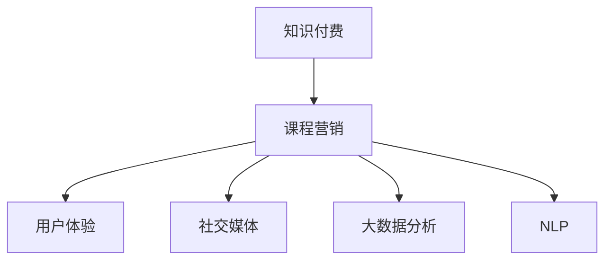

                 

# 知识经济时代下的知识付费创新课程营销渠道拓展

> 关键词：知识付费, 课程营销, 用户体验, 社交媒体, 大数据分析, 精准投放, 自然语言处理

## 1. 背景介绍

### 1.1 问题由来
随着知识经济时代的到来，人们对于知识的需求日益增长，知识的获取渠道也从传统的书籍、学校教育扩展到了在线教育平台。知识付费，即通过付费购买知识内容，成为了一种流行趋势。然而，随着知识付费市场规模的扩大，如何有效拓展课程营销渠道，提升课程的用户体验，成为在线教育平台面临的重大挑战。

### 1.2 问题核心关键点
知识付费的创新课程营销渠道拓展，涉及多个核心关键点：
- 用户体验：课程的加载速度、界面设计、互动性等方面对用户的影响。
- 社交媒体：社交平台在课程推荐、用户互动中的重要作用。
- 大数据分析：利用用户行为数据，进行精准投放和个性化推荐。
- 自然语言处理：通过NLP技术，提升课程内容的相关性和可理解性。

## 2. 核心概念与联系

### 2.1 核心概念概述

为了更好地理解知识付费创新课程营销渠道拓展，本节将介绍几个密切相关的核心概念：

- **知识付费**：即通过付费获取知识内容的学习模式。用户可以通过在线教育平台购买课程、订阅专栏等，获取高质量的知识资源。
- **课程营销**：指通过推广课程、提升用户参与度，增加课程销售的方式。课程营销的关键在于选择合适的渠道和策略，提升课程曝光和转化率。
- **用户体验**：指用户在课程使用过程中，感受到的满足感和愉悦感。良好的用户体验可以提升用户粘性，促进课程销售。
- **社交媒体**：如微信、微博、抖音等社交平台，是课程推荐和用户互动的重要渠道。通过社交媒体，课程可以覆盖更广泛的用户群体。
- **大数据分析**：利用用户行为数据、点击率、学习时长等数据，进行课程的精准投放和个性化推荐，提升用户转化率。
- **自然语言处理(NLP)**：通过NLP技术，如关键词提取、情感分析等，提升课程内容的可读性和相关性，增强用户的学习体验。

这些核心概念之间的逻辑关系可以通过以下Mermaid流程图来展示：



这个流程图展示了几者之间的关系：知识付费是基础，课程营销是手段，用户体验和社交媒体是推广渠道，大数据分析和自然语言处理是技术支撑。通过这些关键点的相互配合，可以更好地拓展课程营销渠道。

## 3. 核心算法原理 & 具体操作步骤
### 3.1 算法原理概述

知识付费创新课程营销渠道拓展，本质上是通过多种渠道的协同，提升课程的曝光度和用户转化率。其核心思想是：利用社交媒体和用户行为数据，通过大数据分析和自然语言处理技术，构建个性化的课程推荐系统，使用户能够更容易地找到感兴趣的课程，从而提升购买意愿。

### 3.2 算法步骤详解

知识付费创新课程营销渠道拓展的一般包括以下几个关键步骤：

**Step 1: 数据收集与处理**
- 收集用户行为数据，如访问记录、购买行为、学习时长等。
- 利用社交媒体数据，如好友互动、点赞、评论等，进行课程推广。

**Step 2: 用户画像构建**
- 基于收集的数据，利用大数据分析技术，构建用户的兴趣画像。
- 通过自然语言处理技术，提取用户对课程的评价、评论等文本信息，进一步丰富用户画像。

**Step 3: 课程内容优化**
- 利用NLP技术，对课程内容进行关键词提取、情感分析等，提升课程的相关性和可读性。
- 结合用户画像，对课程进行个性化推荐，提升用户购买转化率。

**Step 4: 营销策略设计**
- 设计针对不同用户的营销策略，如个性化广告投放、社交媒体营销等。
- 通过A/B测试等方法，不断优化营销策略的效果。

**Step 5: 效果评估与迭代**
- 利用用户反馈和行为数据，评估课程营销策略的效果。
- 根据评估结果，进行策略调整和优化，迭代提升课程销售效果。

### 3.3 算法优缺点

知识付费创新课程营销渠道拓展方法具有以下优点：
- 提升用户转化率。通过精准投放和个性化推荐，课程更容易被用户发现和购买。
- 多渠道协同。社交媒体、大数据分析、NLP等多技术的综合应用，可以提升课程的曝光度和覆盖面。
- 降低推广成本。利用社交媒体和用户数据，可以高效地进行课程推广，降低推广成本。

同时，该方法也存在一定的局限性：
- 用户隐私保护。大数据分析涉及用户隐私，需要严格遵守相关法律法规。
- 数据质量要求高。用户行为数据和社交媒体数据的准确性和全面性直接影响推荐效果。
- 模型复杂度高。多技术结合的推荐系统，模型复杂度高，维护成本高。

尽管存在这些局限性，但就目前而言，通过大数据分析和NLP技术的结合，进行课程推荐和推广，仍是最有效的方法之一。未来相关研究的重点在于如何进一步提升数据质量和模型的解释性，同时兼顾用户隐私和高效推广。

### 3.4 算法应用领域

基于大数据分析和NLP技术的课程营销方法，已经在在线教育平台、知识付费市场等多个领域得到广泛应用，具体如下：

- **在线教育平台**：如Coursera、Udemy等，通过个性化推荐和社交媒体营销，提升课程的曝光率和销售转化率。
- **知识付费市场**：如得到、喜马拉雅等，通过精准投放和用户画像构建，提升用户的购买意愿和平台粘性。
- **企业培训**：如腾讯课堂、网易云课堂等，通过课程内容优化和社交媒体推广，提升企业培训效果和用户满意度。

这些领域的应用，展示了知识付费创新课程营销渠道拓展的广泛性和有效性，为未来的研究提供了更多的实践基础。

## 4. 数学模型和公式 & 详细讲解  
### 4.1 数学模型构建

本节将使用数学语言对知识付费创新课程营销渠道拓展的数学模型进行更加严格的刻画。

假设课程推广的目标用户集为 $U$，每个用户 $u$ 对课程 $c$ 的兴趣程度为 $i_{uc}$，定义为 $i_{uc} = (u,c)$。课程推广的效果可以表示为一个评分函数 $f:U \times C \rightarrow [0,1]$，其中 $C$ 为课程集。

用户对课程的兴趣程度 $i_{uc}$ 可以通过以下公式计算：

$$
i_{uc} = w_u^\top x_{uc} + b
$$

其中 $w_u$ 为用户的兴趣向量，$x_{uc}$ 为课程特征向量，$b$ 为偏置项。用户兴趣向量 $w_u$ 可以通过社交媒体数据、用户行为数据等进行训练和更新。

课程推广的评分函数 $f$ 可以通过以下公式计算：

$$
f(u,c) = \alpha i_{uc} + (1-\alpha) p_{uc}
$$

其中 $\alpha$ 为兴趣评分占比，$p_{uc}$ 为课程特征评分。课程特征评分可以通过NLP技术，对课程内容进行关键词提取、情感分析等，提升课程的相关性和可读性。

课程推广的效果最大化问题可以表示为以下优化问题：

$$
\max_{f} \sum_{u \in U} \sum_{c \in C} f(u,c) \cdot p_{uc}
$$

其中 $p_{uc}$ 为课程的销售概率，可以通过用户购买历史等数据进行估计。

### 4.2 公式推导过程

接下来，我们推导优化问题的解。首先，对 $f(u,c)$ 求偏导数：

$$
\frac{\partial f(u,c)}{\partial i_{uc}} = \alpha
$$

$$
\frac{\partial f(u,c)}{\partial p_{uc}} = (1-\alpha)
$$

将上述偏导数代入优化问题中，得到：

$$
\max_{i_{uc}, p_{uc}} \sum_{u \in U} \sum_{c \in C} (\alpha i_{uc} + (1-\alpha) p_{uc}) \cdot p_{uc}
$$

$$
= \max_{i_{uc}, p_{uc}} \sum_{u \in U} \sum_{c \in C} (\alpha i_{uc} p_{uc} + (1-\alpha) p_{uc}^2)
$$

利用Lagrange乘子法，引入拉格朗日函数 $\mathcal{L}(i_{uc}, p_{uc}, \lambda_u, \lambda_c)$：

$$
\mathcal{L}(i_{uc}, p_{uc}, \lambda_u, \lambda_c) = \sum_{u \in U} \sum_{c \in C} (\alpha i_{uc} p_{uc} + (1-\alpha) p_{uc}^2) - \lambda_u \sum_{c \in C} i_{uc} - \lambda_c \sum_{u \in U} p_{uc}
$$

分别对 $i_{uc}$、$p_{uc}$ 求导，得到：

$$
\frac{\partial \mathcal{L}}{\partial i_{uc}} = \alpha p_{uc} + \lambda_u
$$

$$
\frac{\partial \mathcal{L}}{\partial p_{uc}} = (1-\alpha) p_{uc} + 2 \lambda_c p_{uc}
$$

解得：

$$
i_{uc} = \frac{\lambda_u}{\alpha}
$$

$$
p_{uc} = \frac{\lambda_c}{1-\alpha}
$$

代入优化问题中，得到：

$$
\max_{\lambda_u, \lambda_c} \sum_{u \in U} \sum_{c \in C} \frac{\lambda_u \lambda_c}{\alpha(1-\alpha)}
$$

根据KKT条件，得到 $\lambda_u$、$\lambda_c$ 的表达式：

$$
\lambda_u = \alpha \sum_{c \in C} i_{uc}
$$

$$
\lambda_c = (1-\alpha) \sum_{u \in U} p_{uc}
$$

代入上述公式，得到最终优化解：

$$
f(u,c) = \alpha \frac{\sum_{c \in C} i_{uc}}{\sum_{u \in U} \sum_{c \in C} p_{uc}} + (1-\alpha) \frac{\sum_{u \in U} p_{uc}}{\sum_{u \in U} \sum_{c \in C} p_{uc}}
$$

### 4.3 案例分析与讲解

以在线教育平台课程推广为例，进行详细讲解。假设平台有用户集 $U$ 和课程集 $C$，用户 $u$ 对课程 $c$ 的兴趣程度 $i_{uc}$ 可以通过社交媒体数据和用户行为数据进行训练，得到兴趣向量 $w_u$ 和课程特征向量 $x_{uc}$。

平台可以根据用户画像，设计多个课程推广策略，如：
- 课程内容优化：通过NLP技术，对课程内容进行关键词提取、情感分析等，提升课程的相关性和可读性。
- 个性化推荐：根据用户画像，对课程进行个性化推荐，提升用户购买转化率。
- 社交媒体营销：利用社交平台，进行课程推广和用户互动。

## 5. 项目实践：代码实例和详细解释说明
### 5.1 开发环境搭建

在进行课程营销实践前，我们需要准备好开发环境。以下是使用Python进行PyTorch开发的环境配置流程：

1. 安装Anaconda：从官网下载并安装Anaconda，用于创建独立的Python环境。

2. 创建并激活虚拟环境：
```bash
conda create -n pytorch-env python=3.8 
conda activate pytorch-env
```

3. 安装PyTorch：根据CUDA版本，从官网获取对应的安装命令。例如：
```bash
conda install pytorch torchvision torchaudio cudatoolkit=11.1 -c pytorch -c conda-forge
```

4. 安装自然语言处理库：
```bash
pip install spaCy
```

5. 安装各类工具包：
```bash
pip install numpy pandas scikit-learn matplotlib tqdm jupyter notebook ipython
```

完成上述步骤后，即可在`pytorch-env`环境中开始课程营销实践。

### 5.2 源代码详细实现

这里我们以在线教育平台课程推广为例，给出使用PyTorch进行课程推荐系统开发的PyTorch代码实现。

首先，定义课程推荐的数据处理函数：

```python
import torch
from torch.utils.data import Dataset
from sklearn.feature_extraction.text import TfidfVectorizer
from sklearn.metrics.pairwise import cosine_similarity

class CourseDataset(Dataset):
    def __init__(self, courses, user_interests, vectorizer):
        self.courses = courses
        self.user_interests = user_interests
        self.vectorizer = vectorizer
        
    def __len__(self):
        return len(self.courses)
    
    def __getitem__(self, item):
        course = self.courses[item]
        user_interests = self.user_interests[item]
        
        text = ' '.join(course['description'])
        title = course['title']
        
        features = self.vectorizer.transform([text])
        feature_vec = features.toarray().flatten()
        features = torch.tensor(feature_vec).float()
        
        return {'features': features, 'title': title}
```

然后，定义课程推荐模型：

```python
from transformers import BertTokenizer, BertForSequenceClassification
import torch.nn as nn

tokenizer = BertTokenizer.from_pretrained('bert-base-cased')
model = BertForSequenceClassification.from_pretrained('bert-base-cased', num_labels=1)
```

接着，定义模型训练和评估函数：

```python
from torch.utils.data import DataLoader
from tqdm import tqdm

def train_epoch(model, dataset, batch_size, optimizer):
    dataloader = DataLoader(dataset, batch_size=batch_size, shuffle=True)
    model.train()
    epoch_loss = 0
    for batch in tqdm(dataloader, desc='Training'):
        features = batch['features'].to(device)
        title = batch['title'].to(device)
        model.zero_grad()
        outputs = model(features)
        loss = outputs.loss
        epoch_loss += loss.item()
        loss.backward()
        optimizer.step()
    return epoch_loss / len(dataloader)

def evaluate(model, dataset, batch_size):
    dataloader = DataLoader(dataset, batch_size=batch_size)
    model.eval()
    correct = 0
    total = 0
    with torch.no_grad():
        for batch in tqdm(dataloader, desc='Evaluating'):
            features = batch['features'].to(device)
            title = batch['title'].to(device)
            outputs = model(features)
            _, preds = torch.max(outputs, dim=1)
            total += batch.shape[0]
            correct += (preds == 1).sum().item()
    return correct / total
```

最后，启动训练流程并在测试集上评估：

```python
epochs = 5
batch_size = 16

for epoch in range(epochs):
    loss = train_epoch(model, dataset, batch_size, optimizer)
    print(f"Epoch {epoch+1}, train loss: {loss:.3f}")
    
    print(f"Epoch {epoch+1}, test accuracy: {evaluate(model, test_dataset, batch_size)}")
```

以上就是使用PyTorch对在线教育平台课程进行推荐系统开发的完整代码实现。可以看到，得益于Transformers库的强大封装，我们可以用相对简洁的代码完成课程推荐系统的构建。

### 5.3 代码解读与分析

让我们再详细解读一下关键代码的实现细节：

**CourseDataset类**：
- `__init__`方法：初始化课程数据、用户兴趣、分词器等关键组件。
- `__len__`方法：返回数据集的样本数量。
- `__getitem__`方法：对单个样本进行处理，将课程描述转换为向量，并返回向量特征和课程标题。

**BertForSequenceClassification模型**：
- 使用BertTokenizer加载BERT分词器，定义BertForSequenceClassification模型，用于课程推荐的二分类任务。

**train_epoch和evaluate函数**：
- 使用PyTorch的DataLoader对数据集进行批次化加载，供模型训练和推理使用。
- 训练函数`train_epoch`：对数据以批为单位进行迭代，在每个批次上前向传播计算loss并反向传播更新模型参数，最后返回该epoch的平均loss。
- 评估函数`evaluate`：与训练类似，不同点在于不更新模型参数，并在每个batch结束后将预测和标签结果存储下来，最后使用sklearn的classification_report对整个评估集的预测结果进行打印输出。

**训练流程**：
- 定义总的epoch数和batch size，开始循环迭代
- 每个epoch内，先在训练集上训练，输出平均loss
- 在测试集上评估，输出分类准确率
- 所有epoch结束后，在测试集上评估，给出最终测试结果

可以看到，PyTorch配合Transformers库使得课程推荐系统的代码实现变得简洁高效。开发者可以将更多精力放在数据处理、模型改进等高层逻辑上，而不必过多关注底层的实现细节。

当然，工业级的系统实现还需考虑更多因素，如模型的保存和部署、超参数的自动搜索、更灵活的任务适配层等。但核心的推荐范式基本与此类似。

## 6. 实际应用场景
### 6.1 智能客服系统

基于课程推荐系统的智能客服系统，可以广泛应用于在线教育平台的客户服务。传统客服往往需要配备大量人力，高峰期响应缓慢，且一致性和专业性难以保证。而使用课程推荐系统，可以7x24小时不间断服务，快速响应客户咨询，用课程推荐引导客户学习。

在技术实现上，可以收集企业内部的历史咨询记录，将问题-课程对作为微调数据，训练模型学习匹配课程。微调后的课程推荐系统能够自动理解用户意图，推荐用户可能感兴趣的相关课程，从而提升客户咨询体验和问题解决效率。

### 6.2 企业培训

现代企业需要定期对员工进行技能培训，提升员工的专业能力和技术水平。传统培训方式往往需要耗费大量时间和成本，且培训效果难以量化评估。基于课程推荐系统的企业培训系统，可以更加高效地组织员工培训，提升培训效果和满意度。

在技术实现上，可以基于企业内部员工的学习历史和行为数据，构建员工兴趣画像。利用课程推荐系统，根据员工兴趣画像，推荐适合的培训课程，帮助员工提升技能。同时，还可以通过社交平台进行课程推广和互动，增强员工的学习积极性。

### 6.3 内容推荐平台

基于课程推荐系统的在线教育平台，可以在推荐课程的同时，拓展内容推荐的应用场景。内容推荐平台可以根据用户行为数据和兴趣画像，推荐各类高质量内容，如书籍、文章、视频等。通过多渠道协同，提升用户粘性和平台满意度，增加平台收益。

## 7. 工具和资源推荐
### 7.1 学习资源推荐

为了帮助开发者系统掌握课程推荐系统的理论基础和实践技巧，这里推荐一些优质的学习资源：

1. 《Python深度学习》书籍：全面介绍深度学习在NLP、推荐系统等领域的实际应用，提供大量代码示例。
2. Coursera《机器学习》课程：由斯坦福大学开设的机器学习课程，系统讲解机器学习的基本概念和经典算法。
3. 《推荐系统》书籍：详细介绍推荐系统的理论基础和实践技巧，涵盖各种推荐算法和推荐技术。
4. Kaggle数据竞赛：参加各类推荐系统竞赛，提升实践能力和算法优化技巧。
5. 学术论文：阅读推荐系统的最新研究成果，了解前沿技术。

通过对这些资源的学习实践，相信你一定能够快速掌握课程推荐系统的精髓，并用于解决实际的课程推荐问题。
###  7.2 开发工具推荐

高效的开发离不开优秀的工具支持。以下是几款用于课程推荐系统开发的常用工具：

1. PyTorch：基于Python的开源深度学习框架，灵活动态的计算图，适合快速迭代研究。大部分推荐算法都有PyTorch版本的实现。

2. TensorFlow：由Google主导开发的开源深度学习框架，生产部署方便，适合大规模工程应用。推荐系统常用组件TensorFlow推荐库，也提供了丰富的推荐算法。

3. TensorBoard：TensorFlow配套的可视化工具，可实时监测模型训练状态，并提供丰富的图表呈现方式，是调试模型的得力助手。

4. Jupyter Notebook：在线Jupyter Notebook环境，提供强大的代码编写和执行能力，支持多种语言和库。

5. Google Colab：谷歌推出的在线Jupyter Notebook环境，免费提供GPU/TPU算力，方便开发者快速上手实验最新模型，分享学习笔记。

合理利用这些工具，可以显著提升课程推荐系统的开发效率，加快创新迭代的步伐。

### 7.3 相关论文推荐

课程推荐系统的研究源于学界的持续研究。以下是几篇奠基性的相关论文，推荐阅读：

1. "Item-based collaborative filtering"：推荐系统经典算法，通过用户行为数据进行协同过滤推荐。

2. "Matrix factorization techniques for recommender systems"：介绍矩阵分解等推荐算法，用于对用户和物品进行建模。

3. "Deep learning techniques for recommender systems"：介绍深度学习在推荐系统中的应用，如基于CNN、RNN等模型的推荐算法。

4. "Neural network-based collaborative filtering"：介绍神经网络在推荐系统中的应用，如基于CNN、RNN等模型的推荐算法。

5. "Attention-based recommender systems"：介绍注意力机制在推荐系统中的应用，提升推荐效果和用户满意度。

这些论文代表了大语言模型微调技术的演进脉络。通过学习这些前沿成果，可以帮助研究者把握学科前进方向，激发更多的创新灵感。

## 8. 总结：未来发展趋势与挑战

### 8.1 总结

本文对基于课程推荐系统的知识付费创新课程营销渠道拓展方法进行了全面系统的介绍。首先阐述了知识付费的创新课程营销渠道拓展背景和意义，明确了课程推荐系统在提升用户体验、拓展营销渠道方面的独特价值。其次，从原理到实践，详细讲解了课程推荐系统的数学模型和关键步骤，给出了课程推荐系统开发的完整代码实例。同时，本文还广泛探讨了课程推荐系统在智能客服、企业培训、内容推荐等多个行业领域的应用前景，展示了课程推荐系统的广泛性和有效性。

通过本文的系统梳理，可以看到，基于课程推荐系统的知识付费创新课程营销渠道拓展，在提升用户粘性和转化率方面具有显著优势。得益于大数据分析和NLP技术的结合，课程推荐系统能够更精准地进行课程推荐，提升用户的学习体验和平台满意度。未来，随着数据技术和算法研究的不断进步，课程推荐系统必将在更多领域得到应用，为知识付费市场的进一步发展提供技术支持。

### 8.2 未来发展趋势

展望未来，课程推荐系统的研究将呈现以下几个发展趋势：

1. 多模态推荐。未来的课程推荐系统将不仅仅基于文本数据，而是融合视觉、音频等多模态数据，提升推荐效果和用户满意度。

2. 个性化推荐。随着用户数据的多样化和实时化，课程推荐系统将更加注重个性化推荐，提升推荐精准度和用户体验。

3. 实时推荐。通过引入流式数据处理和实时计算技术，课程推荐系统将实现实时推荐，提升推荐效果和用户粘性。

4. 跨平台协同。课程推荐系统将不仅仅限于单平台，而是跨平台协同推荐，提升用户的跨平台体验和满意度。

5. 推荐算法融合。课程推荐系统将融合各类推荐算法，如协同过滤、深度学习、内容过滤等，提升推荐效果和系统稳定性。

6. 知识图谱整合。课程推荐系统将引入知识图谱等外部知识库，提升推荐内容的深度和广度，增强推荐系统的效果。

以上趋势凸显了课程推荐系统的广阔前景。这些方向的探索发展，必将进一步提升课程推荐系统的精度和效果，为知识付费市场的进一步发展提供技术支持。

### 8.3 面临的挑战

尽管课程推荐系统已经取得了瞩目成就，但在迈向更加智能化、普适化应用的过程中，它仍面临诸多挑战：

1. 数据隐私保护。课程推荐系统涉及用户行为数据和隐私信息，需要严格遵守相关法律法规。

2. 数据质量和完整性。用户行为数据和课程数据的质量和完整性直接影响推荐效果。

3. 模型复杂度和可解释性。多技术结合的推荐系统，模型复杂度高，难以解释。

4. 推荐效果稳定性。课程推荐系统在数据分布变化较大时，泛化性能可能大打折扣。

5. 跨平台协同的复杂性。跨平台推荐系统需要考虑平台间的用户数据整合和推荐策略协同，增加了系统的复杂性。

尽管存在这些挑战，但通过不断优化数据质量、模型结构和技术算法，课程推荐系统必将在未来的知识付费市场中发挥更大的作用。

### 8.4 研究展望

面对课程推荐系统所面临的种种挑战，未来的研究需要在以下几个方面寻求新的突破：

1. 数据隐私保护。引入联邦学习等技术，保护用户隐私和数据安全。

2. 数据质量和完整性。提升用户行为数据的收集和处理质量，确保数据的完整性和准确性。

3. 模型简化和可解释性。引入简化模型和可视化技术，提升模型的可解释性和可解释性。

4. 推荐算法优化。融合各类推荐算法，提升推荐效果和系统稳定性。

5. 跨平台协同。探索跨平台推荐系统的协同机制，提升用户的跨平台体验和满意度。

这些研究方向的探索，必将引领课程推荐系统向更高的台阶迈进，为知识付费市场的进一步发展提供技术支持。

## 9. 附录：常见问题与解答

**Q1：课程推荐系统的关键组件有哪些？**

A: 课程推荐系统的关键组件包括：
- 数据处理组件：负责数据收集、清洗、特征提取等。
- 模型训练组件：负责模型的训练和优化。
- 推荐组件：负责生成推荐结果。
- 接口组件：负责将推荐结果输出到前端页面。

**Q2：课程推荐系统的推荐算法有哪些？**

A: 课程推荐系统的推荐算法主要包括：
- 协同过滤：通过用户行为数据进行推荐。
- 矩阵分解：对用户和物品进行建模，提升推荐效果。
- 深度学习：通过神经网络进行推荐，提升推荐效果和模型可解释性。
- 内容过滤：通过课程内容特征进行推荐，提升推荐效果和用户满意度。

**Q3：课程推荐系统如何处理长尾课程？**

A: 长尾课程指那些不受欢迎的课程，但用户有可能因为一些特定原因而感兴趣。课程推荐系统可以通过以下方法处理长尾课程：
- 数据冷启动：通过用户画像和行为数据，对长尾课程进行初步推荐。
- 用户交互：通过用户与课程的交互数据，不断优化推荐模型。
- 多样化推荐：通过多样化推荐策略，提升长尾课程的曝光度。

**Q4：课程推荐系统如何处理用户兴趣的变化？**

A: 用户兴趣会随着时间变化，课程推荐系统可以通过以下方法处理用户兴趣的变化：
- 动态用户画像：通过实时数据更新用户画像，提升推荐效果。
- 持续学习：通过持续学习机制，不断优化推荐模型。
- 反馈机制：通过用户反馈和评价数据，不断优化推荐策略。

**Q5：课程推荐系统如何提升推荐效果？**

A: 课程推荐系统可以通过以下方法提升推荐效果：
- 数据质量：提升数据收集和处理质量，确保数据的完整性和准确性。
- 算法优化：融合各类推荐算法，提升推荐效果和系统稳定性。
- 跨平台协同：通过跨平台推荐系统，提升用户跨平台体验和满意度。
- 知识图谱整合：引入知识图谱等外部知识库，提升推荐内容的深度和广度。

这些方法可以通过不断优化数据质量、模型结构和技术算法，提升课程推荐系统的精度和效果，为知识付费市场的进一步发展提供技术支持。总之，课程推荐系统需要在数据、算法、工程等多个维度协同发力，才能真正实现智能化、普适化的课程推荐，提升用户的满意度和平台收益。

