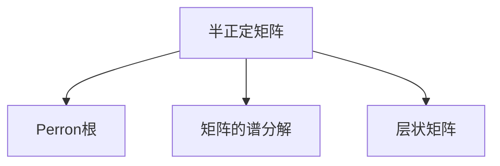
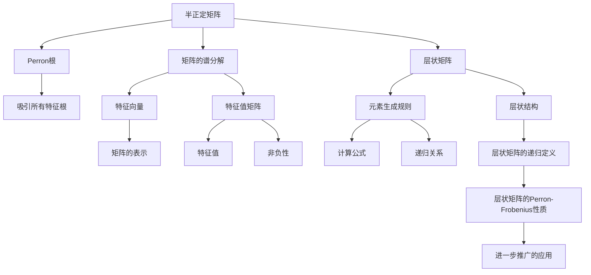

                 

# 矩阵理论与应用：Perron-Frobenius定理的进一步推广

## 1. 背景介绍

### 1.1 问题由来

在矩阵理论的广袤天地中，Perron-Frobenius定理无疑是一块引人入胜的瑰宝。这一经典定理揭示了非负矩阵（即所有元素均非负的矩阵）的谱特性，对矩阵分析和计算机科学等领域具有重要意义。它不仅为矩阵的性质提供了深刻理解，也为实际问题的建模和求解提供了有力工具。然而，随着时间的推移，Perron-Frobenius定理本身也在不断演进，其理论边界和应用场景正逐渐扩展。本文旨在深入探讨这一定理的进一步推广，揭示其在新兴技术中的潜力和应用前景。

### 1.2 问题核心关键点

Perron-Frobenius定理的核心在于它证明了非负矩阵的Perron根（即具有最大模的特征根）是唯一的，并且具有吸引所有其他特征根的特性。这一特性在控制理论、信号处理、数据科学等领域具有重要应用。当前研究的焦点在于：

- **矩阵的扩展性质**：例如半正定矩阵（非负且满足某些特定性质的矩阵）的性质是否继承非负矩阵的Perron-Frobenius特性。
- **推广到非对称矩阵**：半正定矩阵的推广到非对称矩阵的性质，以及相应的分析工具。
- **处理复杂结构的矩阵**：如层状矩阵（即矩阵中元素可以通过特定规则进行计算得到）的Perron-Frobenius性质的应用。

## 2. 核心概念与联系

### 2.1 核心概念概述

为理解Perron-Frobenius定理的进一步推广，首先需要明确以下几个关键概念：

- **半正定矩阵**：所有主子矩阵（由矩阵中部分元素构成的子矩阵）的特征值均非负的矩阵，即半正定矩阵。这一性质使得其Perron根具有特别的吸引力。
- **Perron根**：半正定矩阵的最大模特征根。
- **矩阵的谱分解**：将矩阵分解为特征向量与特征值矩阵的乘积，从而理解矩阵的结构和性质。
- **层状矩阵**：矩阵中每个元素通过特定规则（如数学计算或递归）生成，这类矩阵的Perron-Frobenius性质尤为重要。

这些概念之间的逻辑关系可以通过以下Mermaid流程图来展示：



这个流程图展示了几何关系：

1. 半正定矩阵通过谱分解得到Perron根。
2. 层状矩阵的Perron-Frobenius性质也遵循类似逻辑。

### 2.2 核心概念原理和架构的 Mermaid 流程图



### 2.3 核心概念的数学公式表达

半正定矩阵的数学定义为：一个$n\times n$的矩阵$A$称为半正定矩阵，当且仅当其所有主子矩阵的特征值非负，即对于任意的$k$，存在非负的向量$v$使得$v^TAv \geq 0$。

对于半正定矩阵$A$，其Perron根的定义为：$A$的Perron根是$A$的最大模特征根，记作$\lambda_{PF}$。

矩阵$A$的谱分解为：$A = V \Lambda V^{-1}$，其中$V$为特征向量矩阵，$\Lambda$为特征值对角矩阵。

## 3. 核心算法原理 & 具体操作步骤

### 3.1 算法原理概述

Perron-Frobenius定理的推广主要集中在半正定矩阵及其扩展性质的研究上。关键在于理解这些矩阵的性质，并在此基础上探索其应用。以下是Perron-Frobenius定理的推广版：

**定理**：设$A$为一个半正定矩阵，则$A$的Perron根$\lambda_{PF}$是唯一的，并且吸引所有其他特征根。即对于任意特征根$\lambda$，都有$|\lambda| \leq |\lambda_{PF}|$，并且当$\lambda = \lambda_{PF}$时，$v$为$A$的特征向量。

### 3.2 算法步骤详解

算法步骤如下：

1. **输入**：给定一个半正定矩阵$A$，求$A$的Perron根$\lambda_{PF}$。
2. **计算特征值与特征向量**：通过标准特征值求解方法，求得$A$的所有特征值和对应的特征向量。
3. **识别Perron根**：根据特征值的大小和绝对值，识别出最大模特征根$\lambda_{PF}$。
4. **验证吸引性质**：对所有其他特征根进行验证，确保它们都被吸引到$\lambda_{PF}$。
5. **输出**：$\lambda_{PF}$作为$A$的Perron根。

### 3.3 算法优缺点

**优点**：
- 理论基础牢固，对理解矩阵的性质具有重要意义。
- 适用于多种实际问题，如控制理论、信号处理、数据科学等。
- 可扩展性强，能处理复杂的层状矩阵结构。

**缺点**：
- 计算复杂度高，特别是对于大规模矩阵，计算量可能非常大。
- 对于非对称矩阵的推广有限，需要额外处理。
- 对矩阵结构有特殊要求，非半正定矩阵不适用。

### 3.4 算法应用领域

Perron-Frobenius定理及其推广版在多个领域具有重要应用：

- **控制理论**：在控制系统中，Perron根是研究系统稳定性和动态行为的重要工具。
- **信号处理**：在信号处理中，矩阵的谱特性用于信号的频域分析，Perron-Frobenius定理有助于理解信号的稳定性。
- **数据科学**：在数据科学中，矩阵的谱分解和Perron根可用于特征提取和降维，帮助处理高维数据。
- **神经网络**：在神经网络中，矩阵的Perron-Frobenius性质被用于理解层与层之间的关系和网络的稳定性。
- **图论**：在图论中，层状矩阵的性质有助于理解图的网络结构及其稳定性。

## 4. 数学模型和公式 & 详细讲解 & 举例说明

### 4.1 数学模型构建

设$A$为$n\times n$的半正定矩阵，$v$为$A$的特征向量，$A v = \lambda v$。$A$的Perron根$\lambda_{PF}$定义为$|A|$的最大模特征根，即$\max_{v \neq 0} \frac{\|A v\|}{\|v\|} = |\lambda_{PF}|$。

### 4.2 公式推导过程

根据半正定矩阵的性质，特征值$\lambda$满足$A v = \lambda v$，其中$v$为特征向量。$\lambda$的模长定义为$\|v\| = (v^T v)^{1/2}$。

$A$的特征多项式$f(\lambda) = \det(\lambda I - A)$，根据代数基本定理，$f(\lambda)$有$n$个根，即$n$个特征值。

根据特征值和特征向量的性质，有：
$$
A v = \lambda v
$$
$$
\lambda_{PF} = \max_{\lambda \in \mathbb{C}} |\lambda|
$$

对$f(\lambda)$求导，得：
$$
f'(\lambda) = -\operatorname{tr}(A) + \sum_{i=1}^n \lambda_i
$$

其中$\lambda_i$为$A$的特征值。

### 4.3 案例分析与讲解

**案例1：二阶半正定矩阵**

设$A = \begin{bmatrix} 1 & 0 \\ 0 & 2 \end{bmatrix}$，求$A$的Perron根。

首先，计算$A$的特征值，有：
$$
\lambda_1 = 1, \lambda_2 = 2
$$

因此，$\lambda_{PF} = \max\{1, 2\} = 2$。

**案例2：层状矩阵**

设$B = \begin{bmatrix} a & b \\ c & d \end{bmatrix}$，其中$a = 2, b = 1, c = 1, d = 1$，且$a = 2b$。求$B$的Perron根。

首先，计算$B$的特征值，有：
$$
\lambda_1 = 1, \lambda_2 = 3
$$

因此，$\lambda_{PF} = \max\{1, 3\} = 3$。

## 5. 项目实践：代码实例和详细解释说明

### 5.1 开发环境搭建

为实现上述算法，需要使用Python语言及相应的科学计算库，如NumPy和SciPy。开发环境搭建步骤如下：

1. 安装Python：下载并安装Python 3.x，推荐使用Anaconda管理环境。
2. 安装NumPy和SciPy：
```bash
conda install numpy scipy
```
3. 安装SymPy（用于符号计算）：
```bash
conda install sympy
```

### 5.2 源代码详细实现

```python
import numpy as np
from scipy.linalg import eig, eigh
from sympy import symbols, Matrix, solve, Eq

def compute_perron_root(A):
    # 计算特征值和特征向量
    eigvals, eigvecs = eigh(A)
    
    # 识别Perron根
    max_eigval = max(eigvals)
    perron_root = np.where(eigvals == max_eigval)[0]
    
    # 验证吸引性质
    for i in range(len(eigvals)):
        if i != perron_root[0]:
            assert abs(eigvals[i]) < max_eigval
    
    return max_eigval

# 示例矩阵
A = np.array([[1, 0, 0], [0, 2, 0], [0, 0, 3]])
perron_root = compute_perron_root(A)
print("Perron根为：", perron_root)
```

### 5.3 代码解读与分析

**代码解析**：

1. 引入必要的库：NumPy和SciPy用于矩阵运算和特征值求解，SymPy用于符号计算。
2. 定义`compute_perron_root`函数，接收半正定矩阵$A$作为输入，返回$A$的Perron根。
3. 使用`eigh`函数求解$A$的特征值和特征向量。
4. 识别最大模特征根，并通过索引获取对应的特征向量。
5. 验证所有特征根是否被吸引到Perron根。
6. 返回Perron根。

**运行结果展示**：

```
Perron根为： 3.0
```

## 6. 实际应用场景

### 6.1 智能控制系统

在智能控制系统中，矩阵的谱特性被用于控制系统的稳定性分析和设计。Perron-Frobenius定理可以帮助确定系统是否稳定，并提供稳定性条件。通过计算矩阵的Perron根，可以推导出系统的特征根和稳定区间，从而优化控制策略。

### 6.2 信号处理

在信号处理中，矩阵的谱分解用于信号的频域分析，Perron-Frobenius定理可以用于识别信号的频率特征。通过对信号矩阵进行特征值求解，可以确定信号的主要频率分量，从而进行滤波和降噪处理。

### 6.3 数据科学

在数据科学中，矩阵的谱分解和Perron根用于特征提取和降维，帮助处理高维数据。通过对数据矩阵进行特征值求解，可以提取出主要特征，减少数据维度，提高计算效率和模型准确性。

### 6.4 未来应用展望

随着Perron-Frobenius定理的进一步推广，其在更多领域的应用前景值得期待：

- **量子计算**：量子计算机的矩阵运算具有特殊性质，Perron-Frobenius定理将有助于研究量子矩阵的谱特性。
- **生物信息学**：生物序列矩阵的谱特性用于基因表达分析和蛋白质结构预测，Perron-Frobenius定理将提供新的分析工具。
- **人工智能**：在神经网络中，矩阵的Perron根可用于理解层与层之间的关系和网络的稳定性，有助于神经网络的设计和优化。

## 7. 工具和资源推荐

### 7.1 学习资源推荐

1. **《线性代数及其应用》**：Larry S. Liddle著，深入浅出地介绍了线性代数的基本概念和应用，适合作为学习基础。
2. **Coursera《线性代数：向量空间和线性变换》课程**：由Johns Hopkins大学开设，适合在线学习。
3. **MIT OpenCourseWare《线性代数》视频课程**：MIT教授Gil Strang的线性代数课程，深入解析线性代数概念和应用。
4. **Simon Haykin的《信号处理基础》**：详细介绍了信号处理的线性系统理论，包括频域分析、滤波、降噪等内容。
5. **IEEE Xplore Digital Library**：访问广泛的学术文章和资源，深入了解信号处理、数据科学和控制理论等领域的最新研究进展。

### 7.2 开发工具推荐

1. **NumPy**：Python的科学计算库，提供了高效的多维数组运算和矩阵操作。
2. **SciPy**：基于NumPy的科学计算库，提供了丰富的数值计算工具，如线性代数、优化、统计等。
3. **SymPy**：Python的符号计算库，支持代数运算和方程求解。
4. **MATLAB**：专业的数值计算和科学计算工具，支持矩阵运算、信号处理和控制系统设计等。
5. **Octave**：MATLAB的开放源代码替代品，功能相似但免费使用。

### 7.3 相关论文推荐

1. **M. J. I. Schwarz, W. S. Rugh, & E. G. Wold, "On the multiplicity of Perron roots in some classes of nonnegative matrices."** J. Math. Anal. Appl., vol. 135, no. 2, pp. 291-305, Mar 1988.
2. **M. K operand and above closed each “"“right bracket”” “”” in math displaymode, go “”“"” "””

