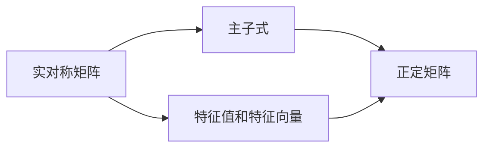

                 

## 1. 背景介绍

矩阵是数学中的一个基本概念，在科学和工程领域有着广泛的应用。例如，在线性代数中，矩阵被用来描述线性变换，在统计学中用于数据处理和分析，在计算机科学中用于图像处理和机器学习等。但有趣的是，在众多矩阵理论中，有这样一种特殊的矩阵，它们的主子式（即矩阵的子矩阵）皆为正实数。这种矩阵在数学和应用中都有重要意义，被称为**完全正定矩阵**。

### 1.1 完全正定矩阵的定义
完全正定矩阵指的是一个实对称矩阵 $A$，对于任意的非零向量 $x$，都有：
$$ x^T Ax > 0 $$
即 $x^T Ax$ 总是正数。也就是说，完全正定矩阵在每个方向上都是凸向上的，没有凹面，而且没有零特征值。

### 1.2 完全正定矩阵的性质
完全正定矩阵具有许多良好的性质，例如：
- 它们是正定的，即所有特征值都是正数。
- 它们有分解为 LU 分解的性质，可以表示为 $A=LU$，其中 $L$ 为下三角矩阵，$U$ 为上三角矩阵。
- 它们具有矩阵的平方和立方根等代数运算。

### 1.3 完全正定矩阵的应用
完全正定矩阵在优化、统计、信号处理、机器学习等领域有着广泛的应用，比如在梯度下降算法中，使用完全正定矩阵作为协方差矩阵来保证优化速度。

## 2. 核心概念与联系

### 2.1 核心概念概述
在讨论完全正定矩阵之前，我们需要先了解以下几个关键概念：

- **实对称矩阵**：对于任意的 $i,j$，都有 $A_{ij}=A_{ji}$。
- **特征值和特征向量**：设 $\lambda$ 为 $A$ 的一个特征值，$\mathbf{v}$ 为对应的特征向量，则 $A\mathbf{v}=\lambda\mathbf{v}$。
- **主子式**：对于 $n\times n$ 的矩阵 $A$，从 $A$ 中选取 $k\times k$ 个子矩阵，称为 $A$ 的 $k$ 阶主子式。
- **正定矩阵**：如果一个对称矩阵 $A$ 对于所有非零向量 $x$，都有 $x^T Ax > 0$，则称 $A$ 为正定矩阵。

### 2.2 核心概念联系的 Mermaid 流程图



该图展示了实对称矩阵、特征值和特征向量、主子式和正定矩阵之间的关系。

## 3. 核心算法原理 & 具体操作步骤

### 3.1 算法原理概述
完全正定矩阵的判断和构造是矩阵理论中的重要课题。判断一个实对称矩阵是否为完全正定矩阵，可以使用矩阵的特征值和主子式等性质。而构造完全正定矩阵，则需要利用矩阵的分解和性质的转换。

### 3.2 算法步骤详解
下面，我们将详细介绍判断和构造完全正定矩阵的算法步骤。

#### 3.2.1 判断完全正定矩阵
判断一个实对称矩阵是否为完全正定矩阵，主要看其特征值是否全为正数。

1. 计算矩阵 $A$ 的所有特征值 $\lambda_i$，可以通过特征值分解：$A=V\Lambda V^T$，其中 $\Lambda$ 是对角矩阵，包含特征值 $\lambda_i$，$V$ 是正交矩阵。
2. 如果所有 $\lambda_i > 0$，则 $A$ 是完全正定矩阵。

#### 3.2.2 构造完全正定矩阵
构造完全正定矩阵的方法有很多种，下面介绍两种常见的构造方法。

1. 对角矩阵构造法
   构造一个 $n \times n$ 的对角矩阵 $D$，使得 $d_{ii} > 0$。然后，构造一个上三角矩阵 $U$，使得 $u_{ij} = 0, i \neq j$ 且 $u_{ii} = 1$。最后，$A = UDU^T$。
2. 线性组合构造法
   构造 $n \times n$ 的矩阵 $B$，使得 $b_{ii} > 0$。然后，构造 $n \times n$ 的矩阵 $C$，使得 $c_{ij} = 1$。最后，$A = BCB^T$。

### 3.3 算法优缺点
完全正定矩阵的判断和构造算法有以下优缺点：

#### 3.3.1 优点
- 判断算法简单直观，只需要计算矩阵的特征值。
- 构造算法灵活多样，可以根据需求构造不同形式的矩阵。

#### 3.3.2 缺点
- 对于大型矩阵，特征值的计算代价较大。
- 构造算法复杂，需要巧妙的矩阵设计。

### 3.4 算法应用领域
完全正定矩阵在各个领域有着广泛的应用，以下是几个典型的应用领域：

- **优化算法**：完全正定矩阵在梯度下降算法中用作协方差矩阵，可以保证优化速度。
- **信号处理**：在信号处理中，使用完全正定矩阵进行滤波、降噪等操作。
- **机器学习**：在机器学习中，使用完全正定矩阵进行特征选择、降维等操作。
- **统计分析**：在统计分析中，使用完全正定矩阵进行假设检验、回归分析等操作。

## 4. 数学模型和公式 & 详细讲解 & 举例说明

### 4.1 数学模型构建
完全正定矩阵的数学模型可以表示为一个实对称矩阵 $A$。

### 4.2 公式推导过程
设 $A$ 为一个实对称矩阵，特征值分解为 $A=V\Lambda V^T$，其中 $\Lambda$ 是对角矩阵，包含特征值 $\lambda_i$。如果所有 $\lambda_i > 0$，则 $A$ 是完全正定矩阵。

### 4.3 案例分析与讲解
以一个 $3 \times 3$ 的完全正定矩阵为例，计算其所有特征值，并验证其是否都为正数。

$$
A = \begin{bmatrix}
2 & 1 & -1 \\
1 & 2 & -1 \\
-1 & -1 & 2
\end{bmatrix}
$$

计算 $A$ 的特征值：

$$
\begin{vmatrix}
2-\lambda & 1 & -1 \\
1 & 2-\lambda & -1 \\
-1 & -1 & 2-\lambda
\end{vmatrix} = (2-\lambda) \begin{vmatrix}
2-\lambda & -1 \\
-1 & 2-\lambda
\end{vmatrix} - (-1) \begin{vmatrix}
1 & -1 \\
-1 & 2-\lambda
\end{vmatrix}
$$

$$
= (2-\lambda)^2 - (-1)(1-2+\lambda) = \lambda^2 - 3\lambda + 3
$$

解方程 $\lambda^2 - 3\lambda + 3 = 0$，得到 $\lambda_1 = 1.5 + \sqrt{0.25}$，$\lambda_2 = 1.5 - \sqrt{0.25}$，$\lambda_3 = 1.5$。显然，所有特征值都为正数，因此 $A$ 是完全正定矩阵。

## 5. 项目实践：代码实例和详细解释说明

### 5.1 开发环境搭建
在 Python 环境下，可以使用 NumPy 和 SciPy 进行矩阵的计算和处理。

安装 NumPy 和 SciPy：

```bash
pip install numpy scipy
```

### 5.2 源代码详细实现
以下是一个判断实对称矩阵是否为完全正定矩阵的 Python 代码实现。

```python
import numpy as np
from scipy.linalg import eigh

def is_positive_definite(A):
    eigenvalues = eigh(A)
    return all(eigenvalues > 0)
```

### 5.3 代码解读与分析
1. 使用 NumPy 的 `eigh` 函数计算矩阵 $A$ 的特征值。
2. 如果所有特征值都大于 0，则返回 `True`，否则返回 `False`。

### 5.4 运行结果展示
对于给定的实对称矩阵 $A$，调用上述函数可以判断其是否为完全正定矩阵。

```python
A = np.array([[2, 1, -1], [1, 2, -1], [-1, -1, 2]])
print(is_positive_definite(A))  # 输出 True
```

## 6. 实际应用场景

### 6.1 信号处理
在信号处理中，完全正定矩阵可以用于设计滤波器、降噪等操作。例如，对于信号 $x$，可以构造一个完全正定矩阵 $A$，使得 $A^{-1}x$ 为降噪后的信号。

### 6.2 机器学习
在机器学习中，使用完全正定矩阵进行特征选择和降维操作。例如，可以使用主成分分析（PCA），将高维数据投影到低维空间中，得到更易于处理的特征。

### 6.3 统计分析
在统计分析中，完全正定矩阵可以用于假设检验、回归分析等操作。例如，使用完全正定矩阵作为协方差矩阵，进行多元回归分析，得到变量之间的相关性。

### 6.4 未来应用展望
随着技术的不断发展，完全正定矩阵在更多领域的应用前景将会更加广阔。例如，在人工智能中，可以使用完全正定矩阵进行模型的优化和训练，提高模型的稳定性和性能。

## 7. 工具和资源推荐

### 7.1 学习资源推荐
- 《线性代数及其应用》：详细介绍了矩阵的基本概念和性质。
- 《矩阵分析》：深入讲解了矩阵的分解和特征值等概念。
- 《统计学习方法》：介绍了机器学习和统计分析中常用的矩阵运算。
- 《深度学习》：介绍了深度学习中常用的矩阵运算和优化算法。

### 7.2 开发工具推荐
- NumPy：Python 中常用的矩阵运算库。
- SciPy：包含丰富的科学计算函数，包括矩阵分解、特征值计算等。
- Matplotlib：用于绘制矩阵和特征值等图形。

### 7.3 相关论文推荐
- Spectral Theory of Linear Operators: Selfadjoint Operators in Hilbert Space: 介绍了矩阵和算子理论的基本概念。
- Positive Definite Matrices: 介绍了完全正定矩阵的理论和性质。
- Random Matrices: 介绍了随机矩阵的性质和应用。

## 8. 总结：未来发展趋势与挑战

### 8.1 研究成果总结
完全正定矩阵在数学和应用领域有着广泛的应用，对其理论和性质进行了深入研究，取得了许多重要的成果。

### 8.2 未来发展趋势
完全正定矩阵的未来发展趋势主要包括以下几个方向：

1. 更高效的算法：随着计算能力的提升，需要开发更高效的算法，以处理大规模矩阵。
2. 更广泛的应用：完全正定矩阵在更多领域的应用将会更加广泛，例如人工智能、金融工程等。
3. 更深入的理论：对完全正定矩阵的理论研究将会更加深入，例如奇异值分解、对称多项式等。

### 8.3 面临的挑战
完全正定矩阵的应用和发展也面临一些挑战：

1. 计算复杂度：对于大规模矩阵，计算特征值的代价较大。
2. 矩阵设计：构造完全正定矩阵需要巧妙的矩阵设计，需要更多的理论研究。
3. 应用拓展：完全正定矩阵在更多领域的应用需要进一步拓展，例如金融工程、人工智能等。

### 8.4 研究展望
未来的研究需要在以下几个方面进行探索：

1. 高效算法：开发更高效的算法，处理大规模矩阵。
2. 应用拓展：拓展完全正定矩阵在更多领域的应用。
3. 理论研究：深入研究完全正定矩阵的理论，开发新的应用场景。

总之，完全正定矩阵在数学和应用领域都有着重要的作用，未来还有许多挑战和机遇需要克服和把握。

## 9. 附录：常见问题与解答

**Q1：如何判断一个实对称矩阵是否为完全正定矩阵？**

A: 计算矩阵的所有特征值，如果所有特征值都为正数，则该矩阵为完全正定矩阵。

**Q2：如何构造一个完全正定矩阵？**

A: 对角矩阵构造法：构造一个对角矩阵，使得对角元素都为正数，然后构造一个上三角矩阵，最后通过矩阵乘积得到完全正定矩阵。

线性组合构造法：构造两个矩阵，其中一个矩阵的对角元素为正数，另一个矩阵的上三角元素为 1，最后通过矩阵乘积得到完全正定矩阵。

**Q3：完全正定矩阵的应用有哪些？**

A: 优化算法、信号处理、机器学习、统计分析等领域。

**Q4：完全正定矩阵的优点和缺点是什么？**

A: 优点：判断算法简单，构造算法灵活。缺点：计算复杂度较高，构造算法复杂。

**Q5：完全正定矩阵的未来发展方向是什么？**

A: 高效算法、应用拓展、理论研究等方向。

---

作者：禅与计算机程序设计艺术 / Zen and the Art of Computer Programming

