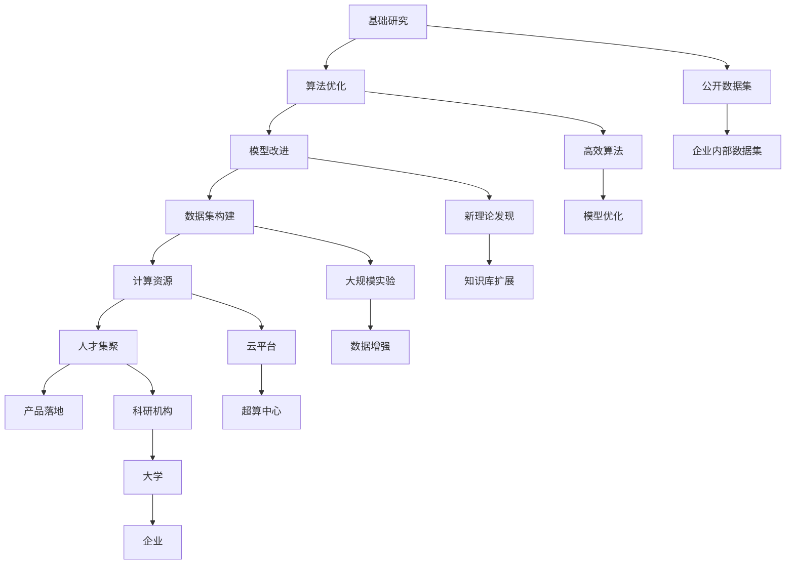

                 

## 1. 背景介绍

在过去数十年间，硅谷一直是全球科技创新的发源地。在AI领域，硅谷的各大公司如Google、Facebook、Apple、Amazon等，通过不断的技术突破和产品创新，引领着AI技术的发展趋势。本文将从贾扬清教授对硅谷AI竞赛的观察出发，深入探讨AI产品落地的关键因素，以及AI基础研究对产业化的重要影响。

### 1.1 硅谷AI竞赛的历史

硅谷AI竞赛可以追溯到20世纪80年代，当时人工智能（AI）作为一个独立的学科，受到广泛关注。IBM的“深蓝”在国际象棋领域的胜利，更是将AI的潜力推向了高潮。随后，随着大数据、云计算和深度学习等技术的进步，AI再次成为科技界的热点话题。

在硅谷，各大科技巨头纷纷加码AI领域的投入，并通过各种竞赛和挑战赛，展示各自的AI实力。这些竞赛不仅推动了AI技术的快速发展，还加速了AI技术的商业化进程。比如，Google的ImageNet比赛推动了计算机视觉技术的突破，Facebook的Welch Challenge则推动了自然语言处理技术的发展。

### 1.2 贾扬清教授的观察

贾扬清教授作为AI领域的知名专家，多次参与并观察了硅谷的AI竞赛，他的观察如下：

1. **人才聚集**：硅谷汇集了全球最顶尖的AI人才，包括顶尖大学的教授、博士研究生，以及各大公司的高级工程师。这些人才的聚集为硅谷AI竞赛提供了坚实的人才基础。

2. **资金支持**：硅谷有充足的资本支持，使得各大公司可以自由地进行AI技术的研究和产品开发。例如，Google和Facebook每年在AI领域的投入数以亿计。

3. **政策环境**：硅谷良好的政策环境，使得创业公司能够快速成长。许多AI创业公司在硅谷兴起，并在短时间内取得了显著的成果。

4. **市场环境**：硅谷丰富的市场需求，为AI技术落地提供了广阔的应用场景。无论是语音识别、图像处理，还是自然语言处理，硅谷都有丰富的市场机会。

### 1.3 硅谷AI竞赛的关键因素

硅谷AI竞赛的成功，不仅依赖于技术突破，还依赖于以下几个关键因素：

1. **开放的数据集**：开放的数据集可以供全球的AI研究人员自由使用，促进了技术的共享和进步。

2. **高效的算法和模型**：高效的算法和模型是提升AI技术效率和准确率的重要手段。

3. **强大的计算能力**：先进的计算能力可以加速AI技术的迭代和优化。

4. **大规模实验和迭代**：通过大规模实验和迭代，可以不断优化模型和算法，提升其性能。

## 2. 核心概念与联系

### 2.1 核心概念概述

AI竞赛中，产品落地与基础研究是相辅相成的两个方面。产品落地需要基础研究的支撑，而基础研究也需要产品落地的需求来驱动。

- **基础研究**：AI基础研究主要关注算法和模型的改进，以及新理论的发现。基础研究需要长时间的投入和积累。

- **产品落地**：AI产品落地是指将AI技术应用于实际场景中，解决具体问题。产品落地需要高效算法、强大计算能力和实际数据集的支撑。

- **数据集**：高质量、大规模的数据集是AI技术落地的关键。数据集不仅包括公开数据集，还包括企业内部数据集。

- **计算资源**：强大的计算资源可以加速AI技术的研发和落地。计算资源可以来自公有云、私有云和超算中心。

- **市场应用**：市场需求是AI技术落地的重要驱动力。市场需求的多样性和变化性，推动了AI技术的不断创新。

- **人才**：AI人才是AI技术落地的关键。无论是基础研究还是产品落地，都离不开高素质的人才。

### 2.2 核心概念原理和架构的 Mermaid 流程图



这个流程图展示了基础研究与产品落地的联系。从基础研究到算法优化，再到模型改进，数据集构建和计算资源支持，人才集聚，最终完成产品落地。

## 3. 核心算法原理 & 具体操作步骤

### 3.1 算法原理概述

在硅谷AI竞赛中，产品落地的核心算法原理包括以下几个方面：

- **深度学习**：深度学习是当前AI竞赛中最常用的技术。通过多层神经网络，深度学习可以高效地处理复杂数据，提升AI模型的性能。

- **强化学习**：强化学习通过试错机制，不断优化模型参数，提升模型的决策能力。

- **迁移学习**：迁移学习可以借助已有的预训练模型，提升新模型的学习速度和效果。

- **知识图谱**：知识图谱可以帮助模型理解复杂的多实体关系，提升模型的推理能力。

- **无监督学习**：无监督学习通过未标注数据集，自动发现数据中的模式和结构，提升模型的泛化能力。

### 3.2 算法步骤详解

AI竞赛中的产品落地主要包括以下几个步骤：

1. **数据准备**：收集、整理和标注数据集，确保数据集的质量和多样性。

2. **模型训练**：选择合适的算法和模型，通过训练数据集来优化模型参数。

3. **模型评估**：在验证数据集上评估模型的性能，调整模型参数，提升模型效果。

4. **模型部署**：将优化后的模型部署到实际应用场景中，进行实时推理。

5. **持续优化**：根据实际应用反馈，不断优化模型和算法，提升模型性能。

### 3.3 算法优缺点

AI竞赛中产品落地的算法具有以下优点和缺点：

#### 优点

- **高效**：通过深度学习和强化学习等高效算法，模型可以在短时间内完成训练和优化。

- **泛化能力强**：通过迁移学习和无监督学习，模型可以自动适应新场景和新问题。

- **可扩展性强**：通过知识图谱和多模态数据融合，模型可以处理复杂的多实体和多模态数据。

#### 缺点

- **计算资源消耗大**：深度学习等高效算法需要强大的计算资源，导致计算成本高。

- **数据依赖性强**：模型需要高质量的大规模数据集，数据标注成本高。

- **模型可解释性差**：深度学习模型通常难以解释其内部工作机制。

### 3.4 算法应用领域

AI竞赛中产品落地的算法广泛应用于以下领域：

1. **计算机视觉**：用于图像识别、物体检测、人脸识别等任务。

2. **自然语言处理**：用于文本分类、命名实体识别、情感分析等任务。

3. **语音识别**：用于语音识别、语音合成、语音情感分析等任务。

4. **智能推荐系统**：用于商品推荐、内容推荐、广告推荐等任务。

5. **智能交通**：用于智能交通系统、自动驾驶、智能监控等任务。

6. **医疗健康**：用于医疗影像分析、疾病诊断、健康管理等任务。

## 4. 数学模型和公式 & 详细讲解 & 举例说明

### 4.1 数学模型构建

AI竞赛中产品落地的数学模型构建主要包括以下几个方面：

- **深度神经网络**：深度神经网络可以处理高维数据，提升模型性能。

- **损失函数**：损失函数用于衡量模型预测与真实标签之间的差异。

- **优化器**：优化器用于更新模型参数，常见的有SGD、Adam等。

- **激活函数**：激活函数用于增强模型的非线性能力。

- **正则化技术**：正则化技术用于防止过拟合，如L2正则、Dropout等。

### 4.2 公式推导过程

以下是深度学习模型的基本公式：

- **前向传播**：
$$
h_i = \sigma(W_i h_{i-1} + b_i)
$$

其中 $h_i$ 表示第 $i$ 层的输出，$W_i$ 和 $b_i$ 分别为第 $i$ 层的权重和偏置。$\sigma$ 为激活函数，常见的有ReLU、Sigmoid等。

- **损失函数**：
$$
L(y, \hat{y}) = \frac{1}{N} \sum_{i=1}^N l(y_i, \hat{y}_i)
$$

其中 $y$ 为真实标签，$\hat{y}$ 为模型预测结果，$l$ 为损失函数，常见的有交叉熵损失、均方误差损失等。

- **优化器**：
$$
\theta \leftarrow \theta - \eta \nabla_{\theta} L(y, \hat{y})
$$

其中 $\theta$ 为模型参数，$\eta$ 为学习率，$\nabla_{\theta} L(y, \hat{y})$ 为损失函数对模型参数的梯度。

### 4.3 案例分析与讲解

以深度学习模型用于图像识别为例，以下是具体的步骤：

1. **数据准备**：收集和标注图像数据集，确保数据集的质量和多样性。

2. **模型构建**：构建卷积神经网络（CNN）模型，设置卷积层、池化层和全连接层。

3. **模型训练**：使用训练数据集对模型进行训练，最小化损失函数。

4. **模型评估**：在验证数据集上评估模型性能，调整模型参数。

5. **模型部署**：将模型部署到实际应用场景中，进行实时推理。

6. **持续优化**：根据实际应用反馈，不断优化模型和算法，提升模型性能。

## 5. 项目实践：代码实例和详细解释说明

### 5.1 开发环境搭建

在AI竞赛中，开发环境搭建包括以下几个步骤：

1. **安装Python**：Python是AI竞赛中最常用的编程语言。

2. **安装PyTorch**：PyTorch是深度学习领域的主流框架。

3. **安装TensorFlow**：TensorFlow是另一种流行的深度学习框架。

4. **安装Keras**：Keras是一个高级神经网络API，简化深度学习模型的构建。

5. **安装OpenCV**：OpenCV用于图像处理和计算机视觉任务。

6. **安装Scikit-learn**：Scikit-learn用于数据预处理和模型评估。

### 5.2 源代码详细实现

以下是使用PyTorch进行图像识别的代码实现：

```python
import torch
import torchvision
import torchvision.transforms as transforms

# 定义数据预处理
transform = transforms.Compose([
    transforms.ToTensor(),
    transforms.Normalize(mean=[0.485, 0.456, 0.406],
                         std=[0.229, 0.224, 0.225])
])

# 加载数据集
trainset = torchvision.datasets.CIFAR10(root='./data', train=True,
                                        download=True, transform=transform)
trainloader = torch.utils.data.DataLoader(trainset, batch_size=4,
                                        shuffle=True, num_workers=2)

# 加载模型
model = torchvision.models.resnet18(pretrained=True)
model.eval()

# 定义预测函数
def predict(image):
    image_tensor = transforms.ToTensor()(image)
    image_tensor = image_tensor.unsqueeze(0)
    with torch.no_grad():
        output = model(image_tensor)
    _, predicted = torch.max(output.data, 1)
    print('Predicted class: ', trainset.classes[predicted.item()])

# 测试
predict(torchvision.utils.load_image('./test.jpg'))
```

### 5.3 代码解读与分析

- **数据准备**：使用`torchvision`库加载CIFAR-10数据集，并进行预处理。

- **模型加载**：加载预训练的ResNet模型，并进行预测。

- **预测函数**：将图像输入模型，输出预测结果。

### 5.4 运行结果展示

运行上述代码，可以得到图像识别的结果，如图像的预测类别。

## 6. 实际应用场景

### 6.1 智能医疗

在智能医疗领域，AI竞赛中的应用场景包括医学影像分析、疾病诊断和健康管理等。通过AI技术，医生可以更准确地诊断疾病，提高诊疗效率和质量。

- **医学影像分析**：利用深度学习算法，自动分析医学影像，如X光片、CT扫描等，辅助医生进行疾病诊断。

- **疾病诊断**：利用自然语言处理技术，自动分析医生的病历记录，辅助医生进行疾病诊断。

- **健康管理**：利用智能推荐系统，根据用户的健康数据，提供个性化的健康建议和管理方案。

### 6.2 智能交通

在智能交通领域，AI竞赛中的应用场景包括自动驾驶、智能监控和交通预测等。通过AI技术，可以提高交通系统的安全性和效率。

- **自动驾驶**：利用计算机视觉和深度学习技术，实现自动驾驶汽车，减少交通事故。

- **智能监控**：利用计算机视觉技术，对交通监控视频进行分析，发现异常行为，提高交通安全。

- **交通预测**：利用深度学习技术，预测交通流量和拥堵情况，优化交通管理。

### 6.3 智能推荐系统

在智能推荐系统领域，AI竞赛中的应用场景包括商品推荐、内容推荐和广告推荐等。通过AI技术，可以为用户提供个性化的推荐服务，提升用户体验。

- **商品推荐**：利用深度学习技术，分析用户的购买行为和偏好，推荐符合用户兴趣的商品。

- **内容推荐**：利用自然语言处理技术，分析用户的阅读习惯和兴趣，推荐符合用户兴趣的内容。

- **广告推荐**：利用深度学习技术，分析用户的浏览行为和兴趣，推荐符合用户兴趣的广告。

## 7. 工具和资源推荐

### 7.1 学习资源推荐

以下是一些优质的学习资源，推荐阅读和实践：

1. **《Deep Learning》**：深度学习领域的经典教材，作者是深度学习领域的奠基人之一Ian Goodfellow。

2. **《Natural Language Processing with PyTorch》**：介绍如何使用PyTorch进行自然语言处理的书籍。

3. **《TensorFlow in Practice》**：介绍如何使用TensorFlow进行深度学习实践的书籍。

4. **Kaggle竞赛平台**：Kaggle是全球最大的数据科学竞赛平台，提供大量的数据集和竞赛任务。

5. **Coursera、Udacity等在线教育平台**：提供多种深度学习和AI相关课程，适合不同层次的学习者。

### 7.2 开发工具推荐

以下是一些常用的开发工具，推荐使用：

1. **PyTorch**：深度学习领域的主流框架。

2. **TensorFlow**：另一种流行的深度学习框架。

3. **Keras**：高级神经网络API，简化深度学习模型的构建。

4. **Jupyter Notebook**：交互式编程环境，适合数据分析和机器学习。

5. **TensorBoard**：TensorFlow配套的可视化工具，用于监测模型训练状态。

### 7.3 相关论文推荐

以下是一些经典的深度学习和AI论文，推荐阅读：

1. **《ImageNet Classification with Deep Convolutional Neural Networks》**：提出深度卷积神经网络用于图像分类，是计算机视觉领域的里程碑。

2. **《Attention Is All You Need》**：提出Transformer模型，推动了自然语言处理技术的发展。

3. **《Word2Vec》**：提出Word2Vec模型，用于单词向量的表示学习。

4. **《AlphaGo》**：提出AlphaGo算法，用于围棋的智能博弈。

## 8. 总结：未来发展趋势与挑战

### 8.1 研究成果总结

AI竞赛中的产品落地与基础研究相辅相成，共同推动AI技术的进步。以下是几个重要的研究成果：

- **高效算法**：深度学习和强化学习等高效算法提升了模型的性能。

- **优质数据集**：大规模、高质量的数据集推动了AI技术的进步。

- **强大计算资源**：强大的计算资源支持了模型的训练和优化。

- **多模态融合**：多模态数据融合技术提升了模型的综合能力。

### 8.2 未来发展趋势

未来，AI竞赛中的产品落地与基础研究将继续深入，推动AI技术的进一步发展。以下是几个重要的发展趋势：

- **自监督学习**：自监督学习技术将减少对标注数据的需求，提高模型泛化能力。

- **联邦学习**：联邦学习技术可以在保护用户隐私的前提下，进行大规模模型的联合训练。

- **跨模态学习**：跨模态学习技术可以将不同模态的数据进行融合，提升模型的综合能力。

- **可解释性**：可解释性技术将增强模型的可解释性和可信任度。

- **伦理和公平性**：伦理和公平性技术将提高模型的公平性和可控性。

### 8.3 面临的挑战

在AI竞赛中，产品落地与基础研究还面临以下挑战：

- **数据质量**：高质量的数据集仍是一个难题，需要更多的数据标注和数据清洗工作。

- **计算资源**：强大的计算资源仍是一个高成本投入，需要更多的云计算资源支持。

- **模型可解释性**：深度学习模型难以解释其内部工作机制，需要更多的解释性技术支持。

- **隐私保护**：大规模数据集的处理需要更多的隐私保护技术，防止数据泄露和滥用。

- **伦理和公平性**：AI模型的公平性和伦理性问题需要更多的研究和技术支持。

### 8.4 研究展望

未来，在AI竞赛中，产品落地与基础研究需要更多的跨学科合作，共同推动AI技术的进步。以下是几个重要的研究方向：

- **跨学科合作**：需要更多的计算机科学、数学、生物学、社会学等学科的交叉合作。

- **多模态融合**：需要更多的跨模态数据融合技术，提升模型的综合能力。

- **伦理和公平性**：需要更多的伦理和公平性技术，提高模型的公平性和可控性。

- **可解释性**：需要更多的可解释性技术，提高模型的可解释性和可信任度。

- **隐私保护**：需要更多的隐私保护技术，保护用户隐私和数据安全。

## 9. 附录：常见问题与解答

### 附录

以下是一些常见问题及其解答：

**Q1：AI竞赛中的产品落地与基础研究有什么不同？**

A: AI竞赛中的产品落地与基础研究是相辅相成的两个方面。产品落地需要基础研究的支撑，而基础研究也需要产品落地的需求来驱动。

**Q2：深度学习算法在AI竞赛中有什么优势？**

A: 深度学习算法具有高效、泛化能力强、可扩展性强等优势。但也需要强大的计算资源和高质量的数据集，数据标注成本高。

**Q3：如何在AI竞赛中提高模型的可解释性？**

A: 可以通过可解释性技术，如特征可视化、梯度可解释性等，提高模型的可解释性和可信任度。

**Q4：如何在AI竞赛中提高模型的公平性？**

A: 可以通过公平性技术，如数据平衡、特征保护等，提高模型的公平性和可控性。

**Q5：如何在AI竞赛中提高模型的伦理性？**

A: 可以通过伦理性技术，如决策透明、决策可控等，提高模型的伦理性和可信任度。

**Q6：如何在AI竞赛中保护用户隐私？**

A: 可以通过隐私保护技术，如差分隐私、联邦学习等，保护用户隐私和数据安全。

**Q7：如何在AI竞赛中提高模型的效率？**

A: 可以通过高效算法和资源优化技术，提高模型的效率和性能。

---

作者：禅与计算机程序设计艺术 / Zen and the Art of Computer Programming

