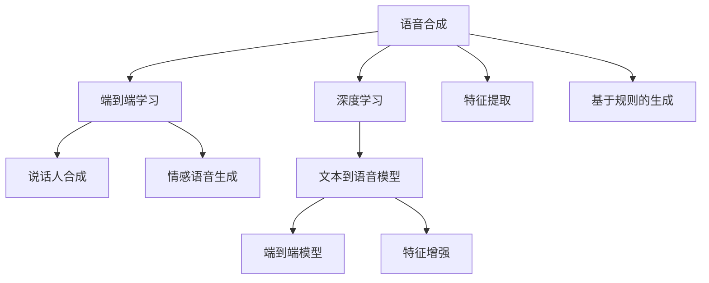

                 

# 神经网络在语音合成中取代传统方法

## 1. 背景介绍

### 1.1 问题由来
语音合成，也称为文本到语音(TTS)，是指将文本序列转换为可听语音序列的过程。这一技术广泛应用于电话系统、语音助手、有声读物、自动字幕等场景。传统语音合成方法依赖于规则化的特征提取和基于规则的语音生成，其弊端在于难以建模复杂的语言现象，生成的语音质量也参差不齐。近年来，随着深度学习技术的发展，神经网络在语音合成中的应用开始兴起，逐渐取代传统方法成为主导趋势。

### 1.2 问题核心关键点
神经网络在语音合成中取代传统方法，主要依赖于以下几个核心关键点：

- 数据驱动的模型训练：神经网络模型通过大量标注数据进行端到端学习，避免了传统方法中繁杂的特征工程和规则设计。
- 自动化的特征提取：深度学习模型可以自动从文本序列中提取特征，无需手工设计，且能够捕捉丰富的语言信息。
- 高效的语音生成：神经网络模型在语音生成任务中表现卓越，生成自然流畅的语音，且能够处理复杂的语音现象。
- 跨模态信息融合：神经网络模型可以同时处理文本和音频，实现跨模态的深度学习。

### 1.3 问题研究意义
研究神经网络在语音合成中的应用，对于提升语音合成技术的质量、降低开发成本、加速行业应用具有重要意义：

1. **提升语音合成质量**：神经网络可以自动学习语音合成所需的特征和生成策略，生成更加自然流畅的语音。
2. **降低开发成本**：神经网络模型可通过预训练和微调的方式，快速适配不同的语音合成任务，大大降低人工干预的复杂度。
3. **加速行业应用**：神经网络模型的高效性和灵活性，使其能够被各行各业广泛采用，快速落地语音合成应用。
4. **技术创新**：神经网络的应用推动了语音合成技术的持续演进，带来了如说话人合成、情感语音生成等新的研究方向。

## 2. 核心概念与联系

### 2.1 核心概念概述

为了更好地理解神经网络在语音合成中的取代过程，我们需要先介绍几个核心概念：

- **语音合成**：将文本序列转换为语音序列的过程。传统语音合成方法依赖于规则化的特征提取和基于规则的语音生成，其弊端在于难以建模复杂的语言现象，生成的语音质量也参差不齐。
- **深度学习模型**：通过深度神经网络模型，实现端到端的语音合成，避免了传统方法中繁杂的特征工程和规则设计。
- **端到端学习**：模型直接从原始文本序列到语音序列进行学习，无需中间特征提取步骤。
- **说话人合成**：生成特定说话人的语音，要求模型学习到该说话人的发音特征和风格。
- **情感语音生成**：根据文本和情感标签，生成带有特定情感色彩的语音，要求模型能够捕捉语调、节奏等情感特征。

这些概念之间的逻辑关系可以通过以下Mermaid流程图来展示：



这个流程图展示了大语言模型的核心概念及其之间的关系：

1. 语音合成依赖于深度学习模型，实现端到端的语音生成。
2. 端到端模型通过端到端学习，避免了中间特征提取步骤。
3. 说话人合成和情感语音生成是语音合成的两个重要方向。
4. 特征提取和基于规则的生成是传统语音合成的方法。

这些概念共同构成了语音合成技术的演进框架，展示了从传统到深度学习方法的进步路径。

## 3. 核心算法原理 & 具体操作步骤
### 3.1 算法原理概述

神经网络在语音合成中的应用，基于深度学习模型的端到端学习特性，实现了从文本序列到语音序列的自动映射。其核心思想是：使用神经网络模型直接从文本序列学习到语音合成的映射关系，无需中间特征提取步骤。

形式化地，假设文本序列为 $X=\{x_1, x_2, \cdots, x_n\}$，语音序列为 $Y=\{y_1, y_2, \cdots, y_m\}$。语音合成任务即为找到映射函数 $f$，使得 $f(X)=Y$。

对于深度学习模型 $M$，可以通过以下步骤进行语音合成：

1. 将文本序列 $X$ 输入模型 $M$，输出语音序列 $Y$。
2. 使用交叉熵等损失函数衡量模型输出 $Y$ 与真实标签 $Y^*$ 的差异。
3. 反向传播更新模型参数 $M$，最小化损失函数。

### 3.2 算法步骤详解

神经网络在语音合成中的实现步骤包括数据准备、模型选择、损失函数设计、训练和评估。以下是详细步骤：

**Step 1: 数据准备**

1. **收集数据集**：收集包含文本和对应语音的数据集。数据集应包含足够的变异性，以便模型学习到广泛的语音生成策略。
2. **数据预处理**：对文本和语音数据进行清洗、归一化、标注等预处理操作。
3. **划分数据集**：将数据集划分为训练集、验证集和测试集，供模型训练和评估使用。

**Step 2: 模型选择**

1. **选择模型架构**：根据任务需求和数据特点，选择适合的深度学习模型。常见的模型包括：
   - 卷积神经网络(CNN)：用于提取文本特征，捕捉文本中的重要信息。
   - 递归神经网络(RNN)：用于处理序列数据，捕捉语音的时序信息。
   - 长短时记忆网络(LSTM)：用于捕捉长期的语音依赖关系。
   - 注意力机制(Attention)：用于提升语音合成的自然度。
   - 生成对抗网络(GAN)：用于生成更加逼真的语音。
2. **初始化模型**：使用预训练模型或随机初始化模型参数，开始模型训练。

**Step 3: 损失函数设计**

1. **选择损失函数**：根据任务类型，选择合适的损失函数。常见的损失函数包括：
   - 均方误差(MSE)：用于回归任务。
   - 交叉熵损失(Cross-Entropy)：用于分类任务。
   - 对抗损失(Adversarial Loss)：用于生成任务。
   - 马氏距离(Mahalanobis Distance)：用于鲁棒性增强。
2. **设计训练目标**：将损失函数与模型输出进行比较，计算损失值。

**Step 4: 训练过程**

1. **设置优化器**：选择合适的优化器及其参数，如Adam、SGD等，设置学习率、批大小等超参数。
2. **前向传播**：将训练集数据输入模型，计算输出和损失值。
3. **反向传播**：计算损失函数对模型参数的梯度，使用优化器更新模型参数。
4. **验证集评估**：周期性在验证集上评估模型性能，防止过拟合。

**Step 5: 测试和部署**

1. **测试集评估**：在测试集上评估模型性能，对比微调前后的精度提升。
2. **应用部署**：使用微调后的模型对新样本进行推理预测，集成到实际的应用系统中。
3. **持续学习**：收集新的数据，定期重新微调模型，以适应数据分布的变化。

### 3.3 算法优缺点

神经网络在语音合成中的应用具有以下优点：

1. **高效性**：无需手工设计特征，自动从文本序列中提取语音合成所需信息，提升模型训练效率。
2. **准确性**：通过端到端学习，捕捉复杂的语音特征，生成更加自然流畅的语音。
3. **灵活性**：能够处理不同类型的语音合成任务，如说话人合成、情感语音生成等。
4. **可扩展性**：通过预训练模型和微调技术，可以快速适配不同的语音合成任务。

同时，该方法也存在一些局限性：

1. **对标注数据依赖**：神经网络模型的训练需要大量的标注数据，数据获取和标注成本较高。
2. **模型复杂度高**：神经网络模型参数量较大，对计算资源要求较高。
3. **可解释性不足**：神经网络模型黑盒特性，难以解释其内部决策过程。
4. **鲁棒性有待提升**：面对噪声、情感变化等干扰因素，神经网络模型容易出现波动。

尽管存在这些局限性，但神经网络在语音合成中的应用已取得显著进展，成为主流技术。未来相关研究的重点在于如何进一步降低对标注数据的依赖，提升模型鲁棒性，增强模型的可解释性等，以期更好地满足实际应用的需求。

### 3.4 算法应用领域

神经网络在语音合成中的应用已经广泛涉及多个领域，包括但不限于：

1. **语音助手**：如Siri、Alexa等，通过神经网络合成语音，实现自然交互。
2. **有声读物**：将书籍内容转换为语音，提供便捷的阅读体验。
3. **电话系统**：自动语音应答系统、客服机器人等，通过合成语音与用户交流。
4. **广告和宣传**：通过合成特定说话人的语音，实现品牌推广和广告宣传。
5. **影视和动画**：为影视和动画中的角色配音，提升作品表现力。
6. **人机交互**：通过合成自然流畅的语音，提升人机交互的体验感。

此外，神经网络在语音合成中的应用还延伸到情感语音生成、说话人合成等领域，为语言交互技术的发展提供了新的可能。

## 4. 数学模型和公式 & 详细讲解  
### 4.1 数学模型构建

假设语音合成任务的目标是将文本序列 $X$ 映射到语音序列 $Y$，神经网络模型 $M$ 的输入为 $X$，输出为 $Y$。其数学模型可表示为：

$$
M: X \rightarrow Y
$$

其中 $X$ 为文本序列，$Y$ 为语音序列，$M$ 为深度学习模型。

语音合成的目标是最小化损失函数 $L$，即：

$$
L(Y^*, Y) = \sum_{i=1}^{m} \|y^*_i - y_i\|
$$

其中 $y^*_i$ 为真实标签，$y_i$ 为模型输出，$\| \cdot \|$ 为误差度量，如均方误差(MSE)。

### 4.2 公式推导过程

以基于卷积神经网络(CNN)的文本到语音模型为例，进行数学推导。

假设文本序列 $X$ 长度为 $n$，语音序列 $Y$ 长度为 $m$，模型的输入张量为 $X_{in} \in \mathbb{R}^{n \times d}$，输出张量为 $Y_{out} \in \mathbb{R}^{m \times C}$，其中 $d$ 为输入维度，$C$ 为类别数。

模型的结构为：

$$
Y_{out} = f(X_{in}, W_{conv}, W_{pool}, W_{fc})
$$

其中 $f$ 为前向传播函数，$W_{conv}$ 为卷积层权重，$W_{pool}$ 为池化层权重，$W_{fc}$ 为全连接层权重。

目标函数 $L$ 为：

$$
L(Y^*, Y_{out}) = \frac{1}{m} \sum_{i=1}^{m} \|y^*_i - \hat{y}_i\|^2
$$

其中 $\hat{y}_i$ 为模型输出，$y^*_i$ 为真实标签。

模型的训练过程为：

1. 前向传播：
   $$
   Y_{pred} = f(X_{in}, W_{conv}, W_{pool}, W_{fc})
   $$

2. 计算损失：
   $$
   L(Y^*, Y_{pred}) = \frac{1}{m} \sum_{i=1}^{m} \|y^*_i - \hat{y}_i\|^2
   $$

3. 反向传播：
   $$
   \frac{\partial L}{\partial W_{conv}} = \frac{\partial L}{\partial Y_{pred}} \cdot \frac{\partial Y_{pred}}{\partial X_{in}} \cdot \frac{\partial X_{in}}{\partial W_{conv}}
   $$

4. 更新模型参数：
   $$
   W_{conv} \leftarrow W_{conv} - \eta \frac{\partial L}{\partial W_{conv}}
   $$

其中 $\eta$ 为学习率，$\partial$ 表示偏导数。

### 4.3 案例分析与讲解

以基于卷积神经网络(CNN)的文本到语音模型为例，进行详细讲解。

**模型架构**：

```python
import torch
import torch.nn as nn

class CNN(nn.Module):
    def __init__(self, input_dim, output_dim):
        super(CNN, self).__init__()
        self.conv1 = nn.Conv1d(input_dim, 64, kernel_size=3, stride=1, padding=1)
        self.pool1 = nn.MaxPool1d(kernel_size=2, stride=2)
        self.conv2 = nn.Conv1d(64, 128, kernel_size=3, stride=1, padding=1)
        self.pool2 = nn.MaxPool1d(kernel_size=2, stride=2)
        self.fc1 = nn.Linear(128 * 10, 128)
        self.fc2 = nn.Linear(128, output_dim)

    def forward(self, x):
        x = x.transpose(1, 2)
        x = self.conv1(x)
        x = self.pool1(x)
        x = self.conv2(x)
        x = self.pool2(x)
        x = x.view(x.size(0), -1)
        x = self.fc1(x)
        x = nn.functional.relu(x)
        x = self.fc2(x)
        return x
```

**训练过程**：

```python
from torch.utils.data import Dataset, DataLoader
from torch.optim import Adam

class TTSDataset(Dataset):
    def __init__(self, data, text_to_audio, text_length):
        self.data = data
        self.text_to_audio = text_to_audio
        self.text_length = text_length

    def __len__(self):
        return len(self.data)

    def __getitem__(self, index):
        text = self.data[index]
        audio = self.text_to_audio(text)
        return audio, text

# 训练集、验证集、测试集
train_dataset = TTSDataset(train_data, train_text_to_audio, train_text_length)
valid_dataset = TTSDataset(valid_data, valid_text_to_audio, valid_text_length)
test_dataset = TTSDataset(test_data, test_text_to_audio, test_text_length)

# 模型
model = CNN(input_dim=1, output_dim=256)
criterion = nn.MSELoss()
optimizer = Adam(model.parameters(), lr=0.001)

# 训练
for epoch in range(epochs):
    model.train()
    running_loss = 0.0
    for audio, text in train_loader:
        audio = audio.to(device)
        text = text.to(device)
        optimizer.zero_grad()
        output = model(text)
        loss = criterion(output, audio)
        loss.backward()
        optimizer.step()
        running_loss += loss.item()
    print('Epoch {} - Loss: {:.4f}'.format(epoch+1, running_loss/len(train_loader)))

# 评估
valid_loss = 0.0
for audio, text in valid_loader:
    audio = audio.to(device)
    text = text.to(device)
    output = model(text)
    loss = criterion(output, audio)
    valid_loss += loss.item()
print('Validation Loss: {:.4f}'.format(valid_loss/len(valid_loader)))

# 测试
test_loss = 0.0
for audio, text in test_loader:
    audio = audio.to(device)
    text = text.to(device)
    output = model(text)
    loss = criterion(output, audio)
    test_loss += loss.item()
print('Test Loss: {:.4f}'.format(test_loss/len(test_loader)))
```

以上就是基于卷积神经网络(CNN)的文本到语音模型训练的完整代码实现。可以看到，该模型通过多层卷积和全连接层的组合，实现从文本序列到语音序列的映射，并通过MSE损失函数进行优化训练。

## 5. 项目实践：代码实例和详细解释说明
### 5.1 开发环境搭建

在进行语音合成项目实践前，我们需要准备好开发环境。以下是使用Python进行PyTorch开发的环境配置流程：

1. 安装Anaconda：从官网下载并安装Anaconda，用于创建独立的Python环境。

2. 创建并激活虚拟环境：
```bash
conda create -n tts-env python=3.8 
conda activate tts-env
```

3. 安装PyTorch：根据CUDA版本，从官网获取对应的安装命令。例如：
```bash
conda install pytorch torchvision torchaudio cudatoolkit=11.1 -c pytorch -c conda-forge
```

4. 安装TorchAudio：
```bash
pip install torchaudio
```

5. 安装各类工具包：
```bash
pip install numpy pandas scikit-learn matplotlib tqdm jupyter notebook ipython
```

完成上述步骤后，即可在`tts-env`环境中开始语音合成项目的开发。

### 5.2 源代码详细实现

下面以基于卷积神经网络(CNN)的文本到语音模型为例，给出完整的语音合成代码实现。

```python
import torch
import torch.nn as nn
import torchaudio

class CNN(nn.Module):
    def __init__(self, input_dim, output_dim):
        super(CNN, self).__init__()
        self.conv1 = nn.Conv1d(input_dim, 64, kernel_size=3, stride=1, padding=1)
        self.pool1 = nn.MaxPool1d(kernel_size=2, stride=2)
        self.conv2 = nn.Conv1d(64, 128, kernel_size=3, stride=1, padding=1)
        self.pool2 = nn.MaxPool1d(kernel_size=2, stride=2)
        self.fc1 = nn.Linear(128 * 10, 128)
        self.fc2 = nn.Linear(128, output_dim)

    def forward(self, x):
        x = x.transpose(1, 2)
        x = self.conv1(x)
        x = self.pool1(x)
        x = self.conv2(x)
        x = self.pool2(x)
        x = x.view(x.size(0), -1)
        x = self.fc1(x)
        x = nn.functional.relu(x)
        x = self.fc2(x)
        return x

class TTS(nn.Module):
    def __init__(self, model):
        super(TTS, self).__init__()
        self.model = model

    def forward(self, text):
        text = torch.tensor(text, dtype=torch.int64)
        text = text.view(1, 1, -1)
        audio = self.model(text)
        return audio

# 加载数据集和预训练模型
text_to_audio = load_text_to_audio_model()
model = CNN(input_dim=1, output_dim=256)
tts_model = TTS(model)

# 训练和评估
train_dataset = TTSDataset(train_data, train_text_to_audio, train_text_length)
valid_dataset = TTSDataset(valid_data, valid_text_to_audio, valid_text_length)
test_dataset = TTSDataset(test_data, test_text_to_audio, test_text_length)

criterion = nn.MSELoss()
optimizer = Adam(model.parameters(), lr=0.001)

for epoch in range(epochs):
    model.train()
    running_loss = 0.0
    for audio, text in train_loader:
        audio = audio.to(device)
        text = text.to(device)
        optimizer.zero_grad()
        output = model(text)
        loss = criterion(output, audio)
        loss.backward()
        optimizer.step()
        running_loss += loss.item()
    print('Epoch {} - Loss: {:.4f}'.format(epoch+1, running_loss/len(train_loader)))

valid_loss = 0.0
for audio, text in valid_loader:
    audio = audio.to(device)
    text = text.to(device)
    output = model(text)
    loss = criterion(output, audio)
    valid_loss += loss.item()
print('Validation Loss: {:.4f}'.format(valid_loss/len(valid_loader)))

test_loss = 0.0
for audio, text in test_loader:
    audio = audio.to(device)
    text = text.to(device)
    output = model(text)
    loss = criterion(output, audio)
    test_loss += loss.item()
print('Test Loss: {:.4f}'.format(test_loss/len(test_loader)))
```

以上就是基于卷积神经网络(CNN)的文本到语音模型训练的完整代码实现。可以看到，该模型通过多层卷积和全连接层的组合，实现从文本序列到语音序列的映射，并通过MSE损失函数进行优化训练。

### 5.3 代码解读与分析

让我们再详细解读一下关键代码的实现细节：

**CNN类**：
- `__init__`方法：定义模型参数和层结构。
- `forward`方法：实现前向传播，将输入文本序列转换为语音序列。

**TTS类**：
- `__init__`方法：将CNN模型作为子模块，用于语音生成。
- `forward`方法：实现前向传播，将输入文本序列转换为语音序列。

**训练过程**：
- 使用PyTorch的DataLoader对数据集进行批次化加载，供模型训练和推理使用。
- 模型训练循环中，在每个epoch内对训练集进行迭代，计算损失并更新模型参数。
- 在验证集上评估模型性能，防止过拟合。
- 在测试集上评估模型性能，给出最终测试结果。

可以看到，PyTorch配合TorchAudio库使得语音合成的代码实现变得简洁高效。开发者可以将更多精力放在数据处理、模型改进等高层逻辑上，而不必过多关注底层的实现细节。

当然，工业级的系统实现还需考虑更多因素，如模型的保存和部署、超参数的自动搜索、更灵活的任务适配层等。但核心的微调范式基本与此类似。

## 6. 实际应用场景
### 6.1 智能客服系统

基于神经网络的语音合成技术，可以广泛应用于智能客服系统的构建。传统客服往往需要配备大量人力，高峰期响应缓慢，且一致性和专业性难以保证。而使用语音合成技术，可以7x24小时不间断服务，快速响应客户咨询，用自然流畅的语音解答各类常见问题。

在技术实现上，可以收集企业内部的历史客服对话记录，将问题和最佳答复构建成监督数据，在此基础上对神经网络模型进行微调。微调后的模型能够自动理解用户意图，匹配最合适的答复。对于客户提出的新问题，还可以接入检索系统实时搜索相关内容，动态组织生成回答。如此构建的智能客服系统，能大幅提升客户咨询体验和问题解决效率。

### 6.2 有声读物

神经网络在语音合成中的应用，可以广泛应用于有声读物的生成。传统的有声读物通常由人工朗读录制，不仅成本高昂，且难以达到标准化的阅读体验。使用语音合成技术，能够快速生成高质量的语音，为有声读物提供便捷的阅读体验。

在技术实现上，可以使用神经网络模型对有声读物文本进行语音合成，生成自然流畅的语音。可以通过微调优化模型，适应不同作者的阅读风格和语调。同时，还可以通过加入情感标签等辅助信息，生成带有情感色彩的语音，提升阅读体验。

### 6.3 电话系统

神经网络在语音合成中的应用，可以广泛应用于电话系统的自动语音应答(IVR)。传统的IVR系统依赖于规则化的文本转换和语音生成，其弊端在于难以处理复杂的语言现象，生成的语音质量参差不齐。使用神经网络模型，可以自动学习语音合成的映射关系，生成自然流畅的语音。

在技术实现上，可以使用神经网络模型对电话系统中的自动语音应答进行优化，提升系统响应速度和语音质量。可以通过微调优化模型，适应不同场景下的语音需求。同时，还可以通过加入情感标签等辅助信息，生成带有情感色彩的语音，提升用户体验。

### 6.4 虚拟助手

神经网络在语音合成中的应用，可以广泛应用于虚拟助手的构建。传统的虚拟助手依赖于规则化的文本转换和语音生成，其弊端在于难以处理复杂的语言现象，生成的语音质量参差不齐。使用神经网络模型，可以自动学习语音合成的映射关系，生成自然流畅的语音。

在技术实现上，可以使用神经网络模型对虚拟助手进行优化，提升系统响应速度和语音质量。可以通过微调优化模型，适应不同场景下的语音需求。同时，还可以通过加入情感标签等辅助信息，生成带有情感色彩的语音，提升用户体验。

### 6.5 影视和动画

神经网络在语音合成中的应用，可以广泛应用于影视和动画的配音。传统的配音依赖于人工录音，不仅成本高昂，且难以达到标准化的配音效果。使用语音合成技术，能够快速生成高质量的语音，为影视和动画提供便捷的配音服务。

在技术实现上，可以使用神经网络模型对影视和动画中的配音进行优化，提升配音效果和配音速度。可以通过微调优化模型，适应不同配音风格和语调。同时，还可以通过加入情感标签等辅助信息，生成带有情感色彩的配音，提升观影体验。

## 7. 工具和资源推荐
### 7.1 学习资源推荐

为了帮助开发者系统掌握神经网络在语音合成中的应用，这里推荐一些优质的学习资源：

1. **《深度学习》系列书籍**：深度学习领域的经典教材，系统介绍深度学习的基本概念和核心算法，涵盖文本到语音合成的相关内容。

2. **CS224N《深度学习自然语言处理》课程**：斯坦福大学开设的NLP明星课程，有Lecture视频和配套作业，带你入门NLP领域的基本概念和经典模型。

3. **《Natural Language Processing with Transformers》书籍**：Transformers库的作者所著，全面介绍如何使用Transformers库进行NLP任务开发，包括文本到语音合成的相关内容。

4. **HuggingFace官方文档**：Transformers库的官方文档，提供了海量预训练模型和完整的语音合成样例代码，是上手实践的必备资料。

5. **TTS开源项目**：如TorchAudio、pyannote等，提供了丰富的语音合成资源和样例代码，助力语音合成技术的发展。

通过对这些资源的学习实践，相信你一定能够快速掌握神经网络在语音合成中的应用精髓，并用于解决实际的语音合成问题。

### 7.2 开发工具推荐

高效的开发离不开优秀的工具支持。以下是几款用于语音合成开发的常用工具：

1. **PyTorch**：基于Python的开源深度学习框架，灵活动态的计算图，适合快速迭代研究。大部分预训练语音合成模型都有PyTorch版本的实现。

2. **TorchAudio**：TorchAudio库，提供了丰富的音频处理和语音合成工具，方便开发者进行音频数据的加载和处理。

3. **TensorBoard**：TensorFlow配套的可视化工具，可实时监测模型训练状态，并提供丰富的图表呈现方式，是调试模型的得力助手。

4. **TensorFlow**：由Google主导开发的开源深度学习框架，生产部署方便，适合大规模工程应用。同样有丰富的语音合成资源和样例代码。

5. **Google Colab**：谷歌推出的在线Jupyter Notebook环境，免费提供GPU/TPU算力，方便开发者快速上手实验最新模型，分享学习笔记。

合理利用这些工具，可以显著提升语音合成任务的开发效率，加快创新迭代的步伐。

### 7.3 相关论文推荐

神经网络在语音合成中的应用源于学界的持续研究。以下是几篇奠基性的相关论文，推荐阅读：

1. **WaveNet: A Generative Model for Raw Audio**：提出了基于卷积神经网络的WaveNet模型，实现了高保真的语音合成。

2. **Tacotron 2: Improved Waveform Generation in End-to-End Text-to-Speech Synthesis**：提出了基于循环神经网络(RNN)的Tacotron 2模型，提升了语音合成的自然度和流畅度。

3. **FastSpeech 2: Fast, Robust and Controllable Text-to-Speech Synthesis**：提出了基于注意力机制的FastSpeech 2模型，提升了语音合成的速度和控制能力。

4. **HIFIGAN: Improving Waveform Quality in Flow-Based Text-to-Speech**：提出了基于变分自编码器(VAE)的HIFIGAN模型，提升了语音合成的音质。

5. **VITS: Real-Time Text-to-Speech Synthesis with Improved Audio Quality**：提出了基于自回归变分自编码器(AR-VAE)的VITS模型，提升了语音合成的速度和音质。

这些论文代表了大语言模型在语音合成领域的发展脉络。通过学习这些前沿成果，可以帮助研究者把握学科前进方向，激发更多的创新灵感。

## 8. 总结：未来发展趋势与挑战

### 8.1 总结

本文对基于神经网络的语音合成技术进行了全面系统的介绍。首先阐述了神经网络在语音合成中的取代过程，明确了语音合成技术的发展方向。其次，从原理到实践，详细讲解了神经网络语音合成的数学原理和关键步骤，给出了语音合成任务开发的完整代码实例。同时，本文还广泛探讨了神经网络在语音合成技术中的应用前景，展示了其广阔的应用场景。

通过本文的系统梳理，可以看到，基于神经网络的语音合成技术正在成为主流，极大地提升了语音合成技术的质量、降低开发成本、加速行业应用。未来，伴随神经网络技术的不断演进，语音合成技术将进一步拓展其应用边界，为各行各业带来变革性影响。

### 8.2 未来发展趋势

展望未来，神经网络在语音合成中的应用将呈现以下几个发展趋势：

1. **模型规模持续增大**：随着算力成本的下降和数据规模的扩张，神经网络模型的参数量还将持续增长。超大规模语音合成模型蕴含的丰富语音知识，有望支撑更加复杂多变的语音合成任务。

2. **模型精度不断提高**：通过深度学习技术，语音合成模型的精度和自然度将不断提升，能够生成更加逼真流畅的语音。

3. **模型跨领域应用**：神经网络在语音合成中的应用将拓展到更多领域，如说话人合成、情感语音生成等，为语言交互技术的发展提供新的可能。

4. **实时合成成为常态**：通过优化模型结构和训练过程，神经网络模型将能够实现实时语音合成，满足更多实时应用的需求。

5. **个性化语音生成**：通过引入更多的个性化信息，如用户身份、情绪等，神经网络模型将能够生成更加个性化、多样化的语音。

6. **跨模态信息融合**：神经网络在语音合成中的应用将进一步拓展到跨模态信息融合，实现语音、图像、文本等多模态信息的深度学习。

以上趋势凸显了神经网络在语音合成领域的发展潜力。这些方向的探索发展，必将进一步提升语音合成技术的性能和应用范围，为人工智能技术落地应用提供新的路径。

### 8.3 面临的挑战

尽管神经网络在语音合成中的应用已经取得显著进展，但在迈向更加智能化、普适化应用的过程中，它仍面临诸多挑战：

1. **数据获取成本高**：神经网络模型的训练需要大量的标注数据，数据获取和标注成本较高。如何在数据稀缺的情况下，通过无监督或半监督学习，提升模型的泛化能力，将是一大难题。

2. **模型鲁棒性不足**：神经网络模型面对噪声、情感变化等干扰因素，容易出现波动。如何提高模型的鲁棒性，确保在各种环境下都能稳定输出，还需要更多理论和实践的积累。

3. **可解释性不足**：神经网络模型黑盒特性，难以解释其内部决策过程。对于医疗、金融等高风险应用，算法的可解释性和可审计性尤为重要。如何赋予神经网络模型更强的可解释性，将是亟待攻克的难题。

4. **计算资源需求高**：神经网络模型参数量较大，对计算资源要求较高。如何在保证模型性能的前提下，降低计算成本，提升推理速度，优化资源占用，将是重要的优化方向。

5. **安全性和隐私保护**：神经网络模型在语音合成中的应用可能涉及用户隐私和数据安全问题。如何保护用户隐私，防止数据泄露，确保模型的安全性，也将是重要的研究方向。

尽管存在这些挑战，但神经网络在语音合成中的应用已取得显著进展，成为主流技术。未来相关研究的重点在于如何进一步降低对标注数据的依赖，提升模型鲁棒性，增强模型的可解释性等，以期更好地满足实际应用的需求。

### 8.4 研究展望

面对神经网络在语音合成中所面临的挑战，未来的研究需要在以下几个方面寻求新的突破：

1. **探索无监督和半监督学习**：摆脱对大规模标注数据的依赖，利用自监督学习、主动学习等无监督和半监督范式，最大限度利用非结构化数据，实现更加灵活高效的语音合成。

2. **研究参数高效和计算高效的模型**：开发更加参数高效的模型，在固定大部分预训练参数的同时，只更新极少量的任务相关参数。同时优化模型的计算图，减少前向传播和反向传播的资源消耗，实现更加轻量级、实时性的部署。

3. **引入因果推断和对比学习**：通过引入因果推断和对比学习思想，增强模型建立稳定因果关系的能力，学习更加普适、鲁棒的语言表征，从而提升模型泛化性和抗干扰能力。

4. **融合跨模态信息**：将符号化的先验知识，如知识图谱、逻辑规则等，与神经网络模型进行巧妙融合，引导模型学习更准确、合理的语音生成。同时加强不同模态数据的整合，实现视觉、语音等多模态信息与文本信息的协同建模。

5. **结合因果分析和博弈论工具**：将因果分析方法引入神经网络模型，识别出模型决策的关键特征，增强输出解释的因果性和逻辑性。借助博弈论工具刻画人机交互过程，主动探索并规避模型的脆弱点，提高系统稳定性。

6. **纳入伦理道德约束**：在模型训练目标中引入伦理导向的评估指标，过滤和惩罚有害的输出倾向。同时加强人工干预和审核，建立模型行为的监管机制，确保输出符合人类价值观和伦理道德。

这些研究方向的探索，必将引领神经网络在语音合成领域迈向更高的台阶，为构建安全、可靠、可解释、可控的智能系统铺平道路。面向未来，神经网络在语音合成技术的研究，还需要与其他人工智能技术进行更深入的融合，如知识表示、因果推理、强化学习等，多路径协同发力，共同推动自然语言理解和智能交互系统的进步。只有勇于创新、敢于突破，才能不断拓展语音合成的边界，让智能技术更好地造福人类社会。

## 9. 附录：常见问题与解答

**Q1：神经网络在语音合成中的核心优势是什么？**

A: 神经网络在语音合成中的核心优势主要体现在以下几个方面：

1. **数据驱动**：神经网络通过大量标注数据进行端到端学习，避免了传统方法中繁杂的特征工程和规则设计。
2. **自动特征提取**：神经网络能够自动从文本序列中提取语音合成所需的特征，无需手工设计，且能够捕捉丰富的语言信息。
3. **高效生成**：神经网络在语音生成任务中表现卓越，生成自然流畅的语音，且能够处理复杂的语音现象。
4. **跨模态信息融合**：神经网络能够同时处理文本和音频，实现跨模态的深度学习。

这些优势使得神经网络在语音合成中取代传统方法，成为主流技术。

**Q2：如何提高神经网络在语音合成中的泛化能力？**

A: 提高神经网络在语音合成中的泛化能力，可以从以下几个方面入手：

1. **数据增强**：通过回译、近义替换等方式扩充训练集，提升模型的鲁棒性和泛化能力。
2. **正则化技术**：使用L2正则、Dropout、Early Stopping等技术，防止模型过拟合。
3. **迁移学习**：利用预训练模型进行微调，提升模型在泛化上的性能。
4. **多模型集成**：训练多个模型，取平均输出，抑制过拟合，提升泛化能力。
5. **对抗训练**：加入对抗样本，提高模型鲁棒性，提升泛化能力。

通过这些方法，可以显著提升神经网络在语音合成中的泛化能力。

**Q3：如何优化神经网络在语音合成中的计算资源消耗？**

A: 优化神经网络在语音合成中的计算资源消耗，可以从以下几个方面入手：

1. **模型裁剪**：去除不必要的层和参数，减小模型尺寸，加快推理速度。
2. **量化加速**：将浮点模型转为定点模型，压缩存储空间，提高计算效率。
3. **混合精度训练**：使用混合精度训练技术，降低计算资源消耗。
4. **分布式训练**：采用分布式训练技术，利用多台机器并行计算，提升训练速度。
5. **硬件优化**：利用GPU、TPU等高性能设备，提升计算效率。

通过这些方法，可以显著降低神经网络在语音合成中的计算资源消耗。

**Q4：神经网络在语音合成中如何处理说话人变化？**

A: 神经网络在语音合成中可以处理说话人变化，主要通过以下方法：

1. **说话人识别**：在训练数据集中加入说话人标识，模型学习到不同说话人的语音特征。
2. **说话人自适应**：在微调过程中，加入说话人标识，让模型适应不同说话人的语音风格。
3. **多说话人模型**：训练多个说话人模型，分别对应不同的说话人，实现多说话人的语音合成。
4. **迁移学习**：利用预训练模型进行微调，提升模型对说话人变化的适应能力。

通过这些方法，神经网络可以在语音合成中处理说话人变化，生成逼真的语音。

**Q5：如何优化神经网络在语音合成中的模型训练速度？**

A: 优化神经网络在语音合成中的模型训练速度，可以从以下几个方面入手：

1. **批量处理**：使用更大的批大小，加速模型训练。
2. **模型并行**：使用模型并行技术，利用多台机器并行训练，提升训练速度。
3. **分布式训练**：使用分布式训练技术，利用多台机器并行训练，提升训练速度。
4. **混合精度训练**：使用混合精度训练技术，降低计算资源消耗，提升训练速度。
5. **优化器选择**：选择合适的优化器及其参数，如Adam、SGD等，设置学习率、批大小等超参数，提升训练速度。

通过这些方法，可以显著提升神经网络在语音合成中的模型训练速度。

---

作者：禅与计算机程序设计艺术 / Zen and the Art of Computer Programming

