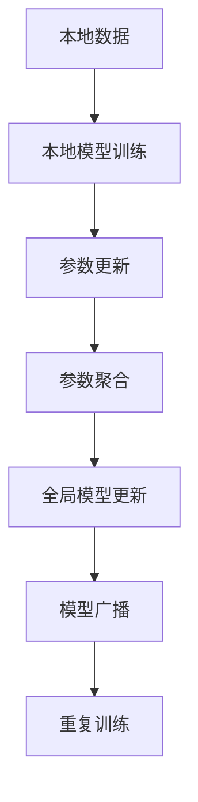

                 

# 神经网络模型的联邦学习实践

> 关键词：联邦学习, 神经网络模型, 分布式学习, 模型优化, 安全与隐私

## 1. 背景介绍

### 1.1 问题由来
随着深度学习技术的迅速发展，大规模神经网络模型（Neural Network Models, NNM）在各个领域（如计算机视觉、自然语言处理、推荐系统等）取得了显著的进展。然而，这些模型通常需要大量的标注数据和强大的计算资源进行训练。在实际应用中，数据分散在不同的地区和机构中，且某些机构对数据共享存在限制，这给模型训练带来了巨大的挑战。

联邦学习（Federated Learning, FL）提供了一种分布式学习的新范式，它允许模型在不共享数据的前提下，在多个拥有本地数据的设备或服务器上进行分布式训练。这不仅降低了数据集中化带来的隐私风险，还能够充分利用分散的数据资源，提高模型的训练效率和泛化能力。

### 1.2 问题核心关键点
联邦学习的大致流程如下：
1. **本地训练**：各个设备或服务器在本地数据集上训练模型。
2. **模型更新**：各设备或服务器定期向中央服务器发送本地模型的参数更新。
3. **参数聚合**：中央服务器将接收到的参数更新进行聚合，更新全局模型。
4. **广播模型**：将更新后的全局模型广播给所有设备或服务器。
5. **重复训练**：重复以上过程，直到模型收敛。

联邦学习的核心在于如何在保护数据隐私的前提下，最大化地利用分布式数据进行模型训练。这一过程中，本地模型的参数更新和聚合是关键步骤，需要谨慎设计和优化。

## 2. 核心概念与联系

### 2.1 核心概念概述

为更好地理解联邦学习及其在大规模神经网络模型中的应用，本节将介绍几个密切相关的核心概念：

- **联邦学习**：一种分布式机器学习范式，多个参与方在本地数据上训练模型，并通过聚合参数更新来提升全局模型性能。
- **神经网络模型**：由多层神经元组成的非线性映射模型，用于处理各种复杂的输入和输出任务。
- **分布式学习**：指多个设备或服务器协同训练模型，可以降低单个设备或服务器的计算负担，加速模型训练。
- **模型优化**：通过优化算法调整模型参数，最小化损失函数，提高模型性能。
- **安全与隐私**：联邦学习特别强调在训练过程中保护本地数据和模型参数的隐私和安全。

这些概念之间的逻辑关系可以通过以下Mermaid流程图来展示：



这个流程图展示了大规模神经网络模型联邦学习的核心流程：

1. 在本地数据上进行模型训练。
2. 收集各本地模型的参数更新。
3. 在中央服务器上对参数更新进行聚合，更新全局模型。
4. 将更新后的全局模型广播给各个本地设备或服务器。
5. 重复训练过程，直到模型收敛。

## 3. 核心算法原理 & 具体操作步骤
### 3.1 算法原理概述

联邦学习算法可以基于不同的优化目标和聚合策略进行设计和实现。其核心思想是：通过各本地设备或服务器的协同训练，最大化全局模型的性能。常用的优化目标包括最小化全局损失函数和最大化全局准确率等。

假设全局模型为 $M_{\theta}$，其中 $\theta$ 为模型参数。本地模型在本地数据集 $D_i$ 上进行训练，得到参数更新 $\Delta_i$。则联邦学习的优化目标为：

$$
\min_{\theta} \sum_{i=1}^N \ell_i(M_{\theta})
$$

其中 $\ell_i$ 为本地模型在本地数据集 $D_i$ 上的损失函数。常见的损失函数包括交叉熵、均方误差等。

在参数聚合过程中，通常采用加权平均或更深层次的聚合方法，如联邦平均（Federated Averaging, FedAvg）。其具体公式为：

$$
\theta_{t+1} = \frac{1}{N}\sum_{i=1}^N (M_i^t + \Delta_i)
$$

其中 $M_i^t$ 为第 $i$ 个本地模型在 $t$ 时刻的参数，$\Delta_i$ 为本地模型的更新量，$t$ 为迭代次数。

### 3.2 算法步骤详解

联邦学习的大致流程如下：

**Step 1: 准备数据和模型**
- 收集各参与方的本地数据 $D_1, D_2, ..., D_N$，这些数据可以是结构化的、非结构化的，甚至是异构的。
- 选择合适的神经网络模型，如卷积神经网络（CNN）、循环神经网络（RNN）、Transformer等。

**Step 2: 初始化模型和超参数**
- 初始化全局模型 $M_{\theta}$，一般可以采用预训练模型或随机初始化。
- 设置联邦学习的基本超参数，如学习率、迭代次数、聚合权重等。

**Step 3: 本地模型训练**
- 各本地设备或服务器在本地数据集 $D_i$ 上训练模型，更新本地模型参数 $M_i^t$。
- 计算本地模型在本地数据集 $D_i$ 上的损失 $\ell_i(M_{\theta})$ 和梯度 $\frac{\partial \ell_i(M_{\theta})}{\partial \theta}$。

**Step 4: 参数聚合**
- 收集各本地模型的参数更新 $\Delta_i$。
- 使用聚合策略（如联邦平均）计算全局模型更新 $\Delta_{avg}$。
- 更新全局模型参数 $\theta_{t+1}$。

**Step 5: 模型广播和重复训练**
- 将更新后的全局模型 $M_{\theta_{t+1}}$ 广播给所有本地设备或服务器。
- 重复训练过程，直到模型收敛或达到预设的迭代次数。

### 3.3 算法优缺点

联邦学习算法具有以下优点：
1. 分布式训练：各本地设备或服务器协同训练，充分利用分布式计算资源，加速模型训练。
2. 数据隐私保护：各本地设备或服务器不需要共享数据，保护了本地数据的隐私。
3. 鲁棒性：分布式训练使得模型对单个设备或服务器的故障具有一定程度的鲁棒性。

同时，联邦学习也存在一些局限性：
1. 通信开销：每次模型更新和参数聚合需要大量的通信开销，尤其是在高维度模型上。
2. 一致性问题：由于各本地设备或服务器的数据分布和计算能力可能不同，可能导致模型不一致。
3. 收敛速度：由于模型在多个设备或服务器上更新，收敛速度可能较慢。

尽管存在这些局限性，但联邦学习在实际应用中仍展现了巨大的潜力和优势。随着通信技术和分布式计算能力的提升，联邦学习的应用前景将更加广阔。

### 3.4 算法应用领域

联邦学习在大规模神经网络模型的应用领域极为广泛，具体包括：

- 计算机视觉：通过联邦学习，多个图像识别模型可以在各自的数据集上训练，提升整体的图像识别能力。
- 自然语言处理：在文本分类、情感分析、机器翻译等任务中，联邦学习可以充分利用分布式数据资源，提升模型的泛化能力。
- 推荐系统：通过联邦学习，各推荐模型可以在用户数据上协同训练，提升推荐系统的个性化和多样性。
- 医疗健康：在医疗影像分析、疾病预测等任务中，联邦学习可以保护患者隐私，同时利用分布式数据提升模型的诊断准确率。
- 金融服务：在信用评分、欺诈检测等任务中，联邦学习可以保护客户数据隐私，同时利用分布式数据提升模型的准确性和鲁棒性。

此外，联邦学习还可以应用于教育、社交网络、智能交通等多个领域，推动数据驱动的智能化应用。

## 4. 数学模型和公式 & 详细讲解  
### 4.1 数学模型构建

假设全局模型 $M_{\theta}$ 在本地数据集 $D_i$ 上的损失函数为 $\ell_i(M_{\theta})$，则联邦学习的优化目标为：

$$
\min_{\theta} \sum_{i=1}^N \ell_i(M_{\theta})
$$

其中 $N$ 为本地数据集的数量。

在每次本地训练后，模型参数的更新量为：

$$
\Delta_i = \eta \nabla_{\theta}\ell_i(M_{\theta})
$$

其中 $\eta$ 为学习率，$\nabla_{\theta}\ell_i(M_{\theta})$ 为损失函数对模型参数的梯度。

在参数聚合过程中，联邦平均的公式为：

$$
\theta_{t+1} = \frac{1}{N}\sum_{i=1}^N (M_i^t + \Delta_i)
$$

其中 $M_i^t$ 为第 $i$ 个本地模型在 $t$ 时刻的参数。

### 4.2 公式推导过程

以联邦平均为例，对公式进行推导。假设全局模型在本地数据集上的损失函数为：

$$
\ell_i(M_{\theta}) = -\frac{1}{|D_i|}\sum_{x\in D_i}y_i\log M_{\theta}(x)
$$

其中 $y_i$ 为标签，$M_{\theta}(x)$ 为模型在输入 $x$ 上的输出。

在本地训练后，模型参数的更新量为：

$$
\Delta_i = \eta \frac{\partial \ell_i(M_{\theta})}{\partial \theta}
$$

将所有本地模型的参数更新量进行加权平均，得到全局模型的更新量：

$$
\Delta_{avg} = \frac{1}{N}\sum_{i=1}^N \Delta_i
$$

将全局模型的更新量代入全局模型的参数更新公式中，得到：

$$
\theta_{t+1} = \theta_t - \Delta_{avg}
$$

### 4.3 案例分析与讲解

以联邦学习在自然语言处理中的应用为例。假设我们有一个文本分类任务，需要将文本分为正面和负面两类。我们收集了多个公司的客户评论数据，每个公司有数百万条评论，这些评论数据分布在不同的服务器上。

我们可以设计如下联邦学习流程：
1. 每个服务器在其本地评论数据上训练一个基于 Transformer 的文本分类模型。
2. 各服务器定期将模型参数更新发送到中央服务器。
3. 中央服务器对参数更新进行加权平均，更新全局模型。
4. 将更新后的全局模型广播给所有服务器。
5. 重复以上过程，直到模型收敛。

通过联邦学习，我们可以充分利用各服务器的数据资源，同时保护客户评论的隐私。最终，联邦学习的文本分类模型在多个服务器上协同训练后，可能比单个服务器上的模型具有更好的泛化能力和鲁棒性。

## 5. 项目实践：代码实例和详细解释说明
### 5.1 开发环境搭建

在进行联邦学习实践前，我们需要准备好开发环境。以下是使用PyTorch和TensorFlow进行联邦学习开发的环境配置流程：

1. 安装Anaconda：从官网下载并安装Anaconda，用于创建独立的Python环境。

2. 创建并激活虚拟环境：
```bash
conda create -n fl-env python=3.8 
conda activate fl-env
```

3. 安装PyTorch和TensorFlow：根据CUDA版本，从官网获取对应的安装命令。例如：
```bash
conda install pytorch torchvision torchaudio cudatoolkit=11.1 -c pytorch -c conda-forge
conda install tensorflow
```

4. 安装必要的依赖包：
```bash
pip install pytorch federated-optics federated-averaging
```

5. 安装PyFedLearn库：
```bash
pip install pyfedlearn
```

完成上述步骤后，即可在`fl-env`环境中开始联邦学习实践。

### 5.2 源代码详细实现

以下是使用PyFedLearn进行联邦学习文本分类的完整代码实现：

```python
from pyfedlearn import federated_averaging as FedAvg
from pyfedlearn.aggregators import AveragingAggregator
from pyfedlearn.models import simple_linear_model
from pyfedlearn.datasets import mnist
import torch
import torch.nn as nn
import torch.nn.functional as F

# 定义联邦学习模型
class LinearModel(nn.Module):
    def __init__(self, input_size, output_size):
        super(LinearModel, self).__init__()
        self.fc = nn.Linear(input_size, output_size)
    
    def forward(self, x):
        return self.fc(x)

# 加载数据集
mnist_data = mnist.load_data()

# 初始化模型和超参数
input_size = mnist_data.train_data.shape[1]
output_size = 2
model = LinearModel(input_size, output_size)
lr = 0.1

# 定义损失函数
criterion = nn.CrossEntropyLoss()

# 定义联邦学习实例
client_count = 5
federated_learning = FedAvg(model, aggregator=FedAvg.AveragingAggregator(), federated_optimizer='adagrad')
federated_learning.load_data(mnist_data)

# 训练过程
num_epochs = 10
for epoch in range(num_epochs):
    federated_learning.run_one_round()
    # 打印训练结果
    print("Epoch:", epoch+1, "Loss:", federated_learning.loss)

# 测试模型
test_data, test_labels = mnist_data.test_data, mnist_data.test_labels
federated_learning.run_one_round(test_data=test_data)
print("Test Accuracy:", federated_learning.accuracy)
```

以上是使用PyFedLearn进行联邦学习文本分类的完整代码实现。可以看到，利用PyFedLearn库，联邦学习的实现变得简洁高效。

### 5.3 代码解读与分析

让我们再详细解读一下关键代码的实现细节：

**LinearModel类**：
- 定义了一个简单的线性分类模型，输入为特征向量，输出为预测标签。

**mnist_data变量**：
- 加载了MNIST数据集，包含训练和测试数据。

**模型初始化**：
- 初始化线性分类模型，定义损失函数，并设置联邦学习实例。

**联邦学习实例**：
- 定义联邦学习实例，设置聚合器和联邦优化器。

**训练过程**：
- 循环训练多次，每次训练迭代过程中，使用联邦学习实例更新模型参数，并在每次迭代后输出训练损失。

**测试模型**：
- 在测试集上评估模型性能，输出测试准确率。

可以看到，联邦学习的代码实现相对简单，但背后涉及的算法和数据处理相对复杂。联邦学习的核心在于如何在保护数据隐私的前提下，实现模型的分布式训练。在实际应用中，还需要根据具体任务的特点，对联邦学习过程的各个环节进行优化设计。

## 6. 实际应用场景
### 6.1 智能推荐系统

基于联邦学习的推荐系统可以有效利用各用户设备或服务器的数据资源，提升推荐系统的个性化和多样性。在推荐系统中，各用户设备或服务器可以分别训练推荐模型，并将模型的参数更新发送到中央服务器进行聚合。

具体而言，可以收集不同用户设备的互动数据，如浏览记录、购买记录、评分等，在这些本地数据上分别训练推荐模型，并通过联邦学习进行参数聚合。最终得到的全局推荐模型可以在保护用户隐私的前提下，提升推荐系统的性能和效果。

### 6.2 医疗影像分析

在医疗影像分析中，联邦学习可以保护患者隐私，同时利用分布式数据提升模型的诊断准确率。医疗影像数据通常非常敏感，且分布在不同的医院和医疗机构中。联邦学习可以使得各医疗机构在本地影像数据上训练模型，然后将模型的参数更新发送到中央服务器进行聚合。

具体而言，可以收集不同医院的医疗影像数据，在这些本地数据上分别训练医学影像识别模型，并通过联邦学习进行参数聚合。最终得到的全局模型可以在保护患者隐私的前提下，提升医学影像识别的准确性和鲁棒性。

### 6.3 智能交通管理

智能交通管理中，各城市的数据资源可以协同训练交通流量预测模型，提升交通管理的智能化水平。在交通流量预测中，各城市的数据资源分布不同，联邦学习可以使得各城市的交通数据在本地上进行模型训练，然后将模型的参数更新发送到中央服务器进行聚合。

具体而言，可以收集不同城市的交通流量数据，在这些本地数据上分别训练交通流量预测模型，并通过联邦学习进行参数聚合。最终得到的全局模型可以在保护数据隐私的前提下，提升交通流量预测的准确性和实时性。

### 6.4 未来应用展望

随着联邦学习技术的不断发展，其在实际应用中的潜力将更加凸显。未来联邦学习的应用领域将不断拓展，为更多行业带来变革性影响。

在智慧城市治理中，联邦学习可以应用于城市事件监测、舆情分析、应急指挥等环节，提高城市管理的自动化和智能化水平。在智能制造中，联邦学习可以应用于设备状态监测、质量控制等任务，提升生产效率和产品品质。

此外，联邦学习还可以应用于金融服务、教育、社交网络等多个领域，推动数据驱动的智能化应用。相信随着联邦学习技术的发展，其在各行业的应用前景将更加广阔。

## 7. 工具和资源推荐
### 7.1 学习资源推荐

为了帮助开发者系统掌握联邦学习及其在大规模神经网络模型中的应用，这里推荐一些优质的学习资源：

1. 《Federated Learning: Concepts, Methodologies, and Future Directions》书籍：该书系统介绍了联邦学习的基本概念、主要算法和未来方向，适合初学者和研究人员阅读。

2. CS224H《机器学习与深度学习》课程：斯坦福大学开设的联邦学习课程，有Lecture视频和配套作业，带你深入理解联邦学习的基本原理和主要算法。

3. HuggingFace官方文档：PyFedLearn库的官方文档，提供了丰富的联邦学习样例代码和理论介绍，是联邦学习实践的重要参考。

4. PyFedLearn官方文档：PyFedLearn库的官方文档，提供了详细的API介绍和联邦学习流程示例，适合快速上手联邦学习实践。

5. Google联邦学习教程：Google提供的联邦学习教程，涵盖联邦学习的基本概念和主要算法，适合初学者和进阶开发者阅读。

通过对这些资源的学习实践，相信你一定能够快速掌握联邦学习技术的精髓，并用于解决实际的机器学习问题。

### 7.2 开发工具推荐

高效的联邦学习开发离不开优秀的工具支持。以下是几款用于联邦学习开发的常用工具：

1. PyFedLearn：基于TensorFlow和PyTorch的联邦学习库，提供了丰富的联邦学习算法和工具，适合快速实现联邦学习任务。

2. Federated-Aggregate：一个轻量级的联邦学习库，支持多种分布式训练和聚合算法，适合小型项目或实验使用。

3. TensorFlow Federated：Google开发的联邦学习库，支持复杂的分布式训练和聚合算法，适合大规模项目或研究使用。

4. PyTorch Federated：PyTorch官方提供的联邦学习库，支持多种联邦学习算法和模型，适合灵活实验使用。

5. Secure SGD：一个安全的联邦学习库，支持差分隐私和联邦学习相结合，适合隐私敏感领域的联邦学习实践。

合理利用这些工具，可以显著提升联邦学习任务的开发效率，加快创新迭代的步伐。

### 7.3 相关论文推荐

联邦学习在大规模神经网络模型中的应用源于学界的持续研究。以下是几篇奠基性的相关论文，推荐阅读：

1. Google's federated learning proposal（Google的联邦学习提案）：提出了联邦学习的基本框架和主要算法，奠定了联邦学习的基础。

2. Privacy-Preserving Collaborative Machine Learning: Methods, Algorithms, and Unified Framework（隐私保护协同机器学习：方法、算法和统一框架）：系统综述了联邦学习的隐私保护方法，对联邦学习的发展具有重要意义。

3. Federated Learning: Concepts and Applications（联邦学习：概念与应用）：总结了联邦学习的概念、主要算法和实际应用，适合初学者和研究人员阅读。

4. Sequential Model Aggregation for Federated Learning（序列模型聚合在联邦学习中的应用）：提出了联邦学习的模型聚合策略，对联邦学习的理论研究具有重要参考价值。

5. Federated learning for large-scale machine learning: sketches（大规模机器学习联邦学习：概述）：对联邦学习在大规模机器学习中的应用进行了系统总结，对联邦学习的实际应用具有重要指导意义。

这些论文代表了大规模神经网络模型联邦学习的发展脉络。通过学习这些前沿成果，可以帮助研究者把握学科前进方向，激发更多的创新灵感。

## 8. 总结：未来发展趋势与挑战
### 8.1 总结

本文对基于联邦学习的大规模神经网络模型实践进行了全面系统的介绍。首先阐述了联邦学习的基本概念和应用背景，明确了联邦学习在分布式数据资源优化利用中的独特价值。其次，从原理到实践，详细讲解了联邦学习在大规模神经网络模型中的应用流程，给出了联邦学习任务开发的完整代码实例。同时，本文还广泛探讨了联邦学习在智能推荐、医疗影像、智能交通等多个行业领域的应用前景，展示了联邦学习范式的巨大潜力。此外，本文精选了联邦学习技术的各类学习资源，力求为读者提供全方位的技术指引。

通过本文的系统梳理，可以看到，联邦学习技术正在成为大规模神经网络模型应用的重要范式，极大地拓展了分布式数据资源的利用边界，催生了更多的落地场景。受益于联邦学习技术的分布式协同训练机制，基于联邦学习的大规模神经网络模型能够在保护数据隐私的前提下，充分利用分布式数据资源，加速模型训练，提高模型性能。未来，随着联邦学习技术的发展和优化，相信其在更多领域的应用前景将更加广阔。

### 8.2 未来发展趋势

展望未来，联邦学习技术将呈现以下几个发展趋势：

1. 分布式协同训练：联邦学习将进一步发展为更为灵活、高效的分布式协同训练框架，支持更大规模、更复杂的网络结构。

2. 隐私保护技术：联邦学习将引入更多的隐私保护技术，如差分隐私、联邦学习-差分隐私结合等，进一步提升数据隐私保护能力。

3. 联邦学习生态系统：联邦学习将逐渐形成一个完整的生态系统，涵盖算法库、工具集、标准化流程等，降低联邦学习的技术门槛和应用难度。

4. 异构设备协同训练：联邦学习将支持异构设备协同训练，如移动设备、嵌入式设备等，推动联邦学习在更多场景中的应用。

5. 实时联邦学习：联邦学习将支持实时联邦学习，实现模型训练和参数更新的实时化，提升系统的响应速度和效率。

6. 跨领域联邦学习：联邦学习将支持跨领域联邦学习，如多任务学习、联邦迁移学习等，实现不同领域知识的整合和迁移。

以上趋势凸显了联邦学习技术的广阔前景。这些方向的探索发展，将进一步推动联邦学习技术在各行业的广泛应用，为人类社会带来更加智能化、隐私化的数据驱动解决方案。

### 8.3 面临的挑战

尽管联邦学习技术已经取得了一定的进展，但在迈向更加智能化、普适化应用的过程中，它仍面临诸多挑战：

1. 通信开销：联邦学习的每次模型更新和参数聚合需要大量的通信开销，尤其是在高维度模型上。如何降低通信开销，提高联邦学习效率，是一个亟待解决的问题。

2. 异构设备协同：不同设备或服务器的计算能力、存储资源差异较大，如何实现高效、一致的模型训练和参数聚合，是一个复杂的技术挑战。

3. 隐私保护：联邦学习需要在保护数据隐私的前提下，实现高效的模型训练和参数聚合。如何平衡隐私保护和模型性能，是一个重要的研究方向。

4. 鲁棒性和公平性：联邦学习模型在不同的设备和服务器上训练，可能存在一致性问题，如何保证模型的鲁棒性和公平性，是一个需要深入探讨的问题。

5. 可扩展性和可解释性：联邦学习需要支持大规模数据和复杂模型的训练，同时需要提高模型的可解释性和可调试性，以便于模型诊断和优化。

6. 安全与隐私：联邦学习需要确保模型训练和参数聚合过程中的安全性和隐私保护，防止数据泄露和恶意攻击。

正视联邦学习面临的这些挑战，积极应对并寻求突破，将是大规模神经网络模型联邦学习走向成熟的必由之路。相信随着学界和产业界的共同努力，这些挑战终将一一被克服，联邦学习必将在构建安全、可靠、高效的分布式机器学习系统方面发挥重要作用。

### 8.4 研究展望

面向未来，联邦学习的研究还需要在以下几个方面寻求新的突破：

1. 探索更高效的分布式训练算法：开发更高效的分布式协同训练算法，降低通信开销，提高联邦学习的效率和效果。

2. 引入更多的隐私保护技术：引入差分隐私、联邦学习-差分隐私结合等隐私保护技术，提升数据隐私保护能力，同时保持模型的准确性。

3. 支持异构设备协同训练：开发支持异构设备协同训练的联邦学习算法，提升联邦学习的可扩展性和灵活性。

4. 优化联邦学习模型的可解释性：开发可解释性更强的联邦学习模型，提高模型的可解释性和可调试性，便于模型诊断和优化。

5. 结合其他机器学习技术：将联邦学习与强化学习、迁移学习等技术相结合，形成更加全面、高效的机器学习系统。

6. 构建联邦学习生态系统：建立联邦学习标准和工具集，推动联邦学习技术的广泛应用和规范化。

这些研究方向的探索，必将引领联邦学习技术迈向更高的台阶，为大规模神经网络模型的分布式协同训练提供更加高效、安全的解决方案。只有勇于创新、敢于突破，才能不断拓展联邦学习技术的边界，推动人工智能技术的创新发展。

## 9. 附录：常见问题与解答

**Q1：联邦学习是否适用于所有分布式数据资源？**

A: 联邦学习在数据分布均匀、计算资源充足的情况下表现较好。如果各本地设备或服务器的计算能力和数据量存在较大差异，联邦学习的效率和效果可能会受到影响。此时，需要引入更复杂的数据划分和优化策略，如层次化联邦学习、异构设备协同训练等。

**Q2：联邦学习中如何确保模型的一致性？**

A: 模型一致性是联邦学习的关键挑战之一。不同本地设备或服务器上的模型参数更新可能存在差异，因此需要引入适当的聚合策略和权重调整机制，如联邦平均、加权平均等。同时，可以通过引入差分隐私技术，降低模型更新过程中的噪声，提升模型的一致性。

**Q3：联邦学习中如何处理数据不平衡问题？**

A: 数据不平衡是联邦学习中常见的问题。通常情况下，可以通过重采样、加权平均等方法处理数据不平衡问题。重采样方法包括欠采样、过采样等，可以在一定程度上平衡数据分布。加权平均方法可以在聚合参数更新时，对不平衡的数据给予更大的权重，提升模型的泛化能力。

**Q4：联邦学习中如何确保数据隐私？**

A: 数据隐私保护是联邦学习的核心目标之一。在数据传输和参数聚合过程中，可以采用差分隐私、同态加密等技术保护数据隐私。差分隐私通过引入噪声，保护个体数据的隐私。同态加密通过加密计算，保护数据的隐私性和完整性。

**Q5：联邦学习中如何处理模型过拟合问题？**

A: 模型过拟合是联邦学习中常见的问题。通常情况下，可以通过正则化、Dropout等方法控制模型的复杂度，避免过拟合。正则化方法可以在损失函数中加入正则化项，限制模型的参数更新。Dropout方法可以在训练过程中随机丢弃部分神经元，提升模型的泛化能力。

这些研究方向的探索，必将引领联邦学习技术迈向更高的台阶，为大规模神经网络模型的分布式协同训练提供更加高效、安全的解决方案。只有勇于创新、敢于突破，才能不断拓展联邦学习技术的边界，推动人工智能技术的创新发展。

