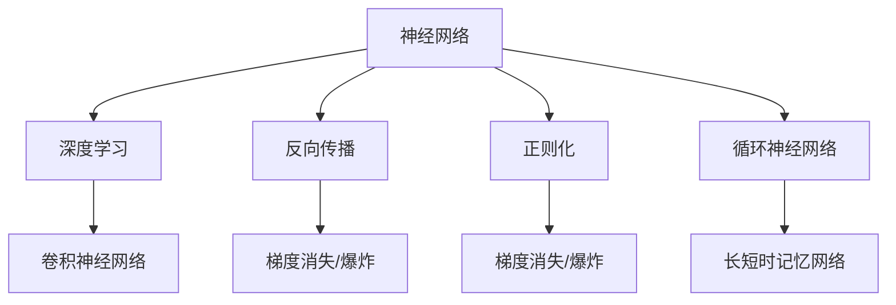

                 

# 神经网络：人类智慧的延伸

> 关键词：神经网络，深度学习，人工智能，机器学习，计算机视觉，自然语言处理，计算机图形学

## 1. 背景介绍

### 1.1 问题由来
在人工智能发展的历程中，神经网络作为一种仿生学思想，被广泛应用于各个领域，包括计算机视觉、自然语言处理、计算机图形学等。深度学习的兴起，尤其是神经网络的突破，为人类智能的延伸提供了新的可能性。

神经网络不仅能够模仿人脑的神经元机制，进行信息的处理和传输，还能够通过复杂的非线性变换，从数据中自动学习特征，实现对复杂模式的识别和预测。通过多层次、多维度的非线性映射，神经网络能够高效处理大规模数据，识别数据中的隐含模式，并在各个领域展现出了强大的应用潜力。

近年来，深度学习技术的快速发展，使得神经网络在图像识别、语音识别、自然语言处理等方面取得了显著的突破，甚至在某些任务上超越了人类。神经网络不仅改变了人工智能的发展方向，也逐渐成为各行各业智能化改造的重要工具。

### 1.2 问题核心关键点
神经网络的核心在于其多层次的神经元模型，通过多层非线性变换，捕捉数据的高维特征。其关键在于：

- 参数共享：每一层神经元共享相同的权重，通过反向传播算法更新权重，实现全局最优。
- 非线性变换：通过激活函数引入非线性，增加网络的表达能力。
- 层次结构：通过多层结构，逐步提取高层次的抽象特征。
- 网络融合：通过集成学习，整合多模型输出，提高泛化能力。

神经网络的这些特性使得其能够在处理复杂数据时具有明显的优势，但也带来了高计算量、易过拟合、参数难调等问题。未来，神经网络的研究将聚焦于提升模型效率、提高泛化能力和可解释性等方面，以更好地服务于各个领域。

## 2. 核心概念与联系

### 2.1 核心概念概述

为更好地理解神经网络的工作原理和优化方法，本节将介绍几个关键概念：

- 神经网络(Neural Network)：以神经元为基本单元的计算模型，通过多层神经元间连接，实现信息处理和模式识别。
- 深度学习(Deep Learning)：以神经网络为基础，通过多层次的非线性变换，自动学习数据的特征表示，从而实现高效的模式识别和预测。
- 反向传播(Backpropagation)：通过链式法则计算网络中每个参数的梯度，实现权重更新。
- 梯度消失/爆炸问题(Vanishing/Exploding Gradient)：在多层网络中，梯度在反向传播过程中可能衰减或爆炸，导致训练困难。
- 正则化(Regularization)：通过L1、L2正则、Dropout等方法，防止过拟合，提高模型的泛化能力。
- 卷积神经网络(Convolutional Neural Network, CNN)：针对图像数据，通过卷积操作捕捉局部特征，实现图像分类、目标检测等任务。
- 循环神经网络(Recurrent Neural Network, RNN)：针对序列数据，通过循环结构捕捉时间依赖关系，实现语言建模、机器翻译等任务。
- 长短时记忆网络(Long Short-Term Memory, LSTM)：针对RNN的梯度消失问题，通过门控机制提升长序列建模能力，实现文本生成、语音识别等任务。

这些概念之间的逻辑关系可以通过以下Mermaid流程图来展示：



这个流程图展示了大规模神经网络的关键概念及其之间的关系：

1. 神经网络通过深度学习，实现高维数据的特征学习。
2. 反向传播算法计算梯度，更新网络参数。
3. 正则化方法防止过拟合，提升泛化能力。
4. 卷积神经网络针对图像数据，通过局部连接捕捉特征。
5. 循环神经网络针对序列数据，通过循环结构捕捉时间依赖。
6. 长短时记忆网络通过门控机制提升长序列建模能力。

这些概念共同构成了神经网络的研究框架，使其能够在各种数据类型上实现高效的模式识别和预测。

## 3. 核心算法原理 & 具体操作步骤
### 3.1 算法原理概述

神经网络通过多层非线性变换，自动学习数据的特征表示，从而实现模式识别和预测。其核心思想是通过反向传播算法，不断调整网络参数，最小化损失函数。

假设给定训练数据集 $D=\{(x_i, y_i)\}_{i=1}^N$，其中 $x_i \in \mathbb{R}^d$ 为输入向量，$y_i \in \mathbb{R}^k$ 为输出向量，$k$ 为输出维度。定义损失函数 $L(\theta)$ 为模型预测输出与真实标签之间的差异，例如均方误差损失：

$$
L(\theta) = \frac{1}{N} \sum_{i=1}^N ||y_i - f(x_i; \theta)||^2
$$

其中 $f(x_i; \theta)$ 为模型在输入 $x_i$ 下的预测输出。通过梯度下降等优化算法，神经网络不断更新参数 $\theta$，最小化损失函数 $L(\theta)$，使得模型输出逼近真实标签。

### 3.2 算法步骤详解

神经网络的训练过程主要包括以下几个步骤：

**Step 1: 准备数据集**
- 收集训练数据集 $D$，进行预处理，如归一化、数据增强等。
- 划分数据集为训练集、验证集和测试集。

**Step 2: 搭建网络结构**
- 根据任务特点，选择合适的网络架构，如全连接网络、卷积网络、循环网络等。
- 设置网络参数，包括层数、每层的神经元数量、激活函数等。

**Step 3: 初始化参数**
- 随机初始化网络参数 $\theta$，一般使用均值0、方差小的正态分布或均匀分布。

**Step 4: 前向传播计算**
- 将训练数据输入网络，通过多层非线性变换，计算出预测输出。
- 计算损失函数 $L(\theta)$。

**Step 5: 反向传播更新**
- 通过链式法则计算梯度 $\nabla_{\theta} L(\theta)$。
- 使用优化算法更新网络参数 $\theta$。

**Step 6: 验证和测试**
- 在验证集上评估模型性能，调整超参数。
- 在测试集上测试模型性能，评估模型泛化能力。

### 3.3 算法优缺点

神经网络在处理大规模数据时具有显著优势，但也存在一些问题：

**优点：**

1. 高效特征学习：神经网络能够自动学习数据的复杂特征，无需手动提取特征。
2. 泛化能力强：通过多层次非线性变换，神经网络能够捕捉高维数据的复杂模式。
3. 并行计算：神经网络能够充分利用GPU、TPU等高性能硬件，加速模型训练。
4. 开源易用：众多开源深度学习框架（如TensorFlow、PyTorch等）提供了便捷的神经网络实现和训练工具。

**缺点：**

1. 计算量大：神经网络需要大量的计算资源进行训练和推理。
2. 易过拟合：神经网络容易过拟合训练数据，泛化能力较弱。
3. 参数难调：神经网络参数众多，难以进行精确的调参。
4. 可解释性差：神经网络模型往往被视为"黑盒"，难以解释其内部工作机制。

尽管存在这些缺点，神经网络凭借其在模式识别和预测方面的优势，已经成为人工智能领域最重要的工具之一。未来，神经网络的研究将进一步探索高效参数化、提升泛化能力、增强可解释性等方面，以更好地服务于各个领域。

### 3.4 算法应用领域

神经网络在各个领域中得到了广泛应用，以下是几个典型的例子：

1. 计算机视觉：神经网络在图像分类、目标检测、人脸识别等方面展现了强大的能力。
2. 自然语言处理：神经网络在机器翻译、语言生成、文本分类等方面取得了显著进展。
3. 计算机图形学：神经网络用于生成高质量的图像、视频、音频等。
4. 医疗诊断：神经网络在医学影像分析、疾病预测等方面帮助医生进行辅助诊断。
5. 金融风控：神经网络用于信用评估、风险管理、股票预测等方面。
6. 工业制造：神经网络用于质量控制、设备维护、流程优化等方面。

随着深度学习技术的不断进步，神经网络的应用范围将进一步拓展，为各行各业带来革命性的改变。

## 4. 数学模型和公式 & 详细讲解 & 举例说明
### 4.1 数学模型构建

神经网络的数学模型可以表示为：

$$
f(x; \theta) = \sigma(\sum_{i=1}^k w_i \phi(x_i; \theta) + b_i)
$$

其中 $x \in \mathbb{R}^d$ 为输入向量，$w_i \in \mathbb{R}^d$ 为第 $i$ 层的权重，$\phi(x_i; \theta)$ 为第 $i$ 层的非线性变换，$b_i \in \mathbb{R}$ 为第 $i$ 层的偏置，$\sigma$ 为激活函数。

在训练过程中，通过反向传播算法，计算损失函数的梯度，更新权重和偏置：

$$
\theta \leftarrow \theta - \eta \nabla_{\theta} L(\theta)
$$

其中 $\eta$ 为学习率。

### 4.2 公式推导过程

以二分类任务为例，假设模型在输入 $x$ 下的输出为 $f(x; \theta) \in [0,1]$，表示样本属于正类的概率。真实标签 $y \in \{0,1\}$。则二分类交叉熵损失函数定义为：

$$
L(\theta) = -[y\log f(x; \theta) + (1-y)\log(1-f(x; \theta))]
$$

其梯度为：

$$
\frac{\partial L(\theta)}{\partial \theta} = -y \frac{\partial f(x; \theta)}{\partial \theta} + (1-y) \frac{\partial (1-f(x; \theta))}{\partial \theta}
$$

通过链式法则，可以得到每个权重和偏置的更新公式。

在实际应用中，常用的一些激活函数包括Sigmoid、ReLU、Tanh等。不同激活函数对神经网络的性能和训练速度有不同影响。

### 4.3 案例分析与讲解

以图像分类为例，使用卷积神经网络(CNN)处理MNIST手写数字数据。具体步骤如下：

1. 准备数据集：收集MNIST数据集，进行预处理和划分。
2. 搭建网络结构：设计一个3层卷积神经网络，包括卷积层、池化层、全连接层等。
3. 初始化参数：随机初始化网络权重和偏置。
4. 前向传播计算：将训练数据输入网络，计算出预测输出。
5. 反向传播更新：计算损失函数梯度，使用优化算法更新权重和偏置。
6. 验证和测试：在验证集上评估模型性能，调整超参数。
7. 在测试集上测试模型性能，评估模型泛化能力。

以下是一个简单的PyTorch实现示例：

```python
import torch
import torch.nn as nn
import torch.optim as optim
import torchvision
import torchvision.transforms as transforms

# 准备数据集
transform = transforms.Compose([
    transforms.ToTensor(),
    transforms.Normalize((0.5,), (0.5,))
])

trainset = torchvision.datasets.MNIST(root='./data', train=True, download=True, transform=transform)
trainloader = torch.utils.data.DataLoader(trainset, batch_size=64, shuffle=True)

testset = torchvision.datasets.MNIST(root='./data', train=False, download=True, transform=transform)
testloader = torch.utils.data.DataLoader(testset, batch_size=64, shuffle=False)

# 搭建网络结构
class Net(nn.Module):
    def __init__(self):
        super(Net, self).__init__()
        self.conv1 = nn.Conv2d(1, 32, 3, 1)
        self.conv2 = nn.Conv2d(32, 64, 3, 1)
        self.dropout1 = nn.Dropout2d(0.25)
        self.dropout2 = nn.Dropout2d(0.5)
        self.fc1 = nn.Linear(9216, 128)
        self.fc2 = nn.Linear(128, 10)

    def forward(self, x):
        x = self.conv1(x)
        x = nn.functional.relu(x)
        x = nn.functional.max_pool2d(x, 2)
        x = self.dropout1(x)
        x = self.conv2(x)
        x = nn.functional.relu(x)
        x = nn.functional.max_pool2d(x, 2)
        x = self.dropout2(x)
        x = torch.flatten(x, 1)
        x = self.fc1(x)
        x = nn.functional.relu(x)
        x = self.dropout2(x)
        x = self.fc2(x)
        output = nn.functional.log_softmax(x, dim=1)
        return output

# 初始化参数
model = Net()
criterion = nn.NLLLoss()
optimizer = optim.Adam(model.parameters(), lr=0.001)

# 前向传播计算
for epoch in range(10):
    running_loss = 0.0
    for i, data in enumerate(trainloader, 0):
        inputs, labels = data
        optimizer.zero_grad()
        outputs = model(inputs)
        loss = criterion(outputs, labels)
        loss.backward()
        optimizer.step()
        running_loss += loss.item()
        if i % 2000 == 1999:  # 每2000个批次输出一次结果
            print(f'Epoch {epoch+1}, loss: {running_loss/2000:.3f}')

# 反向传播更新
# 验证和测试
# ...
```

这个示例展示了使用PyTorch搭建卷积神经网络，训练图像分类模型的全过程。通过前向传播和反向传播，神经网络逐步学习数据特征，并在验证集上评估性能。

## 5. 项目实践：代码实例和详细解释说明
### 5.1 开发环境搭建

在进行神经网络项目开发前，需要准备好开发环境。以下是使用Python进行TensorFlow开发的环境配置流程：

1. 安装Anaconda：从官网下载并安装Anaconda，用于创建独立的Python环境。

2. 创建并激活虚拟环境：
```bash
conda create -n tf-env python=3.8 
conda activate tf-env
```

3. 安装TensorFlow：根据CUDA版本，从官网获取对应的安装命令。例如：
```bash
conda install tensorflow tensorflow-gpu=2.8 -c conda-forge -c pytorch
```

4. 安装各类工具包：
```bash
pip install numpy pandas scikit-learn matplotlib tqdm jupyter notebook ipython
```

完成上述步骤后，即可在`tf-env`环境中开始神经网络实践。

### 5.2 源代码详细实现

这里以手写数字识别为例，展示使用TensorFlow实现卷积神经网络的代码实现。

首先，定义模型和优化器：

```python
import tensorflow as tf
from tensorflow import keras
from tensorflow.keras import layers

# 搭建网络结构
model = keras.Sequential([
    layers.Conv2D(32, kernel_size=(3, 3), activation='relu', input_shape=(28, 28, 1)),
    layers.MaxPooling2D(pool_size=(2, 2)),
    layers.Flatten(),
    layers.Dense(128, activation='relu'),
    layers.Dense(10, activation='softmax')
])

# 设置优化器和损失函数
optimizer = tf.keras.optimizers.Adam(learning_rate=0.001)
loss = tf.keras.losses.SparseCategoricalCrossentropy(from_logits=True)

# 编译模型
model.compile(optimizer=optimizer, loss=loss, metrics=['accuracy'])
```

然后，定义训练和评估函数：

```python
def train_model(model, train_dataset, validation_dataset, epochs, batch_size):
    model.fit(train_dataset, epochs=epochs, batch_size=batch_size, validation_data=validation_dataset)

def evaluate_model(model, test_dataset, batch_size):
    test_loss, test_acc = model.evaluate(test_dataset, batch_size=batch_size)
    print(f'Test loss: {test_loss:.4f}')
    print(f'Test accuracy: {test_acc:.4f}')
```

接着，启动训练流程并在测试集上评估：

```python
# 加载数据集
(train_images, train_labels), (test_images, test_labels) = keras.datasets.mnist.load_data()
train_images = train_images.reshape(-1, 28, 28, 1).astype('float32') / 255.0
test_images = test_images.reshape(-1, 28, 28, 1).astype('float32') / 255.0

# 标准化数据
train_images = (train_images - 0.5) / 0.5
test_images = (test_images - 0.5) / 0.5

# 数据增强
train_generator = tf.data.Dataset.from_tensor_slices((train_images, train_labels))
train_generator = train_generator.shuffle(buffer_size=1024).batch(batch_size=64).map(lambda x, y: (x, y))

test_generator = tf.data.Dataset.from_tensor_slices((test_images, test_labels))
test_generator = test_generator.batch(batch_size=64).map(lambda x, y: (x, y))

# 训练模型
epochs = 10
batch_size = 64

train_model(model, train_generator, validation_generator, epochs, batch_size)

# 评估模型
evaluate_model(model, test_generator, batch_size)
```

这个示例展示了使用TensorFlow搭建卷积神经网络，训练图像分类模型的全过程。通过前向传播和反向传播，神经网络逐步学习数据特征，并在验证集上评估性能。

### 5.3 代码解读与分析

让我们再详细解读一下关键代码的实现细节：

**定义模型和优化器**：
- 使用Sequential模型定义网络结构，包括卷积层、池化层、全连接层等。
- 设置优化器为Adam，学习率为0.001，损失函数为交叉熵损失。

**训练函数**：
- 使用model.fit方法训练模型，指定训练集、验证集、epoch数和batch size等参数。
- 在每个epoch结束后，使用validation_data评估模型性能。

**评估函数**：
- 使用model.evaluate方法在测试集上评估模型性能，输出损失和准确率。

**启动训练流程**：
- 加载MNIST数据集，进行预处理和标准化。
- 使用tf.data.Dataset生成数据集，并进行数据增强。
- 在训练集上训练模型，并在验证集上评估性能。
- 在测试集上测试模型性能。

可以看到，TensorFlow提供了便捷的深度学习实现工具，使得神经网络项目开发变得简洁高效。开发者可以将更多精力放在数据处理、模型改进等高层逻辑上，而不必过多关注底层的实现细节。

当然，工业级的系统实现还需考虑更多因素，如模型的保存和部署、超参数的自动搜索、更灵活的任务适配层等。但核心的神经网络训练过程基本与此类似。

## 6. 实际应用场景
### 6.1 计算机视觉

神经网络在计算机视觉领域有着广泛的应用。其能够自动识别和分类图像、检测目标、生成图像等。具体应用包括：

- 图像分类：识别图像中的对象或场景，如CIFAR-10、ImageNet等数据集上的图像分类任务。
- 目标检测：检测图像中的特定对象，如YOLO、Faster R-CNN等方法。
- 图像生成：生成高质量的图像，如GANs、VAEs等生成模型。
- 图像分割：将图像中的不同区域分割出来，如语义分割、实例分割等。

这些应用展示了神经网络在计算机视觉领域的高效和准确。

### 6.2 自然语言处理

神经网络在自然语言处理(NLP)领域也得到了广泛应用。其能够处理文本数据，自动提取特征，进行文本分类、语言建模、机器翻译等任务。具体应用包括：

- 文本分类：将文本分为不同的类别，如情感分析、主题分类等。
- 语言建模：生成符合语言规则的文本，如语言模型、文本生成等。
- 机器翻译：将一种语言的文本翻译成另一种语言的文本，如神经机器翻译(NMT)。
- 命名实体识别：从文本中识别出人名、地名、组织机构名等实体。

这些应用展示了神经网络在自然语言处理领域的高效和准确。

### 6.3 计算机图形学

神经网络在计算机图形学中也得到了广泛应用。其能够生成高质量的图像、视频、音频等。具体应用包括：

- 图像生成：生成高分辨率、逼真的图像，如GANs、StyleGANs等生成模型。
- 视频生成：生成动态的图像序列，如视频生成、动态图形等。
- 声音生成：生成高质量的声音，如WaveNet、Tacotron等声学模型。
- 动画制作：生成逼真的动画效果，如时序建模、动画生成等。

这些应用展示了神经网络在计算机图形学领域的高效和准确。

### 6.4 未来应用展望

神经网络未来将进一步拓展应用领域，推动人工智能技术的广泛应用。以下列举一些未来的发展方向：

1. 自适应学习：神经网络能够根据数据分布自动调整模型参数，提高泛化能力。
2. 跨模态学习：神经网络能够同时处理视觉、语音、文本等多种数据类型，实现多模态信息融合。
3. 增量学习：神经网络能够持续学习新数据，适应数据分布变化，提高系统的长期稳定性和鲁棒性。
4. 对抗学习：神经网络能够学习对抗样本，提升模型的鲁棒性和安全性。
5. 跨领域迁移：神经网络能够将一个领域学到的知识迁移到另一个领域，提高模型的适应性。
6. 模型压缩与加速：神经网络能够通过剪枝、量化等技术，提高模型的压缩率和计算效率。

这些方向展示了神经网络未来的发展潜力和应用前景。

## 7. 工具和资源推荐
### 7.1 学习资源推荐

为了帮助开发者系统掌握神经网络的理论基础和实践技巧，这里推荐一些优质的学习资源：

1. 《深度学习》（Ian Goodfellow等著）：深度学习领域的经典教材，系统介绍了深度学习的基本概念和算法。
2. 《神经网络与深度学习》（Michael Nielsen著）：介绍了神经网络的基本原理和实现方法，适合入门学习。
3. 《TensorFlow官方文档》：TensorFlow的官方文档，提供了详细的API参考和教程，适合深入学习。
4. 《PyTorch官方文档》：PyTorch的官方文档，提供了丰富的实例和案例，适合开发实践。
5. 《动手学深度学习》：李沐等人编写的深度学习教程，讲解详细，实践性强。

通过对这些资源的学习实践，相信你一定能够快速掌握神经网络的基本原理和应用技巧，并用于解决实际的NLP问题。

### 7.2 开发工具推荐

高效的开发离不开优秀的工具支持。以下是几款用于神经网络微调开发的常用工具：

1. TensorFlow：由Google主导开发的开源深度学习框架，生产部署方便，适合大规模工程应用。
2. PyTorch：基于Python的开源深度学习框架，灵活动态的计算图，适合快速迭代研究。
3. Keras：高层次的深度学习API，简单易用，适合快速原型设计和模型验证。
4. MXNet：由Apache开发的开源深度学习框架，支持多种硬件和语言，适合大规模分布式训练。
5. Caffe：由Berkeley Vision and Learning Center开发的深度学习框架，适用于计算机视觉任务。
6. Torch：由Torch社区开发的深度学习框架，支持多种语言和硬件，适合学术研究和实验原型。

合理利用这些工具，可以显著提升神经网络项目开发效率，加快创新迭代的步伐。

### 7.3 相关论文推荐

神经网络在深度学习领域的快速发展，得益于众多学者的持续研究。以下是几篇奠基性的相关论文，推荐阅读：

1. Deep Blue Book（Ian Goodfellow著）：深度学习领域的经典教材，全面介绍了深度学习的基本原理和算法。
2. ImageNet Classification with Deep Convolutional Neural Networks（Alex Krizhevsky等著）：介绍使用深度卷积神经网络进行图像分类的方法，刷新了图像识别领域的SOTA。
3. Attention is All You Need（J亚当斯著）：提出Transformer结构，开启了NLP领域的预训练大模型时代。
4. A Neural Probabilistic Language Model（Bengio等著）：提出神经语言模型，奠定了语言模型研究的基础。
5. The Google Brain Team on Neural Machine Translation（Wu等著）：介绍使用深度神经网络进行机器翻译的方法，刷新了机器翻译领域的SOTA。
6. Generative Adversarial Nets（Goodfellow等著）：提出GANs模型，实现高质量的图像生成。

这些论文代表了大规模神经网络的研究进展。通过学习这些前沿成果，可以帮助研究者把握学科前进方向，激发更多的创新灵感。

## 8. 总结：未来发展趋势与挑战

### 8.1 总结

本文对神经网络的基本原理和应用进行了全面系统的介绍。首先阐述了神经网络在人工智能中的重要性，强调了其高效特征学习和泛化能力。其次，从原理到实践，详细讲解了神经网络的训练过程和常见问题。最后，展示了神经网络在计算机视觉、自然语言处理、计算机图形学等领域的广泛应用，并展望了未来的发展趋势。

通过本文的系统梳理，可以看到，神经网络已经成为了人工智能领域的重要工具，其在模式识别和预测方面的优势，使其在各个领域展现出强大的应用潜力。未来，神经网络的研究将继续探索高效参数化、提升泛化能力、增强可解释性等方面，以更好地服务于各个领域。

### 8.2 未来发展趋势

展望未来，神经网络的研究将呈现以下几个发展趋势：

1. 高效参数化：神经网络将继续探索高效参数化方法，如参数共享、稀疏化等，减小模型规模，提高计算效率。
2. 泛化能力提升：神经网络将通过增量学习、跨领域迁移等技术，提升模型的泛化能力和适应性。
3. 可解释性增强：神经网络将结合符号推理、可解释性AI等技术，增强模型的可解释性和可控性。
4. 跨模态融合：神经网络将通过多模态信息融合，实现视觉、语音、文本等多种数据类型的协同建模。
5. 对抗学习应用：神经网络将结合对抗学习技术，提升模型的鲁棒性和安全性。
6. 模型压缩与加速：神经网络将通过剪枝、量化、混合精度等技术，提高模型的压缩率和计算效率。

这些趋势展示了神经网络未来的发展潜力和应用前景。

### 8.3 面临的挑战

尽管神经网络在深度学习领域取得了显著进展，但仍面临着一些挑战：

1. 数据需求高：神经网络需要大量标注数据进行训练，标注成本较高，难以适应所有任务。
2. 模型复杂度高：神经网络模型参数众多，难以进行精确的调参，导致训练困难。
3. 计算资源需求高：神经网络需要大量的计算资源进行训练和推理，难以在资源受限的环境中部署。
4. 可解释性差：神经网络模型往往被视为"黑盒"，难以解释其内部工作机制，影响应用的可信度和可控性。
5. 安全风险高：神经网络模型可能学习到有害信息，产生误导性输出，带来安全风险。
6. 迁移能力有限：神经网络在目标任务和预训练数据分布差异较大时，迁移性能有限，难以实现跨领域应用。

尽管存在这些挑战，神经网络在深度学习领域依然展现出强大的生命力和应用前景。未来，神经网络的研究将继续探索高效参数化、提升泛化能力、增强可解释性等方面，以更好地服务于各个领域。

### 8.4 研究展望

面对神经网络所面临的挑战，未来的研究需要在以下几个方面寻求新的突破：

1. 数据高效利用：通过数据增强、自监督学习等技术，降低神经网络对标注数据的需求，提高数据利用效率。
2. 模型压缩与加速：通过剪枝、量化、混合精度等技术，减小模型规模，提高计算效率。
3. 对抗学习：通过生成对抗样本，提升神经网络的鲁棒性和安全性，防范攻击。
4. 跨领域迁移：通过迁移学习、多任务学习等技术，提升神经网络的跨领域迁移能力，实现知识共享。
5. 模型解释性：通过可解释性AI、符号推理等技术，增强神经网络的可解释性和可控性，提升应用可信度。
6. 知识图谱融合：通过与知识图谱、规则库等专家知识的融合，增强神经网络的知识整合能力，提升模型的准确性和鲁棒性。

这些方向展示了神经网络未来研究的突破口。通过这些技术的结合应用，神经网络将进一步拓展应用边界，提升模型性能，为人工智能技术的广泛应用提供坚实的基础。

## 9. 附录：常见问题与解答

**Q1：神经网络在实际应用中如何避免过拟合？**

A: 神经网络在实际应用中可以通过以下方法避免过拟合：

1. 数据增强：通过旋转、裁剪、平移等方式扩充训练集，增加数据多样性。
2. 正则化：使用L1、L2正则、Dropout等方法，防止过拟合。
3. 早停策略：在验证集上评估模型性能，当性能不再提升时停止训练。
4. 批标准化：在每个批次上标准化输入数据，提高模型的泛化能力。
5. 模型融合：将多个模型的输出进行融合，提升模型的泛化能力。

这些方法可以结合使用，最大化地降低神经网络的过拟合风险。

**Q2：神经网络在实际应用中如何提高泛化能力？**

A: 神经网络在实际应用中可以通过以下方法提高泛化能力：

1. 数据集扩充：收集更多的训练数据，增加数据集的多样性。
2. 正则化：使用L1、L2正则、Dropout等方法，防止过拟合。
3. 批标准化：在每个批次上标准化输入数据，提高模型的泛化能力。
4. 模型融合：将多个模型的输出进行融合，提升模型的泛化能力。
5. 迁移学习：在目标任务上微调预训练模型，提高模型的泛化能力。

这些方法可以结合使用，最大化地提高神经网络的泛化能力。

**Q3：神经网络在实际应用中如何处理噪声数据？**

A: 神经网络在实际应用中可以通过以下方法处理噪声数据：

1. 数据清洗：删除明显的噪声数据，提高数据质量。
2. 数据增强：通过旋转、裁剪、平移等方式扩充训练集，增加数据多样性。
3. 噪声注入：在训练过程中引入噪声，提高模型的鲁棒性。
4. 模型融合：将多个模型的输出进行融合，提升模型的鲁棒性。

这些方法可以结合使用，最大化地提高神经网络处理噪声数据的能力。

**Q4：神经网络在实际应用中如何进行超参数调优？**

A: 神经网络在实际应用中可以通过以下方法进行超参数调优：

1. 网格搜索：遍历所有可能的超参数组合，找到最优参数。
2. 随机搜索：随机选择超参数进行训练，找到最优参数。
3. 贝叶斯优化：通过贝叶斯方法，快速找到最优超参数。
4. 学习率自适应：根据训练过程中模型性能，动态调整学习率。

这些方法可以结合使用，最大化地找到最优超参数。

**Q5：神经网络在实际应用中如何进行模型部署？**

A: 神经网络在实际应用中可以通过以下方法进行模型部署：

1. 模型裁剪：去除不必要的层和参数，减小模型尺寸，加快推理速度。
2. 量化加速：将浮点模型转为定点模型，压缩存储空间，提高计算效率。
3. 服务化封装：将模型封装为标准化服务接口，便于集成调用。
4. 模型压缩：通过剪枝、量化、混合精度等技术，减小模型规模，提高计算效率。
5. 模型优化：针对特定硬件平台进行模型优化，提高推理效率。

这些方法可以结合使用，最大化地提高神经网络的模型部署效率。

**Q6：神经网络在实际应用中如何进行模型评估？**

A: 神经网络在实际应用中可以通过以下方法进行模型评估：

1. 准确率：计算模型在测试集上的正确率，评估模型的分类能力。
2. F1分数：计算模型的精确率和召回率，评估模型的识别能力。
3. ROC曲线：绘制模型在不同阈值下的真正率和假正率，评估模型的分类能力。
4. 混淆矩阵：绘制模型在各个类别上的分类情况，评估模型的识别能力。
5. 损失函数：计算模型在测试集上的损失函数，评估模型的回归能力。

这些方法可以结合使用，最大化地评估神经网络的模型性能。

**Q7：神经网络在实际应用中如何进行模型调优？**

A: 神经网络在实际应用中可以通过以下方法进行模型调优：

1. 参数共享：通过参数共享，减小模型规模，提高计算效率。
2. 稀疏化：通过稀疏化，减小模型参数，提高计算效率。
3. 混合精度：通过混合精度，减小模型参数，提高计算效率。
4. 正则化：使用L1、L2正则、Dropout等方法，防止过拟合。
5. 数据增强：通过旋转、裁剪、平移等方式扩充训练集，增加数据多样性。

这些方法可以结合使用，最大化地提高神经网络的模型调优效果。

---

作者：禅与计算机程序设计艺术 / Zen and the Art of Computer Programming

