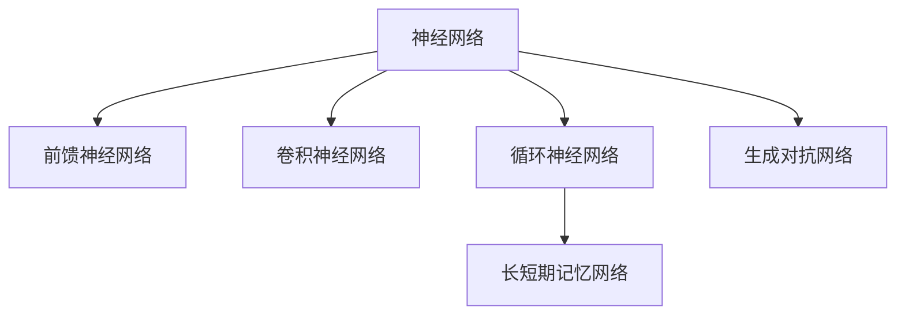

                 

# 神经网络：探索未知的领域

## 1. 背景介绍

### 1.1 问题由来
神经网络（Neural Networks, NNs）是一种通过模仿人类神经系统工作原理的计算模型。自20世纪60年代提出以来，经历了数十年的发展，在图像识别、语音识别、自然语言处理、推荐系统等诸多领域取得了突破性进展。目前，深度学习是神经网络技术的主流范式，通过大量标注数据进行端到端的训练，实现了众多复杂任务的自动化处理。

然而，神经网络的发展仍面临着诸多挑战。如何设计有效的神经网络结构，如何处理大规模数据，如何提高计算效率，如何避免过拟合，如何提升模型的泛化能力，这些问题的答案还在不断探索中。神经网络技术的普及应用，将为各行各业带来深远影响，但同时也需要不断的技术突破和创新。

## 2. 核心概念与联系

### 2.1 核心概念概述

为更好地理解神经网络的核心概念，本节将介绍几个密切相关的核心概念：

- 神经网络（Neural Networks）：一种基于连接权重机制的非线性模型，通过多层非线性变换实现复杂映射。
- 前馈神经网络（Feedforward Neural Networks, FNNs）：最基本的神经网络形式，数据流向从输入层到隐藏层再到输出层，信息单向流动。
- 卷积神经网络（Convolutional Neural Networks, CNNs）：广泛应用于图像处理领域，通过卷积层、池化层、全连接层等组成。
- 循环神经网络（Recurrent Neural Networks, RNNs）：适用于序列数据处理，通过循环层保持信息在序列间的传递。
- 长短期记忆网络（Long Short-Term Memory, LSTM）：RNNs的一种变体，通过门控机制解决长序列数据处理中的梯度消失问题。
- 生成对抗网络（Generative Adversarial Networks, GANs）：一种生成模型，通过两个对抗网络不断优化，生成与真实数据相似的新数据。

这些核心概念之间的逻辑关系可以通过以下Mermaid流程图来展示：



这个流程图展示了一些神经网络的主要类型和它们之间的关系：

1. 神经网络是所有神经网络的基类。
2. 前馈神经网络是神经网络的一种基本形式。
3. 卷积神经网络在图像处理领域得到广泛应用。
4. 循环神经网络适用于序列数据。
5. 长短期记忆网络是循环神经网络的一种改进，用于长序列数据处理。
6. 生成对抗网络是一种生成模型，用于生成新数据。

## 3. 核心算法原理 & 具体操作步骤

### 3.1 算法原理概述

神经网络的基本原理是模拟人类神经系统的信息处理机制，通过层间的非线性变换和权重更新，实现对输入数据的复杂映射。其核心思想是将输入数据表示为一层层的中间表示，逐步抽象出更高层次的特征，最终输出目标结果。

神经网络的学习过程主要分为两个步骤：前向传播和反向传播。前向传播将输入数据通过网络逐层传递，得到最终输出；反向传播则通过梯度下降等优化算法，更新网络参数，以最小化输出误差。

神经网络的训练过程可以形式化为：
$$
\theta^* = \mathop{\arg\min}_{\theta} \mathcal{L}(\theta)
$$
其中 $\theta$ 为网络参数，$\mathcal{L}$ 为损失函数，用于衡量模型输出与真实标签之间的差异。

### 3.2 算法步骤详解

神经网络的训练一般包括以下几个关键步骤：

**Step 1: 数据准备与预处理**
- 收集标注数据，进行数据清洗、归一化、打乱顺序等预处理工作。
- 将数据分为训练集、验证集和测试集，划分为批次进行处理。

**Step 2: 搭建神经网络模型**
- 根据任务特点选择合适的网络结构，如卷积层、池化层、全连接层、循环层等。
- 设置各层的参数初始值，选择合适的优化器、损失函数、评估指标等。

**Step 3: 前向传播**
- 将数据分批次输入模型，前向传播计算每一层的输出。
- 逐步将数据从输入层传递到隐藏层和输出层，通过激活函数实现非线性变换。

**Step 4: 反向传播**
- 计算输出层与真实标签之间的差异，即损失函数。
- 使用链式法则计算梯度，反向传播更新网络参数。
- 更新参数后重新计算输出，直至收敛或达到预设迭代轮数。

**Step 5: 模型评估与优化**
- 在验证集上评估模型性能，调整超参数以避免过拟合。
- 在测试集上评估最终模型性能，报告准确率、召回率、F1分数等指标。
- 根据模型表现，进一步优化网络结构、参数设置、正则化等策略。

### 3.3 算法优缺点

神经网络具有以下优点：
1. 强大的映射能力。神经网络通过多层的非线性变换，可以学习到非常复杂的映射关系，适应各种任务。
2. 自动特征提取。神经网络可以自动从数据中学习到特征表示，无需手动设计特征。
3. 端到端的训练。神经网络可以实现端到端的训练，无需手工干预，提升了模型的可解释性和可靠性。
4. 并行计算能力强。神经网络可以并行计算，加速训练和推理过程。

同时，神经网络也存在一些缺点：
1. 数据依赖性高。神经网络需要大量标注数据进行训练，标注成本较高。
2. 过拟合风险大。网络结构复杂，容易出现过拟合现象，需要通过正则化等手段进行缓解。
3. 计算资源需求高。神经网络参数众多，需要大量计算资源进行训练和推理。
4. 模型解释性差。神经网络通常是一个"黑盒"系统，难以解释其内部工作机制和决策逻辑。

尽管存在这些局限性，但神经网络仍是目前机器学习和人工智能领域的主流技术，广泛应用于图像识别、语音识别、自然语言处理、推荐系统等诸多领域。未来，随着技术的不断进步，神经网络将在更多应用场景中发挥更大作用。

### 3.4 算法应用领域

神经网络技术在诸多领域得到了广泛应用，以下是几个典型的应用场景：

- **计算机视觉**：神经网络在图像识别、目标检测、图像生成、图像分割等领域表现出色，广泛应用于无人驾驶、安防监控、医疗影像分析等领域。
- **自然语言处理**：神经网络在文本分类、情感分析、机器翻译、语言生成等领域取得了突破性进展，推动了智能客服、自动翻译、智能问答等应用的发展。
- **语音识别**：神经网络在语音识别、语音合成、语音情感识别等领域实现了语音交互的自然化，提升了人机交流的便捷性和准确性。
- **推荐系统**：神经网络在用户行为分析、物品特征学习、推荐算法优化等方面发挥作用，提高了推荐系统的效果和用户满意度。
- **金融风控**：神经网络在信用评估、欺诈检测、市场预测等方面展示了强大的数据建模能力，推动了金融科技的创新应用。

除此之外，神经网络技术还应用于气象预测、天气分析、能源管理、智能制造等多个领域，展现出巨大的应用潜力。

## 4. 数学模型和公式 & 详细讲解 & 举例说明

### 4.1 数学模型构建

神经网络的数学模型可以形式化为：
$$
f(x) = h_{L} \left(\sum_{i=1}^n w_{iL} h_{L-1} \left(\sum_{j=1}^m w_{j(L-1)} h_{L-2} \left(\cdots \sum_{k=1}^p w_{k(L-2)} h_{L-3} (x) \cdots \right) \cdots \right)
$$
其中，$h$ 为激活函数，$w$ 为网络参数。

### 4.2 公式推导过程

以最简单的单层神经网络为例，其前向传播过程可以表示为：
$$
z_1 = w_1 x + b_1
$$
$$
a_1 = h(z_1)
$$
其中，$z_1$ 为线性变换后的结果，$b_1$ 为偏置项，$h(z_1)$ 为激活函数，$w_1$ 和 $b_1$ 为网络参数。

其反向传播过程可以表示为：
$$
\frac{\partial \mathcal{L}}{\partial w_1} = \frac{\partial \mathcal{L}}{\partial z_1} \frac{\partial z_1}{\partial w_1}
$$
$$
\frac{\partial z_1}{\partial w_1} = x
$$
$$
\frac{\partial z_1}{\partial a_1} = \frac{\partial a_1}{\partial z_1} h'(z_1)
$$
其中，$h'(z_1)$ 为激活函数的导数。

通过反向传播，我们可以计算出网络参数的梯度，进而使用梯度下降等优化算法更新参数。

### 4.3 案例分析与讲解

以图像分类为例，神经网络可以通过卷积层、池化层、全连接层等组成。其前向传播过程可以表示为：
$$
x \xrightarrow{\text{卷积层}} z \xrightarrow{\text{ReLU}} y \xrightarrow{\text{池化层}} z' \xrightarrow{\text{全连接层}} z'' \xrightarrow{\text{Softmax}} \hat{y}
$$
其中，卷积层用于提取图像的局部特征，池化层用于降维和下采样，全连接层用于将特征映射到分类结果上。

其反向传播过程可以表示为：
$$
\frac{\partial \mathcal{L}}{\partial w'} = \frac{\partial \mathcal{L}}{\partial z''} \frac{\partial z''}{\partial w'}
$$
$$
\frac{\partial z''}{\partial w'} = \frac{\partial z''}{\partial z'} \frac{\partial z'}{\partial w'}
$$
$$
\frac{\partial z'}{\partial w'} = \frac{\partial z'}{\partial y} \frac{\partial y}{\partial w'}
$$
通过反向传播，我们可以计算出卷积层、池化层、全连接层等各层的参数梯度，进而使用梯度下降等优化算法更新参数。

## 5. 项目实践：代码实例和详细解释说明

### 5.1 开发环境搭建

在进行神经网络项目开发前，我们需要准备好开发环境。以下是使用Python进行TensorFlow开发的环境配置流程：

1. 安装Anaconda：从官网下载并安装Anaconda，用于创建独立的Python环境。

2. 创建并激活虚拟环境：
```bash
conda create -n tf-env python=3.8 
conda activate tf-env
```

3. 安装TensorFlow：根据CUDA版本，从官网获取对应的安装命令。例如：
```bash
conda install tensorflow-gpu -c conda-forge
```

4. 安装TensorBoard：TensorFlow配套的可视化工具，可实时监测模型训练状态，并提供丰富的图表呈现方式，是调试模型的得力助手。
```bash
pip install tensorboard
```

5. 安装各类工具包：
```bash
pip install numpy pandas scikit-learn matplotlib tqdm jupyter notebook ipython
```

完成上述步骤后，即可在`tf-env`环境中开始神经网络实践。

### 5.2 源代码详细实现

下面我们以手写数字识别为例，给出使用TensorFlow搭建卷积神经网络（CNN）的代码实现。

首先，导入相关库和模块：

```python
import tensorflow as tf
from tensorflow.keras import datasets, layers, models
import matplotlib.pyplot as plt
```

然后，加载手写数字数据集：

```python
(train_images, train_labels), (test_images, test_labels) = datasets.mnist.load_data()
train_images = train_images.reshape((60000, 28, 28, 1))
test_images = test_images.reshape((10000, 28, 28, 1))
train_images, test_images = train_images / 255.0, test_images / 255.0
```

接着，搭建CNN模型：

```python
model = models.Sequential([
    layers.Conv2D(32, (3, 3), activation='relu', input_shape=(28, 28, 1)),
    layers.MaxPooling2D((2, 2)),
    layers.Conv2D(64, (3, 3), activation='relu'),
    layers.MaxPooling2D((2, 2)),
    layers.Conv2D(64, (3, 3), activation='relu'),
    layers.Flatten(),
    layers.Dense(64, activation='relu'),
    layers.Dense(10, activation='softmax')
])
```

然后，编译模型：

```python
model.compile(optimizer='adam',
              loss='sparse_categorical_crossentropy',
              metrics=['accuracy'])
```

最后，训练模型：

```python
history = model.fit(train_images, train_labels, epochs=5, 
                    validation_data=(test_images, test_labels))
```

以上就是使用TensorFlow搭建卷积神经网络并进行训练的完整代码实现。可以看到，TensorFlow提供了简单易用的API，使得神经网络模型的构建和训练变得十分便捷。

### 5.3 代码解读与分析

让我们再详细解读一下关键代码的实现细节：

**模型搭建**：
- 使用`Sequential`模型定义网络结构，依次添加卷积层、池化层、全连接层等组件。
- 卷积层使用`Conv2D`，池化层使用`MaxPooling2D`，全连接层使用`Dense`。
- 激活函数使用ReLU，损失函数使用交叉熵，优化器使用Adam。

**模型编译**：
- 使用`compile`方法配置模型的优化器、损失函数和评估指标。

**模型训练**：
- 使用`fit`方法进行模型训练，指定训练集、验证集、迭代轮数等参数。
- 训练过程中，模型在每个epoch会重新计算一次梯度，更新参数。

可以看到，TensorFlow提供了丰富的组件和API，可以方便地构建各种神经网络模型，进行高效、灵活的训练和优化。开发者可以将更多精力放在模型设计、数据处理等核心逻辑上，而不必过多关注底层的实现细节。

当然，工业级的系统实现还需考虑更多因素，如模型的保存和部署、超参数的自动搜索、更灵活的架构设计等。但核心的神经网络训练流程基本与此类似。

## 6. 实际应用场景

### 6.1 图像识别

神经网络在图像识别领域得到了广泛应用，如自动驾驶、安防监控、医学影像分析等。通过卷积神经网络，神经网络可以自动学习图像的局部特征和全局特征，实现高精度的图像分类和目标检测。

以自动驾驶为例，神经网络可以实时处理摄像头和激光雷达等传感器数据，实现车道线识别、障碍物检测、行人识别等功能，为自动驾驶提供决策支持。

### 6.2 自然语言处理

神经网络在自然语言处理领域也取得了突破性进展，如文本分类、情感分析、机器翻译、语言生成等。通过循环神经网络、长短期记忆网络等组件，神经网络可以实现对自然语言的理解、生成和推理。

以机器翻译为例，神经网络可以自动学习源语言和目标语言之间的映射关系，实现高效的翻译任务。

### 6.3 金融风控

神经网络在金融风控领域也有重要应用，如信用评估、欺诈检测、市场预测等。通过历史数据训练模型，神经网络可以自动提取数据中的复杂特征，实现对客户信用风险的评估，预测市场趋势，预防金融欺诈。

以信用评估为例，神经网络可以结合客户的贷款记录、收入状况、消费行为等数据，自动学习客户信用风险的特征表示，从而更准确地评估客户信用等级。

### 6.4 未来应用展望

随着神经网络技术的不断发展，未来的应用场景将更加广阔。

- **人工智能辅助医疗**：神经网络可以自动分析医学影像、电子病历等数据，辅助医生诊断疾病，提升诊疗效率。
- **智能推荐系统**：神经网络可以分析用户行为数据，推荐个性化商品、音乐、视频等，提升用户体验。
- **智能客服**：神经网络可以自动处理客户咨询，提供个性化回复，提升客户满意度。
- **智能制造**：神经网络可以分析生产数据，优化生产流程，提高生产效率。
- **智能安防**：神经网络可以实时监控视频数据，识别异常行为，提升安防水平。

以上应用场景只是冰山一角，神经网络技术将在更多领域中发挥重要作用。未来，随着算力、数据、模型等技术的不断进步，神经网络将进一步普及应用，推动各行各业的智能化转型。

## 7. 工具和资源推荐

### 7.1 学习资源推荐

为了帮助开发者系统掌握神经网络的理论基础和实践技巧，这里推荐一些优质的学习资源：

1. 《深度学习》系列书籍：由深度学习领域的顶尖专家撰写，全面介绍了深度学习的基本概念、算法和应用。
2. CS231n《卷积神经网络》课程：斯坦福大学开设的计算机视觉课程，详细讲解了卷积神经网络的原理和应用。
3. 《Python深度学习》书籍：由深度学习领域的知名专家撰写，介绍了使用Python和TensorFlow实现深度学习的全过程。
4. TensorFlow官方文档：提供了丰富的API和示例代码，是学习TensorFlow的必备资料。
5. PyTorch官方文档：提供了强大的API和丰富的功能支持，是学习PyTorch的必备资料。
6. Coursera深度学习课程：由多所名校提供的深度学习课程，涵盖从基础到高级的多个层次。

通过对这些资源的学习实践，相信你一定能够快速掌握神经网络的理论和实践技巧，并用于解决实际的NLP问题。

### 7.2 开发工具推荐

高效的开发离不开优秀的工具支持。以下是几款用于神经网络开发的工具：

1. TensorFlow：由Google主导开发的深度学习框架，易于使用，功能强大，适合大规模工程应用。
2. PyTorch：Facebook开发的深度学习框架，灵活性高，支持动态计算图，适合研究和实验。
3. Keras：Google开发的高级神经网络API，易于上手，支持多种后端框架。
4. Jupyter Notebook：Python的交互式开发环境，支持多种编程语言，方便数据探索和模型调试。
5. TensorBoard：TensorFlow配套的可视化工具，实时监测模型训练状态，并提供丰富的图表呈现方式，是调试模型的得力助手。
6. Weights & Biases：模型训练的实验跟踪工具，可以记录和可视化模型训练过程中的各项指标，方便对比和调优。

合理利用这些工具，可以显著提升神经网络开发和调试的效率，加快创新迭代的步伐。

### 7.3 相关论文推荐

神经网络技术的发展离不开学界的持续研究。以下是几篇奠基性的相关论文，推荐阅读：

1. 《深度神经网络》：Yoshua Bengio等人的经典论文，提出了深度神经网络的基本框架和理论。
2. 《ImageNet分类：深度卷积网络》：AlexNet的论文，展示了深度卷积网络在图像分类任务上的突破性性能。
3. 《长短期记忆网络》：Hochreiter和Schmidhuber提出的循环神经网络变体，解决了长序列数据处理中的梯度消失问题。
4. 《生成对抗网络》：Goodfellow等人的经典论文，提出了生成对抗网络的基本框架和理论。
5. 《Attention is All You Need》：Transformer的论文，展示了自注意力机制在自然语言处理任务上的优越性能。

这些论文代表了大规模神经网络的发展脉络。通过学习这些前沿成果，可以帮助研究者把握学科前进方向，激发更多的创新灵感。

## 8. 总结：未来发展趋势与挑战

### 8.1 总结

本文对神经网络的核心概念和实现原理进行了全面系统的介绍。首先阐述了神经网络的发展历程和研究背景，明确了神经网络在图像识别、自然语言处理等领域的重要作用。其次，从原理到实践，详细讲解了神经网络的数学模型和训练过程，给出了神经网络项目开发的完整代码实例。同时，本文还广泛探讨了神经网络技术在多个领域的应用前景，展示了其巨大的应用潜力。此外，本文精选了神经网络技术的各类学习资源，力求为读者提供全方位的技术指引。

通过本文的系统梳理，可以看到，神经网络技术正在成为人工智能领域的主流技术，极大地拓展了数据的表示和处理能力，推动了人工智能应用的快速发展。未来，伴随深度学习、自动微分、优化算法等技术的不断进步，神经网络技术将在更多领域中发挥更大作用。

### 8.2 未来发展趋势

展望未来，神经网络技术将呈现以下几个发展趋势：

1. 模型规模持续增大。随着算力成本的下降和数据规模的扩张，神经网络模型的参数量还将持续增长。超大参数量的神经网络将学习到更加丰富的特征表示，提升了模型的泛化能力。
2. 计算资源需求降低。通过引入模型压缩、稀疏化存储等技术，神经网络模型可以在更低的计算资源下运行，提高了计算效率。
3. 网络结构更加复杂。未来将出现更多复杂的神经网络结构，如残差网络、注意力机制等，进一步提升模型的表达能力和适应能力。
4. 生成对抗网络的应用拓展。生成对抗网络在图像生成、数据增强、语音合成等领域的应用将进一步拓展，提升模型生成质量和数据多样性。
5. 神经网络与先验知识的结合。未来的神经网络将更多地结合符号化的先验知识，如知识图谱、逻辑规则等，实现更加全面、准确的特征提取。
6. 模型可解释性增强。未来的神经网络将更多地关注模型的可解释性和可理解性，提升模型的透明度和可靠性。

以上趋势凸显了神经网络技术的广阔前景。这些方向的探索发展，必将进一步提升神经网络的性能和应用范围，为人工智能技术的发展注入新的动力。

### 8.3 面临的挑战

尽管神经网络技术已经取得了瞩目成就，但在迈向更加智能化、普适化应用的过程中，仍面临着诸多挑战：

1. 数据依赖性高。神经网络需要大量标注数据进行训练，标注成本较高，尤其对于长尾数据集，难以获得充足的高质量标注数据。如何降低数据依赖，是未来的研究方向之一。
2. 过拟合风险大。神经网络结构复杂，容易出现过拟合现象，需要通过正则化等手段进行缓解。
3. 计算资源需求高。神经网络模型参数众多，需要大量计算资源进行训练和推理。如何降低计算资源需求，提高模型效率，是未来需要重点解决的问题。
4. 模型解释性差。神经网络通常是一个"黑盒"系统，难以解释其内部工作机制和决策逻辑。如何提升模型可解释性，增强模型的可信度，是未来的研究方向之一。
5. 安全性有待保障。神经网络模型可能存在安全漏洞，如对抗样本攻击、模型泛化不足等问题，需要加强模型的安全防护和鲁棒性。

### 8.4 研究展望

面对神经网络技术所面临的种种挑战，未来的研究需要在以下几个方面寻求新的突破：

1. 探索无监督和半监督神经网络：摆脱对大规模标注数据的依赖，利用自监督学习、主动学习等无监督和半监督范式，最大限度利用非结构化数据，实现更加灵活高效的神经网络训练。
2. 研究参数高效和计算高效的神经网络：开发更加参数高效的神经网络模型，在固定大部分预训练参数的同时，只更新极少量的任务相关参数。同时优化神经网络的计算图，减少前向传播和反向传播的资源消耗，实现更加轻量级、实时性的部署。
3. 融合因果和对比学习范式：通过引入因果推断和对比学习思想，增强神经网络的因果关系能力，学习更加普适、鲁棒的语言表征，从而提升模型泛化性和抗干扰能力。
4. 引入更多先验知识：将符号化的先验知识，如知识图谱、逻辑规则等，与神经网络模型进行巧妙融合，引导神经网络学习更准确、合理的特征表示。同时加强不同模态数据的整合，实现视觉、语音等多模态信息与文本信息的协同建模。
5. 结合因果分析和博弈论工具：将因果分析方法引入神经网络模型，识别出模型决策的关键特征，增强输出解释的因果性和逻辑性。借助博弈论工具刻画人机交互过程，主动探索并规避模型的脆弱点，提高系统稳定性。
6. 纳入伦理道德约束：在神经网络训练目标中引入伦理导向的评估指标，过滤和惩罚有偏见、有害的输出倾向。同时加强人工干预和审核，建立模型行为的监管机制，确保输出符合人类价值观和伦理道德。

这些研究方向的探索，必将引领神经网络技术迈向更高的台阶，为构建安全、可靠、可解释、可控的智能系统铺平道路。面向未来，神经网络技术还需要与其他人工智能技术进行更深入的融合，如知识表示、因果推理、强化学习等，多路径协同发力，共同推动人工智能技术的进步。

## 9. 附录：常见问题与解答

**Q1：如何设计神经网络的结构？**

A: 神经网络的结构设计需要根据具体任务的特点进行选择。对于图像识别任务，可以使用卷积神经网络（CNN）；对于自然语言处理任务，可以使用循环神经网络（RNN）、长短期记忆网络（LSTM）等；对于序列数据处理任务，可以使用双向RNN或Transformer等。在设计网络结构时，需要注意各层的参数量、激活函数、正则化技术等。

**Q2：如何避免过拟合现象？**

A: 过拟合是神经网络训练中常见的问题，可以通过以下方法进行缓解：
1. 数据增强：通过对训练数据进行旋转、裁剪、缩放等变换，增加数据的多样性。
2. 正则化：使用L2正则化、Dropout、Early Stopping等技术，避免模型过拟合。
3. 模型简化：减少网络层数和参数量，降低模型的复杂度。
4. 交叉验证：使用交叉验证技术，评估模型的泛化能力。
5. 集成学习：通过集成多个模型的输出，提高模型的鲁棒性。

**Q3：神经网络训练过程中需要注意哪些问题？**

A: 神经网络训练过程中需要注意以下问题：
1. 学习率：选择合适的学习率，避免过拟合和欠拟合。
2. 批次大小：选择合适的批次大小，平衡训练速度和内存占用。
3. 迭代轮数：设置合理的迭代轮数，避免过拟合和欠拟合。
4. 数据归一化：对输入数据进行归一化，提高训练效果。
5. 梯度消失：对于深度网络，需要注意梯度消失的问题，可以使用批归一化等技术进行缓解。
6. 参数初始化：选择合适的参数初始化策略，避免梯度爆炸和梯度消失。

**Q4：神经网络在实际应用中需要注意哪些问题？**

A: 神经网络在实际应用中需要注意以下问题：
1. 模型裁剪：去除不必要的层和参数，减小模型尺寸，加快推理速度。
2. 量化加速：将浮点模型转为定点模型，压缩存储空间，提高计算效率。
3. 服务化封装：将模型封装为标准化服务接口，便于集成调用。
4. 弹性伸缩：根据请求流量动态调整资源配置，平衡服务质量和成本。
5. 监控告警：实时采集系统指标，设置异常告警阈值，确保服务稳定性。
6. 安全防护：采用访问鉴权、数据脱敏等措施，保障数据和模型安全。

这些问题是保证神经网络模型在实际应用中高效、稳定、安全的重要因素。

---

作者：禅与计算机程序设计艺术 / Zen and the Art of Computer Programming

