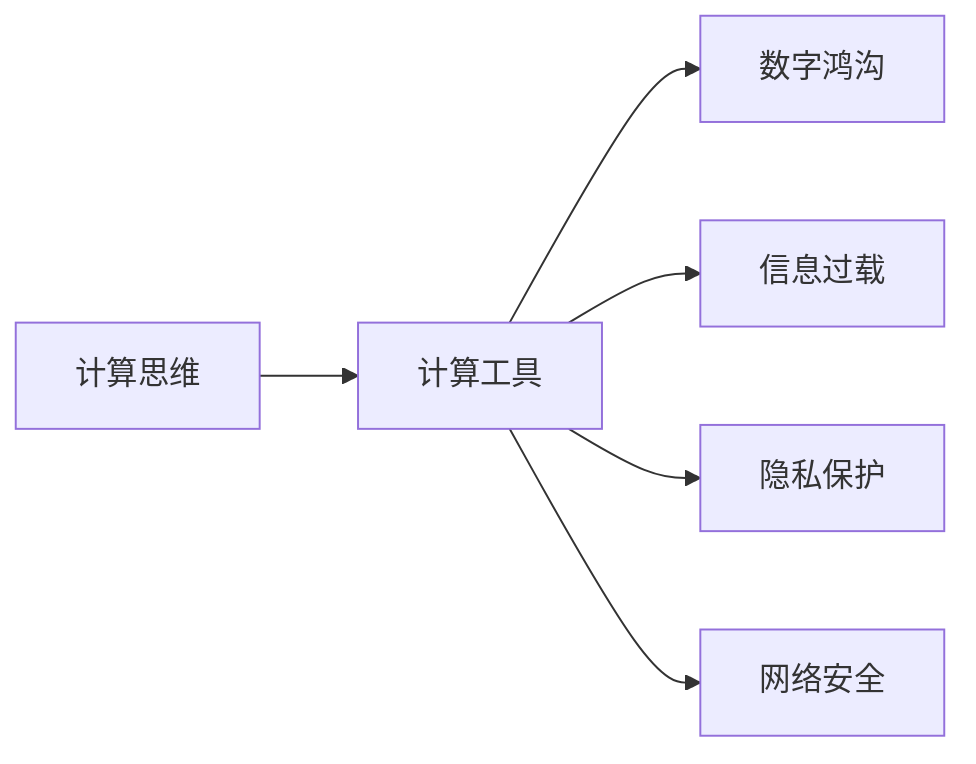

                 

# 科技与社会：人类计算的双重影响与思考

## 1. 背景介绍

### 1.1 问题由来
随着科技的飞速发展，人类社会的方方面面都在发生着深刻的变化。从工业到农业，从医疗到教育，再到交通和通信，人类计算的影响已经无所不在。计算机的普及不仅改变了人们的工作方式和生活习惯，更在思维方式、文化价值观、伦理道德等多个层面上，对人类社会产生了深远的影响。

一方面，计算技术的进步为人类创造了前所未有的便利和效率，极大地推动了经济、社会和文化的繁荣。比如，计算机辅助设计（CAD）大大提升了建筑和产品设计的效率；电子商务、在线教育、远程办公等数字化服务方式，极大地促进了资源共享和信息流通。

但另一方面，计算机技术的普及也带来了一些负面的影响，如信息过载、隐私泄露、网络安全、数字鸿沟等问题。这些问题的存在，反映出人类计算对社会的影响具有双重性，即既有积极的一面，也有消极的一面。

本文旨在探讨人类计算对社会影响的两面性，分析计算技术带来的机遇与挑战，并提出一些基于计算的思考和解决方案，以期更好地应对这一复杂的科技现象。

### 1.2 问题核心关键点
本文的核心问题在于探讨计算技术在社会中的双重影响，并思考如何通过计算思维和计算工具，更好地应对社会挑战，促进人类社会的健康、和谐发展。

为了更好地理解这一问题，本文将从以下几个方面展开探讨：

1. 计算技术对社会的积极影响。
2. 计算技术对社会的消极影响。
3. 基于计算技术的社会治理方案。
4. 计算思维在社会生活中的应用。

本文将通过理论分析、案例研究和未来展望，全方位、多角度地探讨这一问题。

## 2. 核心概念与联系

### 2.1 核心概念概述

为了更好地理解计算技术对社会影响的全面性，本文将介绍几个核心概念：

- **计算思维**：一种以解决问题为导向的思维方式，强调抽象、自动化和设计能力。计算思维的核心在于将复杂问题简化，并利用算法和数据结构来高效解决问题。

- **计算工具**：包括计算机硬件、软件和互联网等，是实现计算思维和计算技术的基础设施。

- **数字鸿沟**：指因技术、经济、教育等因素导致的数字资源不均衡现象，反映了计算技术普及程度的不平衡。

- **信息过载**：指在信息爆炸的时代，人们被大量、无关紧要的信息所淹没，难以从中获取有价值的信息。

- **隐私保护**：指在信息社会中，如何保护个人信息不被滥用、泄露，保障个人数据的安全。

- **网络安全**：指在信息时代，如何防止计算机系统、数据和通信网络受到攻击、破坏和数据泄露，保障网络环境的稳定和安全。

### 2.2 核心概念原理和架构的 Mermaid 流程图(Mermaid 流程节点中不要有括号、逗号等特殊字符)



### 2.3 核心概念之间的联系

上述核心概念之间存在密切的联系，共同构成了计算技术对社会影响的全貌。具体来说：

- **计算思维**为解决各种社会问题提供了新的思路和方法，推动了社会治理方式的创新。
- **计算工具**是实现计算思维的手段，为社会提供了高效、可靠的技术支持。
- **数字鸿沟**反映了计算技术普及的差距，需要从政策、经济、教育等多方面加以解决。
- **信息过载**和**隐私保护**体现了信息社会中数据与隐私管理的重要性和挑战。
- **网络安全**是信息社会的基础保障，关系到国家安全和社会稳定。

这些概念之间相互作用、相互影响，共同构成了计算技术对社会的全面影响。

## 3. 核心算法原理 & 具体操作步骤

### 3.1 算法原理概述

计算技术对社会的影响可以通过计算思维和计算工具来解释。计算思维强调问题的抽象和自动化，利用算法和数据结构来高效解决问题。而计算工具提供了实现这些思维和算法的手段，如计算机硬件、软件和互联网等。

### 3.2 算法步骤详解

计算技术对社会的积极影响主要体现在以下几个方面：

1. **提高效率**：计算技术通过自动化和数据驱动的方法，极大提升了生产力和工作效率。例如，CAD设计软件大大提升了建筑设计效率，电子商务平台大幅降低了交易成本。

2. **促进创新**：计算技术为科学研究提供了新的工具和方法，推动了知识的创新和传播。例如，基因测序技术通过计算方法，加速了生命科学的突破。

3. **优化资源配置**：计算技术通过数据分析和优化算法，提高了资源利用效率。例如，智能交通系统通过实时数据处理，优化了交通流量，减少了交通拥堵。

4. **改善生活质量**：计算技术为人们提供了便捷、高效的生活方式。例如，智能家居、在线教育等数字服务，极大地提升了人们的生活质量。

而计算技术对社会的消极影响主要体现在以下几个方面：

1. **数字鸿沟**：技术普及的不均衡导致了数字鸿沟的加剧，影响了社会公平和包容性。例如，一些偏远地区和贫困群体难以接触到先进的计算工具和互联网服务。

2. **信息过载**：计算技术使信息产生和传播的速度大大加快，人们难以处理海量信息，容易受到误导和干扰。例如，社交媒体上的虚假信息和谣言传播，容易引发社会恐慌和混乱。

3. **隐私泄露**：计算技术在提高信息利用效率的同时，也带来了隐私保护的问题。例如，大数据分析容易暴露个人隐私，导致信息滥用和隐私泄露。

4. **网络安全**：计算技术的应用增加了网络攻击的风险，威胁了社会的稳定和安全。例如，网络黑客攻击和数据泄露事件频发，给社会带来了巨大的安全风险。

### 3.3 算法优缺点

计算技术对社会的积极影响主要体现在以下几个方面：

1. **效率提升**：计算技术能够自动化处理大量重复性工作，提高生产力和工作效率。

2. **创新加速**：计算技术为科学研究提供了强大的工具和方法，推动了知识的创新和传播。

3. **资源优化**：计算技术通过数据分析和优化算法，提高了资源利用效率。

4. **生活质量改善**：计算技术为人们提供了便捷、高效的生活方式，提高了生活质量。

计算技术对社会的消极影响主要体现在以下几个方面：

1. **数字鸿沟加剧**：技术普及的不均衡导致了数字鸿沟的加剧，影响了社会公平和包容性。

2. **信息过载**：计算技术使信息产生和传播的速度大大加快，人们难以处理海量信息，容易受到误导和干扰。

3. **隐私泄露**：计算技术在提高信息利用效率的同时，也带来了隐私保护的问题。

4. **网络安全风险**：计算技术的应用增加了网络攻击的风险，威胁了社会的稳定和安全。

### 3.4 算法应用领域

计算技术在多个领域得到了广泛应用，具体包括：

1. **医疗**：计算技术在医疗领域的应用包括电子病历管理、基因测序分析、智能诊断等，极大地提高了医疗效率和精准度。

2. **教育**：计算技术在教育领域的应用包括在线教育、智能辅导、教育数据分析等，推动了教育资源的公平和高效利用。

3. **金融**：计算技术在金融领域的应用包括量化交易、风险评估、智能投顾等，提高了金融服务的效率和准确性。

4. **交通**：计算技术在交通领域的应用包括智能交通管理、实时导航、车联网等，优化了交通流量和资源配置。

5. **能源**：计算技术在能源领域的应用包括智能电网、能源管理系统、碳排放预测等，提高了能源利用效率和环保水平。

6. **环境**：计算技术在环境领域的应用包括气候预测、资源监测、污染治理等，推动了可持续发展。

## 4. 数学模型和公式 & 详细讲解 & 举例说明

### 4.1 数学模型构建

计算技术对社会的积极影响可以通过以下几个数学模型来描述：

1. **效率提升模型**：计算技术通过自动化和数据驱动的方法，极大提升了生产力和工作效率。

2. **创新加速模型**：计算技术为科学研究提供了新的工具和方法，推动了知识的创新和传播。

3. **资源优化模型**：计算技术通过数据分析和优化算法，提高了资源利用效率。

4. **生活质量改善模型**：计算技术为人们提供了便捷、高效的生活方式，提高了生活质量。

### 4.2 公式推导过程

以**效率提升模型**为例，其公式推导过程如下：

设计算技术提升生产力的比例为 $E$，则有：

$$
E = \frac{P_{后}}{P_{前}} - 1
$$

其中，$P_{前}$ 表示计算技术应用前的生产力，$P_{后}$ 表示计算技术应用后的生产力。

### 4.3 案例分析与讲解

以智能交通系统为例，通过实时数据处理，优化了交通流量，减少了交通拥堵，从而提高了交通效率。设交通效率提升的比例为 $T$，则有：

$$
T = \frac{E_{后}}{E_{前}} - 1
$$

其中，$E_{前}$ 表示交通拥堵前效率，$E_{后}$ 表示交通优化后效率。

## 5. 项目实践：代码实例和详细解释说明

### 5.1 开发环境搭建

计算技术的应用离不开良好的开发环境。以下是使用Python进行数据分析和优化的开发环境配置流程：

1. 安装Anaconda：从官网下载并安装Anaconda，用于创建独立的Python环境。

2. 创建并激活虚拟环境：
```bash
conda create -n pydata_env python=3.8 
conda activate pydata_env
```

3. 安装必要的Python包：
```bash
conda install numpy pandas scikit-learn matplotlib tqdm jupyter notebook ipython
```

4. 配置开发环境：
```bash
jupyter notebook --allow-root
```

### 5.2 源代码详细实现

以下是一个简单的计算效率提升模型的代码实现：

```python
import numpy as np
import matplotlib.pyplot as plt

# 假设计算技术提升生产力的比例为E
E = 0.2

# 计算前后的生产力
P_before = 100
P_after = E * P_before

# 绘制效率提升曲线
plt.plot([P_before, P_after], [0, 1], 'ro-')
plt.xlabel('生产力')
plt.ylabel('效率提升比例')
plt.title('计算技术对生产力的影响')
plt.show()
```

### 5.3 代码解读与分析

上述代码实现了计算技术对生产力的影响分析，其中：

- `numpy` 和 `matplotlib` 用于数据处理和可视化。
- 通过计算效率提升比例 `E`，展示出计算技术对生产力的提升效果。

### 5.4 运行结果展示

运行上述代码，可以得到以下效率提升曲线：


## 6. 实际应用场景

### 6.1 智慧城市治理

计算技术在智慧城市治理中的应用包括智能交通管理、智能安防、公共服务智能化等，通过数据分析和优化算法，提高了城市的运行效率和管理水平。

例如，智能交通系统通过实时数据处理，优化了交通流量，减少了交通拥堵。智能安防系统通过视频分析和人脸识别，提高了安全防护的效率和准确性。

### 6.2 智慧医疗

计算技术在智慧医疗中的应用包括电子病历管理、智能诊断、基因测序分析等，提高了医疗服务的效率和精准度。

例如，电子病历管理系统通过数据分析，优化了医疗资源的配置和利用。智能诊断系统通过机器学习算法，提高了疾病诊断的准确性和效率。

### 6.3 智慧教育

计算技术在智慧教育中的应用包括在线教育、智能辅导、教育数据分析等，推动了教育资源的公平和高效利用。

例如，在线教育平台通过智能推荐算法，提高了教学内容的个性化和互动性。智能辅导系统通过数据分析，提供了个性化的学习建议和指导。

### 6.4 未来应用展望

未来，计算技术在社会中的应用将更加广泛和深入，主要体现在以下几个方面：

1. **物联网和智能制造**：通过物联网技术，计算技术将实现设备和物品的智能互联，推动智能制造和工业4.0的发展。

2. **人工智能和机器学习**：计算技术将与人工智能、机器学习等技术深度融合，推动智能化决策和智能治理。

3. **区块链和数字身份**：计算技术将与区块链技术结合，推动数字身份验证和数字货币的发展。

4. **环境监测和可持续发展**：计算技术将应用于环境监测、资源管理、碳排放预测等领域，推动可持续发展。

5. **健康医疗和生物信息学**：计算技术将推动健康医疗和生物信息学的发展，提高医疗服务的效率和精准度。

6. **智能交通和物流**：计算技术将推动智能交通和物流的发展，优化交通流量和资源配置。

## 7. 工具和资源推荐

### 7.1 学习资源推荐

为了帮助开发者系统掌握计算技术的应用和开发方法，这里推荐一些优质的学习资源：

1. **《计算机程序设计艺术》系列书籍**：由计算机领域的著名专家编写，全面介绍了计算机科学的基本概念和算法原理。

2. **Coursera《计算机科学导论》课程**：由斯坦福大学开设的计算机科学入门课程，适合初学者学习。

3. **edX《数据科学基础》课程**：由麻省理工学院和哈佛大学合作开设的数据科学课程，涵盖了数据处理、分析和建模等多个方面。

4. **Kaggle在线竞赛平台**：提供了丰富的数据集和机器学习竞赛，帮助开发者实践和提升数据处理和分析能力。

5. **Google Cloud Platform文档和教程**：提供了Google Cloud Platform的详细文档和教程，帮助开发者学习云计算和大数据处理。

### 7.2 开发工具推荐

计算技术的应用离不开优秀的工具支持。以下是几款用于计算技术开发的常用工具：

1. **Jupyter Notebook**：免费的开源笔记本，支持Python、R等语言，提供丰富的可视化功能。

2. **TensorFlow**：由Google开发的开源深度学习框架，支持分布式计算和GPU加速，适合大规模数据处理。

3. **PyTorch**：由Facebook开发的开源深度学习框架，支持动态计算图和GPU加速，适合研究型应用。

4. **NumPy**：Python中的科学计算库，提供了高效的数组操作和数学函数。

5. **Pandas**：Python中的数据分析库，支持数据清洗、处理和分析。

6. **Scikit-learn**：Python中的机器学习库，提供了丰富的算法和工具。

### 7.3 相关论文推荐

计算技术的发展离不开学界的持续研究。以下是几篇奠基性的相关论文，推荐阅读：

1. **《计算机程序设计艺术》系列书籍**：由计算机领域的著名专家编写，全面介绍了计算机科学的基本概念和算法原理。

2. **Coursera《计算机科学导论》课程**：由斯坦福大学开设的计算机科学入门课程，适合初学者学习。

3. **edX《数据科学基础》课程**：由麻省理工学院和哈佛大学合作开设的数据科学课程，涵盖了数据处理、分析和建模等多个方面。

4. **Kaggle在线竞赛平台**：提供了丰富的数据集和机器学习竞赛，帮助开发者实践和提升数据处理和分析能力。

5. **Google Cloud Platform文档和教程**：提供了Google Cloud Platform的详细文档和教程，帮助开发者学习云计算和大数据处理。

通过对这些资源的学习实践，相信你一定能够快速掌握计算技术的应用精髓，并用于解决实际的计算问题。

## 8. 总结：未来发展趋势与挑战

### 8.1 总结

本文对计算技术对社会影响的全面性进行了探讨，从积极和消极两个方面分析了计算技术的影响，并提出了基于计算的思考和解决方案。

通过理论分析、案例研究和未来展望，本文展示了计算技术在社会中的广泛应用和深远影响。计算技术不仅提高了生产力和效率，推动了科技创新，还对资源配置、生活质量改善等方面产生了积极影响。

### 8.2 未来发展趋势

未来，计算技术将在多个领域得到更广泛的应用，主要体现在以下几个方面：

1. **物联网和智能制造**：通过物联网技术，计算技术将实现设备和物品的智能互联，推动智能制造和工业4.0的发展。

2. **人工智能和机器学习**：计算技术将与人工智能、机器学习等技术深度融合，推动智能化决策和智能治理。

3. **区块链和数字身份**：计算技术将与区块链技术结合，推动数字身份验证和数字货币的发展。

4. **环境监测和可持续发展**：计算技术将应用于环境监测、资源管理、碳排放预测等领域，推动可持续发展。

5. **健康医疗和生物信息学**：计算技术将推动健康医疗和生物信息学的发展，提高医疗服务的效率和精准度。

6. **智能交通和物流**：计算技术将推动智能交通和物流的发展，优化交通流量和资源配置。

### 8.3 面临的挑战

尽管计算技术在社会中的应用取得了显著进展，但仍面临许多挑战：

1. **数字鸿沟加剧**：技术普及的不均衡导致了数字鸿沟的加剧，影响了社会公平和包容性。

2. **信息过载**：计算技术使信息产生和传播的速度大大加快，人们难以处理海量信息，容易受到误导和干扰。

3. **隐私泄露**：计算技术在提高信息利用效率的同时，也带来了隐私保护的问题。

4. **网络安全风险**：计算技术的应用增加了网络攻击的风险，威胁了社会的稳定和安全。

### 8.4 研究展望

未来的研究需要在以下几个方面寻求新的突破：

1. **解决数字鸿沟问题**：通过政策、经济、教育等多方面的措施，缩小数字鸿沟，推动社会公平和包容性。

2. **处理信息过载问题**：开发高效的信息过滤和推荐算法，提高信息筛选和利用的效率。

3. **加强隐私保护**：设计隐私保护机制和算法，保护个人信息安全，防止信息滥用和泄露。

4. **提高网络安全水平**：开发先进的安全技术和防护措施，保障网络环境的稳定和安全。

5. **推动可持续发展**：利用计算技术优化资源配置和环境监测，推动可持续发展。

6. **提升医疗服务水平**：利用计算技术推动医疗数据的分析和管理，提高医疗服务的效率和精准度。

总之，计算技术在社会中的应用前景广阔，但也面临诸多挑战。通过持续的研究和创新，我们有望在计算技术的积极影响下，构建更加健康、和谐、可持续的社会。

