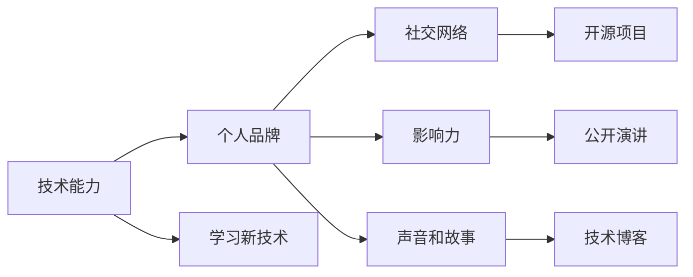

                 

# 程序员如何打造个人品牌IP

在快速发展的技术世界中，程序员的个人品牌（Personal Brand）对于其职业发展和影响力有着至关重要的作用。个人品牌不仅反映了个人的技术水平和专业知识，还能帮助个人在竞争激烈的职场中脱颖而出，成为行业内的意见领袖。本文将深入探讨如何通过构建和优化个人品牌，从而打造一个强大的个人品牌IP，涵盖背景介绍、核心概念、算法原理、具体操作步骤、数学模型、项目实践、应用场景、工具和资源推荐、未来发展趋势和挑战，以及常见问题解答。

## 1. 背景介绍

### 1.1 问题由来
随着技术行业的不断发展，全球化和技术创新的速度不断加快。技术环境的变化要求程序员不仅要有扎实的技术基础，还需要有不断学习和自我提升的能力。个人品牌在这样的背景下显得尤为重要。一个强大的个人品牌不仅能提升程序员的专业形象，还能为其带来更多的职业机会和认可度。

### 1.2 问题核心关键点
个人品牌的构建包括技术能力、社交网络、行业影响力、个人声音等多个方面。程序员要想打造个人品牌IP，必须综合考虑这些因素，并进行系统性的规划和优化。本文将聚焦于技术能力和社交网络的优化，因为这两者是个人品牌的核心要素。

## 2. 核心概念与联系

### 2.1 核心概念概述

在探讨如何打造个人品牌IP之前，我们先明确一些核心概念及其相互关系：

- **个人品牌**：指通过一系列行为和作品，在他人心中塑造出的形象和声誉，包括技术能力、专业领域、工作态度等方面。
- **技术能力**：程序员的技术能力是个人品牌的重要基础，包括编程语言熟练度、算法设计和问题解决能力等。
- **社交网络**：通过在线社区、技术博客、开源项目、公开演讲等方式与同行交流，建立自己的社交网络。
- **影响力**：在技术社区中通过分享知识、解决技术问题等行为，提升自己在同行中的影响力。
- **声音和故事**：个人品牌IP的塑造还涉及如何通过博客、演讲、社交媒体等渠道讲述自己的故事，展示自己的独特价值和专业观点。

### 2.2 核心概念原理和架构的 Mermaid 流程图



这个流程图展示了技术能力、社交网络、影响力、声音和故事等核心概念之间的联系。技术能力是基础，通过学习新技术不断提高自身水平；社交网络帮助程序员与同行交流，扩展影响力和声音；影响力通过解决技术问题、分享知识等行为在技术社区中建立；声音和故事则通过博客、演讲等形式展现，进一步强化个人品牌。

## 3. 核心算法原理 & 具体操作步骤

### 3.1 算法原理概述

个人品牌IP的构建虽然不涉及传统意义上的算法，但其中的原则和策略仍然可以借鉴。一个强大的个人品牌IP应该是技术深度和广度、影响力、社交网络和声音和故事等多种元素共同作用的结果。我们将这些元素视为一种多目标优化问题，目标是最大化个人品牌的价值。

### 3.2 算法步骤详解

构建个人品牌IP需要以下步骤：

**Step 1: 评估现状**
- 确定当前技术能力水平和影响力
- 分析社交网络的广度和质量
- 评估当前品牌故事和声音

**Step 2: 设定目标**
- 确定期望的个人品牌形象
- 设定具体的目标，如成为某领域的专家、在技术社区中有较高的认可度

**Step 3: 制定计划**
- 根据目标制定具体行动计划，包括提升技术能力、拓展社交网络、增强影响力等

**Step 4: 执行和调整**
- 按照计划执行各项行动，定期评估进展和效果
- 根据反馈调整计划，持续优化

### 3.3 算法优缺点

个人品牌IP的构建过程具有以下优点：
1. 提升职业竞争力：通过提升技术能力和影响力，个人品牌能带来更多的职业机会和认可度。
2. 促进技术交流：拓展社交网络能帮助程序员与同行交流，互相学习和成长。
3. 扩大影响力：通过解决技术问题、分享知识，提升个人在技术社区中的影响力。

同时，个人品牌IP构建也面临一些挑战：
1. 时间和资源投入：打造个人品牌需要大量的时间和资源，需要程序员在忙碌的工作之余进行持续投入。
2. 效果难以量化：个人品牌的效果往往难以直接量化，需要长期持续的投入和维护。
3. 市场竞争激烈：技术领域的竞争非常激烈，打造个人品牌需要不断创新和突破。

### 3.4 算法应用领域

个人品牌IP的构建不仅适用于技术行业，也可以应用于其他领域，如商业、教育、艺术等。然而，在技术行业内，个人品牌的影响力和传播范围往往更为显著，因为技术社区的开放性和互动性更强。

## 4. 数学模型和公式 & 详细讲解 & 举例说明

### 4.1 数学模型构建

个人品牌IP的价值可以通过以下几个指标来衡量：
- 技术能力指数 $T$
- 社交网络影响力指数 $S$
- 公开影响力指数 $O$
- 声音和故事传播度指数 $V$

因此，我们可以构建一个多目标优化模型，目标是最大化 $V$，同时最大化 $T$、$S$ 和 $O$。

$$
\maximize V(T, S, O)
$$

### 4.2 公式推导过程

这里，我们使用简单的加权平均方法来评估上述指标的相对重要性。设 $\omega_T$、$\omega_S$、$\omega_O$ 和 $\omega_V$ 为权重，满足 $\omega_T + \omega_S + \omega_O + \omega_V = 1$。则个人品牌总价值 $V$ 可以表示为：

$$
V(T, S, O) = \omega_T T + \omega_S S + \omega_O O + \omega_V V
$$

其中：

- $T$ 表示技术能力指数，可以基于技术熟练度、解决问题的复杂性等进行量化。
- $S$ 表示社交网络影响力指数，可以通过参与开源项目、技术会议、社交媒体互动等活动的影响力进行量化。
- $O$ 表示公开影响力指数，可以通过在技术社区中的贡献、公开演讲、博客文章的影响力进行量化。
- $V$ 表示声音和故事传播度指数，可以通过博客阅读量、社交媒体互动量、公开演讲的听众反馈等进行量化。

### 4.3 案例分析与讲解

考虑一个具有中等技术能力和影响力，但在公开影响力方面相对较弱的程序员。通过加强公开影响力，可以显著提升其个人品牌总价值。例如，该程序员通过参加行业会议、发布技术博客和进行公开演讲，逐渐提升其在技术社区中的知名度和影响力。最终，该程序员的综合品牌价值得到显著提升。

## 5. 项目实践：代码实例和详细解释说明

### 5.1 开发环境搭建

构建个人品牌IP的技术实践通常不需要复杂的开发环境，但需要一个良好的博客平台和社交媒体账号。以下是使用GitHub和博客平台进行个人品牌构建的环境配置流程：

1. 创建GitHub账号，并建立个人仓库，用于存储代码和博客文章。
2. 注册博客平台账号，如Medium、CSDN等。
3. 安装代码编辑器，如Visual Studio Code、Atom等。
4. 安装Git等版本控制工具，方便代码管理。

### 5.2 源代码详细实现

假设我们要创建一个技术博客，展示自己的学习心得和技术分享。以下是一个简单的Python Flask框架博客系统的实现步骤：

```python
from flask import Flask, render_template, request
from markdown import markdown

app = Flask(__name__)

@app.route('/')
def index():
    # 加载所有文章
    articles = load_articles()
    return render_template('index.html', articles=articles)

@app.route('/write', methods=['GET', 'POST'])
def write():
    if request.method == 'GET':
        return render_template('write.html')
    else:
        title = request.form['title']
        content = markdown(request.form['content'])
        save_article(title, content)
        return redirect('/')

if __name__ == '__main__':
    app.run(debug=True)
```

这里，我们使用了Flask框架，通过渲染模板和Markdown库来展示和编辑博客文章。

### 5.3 代码解读与分析

这段代码展示了Flask框架的基本使用，包括路由定义、模板渲染和文章保存等。Flask通过路由机制实现URL映射，允许我们定义不同URL的响应。模板引擎用于动态生成HTML页面，Markdown库用于解析和渲染Markdown格式的博客内容。通过这个简单的博客系统，程序员可以方便地展示自己的技术心得和学习成果，逐步建立起自己的技术影响力。

### 5.4 运行结果展示

运行上述代码后，可以在浏览器中访问 `http://localhost:5000` 查看博客系统界面。点击“Write”链接可以进入文章编辑页面，编辑完成后点击“Save”提交即可保存文章。这样，程序员就可以通过博客系统展示自己的技术学习成果，与同行交流，提升个人品牌影响力。

## 6. 实际应用场景

### 6.1 技术博客作者

一个成功的技术博客作者可以通过分享技术心得、展示项目作品、解决技术问题等方式，建立强大的个人品牌IP。通过持续的创作和分享，博客作者能吸引大量读者，逐步提升自己在技术社区中的影响力。

### 6.2 开源项目贡献者

积极参与开源项目，提交高质量的代码和文档，可以在社区中建立良好的声誉。通过贡献代码，开源项目的贡献者不仅展示了自己的技术能力，还能扩大自己在技术社区中的影响力。

### 6.3 技术会议讲师

在技术会议上作为讲师，不仅能展示自己的技术水平，还能通过公开演讲的方式，提升在技术社区中的知名度。通过讲师的经历，程序员可以将自己的知识和技术分享给更多人，增强个人品牌影响力。

### 6.4 未来应用展望

未来，个人品牌IP的应用将更加多样化和智能化。AI技术的发展将帮助程序员更好地管理和推广自己的个人品牌，如通过AI生成的技术博客摘要、自动推荐相关内容等，提高品牌影响力。

## 7. 工具和资源推荐

### 7.1 学习资源推荐

- **《Python编程：从入门到实践》**：一本非常适合初学者的Python入门书籍，涵盖基础知识和实用技巧。
- **LeetCode**：一个优秀的在线编程题库，适合程序员练习算法和数据结构。
- **Kaggle**：一个数据科学竞赛平台，可以参与数据分析和机器学习竞赛，提升实战能力。
- **Coursera**：一个在线学习平台，提供各类技术课程，涵盖从入门到高级的内容。
- **GitHub**：一个代码托管平台，适合存储代码和项目管理。

### 7.2 开发工具推荐

- **Visual Studio Code**：一个功能强大的代码编辑器，支持多种编程语言和插件。
- **Git**：一个版本控制系统，方便代码管理和团队协作。
- **Flask**：一个轻量级的Web框架，适合快速搭建博客系统。
- **Markdown**：一个轻量级标记语言，适合快速编写和展示技术文档。
- **Jupyter Notebook**：一个交互式编程环境，适合做数据科学分析和项目开发。

### 7.3 相关论文推荐

- **《程序员如何建立个人品牌》**：探讨了程序员通过技术博客、开源项目、公开演讲等方式建立个人品牌的方法。
- **《技术社区的影响力构建策略》**：研究了技术社区中个人影响力的构建策略，包括技术贡献、社区互动等。
- **《人工智能与个人品牌建设》**：探讨了AI技术在个人品牌建设中的应用，如自动化写作、数据分析等。

## 8. 总结：未来发展趋势与挑战

### 8.1 研究成果总结

本文对程序员如何打造个人品牌IP进行了系统性的分析和探讨，明确了技术能力、社交网络、公开影响力、声音和故事等核心概念及其相互关系。通过构建数学模型，展示了个人品牌价值的评估方法和优化策略。通过项目实践和应用场景的详细说明，提供了可操作的个人品牌构建方法。

### 8.2 未来发展趋势

未来，个人品牌IP的构建将更加依赖于AI技术和数据驱动的优化方法。通过AI技术，程序员可以更高效地管理和推广个人品牌，如自动生成技术博客摘要、推荐相关内容等。数据驱动的优化方法将帮助程序员不断调整个人品牌建设的策略，提升品牌影响力。

### 8.3 面临的挑战

尽管个人品牌IP的构建具有广阔前景，但仍然面临以下挑战：
1. 时间与资源投入：打造个人品牌需要持续的时间和资源投入，需合理安排个人时间。
2. 技术变化快：技术领域的快速发展要求程序员不断学习新技术，保持技术能力的前沿性。
3. 竞争激烈：技术社区中优秀的技术博主和开源项目贡献者众多，如何脱颖而出是一个挑战。

### 8.4 研究展望

未来的研究将集中在以下几个方向：
1. 数据驱动的个人品牌优化：利用大数据和机器学习技术，自动评估和优化个人品牌策略。
2. AI技术在个人品牌中的应用：探索AI技术在自动写作、数据分析、内容推荐等方面的应用，提升个人品牌建设效率。
3. 跨领域个人品牌建设：探讨如何将个人品牌建设的方法和策略应用于不同领域，如商业、教育、艺术等。

## 9. 附录：常见问题与解答

**Q1: 如何评估自己的技术能力？**

A: 可以通过参与技术竞赛、提交开源项目、撰写技术博客等方式，展示自己的技术水平和解决问题的能力。这些活动不仅能提升自己的技术能力，还能在技术社区中展示自己的实力。

**Q2: 如何拓展社交网络？**

A: 积极参与开源项目、技术会议、线上社区等活动，与同行交流，分享技术心得。通过持续的互动和贡献，逐步扩大自己的社交网络。

**Q3: 如何增强公开影响力？**

A: 通过在技术社区中发布高质量的技术文章、公开演讲、参与行业活动等方式，提升自己在技术社区中的知名度和影响力。

**Q4: 如何通过声音和故事传播个人品牌？**

A: 通过博客、社交媒体、公开演讲等渠道，讲述自己的技术经历、项目成果和职业发展故事。通过独特的声音和故事，吸引更多的关注和认可。

**Q5: 如何保持个人品牌建设的持续性和效果？**

A: 定期评估和调整个人品牌建设策略，保持对新技术的学习和掌握，持续输出高质量的内容，积极与同行互动，维护个人品牌的影响力和认可度。

作者：禅与计算机程序设计艺术 / Zen and the Art of Computer Programming

