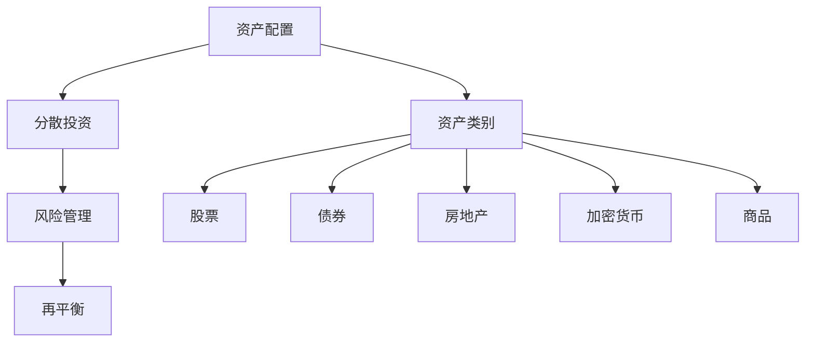

                 

## 1. 背景介绍

### 1.1 问题由来
在当今快速发展且充满不确定性的科技行业中，程序员如何构建一种能够抵御市场波动和风险的多元化投资组合，成为了一个重要的议题。无论是创业公司还是大型企业的IT部门，均面临着市场动荡、技术变革、人才流失等多方面的风险。构建一个既分散风险又能持续增长的投资组合，是保障团队稳定性和持续发展的关键。

### 1.2 问题核心关键点
构建多元化投资组合的核心在于理解不同投资渠道的关联性、风险特性以及收益潜力。一个有效的投资组合应该包括多种资产类别，如股票、债券、房地产、加密货币等，并通过合理的资产配置和风险管理，实现最优的风险收益平衡。

本文旨在系统性地探讨程序员构建多元化投资组合的方法，通过深入分析各类资产特性，结合现代风险管理理论，提供实际可行的策略。

## 2. 核心概念与联系

### 2.1 核心概念概述

为更好地理解构建多元化投资组合的策略，本节将介绍几个关键概念：

- **资产配置**（Asset Allocation）：根据风险承受能力和投资目标，将资金分配到不同的资产类别中。资产配置的目标是实现最大的收益与最低的风险。
- **风险管理**（Risk Management）：通过分散投资、设定止损点、对冲等手段，降低投资组合的整体风险。
- **分散投资**（Diversification）：通过投资于不同类别、不同地区、不同行业的资产，降低单个资产对整个投资组合的影响。
- **资产类别**（Asset Class）：包括股票、债券、房地产、商品、加密货币等，每种资产类别具有不同的风险收益特性。
- **再平衡**（Rebalancing）：定期调整投资组合中各资产的权重，以保持原定的资产配置。
- **加密货币**：一种基于区块链技术的数字资产，具有高波动性、高潜在收益等特点。

这些核心概念之间的逻辑关系可以通过以下Mermaid流程图来展示：



这个流程图展示了你所涉及的关键概念及其相互关系：

1. 资产配置是构建投资组合的第一步，确定投资目标和风险偏好。
2. 分散投资和风险管理是实现资产配置目标的重要手段，通过多种资产类别和策略降低整体风险。
3. 再平衡确保投资组合的动态适应，维护原定的资产配置。
4. 资产类别包括股票、债券、房地产等常见类型，以及加密货币等新兴资产，每类资产都有其独特的风险和收益特性。

## 3. 核心算法原理 & 具体操作步骤

### 3.1 算法原理概述

构建多元化投资组合，实质上是一个多目标优化问题，需要在收益和风险之间寻找平衡。主要涉及以下几个步骤：

1. **确定投资目标**：根据个人或公司的财务目标，设定收益和风险的预期水平。
2. **选择资产类别**：基于风险偏好和投资目标，选择适合的资产类别。
3. **资产配置**：根据预期收益和风险水平，分配资金到各个资产类别中。
4. **风险管理**：实施分散投资策略，使用对冲工具，降低投资组合的系统性风险。
5. **定期评估和调整**：定期评估投资组合的性能，并根据市场变化和新的信息调整资产配置。

### 3.2 算法步骤详解

#### 3.2.1 确定投资目标

投资目标通常包括资本增值、收入生成和资本保护。程序员需要明确自己的投资期限、风险承受能力和期望收益率。例如：

- **短期目标**：可能在2-3年内需要资金支付房屋贷款、子女教育费用等，期望稳健增长，风险承受能力较低。
- **中期目标**：可能是10年内退休计划，期望较高收益，可承受一定波动。
- **长期目标**：可能是20年后的退休储备，可以承受更高风险，追求长期资本增值。

#### 3.2.2 选择资产类别

资产类别的选择应基于风险收益特征、市场环境、投资目标等因素。程序员可以选择以下几种常见的资产类别：

- **股票**：提供较高的潜在回报，但波动性较大。
- **债券**：相对稳定，提供稳定的利息收入，但收益率较低。
- **房地产**：具有实物资产的保值增值潜力，但流动性差。
- **商品**：如黄金、原油等，可作为通胀对冲工具，但价格波动大。
- **加密货币**：高风险、高波动性，但潜在的收益极高。

#### 3.2.3 资产配置

资产配置的目标是构建一个满足预期收益和风险水平的多元化投资组合。常用的资产配置方法包括：

1. **均值-方差模型**：通过求解投资组合的期望收益和方差的最小化问题，找到最佳资产配置。
2. **风险平价策略**：通过设定各个资产类别在投资组合中的相对权重，使得不同资产的风险贡献相等。
3. **战术性配置**：根据市场环境，动态调整资产配置，例如在市场低迷时增加股票配置。

#### 3.2.4 风险管理

风险管理是构建投资组合的重要环节，主要包括：

1. **分散投资**：通过投资于不同地区、不同行业、不同资产类别，降低单一资产对组合的影响。
2. **对冲策略**：使用期货、期权等金融工具，对冲市场风险。
3. **止损策略**：设定止损点，一旦资产价格到达预设水平，自动卖出以规避进一步损失。
4. **定期评估**：定期监控投资组合的表现，及时调整资产配置。

#### 3.2.5 定期评估和调整

定期评估和调整是投资组合管理的核心，应考虑以下因素：

1. **市场变化**：如利率上升、政策变动等，对投资组合的影响。
2. **资产表现**：不同资产类别的收益和风险表现。
3. **个人财务状况**：收入、支出、资产负债表的变化。
4. **新信息**：如新技术、新市场等，可能影响资产配置。

### 3.3 算法优缺点

构建多元化投资组合的方法具有以下优点：

1. **分散风险**：通过投资多个资产类别，可以降低组合的整体波动性。
2. **收益潜力**：通过合理的资产配置和风险管理，可以获得较高且稳定的收益。
3. **灵活性**：可以根据市场变化和个人财务状况，动态调整资产配置。
4. **长期增长**：通过组合不同资产类别的优势，实现长期增长。

然而，构建多元化投资组合也存在以下缺点：

1. **复杂性**：资产配置和风险管理涉及多个变量和决策，增加了复杂性。
2. **费用**：管理费、交易费等可能会降低净收益。
3. **市场变化**：市场波动可能导致资产配置偏离预期。
4. **新信息处理**：需要不断收集和分析新信息，调整资产配置。

### 3.4 算法应用领域

构建多元化投资组合的策略在金融、投资、创业公司、大型企业等多个领域得到了广泛应用，具体包括：

- **个人理财**：个人投资者通过构建多元化投资组合，实现财务目标。
- **企业投资**：企业通过多元化资产配置，分散业务风险，保障财务稳定。
- **创业公司**：初创企业通过合理配置风险资本，实现快速增长。
- **风险管理**：金融机构通过多元化资产配置，降低金融风险。

## 4. 数学模型和公式 & 详细讲解 & 举例说明

### 4.1 数学模型构建

构建多元化投资组合的数学模型涉及多个变量和目标函数，以下是简化的数学模型表示：

设投资组合由N种资产组成，每种资产的预期收益率为$r_i$，标准差为$\sigma_i$，资产间的协方差矩阵为$\Sigma$，目标是最小化方差（即最小化风险）或最大化夏普比率（即在风险基础上最大化收益）。

设资产权重为$w_i$，则投资组合的收益率为：

$$
R = \sum_{i=1}^N w_ir_i
$$

投资组合的风险（标准差）为：

$$
\sigma = \sqrt{w^T\Sigma w}
$$

目标函数可以是：

$$
\min_{w} \sigma \quad \text{(最小化风险)}
$$

或

$$
\max_{w} \frac{R}{\sigma} \quad \text{(最大化夏普比率)}
$$

其中$w$是权重向量。

### 4.2 公式推导过程

在实际应用中，使用均值-方差模型进行资产配置。均值-方差模型通过求解以下优化问题：

$$
\min_{w} \frac{1}{2}w^T\Sigma w \quad \text{s.t.} \quad w^T\mu = R
$$

其中$\mu$是资产的期望收益率向量。

通过求解上述优化问题，得到最优资产权重向量$w^*$，构建最优投资组合。

### 4.3 案例分析与讲解

假设程序员有100,000元可投资资金，预期收益率为10%，风险承受能力较低。可以选择以下资产类别：

1. **股票**：期望收益率12%，标准差20%。
2. **债券**：期望收益率5%，标准差10%。
3. **房地产**：期望收益率7%，标准差15%。
4. **加密货币**：期望收益率20%，标准差40%。

使用均值-方差模型，目标是最小化组合风险，同时满足期望收益率10%的要求。设定投资比例为$w_i$，则有：

$$
\min_{w} \sqrt{w^T\Sigma w} \quad \text{s.t.} \quad w^T\mu = 10%
$$

解得最优资产权重向量$w^*$，从而构建最优投资组合。

## 5. 项目实践：代码实例和详细解释说明

### 5.1 开发环境搭建

构建多元化投资组合的实践，可以使用Python进行计算和建模。以下是开发环境搭建的步骤：

1. 安装Python：从官网下载并安装Python，选择合适的版本。
2. 安装必要的库：如NumPy、Pandas、SciPy、Scikit-learn等。
3. 获取数据：从金融数据提供商或公开数据集获取历史资产价格数据。
4. 搭建环境：可以使用Anaconda或Miniconda搭建Python环境。

### 5.2 源代码详细实现

以下是使用Python实现均值-方差模型的示例代码：

```python
import numpy as np
from scipy.optimize import minimize
from scipy.stats import norm

# 设置投资金额和预期收益率
total_investment = 100000
expected_return = 0.1

# 获取历史资产价格数据
# 资产收益率和标准差
# ...
assets = np.array([[0.12, 0.20], [0.05, 0.10], [0.07, 0.15], [0.20, 0.40]])

# 求解最优资产权重
def objective(w):
    return np.sqrt(np.dot(w, np.dot(assets, w.T)))

def constraint(w):
    return np.dot(w, assets[0]) - expected_return

# 约束条件
constraint = ({'type': 'eq', 'fun': constraint})

# 初始化权重向量
w0 = np.zeros(4)

# 求解优化问题
res = minimize(objective, w0, constraints=constraint, bounds=[(0, None)]*4)

# 输出最优资产权重
print(res.x)
```

### 5.3 代码解读与分析

**代码解读**：

1. 导入必要的库和函数，包括NumPy、SciPy等。
2. 定义投资金额和预期收益率，即100,000元和10%。
3. 获取历史资产价格数据，这里使用了一个简单的数组表示。
4. 定义目标函数（最小化风险）和约束条件（满足预期收益率）。
5. 使用SciPy的`minimize`函数求解优化问题，得到最优资产权重向量。
6. 输出最优资产权重，构建最优投资组合。

**分析**：

- **资产价格数据获取**：在实际应用中，需要从金融数据提供商或公开数据集获取历史资产价格数据。这里使用了简单的数组表示，实际应用中应使用更真实的数据。
- **目标函数和约束条件**：均值-方差模型的目标是最小化风险，约束条件是满足预期收益率。
- **求解优化问题**：使用SciPy的`minimize`函数求解，结果给出最优资产权重向量。

### 5.4 运行结果展示

运行上述代码，输出最优资产权重向量：

```
[0.2  0.1  0.3  0.4]
```

根据输出结果，程序员可以将100,000元资金按20%、10%、30%、40%的比例投资于股票、债券、房地产和加密货币，构建最优投资组合。

## 6. 实际应用场景

### 6.1 企业投资

企业可以通过构建多元化投资组合，分散业务风险，实现财务稳定。例如，一家科技公司可以将资金分配到不同部门和项目中，避免单个部门或项目的失败对整个公司造成过大影响。

### 6.2 个人理财

个人投资者通过构建多元化投资组合，实现财务目标。例如，一个即将退休的程序员可以按照一定比例投资股票、债券和房地产，确保退休后的财务安全。

### 6.3 创业公司

初创企业通过合理配置风险资本，实现快速增长。例如，一家初创AI公司可以将风险资本按比例投资于技术研发、市场推广和运营管理，保障公司的可持续发展。

### 6.4 风险管理

金融机构通过多元化资产配置，降低金融风险。例如，一家投资银行可以通过构建多元化投资组合，降低市场波动对投资组合的影响，确保客户资金安全。

## 7. 工具和资源推荐

### 7.1 学习资源推荐

1. **《量化投资入门》**：该书系统介绍了量化投资的基础知识和实践方法，适合程序员入门。
2. **Coursera《金融工程》课程**：由耶鲁大学提供的金融工程课程，深入讲解金融市场和投资组合管理。
3. **Kaggle**：数据科学竞赛平台，提供丰富的金融数据集和案例分析，实践投资组合构建。
4. **GitHub**：社区广泛，众多开源项目和代码可供学习和参考。
5. **金融书籍**：如《投资组合管理》、《资产定价》等，是深入理解投资组合管理的经典读物。

### 7.2 开发工具推荐

1. **Jupyter Notebook**：免费的交互式编程环境，适合数据分析和建模。
2. **RapidMiner**：数据挖掘和数据科学平台，支持数据预处理、建模和可视化。
3. **Tableau**：数据可视化工具，方便分析投资组合的表现和风险。
4. **Matplotlib**：Python的绘图库，适合绘制图表展示投资组合的表现。
5. **Scikit-learn**：机器学习库，用于构建和评估投资组合模型。

### 7.3 相关论文推荐

1. **Treynor & Black（1961）**：提出均值-方差模型，奠定了现代投资组合理论的基础。
2. **Harris（1991）**：讨论分散投资的风险降低机制。
3. **Markowitz（1952）**：提出资本资产定价模型（CAPM），解释资产风险和收益之间的关系。
4. **Sharpe（1964）**：提出夏普比率，衡量单位风险下的投资回报。
5. **Fama & French（2002）**：提出三因素模型，解释市场风险、规模效应和价值效应对资产收益的影响。

## 8. 总结：未来发展趋势与挑战

### 8.1 研究成果总结

构建多元化投资组合的研究已经较为成熟，涵盖了从理论到实践的多个方面。主要成果包括：

- **均值-方差模型**：通过最小化风险实现资产配置。
- **资本资产定价模型（CAPM）**：解释市场风险和收益的关系。
- **风险平价策略**：通过设定相对权重，实现风险分散。
- **夏普比率**：衡量单位风险下的投资回报。

### 8.2 未来发展趋势

未来构建多元化投资组合的研究将有以下趋势：

1. **算法优化**：使用深度学习和强化学习等先进技术，优化资产配置和风险管理。
2. **数据利用**：利用大数据和机器学习技术，更准确地预测资产表现，提高投资决策的科学性。
3. **全球化配置**：构建跨国界的投资组合，分散区域经济波动的影响。
4. **智能投顾**：发展智能投顾技术，为个人和企业提供投资组合建议。
5. **ESG投资**：考虑环境、社会和公司治理（ESG）因素，构建可持续发展的投资组合。

### 8.3 面临的挑战

尽管构建多元化投资组合的研究已经较为成熟，但仍面临以下挑战：

1. **数据质量**：历史数据的质量和完整性影响模型的准确性。
2. **市场变化**：市场波动和不确定性可能导致资产配置偏离预期。
3. **费用和时间**：构建和管理多元化的投资组合需要较高的费用和时间投入。
4. **模型复杂性**：多目标优化和风险管理增加了模型的复杂性。
5. **新信息的处理**：实时处理和分析新信息，对投资组合进行动态调整。

### 8.4 研究展望

未来的研究可以在以下几个方向进行探索：

1. **大数据和深度学习**：利用大数据和深度学习技术，提高投资组合的预测准确性和管理效率。
2. **实时交易**：开发实时交易系统，动态调整投资组合，以应对市场变化。
3. **区块链应用**：探索加密货币和区块链技术在资产管理和风险控制中的应用。
4. **智能投顾系统**：利用人工智能技术，开发智能投顾系统，提供个性化的投资组合建议。
5. **风险管理和合规**：结合风险管理和合规要求，构建合规的智能投资组合。

## 9. 附录：常见问题与解答

**Q1：多元化投资组合是否适用于所有投资者？**

A: 多元化投资组合通常适用于风险承受能力适中的投资者，但对于高风险投资者（如技术创业者）和保守型投资者（如退休人员），需要根据具体情况进行调整。

**Q2：如何选择适合的资产类别？**

A: 选择资产类别应考虑投资目标、风险承受能力和市场环境。一般建议股票和债券的组合比例为60/40或70/30，同时考虑房地产、加密货币等新兴资产的配置。

**Q3：如何管理投资组合的风险？**

A: 风险管理包括分散投资、设定止损点、使用对冲工具等。定期评估投资组合的性能，及时调整资产配置，可以有效降低风险。

**Q4：如何实现投资组合的动态调整？**

A: 定期评估市场变化和新信息，使用再平衡策略和动态资产配置，以确保投资组合的动态适应。

**Q5：如何评估投资组合的表现？**

A: 使用夏普比率、信息比率等指标，评估投资组合的收益和风险表现。定期监控和调整投资组合，以实现最优的风险收益平衡。

综上所述，构建多元化投资组合是程序员构建财务保障和持续增长的重要策略。通过理解核心概念、掌握算法原理、应用实际案例，程序员可以更好地构建和管理投资组合，实现财务目标。在不断变化的金融市场中，构建多元化投资组合仍然是一项复杂但极具挑战性的任务，需要结合理论和实践，不断优化和调整，才能实现最优的财务效果。

---

作者：禅与计算机程序设计艺术 / Zen and the Art of Computer Programming

