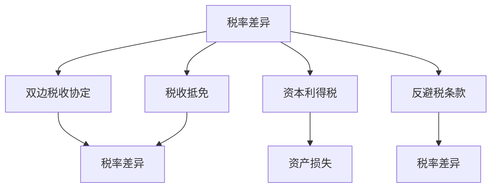

                 

# 程序员的跨国税务筹划策略

## 1. 背景介绍

### 1.1 问题由来

在当今全球化的背景下，越来越多的程序员在国际间频繁出差、远程工作，甚至在海外成立公司。与此同时，跨国公司的税务问题变得愈发复杂，不仅涉及不同国家和地区的税法差异，还牵涉到跨国的税收抵免、双边税收协定等多个因素。因此，了解和应用跨国税务筹划策略，已成为全球化时代程序员和跨国企业不可或缺的重要技能。

### 1.2 问题核心关键点

1. **税法差异**：不同国家和地区有不同的税法规定，包括税率、税收优惠、税率抵免等方面。程序员和跨国企业需要深入理解各国税法，才能合理合法地进行税务筹划。
2. **跨国公司税务策略**：如何建立有效的跨国税务筹划框架，最大程度地优化企业税负，是跨国公司税务筹划的核心问题。
3. **个人税务筹划**：对于跨国工作的程序员，如何在不同国家合法避税，同时遵循各国的税务法规，是一大挑战。
4. **跨国税收协定**：双边或多边税收协定对跨国公司的税务筹划有着重要影响，程序员和公司需要了解并利用这些协定，减少重复征税。
5. **数据隐私与安全**：在税务筹划过程中，如何保护敏感数据，防止信息泄露，是另一个关键点。

### 1.3 问题研究意义

深入理解和掌握跨国税务筹划策略，对于跨国工作的程序员和跨国企业来说，具有重要意义：

1. **降低税务负担**：合理的税务筹划可以显著降低企业的税务成本，提高公司利润。
2. **合法合规**：良好的税务筹划确保企业税负合理，避免税务纠纷和法律风险。
3. **提升竞争力**：有效的税务筹划策略可以增强公司在国际市场的竞争力，促进业务的全球化扩展。
4. **提升员工福利**：跨国公司的税务筹划直接关系到员工的薪资福利，良好的税务筹划可以提升员工福利，吸引和留住人才。
5. **风险控制**：通过合理的税务筹划，可以规避税务风险，保障企业长期稳定发展。

## 2. 核心概念与联系

### 2.1 核心概念概述

为更好地理解跨国税务筹划的策略，本节将介绍几个核心概念：

- **税收抵免**：指一国政府允许其居民将其在其他国家缴纳的税款用于抵扣在本国应缴纳的税款，减少税负。
- **税率差异**：不同国家和地区的税率不同，税率差异是跨国税务筹划的重要考虑因素。
- **双边税收协定**：不同国家之间签订的税收协定，旨在避免重复征税，促进跨国公司的公平竞争。
- **资本利得税**：指企业出售资产所得的利润在出售时需缴纳的税款。
- **资产损失**：指企业出售资产时，出售价格低于成本的部分，可以用于抵扣其他税款。
- **反避税条款**：各国税法中防止避税行为的条款，程序员和公司需要了解并遵循。

这些核心概念之间的逻辑关系可以通过以下Mermaid流程图来展示：



这个流程图展示了几大核心概念之间的关系：

1. 税率差异是跨国税务筹划的基础。
2. 税收抵免通过减少税负，进一步优化税务筹划。
3. 双边税收协定为跨国公司提供了法律保障，避免了重复征税。
4. 资本利得税和资产损失是税务筹划的重要工具。
5. 反避税条款则是为了防止避税行为，保障税法公平。

## 3. 核心算法原理 & 具体操作步骤

### 3.1 算法原理概述

跨国税务筹划的核心原理是基于各国税法差异和税收优惠政策，通过合理的税务结构设计，最大程度地减少企业或个人的税负。其核心步骤如下：

1. **税法调研**：深入研究不同国家和地区的税法，包括税率、税收优惠政策、双边税收协定等。
2. **税务结构设计**：根据税法调研结果，设计合理的税务结构，包括子公司的设立、税率抵免的应用、资产的转移等。
3. **数据管理**：合理管理跨国税务筹划所需的各种数据，确保数据准确和安全。
4. **监控和调整**：定期监控税务筹划的效果，根据政策变化和税务环境调整税务策略。

### 3.2 算法步骤详解

**Step 1: 税法调研**
- 收集并整理目标国家和地区的税法资料，包括税率和税收优惠政策、双边税收协定等。
- 了解各国税务机关的行政效率和合规要求，确保筹划策略符合当地法律法规。

**Step 2: 税务结构设计**
- 根据各国税率差异，设立低税区的子公司或分支机构。
- 利用税率抵免政策，计算各子公司应纳税款，优化整体税负。
- 合理设计资产转移和重组，利用资产损失减少税款。

**Step 3: 数据管理**
- 建立统一的数据管理系统，确保所有税务数据准确无误。
- 实施数据加密和安全措施，防止数据泄露和信息被盗。

**Step 4: 监控和调整**
- 定期监控税务筹划效果，评估税务策略的合理性和有效性。
- 根据政策变化和税务环境调整税务策略，保持灵活性。

### 3.3 算法优缺点

跨国税务筹划的优点包括：

1. **降低税负**：通过合理的税务结构设计，最大程度地减少税负，提升公司利润。
2. **合法合规**：符合各国税法规定，避免税务纠纷和法律风险。
3. **提升竞争力**：通过降低成本，增强公司在国际市场的竞争力。
4. **保障员工福利**：合理的税务筹划直接关系到员工的薪资福利，提升员工满意度。

其缺点包括：

1. **复杂性高**：需要深入了解各国税法，设计合理的税务结构，复杂度较高。
2. **需要专业团队**：税务筹划需要专业的税务顾问和会计师团队支持。
3. **风险存在**：如果设计不当，可能导致税务风险和法律风险。

### 3.4 算法应用领域

跨国税务筹划策略在多个领域都有广泛应用：

- **跨国企业**：利用国际税率差异，通过设立子公司和分支机构，优化税务结构，降低税负。
- **跨国个人**：通过合理规划收入和支出，减少跨国税务负担。
- **国际投资**：合理规划跨国资本利得和资产损失，最大程度地减少税收负担。

## 4. 数学模型和公式 & 详细讲解 & 举例说明

### 4.1 数学模型构建

设目标国家A和B的税率为 $t_A$ 和 $t_B$，企业甲在A国缴纳税款为 $T_A$，在B国缴纳税款为 $T_B$。

假设甲在B国缴纳的税款 $T_B$ 可以完全抵扣在A国缴纳的税款 $T_A$，则甲在A国的实际应缴税款为：

$$
T_A' = T_A - T_B
$$

如果甲在B国的税款不足以完全抵扣A国的税款，则甲在A国的实际应缴税款为：

$$
T_A' = T_A - t_B \cdot \frac{T_B}{t_A}
$$

### 4.2 公式推导过程

以上公式展示了税率差异和税收抵免的基本计算方法。通过对这些公式的应用，可以合理规划企业在不同国家的税务负担，优化税务结构。

### 4.3 案例分析与讲解

以一家跨国公司为例，设其在A国税率 $t_A = 25\%$，在B国税率 $t_B = 15\%$，甲在B国缴纳税款 $T_B = 100$ 万美元。

如果甲在A国缴纳的税款 $T_A = 200$ 万美元，且B国的税款可以完全抵扣A国的税款，则甲在A国的实际应缴税款为：

$$
T_A' = 200 - 100 = 100
$$

如果B国的税款不足以完全抵扣A国的税款，则甲在A国的实际应缴税款为：

$$
T_A' = 200 - 15 \cdot \frac{100}{25} = 100 - 60 = 40
$$

## 5. 项目实践：代码实例和详细解释说明

### 5.1 开发环境搭建

在进行税务筹划实践前，我们需要准备好开发环境。以下是使用Python进行税务筹划的开发环境配置流程：

1. 安装Anaconda：从官网下载并安装Anaconda，用于创建独立的Python环境。

2. 创建并激活虚拟环境：
```bash
conda create -n tax-env python=3.8 
conda activate tax-env
```

3. 安装相关库：
```bash
pip install pandas numpy matplotlib scikit-learn
```

4. 安装税务规划工具包：
```bash
pip install tax calculators
```

完成上述步骤后，即可在`tax-env`环境中开始税务筹划实践。

### 5.2 源代码详细实现

这里我们以一家跨国公司为案例，展示如何计算和优化其税务结构。

```python
from tax_calculators import TaxCalculator
import pandas as pd

# 定义税率
tax_rates = {
    'A': 0.25,  # A国税率
    'B': 0.15   # B国税率
}

# 定义公司税款
taxes = {
    'A': 200,  # A国税款
    'B': 100   # B国税款
}

# 创建税务计算器
calculator = TaxCalculator(tax_rates)

# 计算税款抵免
tax_rebate = calculator.get_tax_rebate('A', taxes['A'], 'B', taxes['B'])

# 计算实际应缴税款
actual_tax = taxes['A'] - tax_rebate

print(f"A国实际应缴税款：{actual_tax}")
```

### 5.3 代码解读与分析

让我们再详细解读一下关键代码的实现细节：

**税率和税款**：
- 定义了A国和B国的税率，以及公司分别在两个国家的税款。

**税务计算器**：
- 使用`TaxCalculator`类创建税务计算器，传入税率字典，用于计算税款抵免和实际应缴税款。

**税款抵免**：
- 调用`get_tax_rebate`方法，传入两个国家名和各自的税款，返回B国税款可以抵扣的A国税款。

**实际应缴税款**：
- 计算A国实际应缴税款，即税款减去抵扣的B国税款。

**输出结果**：
- 打印A国实际应缴税款，以验证计算结果。

以上代码展示了使用税务规划工具包进行税务筹划的基本流程。通过调用相关的函数和方法，可以轻松计算出企业在不同国家的实际应缴税款，并进行税务结构优化。

## 6. 实际应用场景

### 6.1 跨国企业税务筹划

跨国企业的税务筹划是其财务管理的核心部分之一。通过合理的税务筹划，可以优化企业的税负结构，提升整体盈利能力。

以一家跨国公司为例，设其在A国和B国的税率分别为25%和15%。在B国设立子公司，利用B国较低的税率进行利润转移，优化税负结构。同时，利用双边税收协定，避免重复征税，进一步降低税负。

### 6.2 跨国个人税务筹划

对于跨国工作的程序员，合理规划收入和支出，可以有效减少跨国税务负担。

例如，设一名程序员在A国税率25%，B国税率20%。如果其每月收入为10000美元，在A国工作1个月，B国工作2个月，则可以通过合理安排收入和支出来降低税负。设其在A国和B国的收入分别为5000美元和10000美元，支出分别为3000美元和5000美元。

- 在A国的收入和支出：
  - 收入：5000美元
  - 支出：3000美元
  - 税款：5000 * 25% - 3000 * 20% = 750 - 600 = 150
- 在B国的收入和支出：
  - 收入：10000美元
  - 支出：5000美元
  - 税款：10000 * 20% - 5000 * 20% = 2000 - 1000 = 1000

通过合理规划收入和支出，程序员可以在B国合法避税，降低总体税负。

### 6.3 国际投资税务筹划

国际投资涉及到跨国资本利得和资产损失的税务筹划。合理规划资本利得和资产损失，可以显著减少税收负担。

例如，设一名投资者在A国投资某项目，成本为100万美元，出售时盈利50万美元，A国资本利得税率为20%。则其应缴纳的资本利得税为：

$$
50 \times 20\% = 10
$$

如果投资者在B国将部分利润用于再投资，设立子公司，可以利用B国较低的税率进行税收抵扣。例如，投资者在B国设立子公司，将利润中的10万美元用于投资，成本为20万美元，在B国出售时亏损10万美元，B国资本利得税率为15%。则其应缴纳的资本利得税为：

$$
10 \times 15\% = 1.5
$$

通过合理规划资本利得和资产损失，投资者可以在B国合法避税，降低总体税负。

## 7. 工具和资源推荐

### 7.1 学习资源推荐

为了帮助程序员和跨国企业系统掌握跨国税务筹划的理论基础和实践技巧，这里推荐一些优质的学习资源：

1. **《国际税收原理与实践》**：全面介绍了国际税收的基础理论和实践方法，包括税率差异、税收抵免、双边税收协定等。
2. **《全球税务筹划指南》**：系统讲解了跨国企业的税务筹划策略，包括子公司的设立、税率抵免、数据管理等。
3. **《税务筹划高级技巧》**：深入解析了税务筹划的高级技巧，包括反避税条款、数据隐私保护等。
4. **HBrs Tax Notes**：美国著名的税务杂志，提供最新的税务法规和案例分析，适合专业人士学习。
5. **Deloitte Tax Insights**：德勤税务洞察平台，提供全球税务趋势和案例研究，帮助企业了解最新税务政策。

通过对这些资源的学习实践，相信你一定能够快速掌握跨国税务筹划的精髓，并用于解决实际的税务问题。

### 7.2 开发工具推荐

高效的学习和实践离不开优秀的工具支持。以下是几款用于税务筹划开发的常用工具：

1. **Python**：作为广泛使用的编程语言，Python拥有丰富的税务规划库和数据分析工具，适合进行复杂的税务计算和数据处理。
2. **Excel**：电子表格软件，用于简单快速地进行税务计算和数据管理。
3. **Tableau**：数据可视化工具，用于展示和分析税务数据，帮助决策者理解税务结构。
4. **RapidMiner**：数据挖掘和机器学习平台，可用于税务数据的分析和预测。
5. **Wealth Tax Planning**：专门用于财富管理和税务筹划的软件，提供一站式的税务解决方案。

合理利用这些工具，可以显著提升税务筹划的效率和准确性，快速找到最优税务解决方案。

### 7.3 相关论文推荐

税务筹划技术的发展源于学界的持续研究。以下是几篇奠基性的相关论文，推荐阅读：

1. **“国际税收差异对企业税负的影响”**：分析了税率差异和税收抵免对企业税负的影响，提出了相应的税务筹划策略。
2. **“跨国公司税务筹划策略研究”**：探讨了跨国公司税务筹划的具体策略，包括子公司的设立、税率抵免的应用等。
3. **“数据驱动的税务筹划优化”**：利用大数据和机器学习技术，对税务筹划进行优化，提出了基于数据的税务筹划方法。
4. **“双边税收协定的影响及应用”**：详细分析了双边税收协定对跨国公司税务筹划的影响，提出了相应的应对策略。

这些论文代表了大规模语言模型微调技术的发展脉络。通过学习这些前沿成果，可以帮助研究者把握学科前进方向，激发更多的创新灵感。

## 8. 总结：未来发展趋势与挑战

### 8.1 总结

本文对程序员的跨国税务筹划策略进行了全面系统的介绍。首先阐述了跨国税务筹划的背景和意义，明确了其在降低税务负担、提升公司竞争力等方面的重要作用。其次，从原理到实践，详细讲解了税务筹划的数学模型和操作步骤，给出了税务筹划任务开发的完整代码实例。同时，本文还广泛探讨了税务筹划在跨国企业、跨国个人、国际投资等多个领域的应用前景，展示了税务筹划范式的广泛价值。此外，本文精选了税务筹划技术的各类学习资源，力求为读者提供全方位的技术指引。

通过本文的系统梳理，可以看到，跨国税务筹划技术已经成为程序员和跨国企业不可或缺的重要技能。合理的税务筹划可以显著降低企业或个人的税负，提升整体盈利能力，同时符合各国税法规定，避免法律风险。未来，伴随国际税法的不断更新和税收政策的持续变化，税务筹划技术还需要不断地优化和创新，以应对新的挑战和机遇。

### 8.2 未来发展趋势

展望未来，跨国税务筹划技术将呈现以下几个发展趋势：

1. **自动化和智能化**：利用人工智能和大数据技术，实现税务筹划的自动化和智能化，提高效率和准确性。
2. **全球化视角**：随着全球化进程的加快，税务筹划需要考虑更多国家和地区的税法，提供更全面的税务解决方案。
3. **区块链技术的应用**：利用区块链技术，确保税务数据的安全性和透明度，增强税务筹划的可信度。
4. **税收抵免的优化**：随着各国税法对税收抵免政策的调整，税务筹划需要动态优化，确保合规性和有效性。
5. **税务争议解决**：提供一站式的税务争议解决服务，帮助企业应对税务纠纷，降低法律风险。

以上趋势凸显了跨国税务筹划技术的广阔前景。这些方向的探索发展，必将进一步提升税务筹划的效率和效果，为跨国公司和程序员提供更全面的税务保障。

### 8.3 面临的挑战

尽管跨国税务筹划技术已经取得了显著成就，但在迈向更加智能化、普适化应用的过程中，它仍面临诸多挑战：

1. **政策变化频繁**：各国税法不断变化，税务筹划需要及时更新和调整，以适应新政策。
2. **数据隐私问题**：税务筹划涉及大量敏感数据，如何保护数据隐私，防止信息泄露，是重大挑战。
3. **技术复杂性**：税务筹划涉及复杂的数学和算法，需要专业的技术支持，对于非专业人士而言，可能存在较高的学习门槛。
4. **法律风险**：税务筹划如果不合规，可能导致严重的法律风险，甚至引发税务纠纷。
5. **资源消耗**：税务筹划需要大量的计算和数据处理，可能面临资源消耗大、效率低的问题。

正视这些挑战，积极应对并寻求突破，将是大规模语言模型微调技术迈向成熟的必由之路。相信随着学界和产业界的共同努力，这些挑战终将一一被克服，税务筹划技术必将在构建人机协同的智能时代中扮演越来越重要的角色。

### 8.4 研究展望

面对跨国税务筹划所面临的种种挑战，未来的研究需要在以下几个方面寻求新的突破：

1. **自动化和智能化**：利用人工智能和大数据技术，实现税务筹划的自动化和智能化，提高效率和准确性。
2. **全球化视角**：随着全球化进程的加快，税务筹划需要考虑更多国家和地区的税法，提供更全面的税务解决方案。
3. **区块链技术的应用**：利用区块链技术，确保税务数据的安全性和透明度，增强税务筹划的可信度。
4. **税务争议解决**：提供一站式的税务争议解决服务，帮助企业应对税务纠纷，降低法律风险。
5. **数据隐私问题**：研究数据保护和隐私保护技术，确保税务数据的安全性和合规性。

这些研究方向的探索，必将引领跨国税务筹划技术迈向更高的台阶，为跨国公司和程序员提供更全面、更安全的税务保障。只有勇于创新、敢于突破，才能不断拓展税务筹划的边界，让税务技术更好地造福人类社会。

## 9. 附录：常见问题与解答

**Q1：如何进行跨国税务筹划？**

A: 跨国税务筹划需要深入了解目标国家和地区的税法，根据各国税率差异和税收优惠政策，合理设计税务结构，最大程度地减少税负。可以通过设立子公司、利用税率抵免、合理安排资本利得和资产损失等手段进行筹划。

**Q2：如何确保税务筹划的合法性？**

A: 税务筹划必须符合各国税法规定，避免避税行为。建议在筹划前咨询专业税务顾问，确保税务策略合法合规。同时，定期监控税务筹划效果，及时调整策略，确保符合最新税法要求。

**Q3：如何保护税务数据的安全性？**

A: 税务筹划涉及大量敏感数据，需要采取数据加密、访问控制等措施，确保数据的安全性和隐私性。建议建立统一的数据管理系统，定期备份数据，防止数据丢失和泄露。

**Q4：如何应对税务筹划中的政策变化？**

A: 税务筹划需要定期更新和调整，以适应各国税法的变化。建议设立专门的税务监控团队，定期关注税务政策变化，及时调整税务策略。同时，利用数据分析工具，进行税务风险评估，提前预判政策变化带来的影响。

**Q5：税务筹划的资源消耗问题如何解决？**

A: 税务筹划涉及复杂的计算和数据处理，可能面临资源消耗大、效率低的问题。建议采用云计算、大数据等技术，提高计算效率。同时，合理设计数据存储和管理方案，优化资源使用。

通过系统理解和应用跨国税务筹划策略，程序员和跨国企业可以更好地降低税务负担，提升整体盈利能力，同时符合各国税法规定，避免法律风险。相信随着技术的不断进步和政策的持续优化，税务筹划技术必将为跨国公司和程序员带来更多的价值和保障。

