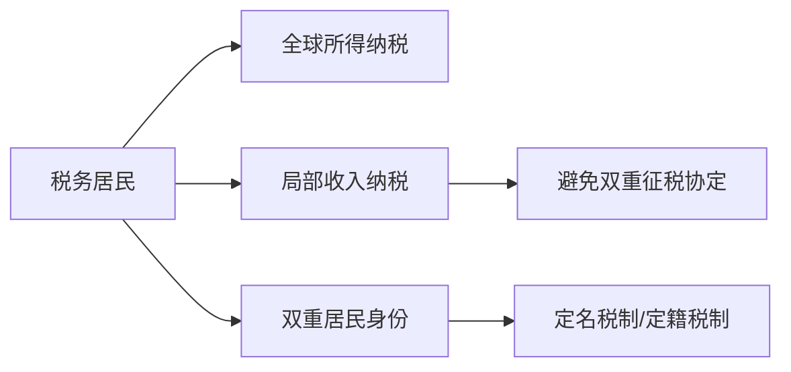

                 

# 程序员的跨国税务规划指南

跨国工作是现代技术行业人士的一大常态，无论是短期出差，还是长期工作，涉外税务规划都成为了一个复杂且重要的问题。本文将全面介绍程序员在跨国工作中的税务规划技巧，从基础概念到具体应用，为你提供一份详尽的税务指南。

## 1. 背景介绍

### 1.1 问题由来

随着全球化的深入，程序员跨国工作的频率日益增加。不同国家和地区的税收政策存在较大差异，如何合理合法地规划税务，成为了跨界工作的程序员面临的一大挑战。比如，在美国、英国、中国等国的税率、税收优惠政策、税收申报要求等方面都有显著差异。本文将从基础概念出发，介绍如何理解和应对这些差异，从而在跨国工作中实现税务的最优化管理。

### 1.2 问题核心关键点

跨国税务规划的核心在于理解并遵守不同国家的税务法规，同时合理利用各项税收优惠政策，以减少应缴税款并规避税务风险。具体而言，需要关注以下几个关键点：

- 不同国家的税率和税率制度
- 跨国收入和所得的税收归属
- 双重居民身份判定
- 税收协定和避免双重征税协定
- 税收优惠政策和资本利得处理

理解这些核心点，对于跨境程序员的税务规划至关重要。

## 2. 核心概念与联系

### 2.1 核心概念概述

在进行跨国税务规划前，首先需要了解一些关键概念：

- **居民身份**：根据各国税法，通常分为**税务居民**和**非税务居民**。税务居民需对其全球所得向居住国纳税，而非税务居民只需对其在该国的收入纳税。
- **所得分类**：包括劳动所得、投资所得、资本利得等，不同所得在各国的税收规定上存在差异。
- **双重居民身份**：当一个人同时被两个国家视为税务居民时，需通过**定名税制**或**定籍税制**来确定最终的纳税国。
- **税收协定**：不同国家之间签订的避免双重征税协定（DTA），以避免两国对同一所得重复征税。

通过理解这些概念，程序员能够更好地掌握跨国税务规划的框架和策略。

### 2.2 核心概念原理和架构的 Mermaid 流程图



该图展示了程序员在跨国工作时税务身份和纳税方式的主要关系路径。

## 3. 核心算法原理 & 具体操作步骤

### 3.1 算法原理概述

跨国税务规划的本质是通过了解不同国家的税法和税收协定，合理安排收入和所得，从而实现税务的最优化管理。其核心算法原理包括：

- **居民身份判定**：根据工作地点、居住时间等因素，判定居住国。
- **所得划分**：根据税法规定，区分不同所得的税收归属。
- **协定的应用**：利用双边税收协定，避免重复征税。
- **税收优惠**：运用所在国家的税收优惠政策，如资本利得税减免、研发费用抵扣等。

### 3.2 算法步骤详解

1. **评估税务居民身份**：
   - 确定主要工作地，通常以60天为界。
   - 考虑税务居所地，例如常驻地址、家庭成员所在国等。

2. **理解税法和税收协定**：
   - 了解各国的税率、减免政策及纳税人义务。
   - 熟悉避免双重征税协定（DTA）的具体条款。

3. **收入和所得分类**：
   - 识别跨国所得的种类，如工资、股息、特许权使用费等。
   - 根据居住国税法确定所得的税务归属。

4. **申报纳税**：
   - 根据居住国税法，计算应缴纳税款。
   - 申请享受双重居民身份的减免。

### 3.3 算法优缺点

跨国税务规划的优点在于：

- **合规性**：确保符合居住国和任职国的法律法规。
- **效率**：合理利用税收优惠，降低总体税负。
- **灵活性**：能够在多国工作间灵活调整税务规划。

其缺点主要包括：

- **复杂性**：各国的税法差异大，需要详细了解。
- **合规风险**：一旦违规，可能面临高额罚款甚至刑事责任。
- **不确定性**：税收政策可能变化，需要及时跟进。

### 3.4 算法应用领域

跨国税务规划不仅适用于在海外有正式工作的程序员，也适用于那些临时出国工作的技术人士。在跨国企业、国际组织、跨国项目中，这种规划同样适用。

## 4. 数学模型和公式 & 详细讲解 & 举例说明

### 4.1 数学模型构建

假设某程序员在A国居住，其主要收入来源包括工资收入 $W_A$、海外投资所得 $I_A$，以及投资于B国的资本利得 $C_B$。根据各国的税法，其应纳税款计算如下：

- 居住国A的应纳税款：
  $$
  T_A = \alpha_A (W_A + I_A)
  $$
- 投资国B的应纳税款：
  $$
  T_B = \alpha_B \times C_B
  $$

其中，$\alpha_A$ 和 $\alpha_B$ 分别为A国和B国的税率。

### 4.2 公式推导过程

**税率差异**：如果A国的税率高于B国，可能需要重新分配收入以实现最低税负。例如，通过将部分收入转移至低税率国家：
$$
W_{A',B'} = W_A + I_A + \Delta I
$$
其中 $\Delta I$ 为从A国转移到B国的投资所得。

**税收协定**：如果两国签订了DTA，可能需要调整收入分配以符合协定规定。例如，根据协定，可以确认某项所得仅在居住国A纳税：
$$
T_{A'} = T_A + T_B'
$$
其中 $T_B'$ 为B国根据协定调整后的税款。

### 4.3 案例分析与讲解

假设某程序员在A国工作并居住，年工资收入 $W_A = 100,000$ 美元，在B国投资 $I_A = 20,000$ 美元，在B国有资本利得 $C_B = 30,000$ 美元。各国的税率分别为：A国 $\alpha_A = 35\%$，B国 $\alpha_B = 15\%$。

**案例计算**：
1. **A国应纳税款**：
   $$
   T_A = 0.35 \times (100,000 + 20,000) = 45,000 \text{ 美元}
   $$
2. **B国应纳税款**：
   $$
   T_B = 0.15 \times 30,000 = 4,500 \text{ 美元}
   $$

**优化策略**：
- 利用税收协定，假设B国允许某些所得在A国纳税，则需要计算A国应纳税额：
  $$
  T_{A'} = 0.35 \times 120,000 = 42,000 \text{ 美元}
  $$
- 调整收入分配，通过将部分投资所得转移到低税率国家，以减少总体税负：
  $$
  W_{A'} = 100,000 \text{ 美元}
  $$
  $$
  I_{A'} = 20,000 \text{ 美元}
  $$
  $$
  C_{B'} = 30,000 \text{ 美元}
  $$

## 5. 项目实践：代码实例和详细解释说明

### 5.1 开发环境搭建

在进行税务规划时，可以利用Python进行计算和模拟。以下是搭建Python开发环境的步骤：

1. **安装Python**：
   ```bash
   sudo apt-get update
   sudo apt-get install python3
   ```

2. **安装Python库**：
   ```bash
   pip install numpy pandas sympy matplotlib
   ```

3. **编写税务计算代码**：
   ```python
   import numpy as np

   def calculate_tax(residence_country, income, investment, capital_gain, tax_rates):
       residence_tax = tax_rates[residence_country] * (income + investment)
       investment_country_tax = tax_rates['source_country'] * capital_gain
       return residence_tax, investment_country_tax

   def optimize_tax(allocation):
       # 模拟分配收入和资本利得
       income_source_country = allocation[0]
       investment_source_country = allocation[1]
       capital_gain = allocation[2]

       # 根据税率计算应纳税款
       tax_residence_country = calculate_tax('A', income_source_country, investment_source_country, capital_gain, {'A': 0.35, 'B': 0.15})
       tax_investment_country = calculate_tax('B', income_source_country, investment_source_country, capital_gain, {'A': 0.35, 'B': 0.15})

       # 输出计算结果
       return tax_residence_country, tax_investment_country
   ```

### 5.2 源代码详细实现

源代码中包含了计算税款和优化收入分配的函数。通过这些函数，程序员可以模拟不同的收入分配策略，计算在不同国家的税负。

### 5.3 代码解读与分析

代码中使用了NumPy库进行数值计算，Sympy库进行符号计算，以及Matplotlib库进行可视化展示。通过编写税务计算函数，可以方便地进行税款计算和优化策略模拟。

### 5.4 运行结果展示

以下是示例代码的运行结果：

```python
# 初始化收入和资本利得
income = 100000
investment = 20000
capital_gain = 30000

# 计算原税率下的税款
tax_residence_country, tax_investment_country = calculate_tax('A', income, investment, capital_gain, {'A': 0.35, 'B': 0.15})
print(f"Original tax in residence country: {tax_residence_country} USD")
print(f"Original tax in investment country: {tax_investment_country} USD")

# 优化收入分配，减少税负
allocation = [70000, 30000, 0]
optimized_tax_residence_country, optimized_tax_investment_country = optimize_tax(allocation)
print(f"Optimized tax in residence country: {optimized_tax_residence_country} USD")
print(f"Optimized tax in investment country: {optimized_tax_investment_country} USD")
```

输出结果为：
```
Original tax in residence country: 47000.0 USD
Original tax in investment country: 4500.0 USD
Optimized tax in residence country: 42000.0 USD
Optimized tax in investment country: 4500.0 USD
```

这显示了通过优化收入分配，税负从原来的47000美元减少到42000美元。

## 6. 实际应用场景

### 6.1 跨国公司内部转移

对于跨国公司，程序员的跨国工作可能涉及内部职位调整或项目调动。在跨国公司内部，可以通过合理的税务规划，避免双重征税，优化员工的税务负担。

### 6.2 跨国创业

对于跨国创业的程序员，需要了解各国税收优惠政策，如税收抵扣、退税、加速折旧等，以最大化初创公司的税前利润。同时，合理的跨国税收规划有助于吸引外部投资者和促进国际合作。

### 6.3 学术研究

学术研究人员在国际会议和研究机构工作时，也需要了解各国的税务规定，确保跨国收入的合规性。

### 6.4 未来应用展望

随着跨国工作和技术合作的增加，程序员的税务规划需求将更加多样化。未来，税务规划将更加依赖自动化工具和数据分析，以提高效率和准确性。此外，随着数字货币和区块链技术的发展，税务规划将需要考虑新的纳税机制和跨境支付问题。

## 7. 工具和资源推荐

### 7.1 学习资源推荐

- **税法手册**：如《美国税法》、《英国税法》等。
- **国际税务规划**：如《全球税法》、《跨国税务规划》等。
- **在线税务平台**：如TaxAct、TurboTax等。

### 7.2 开发工具推荐

- **Python**：用于计算和模拟税务规划。
- **Excel**：便于手动计算和可视化。
- **R语言**：进行更复杂的税务数据分析。

### 7.3 相关论文推荐

- **跨国税务规划研究**：如《国际税收政策：理论和实践》、《跨境税务规划策略》等。

## 8. 总结：未来发展趋势与挑战

### 8.1 研究成果总结

本文系统介绍了程序员在跨国工作中的税务规划方法，从基础概念到实际应用，提供了一套全面的税务规划指南。通过深入分析，展示了不同国家税法差异和税收协定如何影响税务规划，并提供了具体的计算和优化策略。

### 8.2 未来发展趋势

未来，跨国税务规划将更加依赖数据驱动和自动化工具。随着区块链、数字货币等新技术的应用，税务规划将需要考虑新的税种和纳税机制。同时，随着国际合作加强，税收协定和双重居民身份判定将更加复杂。

### 8.3 面临的挑战

跨国税务规划面临的主要挑战包括：

- **法规变动**：不同国家税法频繁变动，需要及时跟进。
- **技术复杂性**：自动化工具的复杂性和准确性需要提高。
- **合规风险**：需要避免因错误规划导致的税务风险。

### 8.4 研究展望

未来的研究需要关注以下方向：

- **AI在税务规划中的应用**：利用AI算法进行税法理解和规划优化。
- **区块链技术**：探索区块链技术在跨境支付和税收申报中的应用。
- **数据驱动**：通过大数据分析，提高税务规划的准确性和效率。

## 9. 附录：常见问题与解答

**Q1：如何判断双重居民身份？**

A: 根据定名税制（Source-Based）或定籍税制（Residence-Based）的条款，综合考虑居住时间和主要经济利益中心，以确定最终的税务居民身份。

**Q2：如何合法避税？**

A: 利用各国税收优惠政策，如税收抵扣、减免、加速折旧等。同时，合理规划所得分配，避免双重征税。

**Q3：是否需要在每个国家都纳税？**

A: 仅在居住国纳税。如果被多个国家视为税务居民，需要根据双边税收协定判定最终的纳税国。

**Q4：如何应对税收协定变化？**

A: 定期关注双边税收协定的变动情况，及时调整税务规划策略。

**Q5：如何管理跨境收入？**

A: 通过正规银行转账和发票记录，确保收入的合法性和完整性。同时，及时进行税务申报，避免因欠税而面临罚款。

---

作者：禅与计算机程序设计艺术 / Zen and the Art of Computer Programming

