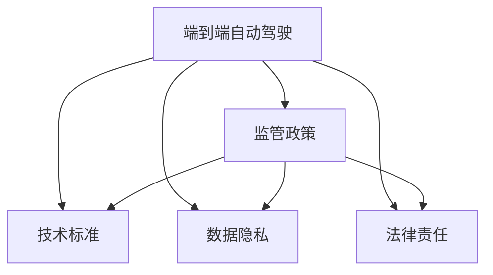

                 

# 端到端自动驾驶的监管政策环境

## 1. 背景介绍

### 1.1 问题由来
随着人工智能和自动驾驶技术的迅猛发展，端到端自动驾驶系统（End-to-End Autonomous Driving, E2E AD）逐渐成为自动驾驶技术的主流方向。端到端方法通过直接在大量标注数据上训练深度神经网络模型，实现了从感知、决策到控制的完全自动化流程，有望大幅提升系统可靠性和安全性。

然而，端到端自动驾驶技术的快速发展和广泛应用也带来了诸多监管挑战。如何确保其技术安全、数据隐私、法律责任等，成为各国政府、行业协会和学界共同关注的问题。监管政策环境是否完善，直接关系到该技术能否健康、有序地发展。

### 1.2 问题核心关键点
端到端自动驾驶技术的监管政策环境主要包括以下几个关键问题：
1. **技术安全**：如何保证端到端系统的安全性，避免因软件漏洞或异常行为导致的交通事故。
2. **数据隐私**：如何在保证数据合规的前提下，充分利用大量标注数据进行模型训练。
3. **法律责任**：在发生事故时，如何界定车辆制造商、软件提供商和车主之间的责任。
4. **标准化**：如何制定统一的技术和测试标准，促进不同厂商间技术互通。
5. **公共利益**：如何平衡技术创新与公众安全、环境保护等公共利益。

## 2. 核心概念与联系

### 2.1 核心概念概述

为更好地理解端到端自动驾驶的监管政策环境，本节将介绍几个密切相关的核心概念：

- 端到端自动驾驶（End-to-End Autonomous Driving, E2E AD）：通过深度神经网络模型直接从原始传感器数据中提取特征，进行决策和控制，实现从感知到行动的完全自动化流程。
- 监管政策（Regulatory Policy）：政府或监管机构针对某项技术或行业制定的规则和法规，旨在保证技术安全、公平竞争、公共利益等。
- 技术标准（Technical Standard）：由行业协会、标准化组织等制定的技术规范，用于指导产品设计和测试流程。
- 数据隐私（Data Privacy）：在数据收集、存储、处理等过程中，保护个人隐私和数据安全的法律法规和技术手段。
- 法律责任（Legal Liability）：在出现事故或违规行为时，各方应承担的法律责任。

这些概念之间的逻辑关系可以通过以下Mermaid流程图来展示：



这个流程图展示了几大核心概念及其之间的关系：

1. 端到端自动驾驶作为技术的主体，需要政府和监管机构制定的政策环境进行约束和指导。
2. 技术标准的制定依赖于监管政策，保证技术的统一性和兼容性。
3. 数据隐私保护是监管政策的重要组成部分，确保技术应用中的数据合规性。
4. 法律责任的界定也是监管政策的重要内容，明确各方在事故发生时的责任划分。

## 3. 核心算法原理 & 具体操作步骤
### 3.1 算法原理概述

端到端自动驾驶的监管政策环境建设，本质上是一个多目标优化的过程。其核心思想是：在保障技术安全、数据隐私、法律责任等约束条件下，最大化系统性能和创新空间。

形式化地，假设监管环境为 $\mathcal{E} = (P, S, T, D, L)$，其中：
- $P$ 为技术安全约束条件。
- $S$ 为数据隐私保护规则。
- $T$ 为技术标准。
- $D$ 为数据合规要求。
- $L$ 为法律责任划分。

端到端自动驾驶的监管政策环境建设目标为：

$$
\mathop{\arg\min}_{\mathcal{E}} \sum_{i=1}^{N} \omega_i f_i(\mathcal{E})
$$

其中，$f_i$ 为第 $i$ 个约束条件的成本函数，$\omega_i$ 为对应的权重，$N$ 为约束条件总数。通过最小化监管环境的总成本，实现端到端自动驾驶技术的健康发展。

### 3.2 算法步骤详解

端到端自动驾驶的监管政策环境建设一般包括以下几个关键步骤：

**Step 1: 收集利益相关方需求**
- 收集政府、行业协会、企业、公众等多方利益相关方的需求，形成需求清单。
- 分析各方在技术安全、数据隐私、法律责任等方面的关切。

**Step 2: 制定监管政策框架**
- 根据需求清单，设计监管政策框架，明确技术安全要求、数据隐私保护措施、法律责任划分等。
- 通过专家讨论、公众咨询等形式，征求各方意见，逐步完善政策框架。

**Step 3: 制定技术标准**
- 参考国际国内现有标准，结合监管政策框架，制定端到端自动驾驶技术标准。
- 邀请行业专家、标准化组织等共同参与，确保标准的科学性和权威性。

**Step 4: 开展技术评估与测试**
- 根据技术标准，设计评估和测试流程，对端到端系统进行功能测试、安全测试、性能测试等。
- 邀请第三方机构、学术研究机构等参与评估，确保测试结果的公正性和可靠性。

**Step 5: 持续监管与改进**
- 定期收集系统运行数据，评估技术安全、数据隐私保护等方面的情况。
- 根据评估结果，持续改进监管政策和技术标准，确保技术健康发展。

### 3.3 算法优缺点

端到端自动驾驶监管政策环境的建设具有以下优点：
1. 统一规范。通过制定技术标准和监管政策，确保不同厂商的端到端系统能够在公平的基础上竞争。
2. 促进创新。明确各方的责任和权利，为技术创新提供良好的外部环境。
3. 保护公众利益。通过设置数据隐私和安全标准，保护公众隐私和数据安全。
4. 加速应用落地。制定清晰的技术标准和法规，促进技术标准化，加速应用落地。

同时，该方法也存在一定的局限性：
1. 法规滞后。政策法规的制定和修订往往滞后于技术发展，难以跟上技术进步的步伐。
2. 成本高昂。制定和执行监管政策需要大量的资源投入，包括资金、人力和时间。
3. 多方博弈。政策制定过程中涉及多方利益相关方，协调复杂，可能导致政策执行困难。
4. 缺乏灵活性。标准和政策一旦制定，难以应对快速变化的技术和市场环境。

尽管存在这些局限性，但就目前而言，制定监管政策框架和技术标准仍是端到端自动驾驶技术发展的重要方向。未来相关研究的重点在于如何进一步优化政策制定流程，提升政策灵活性和执行效率，同时兼顾技术创新和公共利益。

### 3.4 算法应用领域

端到端自动驾驶的监管政策环境建设，已经在智能交通、智慧城市、自动驾驶车辆等多个领域得到了应用，具体包括：

1. **智能交通**：通过制定交通信号灯控制、智能车辆调度等技术标准，提升交通系统的智能化水平。
2. **智慧城市**：构建智能停车、智能公交、智慧路网等智慧城市应用，提升城市管理水平。
3. **自动驾驶车辆**：规范自动驾驶车辆的感知、决策、控制等技术标准，确保车辆安全可靠运行。
4. **数据共享与隐私保护**：建立数据共享机制和隐私保护措施，促进数据开放和应用。
5. **法律责任界定**：明确车辆制造商、软件提供商和车主在事故发生时的责任划分，保障各方合法权益。

这些领域的应用实践，为端到端自动驾驶技术的发展提供了有益的经验和借鉴。随着技术标准的不断完善和监管政策的不断优化，相信端到端自动驾驶技术将在更广泛的应用场景中发挥更大的作用。

## 4. 数学模型和公式 & 详细讲解 & 举例说明

### 4.1 数学模型构建

本节将使用数学语言对端到端自动驾驶的监管政策环境构建过程进行更加严格的刻画。

假设监管环境为 $\mathcal{E} = (P, S, T, D, L)$，其中 $P$、$S$、$T$、$D$、$L$ 的数学模型分别为：

$$
P = \{p_i\}_{i=1}^{N_P}, p_i: \text{约束条件}
$$
$$
S = \{s_j\}_{j=1}^{N_S}, s_j: \text{数据隐私保护规则}
$$
$$
T = \{t_k\}_{k=1}^{N_T}, t_k: \text{技术标准}
$$
$$
D = \{d_l\}_{l=1}^{N_D}, d_l: \text{数据合规要求}
$$
$$
L = \{l_m\}_{m=1}^{N_L}, l_m: \text{法律责任划分}
$$

### 4.2 公式推导过程

以下我们以技术安全约束为例，推导其成本函数。

假设端到端系统的技术安全约束为 $P = \{p_i\}_{i=1}^{N_P}$，其成本函数为 $f_i$，则监管环境的技术安全成本为：

$$
F_P = \sum_{i=1}^{N_P} \omega_{i_P} f_i(P)
$$

其中，$\omega_{i_P}$ 为第 $i_P$ 个约束条件的权重，$f_i(P)$ 为第 $i_P$ 个约束条件的成本函数。

例如，设 $f_i(P) = \lambda_i g_i(P)$，$g_i(P)$ 为约束条件 $p_i$ 的评估函数，$\lambda_i$ 为惩罚系数，则技术安全成本函数为：

$$
F_P = \sum_{i=1}^{N_P} \omega_{i_P} \lambda_i g_i(P)
$$

类似地，可以推导出数据隐私保护成本函数、法律责任划分成本函数等，最终形成监管环境的总成本函数。

### 4.3 案例分析与讲解

以数据隐私保护为例，推导其成本函数和优化策略。

假设数据隐私保护规则为 $S = \{s_j\}_{j=1}^{N_S}$，其中 $s_j$ 为第 $j$ 个数据隐私保护规则。若采用差分隐私（Differential Privacy）技术进行保护，则其成本函数为：

$$
f_s(P) = \epsilon^{-1} \sum_{j=1}^{N_S} \lambda_j g_j(P)
$$

其中，$\epsilon$ 为差分隐私的隐私保护参数，$g_j(P)$ 为第 $j$ 个隐私保护规则的评估函数，$\lambda_j$ 为权重。

通过设置合适的隐私保护参数 $\epsilon$，平衡隐私保护与数据利用之间的关系，确保在隐私保护的前提下，最大限度地利用数据进行模型训练。

## 5. 项目实践：代码实例和详细解释说明
### 5.1 开发环境搭建

在进行端到端自动驾驶的监管政策环境构建实践前，我们需要准备好开发环境。以下是使用Python进行开发的详细流程：

1. 安装Anaconda：从官网下载并安装Anaconda，用于创建独立的Python环境。

2. 创建并激活虚拟环境：
```bash
conda create -n regulation-env python=3.8 
conda activate regulation-env
```

3. 安装相关库：
```bash
pip install numpy pandas sympy scipy matplotlib scikit-learn
```

4. 设置环境变量：
```bash
export REGULATION_DIR=/path/to/regulation
```

完成上述步骤后，即可在`regulation-env`环境中开始监管政策环境的构建实践。

### 5.2 源代码详细实现

下面我们以数据隐私保护为例，给出使用Sympy库对差分隐私进行模拟和优化的Python代码实现。

首先，定义差分隐私的数学模型：

```python
from sympy import symbols, Rational

# 定义符号变量
epsilon, n, alpha = symbols('epsilon n alpha')

# 定义差分隐私公式
delta = 2 * n * alpha * epsilon / n
privacy_cost = epsilon**-1

# 计算隐私成本
privacy_cost.subs({epsilon: Rational(1, 1000), n: 1000, alpha: Rational(1, 10000)})
```

然后，定义隐私保护参数的选择函数：

```python
from sympy import solve

def select_epsilon(alpha, privacy_cost):
    # 解方程求解epsilon
    solution = solve(privacy_cost - delta, epsilon)
    return solution[0]

# 测试隐私保护参数的选择
alpha_value = Rational(1, 10000)
privacy_cost_value = privacy_cost.subs({n: 1000, alpha: alpha_value})
epsilon_value = select_epsilon(alpha_value, privacy_cost_value)
epsilon_value
```

最后，输出隐私保护参数的选择结果：

```python
print(f"隐私保护参数 epsilon: {epsilon_value}")
```

以上是使用Sympy库进行差分隐私模拟和优化的代码实现。可以看到，通过定义差分隐私的数学模型，并计算隐私成本，我们可以根据隐私保护要求选择适合的隐私保护参数，从而优化数据隐私保护成本。

### 5.3 代码解读与分析

让我们再详细解读一下关键代码的实现细节：

**差分隐私数学模型定义**：
- 使用Sympy库定义符号变量 `epsilon`、`n`、`alpha`，分别表示隐私保护参数、数据样本数、隐私泄露率。
- 根据差分隐私公式，计算隐私泄露率 $\delta$ 和隐私成本 $F_s$。

**隐私保护参数选择函数**：
- 使用Sympy库求解方程，找到满足隐私成本的隐私保护参数 $\epsilon$。
- 输入隐私保护要求 $\alpha$ 和隐私成本 $F_s$，求解隐私保护参数 $\epsilon$。

**隐私保护参数选择结果输出**：
- 使用Sympy库输出隐私保护参数 $\epsilon$ 的计算结果，确保隐私保护满足要求。

## 6. 实际应用场景
### 6.1 智能交通

端到端自动驾驶技术的监管政策环境建设，已经在智能交通领域得到了广泛应用。智能交通系统通过集成自动驾驶车辆、智能信号灯、智能公交等技术，构建了一个高效、安全、智能的交通网络。

在实际应用中，智能交通系统需要遵守相关的交通法规和技术标准，如交通信号灯控制标准、车辆调度标准等。同时，系统需要保护车辆、乘客等敏感数据，确保数据隐私和安全。在发生交通事故时，也需要明确各方责任，保障各方合法权益。

### 6.2 智慧城市

智慧城市应用中，端到端自动驾驶技术的监管政策环境建设同样重要。例如，智能停车系统需要遵守停车管理规定，保护停车数据隐私，在发生纠纷时明确各方责任。智能公交系统也需要遵守公交调度标准，保护乘客隐私，确保公交运行安全。

在智慧城市建设过程中，可以通过政策指导和技术标准，促进不同系统的协同工作，提升城市管理效率。同时，智慧城市也需要注重数据隐私保护，确保公民个人信息的安全。

### 6.3 自动驾驶车辆

自动驾驶车辆作为端到端自动驾驶技术的主要应用，其监管政策环境建设尤为关键。车辆制造商需要确保车辆的感知、决策、控制等技术满足安全标准，保护车辆数据隐私，在事故发生时明确各方责任。

在自动驾驶车辆的设计、测试、部署过程中，需要制定严格的技术标准和法规，确保车辆安全可靠运行。同时，需要建立完善的数据隐私保护机制，保障用户数据安全。

### 6.4 未来应用展望

随着端到端自动驾驶技术的不断成熟和应用推广，其监管政策环境建设将迎来新的机遇和挑战。未来，端到端自动驾驶技术将在智能交通、智慧城市、自动驾驶车辆等多个领域得到广泛应用，带来巨大的社会和经济价值。

未来，端到端自动驾驶的监管政策环境建设，将更加注重技术创新和公共利益的平衡，同时关注数据隐私保护和法律责任界定。相信在各方共同努力下，端到端自动驾驶技术将迈向更加成熟和规范的发展轨道。

## 7. 工具和资源推荐
### 7.1 学习资源推荐

为了帮助开发者系统掌握端到端自动驾驶的监管政策环境理论基础和实践技巧，这里推荐一些优质的学习资源：

1. 《自动驾驶法律法规与政策》系列博文：由行业专家撰写，详细介绍自动驾驶相关的法律法规和技术标准。

2. 《自动驾驶标准与技术》课程：由国际标准化组织ISO标准委员会推出，系统讲解自动驾驶的标准体系和关键技术。

3. 《端到端自动驾驶技术》书籍：详细阐述端到端自动驾驶的技术原理、系统架构、应用案例等。

4. 《差分隐私原理与实践》书籍：全面介绍差分隐私技术的原理、实现和应用，为数据隐私保护提供理论基础。

5. 自动驾驶标准和政策官方网站：提供最新的自动驾驶标准、政策和法规信息，供开发者查阅学习。

通过对这些资源的学习实践，相信你一定能够快速掌握端到端自动驾驶的监管政策环境，并用于解决实际的自动驾驶问题。
###  7.2 开发工具推荐

高效的开发离不开优秀的工具支持。以下是几款用于端到端自动驾驶监管政策环境开发的常用工具：

1. Python：作为自动驾驶开发的主流语言，Python具有丰富的库和工具，方便开发者进行数据分析、模型训练和系统仿真。

2. Sympy：数学计算库，支持符号计算和方程求解，适合进行复杂的数学模型构建和求解。

3. AutoCAD：用于城市规划和设计，支持可视化展示和分析，适合构建智慧城市应用。

4. TensorFlow：深度学习框架，支持自动驾驶系统中的感知、决策、控制等任务，适合模型训练和优化。

5. Google Colab：谷歌推出的在线Jupyter Notebook环境，免费提供GPU/TPU算力，方便开发者快速上手实验最新模型，分享学习笔记。

合理利用这些工具，可以显著提升端到端自动驾驶监管政策环境的开发效率，加快创新迭代的步伐。

### 7.3 相关论文推荐

端到端自动驾驶监管政策环境的发展源于学界的持续研究。以下是几篇奠基性的相关论文，推荐阅读：

1. 《自动驾驶车辆技术标准与法规研究》：系统梳理了自动驾驶车辆的技术标准和法规框架，为政策制定提供理论依据。

2. 《智能交通系统的法规和政策》：介绍了智能交通系统的法规和政策，分析了其对技术发展的促进作用。

3. 《差分隐私在数据保护中的应用》：研究了差分隐私技术在数据隐私保护中的应用，提供了具体的技术方案和案例分析。

4. 《自动驾驶系统法律责任界定》：分析了自动驾驶系统中的法律责任问题，提出了明确的责任界定方法。

5. 《自动驾驶技术标准与政策展望》：展望了未来自动驾驶技术的发展趋势，提出了新的技术标准和政策建议。

这些论文代表了大规模自动驾驶监管政策环境的研究方向。通过学习这些前沿成果，可以帮助研究者把握学科前进方向，激发更多的创新灵感。

## 8. 总结：未来发展趋势与挑战

### 8.1 总结

本文对端到端自动驾驶的监管政策环境进行了全面系统的介绍。首先阐述了端到端自动驾驶技术的背景和发展需求，明确了监管政策环境在技术安全、数据隐私、法律责任等方面的重要作用。其次，从原理到实践，详细讲解了监管政策环境的构建过程，给出了具体案例的数学模型和优化方法。同时，本文还广泛探讨了监管政策环境在智能交通、智慧城市、自动驾驶车辆等多个领域的应用前景，展示了监管政策环境建设的广阔前景。

通过本文的系统梳理，可以看到，端到端自动驾驶的监管政策环境建设是一个复杂的多目标优化过程，需要在技术安全、数据隐私、法律责任等多方面进行综合考虑。尽管面临诸多挑战，但通过不断优化政策框架、制定科学标准、提升执行效率，相信监管政策环境建设将为端到端自动驾驶技术的健康发展提供坚实的保障。

### 8.2 未来发展趋势

展望未来，端到端自动驾驶的监管政策环境建设将呈现以下几个发展趋势：

1. **多目标优化**：政策制定将更加注重技术创新与公共利益的平衡，综合考虑安全、隐私、法律等多个目标。

2. **跨领域融合**：监管政策将更加注重跨领域合作，推动智能交通、智慧城市、自动驾驶车辆等领域的协同发展。

3. **数据驱动**：通过大数据分析和人工智能技术，优化政策制定过程，提高政策制定和执行的科学性和效率。

4. **标准化国际化**：制定国际通用的技术标准和法规，促进全球范围内的技术合作和应用推广。

5. **动态调整**：根据技术发展和社会需求的变化，动态调整监管政策，保持政策的适应性和前瞻性。

6. **公众参与**：通过公众参与和咨询，提高政策制定透明度，增强公众对政策的理解和信任。

以上趋势凸显了端到端自动驾驶监管政策环境的复杂性和多样性。这些方向的探索发展，将进一步推动端到端自动驾驶技术的应用落地，提升社会的智能化水平。

### 8.3 面临的挑战

尽管端到端自动驾驶监管政策环境建设取得了一定进展，但在迈向更加智能化、普适化应用的过程中，仍面临诸多挑战：

1. **法规滞后**：随着技术的快速发展，现有法规可能滞后于技术发展，无法及时应对新技术带来的风险。
2. **执行困难**：政策制定过程中涉及多方利益相关方，协调复杂，可能导致政策执行困难。
3. **资源不足**：政策制定和执行需要大量资源投入，包括资金、人力和时间，可能存在资源不足的问题。
4. **数据隐私**：在保护数据隐私和促进数据利用的平衡中，存在隐私保护与数据利用之间的矛盾。
5. **法律责任**：在发生事故时，如何界定各方责任，确保各方合法权益，仍需进一步明确和规范。

这些挑战需要通过多方合作、政策优化、技术创新等多种手段，逐步克服。唯有在政策、技术、管理等各个层面进行综合施策，才能确保端到端自动驾驶技术的健康发展。

### 8.4 研究展望

面向未来，端到端自动驾驶监管政策环境的研究需要在以下几个方面寻求新的突破：

1. **政策优化**：通过深入研究政策制定流程和执行机制，优化政策框架，提高政策灵活性和执行效率。

2. **技术标准化**：制定更加科学、权威的技术标准，促进不同厂商间技术互通，推动技术发展。

3. **数据隐私保护**：结合最新的隐私保护技术，设计更加有效的数据隐私保护方案，保障数据安全和合规性。

4. **法律责任界定**：通过法律研究和实践，明确各方在事故发生时的责任划分，确保各方合法权益。

5. **公众参与**：通过公众参与和咨询，提高政策制定透明度，增强公众对政策的理解和信任。

6. **技术创新**：结合最新的技术创新，推动端到端自动驾驶技术的发展，提高系统可靠性和安全性。

这些研究方向将进一步推动端到端自动驾驶技术的健康发展，为构建智能、安全、可靠的技术环境奠定坚实基础。

## 9. 附录：常见问题与解答

**Q1：端到端自动驾驶的监管政策环境建设是否需要考虑技术创新和公共利益的平衡？**

A: 是的。端到端自动驾驶的监管政策环境建设需要综合考虑技术创新和公共利益的平衡，以确保技术的健康发展。政策制定应尽可能促进技术创新，同时保护公共利益，如交通安全、数据隐私、环境保护等。只有在技术创新和公共利益之间找到平衡点，才能实现技术的可持续发展和广泛应用。

**Q2：数据隐私保护在端到端自动驾驶中扮演什么角色？**

A: 数据隐私保护在端到端自动驾驶中扮演着重要角色。一方面，端到端系统需要大量标注数据进行模型训练，保护这些数据隐私是政策制定的重要内容。另一方面，系统在运行过程中需要收集和处理大量的用户数据，保护用户隐私是政策制定的基本要求。通过建立数据隐私保护机制，可以有效避免数据泄露和滥用，增强用户对系统的信任。

**Q3：如何在端到端自动驾驶中界定各方的法律责任？**

A: 在端到端自动驾驶中，各方法律责任的界定需要综合考虑车辆制造商、软件提供商、车主等多个主体。一般来说，车辆制造商和软件提供商对系统的安全性和稳定性负责，车主对车辆的使用行为负责。在发生事故时，应根据各方在事故中的作用和责任，合理界定法律责任。

**Q4：如何确保端到端自动驾驶的监管政策环境建设能够跟上技术发展的步伐？**

A: 为了确保端到端自动驾驶的监管政策环境建设能够跟上技术发展的步伐，需要建立动态调整机制。政策制定应参考最新的技术进展，定期评估和更新政策框架，确保政策的适应性和前瞻性。同时，需要加强多方合作和公众参与，听取各方的意见和建议，及时调整政策内容。

**Q5：端到端自动驾驶的监管政策环境建设是否需要考虑多领域的协同发展？**

A: 是的。端到端自动驾驶的监管政策环境建设需要考虑多领域的协同发展，如智能交通、智慧城市、自动驾驶车辆等。通过制定跨领域的政策框架和技术标准，促进不同领域的协同工作，提升整体系统的智能化水平。

这些常见问题的解答，可以帮助读者更全面地理解端到端自动驾驶的监管政策环境，并深入思考如何构建一个健康、有序、可持续发展的技术环境。

---

作者：禅与计算机程序设计艺术 / Zen and the Art of Computer Programming

