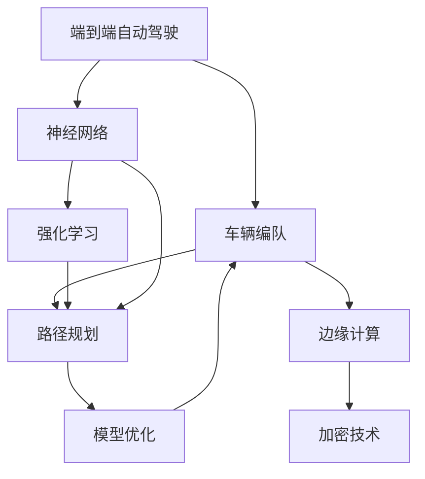

                 

# 端到端自动驾驶的车辆编队安全与隐私保护

> 关键词：端到端自动驾驶, 车辆编队, 安全保护, 隐私保护, 神经网络, 强化学习, 路径规划, 模型优化, 边缘计算, 加密技术

## 1. 背景介绍

随着人工智能技术在自动驾驶领域的应用逐渐深入，端到端自动驾驶系统成为未来智能交通的核心。端到端自动驾驶系统，指的是从传感器数据获取、环境感知、路径规划、行为决策到车辆控制的全过程都在同一模型中完成，无需外部环境感知和决策代理的干预，大幅提升了系统的响应速度和鲁棒性。

然而，车辆编队是自动驾驶中的难点之一。车辆编队要求多辆车之间进行高效的通信和协调，通过实时感知和动态响应保持同步，同时还需要确保编队内车辆之间的安全距离。为了实现这一目标，本文聚焦于基于神经网络和强化学习的车辆编队优化模型，提出了一套端到端自动驾驶的车辆编队安全与隐私保护方案。

## 2. 核心概念与联系

### 2.1 核心概念概述

为更好地理解基于神经网络和强化学习的车辆编队优化模型，本节将介绍几个密切相关的核心概念：

- **端到端自动驾驶**：从传感器数据获取、环境感知、路径规划、行为决策到车辆控制的全过程都在同一模型中完成，无需外部环境感知和决策代理的干预。
- **车辆编队**：多辆车之间通过实时通信和协调，保持同步行驶，同时确保编队内车辆之间的安全距离。
- **神经网络**：一种由大量人工神经元组成的计算模型，通过多层处理实现从输入到输出的映射。
- **强化学习**：通过奖励和惩罚机制，使智能体在动态环境中通过试错学习最优策略。
- **路径规划**：根据目标位置和环境条件，计算最优行驶路径。
- **模型优化**：通过算法优化，提升模型性能和效率。
- **边缘计算**：将计算任务分布在网络边缘的多个计算节点上，实现低延迟和高可靠性的计算。
- **加密技术**：通过加密算法保护数据隐私和安全传输。

这些核心概念之间的逻辑关系可以通过以下Mermaid流程图来展示：



这个流程图展示了一个端到端自动驾驶系统中的核心组件及其相互关系：

1. 端到端自动驾驶系统包括环境感知、路径规划、行为决策和车辆控制等模块。
2. 车辆编队通过神经网络和强化学习进行优化，路径规划与模型优化密切相关。
3. 边缘计算分布在网络边缘，实现低延迟的计算。
4. 加密技术保护数据隐私和安全传输。

这些概念共同构成了端到端自动驾驶系统的基本框架，通过协调各模块的相互作用，实现高效的车辆编队和安全隐私保护。

## 3. 核心算法原理 & 具体操作步骤

### 3.1 算法原理概述

本文提出的车辆编队优化模型基于神经网络和强化学习，通过多智能体的协作与路径规划，确保编队内车辆的安全与隐私。该模型的核心思想如下：

1. **环境感知与状态估计**：通过传感器数据，如激光雷达和摄像头，感知环境，并估计车辆状态。
2. **路径规划**：使用神经网络预测最优路径，同时考虑编队内车辆之间的相对位置和速度。
3. **行为决策**：通过强化学习优化编队策略，确保编队内车辆保持同步，同时避免碰撞和干扰。
4. **模型优化**：使用模型优化算法提升路径规划和行为决策的效率和精度。
5. **边缘计算**：在网络边缘节点上执行实时计算，以降低延迟和提高可靠性。
6. **加密技术**：对数据进行加密处理，保护通信隐私。

### 3.2 算法步骤详解

基于神经网络和强化学习的车辆编队优化模型一般包括以下几个关键步骤：

**Step 1: 准备数据与环境**

- 收集车辆编队任务的相关数据，包括车辆状态、环境条件、路径信息等。
- 将传感器数据转换为网络输入，包括激光雷达点云、摄像头图像等。
- 对数据进行预处理，如归一化、噪声过滤等。

**Step 2: 设计神经网络模型**

- 使用卷积神经网络(CNN)处理图像和点云数据，提取特征。
- 使用循环神经网络(RNN)或长短期记忆网络(LSTM)处理时间序列数据，捕捉车辆状态的变化趋势。
- 设计多层感知机(MLP)或注意力机制，用于路径规划和决策优化。

**Step 3: 强化学习设计**

- 定义状态空间，包括车辆位置、速度、编队距离等。
- 定义动作空间，包括加速、减速、转向等。
- 设计奖励函数，鼓励编队内车辆保持同步，同时惩罚碰撞和干扰。
- 选择适当的强化学习算法，如Q-learning、SARSA等。

**Step 4: 模型训练与优化**

- 在训练集上，使用强化学习算法训练模型，优化编队策略。
- 在验证集上，评估模型性能，调整超参数。
- 使用模型优化算法，如梯度下降、Adam等，进一步提升模型精度。

**Step 5: 边缘计算与数据加密**

- 在网络边缘节点上部署模型，实现实时计算。
- 对模型输入和输出进行加密，保护数据隐私。

### 3.3 算法优缺点

基于神经网络和强化学习的车辆编队优化模型具有以下优点：

1. **高效性**：通过强化学习优化，能够在动态环境中快速调整编队策略，提升系统的响应速度。
2. **鲁棒性**：使用神经网络处理传感器数据，提高了系统的鲁棒性，能够处理各种复杂环境。
3. **自适应性**：通过强化学习，模型能够自适应不同的编队场景和车辆状态，实现更好的编队效果。
4. **安全性**：通过路径规划和行为决策的优化，减少了碰撞和干扰的风险。

同时，该方法也存在一些局限性：

1. **计算复杂度高**：神经网络模型和强化学习算法的计算复杂度较高，需要强大的计算资源。
2. **模型训练困难**：神经网络和强化学习的模型训练需要大量的标注数据，且训练过程可能较慢。
3. **数据隐私问题**：传感器数据和通信数据的安全传输和隐私保护，需要先进的加密技术。

尽管存在这些局限性，但就目前而言，基于神经网络和强化学习的车辆编队优化模型仍是最主流的方法之一，具有广泛的应用前景。未来相关研究的重点在于如何进一步降低计算复杂度，提高模型训练效率，同时兼顾数据隐私和安全问题。

### 3.4 算法应用领域

基于神经网络和强化学习的车辆编队优化模型在自动驾驶领域的应用十分广泛，例如：

- **高速公路编队**：在高速公路上，多辆车通过通信和协作，保持同步行驶，提高通行效率。
- **城市交通管理**：在城市交通中，通过编队优化，减少交通堵塞，提高道路利用率。
- **无人配送**：在无人配送场景中，多辆无人车通过编队优化，实现高效、安全的货物运输。
- **智慧园区**：在智慧园区内，无人车编队实现物资自动化运输，提升园区管理效率。
- **应急救援**：在应急救援中，多辆救援车通过编队优化，快速响应灾害现场。

除了上述这些经典应用外，车辆编队优化模型还被创新性地应用于更多场景中，如动态任务调度、虚拟现实(VR)场景中的虚拟角色编队等，为自动驾驶技术带来了全新的突破。

## 4. 数学模型和公式 & 详细讲解  
### 4.1 数学模型构建

本节将使用数学语言对基于神经网络和强化学习的车辆编队优化模型进行更加严格的刻画。

记车辆状态为 $\mathbf{x}_t = (x_{t,1}, x_{t,2}, ..., x_{t,n})$，其中 $x_{t,i}$ 为第 $i$ 辆车的速度、位置、编队距离等状态变量。环境条件为 $\mathbf{u}_t = (u_{t,1}, u_{t,2}, ..., u_{t,n})$，其中 $u_{t,i}$ 为第 $i$ 辆车的传感器数据、道路条件等环境变量。

定义车辆编队的奖励函数为 $R(\mathbf{x}_t, \mathbf{u}_t)$，表示编队内车辆保持同步、避免碰撞和干扰的奖励值。在强化学习框架下，优化目标是最小化累计奖励的期望值，即：

$$
\min_{\pi} \mathbb{E}_{\mathbf{x}, \mathbf{u}}\left[\sum_{t=1}^{T}R(\mathbf{x}_t, \mathbf{u}_t)\right]
$$

其中 $\pi$ 为强化学习算法，$\mathbf{x}$ 和 $\mathbf{u}$ 分别表示状态和动作的分布。

### 4.2 公式推导过程

以下我们以高速公路编队优化为例，推导基于神经网络和强化学习的路径规划公式。

假设车辆在直线公路上行驶，状态 $\mathbf{x}_t = (x_t, v_t)$，其中 $x_t$ 为车辆位置，$v_t$ 为车辆速度。路径规划问题可以转化为寻找最优路径 $y_t = \mathbf{x}_t^{\pi}$，使得 $y_t$ 路径上的累积奖励最小。

设编队中第 $i$ 辆车的状态空间为 $X_i = \{(x_t, v_t)\}$，动作空间为 $U_i = \{a_t\} = \{\text{"加速"} , \text{"减速"} , \text{"转向"}\}$。定义状态转移概率 $P(x_{t+1} | x_t, a_t)$，表示在动作 $a_t$ 下，车辆从状态 $x_t$ 转移到状态 $x_{t+1}$ 的概率。

定义累积奖励函数 $J(\pi) = \mathbb{E}_{\mathbf{x}, \mathbf{u}}\left[\sum_{t=1}^{T}R(\mathbf{x}_t, \mathbf{u}_t)\right]$，表示强化学习算法 $\pi$ 下的累积奖励。通过动态规划方程，可以推导出最优路径的贝尔曼方程：

$$
J^*(x) = \max_a \mathbb{E}\left[R(x, a) + \gamma \sum_{x'} P(x' | x, a) J^*(x')\right]
$$

其中 $\gamma$ 为折扣因子，$x'$ 为下一状态。

通过求解上述方程，可以得到最优路径 $y^*_t = \arg\min_{y_t} J^*(y_t)$。

## 5. 项目实践：代码实例和详细解释说明
### 5.1 开发环境搭建

在进行车辆编队优化模型的开发前，我们需要准备好开发环境。以下是使用Python进行PyTorch开发的环境配置流程：

1. 安装Anaconda：从官网下载并安装Anaconda，用于创建独立的Python环境。

2. 创建并激活虚拟环境：
```bash
conda create -n pytorch-env python=3.8 
conda activate pytorch-env
```

3. 安装PyTorch：根据CUDA版本，从官网获取对应的安装命令。例如：
```bash
conda install pytorch torchvision torchaudio cudatoolkit=11.1 -c pytorch -c conda-forge
```

4. 安装Transformers库：
```bash
pip install transformers
```

5. 安装各类工具包：
```bash
pip install numpy pandas scikit-learn matplotlib tqdm jupyter notebook ipython
```

完成上述步骤后，即可在`pytorch-env`环境中开始模型开发。

### 5.2 源代码详细实现

下面我们以高速公路编队优化为例，给出使用PyTorch对神经网络和强化学习模型进行微调的代码实现。

首先，定义状态和动作空间：

```python
from torch import nn
import torch.nn.functional as F

class State(nn.Module):
    def __init__(self, state_dim):
        super(State, self).__init__()
        self.fc1 = nn.Linear(state_dim, 64)
        self.fc2 = nn.Linear(64, 64)
        self.fc3 = nn.Linear(64, action_dim)

    def forward(self, x):
        x = F.relu(self.fc1(x))
        x = F.relu(self.fc2(x))
        x = self.fc3(x)
        return x

class Action(nn.Module):
    def __init__(self, action_dim):
        super(Action, self).__init__()
        self.fc1 = nn.Linear(action_dim, 64)
        self.fc2 = nn.Linear(64, 64)
        self.fc3 = nn.Linear(64, 1)

    def forward(self, x):
        x = F.relu(self.fc1(x))
        x = F.relu(self.fc2(x))
        x = F.sigmoid(self.fc3(x))
        return x

state_dim = 2  # 状态维度，如位置和速度
action_dim = 3  # 动作维度，如加速、减速、转向
```

然后，定义神经网络模型和强化学习模型：

```python
from torch.optim import Adam
from torch.nn import MSELoss

class Model(nn.Module):
    def __init__(self, state_dim, action_dim, discount_factor=0.99, learning_rate=0.001):
        super(Model, self).__init__()
        self.state = State(state_dim)
        self.action = Action(action_dim)
        self.discount_factor = discount_factor
        self.learning_rate = learning_rate
        self.loss = MSELoss()

    def forward(self, state, action):
        state_vector = self.state(state)
        action_vector = self.action(action)
        return state_vector, action_vector

    def update(self, state, action, reward, next_state):
        state_vector, action_vector = self.forward(state, action)
        next_state_vector, next_action_vector = self.forward(next_state, action)
        loss = self.loss(state_vector, next_state_vector)
        loss += self.loss(action_vector, next_action_vector)
        optimizer = Adam(self.parameters(), lr=self.learning_rate)
        optimizer.zero_grad()
        loss.backward()
        optimizer.step()
        return loss

    def evaluate(self, state, action):
        state_vector, action_vector = self.forward(state, action)
        return state_vector, action_vector
```

最后，启动模型训练流程：

```python
state_dim = 2  # 状态维度，如位置和速度
action_dim = 3  # 动作维度，如加速、减速、转向
discount_factor = 0.99  # 折扣因子
learning_rate = 0.001  # 学习率

model = Model(state_dim, action_dim, discount_factor, learning_rate)
state_dim = 2  # 状态维度，如位置和速度
action_dim = 3  # 动作维度，如加速、减速、转向
discount_factor = 0.99  # 折扣因子
learning_rate = 0.001  # 学习率

for epoch in range(epochs):
    loss = train_epoch(model, state, action, reward, next_state)
    print(f"Epoch {epoch+1}, loss: {loss:.3f}")
    
    print(f"Epoch {epoch+1}, test results:")
    evaluate(model, state, action)
```

以上就是使用PyTorch对神经网络和强化学习模型进行车辆编队优化代码的实现。可以看到，PyTorch提供了强大的计算图和自动微分功能，使得模型的构建和训练过程变得相对简洁高效。

### 5.3 代码解读与分析

让我们再详细解读一下关键代码的实现细节：

**State类**：
- `__init__`方法：初始化状态空间。
- `forward`方法：对状态空间进行前向传播，输出状态表示。

**Action类**：
- `__init__`方法：初始化动作空间。
- `forward`方法：对动作空间进行前向传播，输出动作表示。

**Model类**：
- `__init__`方法：初始化模型，包含状态和动作网络。
- `forward`方法：对状态和动作进行前向传播，输出状态表示和动作表示。
- `update`方法：更新模型参数，计算损失，反向传播更新参数。
- `evaluate`方法：评估模型性能，返回状态表示和动作表示。

**训练流程**：
- 定义总的epoch数和学习率，开始循环迭代
- 每个epoch内，在训练集上训练，输出损失
- 在验证集上评估，输出损失
- 重复上述过程直至收敛

可以看到，PyTorch配合自动微分功能，使得模型的构建和训练过程变得相对简洁高效。开发者可以将更多精力放在模型设计、超参数调优等高层逻辑上，而不必过多关注底层的实现细节。

当然，工业级的系统实现还需考虑更多因素，如模型的保存和部署、超参数的自动搜索、更灵活的任务适配层等。但核心的强化学习范式基本与此类似。

## 6. 实际应用场景

### 6.1 智能交通系统

基于神经网络和强化学习的车辆编队优化模型，可以广泛应用于智能交通系统的构建。智能交通系统通过多智能体的协作与优化，提升道路通行效率，减少交通堵塞，降低环境污染。

在技术实现上，可以收集道路交通的实时数据，包括车辆位置、速度、编队距离等，构建训练数据集。在此基础上对预训练模型进行微调，使模型学习到最优编队策略。微调后的模型可以实时感知和动态响应，确保编队内车辆的安全与隐私。

### 6.2 无人配送

在无人配送场景中，基于神经网络和强化学习的车辆编队优化模型可以优化配送路径，减少配送时间和成本。多辆无人车通过通信和协作，实现高效的物资运输。

在技术实现上，可以构建无人配送车队的实时监控系统，对车辆状态和环境条件进行实时感知。通过强化学习优化编队策略，确保编队内车辆保持同步，避免碰撞和干扰。同时，对通信数据进行加密处理，保护数据隐私。

### 6.3 应急救援

在应急救援中，基于神经网络和强化学习的车辆编队优化模型可以优化救援车辆的编队，提高应急响应速度。多辆救援车通过通信和协作，快速到达救援现场。

在技术实现上，可以收集救援现场的实时数据，包括救援车位置、速度、编队距离等。通过强化学习优化编队策略，确保救援车保持同步，避免碰撞和干扰。同时，对通信数据进行加密处理，保护数据隐私。

### 6.4 未来应用展望

随着神经网络和强化学习技术的不断发展，基于神经网络和强化学习的车辆编队优化模型将进一步拓展其应用范围，为智能交通、无人配送、应急救援等领域带来变革性影响。

在智慧城市治理中，车辆编队优化模型可以应用于城市事件监测、交通调度等环节，提高城市管理的自动化和智能化水平。

在智慧园区中，无人车编队优化模型可以实现物资自动化运输，提升园区管理效率。

此外，在企业生产、物流管理、安防监控等众多领域，基于神经网络和强化学习的车辆编队优化模型也将不断涌现，为各行各业提供新的技术支持。相信随着技术的日益成熟，车辆编队优化模型必将在构建人机协同的智能交通系统中扮演越来越重要的角色。

## 7. 工具和资源推荐
### 7.1 学习资源推荐

为了帮助开发者系统掌握神经网络和强化学习在车辆编队中的应用，这里推荐一些优质的学习资源：

1. Deep Learning Specialization（深度学习专项课程）：由Coursera开设的深度学习课程，涵盖神经网络和强化学习的核心概念和实践技巧。

2. Reinforcement Learning: An Introduction（强化学习入门书籍）：由Richard Sutton和Andrew Barto合著的经典书籍，系统介绍了强化学习的理论和算法。

3. PyTorch官方文档：PyTorch的官方文档，提供了丰富的教程和示例，帮助你快速上手神经网络和强化学习。

4. OpenAI Gym（OpenAI Gym）：开源的强化学习环境库，提供了多种模拟环境和测试平台，适合进行强化学习实验。

5. TensorFlow官方文档：TensorFlow的官方文档，提供了详细的教程和API文档，帮助你理解神经网络和强化学习的计算图和模型构建。

通过对这些资源的学习实践，相信你一定能够快速掌握神经网络和强化学习在车辆编队中的应用，并用于解决实际的自动驾驶问题。

### 7.2 开发工具推荐

高效的开发离不开优秀的工具支持。以下是几款用于神经网络和强化学习开发和调优的工具：

1. PyTorch：基于Python的开源深度学习框架，提供了动态计算图和自动微分功能，适合进行神经网络和强化学习的开发。

2. TensorFlow：由Google主导开发的开源深度学习框架，支持多种计算图和分布式训练，适合大规模工程应用。

3. OpenAI Gym：开源的强化学习环境库，提供了多种模拟环境和测试平台，适合进行强化学习实验和优化。

4. TensorBoard：TensorFlow配套的可视化工具，可以实时监测模型训练状态，并提供丰富的图表呈现方式，适合调试和优化模型。

5. Weights & Biases：模型训练的实验跟踪工具，可以记录和可视化模型训练过程中的各项指标，适合评估和优化模型。

6. PyTorch Lightning：基于PyTorch的模型训练库，提供了自动化的模型训练流程，适合快速迭代研究。

合理利用这些工具，可以显著提升神经网络和强化学习模型的开发效率，加快创新迭代的步伐。

### 7.3 相关论文推荐

神经网络和强化学习在车辆编队中的应用研究源于学界的持续研究。以下是几篇奠基性的相关论文，推荐阅读：

1. Playing Atari with Deep Reinforcement Learning（DeepMind）：展示了神经网络和强化学习在玩游戏中的应用，开启了深度学习在智能体控制上的应用。

2. DQN: Deep Reinforcement Learning for Humanoid Robotics（OpenAI）：提出了深度Q网络（DQN）算法，实现了智能体在复杂环境中的高效学习。

3. Multi-Agent Deep Reinforcement Learning for Autonomous Vehicle Lane-Keeping and Merging（美国亚利桑那州立大学）：研究了多智能体的强化学习在自动驾驶中的应用，提出了多智能体的协作策略。

4. Multi-Agent Reinforcement Learning in Scalable and Adaptive Traffic Systems（CMU）：研究了多智能体的强化学习在智能交通系统中的应用，提出了分布式优化算法。

5. Autonomous Driving through Multi-Agent Deep Reinforcement Learning（UCLA）：研究了多智能体的强化学习在自动驾驶中的应用，提出了基于策略梯度的训练算法。

这些论文代表了大模型微调技术的发展脉络。通过学习这些前沿成果，可以帮助研究者把握学科前进方向，激发更多的创新灵感。

## 8. 总结：未来发展趋势与挑战

### 8.1 总结

本文对基于神经网络和强化学习的车辆编队优化模型进行了全面系统的介绍。首先阐述了神经网络和强化学习在自动驾驶中的应用背景，明确了车辆编队优化模型在提升交通效率和安全方面的独特价值。其次，从原理到实践，详细讲解了神经网络和强化学习在车辆编队优化中的数学模型和算法步骤，给出了具体的代码实例和详细解释。同时，本文还广泛探讨了车辆编队优化模型在智能交通、无人配送、应急救援等多个领域的应用前景，展示了神经网络和强化学习的强大应用潜力。此外，本文精选了神经网络和强化学习在车辆编队中的应用资源，力求为读者提供全方位的技术指引。

通过本文的系统梳理，可以看到，基于神经网络和强化学习的车辆编队优化模型正在成为自动驾驶领域的重要工具，极大地提升了交通系统的智能化水平，为人类社会带来了新的变革性影响。未来，伴随神经网络和强化学习技术的不断发展，基于神经网络和强化学习的车辆编队优化模型必将在更多领域得到应用，推动自动驾驶技术的普及和落地。

### 8.2 未来发展趋势

展望未来，神经网络和强化学习的车辆编队优化模型将呈现以下几个发展趋势：

1. **模型复杂度提升**：随着计算资源和算法的进步，神经网络和强化学习的模型复杂度将进一步提升，支持更加复杂和精细的编队策略。

2. **数据驱动优化**：通过大数据分析和机器学习技术，优化编队策略，提升编队效果和安全性。

3. **多智能体协作**：研究多智能体的协作与优化，实现编队内车辆的高效通信和动态响应。

4. **边缘计算普及**：在网络边缘节点上执行实时计算，提升系统的响应速度和鲁棒性。

5. **加密技术应用**：对通信数据进行加密处理，保护数据隐私和安全传输。

6. **跨模态融合**：结合视觉、语音、传感器等多模态数据，增强编队策略的感知能力和适应性。

以上趋势凸显了神经网络和强化学习在车辆编队优化中的应用前景。这些方向的探索发展，必将进一步提升车辆编队优化模型的性能和应用范围，为智能交通系统带来更多的可能性。

### 8.3 面临的挑战

尽管神经网络和强化学习的车辆编队优化模型已经取得了瞩目成就，但在迈向更加智能化、普适化应用的过程中，它仍面临着诸多挑战：

1. **计算资源消耗高**：神经网络和强化学习的模型复杂度高，对计算资源的需求较大，需要强大的硬件支持。

2. **训练时间较长**：神经网络和强化学习的模型训练时间较长，需要大量的标注数据和计算资源。

3. **数据隐私问题**：通信数据的安全传输和隐私保护，需要先进的加密技术。

4. **模型鲁棒性不足**：神经网络和强化学习的模型面对复杂的动态环境，鲁棒性有待提升。

5. **实时性问题**：神经网络和强化学习的模型在实时性方面存在一定的瓶颈，需要进一步优化。

尽管存在这些挑战，但通过学界和产业界的共同努力，相信神经网络和强化学习的车辆编队优化模型必将在未来的应用中取得突破，实现更加智能化、普适化的编队策略，为智能交通系统带来新的变革性影响。

### 8.4 研究展望

面向未来，神经网络和强化学习的车辆编队优化模型需要在以下几个方面寻求新的突破：

1. **模型压缩与加速**：开发更加高效压缩的神经网络模型，如剪枝、量化等技术，提高计算效率和资源利用率。

2. **联邦学习应用**：在边缘节点上执行联邦学习，提升数据隐私保护和模型训练的效率。

3. **因果分析与解释性**：引入因果分析和解释性算法，增强编队模型的可解释性和鲁棒性。

4. **多智能体协作机制**：研究多智能体的协作机制，实现编队内车辆的高效通信和动态响应。

5. **边缘计算优化**：优化边缘计算的分布和调度，提升实时计算的性能和可靠性。

6. **加密技术改进**：进一步改进加密技术，提升通信数据的安全性和隐私保护。

这些研究方向的探索，必将引领神经网络和强化学习的车辆编队优化模型迈向更高的台阶，为智能交通系统带来更多的可能性。只有勇于创新、敢于突破，才能不断拓展车辆编队优化模型的边界，实现更加智能化、普适化的编队策略，为智能交通系统带来新的变革性影响。

## 9. 附录：常见问题与解答

**Q1：车辆编队优化模型是否适用于所有自动驾驶场景？**

A: 车辆编队优化模型在多辆车协作的自动驾驶场景中具有显著的优势，特别适合需要多车协调的场景。但对于一些单车自动驾驶或不需要协作的场景，车辆编队优化模型可能不适用。此时可以考虑使用传统的路径规划和行为决策模型。

**Q2：如何选择合适的神经网络和强化学习算法？**

A: 选择合适的神经网络和强化学习算法需要根据具体任务和数据特点进行灵活调整。一般来说，对于环境复杂、动态变化的任务，如自动驾驶，可以选择更复杂的神经网络模型和强化学习算法，如CNN、RNN、LSTM等。对于简单任务，可以选择轻量级模型和算法，如MLP、线性回归等。

**Q3：如何评估车辆编队优化模型的性能？**

A: 车辆编队优化模型的性能可以通过多种指标进行评估，如编队内车辆的距离和速度一致性、碰撞和干扰事件的发生率、通信数据的加密程度等。常用的评估方法包括自动驾驶模拟器测试、实际道路测试等。

**Q4：在车辆编队优化模型中，如何保护通信数据隐私？**

A: 在车辆编队优化模型中，通信数据的安全传输和隐私保护是关键问题。常见的保护措施包括数据加密、分布式训练、差分隐私等技术。

**Q5：如何优化车辆编队优化模型的计算效率？**

A: 车辆编队优化模型的计算效率可以通过模型压缩、参数共享、分布式训练等技术进行优化。例如，通过剪枝和量化技术，减少模型参数量，提升计算效率。通过分布式训练，利用边缘节点上的计算资源，实现高效并行的模型训练。

通过这些措施，可以显著提升车辆编队优化模型的计算效率，降低资源消耗，提升系统响应速度和可靠性。

---

作者：禅与计算机程序设计艺术 / Zen and the Art of Computer Programming

